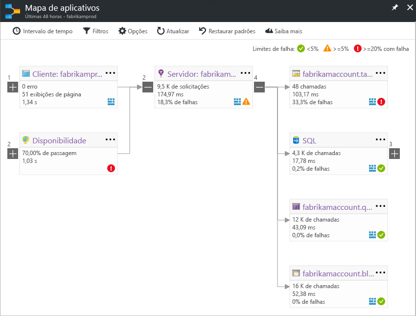

# Mapa de Aplicativos no Application InsightsApplication Map in Application Insights
Em [Azure Application Insights](app-insights-overview.md), mapa de aplicativo é um layout visual de relações de dependência de saudação de componentes do seu aplicativo.In [Azure Application Insights](app-insights-overview.md), Application Map is a visual layout of hello dependency relationships of your application components. Cada componente mostra KPIs como toohelp de carga, desempenho, falhas e alertas, você descobrir qualquer componente causando um problema de desempenho ou falha.Each component shows KPIs such as load, performance, failures, and alerts, toohelp you discover any component causing a performance issue or failure. Você pode clicar por meio de qualquer componente toomore detalhadas de diagnóstico, como eventos do Application Insights.You can click through from any component toomore detailed diagnostics, such as Application Insights events. Se seu aplicativo usa os serviços do Azure, você também pode clicar tooAzure diagnóstico, como as recomendações do Orientador de banco de dados SQL.If your app uses Azure services, you can also click through tooAzure diagnostics, such as SQL Database Advisor recommendations.

Como outros gráficos, você pode fixar um toohello de mapa de aplicativo do painel do Azure, onde ela será totalmente funcional.Like other charts, you can pin an application map toohello Azure dashboard, where it is fully functional. 

## Mapa de aplicativo hello abertoOpen hello application map
Olá abrir o mapa da folha de visão geral de saudação para seu aplicativo:Open hello map from hello overview blade for your application:

mapa de saudação mostra:hello map shows:

* Testes de disponibilidadeAvailability tests
* Componente do lado do cliente (monitorado com hello SDK de JavaScript)Client-side component (monitored with hello JavaScript SDK)
* Componente do lado do servidorServer-side component
* Dependências de componentes de cliente e servidor de saudaçãoDependencies of hello client and server components

Você pode expandir e recolher grupos de link de dependência:You can expand and collapse dependency link groups:

Se você tiver muitas dependências de um tipo (SQL, HTTP, etc.), elas poderão aparecer agrupadas.If you have many dependencies of one type (SQL, HTTP etc.), they may appear grouped. 

## Identificar problemasSpot problems
Cada nó tem indicadores de desempenho relevantes, como taxas de falha de carga e desempenho Olá para esse componente.Each node has relevant performance indicators, such as hello load, performance, and failure rates for that component. 

Ícones de aviso destacam possíveis problemas.Warning icons highlight possible problems. Um aviso laranja significa que existem falhas em solicitações, exibições de página ou chamadas de dependência.An orange warning means there are failures in requests, page views or dependency calls. Vermelho significa uma taxa de falha acima de 5%.Red means a failure rate above 5%. Se você quiser tooadjust esses limites, abra Opções.If you want tooadjust these thresholds, open Options.

Alertas ativos também aparecem:Active alerts also show up: 

Se você usa o SQL Azure, há um ícone que mostra quando há recomendações sobre como melhorar o desempenho.If you use SQL Azure, there's an icon that shows when there are recommendations on how you can improve performance. 

Clique em qualquer ícone tooget mais detalhes:Click any icon tooget more details:

## Clique para DiagnósticoDiagnostic click through
Cada um de nós de saudação no mapa de saudação oferece destino de cliques para diagnóstico.Each of hello nodes on hello map offers targeted click through for diagnostics. Opções de saudação variam dependendo do tipo de saudação do nó de saudação.hello options vary depending on hello type of hello node.

Para componentes que são hospedadas no Azure, as opções de saudação incluem toothem links diretos.For components that are hosted in Azure, hello options include direct links toothem.

## Filtros e o intervalo de tempoFilters and time range
Por padrão, o mapa de Olá resume todos os dados de saudação disponíveis para Olá escolhido o intervalo de tempo.By default, hello map summarizes all hello data available for hello chosen time range. Mas você pode filtrar nomes de operação específica somente tooinclude ou dependências.But you can filter it tooinclude only specific operation names or dependencies.

* Nome da operação: isso inclui tipos de solicitação do lado servidor e exibições de página.Operation name: This includes both page views and server-side request types. Com essa opção, a saudação mapa mostra Olá KPI no nó de servidor/cliente Olá Olá selecionada apenas para operações.With this option, hello map shows hello KPI on hello server/client-side node for hello selected operations only. Ele mostra dependências Olá chamadas no contexto de saudação dessas operações específicas.It shows hello dependencies called in hello context of those specific operations.
* Nome de base de dependência: Isso inclui Olá AJAX navegador dependências e do lado do servidor.Dependency base name: This includes hello AJAX browser dependencies and server-side dependencies. Se o relatório de telemetria de dependência personalizada com hello TrackDependency API, elas também aparecerão aqui.If you report custom dependency telemetry with hello TrackDependency API, they also appear here. Você pode selecionar Olá dependências tooshow no mapa de saudação.You can select hello dependencies tooshow on hello map. Atualmente esta seleção não filtrar solicitações do lado do servidor de saudação ou exibições saudação do cliente.Currently this selection does not filter hello server-side requests, or hello client-side page views.

## Salvar filtrosSave filters
filtros de saudação toosave você aplicou, Olá pin filtrados exibição para um [painel](app-insights-dashboards.md).toosave hello filters you have applied, pin hello filtered view onto a [dashboard](app-insights-dashboards.md).

## Painel de errosError pane
Quando você clica em um nó no mapa Olá, um painel de erro é exibido no lado direito de saudação resumindo falhas para esse nó.When you click a node in hello map, an error pane is displayed on hello right-hand side summarizing failures for that node. As falhas são agrupadas primeiro segundo a ID da operação e, em seguida, segundo a ID do problema.Failures are grouped first by operation ID and then grouped by problem ID.

Clicando em uma falha de usa a instância mais recente toohello essa falha.Clicking on a failure takes you toohello most recent instance of that failure.

## Integridade de recursosResource health
Para alguns tipos de recurso, integridade de recursos é exibida na parte superior de saudação do painel de erro hello.For some resource types, resource health is displayed at hello top of hello error pane. Por exemplo, clicando em um nó do SQL mostrará integridade de banco de dados de saudação e todos os alertas que tenham disparado.For example, clicking a SQL node will show hello database health and any alerts that have fired.

Você pode clicar em métricas de visão geral padrão de tooview Olá recursos nome para esse recurso.You can click hello resource name tooview standard overview metrics for that resource.

## Mapas de aplicativos do sistema de ponta a pontaEnd-to-end system app maps

*Requer o SDK versão 2.3 ou superior**Requires SDK version 2.3 or higher*

Se seu aplicativo tiver vários componentes - por exemplo, um serviço back-end além de aplicativo da web de toohello - em seguida, você pode mostrá-los todos no mapa de um aplicativo integrado.If your application has several components - for example, a back-end service in addition toohello web app - then you can show them all on one integrated app map.

mapa de aplicativo Hello localiza nós de servidor seguindo qualquer chamada de dependência HTTP feita entre os servidores com hello que Application Insights SDK instalado.hello app map finds server nodes by following any HTTP dependency calls made between servers with hello Application Insights SDK installed. Cada recurso do Application Insights será considerado toocontain um servidor.Each Application Insights resource is assumed toocontain one server.

### Mapa do aplicativo com várias funções (versão prévia)Multi-role app map (preview)

recurso de mapa de aplicativo de várias funções de visualização Olá permite toouse Olá aplicativo mapa com vários servidores de envio de dados toohello mesmo recurso Application Insights / chave de instrumentação.hello preview multi-role app map feature allows you toouse hello app map with multiple servers sending data toohello same Application Insights resource  / instrumentation key. Servidores no mapa de saudação são segmentadas por propriedade de cloud_RoleName Olá em itens de telemetria.Servers in hello map are segmented by hello cloud_RoleName property on telemetry items. Definir *mapa de aplicativos de várias funções* muito*na* de Olá visualizações folha tooenable essa configuração.Set *Multi-role Application Map* too*On* from hello Previews blade tooenable this configuration.

Essa abordagem pode ser desejável em um aplicativo de microsserviços ou em outros cenários onde você deseja toocorrelate eventos em vários servidores em um único recurso do Application Insights.This approach may be desired in a micro-services application, or in other scenarios where you want toocorrelate events across multiple servers within a single Application Insights resource.

## VídeoVideo

> [!VIDEO https://channel9.msdn.com/events/Connect/2016/112/player] 

## ComentáriosFeedback
Forneça comentários por meio da opção de comentários do portal de saudação.Please provide feedback through hello portal feedback option.

## Próximas etapasNext steps

* [Portal do AzureAzure portal](https://portal.azure.com)
