# Visão geral do Application Insights para DevOpsOverview of Application Insights for DevOps

Ajuda do [Application Insights ](app-insights-overview.md), você pode encontrar rapidamente qual é o desempenho do seu aplicativo e como está sendo usado quando ele estiver ativo.With [Application Insights](app-insights-overview.md), you can quickly find out how your app is performing and being used when it's live. Se houver algum problema, ele permite que você saiba, ajuda a avaliar o impacto e ajuda a determinar a causa.If there's a problem, it lets you know about it, helps you assess the impact, and helps you determine the cause.

Aqui está uma conta de uma equipe que desenvolve aplicativos da Web:Here's an account from a team that develops web applications:

* *"Alguns dias atrás, implantamos um hotfix “secundário”. Não executamos uma aprovação de teste ampla, mas infelizmente algumas alterações inesperadas foram mescladas à carga, gerando incompatibilidade entre o front-end e back-end. Imediatamente as exceções de servidor aumentaram drasticamente, nosso alerta disparou e fomos informados sobre a situação. Alguns cliques no portal do Application Insights, temos informações suficientes de pilhas de chamadas de exceção para restringir o problema. Revertemos imediatamente e limitamos os danos. O Application Insights tornou essa parte do ciclo das Operações de Desenvolvimento muito fácil e prática."**"A couple of days ago, we deployed a 'minor' hotfix. We didn't run a broad test pass, but unfortunately some unexpected change got merged into the payload, causing incompatibility between the front and back ends. Immediately, server exceptions surged, our alert fired, and we were made aware of the situation. A few clicks away on the Application Insights portal, we got enough information from exception callstacks to narrow down the problem. We rolled back immediately and limited the damage. Application Insights has made this part of the devops cycle very easy and actionable."*

Neste artigo, acompanhamos uma equipe do banco da Fabrikam que desenvolve o sistema de serviços bancários online (OBS) para ver como eles usam Application Insights para responder aos clientes rapidamente e faça as atualizações.In this article we follow a team in Fabrikam Bank that develops the online banking system (OBS) to see how they use Application Insights to quickly respond to customers and make updates.  

A equipe trabalha em um ciclo de DevOps mostrado na ilustração a seguir:The team works on a DevOps cycle depicted in the following illustration:

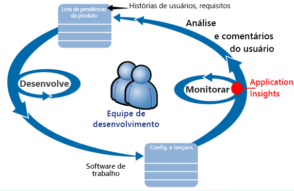

Requisitos de feed em sua lista de pendências de desenvolvimento (lista de tarefas).Requirements feed into their development backlog (task list). Eles trabalham em impressões curtas, o que geralmente entrega software de trabalho, normalmente na forma de melhorias e extensões para o aplicativo existente.They work in short sprints, which often deliver working software - usually in the form of improvements and extensions to the existing application. O aplicativo ativo é frequentemente atualizado com novos recursos.The live app is frequently updated with new features. Enquanto estiver ativo, a equipe monitora-o para uso com a ajuda do Application Insights e desempenho.While it's live, the team monitors it for performance and usage with the help of Application Insights. Esses dados do APM voltam para sua lista de pendências de desenvolvimento.This APM data feeds back into their development backlog.

A equipe usa o Application Insights para monitorar o aplicativo Web ao vivo de perto em relação a/ao:The team uses Application Insights to monitor the live web application closely for:

* Desempenho.Performance. Eles querem entender como os tempos de resposta variam de acordo com a contagem de solicitações; quantos recursos de CPU, rede, disco e outros recursos estão sendo usados; e onde estão os afunilamentos.They want to understand how response times vary with request count; how much CPU, network, disk, and other resources are being used; and where the bottlenecks are.
* Falhas.Failures. Se houver exceções ou solicitações com falha, ou se um contador de desempenho ficar fora de seu intervalo confortável, a equipe precisará saber disso rapidamente para que possam tomar as devidas providências.If there are exceptions or failed requests, or if a performance counter goes outside its comfortable range, the team needs to know rapidly so that they can take action.
* Uso.Usage. Sempre que um novo recurso for liberado, a equipe deseja saber até que ponto é usado e os usuários tenham alguma dificuldade com ele.Whenever a new feature is released, the team want to know to what extent it is used, and whether users have any difficulties with it.

Vamos nos concentrar na parte do ciclo de comentários:Let's focus on the feedback part of the cycle:

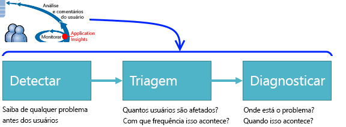

## Detectar baixa disponibilidadeDetect poor availability
Manuela Moraes é desenvolvedora sênior da equipe de OBS e assume a liderança no monitoramento do desempenho online.Marcela Markova is a senior developer on the OBS team, and takes the lead on monitoring online performance. Ela define vários [testes de disponibilidade](app-insights-monitor-web-app-availability.md):She sets up several [availability tests](app-insights-monitor-web-app-availability.md):

* Um teste de URL única para a página de aterrissagem principal para o aplicativo, http://fabrikambank.com/onlinebanking/.A single-URL test for the main landing page for the app, http://fabrikambank.com/onlinebanking/. Ela define os critérios de código HTTP 200 e o texto “Bem-vindo!”.She sets criteria of HTTP code 200 and text 'Welcome!'. Se esse teste falhar, há algum problema sério com a rede ou os servidores, ou talvez um problema de implantação.If this test fails, there's something seriously wrong with the network or the servers, or maybe a deployment issue. (Ou alguém alterou a mensagem de boas-vindas(Or someone has changed the Welcome! na página sem informá-la.)message on the page without letting her know.)
* Um teste de várias etapas mais aprofundado, que faz logon e obtém uma listagem atual das contas, verificando alguns detalhes principais em cada página.A deeper multi-step test, which logs in and gets a current account listing, checking a few key details on each page. Esse teste verifica se o link para o banco de dados de contas está funcionando.This test verifies that the link to the accounts database is working. Ela usa uma ID do cliente fictícia: algumas delas são mantidas para fins de teste.She uses a fictitious customer id: a few of them are maintained for test purposes.

Com esses testes configurados, Marcela está confiante de que a equipe saberá rapidamente sobre qualquer interrupção.With these tests set up, Marcela is confident that the team will quickly know about any outage.  

Falhas aparecem como pontos vermelhos no gráfico de teste da Web:Failures show up as red dots on the web test chart:

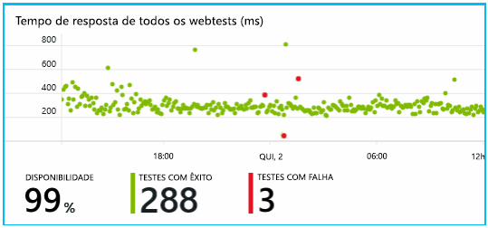

Mas o mais importante, um alerta sobre qualquer falha é enviado por e-mail à equipe de desenvolvimento.But more importantly, an alert about any failure is emailed to the development team. Desse modo, eles são informados sobre isso antes de quase todos os clientes.In that way, they know about it before nearly all the customers.

## Monitorar o desempenhoMonitor Performance
Na mesma página de visão geral do Application Insights, há um gráfico que mostra as [principais métricas](app-insights-web-monitor-performance.md).On the overview page in Application Insights, there's a chart that shows a variety of [key metrics](app-insights-web-monitor-performance.md).

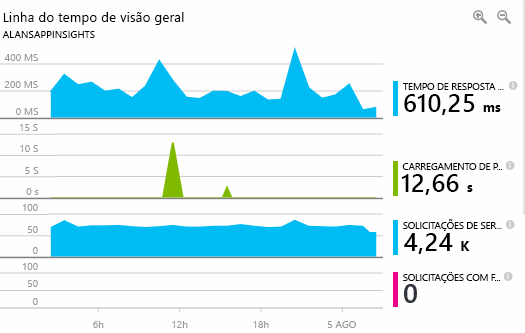

O tempo de carregamento de página do navegador é derivado da telemetria enviada diretamente a partir de páginas da Web.Browser page load time is derived from telemetry sent directly from web pages. O tempo de resposta do servidor, a contagem de solicitações do servidor e a contagem de solicitações com falha são todos medidos no servidor Web e enviados para o Application Insights do servidor Web.Server response time, server request count, and failed request count are all measured in the web server and sent to Application Insights from there.

Marcela está um pouco preocupada com o gráfico de resposta do servidor.Marcela is slightly concerned with the server response graph. Esse gráfico mostra o tempo médio entre o tempo em que o servidor recebe uma solicitação HTTP do navegador de um usuário e o tempo em que ele retorna a resposta.This graph shows the average time between when the server receives an HTTP request from a user's browser, and when it returns the response. Não é incomum ver uma variação nesse gráfico, uma vez que a carga do sistema varia.It isn't unusual to see a variation in this chart, as load on the system varies. Todavia, nesse caso, parece haver que uma correlação entre pequenos aumentos na contagem de solicitações e grandes aumentos no tempo de resposta.But in this case, there seems to be a correlation between small rises in the count of requests, and big rises in the response time. Isso poderia indicar que o sistema está funcionando exatamente nos limites.That could indicate that the system is operating just at its limits.

Ela abre os gráficos de Servidores:She opens the Servers charts:

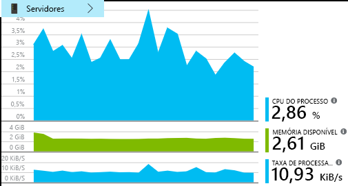

Parece não haver nenhum sinal de limitação de recursos; portanto, talvez os impactos nos gráficos de resposta do servidor sejam apenas uma coincidência.There seems to be no sign of resource limitation there, so maybe the bumps in the server response charts are just a coincidence.

## Definir alertas para atender às metasSet alerts to meet goals
No entanto, ela gostaria de acompanhar os tempos de resposta.Nevertheless, she'd like to keep an eye on the response times. Se eles ficarem muito altos, ela desejará saber disso imediatamente.If they go too high, she wants to know about it immediately.

Portanto, ela define um [alerta](app-insights-metrics-explorer.md) para tempos de resposta maiores do que um limite típico.So she sets an [alert](app-insights-metrics-explorer.md), for response times greater than a typical threshold. Isso lhe dá a certeza de que será informada sobre isso caso os tempos de resposta sejam lentos.This gives her confidence that she'll know about it if response times are slow.

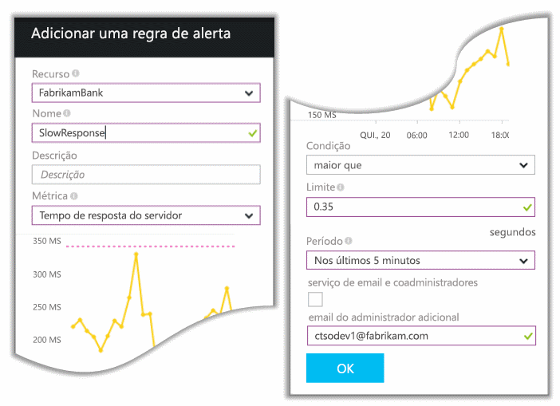

Alertas podem ser definidos em uma grande variedade de outras métricas.Alerts can be set on a wide variety of other metrics. Por exemplo, você pode receber emails se a contagem de exceções aumentar excessivamente ou se a memória disponível tornar-se baixa demais, ou ainda se houver um pico em solicitações de cliente.For example, you can receive emails if the exception count becomes high, or the available memory goes low, or if there is a peak in client requests.

## Mantenha-se informado com Alertas de detecção inteligenteStay informed with Smart Detection Alerts
No dia seguinte, chega um email de alerta do Application Insights.Next day, an alert email does arrive from Application Insights. Mas quando ela o abre, descobre que não é o alerta de tempo de resposta que ela definiu.But when she opens it, she finds it isn't the response time alert that she set. Em vez disso, ele informa que houve um aumento repentino de solicitações com falha – ou seja, solicitações que retornaram códigos de falha de 500 ou mais.Instead, it tells her there's been a sudden rise in failed requests - that is, requests that have returned failure codes of 500 or more.

As solicitações com falha indicam casos em que os usuários viram um erro – geralmente, após uma exceção lançada no código.Failed requests are where users have seen an error - typically following an exception thrown in the code. Talvez eles recebam uma mensagem informando “Desculpe, não foi possível atualizar os detalhes no momento”.Maybe they see a message saying "Sorry we couldn't update your details right now." Ou, na pior das situações constrangedoras, um despejo de pilha é exibido na tela do usuário, cortesia do servidor Web.Or, at absolute embarrassing worst, a stack dump appears on the user's screen, courtesy of the web server.

Esse alerta é uma surpresa, pois a última vez que ela o examinou, a contagem de solicitações com falha felizmente era baixo.This alert is a surprise, because the last time she looked at it, the failed request count was encouragingly low. Um pequeno número de falhas é esperado em um servidor ocupado.A small number of failures is to be expected in a busy server.

Isso também foi um pouco surpreendente para ela, pois ela não precisou configurar esse alerta.It was also a bit of a surprise for her because she didn't have to configure this alert. Application Insights inclui Detecção Inteligente.Application Insights include Smart Detection. Ele se ajusta automaticamente ao padrão de falha comum de seu aplicativo e “se acostuma” com as falhas em uma página específica, fica abaixo da carga alta ou é vinculado a outras métricas.It automatically adjusts to your app's usual failure pattern, and "gets used to" failures on a particular page, or under high load, or linked to other metrics. Ele gera o alarme somente se há um aumento acima do que é esperado.It raises the alarm only if there's a rise above what it comes to expect.

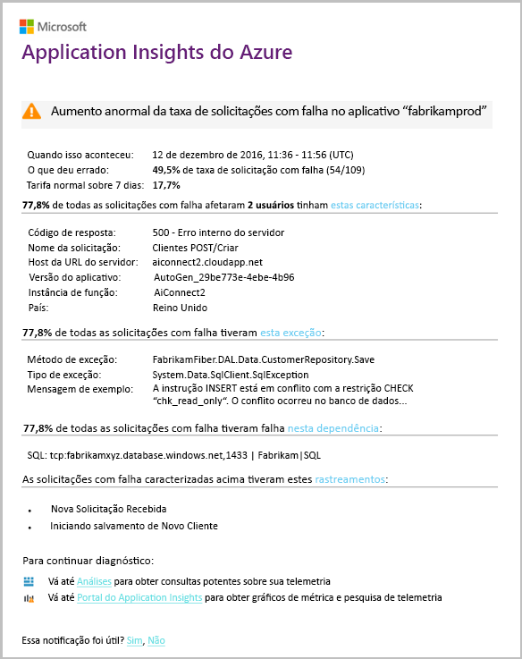

Este é um email muito útil.This is a very useful email. Ele não apenas aciona um alarme.It doesn't just raise an alarm. Ele faz grande parte da triagem e do trabalho de diagnóstico também.It does a lot of the triage and diagnostic work, too.

Mostra quantos clientes foram afetados e em quais páginas da Web ou operações.It shows how many customers are affected, and which web pages or operations. Manuela pode decidir se precisa convocar toda a equipe para trabalhar nisso como em um treinamento contra incêndio ou se isso pode ser ignorado até a semana seguinte.Marcela can decide whether she needs to get the whole team working on this as a fire drill, or whether it can be ignored until next week.

O email também mostra que uma exceção específica ocorreu e – o mais interessante – que a falha está associada a chamadas com falha para determinado banco de dados.The email also shows that a particular exception occurred, and - even more interesting - that the failure is associated with failed calls to a particular database. Isso explica o motivo pelo qual a falha apareceu de repente, mesmo que a equipe de Manuela não tenha implantado nenhuma atualização recentemente.This explains why the fault suddenly appeared even though Marcela's team has not deployed any updates recently.

Marcella executa ping líder da equipe do banco de dados com base neste email.Marcella pings the leader of the database team based on this email. Sim descobre que eles lançaram um hotfix há meia hora atrás e, opa, talvez tenha havido uma mudança de esquema secundária...She learns that they released a hot fix in the past half hour; and Oops, maybe there might have been a minor schema change....

Portanto, o problema está prestes a ser corrigido, mesmo antes da investigação dos logs e em até 15 minutos após sua ocorrência.So the problem is on the way to being fixed, even before investigating logs, and within 15 minutes of it arising. No entanto, Manuela clica no link para abrir o Application Insights.However, Marcela clicks the link to open Application Insights. Ele é aberto exatamente em uma solicitação com falha, e ela pode ver a chamada com falha do banco de dados na lista associada de chamadas de dependência.It opens straight onto a failed request, and she can see the failed database call in the associated list of dependency calls.

## Detectar exceçõesDetect exceptions
Com um pouco de configuração, as [exceções](app-insights-asp-net-exceptions.md) são relatadas ao Application Insights automaticamente.With a little bit of setup, [exceptions](app-insights-asp-net-exceptions.md) are reported to Application Insights automatically. Elas podem também ser capturadas explicitamente inserindo chamadas para [TrackException()](app-insights-api-custom-events-metrics.md#trackexception) no código:They can also be captured explicitly by inserting calls to [TrackException()](app-insights-api-custom-events-metrics.md#trackexception) into the code:  

    var telemetry = new TelemetryClient();
    ...
    try
    { ...
    }
    catch (Exception ex)
    {
       // Set up some properties:
       var properties = new Dictionary <string, string>
         {{"Game", currentGame.Name}};

       var measurements = new Dictionary <string, double>
         {{"Users", currentGame.Users.Count}};

       // Send the exception telemetry:
       telemetry.TrackException(ex, properties, measurements);
    }

A equipe do Fabrikam Bank evoluiu na prática de sempre enviar telemetria em uma exceção, a menos que haja uma óbvia recuperação.The Fabrikam Bank team has evolved the practice of always sending telemetry on an exception, unless there's an obvious recovery.  

Na verdade, a estratégia deles é ainda mais ampla do que isso: enviam telemetria em todos os casos nos quais o cliente está frustrado em relação ao que queria fazer, independentemente de isto corresponder a uma exceção no código ou não.In fact, their strategy is even broader than that: They send telemetry in every case where the customer is frustrated in what they wanted to do, whether it corresponds to an exception in the code or not. Por exemplo, se o sistema de transferência externa interbancária retorna uma mensagem "não é possível concluir esta transação" por algum motivo operacional (sem culpa do cliente), eles acompanham esse evento.For example, if the external inter-bank transfer system returns a "can't complete this transaction" message for some operational reason (no fault of the customer) then they track that event.

    var successCode = AttemptTransfer(transferAmount, ...);
    if (successCode < 0)
    {
       var properties = new Dictionary <string, string>
            {{ "Code", returnCode, ... }};
       var measurements = new Dictionary <string, double>
         {{"Value", transferAmount}};
       telemetry.TrackEvent("transfer failed", properties, measurements);
    }

TrackException é usado para relatar exceções porque ele envia uma cópia da pilha.TrackException is used to report exceptions because it sends a copy of the stack. TrackEvent é usado para relatar outros eventos.TrackEvent is used to report other events. Você pode anexar as propriedades que podem ser úteis no diagnóstico.You can attach any properties that might be useful in diagnosis.

Exceções e eventos aparecem na folha [Pesquisa de diagnóstico](app-insights-diagnostic-search.md).Exceptions and events show up in the [Diagnostic Search](app-insights-diagnostic-search.md) blade. Você pode analisar para ver as propriedades adicionais e o rastreamento de pilha.You can drill into them to see the additional properties and stack trace.

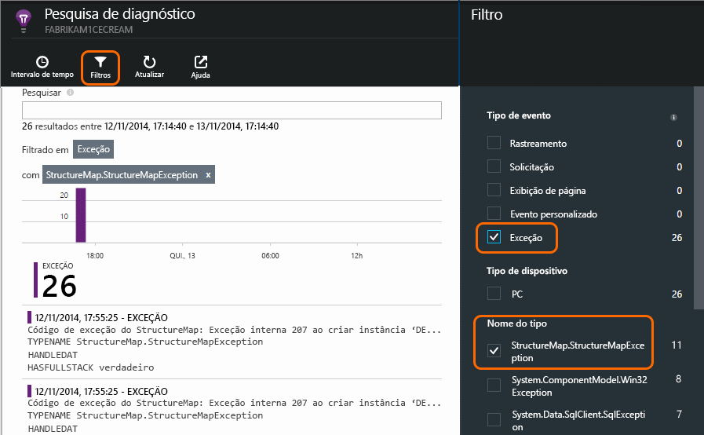

## Monitorar proativamenteMonitor proactively
Marcela não fica apenas sentada esperando por alertas.Marcela doesn't just sit around waiting for alerts. Logo após cada reimplantação, ela examina [tempos de resposta](app-insights-web-monitor-performance.md) -tanto o quadro geral e a tabela de solicitações mais lentas quanto as contagens de exceção.Soon after every redeployment, she takes a look at [response times](app-insights-web-monitor-performance.md) - both the overall figure and the table of slowest requests, as well as exception counts.  

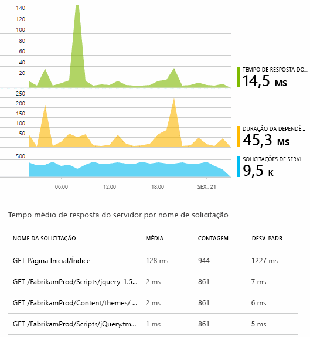

Ela pode avaliar o efeito no desempenho de cada implantação, geralmente comparando cada semana com a última.She can assess the performance effect of every deployment, typically comparing each week with the last. Se houver uma deterioração repentina do quadro, ela levanta a questão com os desenvolvedores relevantes.If there's a sudden worsening, she raises that with the relevant developers.

## Problemas de triagemTriage issues
Triagem - avaliar a gravidade e a extensão de um problema - é a primeira etapa depois da detecção.Triage - assessing the severity and extent of a problem - is the first step after detection. Devemos chamar a equipe à meia-noite?Should we call out the team at midnight? Ou o problema pode esperar até o próximo intervalo conveniente na lista de pendências?Or can it be left until the next convenient gap in the backlog? Há algumas perguntas cruciais na triagem.There are some key questions in triage.

Com que frequência está acontecendo?How often is it happening? Os gráficos na folha visão geral oferecem alguma perspectiva para um problema.The charts on the Overview blade give some perspective to a problem. Por exemplo, o aplicativo da Fabrikam gerou quatro alertas de teste da Web em uma noite.For example, the Fabrikam application generated four web test alerts one night. Examinando o gráfico pela manhã, a equipe pôde ver que existiam realmente alguns pontos vermelhos, embora a maioria dos testes tenham resultado em verde.Looking at the chart in the morning, the team could see that there were indeed some red dots, though still most of the tests were green. Detalhando o gráfico de disponibilidade, ficou claro que todos esses problemas intermitentes eram de um local de teste.Drilling into the availability chart, it was clear that all of these intermittent problems were from one test location. Isso, obviamente, foi um problema de rede que afetou somente uma rota e provavelmente se resolveria sozinho.This was obviously a network issue affecting only one route, and would most likely clear itself.  

Por outro lado, um aumento drástico e estável no gráfico de tempos de resposta ou contagens de exceção é, obviamente, motivo para pânico.By contrast, a dramatic and stable rise in the graph of exception counts or response times is obviously something to panic about.

Uma tática de triagem útil é “Experimente você mesmo”.A useful triage tactic is Try It Yourself. Se você tiver o mesmo problema, saberá que ele é real.If you run into the same problem, you know it's real.

Que fração dos usuários são afetados?What fraction of users are affected? Para obter uma resposta aproximada, divida a taxa de falha pela contagem de sessão.To obtain a rough answer, divide the failure rate by the session count.

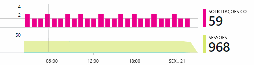

Quando há respostas lentas, compare a tabela das solicitações com respostas mais lentas com a frequência de uso de cada página.When there are slow responses, compare the table of slowest-responding requests with the usage frequency of each page.

Quão importante é o cenário bloqueado?How important is the blocked scenario? Se esse for um problema funcional bloqueando uma história de usuário específica, isso importa muito?If this is a functional problem blocking a particular user story, does it matter much? Se os clientes não podem pagar suas contas, isso é sério; se eles não podem alterar suas preferências de cor da tela, talvez isso possa esperar.If customers can't pay their bills, this is serious; if they can't change their screen color preferences, maybe it can wait. Os detalhes do evento ou da exceção, ou a identidade da página lenta, informam onde os clientes estão tendo problemas.The detail of the event or exception, or the identity of the slow page, tells you where customers are having trouble.

## Diagnosticar problemasDiagnose issues
O diagnóstico não é exatamente o mesmo que depuração.Diagnosis isn't quite the same as debugging. Antes de iniciar o rastreamento por meio do código, você deve ter uma ideia de porquê, de quando e de onde o problema está ocorrendo.Before you start tracing through the code, you should have a rough idea of why, where and when the issue is occurring.

**Quando isso acontece?****When does it happen?** A exibição do histórico fornecida pelos gráficos de evento e de métrica facilita correlacionar os efeitos e as possíveis causas.The historical view provided by the event and metric charts makes it easy to correlate effects with possible causes. Se houver picos intermitentes em taxas de exceção ou de tempo de resposta, examine a contagem de solicitações: se eles atingirem o pico ao mesmo tempo, o cenário parece com o de um problema de recurso.If there are intermittent peaks in response time or exception rates, look at the request count: if it peaks at the same time, then it looks like a resource problem. Você precisa atribuir mais CPU ou memória?Do you need to assign more CPU or memory? Ou é uma dependência que não é capaz de dar conta da carga?Or is it a dependency that can't manage the load?

**O problema é conosco?****Is it us?**  Se você tiver uma queda repentina no desempenho de um determinado tipo de solicitação - por exemplo, quando o cliente deseja um demonstrativo de conta - há uma possibilidade de ser um subsistema externo em vez de seu aplicativo Web.If you have a sudden drop in performance of a particular type of request - for example when the customer wants an account statement - then there's a possibility it might be an external subsystem rather than your web application. No Metrics Explorer, selecione a taxa de falha de dependência e taxas de duração da dependência e compare seus históricos pelas últimas horas ou dias ao problema que é detectado.In Metrics Explorer, select the Dependency Failure rate and Dependency Duration rates and compare their histories over the past few hours or days with the problem you detected. Se há alterações correlacionadas, um subsistema externo pode ser a causa.If there are correlating changes, then an external subsystem might be to blame.  

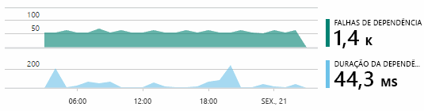

Alguns problemas de dependência de lentidão são problemas de localização geográfica.Some slow dependency issues are geolocation problems. O Fabrikam Bank usa máquinas virtuais do Azure, e descobriu que eles tinham inadvertidamente localizado seu servidor Web e servidor de conta em diferentes países.Fabrikam Bank uses Azure virtual machines, and discovered that they had inadvertently located their web server and account server in different countries. Obtiveram uma melhoria expressiva migrando um deles.A dramatic improvement was brought about by migrating one of them.

**O que fizemos?****What did we do?** Se o problema não parece estar em uma dependência e se não esteve sempre lá, provavelmente é causado por uma alteração recente.If the issue doesn't appear to be in a dependency, and if it wasn't always there, it's probably caused by a recent change. A perspectiva histórica fornecida pelos gráficos de métrica e evento facilita correlacionar alterações repentinas com implantações.The historical perspective provided by the metric and event charts makes it easy to correlate any sudden changes with deployments. Isso reduz o escopo da busca pelo problema.That narrows down the search for the problem.

**O que está acontecendo?****What's going on?** Alguns problemas ocorrem apenas raramente e podem ser difíceis de rastrear por testes offline.Some problems occur only rarely and can be difficult to track down by testing offline. Tudo o que podemos fazer é tentar capturar o bug quando ele ocorre, em tempo real.All we can do is to try to capture the bug when it occurs live. Você pode inspecionar os despejos de pilha em relatórios de exceção.You can inspect the stack dumps in exception reports. Além disso, é possível escrever chamadas de rastreamento, com sua estrutura de registros favorita ou com TrackTrace() ou TrackEvent().In addition, you can write tracing calls, either with your favorite logging framework or with TrackTrace() or TrackEvent().  

A Fabrikam tinha um problema intermitente com transferências entre contas, mas apenas com determinados tipos de conta.Fabrikam had an intermittent problem with inter-account transfers, but only with certain account types. Para entender melhor o que estava acontecendo, eles inseriram chamadas TrackTrace() em pontos-chave do código, anexando o tipo de conta como uma propriedade para cada chamada.To understand better what was happening, they inserted TrackTrace() calls at key points in the code, attaching the account type as a property to each call. Isso facilitou filtrar apenas esses rastreamentos na pesquisa de diagnóstico.That made it easy to filter out just those traces in Diagnostic Search. Eles também anexaram valores de parâmetro, como propriedades e medidas, às chamadas de rastreamento.They also attached parameter values as properties and measures to the trace calls.

## Responder a problemas descobertosRespond to discovered issues
Depois de diagnosticar o problema, você pode fazer um plano para corrigi-lo.Once you've diagnosed the issue, you can make a plan to fix it. Talvez você precise reverter uma alteração recente, ou talvez você possa simplesmente seguir em frente e corrigir o problema.Maybe you need to roll back a recent change, or maybe you can just go ahead and fix it. Quando a correção tiver sido realizada, o Application Insights lhe diz se o processo foi bem-sucedido.Once the fix is done, Application Insights tells you whether you succeeded.  

A equipe de desenvolvimento do banco da Fabrikam utiliza uma abordagem mais estruturada para medição de desempenho do que costumava utilizar antes do Application Insights.Fabrikam Bank's development team take a more structured approach to performance measurement than they used to before they used Application Insights.

* Eles definem metas de desempenho em termos de medidas específicas na página de visão geral do Application Insights.They set performance targets in terms of specific measures in the Application Insights overview page.
* Eles criam medidas de desempenho no aplicativo desde o início, como as métricas que medem o progresso do usuário por meio de “funis”.They design performance measures into the application from the start, such as the metrics that measure user progress through 'funnels.'  

## Monitorar as atividades do usuárioMonitor user activity
Quando o tempo de resposta é constantemente bom e há algumas exceções, a equipe de desenvolvimento pode passar a trabalhar na usabilidade.When response time is consistently good and there are few exceptions, the dev team can move on to usability. Ela pode pensar em como melhorar a experiência dos usuários e como incentivar mais usuários a atingir as metas desejadas.They can think about how to improve the users' experience, and how to encourage more users to achieve the desired goals.

O Application Insights também pode ser usado para saber o que os usuários fazem com um aplicativo.Application Insights can also be used to learn what users do with an app. Depois que ele é executado sem problemas, a equipe gostaria de saber quais recursos são os mais populares, do que os usuários gostam ou com o que têm dificuldade e com que frequência eles retornam.Once it's running smoothly, the team would like to know which features are the most popular, what users like or have difficulty with, and how often they come back. Isso os ajudará a definir as prioridades para seus futuros trabalhos.That will help them prioritize their upcoming work. Além disso, eles podem planejar medir o sucesso de cada recurso como parte do ciclo de desenvolvimento.And they can plan to measure the success of each feature as part of the development cycle. 

Por exemplo, uma jornada típica do usuário pelo site tem um “funil” claro.For example, a typical user journey through the web site has a clear "funnel." Muitos clientes examinam as taxas de diferentes tipos de empréstimo.Many customers look at the rates of different types of loan. Um número menor segue para o preenchimento do formulário de cotação.A smaller number go on to fill in the quotation form. Dentre aqueles que recebem uma cotação, poucos seguem em frente e realizam o empréstimo.Of those who get a quotation, a few go ahead and take out the loan.

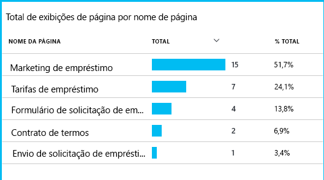

Considerando onde os números maiores de clientes caem, a empresa pode trabalhar em como conseguir mais usuários na parte inferior do funil.By considering where the greatest numbers of customers drop out, the business can work out how to get more users through to the bottom of the funnel. Em alguns casos, pode haver uma falha de experiência do usuário – por exemplo, o botão “Avançar” é difícil de ser encontrado ou as instruções não são óbvias.In some cases, there might be a user experience (UX) failure - for example, the 'next' button is hard to find, or the instructions aren't obvious. Provavelmente, existem motivos de negócio mais significativos para transferências de depósito: talvez as taxas de empréstimo são muito altas.More likely, there are more significant business reasons for drop-outs: maybe the loan rates are too high.

Sejam quais forem as razões, os dados ajudam a equipe a descobrir o que os usuários estão fazendo.Whatever the reasons, the data helps the team work out what users are doing. Mais chamadas de rastreamento podem ser inseridas para descobrir mais detalhes.More tracking calls can be inserted to work out more detail. TrackEvent() pode ser usado para a contagem de todas as ações do usuário, desde os detalhes de cliques de botão individuais até realizações significativas como o pagamento de um empréstimo.TrackEvent() can be used to count any user actions, from the fine detail of individual button clicks, to significant achievements such as paying off a loan.

A equipe está acostumando-se a ter informações sobre a atividade do usuário.The team is getting used to having information about user activity. Hoje em dia, sempre que criam um novo recurso, eles pensam como irão receber comentários sobre seu uso.Nowadays, whenever they design a new feature, they work out how they will get feedback about its usage. Eles criam chamadas de rastreamento para o recurso desde o início.They design tracking calls into the feature from the start. Eles usam os comentários para melhorar o recurso em cada ciclo de desenvolvimento.They use the feedback to improve the feature in each development cycle.

[Leia mais sobre o uso de controle](app-insights-usage-overview.md).[Read more about tracking usage](app-insights-usage-overview.md).

## Aplicar o ciclo de DevOpsApply the DevOps cycle
Portanto, é assim que uma equipe usa o Application Insights não apenas para corrigir problemas individuais, mas para melhorar seu ciclo de vida de desenvolvimento.So that's how one team use Application Insights not just to fix individual issues, but to improve their development lifecycle. Espero que isso tenha dado a você algumas ideias sobre como o Application Insights pode lhe ajudar com o gerenciamento do desempenho dos seus próprios aplicativos.I hope it has given you some ideas about how Application Insights can help you with application performance management in your own applications.

## VídeoVideo

> [!VIDEO https://channel9.msdn.com/events/Connect/2016/112/player]

## Próximas etapasNext steps
Você pode começar de diversas maneiras, dependendo das características do seu aplicativo.You can get started in several ways, depending on the characteristics of your application. Escolha o que lhe convém:Pick what suits you best:

* [Aplicativo web do ASP.NETASP.NET web application](app-insights-asp-net.md)
* [Aplicativo web JavaJava web application](app-insights-java-get-started.md)
* [Aplicativo web do Node.jsNode.js web application](app-insights-nodejs.md)
* Aplicativos já implantados, hospedados em [IIS](app-insights-monitor-web-app-availability.md), [J2EE](app-insights-java-live.md) ou [Azure](app-insights-azure.md).Already deployed apps, hosted on [IIS](app-insights-monitor-web-app-availability.md), [J2EE](app-insights-java-live.md), or [Azure](app-insights-azure.md).
* [Páginas da Web](app-insights-javascript.md) - aplicativo de página única ou página da web comum - use isso por conta própria ou com uma das opções de servidor.[Web pages](app-insights-javascript.md) - Single Page App or ordinary web page - use this on its own or in addition to any of the server options.
* [Testes de disponibilidade](app-insights-monitor-web-app-availability.md) para testar seu aplicativo da internet pública.[Availability tests](app-insights-monitor-web-app-availability.md) to test your app from the public internet.
