# O que é o Application Insights?What is Application Insights?
O Application Insights é um serviço de gerenciamento de desempenho de aplicativo (APM) extensível para desenvolvedores da Web em várias plataformas.Application Insights is an extensible Application Performance Management (APM) service for web developers on multiple platforms. Use-o para monitorar seu aplicativo Web online.Use it to monitor your live web application. Ele detectará anomalias de desempenho automaticamente.It will automatically detect performance anomalies. Ele inclui ferramentas de análise avançadas para ajudar você a diagnosticar problemas e entender o que os usuários realmente fazem com seu aplicativo.It includes powerful analytics tools to help you diagnose issues and to understand what users actually do with your app.  Ele foi projetado para ajudar você a aprimorar continuamente o desempenho e a usabilidade do seu aplicativo.It's designed to help you continuously improve  performance and usability. Ele funciona com aplicativos em uma ampla variedade de plataformas incluindo .NET e J2EE, hospedados localmente ou na nuvem.It works for apps on a wide variety of platforms including .NET, Node.js and J2EE, hosted on-premises or in the cloud. Ele se integra ao seu processo devOps e oferece pontos de conexão para uma ampla variedade de ferramentas de desenvolvimento.It  integrates with your devOps process, and has connection points to a variety of development tools.

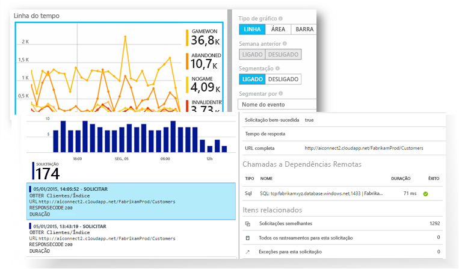

[Confira a animação de introdução](https://www.youtube.com/watch?v=fX2NtGrh-Y0).[Take a look at the intro animation](https://www.youtube.com/watch?v=fX2NtGrh-Y0).

## Como funciona o Application Insights?How does Application Insights work?
Você instala um pacote de instrumentação pequeno em seu aplicativo e configura um recurso Application Insights no portal do Microsoft Azure.You install a small instrumentation package in your application, and set up an Application Insights resource in the Microsoft Azure portal. A instrumentação monitora seu aplicativo e envia os dados de telemetria ao portal.The instrumentation monitors your app and sends telemetry data to the portal. (O aplicativo pode ser executado em qualquer lugar — ele não precisa ser hospedado no Azure.)(The application can run anywhere - it doesn't have to be hosted in Azure.)

Você pode instrumentar não apenas o aplicativo de serviço web, mas também todos os componentes em segundo plano e o JavaScript nas próprias páginas da web.You can instrument not only the web service application, but also any background components, and the JavaScript in the web pages themselves. 

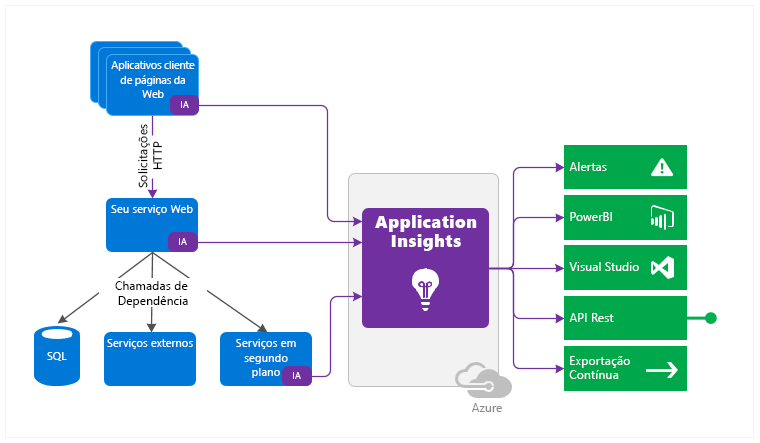

Além disso, você pode efetuar pull de telemetria dos ambientes de host, como contadores de desempenho, diagnóstico do Azure, ou logs de Docker.In addition, you can pull in telemetry from the host environments such as performance counters, Azure diagnostics, or Docker logs. Você também pode configurar testes da web que enviam periodicamente solicitações sintéticas para o serviço web.You can also set up web tests that periodically send synthetic requests to your web service.

Todos esses fluxos de telemetria estão integrados no portal do Azure, onde é possível aplicar ferramentas de pesquisa e analíticas poderosas para os dados brutos.All these telemetry streams are integrated in the Azure portal, where you can apply powerful analytic and search tools to the raw data.

### Qual é a sobrecarga?What's the overhead?
O impacto sobre o desempenho do aplicativo é muito pequeno.The impact on your app's performance is very small. As chamadas de acompanhamento não são bloqueadas, além de serem colocadas em lote e enviadas em um thread separado.Tracking calls are non-blocking, and are batched and sent in a separate thread.

## O que o Application Insights monitora?What does Application Insights monitor?

O Application Insights é indicado para a equipe de desenvolvimento, para ajudá-lo a compreender como está o desempenho de seu aplicativo e como ele está sendo usado.Application Insights is aimed at the development team, to help you understand how your app is performing and how it's being used. Ele monitora:It monitors:

* **Taxas de solicitação, tempos de resposta e taxas de falha** - descubra quais páginas estão mais populares, em que momentos do dia, e onde os usuários estão.**Request rates, response times, and failure rates** - Find out which pages are most popular, at what times of day, and where your users are. Confira as páginas que têm melhor desempenho.See which pages perform best. Se as taxas de falha e os tempos de resposta ficam altos quando há mais solicitações, possivelmente você tem um problema de alocação de recursos.If your response times and failure rates go high when there are more requests, then perhaps you have a resourcing problem. 
* **Taxas de dependência, tempos de resposta e taxas de falha** - descubra se os serviços externos estão atrasando você.**Dependency rates, response times, and failure rates** - Find out whether external services are slowing you down.
* **Exceções** - analisar estatísticas agregadas ou selecionar instâncias específicas e analisar o rastreamento de pilha e as solicitações relacionadas.**Exceptions** - Analyse the aggregated statistics, or pick specific instances and drill into the stack trace and related requests. A maioria das exceções de navegador e servidor são relatadas.Both server and browser exceptions are reported.
* **Exibições de página e o desempenho de carregamento** - relatados por navegadores dos usuários.**Page views and load performance** - reported by your users' browsers.
* **Chamadas AJAX** de páginas da web - taxas, tempos de resposta e taxas de falha.**AJAX calls** from web pages - rates, response times, and failure rates.
* **Contagens de seção e usuários**.**User and session counts**.
* **Contadores de desempenho** de suas máquinas de servidor Linux ou Windows server, como CPU, memória e uso da rede.**Performance counters** from your Windows or Linux server machines, such as CPU, memory, and network usage. 
* **Diagnósticos de host** do Docker ou do Azure.**Host diagnostics** from Docker or Azure. 
* **Logs de rastreamento de diagnóstico** do seu aplicativo - para que você possa correlacionar eventos de rastreamento com solicitações.**Diagnostic trace logs** from your app - so that you can correlate trace events with requests.
* **Métricas e eventos personalizados** que você escreve em código de cliente ou servidor, para acompanhar os eventos de negócios, como itens vendidos ou vitórias.**Custom events and metrics** that you write yourself in the client or server code, to track business events such as items sold or games won.

## Onde posso encontrar minha telemetria?Where do I see my telemetry?

Há várias maneiras de explorar seus dados.There are plenty of ways to explore your data. Confira estes artigos:Check out these articles:

|  |  |
| --- | --- |
| [**Detecção inteligente e alertas manuais****Smart detection and manual alerts**](app-insights-proactive-diagnostics.md) alertas automáticos se adaptam aos padrões normais de telemetria do seu aplicativo e são disparados quando há algo fora do padrão normal.Automatic alerts adapt to your app's normal patterns of telemetry and trigger when there's something outside the usual pattern. Você também pode [definir alertas](app-insights-alerts.md) em níveis específicos de métricas padrão ou personalizadas.You can also [set alerts](app-insights-alerts.md) on particular levels of custom or standard metrics. |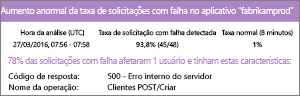 |
| [**Mapa do aplicativo****Application map**](app-insights-app-map.md) Os componentes de seu aplicativo, com as principais métricas e alertas.The components of your app, with key metrics and alerts. |  |
| [**Criador de perfil****Profiler**](app-insights-profiler.md) Inspecione os perfis de execução de solicitações de amostras.Inspect the execution profiles of sampled requests. |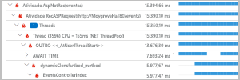 |
| [**Análise de uso****Usage analysis**](app-insights-usage-overview.md) Analise a retenção e a segmentação de usuários.Analyze user segmentation and retention.| |
| [**Pesquisa de diagnóstico para dados da instância****Diagnostic search for instance data**](app-insights-diagnostic-search.md) pesquise e filtre eventos como solicitações, exceções, chamadas de dependência, rastreamentos de log e exibições de página.Search and filter events such as requests, exceptions, dependency calls, log traces, and page views.  |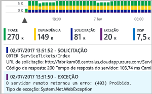 |
| [**Metrics Explorer para os dados agregados****Metrics Explorer for aggregated data**](app-insights-metrics-explorer.md) explore, filtre e segmente dados agregados, como taxas de solicitações, falhas e exceções; tempos de resposta e tempos de carregamento de página.Explore, filter, and segment aggregated data such as rates of requests, failures, and exceptions; response times, page load times. | |
| [**Painéis****Dashboards**](app-insights-dashboards.md#dashboards) faça um mashup de dados de vários recursos e compartilhe com outras pessoas.Mash up data from multiple resources and share with others. Excelente para aplicativos com vários componentes e para exibição contínua no ambiente de equipe.Great for multi-component applications, and for continuous display in the team room. | |
| [**Live Metrics Stream****Live Metrics Stream**](app-insights-live-stream.md) quando implantar um novo build, acompanhe esses indicadores de desempenho quase em tempo real para verificar se tudo está funcionando conforme esperado.When you deploy a new build, watch these near-real-time performance indicators to make sure everything works as expected. |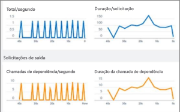 |
| [**Analytics****Analytics**](app-insights-analytics.md) responda perguntas difíceis sobre o desempenho e o uso do seu aplicativo usando essa poderosa linguagem de consulta.Answer tough questions about your app's performance and usage by using this powerful query language. |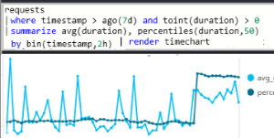 |
| [**Visual Studio****Visual Studio**](app-insights-visual-studio.md) Veja dados de desempenho no código.See performance data in the code. Vá até o código dos rastreamentos de pilha.Go to code from stack traces.|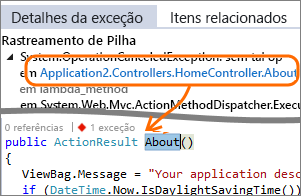 |
| [**Depurador de instantâneo****Snapshot debugger**](app-insights-snapshot-debugger.md) Depure instantâneos tirado como exemplo de operações ao vivo, com valores de parâmetro.Debug snapshots sampled from live operations, with parameter values.|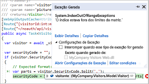 |
| [**Power BI****Power BI**](app-insights-export-power-bi.md) Integre as métricas de uso com outro business intelligence.Integrate usage metrics with other business intelligence.| 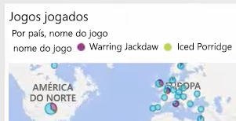|
| [**REST API****REST API**](https://dev.applicationinsights.io/) Escreva o código para executar consultas em suas métricas e dados brutos.Write code to run queries over your metrics and raw data.|  |
| [**Exportação contínua****Continuous export**](app-insights-export-telemetry.md) Exportação em massa de dados brutos para armazenamento assim que eles chegam.Bulk export of raw data to storage as soon as it arrives. |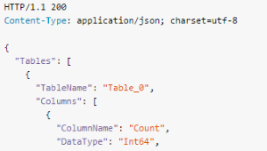 |

## Como usar o Application Insights?How do I use Application Insights?

### MonitoramentoMonitor
Instale o Application Insights no seu aplicativo, configure os [testes de disponibilidade da web](app-insights-monitor-web-app-availability.md) e:Install Application Insights in your app, set up [availability web tests](app-insights-monitor-web-app-availability.md), and:

* Configure um [painel](app-insights-dashboards.md) para sua sala da equipe para ficar atento à carga, à capacidade de resposta e ao desempenho de suas dependências, aos carregamentos de página e ás chamadas AJAX.Set up a [dashboard](app-insights-dashboards.md) for your team room to keep an eye on load, responsiveness, and the performance of your dependencies, page loads, and AJAX calls.
* Descubra quais são as solicitações mais lentas e com mais falhas.Discover which are the slowest and most failing requests.
* Assista ao [Live Stream](app-insights-live-stream.md) quando implantar uma nova versão, para identificar imediatamente uma degradação.Watch [Live Stream](app-insights-live-stream.md) when you deploy a new release, to know immediately about any degradation.

### Detectar, diagnosticarDetect, Diagnose
Quando você recebe um alerta ou descobre um problema:When you receive an alert or discover a problem:

* Avalie quantos usuários são afetados.Assess how many users are affected.
* Correlacione falhas a exceções, a chamadas de dependência e a rastreamentos.Correlate failures with exceptions, dependency calls and traces.
* Examine o criador de perfil, instantâneos, despejos de pilha e logs de rastreamento.Examine profiler, snapshots, stack dumps, and trace logs.

### Compilar, medir, aprenderBuild, Measure, Learn
[Meça a eficácia](app-insights-usage-overview.md) de cada novo recurso que você implanta.[Measure the effectiveness](app-insights-usage-overview.md) of each new feature that you deploy.

* Planeje medir como os clientes usam a nova experiência do usuário ou as funcionalidades de negócios.Plan to measure how customers use new UX or business features.
* Escreva a telemetria personalizada em seu código.Write custom telemetry into your code.
* Baseie o próximo ciclo de desenvolvimento em evidências da telemetria.Base the next development cycle on hard evidence from your telemetry.

## IntroduçãoGet started
Application Insights é um dos muitos serviços hospedados no Microsoft Azure e a telemetria é enviada para ele para análise e apresentação.Application Insights is one of the many services hosted within Microsoft Azure, and telemetry is sent there for analysis and presentation. Portanto, antes de fazer qualquer outra coisa, você precisará de uma assinatura do [Microsoft Azure](http://azure.com).So before you do anything else, you'll need a subscription to [Microsoft Azure](http://azure.com). A inscrição é gratuita, e se você optar pelo [plano de preços](https://azure.microsoft.com/pricing/details/application-insights/) básico do Application Insights, não haverá cobrança até que seu aplicativo apresente uso substancial.It's free to sign up, and if you choose the basic [pricing plan](https://azure.microsoft.com/pricing/details/application-insights/) of Application Insights, there's no charge until your application has grown to have substantial usage. Se sua organização já tiver uma assinatura, sua conta da Microsoft poderá ser adicionada a ela.If your organization already has a subscription, they could add your Microsoft account to it.

Existem várias maneiras de começar.There are several ways to get started. Comece com o que funciona melhor para você.Begin with whichever works best for you. Você pode adicionar outras posteriormente.You can add the others later.

* **Em tempo de execução: instrumente seu aplicativo Web no servidor.****At run time: instrument your web app on the server.** Evita qualquer atualização no código.Avoids any update to the code. Você precisa de acesso de administrador para seu servidor.You need admin access to your server.
  * [**IIS local ou em uma VM****IIS on-premises or on a VM**](app-insights-monitor-performance-live-website-now.md)
  * [**Aplicativo Web ou VM do Azure****Azure web app or VM**](app-insights-monitor-performance-live-website-now.md)
  * [**J2EE****J2EE**](app-insights-java-live.md)
* **Em tempo de desenvolvimento: adicione o Application Insights ao seu código.****At development time: add Application Insights to your code.** Permite que você escreva telemetria personalizada e instrumente aplicativos de back-end e de área de trabalho.Allows you to write custom telemetry and to instrument back-end and desktop apps.
  * [Visual Studio](app-insights-asp-net.md) 2013 atualização 2 ou posterior.[Visual Studio](app-insights-asp-net.md) 2013 update 2 or later.
  * Java no [Eclipse](app-insights-java-eclipse.md) ou em [outras ferramentas](app-insights-java-get-started.md)Java in [Eclipse](app-insights-java-eclipse.md) or [other tools](app-insights-java-get-started.md)
  * [Node.jsNode.js](app-insights-nodejs.md)
  * [Outras plataformasOther platforms](app-insights-platforms.md)
* **[Instrumentar suas páginas da Web](app-insights-javascript.md)** para exibição de página, AJAX e outras telemetrias do lado do cliente.**[Instrument your web pages](app-insights-javascript.md)** for page view, AJAX and other client-side telemetry.
* **[Testes de disponibilidade](app-insights-monitor-web-app-availability.md)** - execute o ping de seu site regularmente de nossos servidores.**[Availability tests](app-insights-monitor-web-app-availability.md)** - ping your website regularly from our servers.

## Próximas etapasNext steps
Introdução ao tempo de execução com:Get started at runtime with:

* [Servidor IISIIS server](app-insights-monitor-performance-live-website-now.md)
* [Servidor J2EEJ2EE server](app-insights-java-live.md)

Introdução ao tempo de desenvolvimento com:Get started at development time with:

* [ASP.NETASP.NET](app-insights-asp-net.md)
* [JavaJava](app-insights-java-get-started.md)
* [Node.jsNode.js](app-insights-nodejs.md)

## Suporte e comentáriosSupport and feedback
* Perguntas e problemas:Questions and Issues:
  * [Solução de problemas][qna][Troubleshooting][qna]
  * [Fórum do MSDNMSDN Forum](https://social.msdn.microsoft.com/Forums/vstudio/home?forum=ApplicationInsights)
  * [StackOverflowStackOverflow](http://stackoverflow.com/questions/tagged/ms-application-insights)
* Suas sugestões:Your suggestions:
  * [UserVoiceUserVoice](https://visualstudio.uservoice.com/forums/357324)
* Blog:Blog:
  * [Blog do Application InsightsApplication Insights blog](https://azure.microsoft.com/blog/tag/application-insights)

## VídeosVideos

[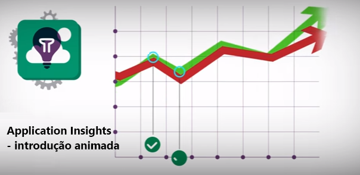](https://www.youtube.com/watch?v=fX2NtGrh-Y0)

> [!VIDEO https://channel9.msdn.com/events/Connect/2016/100/player] 

<!--Link references-->

[android]: https://github.com/Microsoft/ApplicationInsights-Android
[azure]: ../insights-perf-analytics.md
[client]: app-insights-javascript.md
[desktop]: app-insights-windows-desktop.md
[detect]: app-insights-detect-triage-diagnose.md
[greenbrown]: app-insights-asp-net.md
[ios]: https://github.com/Microsoft/ApplicationInsights-iOS
[java]: app-insights-java-get-started.md
[knowUsers]: app-insights-web-track-usage.md
[platforms]: app-insights-platforms.md
[portal]: http://portal.azure.com/
[qna]: app-insights-troubleshoot-faq.md
[redfield]: app-insights-monitor-performance-live-website-now.md
