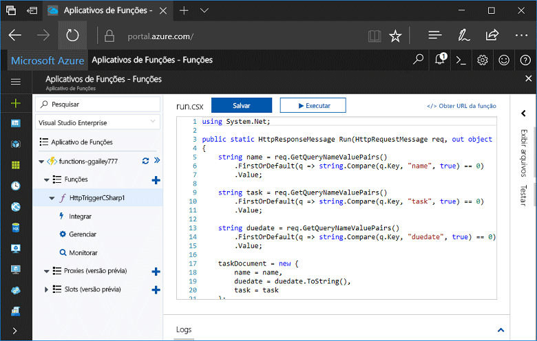
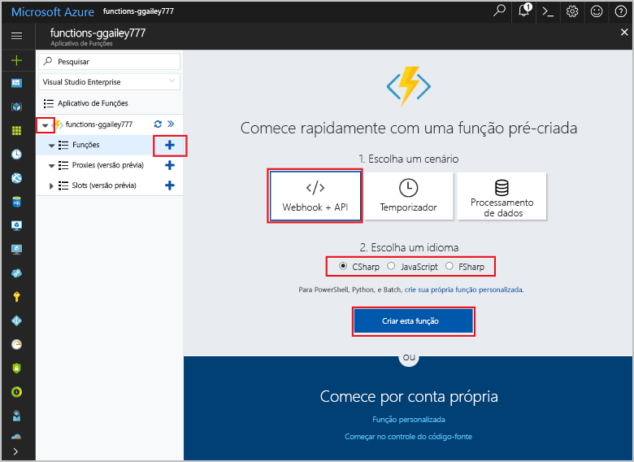
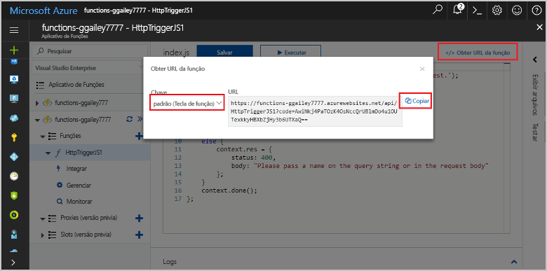
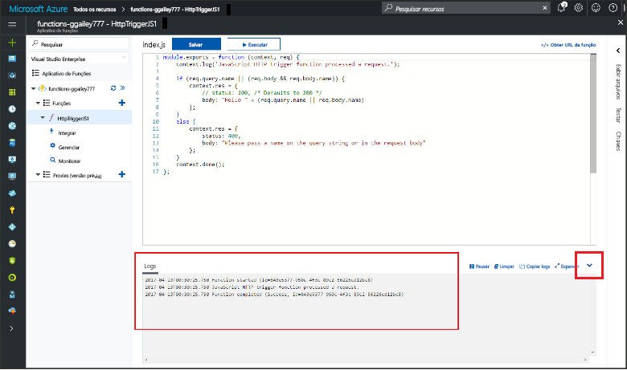

# Criar sua primeira função em Olá portal do Azure

As funções do Azure permite que você execute seu código em um ambiente sem servidor sem ter que toofirst criar uma VM ou publicar um aplicativo web. Neste tópico, Aprenda como toouse funções toocreate uma função de "hello world" hello portal do Azure.

[!INCLUDE [quickstarts-free-trial-note](../../includes/quickstarts-free-trial-note.md)]

## Faça logon no tooAzure

Faça logon no toohello [portal do Azure](https://portal.azure.com/).

## Criar um aplicativo de funções

Você deve ter uma função aplicativo toohost Olá a execução das funções. Um aplicativo de funções permite a você agrupar funções como uma unidade lógica para facilitar o gerenciamento, implantação e compartilhamento de recursos. 

[!INCLUDE [Create function app Azure portal](../../includes/functions-create-function-app-portal.md)]

[!INCLUDE [functions-portal-favorite-function-apps](../../includes/functions-portal-favorite-function-apps.md)]

Em seguida, crie uma função no novo aplicativo de função hello.

## Criar uma função disparada por HTTP

1. Expanda seu novo aplicativo de função, clique em Olá  **+**  botão Avançar muito**funções**.

2.  Em Olá **começar rapidamente** página, selecione **WebHook + API**, **escolher um idioma** para sua função e clique em **criar esta função** . 
   
    

Uma função é criada no seu idioma escolhido usando o modelo de saudação para uma função HTTP disparado. Você pode executar uma nova função de saudação enviando uma solicitação HTTP.

## Função de saudação do teste

1. Em sua nova função, clique em **</> Obter URL da função**, selecione **padrão (Tecla de função)** e clique em **Copiar**. 

    

2. Cole Olá função URL na barra de endereços do navegador. Acrescente a cadeia de caracteres de consulta de saudação `&name=<yourname>` Olá de URL e pressione toothis `Enter` chave em sua solicitação de saudação do teclado tooexecute. a seguir Olá é um exemplo de resposta Olá retornado pela função hello no navegador de borda hello:

    

    solicitação de saudação URL inclui uma chave que é necessário, por padrão, tooaccess sua função via HTTP.   

3. Quando a função é executada, informações de rastreamento são gravadas toohello logs. saída de rastreamento de saudação toosee de execução anterior do hello, retornar tooyour função no portal de saudação e clique em Olá a seta na parte inferior de saudação do hello tela tooexpand **Logs**. 

   

## Limpar recursos

[!INCLUDE [Clean up resources](../../includes/functions-quickstart-cleanup.md)]

## Próximas etapas

Você criou um aplicativo de funções com uma função simples disparada por HTTP.  

[!INCLUDE [Next steps note](../../includes/functions-quickstart-next-steps.md)]

Para obter mais informações, consulte [Associações HTTP e de webhook do Azure Functions](functions-bindings-http-webhook.md).

