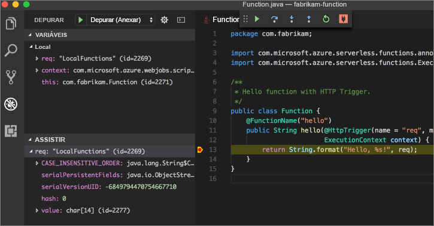

# <a name="create-your-first-function-with-java-and-maven-preview"></a>Criar sua primeira função com Java e Maven (versão prévia)

> [!NOTE] 
> O Java para Azure Functions está atualmente na versão prévia.

Este guia de início rápido fornece orientação para a criação de um projeto de função [sem servidor](https://azure.microsoft.com/overview/serverless-computing/) com o Maven, testá-lo localmente e implantá-lo no Azure Functions. Quando terminar, você terá um aplicativo de funções disparado por HTTP em execução no Azure.


[!INCLUDE [quickstarts-free-trial-note](../../includes/quickstarts-free-trial-note.md)]

## <a name="prerequisites"></a>pré-requisitos
Para desenvolver aplicativos de funções com Java, você deve ter o seguinte instalado:

-  [.NET core](https://www.microsoft.com/net/core), a versão mais recente.
-  [Java Developer Kit](https://www.azul.com/downloads/zulu/), versão 8.
-  [CLI do Azure](https://docs.microsoft.com/cli/azure)
-  [Apache Maven](https://maven.apache.org), versão 3.0 ou posterior.
-  [Node.js](https://nodejs.org/download/), versão 8.6 ou superior.

> [!IMPORTANT] 
> A variável de ambiente JAVA_HOME deve ser definida como o local de instalação do JDK para concluir este guia de início rápido.

## <a name="install-the-azure-functions-core-tools"></a>Instalação das ferramentas básicas do Azure Functions

As [Ferramentas Básicas do Azure Functions 2.0](https://www.npmjs.com/package/azure-functions-core-tools) fornecem um ambiente de desenvolvimento local para gravar, executar e depurar funções do Azure. Instale as ferramentas com [npm](https://www.npmjs.com/), incluído com [Node.js](https://nodejs.org/).

```
npm install -g azure-functions-core-tools@core
```

> [!NOTE]
> Se você tiver problemas para instalar as Ferramentas Básicas do Azure Functions 2.0, consulte [Tempo de execução da versão 2.x](/azure/azure-functions/functions-run-local#version-2x-runtime).

## <a name="generate-a-new-functions-project"></a>Gerar um novo projeto do Functions

Em uma pasta vazia, execute o seguinte comando para gerar o projeto do Functions a partir de um [arquétipo Maven](https://maven.apache.org/guides/introduction/introduction-to-archetypes.html).

### <a name="linuxmacos"></a>Linux/MacOS

```bash
mvn archetype:generate \
    -DarchetypeGroupId=com.microsoft.azure \
    -DarchetypeArtifactId=azure-functions-archetype 
```

### <a name="windows-cmd"></a>Windows (CMD)
```cmd
mvn archetype:generate ^
    -DarchetypeGroupId=com.microsoft.azure ^
    -DarchetypeArtifactId=azure-functions-archetype
```

O Maven solicita os valores necessários para concluir a geração do projeto. Para os valores de _groupId_, _artifactId_ e _versão_, consulte a referência [Convenções de nomenclatura Maven](https://maven.apache.org/guides/mini/guide-naming-conventions.html). O valor de _appName_ deve ser exclusivo no Azure, portanto, o Maven gera um nome de aplicativo com base no _artifactId_ em inserido anteriormente como padrão. O valor de _packageName_ determina o pacote de Java para o código de função gerado.

```Output
Define value for property 'groupId': com.fabrikam.functions
Define value for property 'artifactId' : fabrikam-functions
Define value for property 'version' 1.0-SNAPSHOT : 
Define value for property 'package': com.fabrikam.functions
Define value for property 'appName' fabrikam-functions-20170927220323382:
Confirm properties configuration: Y
```

O Maven cria os arquivos de projeto em uma nova pasta com um nome de _artifactId_. O código gerado no projeto é uma simples função [disparado por HTTP](/azure/azure-functions/functions-bindings-http-webhook) que ecoa o corpo da solicitação:

```java
public class Function {
    /**
     * This function listens at endpoint "/api/hello". Two ways to invoke it using "curl" command in bash:
     * 1. curl -d "HTTP Body" {your host}/api/hello
     * 2. curl {your host}/api/hello?name=HTTP%20Query
     */
    @FunctionName("hello")
    public HttpResponseMessage<String> hello(
            @HttpTrigger(name = "req", methods = {"get", "post"}, authLevel = AuthorizationLevel.ANONYMOUS) HttpRequestMessage<Optional<String>> request,
            final ExecutionContext context) {
        context.getLogger().info("Java HTTP trigger processed a request.");

        // Parse query parameter
        String query = request.getQueryParameters().get("name");
        String name = request.getBody().orElse(query);

        if (name == null) {
            return request.createResponse(400, "Please pass a name on the query string or in the request body");
        } else {
            return request.createResponse(200, "Hello, " + name);
        }
    }
}

```

## <a name="run-the-function-locally"></a>Executar a função localmente

Altere o diretório para a pasta do projeto recém-criado e compile e execute a função com o Maven:

```
cd fabrikam-function
mvn clean package 
mvn azure-functions:run
```

> [!NOTE]
> Caso esteja presenciando esta exceção: `javax.xml.bind.JAXBException`com o Java 9, consulte a solução alternativa no [GitHub](https://github.com/jOOQ/jOOQ/issues/6477).

Esse resultado será exibido quando a função estiver em execução:

```Output
Listening on http://localhost:7071
Hit CTRL-C to exit...

Http Functions:

   hello: http://localhost:7071/api/hello
```

Dispare a função na linha de comando usando curl em um novo terminal:

```
curl -w '\n' -d LocalFunction http://localhost:7071/api/hello
```

```Output
Hello LocalFunction!
```

Use `Ctrl-C` no terminal para interromper o código da função.

## <a name="deploy-the-function-to-azure"></a>Implantar a função no Azure

O processo de implantação no Azure Functions usa credenciais de conta da CLI do Azure. [Faça logon com a CLI do Azure](/cli/azure/authenticate-azure-cli?view=azure-cli-latest) e, em seguida, implante seu código em um novo aplicativo de funções usando o destino de Maven `azure-functions:deploy`.

```
az login
mvn azure-functions:deploy
```

Quando a implantação for concluída, você verá a URL que pode usar para acessar seu aplicativo de funções do Azure:

```output
[INFO] Successfully deployed Function App with package.
[INFO] Deleting deployment package from Azure Storage...
[INFO] Successfully deleted deployment package fabrikam-function-20170920120101928.20170920143621915.zip
[INFO] Successfully deployed Function App at https://fabrikam-function-20170920120101928.azurewebsites.net
[INFO] ------------------------------------------------------------------------
```

Teste o aplicativo de funções em execução no Azure usando curl:

```
curl -w '\n' https://fabrikam-function-20170920120101928.azurewebsites.net/api/hello -d AzureFunctions
```

```Output
Hello AzureFunctions!
```

## <a name="next-steps"></a>Próximas etapas

Você criou um aplicativo de funções Java com um gatilho HTTP simples e o implantou no Azure Functions.

- Examine o [Guia do desenvolvedor de funções Java](functions-reference-java.md) para saber mais sobre o desenvolvimento de funções Java.
- Adicione outras funções com gatilhos diferentes ao seu projeto usando o destino Maven `azure-functions:add`.
- Depure funções localmente com o Visual Studio Code. Com o [pacote de extensão Java](https://marketplace.visualstudio.com/items?itemName=vscjava.vscode-java-pack) instalado, e com o seu projeto do Functions aberto no Visual Studio Code, [anexe o depurador](https://code.visualstudio.com/Docs/editor/debugging#_launch-configurations) à porta 5005. Em seguida, defina um ponto de interrupção no editor e dispare sua função enquanto ela está em execução localmente: 


