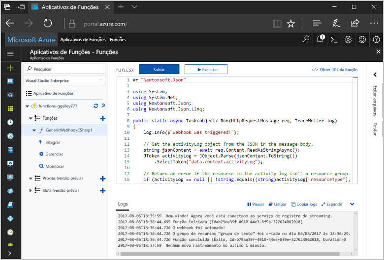
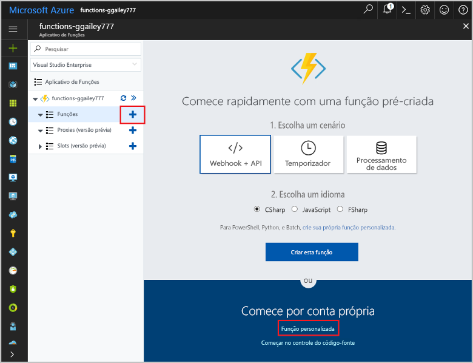
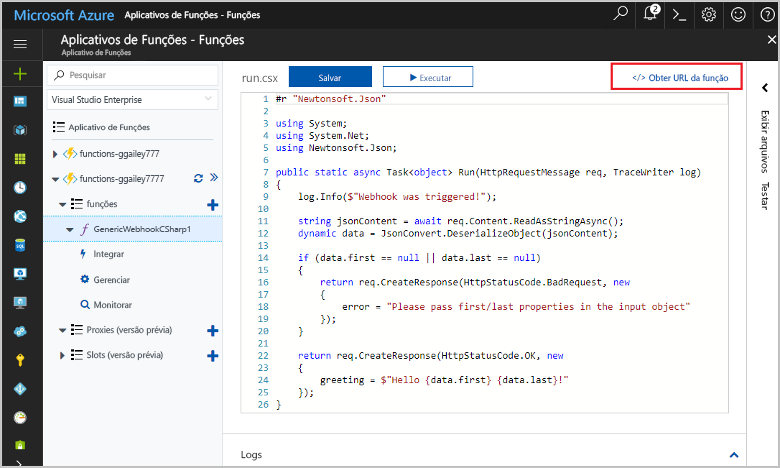
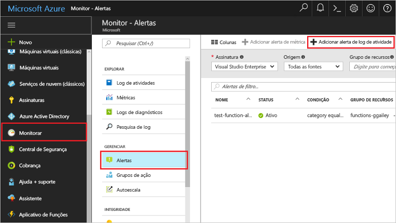
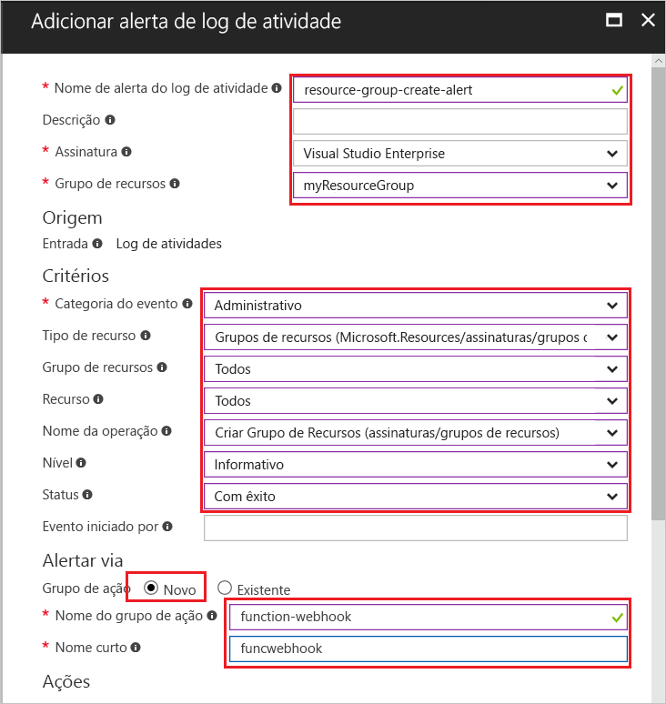
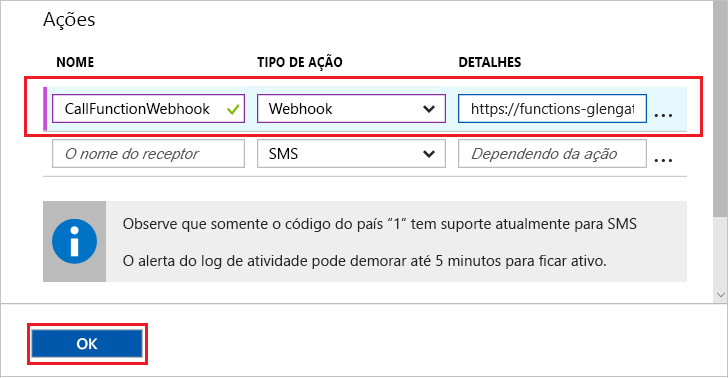
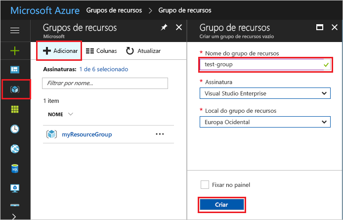
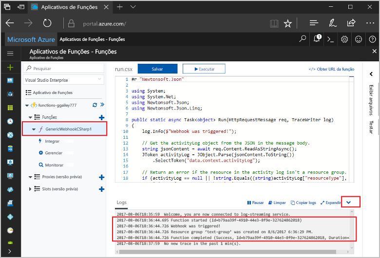

# <a name="create-a-function-triggered-by-a-generic-webhook"></a>Criar uma função disparada por um webhook genérico

As funções do Azure permite que você execute seu código em um ambiente sem servidor sem ter que toofirst criar uma VM ou publicar um aplicativo web. Por exemplo, você pode configurar um toobe função disparado por um alerta gerado pelo Monitor do Azure. Este tópico mostra como o código c# tooexecute quando um grupo de recursos é adicionado tooyour assinatura.   



## <a name="prerequisites"></a>Pré-requisitos 

toocomplete este tutorial:

+ Se você não tiver uma assinatura do Azure, crie uma [conta gratuita](https://azure.microsoft.com/free/?WT.mc_id=A261C142F) antes de começar.

[!INCLUDE [functions-portal-favorite-function-apps](../../includes/functions-portal-favorite-function-apps.md)]

## <a name="create-an-azure-function-app"></a>Criar um Aplicativo de funções do Azure

[!INCLUDE [Create function app Azure portal](../../includes/functions-create-function-app-portal.md)]

Em seguida, crie uma função no novo aplicativo de função hello.

## <a name="create-function"></a>Criar uma função disparada por um webhook genérico

1. Expanda seu aplicativo de função e clique em Olá  **+**  botão Avançar muito**funções**. Se essa função é hello um primeiro em seu aplicativo de função, selecione **função personalizada**. Isso exibe o conjunto completo de saudação de modelos de função.

    

2. Selecione Olá **WebHook genérico - C#** modelo. Digite um nome para sua função C# e selecione **Criar**.

      

2. Em sua nova função, clique em **<> / Get função URL**, copie e salve o valor de saudação. Você usa esse webhook de saudação do valor tooconfigure. 

    
         
Em seguida, crie um ponto de extremidade de webhook em um alerta do log de atividades no Azure Monitor. 

## <a name="create-an-activity-log-alert"></a>Criar um alerta do log de atividades

1. Olá portal do Azure no, navegue toohello **Monitor** serviço, selecione **alertas**e clique em **adicionar alerta do log de atividade**.   

    

2. Usar configurações de saudação conforme especificado na tabela de saudação:

    

    | Configuração      |  Valor sugerido   | Descrição                              |
    | ------------ |  ------- | -------------------------------------------------- |
    | **Nome do alerta do log de atividades** | resource-group-create-alert | Nome do alerta de log de atividade de saudação. |
    | **Assinatura** | Sua assinatura | assinatura de saudação que você está usando para este tutorial. | 
    |  **Grupo de recursos** | myResourceGroup | grupo de recursos de Olá recursos de alerta de saudação são implantados. Usando Olá o mesmo grupo de recursos, como seu aplicativo de função torna mais fácil tooclean depois de concluir o tutorial de saudação. |
    | **Categoria de eventos** | Administrativo | Essa categoria inclui as alterações feitas tooAzure recursos.  |
    | **Tipo de recurso** | Grupos de recursos | Filtros de atividades em grupo tooresource alertas. |
    | **Grupo de recursos**<br/>e **Recurso** | Todos | Monitore todos os recursos. |
    | **Nome da operação** | Criar grupo de recursos | Filtra as operações toocreate de alertas. |
    | **Level** | Informativo | Inclua os alertas de nível informativo. | 
    | **Status** | Bem-sucedido | Filtra tooactions alertas que foram concluídos com êxito. |
    | **Grupo de ações** | Novo | Crie um novo grupo de ação, que define Olá ação toma quando um alerta é gerado. |
    | **Nome do grupo de ações** | function-webhook | Um grupo de ação do nome tooidentify hello.  | 
    | **Nome curto** | funcwebhook | Um nome curto para o grupo de ação de saudação. |  

3. Em **ações**, adicione uma ação usando configurações de saudação conforme especificado na tabela de saudação: 

    

    | Configuração      |  Valor sugerido   | Descrição                              |
    | ------------ |  ------- | -------------------------------------------------- |
    | **Nome** | CallFunctionWebhook | Um nome para a ação de saudação. |
    | **Tipo de ação** | webhook | alerta de toohello Olá resposta é que uma URL de Webhook é chamada. |
    | **Detalhes** | URL da função | Cole a URL do webhook Olá da função de saudação que você copiou anteriormente. |v

4. Clique em **Okey** toocreate Olá alerta e ação de grupo.  

Olá webhook agora é chamado quando um grupo de recursos é criado na sua assinatura. Em seguida, você atualizar o código de saudação na saudação de toohandle sua função dados de log JSON no corpo de saudação da solicitação de saudação.   

## <a name="update-hello-function-code"></a>Atualizar o código de função hello

1. Navegue de aplicativo de função tooyour Voltar no portal de saudação e, em seguida, expanda sua função. 

2. Substitua o código de script de saudação c# em função hello no portal de saudação com hello código a seguir:

    ```csharp
    #r "Newtonsoft.Json"
    
    using System;
    using System.Net;
    using Newtonsoft.Json;
    using Newtonsoft.Json.Linq;
    
    public static async Task<object> Run(HttpRequestMessage req, TraceWriter log)
    {
        log.Info($"Webhook was triggered!");
    
        // Get hello activityLog object from hello JSON in hello message body.
        string jsonContent = await req.Content.ReadAsStringAsync();
        JToken activityLog = JObject.Parse(jsonContent.ToString())
            .SelectToken("data.context.activityLog");
    
        // Return an error if hello resource in hello activity log isn't a resource group. 
        if (activityLog == null || !string.Equals((string)activityLog["resourceType"], 
            "Microsoft.Resources/subscriptions/resourcegroups"))
        {
            log.Error("An error occured");
            return req.CreateResponse(HttpStatusCode.BadRequest, new
            {
                error = "Unexpected message payload or wrong alert received."
            });
        }
    
        // Write information about hello created resource group toohello streaming log.
        log.Info(string.Format("Resource group '{0}' was {1} on {2}.",
            (string)activityLog["resourceGroupName"],
            ((string)activityLog["subStatus"]).ToLower(), 
            (DateTime)activityLog["submissionTimestamp"]));
    
        return req.CreateResponse(HttpStatusCode.OK);    
    }
    ```

Agora você pode testar a função hello, criando um novo grupo de recursos em sua assinatura.

## <a name="test-hello-function"></a>Função de saudação do teste

1. Clique no ícone do grupo de recursos de saudação à esquerda de saudação do hello portal do Azure, selecione **+ adicionar**, digite um **nome do grupo de recursos**e selecione **criar** toocreate um grupo de recurso vazio.
    
    

2. Voltar a função tooyour e expanda Olá **Logs** janela. Após a criação do grupo de recursos de saudação, gatilhos de alerta de log de atividade Olá Olá webhook e Olá função é executada. Você verá o nome de saudação do grupo de recursos novos Olá gravado toohello logs.  

    

3. (Opcional) Voltar e exclua o grupo de recursos de saudação que você criou. Observe que essa atividade não aciona a função hello. Isso ocorre porque excluir operações são filtradas pelo alerta hello. 

## <a name="clean-up-resources"></a>Limpar recursos

[!INCLUDE [Next steps note](../../includes/functions-quickstart-cleanup.md)]

## <a name="next-steps"></a>Próximas etapas

Você criou uma função que é executada quando uma solicitação é recebida de um webhook genérico. 

[!INCLUDE [Next steps note](../../includes/functions-quickstart-next-steps.md)]

Para saber mais sobre gatilhos do webhook, veja [Associações HTTP e de webhook do Azure Functions](functions-bindings-http-webhook.md). toolearn mais sobre o desenvolvimento de funções em c#, consulte [referência do desenvolvedor do Azure funções C# script](functions-reference-csharp.md).

