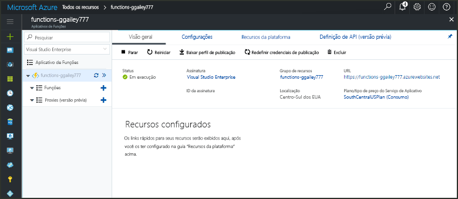

# Criar uma função disparada pelo webhook do GitHub

Saiba como toocreate uma função que é disparada por uma solicitação de webhook HTTP com uma carga específica do GitHub.

## Pré-requisitos

+ Uma conta do GitHub com pelo menos um projeto.
+ Uma assinatura do Azure. Se você não tiver uma, crie uma [conta gratuita](https://azure.microsoft.com/free/?WT.mc_id=A261C142F) antes de começar.

[!INCLUDE [functions-portal-favorite-function-apps](../../includes/functions-portal-favorite-function-apps.md)]

## Criar um Aplicativo de funções do Azure

[!INCLUDE [Create function app Azure portal](../../includes/functions-create-function-app-portal.md)]

Em seguida, crie uma função no novo aplicativo de função hello.

## Criar uma função disparada pelo webhook do GitHub

1. Expanda seu aplicativo de função e clique em Olá  **+**  botão Avançar muito**funções**. Se esta for a primeira função hello em seu aplicativo de função, selecione **função personalizada**. Isso exibe o conjunto completo de saudação de modelos de função.

    

2. Selecione Olá **GitHub WebHook** modelo para o idioma desejado. **Nomeie sua função** e então selecione **Criar**.

      

3. Em sua nova função, clique em **<> / Get função URL**, em seguida, copiar e salvar valores hello. Olá para a mesma coisa **<> / obter GitHub segredo**. Você pode usar essas webhook de saudação tooconfigure valores no GitHub.

    

Em seguida, você cria o webhook no repositório GitHub.

## Configurar Olá webhook

1. No GitHub, navegue tooa repositório que você possui. Você também pode usar qualquer repositório que você tenha bifurcado. Se você precisar toofork um repositório, use <https://github.com/Azure-Samples/functions-quickstart>.

1. Clique em **Configurações**, em seguida, clique em **Webhooks**, e **Adicionar webhook**.

    

1. Use as configurações conforme especificado na tabela Olá, e clique em **adicionar webhook**.

    

| Configuração | Valor sugerido | Descrição |
|---|---|---|
| **URL do conteúdo** | Valor copiado | Usar valor Olá retornado pela **<> / Get função URL**. |
| **Segredo**   | Valor copiado | Usar valor Olá retornado pela **<> / obter GitHub segredo**. |
| **Tipo de conteúdo** | aplicativo/json | função Hello espera uma carga JSON. |
| Gatilhos de evento | Deixe-me selecionar eventos individuais | Como só queremos tootrigger em eventos de comentário do problema.  |
| | Comentário do problema |  |

Agora, Olá webhook é configurado tootrigger sua função quando um novo comentário de problema é adicionado.

## Função de saudação do teste

1. No seu repositório GitHub, abra Olá **problemas** guia em uma nova janela do navegador.

1. Na nova janela de hello, clique em **novo problema**, digite um título e, em seguida, clique em **enviar novo problema**.

1. Edição de hello, digite um comentário e clique em **comentário**.

    

1. Voltar toohello portal e exibir logs de saudação. Você deve ver uma entrada de rastreamento com o novo texto de comentário hello.

     

## Limpar recursos

[!INCLUDE [Next steps note](../../includes/functions-quickstart-cleanup.md)]

## Próximas etapas

Você criou uma função que é executada quando uma solicitação é recebida de um webhook do GitHub.

[!INCLUDE [Next steps note](../../includes/functions-quickstart-next-steps.md)]

Para saber mais sobre gatilhos do webhook, veja [Associações HTTP e de webhook do Azure Functions](functions-bindings-http-webhook.md).
