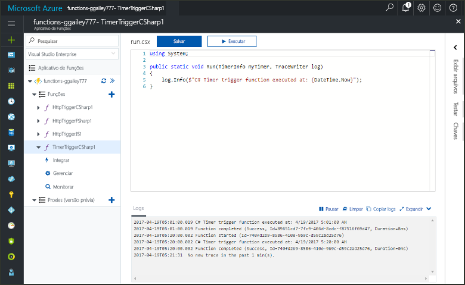
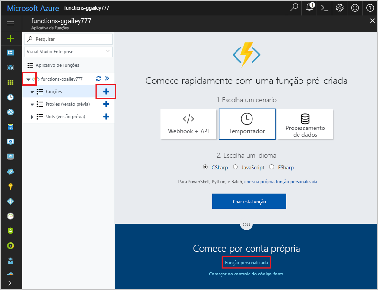
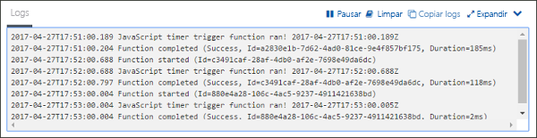
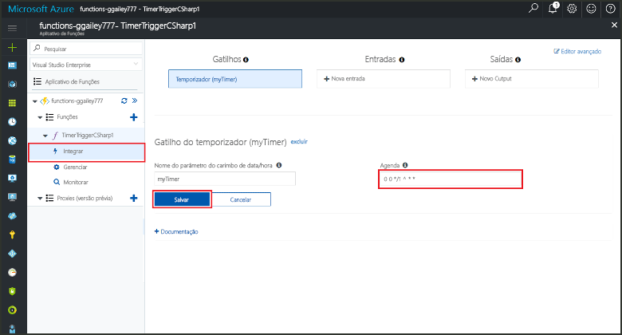

# Criar uma função no Azure que é disparada por um temporizador

Saiba como toouse funções do Azure toocreate uma função que é executada com base em uma agenda que você definir.

## Pré-requisitos

toocomplete este tutorial:

+ Se você não tiver uma assinatura do Azure, crie uma [conta gratuita](https://azure.microsoft.com/free/?WT.mc_id=A261C142F) antes de começar.

[!INCLUDE [functions-portal-favorite-function-apps](../../includes/functions-portal-favorite-function-apps.md)]

## Criar um Aplicativo de funções do Azure

[!INCLUDE [Create function app Azure portal](../../includes/functions-create-function-app-portal.md)]

Em seguida, crie uma função no novo aplicativo de função hello.

## Criar uma função disparada por temporizador

1. Expanda seu aplicativo de função e clique em Olá  **+**  botão Avançar muito**funções**. Se esta for a primeira função hello em seu aplicativo de função, selecione **função personalizada**. Isso exibe o conjunto completo de saudação de modelos de função.

    

2. Selecione Olá **TimerTrigger** modelo para o idioma desejado. Use configurações de saudação conforme especificado na tabela de saudação:

    

    | Configuração | Valor sugerido | Descrição |
    |---|---|---|
    | **Nomeie sua função** | TimerTriggerCSharp1 | Define o nome de saudação da sua função timer disparado. |
    | **[Agendamento](http://en.wikipedia.org/wiki/Cron#CRON_expression)** | 0 \*/1 \* \* \* \* | Um campo de seis [expressão CRON](http://en.wikipedia.org/wiki/Cron#CRON_expression) que agenda a cada minuto toorun sua função. |

2. Clique em **Criar**. Uma nova função na linguagem de programação escolhida por você e que é executada a cada minuto é criada.

3. Exibindo informações de rastreamento gravadas toohello logs, verifique se a execução.

    

Agora, você pode alterar o agendamento da função Olá para que ele seja executado com menos frequência, como uma vez a cada hora. 

## Agendamento de atualização de temporizador hello

1. Expanda sua função e clique em **Integrar**. Isso é onde você define a entrada e associações de saída de sua função e também definir a agenda de saudação. 

2. Insira um novo valor de **Agendamento** de `0 0 */1 * * *` e, em seguida, clique em **Salvar**.  

Agora você tem uma função que é executada uma vez a cada hora. 

## Limpar recursos

[!INCLUDE [Next steps note](../../includes/functions-quickstart-cleanup.md)]

## Próximas etapas

Você criou uma função que é executada segundo um agendamento.

[!INCLUDE [Next steps note](../../includes/functions-quickstart-next-steps.md)]

Para obter mais informações sobre gatilhos de temporizador, consulte [Agendar a execução de código com o Azure Functions](functions-bindings-timer.md).