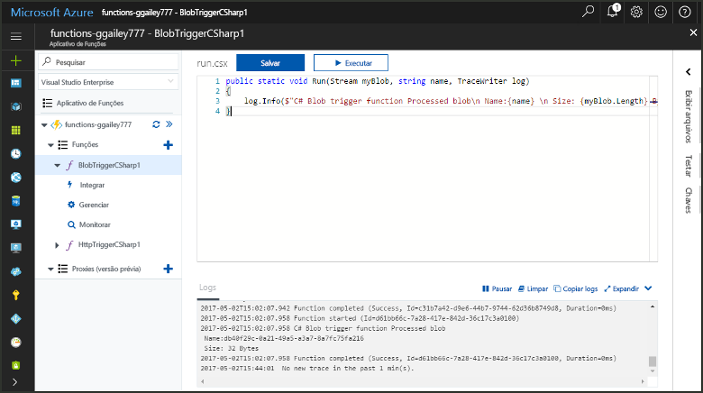
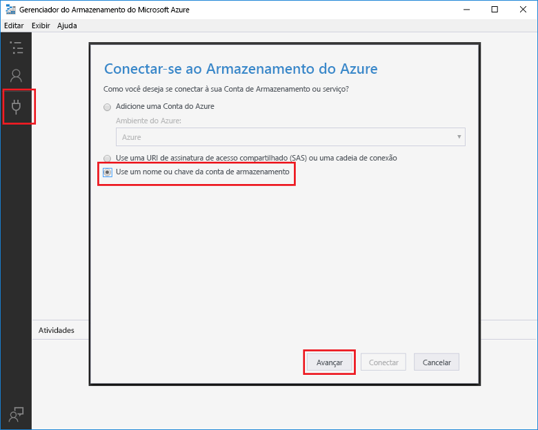
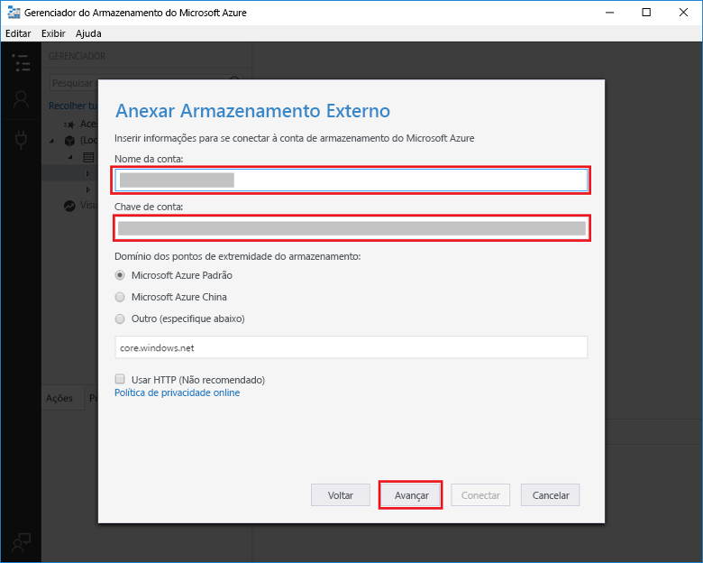
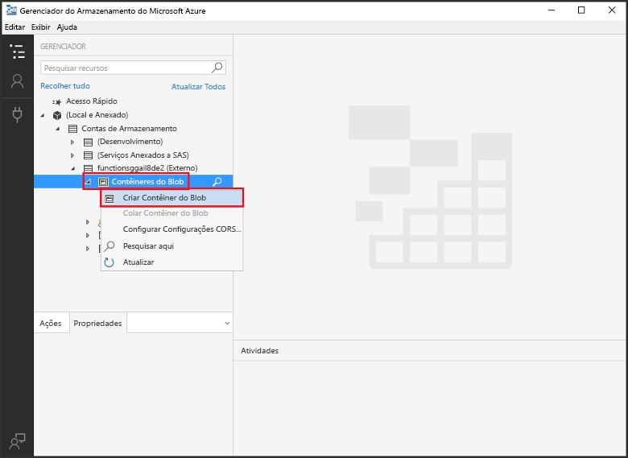
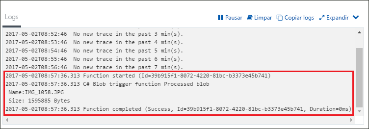

# Criar uma função disparada pelo Armazenamento de Blobs do AzureCreate a function triggered by Azure Blob storage

Saiba como criar uma função disparada quando arquivos são carregados ou atualizados no Armazenamento de Blobs do Azure.Learn how to create a function triggered when files are uploaded to or updated in Azure Blob storage.

## Pré-requisitosPrerequisites

+ Baixe e instale o [Gerenciador de Armazenamento do Microsoft Azure](http://storageexplorer.com/).Download and install the [Microsoft Azure Storage Explorer](http://storageexplorer.com/).
+ Uma assinatura do Azure.An Azure subscription. Se você não tiver uma, crie uma [conta gratuita](https://azure.microsoft.com/free/?WT.mc_id=A261C142F) antes de começar.If you don't have one, create a [free account](https://azure.microsoft.com/free/?WT.mc_id=A261C142F) before you begin.

[!INCLUDE [functions-portal-favorite-function-apps](../../includes/functions-portal-favorite-function-apps.md)]

## Criar um Aplicativo de funções do AzureCreate an Azure Function app

[!INCLUDE [Create function app Azure portal](../../includes/functions-create-function-app-portal.md)]

Em seguida, crie uma nova função no novo aplicativo de funções.Next, you create a function in the new function app.

## Criar uma função disparada pelo Armazenamento de BlobsCreate a Blob storage triggered function

1. Expanda seu aplicativo de funções e clique no botão **+** ao lado de **Functions**.Expand your function app and click the **+** button next to **Functions**. Se essa for a primeira função em seu aplicativo de funções, selecione **Função personalizada**.If this is the first function in your function app, select **Custom function**. Exibe o conjunto completo de modelos de função.This displays the complete set of function templates.

    

2. Selecione o modelo **BlobTrigger** para o idioma desejado e use as configurações especificadas na tabela.Select the **BlobTrigger** template for your desired language, and use the settings as specified in the table.

    

    | ConfiguraçãoSetting | Valor sugeridoSuggested value | DescriçãoDescription |
    |---|---|---|
    | **Caminho****Path**   | mycontainer/{name}mycontainer/{name}    | Local no Armazenamento de Blobs que está sendo monitorada.Location in Blob storage being monitored. O nome do arquivo do blob é passado na associação como o parâmetro _name_.The file name of the blob is passed in the binding as the _name_ parameter.  |
    | **Conexão da conta de armazenamento****Storage account connection** | AzureWebJobStorageAzureWebJobStorage | Você pode usar a conexão da conta de armazenamento que já está sendo usada por seu aplicativo de funções ou criar uma nova.You can use the storage account connection already being used by your function app, or create a new one.  |
    | **Nomeie sua função****Name your function** | Exclusivo no aplicativo de funçõesUnique in your function app | O nome dessa função disparada pelo blob.Name of this blob triggered function. |

3. Clique em **Criar** para criar a função.Click **Create** to create your function.

Em seguida, você pode se conectar à sua conta de armazenamento do Azure e criar o contêiner **mycontainer**.Next, you connect to your Azure Storage account and create the **mycontainer** container.

## Criar o contêinerCreate the container

1. Em sua função, clique em **Integrar**, expanda **Documentação**e copie **Nome da conta** e **Chave de conta**.In your function, click **Integrate**, expand **Documentation**, and copy both **Account name** and **Account key**. Você usa essas credenciais para conectar-se à conta de armazenamento.You use these credentials to connect to the storage account. Se você já tiver se conectado à conta de armazenamento, vá para a etapa 4.If you have already connected your storage account, skip to step 4.

    

1. Execute a ferramenta [Gerenciador de Armazenamento do Microsoft Azure](http://storageexplorer.com/), clique no ícone conectar-se à esquerda, escolha **Usar um nome e chave de conta de armazenamento** e clique em **Avançar**.Run the [Microsoft Azure Storage Explorer](http://storageexplorer.com/) tool, click the connect icon on the left, choose **Use a storage account name and key**, and click **Next**.

    

1. Insira o **Nome da conta** e **Chave de conta** da etapa 1, clique em **Avançar** e em **Conectar**.Enter the **Account name** and **Account key** from step 1, click **Next** and then **Connect**. 

    

1. Expanda a conta de armazenamento anexada, clique com o botão direito do mouse em **Contêineres de blob**, clique em **Criar contêiner de blob**, digite `mycontainer` e pressione enter.Expand the attached storage account, right-click **Blob containers**, click **Create blob container**, type `mycontainer`, and then press enter.

    

Agora que você tem um contêiner de blob, você pode testar a função carregando um arquivo para o contêiner.Now that you have a blob container, you can test the function by uploading a file to the container.

## Testar a funçãoTest the function

1. De volta ao Portal do Azure, navegue até sua função, expanda os **Logs** na parte inferior da página e verifique se o streaming de log não está em pausa.Back in the Azure portal, browse to your function expand the **Logs** at the bottom of the page and make sure that log streaming isn't paused.

1. No Gerenciador de Armazenamento, expanda sua conta de armazenamento, **Contêineres de blob** e **mycontainer**.In Storage Explorer, expand your storage account, **Blob containers**, and **mycontainer**. Clique em **Carregar** e depois em **Carregar arquivos...**.Click **Upload** and then **Upload files...**.

    

1. Na caixa de diálogo **Carregar arquivos**, clique no campo **Arquivos**.In the **Upload files** dialog box, click the **Files** field. Navegue até um arquivo em seu computador local, por exemplo, um arquivo de imagem, selecione-o e clique em **Abrir** e depois em **Carregar**.Browse to a file on your local computer, such as an image file, select it and click **Open** and then **Upload**.

1. Volte para os logs de função e verifique se o blob foi lido.Go back to your function logs and verify that the blob has been read.

   

    >[!NOTE]
    > Quando seu aplicativo de funções é executado no plano de consumo padrão, pode haver um atraso de até vários minutos entre o blob que está sendo adicionado ou atualizado e a função sendo disparada.When your function app runs in the default Consumption plan, there may be a delay of up to several minutes between the blob being added or updated and the function being triggered. Se você precisar de baixa latência em suas funções disparadas por blob, considere executar seu aplicativo de funções em um Plano do Serviço de Aplicativo.If you need low latency in your blob triggered functions, consider running your function app in an App Service plan.

## Limpar recursosClean up resources

[!INCLUDE [Next steps note](../../includes/functions-quickstart-cleanup.md)]

## Próximas etapasNext steps

Você criou uma função que é executada quando um blob é adicionado a um Armazenamento de Blobs ou atualizado nele.You have created a function that runs when a blob is added to or updated in Blob storage. 

[!INCLUDE [Next steps note](../../includes/functions-quickstart-next-steps.md)]

Para obter mais informações sobre gatilhos de armazenamento de blobs, consulte [Associações de Armazenamento de Blobs do Azure Functions](functions-bindings-storage-blob.md).For more information about Blob storage triggers, see [Azure Functions Blob storage bindings](functions-bindings-storage-blob.md).
