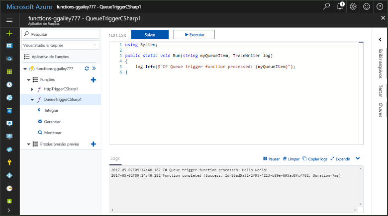
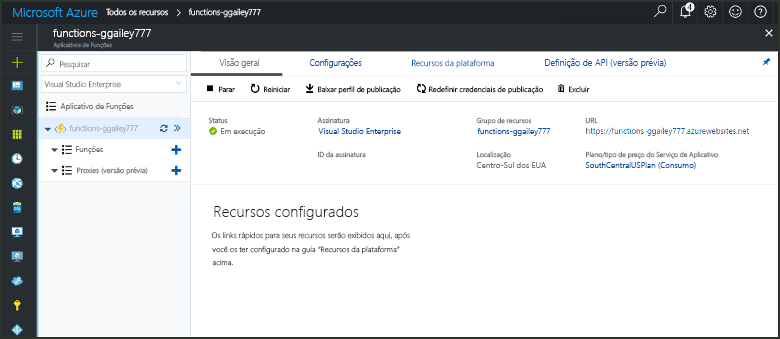
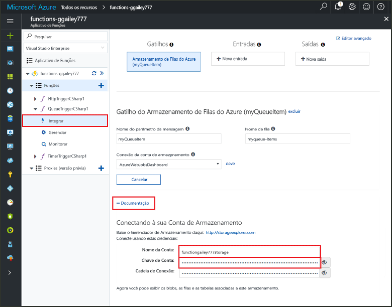
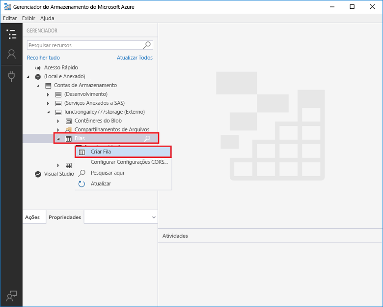
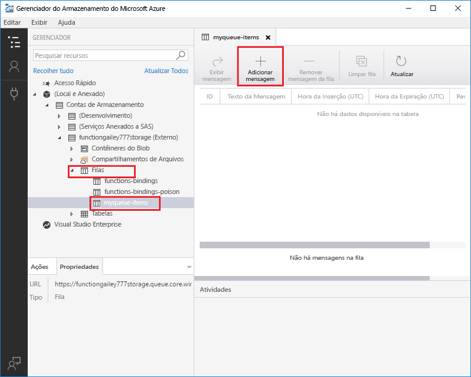
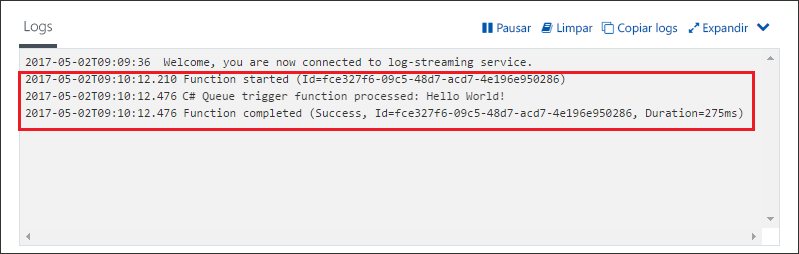

# Criar uma função disparada pelo Armazenamento de Filas do Azure

Saiba como toocreate uma função disparada quando mensagens são enviadas tooan fila de armazenamento do Azure.

## Pré-requisitos

- Baixe e instale Olá [Microsoft Azure Storage Explorer](http://storageexplorer.com/).

- Uma assinatura do Azure. Se você não tiver uma, crie uma [conta gratuita](https://azure.microsoft.com/free/?WT.mc_id=A261C142F) antes de começar.

[!INCLUDE [functions-portal-favorite-function-apps](../../includes/functions-portal-favorite-function-apps.md)]

## Criar um Aplicativo de funções do Azure

[!INCLUDE [Create function app Azure portal](../../includes/functions-create-function-app-portal.md)]

Em seguida, crie uma função no novo aplicativo de função hello.

## Criar uma função disparada por Filas

1. Expanda seu aplicativo de função e clique em Olá  **+**  botão Avançar muito**funções**. Se esta for a primeira função hello em seu aplicativo de função, selecione **função personalizada**. Isso exibe o conjunto completo de saudação de modelos de função.

    

2. Selecione Olá **QueueTrigger** modelo para o idioma desejado e usar configurações de saudação conforme especificado na tabela de saudação.

    
    
    | Configuração | Valor sugerido | Descrição |
    |---|---|---|
    | **Nome da fila**   | myqueue-items    | Nome da saudação fila tooconnect tooin sua conta de armazenamento. |
    | **Conexão da conta de armazenamento** | AzureWebJobStorage | Você pode usar a conexão de conta de armazenamento Olá já está sendo usado pelo seu aplicativo de função ou criar um novo.  |
    | **Nomeie sua função** | Exclusivo no aplicativo de funções | O nome dessa função disparada por filas. |

3. Clique em **criar** toocreate sua função.

Em seguida, conecte-se a conta de armazenamento do Azure tooyour e criar hello **myqueue itens** fila de armazenamento.

## Criar fila Olá

1. Em sua função, clique em **Integrar**, expanda **Documentação**e copie **Nome da conta** e **Chave de conta**. Você usar a conta de armazenamento essas credenciais tooconnect toohello. Se você já se conectou a sua conta de armazenamento, ignore toostep 4.

    v

1. Executar Olá [Microsoft Azure Storage Explorer](http://storageexplorer.com/) ferramenta, clique em Olá conectar ícone Olá esquerda, escolha **usar um nome de conta de armazenamento e chave**e clique em **próximo**.

    

1. Digite hello **nome da conta** e **chave de conta** da etapa 1, clique em **próximo** e, em seguida, **conectar**.

    

1. Expanda a conta de armazenamento Olá anexado, clique no **filas**, clique em **criar fila**, tipo `myqueue-items`, e pressione enter.

    

Agora que você tem uma fila de armazenamento, você pode testar a função hello, adicionando uma fila de mensagens toohello.

## Função de saudação do teste

1. Em Olá portal do Azure, procurar tooyour função expanda Olá **Logs** na parte inferior da saudação da página de saudação e verifique se esse fluxo de log não está em pausa.

1. No Gerenciador de Armazenamento, expanda sua conta de armazenamento, **Filas** e **myqueue-items**; em seguida, clique em **Adicionar mensagem**.

    

1. Digite sua mensagem "Olá, Mundo!" em **Texto da mensagem** e clique em **OK**.

1. Espere alguns segundos, em seguida, voltar tooyour função logs e verifique se que essa nova mensagem de saudação foi lida da fila de saudação.

    

1. No Gerenciador de armazenamento, clique em **atualização** e verifique se essa mensagem de saudação foi processada e não está mais na fila de saudação.

## Limpar recursos

[!INCLUDE [Next steps note](../../includes/functions-quickstart-cleanup.md)]

## Próximas etapas

Você criou uma função que é executada quando uma mensagem é adicionada tooa fila de armazenamento.

[!INCLUDE [Next steps note](../../includes/functions-quickstart-next-steps.md)]

Para obter mais informações sobre gatilhos de Armazenamento de Filas, consulte [Associações de fila do Armazenamento do Azure Functions](functions-bindings-storage-queue.md).