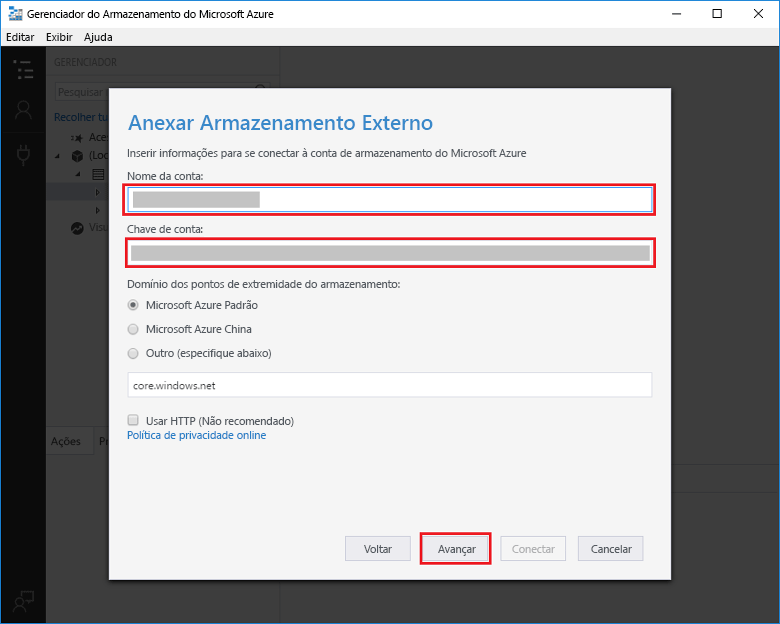

# Criar uma função disparada pelo Armazenamento de Filas do AzureCreate a function triggered by Azure Queue storage

Saiba como toocreate uma função disparada quando mensagens são enviadas tooan fila de armazenamento do Azure.Learn how toocreate a function triggered when messages are submitted tooan Azure Storage queue.

## Pré-requisitosPrerequisites

- Baixe e instale Olá [Microsoft Azure Storage Explorer](http://storageexplorer.com/).Download and install hello [Microsoft Azure Storage Explorer](http://storageexplorer.com/).

- Uma assinatura do Azure.An Azure subscription. Se você não tiver uma, crie uma [conta gratuita](https://azure.microsoft.com/free/?WT.mc_id=A261C142F) antes de começar.If you don't have one, create a [free account](https://azure.microsoft.com/free/?WT.mc_id=A261C142F) before you begin.

[!INCLUDE [functions-portal-favorite-function-apps](../../includes/functions-portal-favorite-function-apps.md)]

## Criar um Aplicativo de funções do AzureCreate an Azure Function app

[!INCLUDE [Create function app Azure portal](../../includes/functions-create-function-app-portal.md)]

Em seguida, crie uma função no novo aplicativo de função hello.Next, you create a function in hello new function app.

## Criar uma função disparada por FilasCreate a Queue triggered function

1. Expanda seu aplicativo de função e clique em Olá  **+**  botão Avançar muito**funções**.Expand your function app and click hello **+** button next too**Functions**. Se esta for a primeira função hello em seu aplicativo de função, selecione **função personalizada**.If this is hello first function in your function app, select **Custom function**. Isso exibe o conjunto completo de saudação de modelos de função.This displays hello complete set of function templates.

    

2. Selecione Olá **QueueTrigger** modelo para o idioma desejado e usar configurações de saudação conforme especificado na tabela de saudação.Select hello **QueueTrigger** template for your desired language, and  use hello settings as specified in hello table.

    
    
    | ConfiguraçãoSetting | Valor sugeridoSuggested value | DescriçãoDescription |
    |---|---|---|
    | **Nome da fila****Queue name**   | myqueue-itemsmyqueue-items    | Nome da saudação fila tooconnect tooin sua conta de armazenamento.Name of hello queue tooconnect tooin your Storage account. |
    | **Conexão da conta de armazenamento****Storage account connection** | AzureWebJobStorageAzureWebJobStorage | Você pode usar a conexão de conta de armazenamento Olá já está sendo usado pelo seu aplicativo de função ou criar um novo.You can use hello storage account connection already being used by your function app, or create a new one.  |
    | **Nomeie sua função****Name your function** | Exclusivo no aplicativo de funçõesUnique in your function app | O nome dessa função disparada por filas.Name of this queue triggered function. |

3. Clique em **criar** toocreate sua função.Click **Create** toocreate your function.

Em seguida, conecte-se a conta de armazenamento do Azure tooyour e criar hello **myqueue itens** fila de armazenamento.Next, you connect tooyour Azure Storage account and create hello **myqueue-items** storage queue.

## Criar fila OláCreate hello queue

1. Em sua função, clique em **Integrar**, expanda **Documentação**e copie **Nome da conta** e **Chave de conta**.In your function, click **Integrate**, expand **Documentation**, and copy both **Account name** and **Account key**. Você usar a conta de armazenamento essas credenciais tooconnect toohello.You use these credentials tooconnect toohello storage account. Se você já se conectou a sua conta de armazenamento, ignore toostep 4.If you have already connected your storage account, skip toostep 4.

    vv

1. Executar Olá [Microsoft Azure Storage Explorer](http://storageexplorer.com/) ferramenta, clique em Olá conectar ícone Olá esquerda, escolha **usar um nome de conta de armazenamento e chave**e clique em **próximo**.Run hello [Microsoft Azure Storage Explorer](http://storageexplorer.com/) tool, click hello connect icon on hello left, choose **Use a storage account name and key**, and click **Next**.

    

1. Digite hello **nome da conta** e **chave de conta** da etapa 1, clique em **próximo** e, em seguida, **conectar**.Enter hello **Account name** and **Account key** from step 1, click **Next** and then **Connect**.

    

1. Expanda a conta de armazenamento Olá anexado, clique no **filas**, clique em **criar fila**, tipo `myqueue-items`, e pressione enter.Expand hello attached storage account, right-click **Queues**, click **Create queue**, type `myqueue-items`, and then press enter.

    

Agora que você tem uma fila de armazenamento, você pode testar a função hello, adicionando uma fila de mensagens toohello.Now that you have a storage queue, you can test hello function by adding a message toohello queue.

## Função de saudação do testeTest hello function

1. Em Olá portal do Azure, procurar tooyour função expanda Olá **Logs** na parte inferior da saudação da página de saudação e verifique se esse fluxo de log não está em pausa.Back in hello Azure portal, browse tooyour function expand hello **Logs** at hello bottom of hello page and make sure that log streaming isn't paused.

1. No Gerenciador de Armazenamento, expanda sua conta de armazenamento, **Filas** e **myqueue-items**; em seguida, clique em **Adicionar mensagem**.In Storage Explorer, expand your storage account, **Queues**, and **myqueue-items**, then click **Add message**.

    

1. Digite sua mensagem "Olá, Mundo!"Type your "Hello World!" em **Texto da mensagem** e clique em **OK**.message in **Message text** and click **OK**.

1. Espere alguns segundos, em seguida, voltar tooyour função logs e verifique se que essa nova mensagem de saudação foi lida da fila de saudação.Wait for a few seconds, then go back tooyour function logs and verify that hello new message has been read from hello queue.

    

1. No Gerenciador de armazenamento, clique em **atualização** e verifique se essa mensagem de saudação foi processada e não está mais na fila de saudação.Back in Storage Explorer, click **Refresh** and verify that hello message has been processed and is no longer in hello queue.

## Limpar recursosClean up resources

[!INCLUDE [Next steps note](../../includes/functions-quickstart-cleanup.md)]

## Próximas etapasNext steps

Você criou uma função que é executada quando uma mensagem é adicionada tooa fila de armazenamento.You have created a function that runs when a message is added tooa storage queue.

[!INCLUDE [Next steps note](../../includes/functions-quickstart-next-steps.md)]

Para obter mais informações sobre gatilhos de Armazenamento de Filas, consulte [Associações de fila do Armazenamento do Azure Functions](functions-bindings-storage-queue.md).For more information about Queue storage triggers, see [Azure Functions Storage queue bindings](functions-bindings-storage-queue.md).