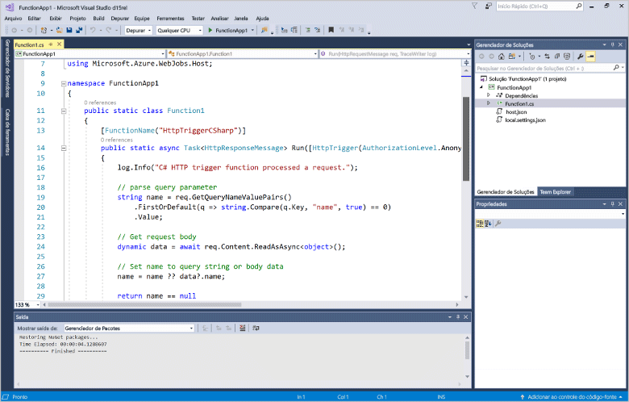
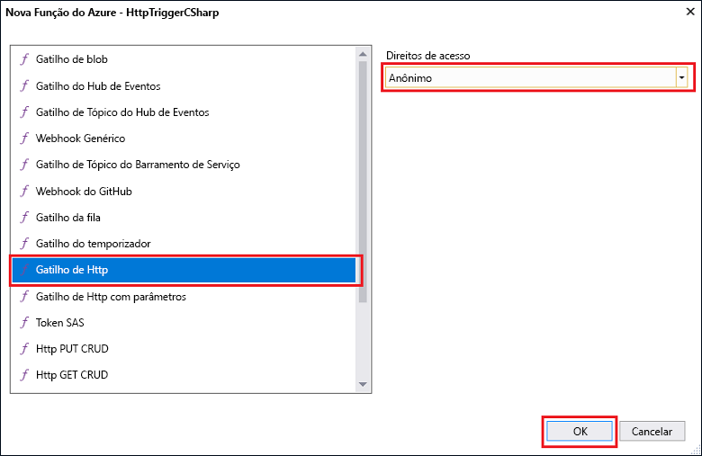

# Criar sua primeira função usando o Visual Studio

As funções do Azure permite que você execute seu código em um ambiente sem servidor sem ter que toofirst criar uma VM ou publicar um aplicativo web.

Neste tópico, você aprenderá como toouse Olá 2017 do Visual Studio tools para toocreate de funções do Azure e testar uma função de "hello world" localmente. Em seguida, você publicará Olá tooAzure de código de função. Essas ferramentas estão disponíveis como parte da carga de trabalho de desenvolvimento do Azure de saudação no Visual Studio 2017 versão 15,3 ou uma versão posterior.

## Pré-requisitos

toocomplete este tutorial, instalar:

* [Visual Studio 2017 versão 15,3](https://www.visualstudio.com/vs/preview/), incluindo Olá **desenvolvimento do Azure** carga de trabalho.

    
    
    >[!NOTE]  
    Depois de instalar ou atualizar tooVisual 2017 Studio versão 15,3, talvez seja necessário também ferramentas de saudação 2017 do Visual Studio atualização toomanually para funções do Azure. Você pode atualizar as ferramentas de saudação da saudação **ferramentas** menu em **extensões e atualizações...**   >  **Atualizações** > **Visual Studio Marketplace** > **Web e funções do Azure trabalhos ferramentas**  >  **Atualização**. 

[!INCLUDE [quickstarts-free-trial-note](../../includes/quickstarts-free-trial-note.md)] 

## Criar um projeto do Azure Functions no Visual Studio

[!INCLUDE [Create a project using hello Azure Functions template](../../includes/functions-vstools-create.md)]

Agora que você criou o projeto hello, você pode criar sua primeira função.

## Criar função hello

1. No **Gerenciador de Soluções**, clique com o botão direito do mouse no nó do projeto e selecione **Adicionar** > **Novo Item**. Selecione **Azure Function** e clique em **Adicionar**.

2. Selecione **HttpTrigger**, digite um **Nome da Função**, selecione **Anônimo** para **Direitos de Acesso**e clique em **Criar**. função Hello criada é acessada por uma solicitação HTTP de qualquer cliente. 

    

    Um arquivo de código é adicionado tooyour projeto que contém uma classe que implementa o código de função. Esse código é baseado em um modelo, que recebe um valor de nome e ecoa esse valor novamente. Olá **FunctionName** atributo define o nome de saudação da sua função. Olá **HttpTrigger** atributo indica a mensagem de saudação que dispara a função hello. 

    

Agora que você criou uma função disparada por HTTP, poderá testá-la em seu computador local.

## Testar função do hello localmente

As Ferramentas Principais do Azure Functions permitem executar o projeto do Azure Functions no seu computador de desenvolvimento local. Você é solicitado tooinstall essas ferramentas Olá a primeira vez que iniciar uma função do Visual Studio.  

1. tootest sua função, pressione F5. Se solicitado, aceitar solicitação de saudação de toodownload do Visual Studio e instalar as ferramentas de núcleo de funções do Azure (CLI).  Tooenable uma exceção de firewall também pode ser necessário para que as ferramentas de saudação podem manipular as solicitações HTTP.

2. Copiar URL da saudação da sua função do tempo de execução de funções do Azure Olá de saída.  

    

3. Cole a URL de saudação para solicitação HTTP Olá na barra de endereços do navegador. Acrescente a cadeia de caracteres de consulta Olá `&name=<yourname>` toothis URL e executar a solicitação de saudação. a seguir Olá mostra a resposta de Olá em Olá navegador toohello local solicitação GET retornada pela função hello: 

    

4. toostop depuração, clique em Olá **parar** botão na barra de ferramentas do Visual Studio hello.

Após ter verificado que função hello seja executado corretamente em seu computador local, é hora toopublish Olá projeto tooAzure.

## Publicar Olá projeto tooAzure

Você deve ter um aplicativo de funções em sua assinatura do Azure antes de publicar seu projeto. Você pode criar um aplicativo de funções diretamente no Visual Studio.

[!INCLUDE [Publish hello project tooAzure](../../includes/functions-vstools-publish.md)]

## Testar sua função no Azure

1. Copiar Olá URL base do aplicativo de função de saudação da página de perfil de publicação hello. Substituir saudação `localhost:port` parte da URL Olá usados ao testar a função hello localmente com hello nova URL base. Como antes, tornar-se de cadeia de consulta Olá tooappend `&name=<yourname>` toothis URL e executar a solicitação de saudação.

    Olá URL que chama o HTTP acionado função esta aparência:

        http://<functionappname>.azurewebsites.net/api/<functionname>?name=<yourname> 

2. Cole esta nova URL para solicitação HTTP de saudação na barra de endereços do navegador. a seguir Olá mostra a resposta de Olá em Olá navegador toohello remota solicitação GET retornada pela função hello: 

    
 
## Próximas etapas

Você usou o aplicativo de função de toocreate c# do Visual Studio com uma função HTTP disparado simples. 

+ toolearn como tooconfigure toosupport seu projeto outros tipos de gatilhos e associações, consulte Olá [configurar o projeto de saudação de desenvolvimento local](functions-develop-vs.md#configure-the-project-for-local-development) seção [ferramentas de funções do Azure para Visual Studio](functions-develop-vs.md).
+ toolearn mais sobre o local de teste e depuração usando hello Azure funções principais ferramentas, consulte [código e teste de funções do Azure localmente](functions-run-local.md). 
+ toolearn mais sobre como desenvolver funções como bibliotecas de classes do .NET, consulte [bibliotecas de classes do .NET usando com funções do Azure](functions-dotnet-class-library.md). 

