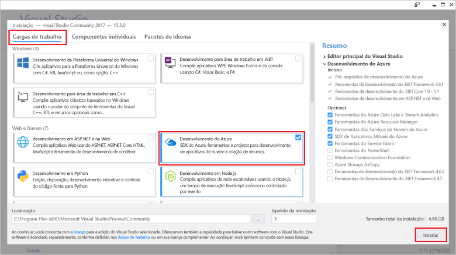

# Criar sua primeira função usando o Visual StudioCreate your first function using Visual Studio

As funções do Azure permite que você execute seu código em um ambiente sem servidor sem ter que toofirst criar uma VM ou publicar um aplicativo web.Azure Functions lets you execute your code in a serverless environment without having toofirst create a VM or publish a web application.

Neste tópico, você aprenderá como toouse Olá 2017 do Visual Studio tools para toocreate de funções do Azure e testar uma função de "hello world" localmente.In this topic, you learn how toouse hello Visual Studio 2017 tools for Azure Functions toocreate and test a "hello world" function locally. Em seguida, você publicará Olá tooAzure de código de função.You will then publish hello function code tooAzure. Essas ferramentas estão disponíveis como parte da carga de trabalho de desenvolvimento do Azure de saudação no Visual Studio 2017 versão 15,3 ou uma versão posterior.These tools are available as part of hello Azure development workload in Visual Studio 2017 version 15.3, or a later version.

## Pré-requisitosPrerequisites

toocomplete este tutorial, instalar:toocomplete this tutorial, install:

* [Visual Studio 2017 versão 15,3](https://www.visualstudio.com/vs/preview/), incluindo Olá **desenvolvimento do Azure** carga de trabalho.[Visual Studio 2017 version 15.3](https://www.visualstudio.com/vs/preview/), including hello **Azure development** workload.

    
    
    >[!NOTE]  
    Depois de instalar ou atualizar tooVisual 2017 Studio versão 15,3, talvez seja necessário também ferramentas de saudação 2017 do Visual Studio atualização toomanually para funções do Azure.After you install or upgrade tooVisual Studio 2017 version 15.3, you might also need toomanually update hello Visual Studio 2017 tools for Azure Functions. Você pode atualizar as ferramentas de saudação da saudação **ferramentas** menu em **extensões e atualizações...**   >  **Atualizações** > **Visual Studio Marketplace** > **Web e funções do Azure trabalhos ferramentas**  >  **Atualização**.You can update hello tools from hello **Tools** menu under **Extensions and Updates...** > **Updates** > **Visual Studio Marketplace** > **Azure Functions and Web Jobs Tools** > **Update**. 

[!INCLUDE [quickstarts-free-trial-note](../../includes/quickstarts-free-trial-note.md)] 

## Criar um projeto do Azure Functions no Visual StudioCreate an Azure Functions project in Visual Studio

[!INCLUDE [Create a project using hello Azure Functions template](../../includes/functions-vstools-create.md)]

Agora que você criou o projeto hello, você pode criar sua primeira função.Now that you have created hello project, you can create your first function.

## Criar função helloCreate hello function

1. No **Gerenciador de Soluções**, clique com o botão direito do mouse no nó do projeto e selecione **Adicionar** > **Novo Item**.In **Solution Explorer**, right-click on your project node and select **Add** > **New Item**. Selecione **Azure Function** e clique em **Adicionar**.Select **Azure Function** and click **Add**.

2. Selecione **HttpTrigger**, digite um **Nome da Função**, selecione **Anônimo** para **Direitos de Acesso**e clique em **Criar**.Select **HttpTrigger**, type a **Function Name**, select **Anonymous** for **Access Rights**, and click **Create**. função Hello criada é acessada por uma solicitação HTTP de qualquer cliente.hello function created is accessed by an HTTP request from any client. 

    

    Um arquivo de código é adicionado tooyour projeto que contém uma classe que implementa o código de função.A code file is added tooyour project that contains a class that implements your function code. Esse código é baseado em um modelo, que recebe um valor de nome e ecoa esse valor novamente.This code is based on a template, which receives a name value and echos it back. Olá **FunctionName** atributo define o nome de saudação da sua função.hello **FunctionName** attribute sets hello name of your function. Olá **HttpTrigger** atributo indica a mensagem de saudação que dispara a função hello.hello **HttpTrigger** attribute indicates hello message that triggers hello function. 

    

Agora que você criou uma função disparada por HTTP, poderá testá-la em seu computador local.Now that you have created an HTTP-triggered function, you can test it on your local computer.

## Testar função do hello localmenteTest hello function locally

As Ferramentas Principais do Azure Functions permitem executar o projeto do Azure Functions no seu computador de desenvolvimento local.Azure Functions Core Tools lets you run Azure Functions project on your local development computer. Você é solicitado tooinstall essas ferramentas Olá a primeira vez que iniciar uma função do Visual Studio.You are prompted tooinstall these tools hello first time you start a function from Visual Studio.  

1. tootest sua função, pressione F5.tootest your function, press F5. Se solicitado, aceitar solicitação de saudação de toodownload do Visual Studio e instalar as ferramentas de núcleo de funções do Azure (CLI).If prompted, accept hello request from Visual Studio toodownload and install Azure Functions Core (CLI) tools.  Tooenable uma exceção de firewall também pode ser necessário para que as ferramentas de saudação podem manipular as solicitações HTTP.You may also need tooenable a firewall exception so that hello tools can handle HTTP requests.

2. Copiar URL da saudação da sua função do tempo de execução de funções do Azure Olá de saída.Copy hello URL of your function from hello Azure Functions runtime output.  

    

3. Cole a URL de saudação para solicitação HTTP Olá na barra de endereços do navegador.Paste hello URL for hello HTTP request into your browser's address bar. Acrescente a cadeia de caracteres de consulta Olá `&name=<yourname>` toothis URL e executar a solicitação de saudação.Append hello query string `&name=<yourname>` toothis URL and execute hello request. a seguir Olá mostra a resposta de Olá em Olá navegador toohello local solicitação GET retornada pela função hello:hello following shows hello response in hello browser toohello local GET request returned by hello function: 

    

4. toostop depuração, clique em Olá **parar** botão na barra de ferramentas do Visual Studio hello.toostop debugging, click hello **Stop** button on hello Visual Studio toolbar.

Após ter verificado que função hello seja executado corretamente em seu computador local, é hora toopublish Olá projeto tooAzure.After you have verified that hello function runs correctly on your local computer, it's time toopublish hello project tooAzure.

## Publicar Olá projeto tooAzurePublish hello project tooAzure

Você deve ter um aplicativo de funções em sua assinatura do Azure antes de publicar seu projeto.You must have a function app in your Azure subscription before you can publish your project. Você pode criar um aplicativo de funções diretamente no Visual Studio.You can create a function app right from Visual Studio.

[!INCLUDE [Publish hello project tooAzure](../../includes/functions-vstools-publish.md)]

## Testar sua função no AzureTest your function in Azure

1. Copiar Olá URL base do aplicativo de função de saudação da página de perfil de publicação hello.Copy hello base URL of hello function app from hello Publish profile page. Substituir saudação `localhost:port` parte da URL Olá usados ao testar a função hello localmente com hello nova URL base.Replace hello `localhost:port` portion of hello URL you used when testing hello function locally with hello new base URL. Como antes, tornar-se de cadeia de consulta Olá tooappend `&name=<yourname>` toothis URL e executar a solicitação de saudação.As before, make sure tooappend hello query string `&name=<yourname>` toothis URL and execute hello request.

    Olá URL que chama o HTTP acionado função esta aparência:hello URL that calls your HTTP triggered function looks like this:

        http://<functionappname>.azurewebsites.net/api/<functionname>?name=<yourname> 

2. Cole esta nova URL para solicitação HTTP de saudação na barra de endereços do navegador.Paste this new URL for hello HTTP request into your browser's address bar. a seguir Olá mostra a resposta de Olá em Olá navegador toohello remota solicitação GET retornada pela função hello:hello following shows hello response in hello browser toohello remote GET request returned by hello function: 

    
 
## Próximas etapasNext steps

Você usou o aplicativo de função de toocreate c# do Visual Studio com uma função HTTP disparado simples.You have used Visual Studio toocreate a C# function app with a simple HTTP triggered function. 

+ toolearn como tooconfigure toosupport seu projeto outros tipos de gatilhos e associações, consulte Olá [configurar o projeto de saudação de desenvolvimento local](functions-develop-vs.md#configure-the-project-for-local-development) seção [ferramentas de funções do Azure para Visual Studio](functions-develop-vs.md).toolearn how tooconfigure your project toosupport other types of triggers and bindings, see hello [Configure hello project for local development](functions-develop-vs.md#configure-the-project-for-local-development) section in [Azure Functions Tools for Visual Studio](functions-develop-vs.md).
+ toolearn mais sobre o local de teste e depuração usando hello Azure funções principais ferramentas, consulte [código e teste de funções do Azure localmente](functions-run-local.md).toolearn more about local testing and debugging using hello Azure Functions Core Tools, see [Code and test Azure Functions locally](functions-run-local.md). 
+ toolearn mais sobre como desenvolver funções como bibliotecas de classes do .NET, consulte [bibliotecas de classes do .NET usando com funções do Azure](functions-dotnet-class-library.md).toolearn more about developing functions as .NET class libraries, see [Using .NET class libraries with Azure Functions](functions-dotnet-class-library.md). 

