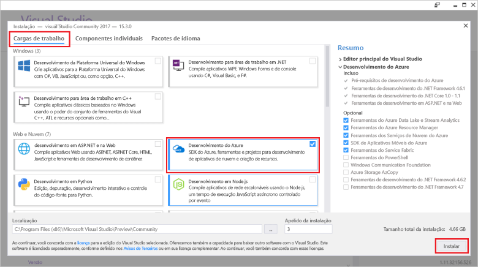

# <a name="azure-functions-tools-for-visual-studio"></a>Ferramentas do Azure Functions para Visual Studio 2017  

Ferramentas de funções do Azure para Visual Studio de 2017 é uma extensão do Visual Studio que permite que você desenvolver, testar e implantar funções tooAzure de c#. Se esta for sua primeira experiência com funções do Azure, você pode aprender mais em [tooAzure uma introdução funções](functions-overview.md).

Olá ferramentas de funções do Azure fornece Olá benefícios a seguir: 

* Editar, criar e executar funções em seu computador de desenvolvimento local. 
* Publicar diretamente de funções do Azure projeto tooAzure. 
* Use associações de função do WebJobs atributos toodeclare diretamente em Olá código c# em vez de manter um function.json separados para definições de associação.
* Desenvolver e implantar funções de pré-compiladas C#. Funções pré-compiladas fornecem um desempenho de inicialização a frio melhor que funções baseadas em script C#. 
* Código de funções em c# tendo todos os benefícios de saudação do desenvolvimento do Visual Studio. 

Este tópico mostra como toouse hello ferramentas de funções do Azure para Visual Studio de 2017 toodevelop funções em c#. Você também aprenderá como toopublish tooAzure seu projeto como um assembly do .NET.

## <a name="prerequisites"></a>Pré-requisitos

Ferramentas de funções do Azure está incluída na carga de trabalho de desenvolvimento do Azure de saudação do [Visual Studio 2017 versão 15,3](https://www.visualstudio.com/vs/), ou uma versão posterior. Certifique-se de incluir Olá **desenvolvimento do Azure** cargas de trabalho em sua instalação de versão 15,3 2017 do Visual Studio:



toocreate e implantar funções, você também precisa de:

* Uma assinatura ativa do Azure. Se você ainda não tiver uma assinatura do Azure, há [contas gratuitas](https://azure.microsoft.com/free/?WT.mc_id=A261C142F) disponíveis.

* Uma conta de armazenamento do Azure. toocreate uma conta de armazenamento, consulte [criar uma conta de armazenamento](../storage/common/storage-create-storage-account.md#create-a-storage-account).  
## <a name="create-an-azure-functions-project"></a>Criar um projeto do Azure Functions 

[!INCLUDE [Create a project using hello Azure Functions](../../includes/functions-vstools-create.md)]


## <a name="configure-hello-project-for-local-development"></a>Configurar projeto Olá para desenvolvimento local

Quando você cria um novo projeto usando o modelo de funções do Azure hello, você obtém um projeto c# vazio que contém Olá seguintes arquivos:

* **host.JSON**: permite que você configure Olá host de funções. Essas configurações se aplicam para execução local e no Azure. Para obter mais informações, consulte o artigo de referência para [host.json](https://github.com/Azure/azure-webjobs-sdk-script/wiki/host.json).
    
* **local.Settings.json**: Mantém as configurações usadas ao executar as funções localmente. Essas configurações não são usadas pelo Azure, eles são usados pelo Olá [Azure funções principais ferramentas](functions-run-local.md). Use as configurações toospecify esse arquivo, como tooother de cadeias de caracteres de conexão do Azure services. Adicionar um novo toohello chave **valores** matriz para cada conexão exigido pelas funções em seu projeto. Para obter mais informações, consulte [arquivo de configurações Local](functions-run-local.md#local-settings-file) tópico de ferramentas do Azure funções principais de saudação.

tempo de execução de funções Hello usa internamente uma conta de armazenamento do Azure. Todos os disparar tipos diferentes de HTTP e webhooks, você deve definir Olá **Values.AzureWebJobsStorage** chave de cadeia de conexão de conta de armazenamento do Azure válida de tooa.

[!INCLUDE [Note toonot use local storage](../../includes/functions-local-settings-note.md)]

 cadeia de conexão do conta de armazenamento de saudação tooset:

1. No Visual Studio, abra **Cloud Explorer**, expanda **conta de armazenamento** > **sua conta de armazenamento**, em seguida, selecione **propriedades**e cópia hello **cadeia de caracteres de Conexão primária** valor.   

2. No seu projeto, abrir o arquivo de projeto local.settings.json hello e definir valor Olá Olá **AzureWebJobsStorage** chave de cadeia de caracteres de conexão toohello você copiou.

3. Repita Olá anterior etapa tooadd chaves exclusivas toohello **valores** matriz para todas as outras conexões necessária por suas funções.  

## <a name="create-a-function"></a>Criar uma função

Em funções pré-compilado, associações de saudação usadas pela função hello são definidas aplicando atributos no código de saudação. Quando você usa Olá ferramentas de funções do Azure toocreate suas funções de modelos de saudação fornecido, esses atributos são aplicados para você. 

1. No **Gerenciador de Soluções**, clique com o botão direito do mouse no nó do projeto e selecione **Adicionar** > **Novo Item**. Selecione **Azure função**, digite um **nome** para classe hello e clique em **adicionar**.

2. Escolha o disparador, definir propriedades de associação de saudação e clique em **criar**. Olá exemplo a seguir mostra as configurações de saudação quando criar um armazenamento de fila disparado função. 

    
    
    Uma chave de cadeia de caracteres de conexão chamada **QueueStorage** for fornecido, que é definida no arquivo de local.settings.json hello. 
 
3. Examine Olá recém-adicionado classe. Você verá um estático **executar** método, que é atribuído com hello **FunctionName** atributo. Esse atributo indica que o método hello é o ponto de entrada hello para função hello. 

    Por exemplo, Olá classe c# a seguir representa uma função de armazenamento disparado fila básica:

    ````csharp
    using System;
    using Microsoft.Azure.WebJobs;
    using Microsoft.Azure.WebJobs.Host;
    
    namespace FunctionApp1
    {
        public static class Function1
        {
            [FunctionName("QueueTriggerCSharp")]        
            public static void Run([QueueTrigger("myqueue-items", Connection = "QueueStorage")]string myQueueItem, TraceWriter log)
            {
                log.Info($"C# Queue trigger function processed: {myQueueItem}");
            }
        }
    } 
    ````
 
    Um atributo específico de associação é o método de ponto de entrada tooeach aplicada associação parâmetro fornecido toohello. atributo de saudação tem informações de associação hello como parâmetros. No exemplo anterior de saudação, Olá primeiro parâmetro tiver um **QueueTrigger** atributo aplicado, que indica a função de fila disparada. nome da fila de saudação e o nome de configuração de cadeia de caracteres de conexão são passadas como parâmetros.  

## <a name="testing-functions"></a>Funções de teste

As Ferramentas Principais do Azure Functions permitem executar o projeto do Azure Functions no seu computador de desenvolvimento local. Você é solicitado tooinstall essas ferramentas Olá a primeira vez que iniciar uma função do Visual Studio.  

tootest sua função, pressione F5. Se solicitado, aceitar solicitação de saudação de toodownload do Visual Studio e instalar as ferramentas de núcleo de funções do Azure (CLI).  Tooenable uma exceção de firewall também pode ser necessário para que as ferramentas de saudação podem manipular as solicitações HTTP.

Com projeto de saudação em execução, você pode testar seu código, você deve testar função implantada. Para saber mais informações, consulte [Estratégias para testar seu código no Azure Functions](functions-test-a-function.md). Quando em execução no modo de depuração, os pontos de interrupção são atingidos no Visual Studio, conforme o esperado. 

Para obter um exemplo de como uma fila de tootest disparou a função, consulte Olá [tutorial de início rápido de função de fila disparada](functions-create-storage-queue-triggered-function.md#test-the-function).  

toolearn mais sobre como usar o hello Azure funções principais ferramentas, consulte [código e teste do Azure funciona localmente](functions-run-local.md).

## <a name="publish-tooazure"></a>Publicar tooAzure

[!INCLUDE [Publish hello project tooAzure](../../includes/functions-vstools-publish.md)]

>[!NOTE]  
>Quaisquer configurações adicionadas no hello local.settings.json devem também ser adicionadas toohello função aplicativo no Azure. Essas configurações não são adicionadas automaticamente. Você pode adicionar o aplicativo de função tooyour configurações necessárias em uma das seguintes maneiras:
>
>* [Usando o portal do Azure de Olá](functions-how-to-use-azure-function-app-settings.md#settings).
>* [Usando Olá `--publish-local-settings` opção de publicação hello Azure funções principais ferramentas](functions-run-local.md#publish).
>* [Usando Olá CLI do Azure](/cli/azure/functionapp/config/appsettings#set). 

## <a name="next-steps"></a>Próximas etapas

Para obter mais informações sobre ferramentas de funções do Azure, consulte Olá seção de perguntas comuns Olá [ferramentas do Visual Studio 2017 para funções do Azure](https://blogs.msdn.microsoft.com/webdev/2017/05/10/azure-function-tools-for-visual-studio-2017/) postagem de blog.

toolearn mais sobre hello Azure funções principais ferramentas, consulte [código e teste do Azure funciona localmente](functions-run-local.md).  
toolearn mais sobre como desenvolver funções como bibliotecas de classes do .NET, consulte [bibliotecas de classes do .NET usando com funções do Azure](functions-dotnet-class-library.md). Este tópico também fornece exemplos de como toouse atributos toodeclare Olá vários tipos de associações com suporte pelas funções do Azure.    
