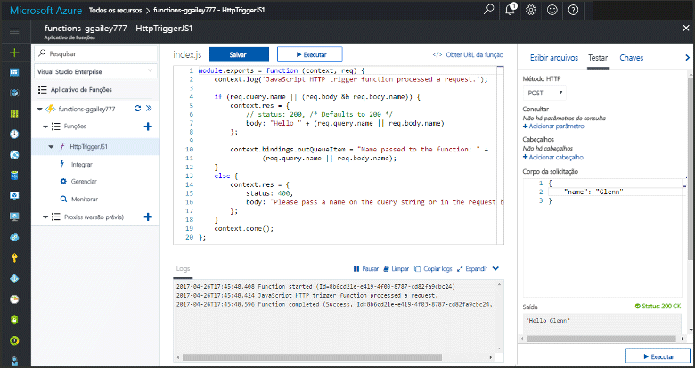
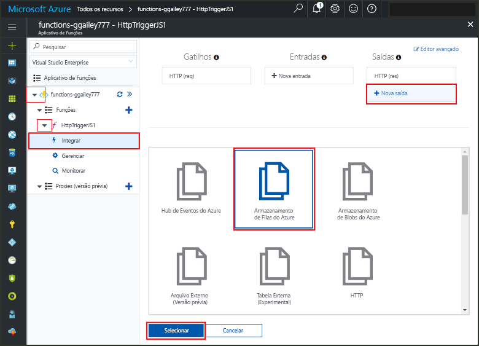
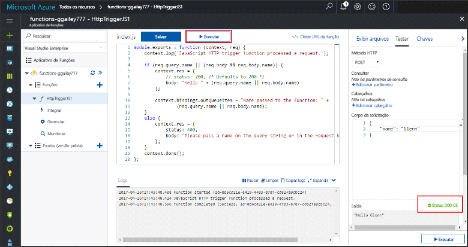
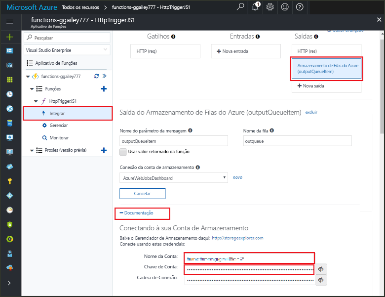

# <a name="add-messages-to-an-azure-storage-queue-using-functions"></a><span data-ttu-id="dfcf9-103">Adicionar mensagens a uma fila do Armazenamento do Azure usando o Functions</span><span class="sxs-lookup"><span data-stu-id="dfcf9-103">Add messages to an Azure Storage queue using Functions</span></span>

<span data-ttu-id="dfcf9-104">No Azure Functions, associações de entrada e saída fornecem uma maneira declarativa para se conectar a dados de serviço externo de sua função.</span><span class="sxs-lookup"><span data-stu-id="dfcf9-104">In Azure Functions, input and output bindings provide a declarative way to connect to external service data from your function.</span></span> <span data-ttu-id="dfcf9-105">Neste tópico, aprenda como atualizar uma função existente, adicionando uma associação de saída que envia mensagens para o Armazenamento de Filas do Azure.</span><span class="sxs-lookup"><span data-stu-id="dfcf9-105">In this topic, learn how to update an existing function by adding an output binding that sends messages to Azure Queue storage.</span></span>  



## <a name="prerequisites"></a><span data-ttu-id="dfcf9-107">Pré-requisitos</span><span class="sxs-lookup"><span data-stu-id="dfcf9-107">Prerequisites</span></span> 

[!INCLUDE [Previous topics](../../includes/functions-quickstart-previous-topics.md)]

* <span data-ttu-id="dfcf9-108">Instale o Experimente usar o [Gerenciador de Armazenamento do Microsoft Azure](http://storageexplorer.com/).</span><span class="sxs-lookup"><span data-stu-id="dfcf9-108">Install the [Microsoft Azure Storage Explorer](http://storageexplorer.com/).</span></span>

## <span data-ttu-id="dfcf9-109"><a name="add-binding"></a>Adicionar uma associação de saída</span><span class="sxs-lookup"><span data-stu-id="dfcf9-109"><a name="add-binding"></a>Add an output binding</span></span>
 
1. <span data-ttu-id="dfcf9-110">Expanda seu aplicativo de funções e sua função.</span><span class="sxs-lookup"><span data-stu-id="dfcf9-110">Expand both your function app and your function.</span></span>

2. <span data-ttu-id="dfcf9-111">Selecione **Integrar** e **+ Nova saída**, escolha **Armazenamento de filas do Azure** e escolha **Selecionar**.</span><span class="sxs-lookup"><span data-stu-id="dfcf9-111">Select **Integrate** and **+ New output**, then choose **Azure Queue storage** and choose **Select**.</span></span>
    
    

3. <span data-ttu-id="dfcf9-113">Use as configurações conforme especificado na tabela:</span><span class="sxs-lookup"><span data-stu-id="dfcf9-113">Use the settings as specified in the table:</span></span> 

    

    | <span data-ttu-id="dfcf9-115">Configuração</span><span class="sxs-lookup"><span data-stu-id="dfcf9-115">Setting</span></span>      |  <span data-ttu-id="dfcf9-116">Valor sugerido</span><span class="sxs-lookup"><span data-stu-id="dfcf9-116">Suggested value</span></span>   | <span data-ttu-id="dfcf9-117">Descrição</span><span class="sxs-lookup"><span data-stu-id="dfcf9-117">Description</span></span>                              |
    | ------------ |  ------- | -------------------------------------------------- |
    | <span data-ttu-id="dfcf9-118">**Nome da fila**</span><span class="sxs-lookup"><span data-stu-id="dfcf9-118">**Queue name**</span></span>   | <span data-ttu-id="dfcf9-119">myqueue-items</span><span class="sxs-lookup"><span data-stu-id="dfcf9-119">myqueue-items</span></span>    | <span data-ttu-id="dfcf9-120">Nome da fila à qual se conectar em sua conta de armazenamento.</span><span class="sxs-lookup"><span data-stu-id="dfcf9-120">The name of the queue to connect to in your Storage account.</span></span> |
    | <span data-ttu-id="dfcf9-121">**Conexão da conta de armazenamento**</span><span class="sxs-lookup"><span data-stu-id="dfcf9-121">**Storage account connection**</span></span> | <span data-ttu-id="dfcf9-122">AzureWebJobStorage</span><span class="sxs-lookup"><span data-stu-id="dfcf9-122">AzureWebJobStorage</span></span> | <span data-ttu-id="dfcf9-123">Você pode usar a conexão da conta de armazenamento que já está sendo usada por seu aplicativo de funções ou criar uma nova.</span><span class="sxs-lookup"><span data-stu-id="dfcf9-123">You can use the storage account connection already being used by your function app, or create a new one.</span></span>  |
    | <span data-ttu-id="dfcf9-124">**Nome do parâmetro de mensagem**</span><span class="sxs-lookup"><span data-stu-id="dfcf9-124">**Message parameter name**</span></span> | <span data-ttu-id="dfcf9-125">outputQueueItem</span><span class="sxs-lookup"><span data-stu-id="dfcf9-125">outputQueueItem</span></span> | <span data-ttu-id="dfcf9-126">O nome do parâmetro de associação de saída.</span><span class="sxs-lookup"><span data-stu-id="dfcf9-126">The name of the output binding parameter.</span></span> | 

4. <span data-ttu-id="dfcf9-127">Clique em **Salvar** para adicionar a associação.</span><span class="sxs-lookup"><span data-stu-id="dfcf9-127">Click **Save** to add the binding.</span></span>
 
<span data-ttu-id="dfcf9-128">Agora que você tem uma associação de saída definida, você precisa atualizar o código para usar a associação para adicionar mensagens a uma fila.</span><span class="sxs-lookup"><span data-stu-id="dfcf9-128">Now that you have an output binding defined, you need to update the code to use the binding to add messages to a queue.</span></span>  

## <a name="update-the-function-code"></a><span data-ttu-id="dfcf9-129">Atualizar o código de função</span><span class="sxs-lookup"><span data-stu-id="dfcf9-129">Update the function code</span></span>

1. <span data-ttu-id="dfcf9-130">Selecione sua função para exibir o código de função no editor.</span><span class="sxs-lookup"><span data-stu-id="dfcf9-130">Select your function to display the function code in the editor.</span></span> 

2. <span data-ttu-id="dfcf9-131">Para uma função C#, atualize sua definição de função como demonstrado a seguir para adicionar o parâmetro de associação de armazenamento **outputQueueItem**.</span><span class="sxs-lookup"><span data-stu-id="dfcf9-131">For a C# function, update your function definition as follows to add the **outputQueueItem** storage binding parameter.</span></span> <span data-ttu-id="dfcf9-132">Ignore esta etapa para uma função JavaScript.</span><span class="sxs-lookup"><span data-stu-id="dfcf9-132">Skip this step for a JavaScript function.</span></span>

    ```cs   
    public static async Task<HttpResponseMessage> Run(HttpRequestMessage req, 
        ICollector<string> outputQueueItem, TraceWriter log)
    {
        ....
    }
    ```

3. <span data-ttu-id="dfcf9-133">Adicione o código a seguir à função logo antes do método retornar.</span><span class="sxs-lookup"><span data-stu-id="dfcf9-133">Add the following code to the function just before the method returns.</span></span> <span data-ttu-id="dfcf9-134">Use o trecho de código apropriado para a linguagem de programação de sua função.</span><span class="sxs-lookup"><span data-stu-id="dfcf9-134">Use the appropriate snippet for the language of your function.</span></span>

    ```javascript
    context.bindings.outputQueueItem = "Name passed to the function: " + 
                (req.query.name || req.body.name);
    ```

    ```cs
    outputQueueItem.Add("Name passed to the function: " + name);     
    ```

4. <span data-ttu-id="dfcf9-135">Selecione **Salvar** para salvar as alterações.</span><span class="sxs-lookup"><span data-stu-id="dfcf9-135">Select **Save** to save changes.</span></span>

<span data-ttu-id="dfcf9-136">O valor passado para o gatilho HTTP é incluído em uma mensagem adicionada à fila.</span><span class="sxs-lookup"><span data-stu-id="dfcf9-136">The value passed to the HTTP trigger is included in a message added to the queue.</span></span>
 
## <a name="test-the-function"></a><span data-ttu-id="dfcf9-137">Testar a função</span><span class="sxs-lookup"><span data-stu-id="dfcf9-137">Test the function</span></span> 

1. <span data-ttu-id="dfcf9-138">Depois que as alterações de código forem salvas, selecione **Executar**.</span><span class="sxs-lookup"><span data-stu-id="dfcf9-138">After the code changes are saved, select **Run**.</span></span> 

    

2. <span data-ttu-id="dfcf9-140">Confira os logs para verificar se a função foi bem-sucedida.</span><span class="sxs-lookup"><span data-stu-id="dfcf9-140">Check the logs to make sure that the function succeeded.</span></span> <span data-ttu-id="dfcf9-141">Uma nova fila denominada **outqueue** é criada na sua conta de armazenamento pelo tempo de execução do Functions quando a associação de saída é usada pela primeira vez.</span><span class="sxs-lookup"><span data-stu-id="dfcf9-141">A new queue named **outqueue** is created in your Storage account by the Functions runtime when the output binding is first used.</span></span>

<span data-ttu-id="dfcf9-142">Em seguida, você pode se conectar à sua conta de armazenamento para verificar a nova fila e a mensagem que você adicionou a ela.</span><span class="sxs-lookup"><span data-stu-id="dfcf9-142">Next, you can connect to your storage account to verify the new queue and the message you added to it.</span></span> 

## <a name="connect-to-the-queue"></a><span data-ttu-id="dfcf9-143">Conectar-se à fila</span><span class="sxs-lookup"><span data-stu-id="dfcf9-143">Connect to the queue</span></span>

<span data-ttu-id="dfcf9-144">Ignore as três primeiras etapas se você já tiver instalado o Gerenciador de Armazenamento e o conectado à sua conta de armazenamento.</span><span class="sxs-lookup"><span data-stu-id="dfcf9-144">Skip the first three steps if you have already installed Storage Explorer and connected it to your storage account.</span></span>    

1. <span data-ttu-id="dfcf9-145">Em sua função, escolha **Integrar** e na nova associação de saída **Armazenamento de Filas do Azure**, em seguida, expanda **Documentação**.</span><span class="sxs-lookup"><span data-stu-id="dfcf9-145">In your function, choose **Integrate** and the new **Azure Queue storage** output binding, then expand **Documentation**.</span></span> <span data-ttu-id="dfcf9-146">Copie o **Nome da conta** e a **Chave de conta**.</span><span class="sxs-lookup"><span data-stu-id="dfcf9-146">Copy both **Account name** and **Account key**.</span></span> <span data-ttu-id="dfcf9-147">Você usa essas credenciais para conectar-se à conta de armazenamento.</span><span class="sxs-lookup"><span data-stu-id="dfcf9-147">You use these credentials to connect to the storage account.</span></span>
 
    

2. <span data-ttu-id="dfcf9-149">Execute a ferramenta [Gerenciador de Armazenamento do Microsoft Azure](http://storageexplorer.com/), selecione o ícone conectar-se à esquerda, escolha **Usar um nome e chave de conta de armazenamento** e selecione **Avançar**.</span><span class="sxs-lookup"><span data-stu-id="dfcf9-149">Run the [Microsoft Azure Storage Explorer](http://storageexplorer.com/) tool, select the connect icon on the left, choose **Use a storage account name and key**, and select **Next**.</span></span>

    
    
3. <span data-ttu-id="dfcf9-151">Cole o **Nome da conta** e a **Chave de conta** da etapa 1 em seus campos correspondentes e selecione **Avançar** e **Conectar**.</span><span class="sxs-lookup"><span data-stu-id="dfcf9-151">Paste the **Account name** and **Account key** from step 1 into their corresponding fields, then select **Next**, and **Connect**.</span></span> 
  
    

4. <span data-ttu-id="dfcf9-153">Expanda a conta de armazenamento anexada, expanda **Filas** e verifique a existência de uma fila chamada **myqueue-items**.</span><span class="sxs-lookup"><span data-stu-id="dfcf9-153">Expand the attached storage account, expand **Queues** and verify that a queue named **myqueue-items** exists.</span></span> <span data-ttu-id="dfcf9-154">Você também deverá ver uma mensagem já presente na fila.</span><span class="sxs-lookup"><span data-stu-id="dfcf9-154">You should also see a message already in the queue.</span></span>  
 
    
 

## <a name="clean-up-resources"></a><span data-ttu-id="dfcf9-156">Limpar recursos</span><span class="sxs-lookup"><span data-stu-id="dfcf9-156">Clean up resources</span></span>

[!INCLUDE [Next steps note](../../includes/functions-quickstart-cleanup.md)]

## <a name="next-steps"></a><span data-ttu-id="dfcf9-157">Próximas etapas</span><span class="sxs-lookup"><span data-stu-id="dfcf9-157">Next steps</span></span>

<span data-ttu-id="dfcf9-158">Você adicionou uma associação de saída a uma função existente.</span><span class="sxs-lookup"><span data-stu-id="dfcf9-158">You have added an output binding to an existing function.</span></span> 

[!INCLUDE [Next steps note](../../includes/functions-quickstart-next-steps.md)]

<span data-ttu-id="dfcf9-159">Para obter mais informações sobre associação a Armazenamento de Filas, consulte [Associações de fila do Armazenamento do Azure Functions](functions-bindings-storage-queue.md).</span><span class="sxs-lookup"><span data-stu-id="dfcf9-159">For more information about binding to Queue storage, see [Azure Functions Storage queue bindings](functions-bindings-storage-queue.md).</span></span> 


