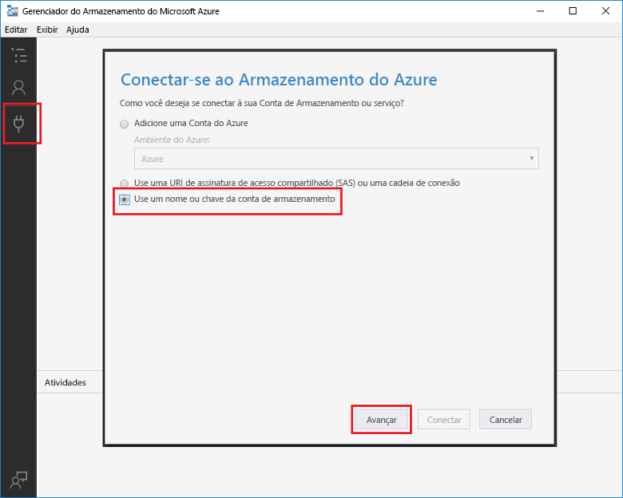

# <a name="add-messages-tooan-azure-storage-queue-using-functions"></a><span data-ttu-id="ca428-103">Adicionar a fila mensagens tooan armazenamento do Azure usando funções</span><span class="sxs-lookup"><span data-stu-id="ca428-103">Add messages tooan Azure Storage queue using Functions</span></span>

<span data-ttu-id="ca428-104">Em funções do Azure, as associações de entrada e saídas fornecem um forma declarativa tooconnect tooexternal serviço de dados de sua função.</span><span class="sxs-lookup"><span data-stu-id="ca428-104">In Azure Functions, input and output bindings provide a declarative way tooconnect tooexternal service data from your function.</span></span> <span data-ttu-id="ca428-105">Neste tópico, Aprenda como tooupdate uma função existente, adicionando uma saída de associação que envia mensagens tooAzure armazenamento de fila.</span><span class="sxs-lookup"><span data-stu-id="ca428-105">In this topic, learn how tooupdate an existing function by adding an output binding that sends messages tooAzure Queue storage.</span></span>  


## <a name="prerequisites"></a><span data-ttu-id="ca428-107">Pré-requisitos</span><span class="sxs-lookup"><span data-stu-id="ca428-107">Prerequisites</span></span> 

[!INCLUDE [Previous topics](../../includes/functions-quickstart-previous-topics.md)]

* <span data-ttu-id="ca428-108">Instalar Olá [Microsoft Azure Storage Explorer](http://storageexplorer.com/).</span><span class="sxs-lookup"><span data-stu-id="ca428-108">Install hello [Microsoft Azure Storage Explorer](http://storageexplorer.com/).</span></span>

## <span data-ttu-id="ca428-109"><a name="add-binding"></a>Adicionar uma associação de saída</span><span class="sxs-lookup"><span data-stu-id="ca428-109"><a name="add-binding"></a>Add an output binding</span></span>
 
1. <span data-ttu-id="ca428-110">Expanda seu aplicativo de funções e sua função.</span><span class="sxs-lookup"><span data-stu-id="ca428-110">Expand both your function app and your function.</span></span>

2. <span data-ttu-id="ca428-111">Selecione **Integrar** e **+ Nova saída**, escolha **Armazenamento de filas do Azure** e escolha **Selecionar**.</span><span class="sxs-lookup"><span data-stu-id="ca428-111">Select **Integrate** and **+ New output**, then choose **Azure Queue storage** and choose **Select**.</span></span>
    
    

3. <span data-ttu-id="ca428-113">Usar configurações de saudação conforme especificado na tabela de saudação:</span><span class="sxs-lookup"><span data-stu-id="ca428-113">Use hello settings as specified in hello table:</span></span> 

    

    | <span data-ttu-id="ca428-115">Configuração</span><span class="sxs-lookup"><span data-stu-id="ca428-115">Setting</span></span>      |  <span data-ttu-id="ca428-116">Valor sugerido</span><span class="sxs-lookup"><span data-stu-id="ca428-116">Suggested value</span></span>   | <span data-ttu-id="ca428-117">Descrição</span><span class="sxs-lookup"><span data-stu-id="ca428-117">Description</span></span>                              |
    | ------------ |  ------- | -------------------------------------------------- |
    | <span data-ttu-id="ca428-118">**Nome da fila**</span><span class="sxs-lookup"><span data-stu-id="ca428-118">**Queue name**</span></span>   | <span data-ttu-id="ca428-119">myqueue-items</span><span class="sxs-lookup"><span data-stu-id="ca428-119">myqueue-items</span></span>    | <span data-ttu-id="ca428-120">nome de saudação do hello fila tooconnect tooin sua conta de armazenamento.</span><span class="sxs-lookup"><span data-stu-id="ca428-120">hello name of hello queue tooconnect tooin your Storage account.</span></span> |
    | <span data-ttu-id="ca428-121">**Conexão da conta de armazenamento**</span><span class="sxs-lookup"><span data-stu-id="ca428-121">**Storage account connection**</span></span> | <span data-ttu-id="ca428-122">AzureWebJobStorage</span><span class="sxs-lookup"><span data-stu-id="ca428-122">AzureWebJobStorage</span></span> | <span data-ttu-id="ca428-123">Você pode usar a conexão de conta de armazenamento Olá já está sendo usado pelo seu aplicativo de função ou criar um novo.</span><span class="sxs-lookup"><span data-stu-id="ca428-123">You can use hello storage account connection already being used by your function app, or create a new one.</span></span>  |
    | <span data-ttu-id="ca428-124">**Nome do parâmetro de mensagem**</span><span class="sxs-lookup"><span data-stu-id="ca428-124">**Message parameter name**</span></span> | <span data-ttu-id="ca428-125">outputQueueItem</span><span class="sxs-lookup"><span data-stu-id="ca428-125">outputQueueItem</span></span> | <span data-ttu-id="ca428-126">nome de Olá Olá associação de parâmetro de saída.</span><span class="sxs-lookup"><span data-stu-id="ca428-126">hello name of hello output binding parameter.</span></span> | 

4. <span data-ttu-id="ca428-127">Clique em **salvar** tooadd associação de saudação.</span><span class="sxs-lookup"><span data-stu-id="ca428-127">Click **Save** tooadd hello binding.</span></span>
 
<span data-ttu-id="ca428-128">Agora que você tem uma associação de saída definida, você precisa tooupdate Olá código toouse Olá associação tooadd tooa fila de mensagens.</span><span class="sxs-lookup"><span data-stu-id="ca428-128">Now that you have an output binding defined, you need tooupdate hello code toouse hello binding tooadd messages tooa queue.</span></span>  

## <a name="update-hello-function-code"></a><span data-ttu-id="ca428-129">Atualizar o código de função hello</span><span class="sxs-lookup"><span data-stu-id="ca428-129">Update hello function code</span></span>

1. <span data-ttu-id="ca428-130">Selecione o código de função hello função toodisplay no editor de saudação.</span><span class="sxs-lookup"><span data-stu-id="ca428-130">Select your function toodisplay hello function code in hello editor.</span></span> 

2. <span data-ttu-id="ca428-131">Para uma função c#, atualize sua definição de função, da seguinte maneira Olá tooadd **outputQueueItem** parâmetro de associação de armazenamento.</span><span class="sxs-lookup"><span data-stu-id="ca428-131">For a C# function, update your function definition as follows tooadd hello **outputQueueItem** storage binding parameter.</span></span> <span data-ttu-id="ca428-132">Ignore esta etapa para uma função JavaScript.</span><span class="sxs-lookup"><span data-stu-id="ca428-132">Skip this step for a JavaScript function.</span></span>

    ```cs   
    public static async Task<HttpResponseMessage> Run(HttpRequestMessage req, 
        ICollector<string> outputQueueItem, TraceWriter log)
    {
        ....
    }
    ```

3. <span data-ttu-id="ca428-133">Adicione Olá função toohello de código a seguir antes de método hello retorna.</span><span class="sxs-lookup"><span data-stu-id="ca428-133">Add hello following code toohello function just before hello method returns.</span></span> <span data-ttu-id="ca428-134">Use trecho apropriado Olá para o idioma de saudação da sua função.</span><span class="sxs-lookup"><span data-stu-id="ca428-134">Use hello appropriate snippet for hello language of your function.</span></span>

    ```javascript
    context.bindings.outputQueueItem = "Name passed toohello function: " + 
                (req.query.name || req.body.name);
    ```

    ```cs
    outputQueueItem.Add("Name passed toohello function: " + name);     
    ```

4. <span data-ttu-id="ca428-135">Selecione **salvar** toosave alterações.</span><span class="sxs-lookup"><span data-stu-id="ca428-135">Select **Save** toosave changes.</span></span>

<span data-ttu-id="ca428-136">valor de saudação passado toohello gatilho HTTP é incluído em uma fila de mensagens toohello adicionado.</span><span class="sxs-lookup"><span data-stu-id="ca428-136">hello value passed toohello HTTP trigger is included in a message added toohello queue.</span></span>
 
## <a name="test-hello-function"></a><span data-ttu-id="ca428-137">Função de saudação do teste</span><span class="sxs-lookup"><span data-stu-id="ca428-137">Test hello function</span></span> 

1. <span data-ttu-id="ca428-138">Depois que as alterações de código Olá são salvos, selecione **executar**.</span><span class="sxs-lookup"><span data-stu-id="ca428-138">After hello code changes are saved, select **Run**.</span></span> 

    

2. <span data-ttu-id="ca428-140">Verifique Olá logs toomake-se de que a função hello teve êxito.</span><span class="sxs-lookup"><span data-stu-id="ca428-140">Check hello logs toomake sure that hello function succeeded.</span></span> <span data-ttu-id="ca428-141">Uma nova fila denominada **outqueue** é criado na sua conta de armazenamento por Olá funções em tempo de execução quando a associação de saída de saudação é usado pela primeira vez.</span><span class="sxs-lookup"><span data-stu-id="ca428-141">A new queue named **outqueue** is created in your Storage account by hello Functions runtime when hello output binding is first used.</span></span>

<span data-ttu-id="ca428-142">Em seguida, você pode conectar tooyour armazenamento conta tooverify Olá nova fila e mensagem de saudação adicionado tooit.</span><span class="sxs-lookup"><span data-stu-id="ca428-142">Next, you can connect tooyour storage account tooverify hello new queue and hello message you added tooit.</span></span> 

## <a name="connect-toohello-queue"></a><span data-ttu-id="ca428-143">Conecte-se a fila de toohello</span><span class="sxs-lookup"><span data-stu-id="ca428-143">Connect toohello queue</span></span>

<span data-ttu-id="ca428-144">Ignorar Olá três primeiras etapas, se você já tiver instalado o Gerenciador de armazenamento e conectados a ele tooyour conta de armazenamento.</span><span class="sxs-lookup"><span data-stu-id="ca428-144">Skip hello first three steps if you have already installed Storage Explorer and connected it tooyour storage account.</span></span>    

1. <span data-ttu-id="ca428-145">Em sua função, escolha **integrar** e hello novo **armazenamento de fila do Azure** associação de saída, e então expanda **documentação**.</span><span class="sxs-lookup"><span data-stu-id="ca428-145">In your function, choose **Integrate** and hello new **Azure Queue storage** output binding, then expand **Documentation**.</span></span> <span data-ttu-id="ca428-146">Copie o **Nome da conta** e a **Chave de conta**.</span><span class="sxs-lookup"><span data-stu-id="ca428-146">Copy both **Account name** and **Account key**.</span></span> <span data-ttu-id="ca428-147">Você usar a conta de armazenamento essas credenciais tooconnect toohello.</span><span class="sxs-lookup"><span data-stu-id="ca428-147">You use these credentials tooconnect toohello storage account.</span></span>
 
    

2. <span data-ttu-id="ca428-149">Executar Olá [Microsoft Azure Storage Explorer](http://storageexplorer.com/) ferramenta, Olá selecione conectar ícone Olá esquerda, escolha **usar um nome de conta de armazenamento e chave**e selecione **próximo**.</span><span class="sxs-lookup"><span data-stu-id="ca428-149">Run hello [Microsoft Azure Storage Explorer](http://storageexplorer.com/) tool, select hello connect icon on hello left, choose **Use a storage account name and key**, and select **Next**.</span></span>

    
    
3. <span data-ttu-id="ca428-151">Saudação de colar **nome da conta** e **chave de conta** da etapa 1 para seus campos correspondentes, em seguida, selecione **próximo**, e **conectar**.</span><span class="sxs-lookup"><span data-stu-id="ca428-151">Paste hello **Account name** and **Account key** from step 1 into their corresponding fields, then select **Next**, and **Connect**.</span></span> 
  
    

4. <span data-ttu-id="ca428-153">Expanda a conta de armazenamento Olá anexado, **filas** e verifique se que uma fila denominada **myqueue itens** existe.</span><span class="sxs-lookup"><span data-stu-id="ca428-153">Expand hello attached storage account, expand **Queues** and verify that a queue named **myqueue-items** exists.</span></span> <span data-ttu-id="ca428-154">Você também verá uma mensagem já na fila de saudação.</span><span class="sxs-lookup"><span data-stu-id="ca428-154">You should also see a message already in hello queue.</span></span>  
 
    
 

## <a name="clean-up-resources"></a><span data-ttu-id="ca428-156">Limpar recursos</span><span class="sxs-lookup"><span data-stu-id="ca428-156">Clean up resources</span></span>

[!INCLUDE [Next steps note](../../includes/functions-quickstart-cleanup.md)]

## <a name="next-steps"></a><span data-ttu-id="ca428-157">Próximas etapas</span><span class="sxs-lookup"><span data-stu-id="ca428-157">Next steps</span></span>

<span data-ttu-id="ca428-158">Você adicionou uma função existente do tooan de associação de saída.</span><span class="sxs-lookup"><span data-stu-id="ca428-158">You have added an output binding tooan existing function.</span></span> 

[!INCLUDE [Next steps note](../../includes/functions-quickstart-next-steps.md)]

<span data-ttu-id="ca428-159">Para obter mais informações sobre o armazenamento de tooQueue de associação, consulte [associações de fila de armazenamento do Azure funções](functions-bindings-storage-queue.md).</span><span class="sxs-lookup"><span data-stu-id="ca428-159">For more information about binding tooQueue storage, see [Azure Functions Storage queue bindings](functions-bindings-storage-queue.md).</span></span> 


