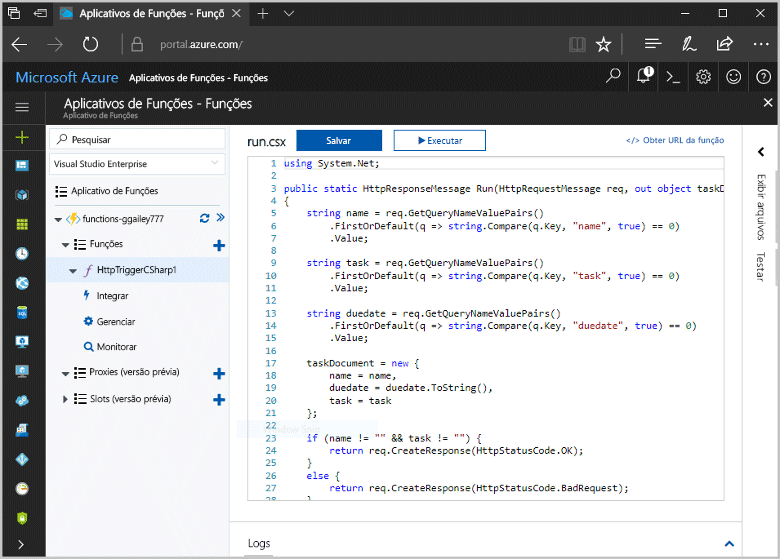
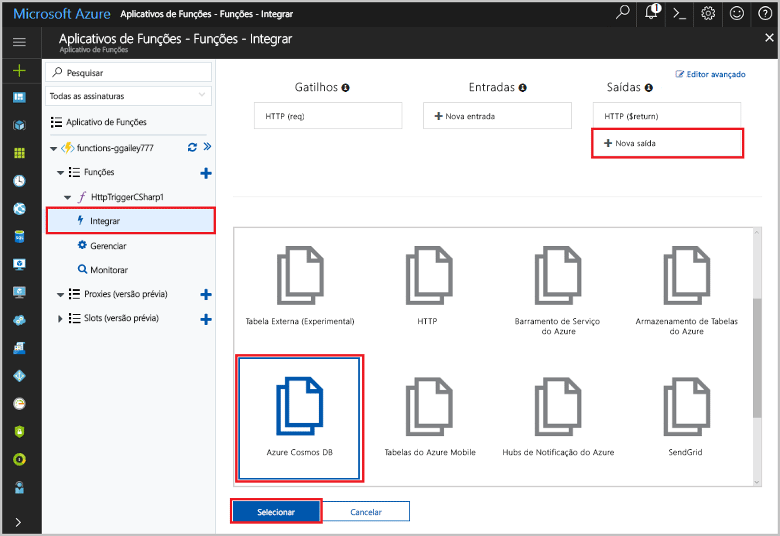
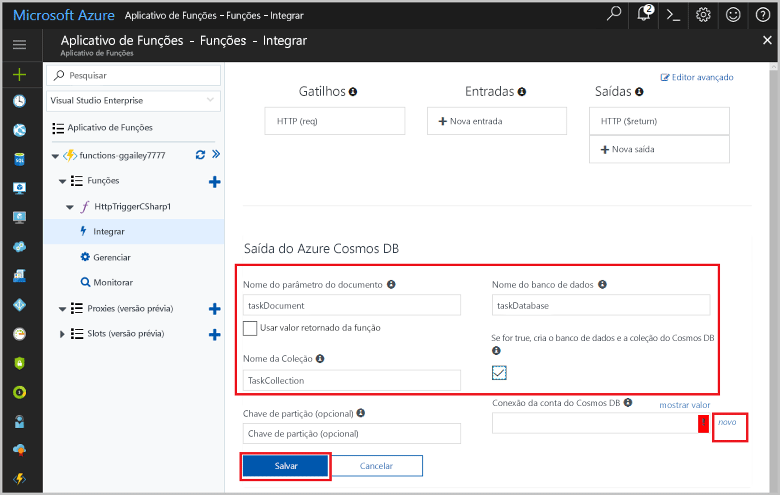
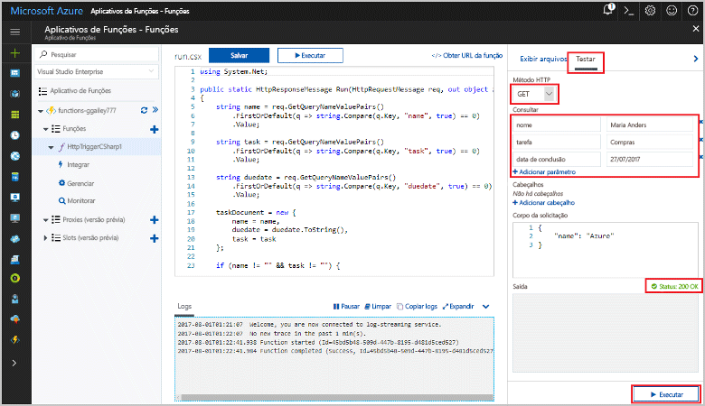
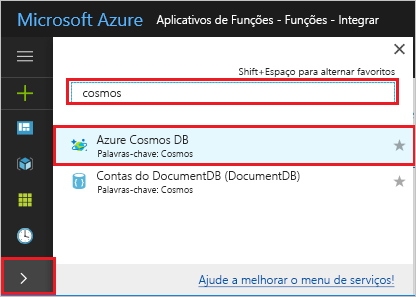
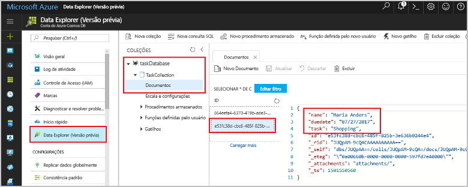

# <a name="store-unstructured-data-using-azure-functions-and-cosmos-db"></a>Armazenar dados não estruturados usando o Azure Functions e o Cosmos DB

[Banco de dados do Azure Cosmos](https://azure.microsoft.com/services/cosmos-db/) é uma ótima maneira toostore não estruturado e dados JSON. Combinado com o Azure Functions, o Cosmos DB torna o armazenamento de dados rápido e fácil com muito menos código do que o necessário para armazenar dados em um banco de dados relacional.

Em funções do Azure, as associações de entrada e saídas fornecem um forma declarativa tooconnect tooexternal serviço de dados de sua função. Neste tópico, Aprenda como tooupdate um existente c# função tooadd uma associação de saída que armazena dados não estruturados em um documento de banco de dados do Cosmos. 



## <a name="prerequisites"></a>Pré-requisitos

toocomplete este tutorial:

[!INCLUDE [Previous quickstart note](../../includes/functions-quickstart-previous-topics.md)]

## <a name="add-an-output-binding"></a>Adicionar uma associação de saída

1. Expanda seu aplicativo de funções e sua função.

1. Selecione **integrar** e **+ nova saída**, que está no hello parte superior direita da página de saudação. Escolha **Azure Cosmos DB** e clique em **Selecionar**.

    

3. Saudação de uso **saída de banco de dados do Azure Cosmos** configurações conforme especificado na tabela de saudação: 

    

    | Configuração      | Valor sugerido  | Descrição                                |
    | ------------ | ---------------- | ------------------------------------------ |
    | **Nome do parâmetro do documento** | taskDocument | Nome que se refere o objeto de banco de dados do Cosmos toohello no código. |
    | **Nome do banco de dados** | taskDatabase | Nome de documentos de toosave do banco de dados. |
    | **Nome da coleção** | TaskCollection | Nome da coleção dos bancos de dados Cosmos DB. |
    | **Se true, cria a coleção e o banco de dados de banco de dados do Cosmos Olá** | Verificado | coleção de saudação não existir, então criá-lo. |

4. Selecione **novo** toohello próximo **conexão do banco de dados do Cosmos documento** rótulo e selecione **+ criar novo**. 

5. Saudação de uso **nova conta** configurações conforme especificado na tabela de saudação: 

    

    | Configuração      | Valor sugerido  | Descrição                                |
    | ------------ | ---------------- | ------------------------------------------ |
    | **ID** | Nome do banco de dados | ID exclusiva para o banco de dados de banco de dados do Cosmos Olá  |
    | **API** | SQL (DocumentDB) | Selecione Olá API de banco de dados de documento.  |
    | **Assinatura** | Assinatura do Azure | Assinatura do Azure  |
    | **Grupo de recursos** | myResourceGroup |  Use Olá grupo de recursos existente que contém seu aplicativo de função. |
    | **Localidade**  | WestEurope | Selecione um local perto tooeither seu aplicativo de função ou tooother aplicativos que usam Olá documentos armazenados.  |

6. Clique em **Okey** o banco de dados do toocreate hello. Ele pode levar o banco de dados Olá toocreate de alguns minutos. Após a criação do banco de dados hello, cadeia de conexão de banco de dados de saudação é armazenada como uma configuração de aplicativo de função. nome da saudação dessa configuração de aplicativo é inserido no **conexão de conta do banco de dados do Cosmos**. 
 
8. Após definir a cadeia de caracteres de conexão Olá, selecione **salvar** toocreate associação de saudação.

## <a name="update-hello-function-code"></a>Atualizar o código de função hello

Substitua Olá c# função código existente pelo Olá código a seguir:

```csharp
using System.Net;

public static HttpResponseMessage Run(HttpRequestMessage req, out object taskDocument, TraceWriter log)
{
    string name = req.GetQueryNameValuePairs()
        .FirstOrDefault(q => string.Compare(q.Key, "name", true) == 0)
        .Value;

    string task = req.GetQueryNameValuePairs()
        .FirstOrDefault(q => string.Compare(q.Key, "task", true) == 0)
        .Value;

    string duedate = req.GetQueryNameValuePairs()
        .FirstOrDefault(q => string.Compare(q.Key, "duedate", true) == 0)
        .Value;

    taskDocument = new {
        name = name,
        duedate = duedate.ToString(),
        task = task
    };

    if (name != "" && task != "") {
        return req.CreateResponse(HttpStatusCode.OK);
    }
    else {
        return req.CreateResponse(HttpStatusCode.BadRequest);
    }
}

```
Este exemplo de código lê Olá solicitação HTTP cadeias de caracteres de consulta e os atribui toofields em Olá `taskDocument` objeto. Olá `taskDocument` associação envia dados de objeto de saudação de toobe de parâmetro essa associação armazenado no banco de dados de documento de saudação. Olá banco de dados criado Olá primeira vez Olá função é executada.

## <a name="test-hello-function-and-database"></a>Função de saudação do teste e o banco de dados

1. Expanda a janela direita hello e selecione **teste**. Em **consulta**, clique em **+ Adicionar parâmetro** e adicione Olá cadeia de caracteres de consulta de toohello parâmetros a seguir:

    + `name`
    + `task`
    + `duedate`

2. Clique em **Executar** e verifique se um status 200 retorna.

    

1. Na Olá lado esquerdo da saudação portal do Azure, expanda a barra de ícones Olá, tipo `cosmos` em Olá pesquisar o campo e selecione **o banco de dados do Azure Cosmos**.

    

2. Banco de dados selecione Olá criado por você, em seguida, selecione **Data Explorer**. Expanda Olá **coleções** nós, selecione Olá novo documento e confirmar esse documento hello contém os valores de cadeia de caracteres de consulta, juntamente com alguns metadados adicionais. 

    

Você adicionou com êxito um gatilho HTTP tooyour de associação que armazena dados não estruturados em um banco de dados do banco de dados do Cosmos.

[!INCLUDE [Clean-up section](../../includes/clean-up-section-portal.md)]

## <a name="next-steps"></a>Próximas etapas

[!INCLUDE [functions-quickstart-next-steps](../../includes/functions-quickstart-next-steps.md)]

Para obter mais informações sobre o banco de dados de banco de dados do Cosmos de tooa associação, consulte [associações de banco de dados do Azure funções Cosmos](functions-bindings-documentdb.md).
