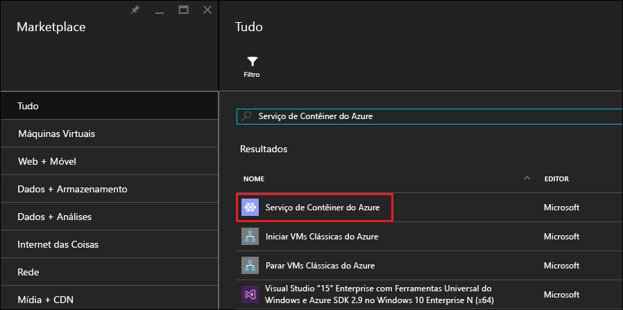
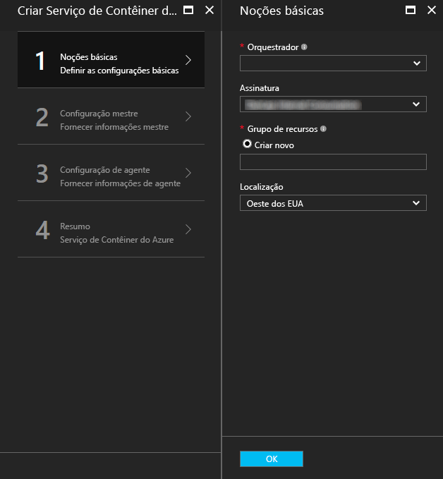
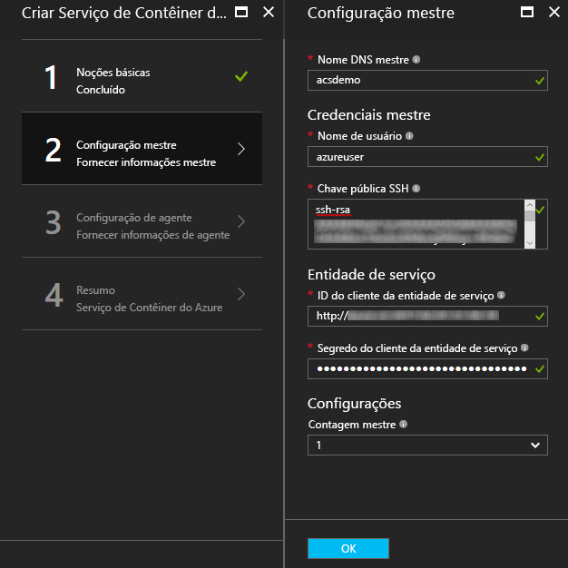
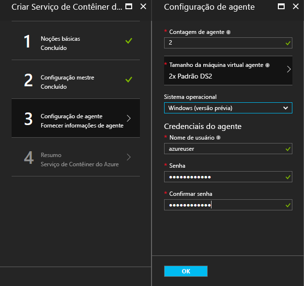
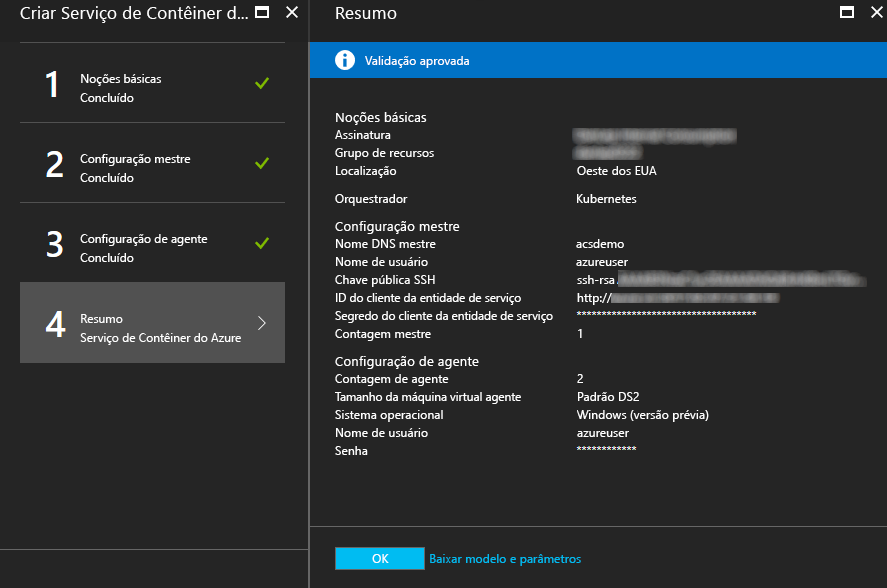

# <a name="deploy-a-docker-container-hosting-solution-using-hello-azure-portal"></a>Implantar um contêiner do Docker usando o portal do Azure de saudação de solução de hospedagem


O Serviço de Contêiner do Azure fornece implantação rápida de soluções populares de orquestração e clustering de contêiner de software livre. Este documento orienta a implantar um cluster do serviço de contêiner do Azure usando Olá portal do Azure ou um modelo de início rápido do Azure Resource Manager. 

Você também pode implantar um cluster do serviço de contêiner do Azure usando Olá [2.0 do CLI do Azure](container-service-create-acs-cluster-cli.md) ou Olá APIs de serviço de contêiner do Azure.

Para obter informações, consulte [Introdução ao Serviço de Contêiner do Azure](../container-service-intro.md).


## <a name="prerequisites"></a>Pré-requisitos

* **Assinatura do Azure**: se não tiver uma, inscreva-se em uma [avaliação gratuita](http://azure.microsoft.com/pricing/free-trial/?WT.mc_id=AA4C1C935). Para um cluster maior, considere uma assinatura pré-paga ou outras opções de compra.

    > [!NOTE]
    > O uso de assinatura do Azure e [cotas de recursos](../../azure-subscription-service-limits.md), como cotas de núcleos, pode limitar o tamanho de saudação do cluster Olá implantar. toorequest um aumento de cota, abra um [solicitação de suporte do cliente online](../../azure-supportability/how-to-create-azure-support-request.md) sem custo adicional.
    >

* **Chave pública RSA SSH**: durante a implantação por meio do portal hello ou um dos modelos de início rápido do Azure hello, você precisará chave pública do tooprovide Olá para autenticação em máquinas virtuais de serviço de contêiner do Azure. chaves RSA Secure Shell (SSH) toocreate, consulte Olá [OS X e Linux](../../virtual-machines/linux/mac-create-ssh-keys.md) ou [Windows](../../virtual-machines/linux/ssh-from-windows.md) orientação. 

* **ID do cliente principal e o segredo de serviço** (Kubernetes): para mais informações e diretrizes toocreate uma entidade de serviço do Active Directory do Azure, consulte [sobre a entidade de serviço Olá para um cluster Kubernetes](../kubernetes/container-service-kubernetes-service-principal.md).


## <a name="create-a-cluster-by-using-hello-azure-portal"></a>Criar um cluster usando Olá portal do Azure
1. Entrar toohello portal do Azure, selecione **novo**e a pesquisa hello Azure Marketplace para **serviço de contêiner do Azure**.

      <br />

2. Clique em **Serviço de Contêiner do Azure** e clique em **Criar**.

3. Em Olá **Noções básicas sobre** folha, digite Olá informações a seguir:

    * **Orchestrator**: selecione uma saudação contêiner orchestrators toodeploy no cluster hello.
        * **DC/OS**: implanta um cluster de DC/OS.
        * **Swarm**: implanta um cluster Docker Swarm.
        * **Kubernetes**: implanta um cluster Kubernetes.
    * **Assinatura**: selecione uma assinatura do Azure.
    * **Grupo de recursos**: Insira nome de saudação de um novo grupo de recursos para implantação de saudação.
    * **Local**: selecione uma região do Azure para a implantação do serviço de contêiner do Azure hello. Para disponibilidade, verifique [Produtos disponíveis por região](https://azure.microsoft.com/regions/services/).
    
      <br />
    
    Clique em **Okey** quando estiver pronto tooproceed.

4. Em Olá **mestre configuração** folha, digite Olá configurações de nó mestre do Linux hello ou nós de cluster de saudação (algumas configurações são específicas tooeach orchestrator) a seguir:

    * **Nome DNS mestre**: Olá prefixo usado toocreate um exclusivo totalmente qualificado (FQDN) do nome de domínio para o mestre de saudação. Olá FQDN mestre tem formato Olá *prefixo*gerenciamento*local*. cloudapp.azure.com.
    * **Nome de usuário**: nome de usuário Olá para uma conta em cada uma das máquinas de virtuais de Linux Olá no cluster de saudação.
    * **Chave pública RSA SSH**: Adicionar Olá toobe chave pública usado para autenticação em relação a saudação máquinas de virtuais de Linux. É importante que essa chave contém sem quebras de linha e inclui Olá `ssh-rsa` prefixo. Olá `username@domain` sufixo é opcional. Olá chave deve ser semelhante a seguir Olá: **AAAAB3Nz de ssh-rsa... <>...... UcyupgH azureuser@linuxvm** . 
    * **Entidade de serviço**: se você selecionou orchestrator de Kubernetes hello, insira um Azure Active Directory **ID principal do cliente de serviço** (também chamado de hello appId) e **segredo do cliente principal do serviço** (senha). Para obter mais informações, consulte [sobre a entidade de serviço Olá para um cluster Kubernetes](../kubernetes/container-service-kubernetes-service-principal.md).
    * **Contagem de mestre**: Olá número de mestres em cluster hello.
    * **Diagnóstico VM**: para alguns orchestrators, você pode habilitar o diagnóstico VM no mestre de saudação.

      <br />

    Clique em **Okey** quando estiver pronto tooproceed.

5. Em Olá **configuração do agente** folha, digite Olá informações a seguir:

    * **Contagem de agentes**: para por nuvem do Docker e Kubernetes, esse valor é número de saudação inicial de agentes no conjunto de escala de agente Olá. Para o controlador de domínio/sistema operacional, é número de saudação inicial de agentes em um conjunto de escala privada. Além disso, é criado um conjunto de escala pública para DC/OS, que contém um número predeterminado de agentes. Olá número de agentes neste conjunto de escala público é determinado pelo número de saudação de mestres no cluster Olá: um agente de público para um mestre e dois agentes públicos para três ou cinco mestres.
    * **Tamanho da máquina virtual agente**: Olá tamanho das máquinas de virtuais de agente hello.
    * **Sistema operacional**: essa configuração está disponível atualmente apenas se você selecionou orchestrator de Kubernetes hello. Escolha uma distribuição de Linux ou um toorun de sistema operacional Windows Server em agentes de saudação. Essa configuração determina se seu cluster pode executar aplicativos de contêiner do Windows ou Linux. 

        > [!NOTE]
        > O suporte ao contêiner do Windows está em versão prévia para clusters Kubernetes. Atualmente há suporte somente para agentes Linux no Serviço de Contêiner do Azure nos clusters DC/SO e Swarm.

    * **As credenciais de agente**: se você selecionou o sistema de operacional do Windows hello, insira um administrador **nome de usuário** e **senha** para agente Olá VMs. 

      <br />

    Clique em **Okey** quando estiver pronto tooproceed.

6. Após a conclusão da validação de serviço, clique em **OK**.

      <br />

7. Examine os termos de saudação. processo de implantação de saudação toostart, clique em **criar**.

    Se você tiver optado toopin Olá implantação toohello portal do Azure, você pode ver o status de implantação de saudação.

      <br />

implantação de saudação leva vários toocomplete de minutos. Em seguida, o cluster do serviço de contêiner do Azure hello está pronto para uso.


## <a name="create-a-cluster-by-using-a-quickstart-template"></a>Criar um cluster usando um modelo de início rápido
Modelos de início rápido do Azure estão disponível toodeploy um cluster no serviço de contêiner do Azure. Olá fornecidos modelos quickstart podem ser modificado tooinclude adicionais ou avançadas configuração do Azure. toocreate um cluster do serviço de contêiner do Azure usando um modelo de início rápido do Azure, você precisa de uma assinatura do Azure. Se não tiver uma, inscreva-se para obter uma [avaliação gratuita](http://azure.microsoft.com/pricing/free-trial/?WT.mc_id=AA4C1C935). 

Siga estas etapas toodeploy um cluster usando um modelo e hello Azure CLI 2.0 (consulte [instruções de instalação e](/cli/azure/install-az-cli2)).

> [!NOTE] 
> Se você estiver em um sistema Windows, você pode usar toodeploy de etapas semelhantes em um modelo usando o PowerShell do Azure. Consulte as etapas nesta seção. Você também pode implantar um modelo por meio de saudação [portal](../../azure-resource-manager/resource-group-template-deploy-portal.md) ou outros métodos.

1. toodeploy um cluster Kubernetes, Docker Swarm ou SO/controlador de domínio, selecione um dos modelos de início rápido disponível de saudação do GitHub. Veja uma lista parcial. Olá DC/sistema operacional e por nuvem modelos são Olá mesmo, exceto para a seleção de orchestrator saudação padrão.

    * [Modelo DC/OS](https://github.com/Azure/azure-quickstart-templates/tree/master/101-acs-dcos)
    * [Modelo do Swarm](https://github.com/Azure/azure-quickstart-templates/tree/master/101-acs-swarm)
    * [Modelo Kubernetes](https://github.com/Azure/azure-quickstart-templates/tree/master/101-acs-kubernetes)

2. Faça logon na conta do Azure de tooyour (`az login`) e certifique-se de que Olá CLI do Azure é conectado tooyour assinatura do Azure. Você pode ver a assinatura de padrão de saudação usando Olá comando a seguir:

    ```azurecli
    az account show
    ```
    
    Se você tiver mais de um tooset de assinatura e a necessidade de uma assinatura diferente do padrão, execute `az account set --subscription` e especifique o nome ou ID de assinatura de saudação.

3. Como prática recomendada, use um novo grupo de recursos para implantação de saudação. toocreate um grupo de recursos, use Olá `az group create` comando Especifica um nome de grupo de recursos e local: 

    ```azurecli
    az group create --name "RESOURCE_GROUP" --location "LOCATION"
    ```

4. Crie um arquivo contendo Olá necessário modelo JSON parâmetros. Arquivo de parâmetros de saudação download chamado `azuredeploy.parameters.json` que acompanha o modelo de serviço de contêiner do Azure Olá `azuredeploy.json` no GitHub. Insira valores de parâmetros necessários para seu cluster. 

    Por exemplo, toouse Olá [modelo DC/OS](https://github.com/Azure/azure-quickstart-templates/tree/master/101-acs-dcos), fornecer valores de parâmetro para `dnsNamePrefix` e `sshRSAPublicKey`. Consulte as descrições de saudação em `azuredeploy.json` e opções para outros parâmetros.  
 

5. Criar um cluster do serviço de contêiner, passando o arquivo de parâmetros de implantação de saudação com hello após o comando, onde:

    * **RESOURCE_GROUP** é nome Olá Olá do grupo de recursos que você criou na etapa anterior hello.
    * **DEPLOYMENT_NAME** (opcional) é um nome que você fornecer toohello implantação.
    * **TEMPLATE_URI** é local Olá Olá do arquivo de implantação `azuredeploy.json`. Esse URI deve ser um arquivo bruto hello, não um ponteiro toohello GitHub UI. toofind esse URI, selecione Olá `azuredeploy.json` arquivo no GitHub e, em seguida, clique em Olá **Raw** botão.  

    ```azurecli
    az group deployment create -g RESOURCE_GROUP -n DEPLOYMENT_NAME --template-uri TEMPLATE_URI --parameters @azuredeploy.parameters.json
    ```

    Você também pode fornecer parâmetros como uma cadeia de caracteres formatada em JSON na linha de comando hello. Use uma comando semelhante toohello a seguir:

    ```azurecli
    az group deployment create -g RESOURCE_GROUP -n DEPLOYMENT_NAME --template-uri TEMPLATE_URI --parameters "{ \"param1\": {\"value1\"} … }"
    ```

    > [!NOTE]
    > implantação de saudação leva vários toocomplete de minutos.
    > 

### <a name="equivalent-powershell-commands"></a>Comandos equivalentes do PowerShell
Você também pode implantar um modelo do Serviço de Contêiner do Azure com o PowerShell. Este documento é baseado na versão 1.0 do hello [módulo Azure PowerShell](https://azure.microsoft.com/blog/azps-1-0/).

1. toodeploy um cluster Kubernetes, Docker Swarm ou SO/controlador de domínio, selecione um dos modelos de início rápido disponível de saudação do GitHub. Veja uma lista parcial. Observe que hello DC/sistema operacional e por nuvem modelos são Olá iguais, com exceção de saudação da seleção de orchestrator saudação padrão.

    * [Modelo DC/OS](https://github.com/Azure/azure-quickstart-templates/tree/master/101-acs-dcos)
    * [Modelo do Swarm](https://github.com/Azure/azure-quickstart-templates/tree/master/101-acs-swarm)
    * [Modelo Kubernetes](https://github.com/Azure/azure-quickstart-templates/tree/master/101-acs-kubernetes)

2. Antes de criar um cluster em sua assinatura do Azure, verifique se sua sessão do PowerShell foi assinado em tooAzure. Você pode fazer isso com hello `Get-AzureRMSubscription` comando:

    ```powershell
    Get-AzureRmSubscription
    ```

3. Se você precisar toosign em tooAzure, use Olá `Login-AzureRMAccount` comando:

    ```powershell
    Login-AzureRmAccount
    ```

4. Como prática recomendada, use um novo grupo de recursos para implantação de saudação. toocreate um grupo de recursos, use Olá `New-AzureRmResourceGroup` de comando e especifique uma região nome e o destino do grupo de recursos:

    ```powershell
    New-AzureRmResourceGroup -Name GROUP_NAME -Location REGION
    ```

5. Depois de criar um grupo de recursos, você pode criar o cluster com hello comando a seguir. Olá URI da saudação desejado de modelo é especificado com hello `-TemplateUri` parâmetro. Quando você executar esse comando, o PowerShell solicitará os valores de parâmetros de implantação.

    ```powershell
    New-AzureRmResourceGroupDeployment -Name DEPLOYMENT_NAME -ResourceGroupName RESOURCE_GROUP_NAME -TemplateUri TEMPLATE_URI
    ```

#### <a name="provide-template-parameters"></a>Fornecer parâmetros de modelo
Se você estiver familiarizado com o PowerShell, você sabe que você pode percorrer parâmetros de saudação disponíveis para um cmdlet, digite um sinal de subtração (-) e, em seguida, pressionar a tecla TAB a saudação. Essa mesma funcionalidade também funciona com os parâmetros definidos no modelo. Assim que você digitar o nome do modelo hello, Olá cmdlet busca modelo hello, analisa os parâmetros de saudação e adiciona o comando de toohello de parâmetros de modelo Olá dinamicamente. Isso torna fácil toospecify valores de parâmetro de modelo de saudação. E, se você esquecer a um valor de parâmetro obrigatório, PowerShell solicitará sua valor hello.

Aqui está o comando completo hello, com parâmetros incluídos. Forneça seus próprios valores para nomes de saudação de recursos de saudação.

```powershell
New-AzureRmResourceGroupDeployment -ResourceGroupName RESOURCE_GROUP_NAME-TemplateURI TEMPLATE_URI -adminuser value1 -adminpassword value2 ....
```

## <a name="next-steps"></a>Próximas etapas
Agora que você tem um cluster em funcionamento, confira estes documentos para obter detalhes sobre conexão e gerenciamento:

* [Conecte-se o cluster do serviço de contêiner do Azure tooan](../container-service-connect.md)
* [Trabalhar com o Serviço de Contêiner do Azure e o DC/SO](container-service-mesos-marathon-rest.md)
* [Trabalhar com o Serviço de Contêiner do Azure e o Docker Swarm](container-service-docker-swarm.md)
* [Trabalhar com o Serviço de Contêiner do Azure e o Kubernetes](../kubernetes/container-service-kubernetes-walkthrough.md)
