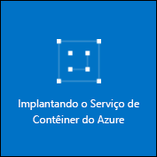

# <a name="deploy-a-docker-container-hosting-solution-using-the-azure-portal"></a><span data-ttu-id="0b8d9-104">Implante uma solução de hospedagem de contêiner do Docker usando o portal do Azure</span><span class="sxs-lookup"><span data-stu-id="0b8d9-104">Deploy a Docker container hosting solution using the Azure portal</span></span>


<span data-ttu-id="0b8d9-105">O Serviço de Contêiner do Azure fornece implantação rápida de soluções populares de orquestração e clustering de contêiner de software livre.</span><span class="sxs-lookup"><span data-stu-id="0b8d9-105">Azure Container Service provides rapid deployment of popular open-source container clustering and orchestration solutions.</span></span> <span data-ttu-id="0b8d9-106">Este documento orienta a implantar um cluster do serviço de contêiner do Azure usando o portal do Azure ou um modelo de início rápido do Azure Resource Manager.</span><span class="sxs-lookup"><span data-stu-id="0b8d9-106">This document walks you through deploying an Azure Container Service cluster by using the Azure portal or an Azure Resource Manager quickstart template.</span></span> 

<span data-ttu-id="0b8d9-107">Você também pode implantar um cluster do Serviço de Contêiner do Azure usando a [CLI do Azure 2.0](container-service-create-acs-cluster-cli.md) ou as APIs de Serviço de Contêiner do Azure.</span><span class="sxs-lookup"><span data-stu-id="0b8d9-107">You can also deploy an Azure Container Service cluster by using the [Azure CLI 2.0](container-service-create-acs-cluster-cli.md) or the Azure Container Service APIs.</span></span>

<span data-ttu-id="0b8d9-108">Para obter informações, consulte [Introdução ao Serviço de Contêiner do Azure](../container-service-intro.md).</span><span class="sxs-lookup"><span data-stu-id="0b8d9-108">For background, see [Azure Container Service introduction](../container-service-intro.md).</span></span>


## <a name="prerequisites"></a><span data-ttu-id="0b8d9-109">Pré-requisitos</span><span class="sxs-lookup"><span data-stu-id="0b8d9-109">Prerequisites</span></span>

* <span data-ttu-id="0b8d9-110">**Assinatura do Azure**: se não tiver uma, inscreva-se em uma [avaliação gratuita](http://azure.microsoft.com/pricing/free-trial/?WT.mc_id=AA4C1C935).</span><span class="sxs-lookup"><span data-stu-id="0b8d9-110">**Azure subscription**: If you don't have one, sign up for a [free trial](http://azure.microsoft.com/pricing/free-trial/?WT.mc_id=AA4C1C935).</span></span> <span data-ttu-id="0b8d9-111">Para um cluster maior, considere uma assinatura pré-paga ou outras opções de compra.</span><span class="sxs-lookup"><span data-stu-id="0b8d9-111">For a larger cluster, consider a pay-as-you go subscription or other purchase options.</span></span>

    > [!NOTE]
    > <span data-ttu-id="0b8d9-112">O uso da assinatura do Azure e as [cotas de recursos](../../azure-subscription-service-limits.md), como as cotas de núcleos, podem limitar o tamanho do cluster que você implanta.</span><span class="sxs-lookup"><span data-stu-id="0b8d9-112">Your Azure subscription usage and [resource quotas](../../azure-subscription-service-limits.md), such as cores quotas, can limit the size of the cluster you deploy.</span></span> <span data-ttu-id="0b8d9-113">Para solicitar um aumento de cota, abra uma [solicitação de atendimento ao cliente online](../../azure-supportability/how-to-create-azure-support-request.md) gratuitamente.</span><span class="sxs-lookup"><span data-stu-id="0b8d9-113">To request a quota increase, open an [online customer support request](../../azure-supportability/how-to-create-azure-support-request.md) at no charge.</span></span>
    >

* <span data-ttu-id="0b8d9-114">**Chave pública SSH RSA**: durante a implantação por meio do portal ou por meio de um dos modelos de início rápido do Azure, você precisa fornecer a chave pública para autenticação nas máquinas virtuais do Serviço de Contêiner do Azure.</span><span class="sxs-lookup"><span data-stu-id="0b8d9-114">**SSH RSA public key**: When deploying through the portal or one of the Azure quickstart templates, you need to provide the public key for authentication against Azure Container Service virtual machines.</span></span> <span data-ttu-id="0b8d9-115">Para criar chaves SSH (Secure Shell) RSA, consulte as diretrizes para [OS X e Linux](../../virtual-machines/linux/mac-create-ssh-keys.md) ou [Windows](../../virtual-machines/linux/ssh-from-windows.md).</span><span class="sxs-lookup"><span data-stu-id="0b8d9-115">To create Secure Shell (SSH) RSA keys, see the [OS X and Linux](../../virtual-machines/linux/mac-create-ssh-keys.md) or [Windows](../../virtual-machines/linux/ssh-from-windows.md) guidance.</span></span> 

* <span data-ttu-id="0b8d9-116">**ID e segredo de cliente de entidade de serviço** (somente Kubernetes): para obter mais informações e diretrizes para criar uma entidade de serviço do Azure Active Directory, consulte [Sobre a entidade de serviço para um cluster Kubernetes](../kubernetes/container-service-kubernetes-service-principal.md).</span><span class="sxs-lookup"><span data-stu-id="0b8d9-116">**Service principal client ID and secret** (Kubernetes only): For more information and guidance to create an Azure Active Directory service principal, see [About the service principal for a Kubernetes cluster](../kubernetes/container-service-kubernetes-service-principal.md).</span></span>


## <a name="create-a-cluster-by-using-the-azure-portal"></a><span data-ttu-id="0b8d9-117">Criar um cluster usando o portal do Azure</span><span class="sxs-lookup"><span data-stu-id="0b8d9-117">Create a cluster by using the Azure portal</span></span>
1. <span data-ttu-id="0b8d9-118">Entre no portal do Azure, selecione **Novo** e pesquise no Azure Marketplace o **Serviço de Contêiner do Azure**.</span><span class="sxs-lookup"><span data-stu-id="0b8d9-118">Sign in to the Azure portal, select **New**, and search the Azure Marketplace for **Azure Container Service**.</span></span>

      <br />

2. <span data-ttu-id="0b8d9-120">Clique em **Serviço de Contêiner do Azure** e clique em **Criar**.</span><span class="sxs-lookup"><span data-stu-id="0b8d9-120">Click **Azure Container Service**, and click **Create**.</span></span>

3. <span data-ttu-id="0b8d9-121">Na folha **Informações básicas**, insira as seguintes informações:</span><span class="sxs-lookup"><span data-stu-id="0b8d9-121">On the **Basics** blade, enter the following information:</span></span>

    * <span data-ttu-id="0b8d9-122">**Orchestrator**: selecione um dos orquestradores de contêiner para implantar no cluster.</span><span class="sxs-lookup"><span data-stu-id="0b8d9-122">**Orchestrator**: Select one of the container orchestrators to deploy on the cluster.</span></span>
        * <span data-ttu-id="0b8d9-123">**DC/OS**: implanta um cluster de DC/OS.</span><span class="sxs-lookup"><span data-stu-id="0b8d9-123">**DC/OS**: Deploys a DC/OS cluster.</span></span>
        * <span data-ttu-id="0b8d9-124">**Swarm**: implanta um cluster Docker Swarm.</span><span class="sxs-lookup"><span data-stu-id="0b8d9-124">**Swarm**: Deploys a Docker Swarm cluster.</span></span>
        * <span data-ttu-id="0b8d9-125">**Kubernetes**: implanta um cluster Kubernetes.</span><span class="sxs-lookup"><span data-stu-id="0b8d9-125">**Kubernetes**: Deploys a Kubernetes cluster.</span></span>
    * <span data-ttu-id="0b8d9-126">**Assinatura**: selecione uma assinatura do Azure.</span><span class="sxs-lookup"><span data-stu-id="0b8d9-126">**Subscription**: Select an Azure subscription.</span></span>
    * <span data-ttu-id="0b8d9-127">**Grupo de recursos**: insira o nome de um novo grupo de recursos para a implantação.</span><span class="sxs-lookup"><span data-stu-id="0b8d9-127">**Resource group**: Enter the name of a new resource group for the deployment.</span></span>
    * <span data-ttu-id="0b8d9-128">**Local**: selecione uma região do Azure para a implantação do Serviço de Contêiner do Azure.</span><span class="sxs-lookup"><span data-stu-id="0b8d9-128">**Location**: Select an Azure region for the Azure Container Service deployment.</span></span> <span data-ttu-id="0b8d9-129">Para disponibilidade, verifique [Produtos disponíveis por região](https://azure.microsoft.com/regions/services/).</span><span class="sxs-lookup"><span data-stu-id="0b8d9-129">For availability, check [Products available by region](https://azure.microsoft.com/regions/services/).</span></span>
    
      <br />
    
    <span data-ttu-id="0b8d9-131">Clique em **OK** quando estiver pronto para continuar.</span><span class="sxs-lookup"><span data-stu-id="0b8d9-131">Click **OK** when you're ready to proceed.</span></span>

4. <span data-ttu-id="0b8d9-132">Na folha **Configuração do mestre**, insira as seguintes configurações para o nó mestre do Linux ou para os nós do cluster (algumas configurações são específicas para cada orquestrador):</span><span class="sxs-lookup"><span data-stu-id="0b8d9-132">On the **Master configuration** blade, enter the following settings for the Linux master node or nodes in the cluster (some settings are specific to each orchestrator):</span></span>

    * <span data-ttu-id="0b8d9-133">**Nome DNS de mestre**: o prefixo usado para criar um FQDN (nome de domínio totalmente qualificado) exclusivo para o mestre.</span><span class="sxs-lookup"><span data-stu-id="0b8d9-133">**Master DNS name**: The prefix used to create a unique fully qualified domain name (FQDN) for the master.</span></span> <span data-ttu-id="0b8d9-134">O FQDN do mestre é no formato *prefixo*gerenciamento*local*.cloudapp.azure.com.</span><span class="sxs-lookup"><span data-stu-id="0b8d9-134">The master FQDN is of the form *prefix*mgmt.*location*.cloudapp.azure.com.</span></span>
    * <span data-ttu-id="0b8d9-135">**Nome de usuário**: O nome de usuário para uma conta em cada uma das máquinas virtuais Linux no cluster.</span><span class="sxs-lookup"><span data-stu-id="0b8d9-135">**User name**: The user name for an account on each of the Linux virtual machines in the cluster.</span></span>
    * <span data-ttu-id="0b8d9-136">**Chave pública SSH RSA**: adicione a chave pública que será usada para autenticação nas máquinas virtuais Linux.</span><span class="sxs-lookup"><span data-stu-id="0b8d9-136">**SSH RSA public key**: Add the public key to be used for authentication against the Linux virtual machines.</span></span> <span data-ttu-id="0b8d9-137">É importante que esta chave não contenha quebras de linha e que inclua o prefixo `ssh-rsa`.</span><span class="sxs-lookup"><span data-stu-id="0b8d9-137">It is important that this key contains no line breaks, and it includes the `ssh-rsa` prefix.</span></span> <span data-ttu-id="0b8d9-138">O sufixo `username@domain` é opcional.</span><span class="sxs-lookup"><span data-stu-id="0b8d9-138">The `username@domain` postfix is optional.</span></span> <span data-ttu-id="0b8d9-139">A chave deve ser algo semelhante ao seguinte: **ssh-rsa AAAAB3Nz...<...>...UcyupgH azureuser@linuxvm**.</span><span class="sxs-lookup"><span data-stu-id="0b8d9-139">The key should look something like the following: **ssh-rsa AAAAB3Nz...<...>...UcyupgH azureuser@linuxvm**.</span></span> 
    * <span data-ttu-id="0b8d9-140">**Entidade de serviço**: se você selecionou o orquestrador Kubernetes, insira uma **ID do cliente de entidade de serviço** do Azure Active Directory (também chamada de appId) e um **Segredo do cliente de entidade de serviço** (senha).</span><span class="sxs-lookup"><span data-stu-id="0b8d9-140">**Service principal**: If you selected the Kubernetes orchestrator, enter an Azure Active Directory **Service principal client ID** (also called the appId) and **Service principal client secret** (password).</span></span> <span data-ttu-id="0b8d9-141">Para obter mais informações, confira [Sobre a entidade de serviço para um cluster Kubernetes](../kubernetes/container-service-kubernetes-service-principal.md).</span><span class="sxs-lookup"><span data-stu-id="0b8d9-141">For more information, see [About the service principal for a Kubernetes cluster](../kubernetes/container-service-kubernetes-service-principal.md).</span></span>
    * <span data-ttu-id="0b8d9-142">**Contagem de mestres**: o número de mestres do cluster.</span><span class="sxs-lookup"><span data-stu-id="0b8d9-142">**Master count**: The number of masters in the cluster.</span></span>
    * <span data-ttu-id="0b8d9-143">**Diagnóstico de VM**: para alguns orquestradores, você pode habilitar o diagnóstico de VM nos mestres.</span><span class="sxs-lookup"><span data-stu-id="0b8d9-143">**VM diagnostics**: For some orchestrators, you can enable VM diagnostics on the masters.</span></span>

      <br />

    <span data-ttu-id="0b8d9-145">Clique em **OK** quando estiver pronto para continuar.</span><span class="sxs-lookup"><span data-stu-id="0b8d9-145">Click **OK** when you're ready to proceed.</span></span>

5. <span data-ttu-id="0b8d9-146">Na folha **Configuração do agente**, insira as seguintes informações:</span><span class="sxs-lookup"><span data-stu-id="0b8d9-146">On the **Agent configuration** blade, enter the following information:</span></span>

    * <span data-ttu-id="0b8d9-147">**Contagem de agentes**: para Docker Swarm e Kubernetes, esse valor será o número inicial de agentes no conjunto de dimensionamento de agentes.</span><span class="sxs-lookup"><span data-stu-id="0b8d9-147">**Agent count**: For Docker Swarm and Kubernetes, this value is the initial number of agents in the agent scale set.</span></span> <span data-ttu-id="0b8d9-148">Para DC/OS, é o número inicial de agentes em um conjunto de escala privado.</span><span class="sxs-lookup"><span data-stu-id="0b8d9-148">For DC/OS, it is the initial number of agents in a private scale set.</span></span> <span data-ttu-id="0b8d9-149">Além disso, é criado um conjunto de escala pública para DC/OS, que contém um número predeterminado de agentes.</span><span class="sxs-lookup"><span data-stu-id="0b8d9-149">Additionally, a public scale set is created for DC/OS, which contains a predetermined number of agents.</span></span> <span data-ttu-id="0b8d9-150">O número de agentes nesse conjunto de dimensionamento público é determinado pelo número de mestres no cluster: um agente público para um mestre e dois agentes públicos para três ou cinco mestres.</span><span class="sxs-lookup"><span data-stu-id="0b8d9-150">The number of agents in this public scale set is determined by the number of masters in the cluster: one public agent for one master, and two public agents for three or five masters.</span></span>
    * <span data-ttu-id="0b8d9-151">**Tamanho da máquina virtual de agente**: o tamanho das máquinas virtuais de agente.</span><span class="sxs-lookup"><span data-stu-id="0b8d9-151">**Agent virtual machine size**: The size of the agent virtual machines.</span></span>
    * <span data-ttu-id="0b8d9-152">**Sistema operacional**: essa configuração só estará disponível se você selecionou o orquestrador Kubernetes.</span><span class="sxs-lookup"><span data-stu-id="0b8d9-152">**Operating system**: This setting is currently available only if you selected the Kubernetes orchestrator.</span></span> <span data-ttu-id="0b8d9-153">Escolha uma distribuição do Linux ou um sistema operacional do Windows Server para executar nos agentes.</span><span class="sxs-lookup"><span data-stu-id="0b8d9-153">Choose either a Linux distribution or a Windows Server operating system to run on the agents.</span></span> <span data-ttu-id="0b8d9-154">Essa configuração determina se seu cluster pode executar aplicativos de contêiner do Windows ou Linux.</span><span class="sxs-lookup"><span data-stu-id="0b8d9-154">This setting determines whether your cluster can run Linux or Windows container apps.</span></span> 

        > [!NOTE]
        > <span data-ttu-id="0b8d9-155">O suporte ao contêiner do Windows está em versão prévia para clusters Kubernetes.</span><span class="sxs-lookup"><span data-stu-id="0b8d9-155">Windows container support is in preview for Kubernetes clusters.</span></span> <span data-ttu-id="0b8d9-156">Atualmente há suporte somente para agentes Linux no Serviço de Contêiner do Azure nos clusters DC/SO e Swarm.</span><span class="sxs-lookup"><span data-stu-id="0b8d9-156">On DC/OS and Swarm clusters, only Linux agents are currently supported in Azure Container Service.</span></span>

    * <span data-ttu-id="0b8d9-157">**Credenciais de agente**: se você selecionou o sistema operacional Windows, insira um **Nome de usuário** e **Senha** de administrador para as VMs de agente.</span><span class="sxs-lookup"><span data-stu-id="0b8d9-157">**Agent credentials**: If you selected the Windows operating system, enter an administrator **User name** and **Password** for the agent VMs.</span></span> 

      <br />

    <span data-ttu-id="0b8d9-159">Clique em **OK** quando estiver pronto para continuar.</span><span class="sxs-lookup"><span data-stu-id="0b8d9-159">Click **OK** when you're ready to proceed.</span></span>

6. <span data-ttu-id="0b8d9-160">Após a conclusão da validação de serviço, clique em **OK**.</span><span class="sxs-lookup"><span data-stu-id="0b8d9-160">After service validation finishes, click **OK**.</span></span>

      <br />

7. <span data-ttu-id="0b8d9-162">Examine os termos.</span><span class="sxs-lookup"><span data-stu-id="0b8d9-162">Review the terms.</span></span> <span data-ttu-id="0b8d9-163">Para iniciar o processo de implantação, clique em **Criar**.</span><span class="sxs-lookup"><span data-stu-id="0b8d9-163">To start the deployment process, click **Create**.</span></span>

    <span data-ttu-id="0b8d9-164">Se tiver optado por fixar a implantação no portal do Azure, você poderá ver o status da implantação.</span><span class="sxs-lookup"><span data-stu-id="0b8d9-164">If you've elected to pin the deployment to the Azure portal, you can see the deployment status.</span></span>

      <br />

<span data-ttu-id="0b8d9-166">A implantação leva vários minutos para ser concluída.</span><span class="sxs-lookup"><span data-stu-id="0b8d9-166">The deployment takes several minutes to complete.</span></span> <span data-ttu-id="0b8d9-167">Em seguida, o cluster do serviço de contêiner do Azure está pronto para uso.</span><span class="sxs-lookup"><span data-stu-id="0b8d9-167">Then, the Azure Container Service cluster is ready for use.</span></span>


## <a name="create-a-cluster-by-using-a-quickstart-template"></a><span data-ttu-id="0b8d9-168">Criar um cluster usando um modelo de início rápido</span><span class="sxs-lookup"><span data-stu-id="0b8d9-168">Create a cluster by using a quickstart template</span></span>
<span data-ttu-id="0b8d9-169">Modelos de início rápido do Azure estão disponíveis para implantar um cluster no serviço de contêiner do Azure.</span><span class="sxs-lookup"><span data-stu-id="0b8d9-169">Azure quickstart templates are available to deploy a cluster in Azure Container Service.</span></span> <span data-ttu-id="0b8d9-170">Os modelos de início rápido fornecidos também podem ser modificados para incluir uma configuração do Azure avançada ou adicional.</span><span class="sxs-lookup"><span data-stu-id="0b8d9-170">The provided quickstart templates can be modified to include additional or advanced Azure configuration.</span></span> <span data-ttu-id="0b8d9-171">Para criar um cluster do serviço de contêiner do Azure usando um modelo de início rápido do Azure, você precisa de uma assinatura do Azure.</span><span class="sxs-lookup"><span data-stu-id="0b8d9-171">To create an Azure Container Service cluster by using an Azure quickstart template, you need an Azure subscription.</span></span> <span data-ttu-id="0b8d9-172">Se não tiver uma, inscreva-se para obter uma [avaliação gratuita](http://azure.microsoft.com/pricing/free-trial/?WT.mc_id=AA4C1C935).</span><span class="sxs-lookup"><span data-stu-id="0b8d9-172">If you don't have one, then sign up for a [free trial](http://azure.microsoft.com/pricing/free-trial/?WT.mc_id=AA4C1C935).</span></span> 

<span data-ttu-id="0b8d9-173">Siga estas etapas para implantar um cluster usando um modelo e a CLI do Azure 2.0 (veja [instruções de instalação e configuração](/cli/azure/install-az-cli2)).</span><span class="sxs-lookup"><span data-stu-id="0b8d9-173">Follow these steps to deploy a cluster using a template and the Azure CLI 2.0 (see [installation and setup instructions](/cli/azure/install-az-cli2)).</span></span>

> [!NOTE] 
> <span data-ttu-id="0b8d9-174">Se você estiver em um sistema Windows, você pode usar etapas semelhantes para implantar um modelo usando o Azure PowerShell.</span><span class="sxs-lookup"><span data-stu-id="0b8d9-174">If you're on a Windows system, you can use similar steps to deploy a template using Azure PowerShell.</span></span> <span data-ttu-id="0b8d9-175">Consulte as etapas nesta seção.</span><span class="sxs-lookup"><span data-stu-id="0b8d9-175">See steps later in this section.</span></span> <span data-ttu-id="0b8d9-176">Você também pode implantar um modelo por meio de [portal](../../azure-resource-manager/resource-group-template-deploy-portal.md) ou outros métodos.</span><span class="sxs-lookup"><span data-stu-id="0b8d9-176">You can also deploy a template through the [portal](../../azure-resource-manager/resource-group-template-deploy-portal.md) or other methods.</span></span>

1. <span data-ttu-id="0b8d9-177">Para implantar um cluster DC/SO, Docker Swarm ou Kubernetes, selecione um dos modelos de início rápido disponíveis no GitHub.</span><span class="sxs-lookup"><span data-stu-id="0b8d9-177">To deploy a DC/OS, Docker Swarm, or Kubernetes cluster, select one of the available quickstart templates from GitHub.</span></span> <span data-ttu-id="0b8d9-178">Veja uma lista parcial.</span><span class="sxs-lookup"><span data-stu-id="0b8d9-178">A partial list follows.</span></span> <span data-ttu-id="0b8d9-179">Os modelos DC/SO e Swarm são os mesmos, exceto para a seleção do orquestrador padrão.</span><span class="sxs-lookup"><span data-stu-id="0b8d9-179">The DC/OS and Swarm templates are the same, except for the default orchestrator selection.</span></span>

    * [<span data-ttu-id="0b8d9-180">Modelo DC/OS</span><span class="sxs-lookup"><span data-stu-id="0b8d9-180">DC/OS template</span></span>](https://github.com/Azure/azure-quickstart-templates/tree/master/101-acs-dcos)
    * [<span data-ttu-id="0b8d9-181">Modelo do Swarm</span><span class="sxs-lookup"><span data-stu-id="0b8d9-181">Swarm template</span></span>](https://github.com/Azure/azure-quickstart-templates/tree/master/101-acs-swarm)
    * [<span data-ttu-id="0b8d9-182">Modelo Kubernetes</span><span class="sxs-lookup"><span data-stu-id="0b8d9-182">Kubernetes template</span></span>](https://github.com/Azure/azure-quickstart-templates/tree/master/101-acs-kubernetes)

2. <span data-ttu-id="0b8d9-183">Faça logon sua conta do Azure (`az login`) e certifique-se de que a CLI do Azure está conectada à sua assinatura do Azure.</span><span class="sxs-lookup"><span data-stu-id="0b8d9-183">Log in to your Azure account (`az login`), and make sure that the Azure CLI is connected to your Azure subscription.</span></span> <span data-ttu-id="0b8d9-184">Você pode ver a assinatura padrão usando o comando a seguir:</span><span class="sxs-lookup"><span data-stu-id="0b8d9-184">You can see the default subscription by using the following command:</span></span>

    ```azurecli
    az account show
    ```
    
    <span data-ttu-id="0b8d9-185">Se você tiver mais de uma assinatura e a necessidade de definir uma assinatura padrão diferente, execute `az account set --subscription` e especifique o nome ou ID de assinatura.</span><span class="sxs-lookup"><span data-stu-id="0b8d9-185">If you have more than one subscription and need to set a different default subscription, run `az account set --subscription` and specify the subscription ID or name.</span></span>

3. <span data-ttu-id="0b8d9-186">Como prática recomendada, use um novo grupo de recursos para a implantação.</span><span class="sxs-lookup"><span data-stu-id="0b8d9-186">As a best practice, use a new resource group for the deployment.</span></span> <span data-ttu-id="0b8d9-187">Para criar um grupo de recursos, use o comando `az group create` para especificar um nome de grupo de recursos e um local:</span><span class="sxs-lookup"><span data-stu-id="0b8d9-187">To create a resource group, use the `az group create` command specify a resource group name and location:</span></span> 

    ```azurecli
    az group create --name "RESOURCE_GROUP" --location "LOCATION"
    ```

4. <span data-ttu-id="0b8d9-188">Crie um arquivo JSON que contém os parâmetros necessários do modelo.</span><span class="sxs-lookup"><span data-stu-id="0b8d9-188">Create a JSON file containing the required template parameters.</span></span> <span data-ttu-id="0b8d9-189">Baixe o arquivo de parâmetros chamado `azuredeploy.parameters.json` que acompanha o modelo do Serviço de Contêiner do Azure `azuredeploy.json` no GitHub.</span><span class="sxs-lookup"><span data-stu-id="0b8d9-189">Download the parameters file named `azuredeploy.parameters.json` that accompanies the Azure Container Service template `azuredeploy.json` in GitHub.</span></span> <span data-ttu-id="0b8d9-190">Insira valores de parâmetros necessários para seu cluster.</span><span class="sxs-lookup"><span data-stu-id="0b8d9-190">Enter required parameter values for your cluster.</span></span> 

    <span data-ttu-id="0b8d9-191">Por exemplo, para usar o [modelo da DC/SO](https://github.com/Azure/azure-quickstart-templates/tree/master/101-acs-dcos), fornecer valores de parâmetro para `dnsNamePrefix` e `sshRSAPublicKey`.</span><span class="sxs-lookup"><span data-stu-id="0b8d9-191">For example, to use the [DC/OS template](https://github.com/Azure/azure-quickstart-templates/tree/master/101-acs-dcos), supply parameter values for `dnsNamePrefix` and `sshRSAPublicKey`.</span></span> <span data-ttu-id="0b8d9-192">Consulte as descrições em `azuredeploy.json` e opções para outros parâmetros.</span><span class="sxs-lookup"><span data-stu-id="0b8d9-192">See the descriptions in `azuredeploy.json` and options for other parameters.</span></span>  
 

5. <span data-ttu-id="0b8d9-193">Criar um cluster do serviço de contêiner, passando o arquivo de parâmetros de implantação com o seguinte comando, onde:</span><span class="sxs-lookup"><span data-stu-id="0b8d9-193">Create a Container Service cluster by passing the deployment parameters file with the following command, where:</span></span>

    * <span data-ttu-id="0b8d9-194">**RESOURCE_GROUP** é o nome do grupo de recursos que você criou na etapa anterior.</span><span class="sxs-lookup"><span data-stu-id="0b8d9-194">**RESOURCE_GROUP** is the name of the resource group that you created in the previous step.</span></span>
    * <span data-ttu-id="0b8d9-195">**DEPLOYMENT_NAME** (opcional) é um nome que você atribui à implantação.</span><span class="sxs-lookup"><span data-stu-id="0b8d9-195">**DEPLOYMENT_NAME** (optional) is a name you give to the deployment.</span></span>
    * <span data-ttu-id="0b8d9-196">**TEMPLATE_URI** é o local do arquivo de implantação `azuredeploy.json`.</span><span class="sxs-lookup"><span data-stu-id="0b8d9-196">**TEMPLATE_URI** is the location of the deployment file `azuredeploy.json`.</span></span> <span data-ttu-id="0b8d9-197">Esse URI deve ser o arquivo Bruto, não um ponteiro para a interface do usuário do GitHub.</span><span class="sxs-lookup"><span data-stu-id="0b8d9-197">This URI must be the Raw file, not a pointer to the GitHub UI.</span></span> <span data-ttu-id="0b8d9-198">Para localizar esse URI, selecione o `azuredeploy.json` arquivo no GitHub e, em seguida, clique no **Raw** botão.</span><span class="sxs-lookup"><span data-stu-id="0b8d9-198">To find this URI, select the `azuredeploy.json` file in GitHub, and click the **Raw** button.</span></span>  

    ```azurecli
    az group deployment create -g RESOURCE_GROUP -n DEPLOYMENT_NAME --template-uri TEMPLATE_URI --parameters @azuredeploy.parameters.json
    ```

    <span data-ttu-id="0b8d9-199">Você também pode fornecer parâmetros como uma cadeia de caracteres formatada em JSON na linha de comando.</span><span class="sxs-lookup"><span data-stu-id="0b8d9-199">You can also provide parameters as a JSON-formatted string on the command line.</span></span> <span data-ttu-id="0b8d9-200">Use um comando semelhante a este:</span><span class="sxs-lookup"><span data-stu-id="0b8d9-200">Use a command similar to the following:</span></span>

    ```azurecli
    az group deployment create -g RESOURCE_GROUP -n DEPLOYMENT_NAME --template-uri TEMPLATE_URI --parameters "{ \"param1\": {\"value1\"} … }"
    ```

    > [!NOTE]
    > <span data-ttu-id="0b8d9-201">A implantação leva vários minutos para ser concluída.</span><span class="sxs-lookup"><span data-stu-id="0b8d9-201">The deployment takes several minutes to complete.</span></span>
    > 

### <a name="equivalent-powershell-commands"></a><span data-ttu-id="0b8d9-202">Comandos equivalentes do PowerShell</span><span class="sxs-lookup"><span data-stu-id="0b8d9-202">Equivalent PowerShell commands</span></span>
<span data-ttu-id="0b8d9-203">Você também pode implantar um modelo do Serviço de Contêiner do Azure com o PowerShell.</span><span class="sxs-lookup"><span data-stu-id="0b8d9-203">You can also deploy an Azure Container Service cluster template with PowerShell.</span></span> <span data-ttu-id="0b8d9-204">Este documento se baseia na versão 1.0 do [módulo do Azure PowerShell](https://azure.microsoft.com/blog/azps-1-0/).</span><span class="sxs-lookup"><span data-stu-id="0b8d9-204">This document is based on the version 1.0 [Azure PowerShell module](https://azure.microsoft.com/blog/azps-1-0/).</span></span>

1. <span data-ttu-id="0b8d9-205">Para implantar um cluster DC/SO, Docker Swarm ou Kubernetes, selecione um dos modelos de início rápido disponíveis no GitHub.</span><span class="sxs-lookup"><span data-stu-id="0b8d9-205">To deploy a DC/OS, Docker Swarm, or Kubernetes cluster, select one of the available quickstart templates from GitHub.</span></span> <span data-ttu-id="0b8d9-206">Veja uma lista parcial.</span><span class="sxs-lookup"><span data-stu-id="0b8d9-206">A partial list follows.</span></span> <span data-ttu-id="0b8d9-207">Observe que os modelos do DC/OS e do Swarm são iguais, com a exceção da seleção do orquestrador padrão.</span><span class="sxs-lookup"><span data-stu-id="0b8d9-207">Note that the DC/OS and Swarm templates are the same, with the exception of the default orchestrator selection.</span></span>

    * [<span data-ttu-id="0b8d9-208">Modelo DC/OS</span><span class="sxs-lookup"><span data-stu-id="0b8d9-208">DC/OS template</span></span>](https://github.com/Azure/azure-quickstart-templates/tree/master/101-acs-dcos)
    * [<span data-ttu-id="0b8d9-209">Modelo do Swarm</span><span class="sxs-lookup"><span data-stu-id="0b8d9-209">Swarm template</span></span>](https://github.com/Azure/azure-quickstart-templates/tree/master/101-acs-swarm)
    * [<span data-ttu-id="0b8d9-210">Modelo Kubernetes</span><span class="sxs-lookup"><span data-stu-id="0b8d9-210">Kubernetes template</span></span>](https://github.com/Azure/azure-quickstart-templates/tree/master/101-acs-kubernetes)

2. <span data-ttu-id="0b8d9-211">Antes de criar um cluster em sua assinatura do Azure, verifique se sua sessão do PowerShell foi conectada ao Azure.</span><span class="sxs-lookup"><span data-stu-id="0b8d9-211">Before creating a cluster in your Azure subscription, verify that your PowerShell session has been signed in to Azure.</span></span> <span data-ttu-id="0b8d9-212">Você pode fazer isso com o comando `Get-AzureRMSubscription` :</span><span class="sxs-lookup"><span data-stu-id="0b8d9-212">You can do this with the `Get-AzureRMSubscription` command:</span></span>

    ```powershell
    Get-AzureRmSubscription
    ```

3. <span data-ttu-id="0b8d9-213">Se precisar entrar no Azure, use o comando `Login-AzureRMAccount` :</span><span class="sxs-lookup"><span data-stu-id="0b8d9-213">If you need to sign in to Azure, use the `Login-AzureRMAccount` command:</span></span>

    ```powershell
    Login-AzureRmAccount
    ```

4. <span data-ttu-id="0b8d9-214">Como prática recomendada, use um novo grupo de recursos para a implantação.</span><span class="sxs-lookup"><span data-stu-id="0b8d9-214">As a best practice, use a new resource group for the deployment.</span></span> <span data-ttu-id="0b8d9-215">Para criar um grupo de recursos, use o comando `New-AzureRmResourceGroup` e especifique um nome de grupo de recursos e uma região de destino:</span><span class="sxs-lookup"><span data-stu-id="0b8d9-215">To create a resource group, use the `New-AzureRmResourceGroup` command, and specify a resource group name and destination region:</span></span>

    ```powershell
    New-AzureRmResourceGroup -Name GROUP_NAME -Location REGION
    ```

5. <span data-ttu-id="0b8d9-216">Depois de criar um grupo de recursos, você poderá criar seu cluster com o comando a seguir.</span><span class="sxs-lookup"><span data-stu-id="0b8d9-216">After you create a resource group, you can create your cluster with the following command.</span></span> <span data-ttu-id="0b8d9-217">O URI do modelo desejado é especificado com o parâmetro `-TemplateUri`.</span><span class="sxs-lookup"><span data-stu-id="0b8d9-217">The URI of the desired template is specified with the `-TemplateUri` parameter.</span></span> <span data-ttu-id="0b8d9-218">Quando você executar esse comando, o PowerShell solicitará os valores de parâmetros de implantação.</span><span class="sxs-lookup"><span data-stu-id="0b8d9-218">When you run this command, PowerShell prompts you for deployment parameter values.</span></span>

    ```powershell
    New-AzureRmResourceGroupDeployment -Name DEPLOYMENT_NAME -ResourceGroupName RESOURCE_GROUP_NAME -TemplateUri TEMPLATE_URI
    ```

#### <a name="provide-template-parameters"></a><span data-ttu-id="0b8d9-219">Fornecer parâmetros de modelo</span><span class="sxs-lookup"><span data-stu-id="0b8d9-219">Provide template parameters</span></span>
<span data-ttu-id="0b8d9-220">Se estiver familiarizado com o PowerShell, você saberá que pode percorrer os parâmetros disponíveis para um cmdlet digitando um sinal de subtração (-) e, em seguida, pressionando a tecla TAB.</span><span class="sxs-lookup"><span data-stu-id="0b8d9-220">If you're familiar with PowerShell, you know that you can cycle through the available parameters for a cmdlet by typing a minus sign (-) and then pressing the TAB key.</span></span> <span data-ttu-id="0b8d9-221">Essa mesma funcionalidade também funciona com os parâmetros definidos no modelo.</span><span class="sxs-lookup"><span data-stu-id="0b8d9-221">This same functionality also works with parameters that you define in your template.</span></span> <span data-ttu-id="0b8d9-222">Assim que você digitar o nome do modelo, o cmdlet buscará o modelo, o analisará os parâmetros e adicionará dinamicamente os parâmetros do modelo ao comando.</span><span class="sxs-lookup"><span data-stu-id="0b8d9-222">As soon as you type the template name, the cmdlet fetches the template, parses the parameters, and adds the template parameters to the command dynamically.</span></span> <span data-ttu-id="0b8d9-223">Isso facilita a especificação dos valores de parâmetros do modelo.</span><span class="sxs-lookup"><span data-stu-id="0b8d9-223">This makes it easy to specify the template parameter values.</span></span> <span data-ttu-id="0b8d9-224">E, se você esquecer um valor de parâmetro necessário, o PowerShell solicitará o valor.</span><span class="sxs-lookup"><span data-stu-id="0b8d9-224">And, if you forget a required parameter value, PowerShell prompts you for the value.</span></span>

<span data-ttu-id="0b8d9-225">Aqui está o comando completo com os parâmetros incluídos.</span><span class="sxs-lookup"><span data-stu-id="0b8d9-225">Here is the full command, with parameters included.</span></span> <span data-ttu-id="0b8d9-226">Forneça seus próprios valores para os nomes dos recursos.</span><span class="sxs-lookup"><span data-stu-id="0b8d9-226">Provide your own values for the names of the resources.</span></span>

```powershell
New-AzureRmResourceGroupDeployment -ResourceGroupName RESOURCE_GROUP_NAME-TemplateURI TEMPLATE_URI -adminuser value1 -adminpassword value2 ....
```

## <a name="next-steps"></a><span data-ttu-id="0b8d9-227">Próximas etapas</span><span class="sxs-lookup"><span data-stu-id="0b8d9-227">Next steps</span></span>
<span data-ttu-id="0b8d9-228">Agora que você tem um cluster em funcionamento, confira estes documentos para obter detalhes sobre conexão e gerenciamento:</span><span class="sxs-lookup"><span data-stu-id="0b8d9-228">Now that you have a functioning cluster, see these documents for connection and management details:</span></span>

* [<span data-ttu-id="0b8d9-229">Conectar a um cluster do Serviço de Contêiner do Azure</span><span class="sxs-lookup"><span data-stu-id="0b8d9-229">Connect to an Azure Container Service cluster</span></span>](../container-service-connect.md)
* [<span data-ttu-id="0b8d9-230">Trabalhar com o Serviço de Contêiner do Azure e o DC/SO</span><span class="sxs-lookup"><span data-stu-id="0b8d9-230">Work with Azure Container Service and DC/OS</span></span>](container-service-mesos-marathon-rest.md)
* [<span data-ttu-id="0b8d9-231">Trabalhar com o Serviço de Contêiner do Azure e o Docker Swarm</span><span class="sxs-lookup"><span data-stu-id="0b8d9-231">Work with Azure Container Service and Docker Swarm</span></span>](container-service-docker-swarm.md)
* [<span data-ttu-id="0b8d9-232">Trabalhar com o Serviço de Contêiner do Azure e o Kubernetes</span><span class="sxs-lookup"><span data-stu-id="0b8d9-232">Work with Azure Container Service and Kubernetes</span></span>](../kubernetes/container-service-kubernetes-walkthrough.md)
