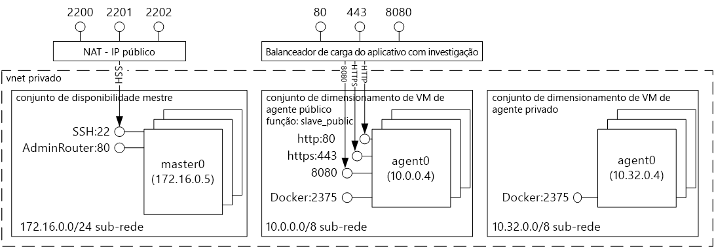
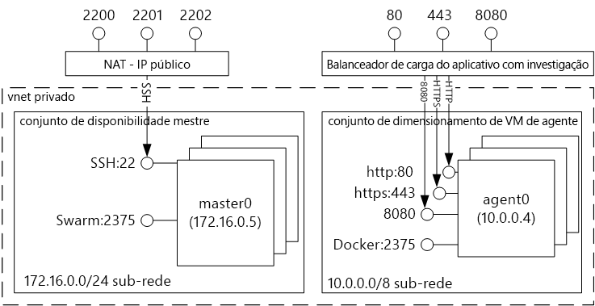
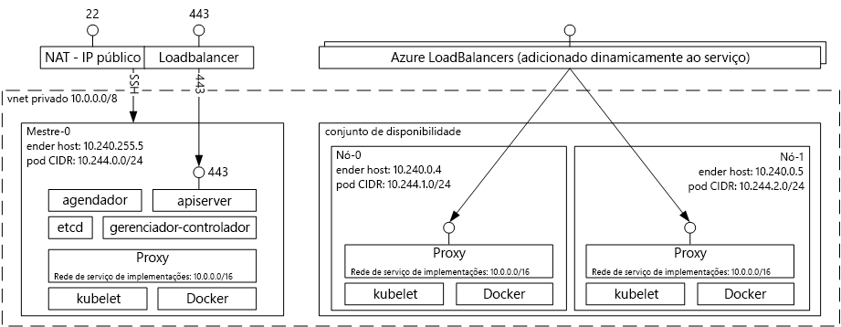

# Contêiner de tooDocker Introdução hospedagem soluções com o serviço de contêiner do Azure 
Serviço de contêiner do Azure torna mais simples para você toocreate, configurar e gerenciar um cluster de máquinas virtuais que são pré-configurados toorun em contêineres de aplicativos. Ele usa uma configuração otimizada de ferramentas populares de agendamento de software livre e de orquestração. Isso permite que você toouse suas habilidades existentes, ou exploram um corpo grande e crescente de experiência da comunidade, toodeploy e gerenciar aplicativos de contêiner no Microsoft Azure.

Serviço de contêiner do Azure aproveita o formato de contêiner do hello Docker tooensure que os contêineres de aplicativos são totalmente portáteis. Ele também dá suporte a escolha de maratona e DC/OS, o Docker Swarm ou Kubernetes para que você possa escalonar toothousands esses aplicativos contêineres ou até mesmo dezenas de milhares.

Usando o serviço de contêiner do Azure, você pode tirar proveito dos recursos de nível empresarial do Azure, enquanto mantém a portabilidade de aplicativo – incluindo portabilidade em camadas de orquestração de saudação.

## Usando o Serviço de Contêiner do Azure
Nosso objetivo com o serviço de contêiner do Azure é tooprovide um ambiente de hospedagem de contêiner usando ferramentas de código-fonte aberto e tecnologias que são comuns entre os clientes hoje. toothis final, podemos expor pontos de extremidade de API standard Olá para o orchestrator escolhido (controlador de domínio/OS, Docker Swarm ou Kubernetes). Ao usar esses pontos de extremidade, você pode utilizar qualquer software que é capaz de se comunicando toothose pontos de extremidade. Por exemplo, no caso de saudação do ponto de extremidade de Docker Swarm Olá, você pode escolher interface de linha de comando (CLI) do toouse Olá Docker. Para o SO/controlador de domínio, você pode escolher Olá DCOS CLI. Para Kubernetes, você pode escolher `kubectl`.

## Criação de um cluster do Docker usando o Serviço de Contêiner do Azure
toobegin usando o serviço de contêiner do Azure, é implantar um cluster do serviço de contêiner do Azure por meio do portal hello (Olá pesquisa Marketplace para **serviço de contêiner do Azure**), usando um modelo do Gerenciador de recursos do Azure ([Docker Swarm](https://github.com/Azure/azure-quickstart-templates/tree/master/101-acs-swarm), [DC/OS](https://github.com/Azure/azure-quickstart-templates/tree/master/101-acs-dcos), ou [Kubernetes](https://github.com/Azure/azure-quickstart-templates/tree/master/101-acs-kubernetes)), ou com hello [Azure CLI 2.0](container-service-create-acs-cluster-cli.md). Olá fornecidos modelos quickstart podem ser modificado tooinclude adicionais ou avançadas configuração do Azure. Para obter mais informações, consulte [Implantar um cluster do Serviço de Contêiner do Azure](container-service-deployment.md).

## Implantação de um aplicativo
O Serviço de Contêiner do Azure fornece uma opção de Docker Swarm, DC/SO ou Kubernetes para orquestração. Como implantar o aplicativo depende do orquestrador que você escolhe.

### Usando o DC/SO
DC/sistema operacional é um sistema operacional distribuído baseado no kernel do hello Apache Mesos sistemas distribuídos. Apache Mesos está hospedada no hello Apache Software Foundation e lista alguns dos Olá [maiores nomes em IT](http://mesos.apache.org/documentation/latest/powered-by-mesos/) como usuários e colaboradores.

Controlador de domínio/sistema operacional e Apache Mesos incluem um conjunto de recursos impressionantes:

* Escalabilidade comprovada
* Mestre e subordinados replicados com tolerância a falhas que usam o ZooKeeper
* Suporte para contêineres formatados pelo Docker
* Isolamento nativo entre tarefas com contêineres do Linux
* Agendamento de vários recursos (memória, CPU, disco e portas)
* APIs do Java, Python e C++ para desenvolver novos aplicativos paralelos
* Uma interface do usuário da Web para exibir o estado do cluster

Por padrão, o controlador de domínio/sistema operacional em execução no serviço de contêiner do Azure inclui plataforma de orquestração maratona Olá para cargas de trabalho de agendamento. No entanto, Olá implantação do controlador de domínio/sistema operacional do ACS é incluído Olá Mesosphere universo de serviços que podem ser adicionados tooyour serviço. Serviços em Olá universo incluem Spark, Hadoop, Cassandra e muito mais.

#### Usando o Marathon
Maratona é um init todo o cluster e o sistema de controle de serviços de cgroups – ou, no caso de saudação do serviço de contêiner do Azure, contêineres do Docker formatado. O Marathon fornece uma interface do usuário da Web na qual você pode implantar seus aplicativos. Você pode acessar isso em uma URL semelhante a `http://DNS_PREFIX.REGION.cloudapp.azure.com`, em que DNS\_PREFIX e REGION são definidos no momento da implantação. É claro, você também pode fornecer seu próprio nome DNS. Para obter mais informações sobre a execução de um contêiner usando a interface da web maratona hello, consulte [gerenciamento de contêiner de DC/sistema operacional por meio da interface da web hello maratona](container-service-mesos-marathon-ui.md).

Você também pode usar o hello APIs REST para se comunicar com maratona. Há uma série de bibliotecas de cliente que estão disponíveis para cada ferramenta. Abrangem uma variedade de idiomas – e, claro, você pode usar o protocolo HTTP de saudação em qualquer idioma. Além disso, muitas ferramentas populares de DevOps dão suporte para o Marathon. Isso oferece uma flexibilidade máxima para a equipe de operações quando estiver trabalhando com um cluster do Serviço de Contêiner do Azure. Para obter mais informações sobre a execução de um contêiner usando Olá maratona REST API, consulte [gerenciamento de contêiner de DC/sistema operacional por meio de saudação maratona REST API](container-service-mesos-marathon-rest.md).

### Usando o Docker Swarm
O Docker Swarm fornece o clustering nativo para o Docker. Como Docker Swarm serve Olá API Docker padrão, qualquer ferramenta que já se comunica com um daemon do Docker pode usar hosts de toomultiple por nuvem tootransparently escala no serviço de contêiner do Azure.

[!INCLUDE [container-service-swarm-mode-note](../../../includes/container-service-swarm-mode-note.md)]

Ferramentas com suporte para gerenciar contêineres em um cluster por nuvem incluem, mas não estão limitadas ao seguinte hello:

* Dokku
* CLI do Docker e Docker Compose
* Krane
* Jenkins

### Como usar Kubernetes
O Kubernetes é uma ferramenta de orquestrador de contêiner popular, de software livre com nível de produção. O Kubernetes automatiza a implantação, o dimensionamento e o gerenciamento de aplicativos em contêineres. Porque ele é uma solução de código-fonte aberto e é controlado pela comunidade de código-fonte aberto Olá, ele é executado diretamente no serviço de contêiner do Azure e pode ser usado toodeploy contêineres em grande escala no serviço de contêiner do Azure.

Ele tem um conjunto avançado de recursos, incluindo:
* Dimensionamento em escala horizontal
* Descoberta de serviço e balanceamento de carga
* Segredos e gerenciamento de configuração
* Reversões e distribuições automatizadas baseadas em API
* Autorrecuperação

## Vídeos
Introdução ao Serviço de Contêiner do Azure (101):  

> [!VIDEO https://channel9.msdn.com/Shows/Azure-Friday/Azure-Container-Service-101/player]
>
>

Saudação de aplicativos usando criando serviço de contêiner do Azure (compilação de 2016)

> [!VIDEO https://channel9.msdn.com/Events/Build/2016/B822/player]
>
>

## Próximas etapas

Implantar um cluster de serviço de contêiner usando Olá [portal](container-service-deployment.md) ou [Azure CLI 2.0](container-service-create-acs-cluster-cli.md).
