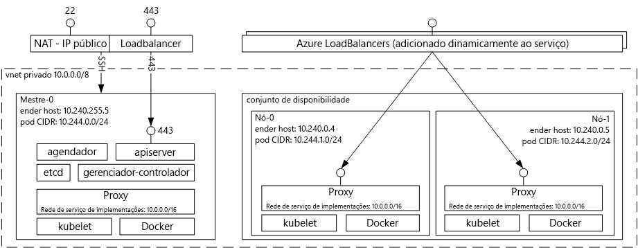

# Introdução tooAzure serviço de contêiner para KubernetesIntroduction tooAzure Container Service for Kubernetes
Serviço de contêiner do Azure para Kubernetes torna toocreate simple, configurar e gerenciar um cluster de máquinas virtuais que são pré-configurados toorun em contêineres de aplicativos.Azure Container Service for Kubernetes makes it simple toocreate, configure, and manage a cluster of virtual machines that are preconfigured toorun containerized applications. Isso permite que você toouse suas habilidades existentes, ou exploram um corpo grande e crescente de experiência da comunidade, toodeploy e gerenciar aplicativos de contêiner no Microsoft Azure.This enables you toouse your existing skills, or draw upon a large and growing body of community expertise, toodeploy and manage container-based applications on Microsoft Azure.

Usando o serviço de contêiner do Azure, você pode tirar proveito da saudação recursos empresariais do Azure, enquanto mantém a portabilidade de aplicativo por meio de Kubernetes e Olá formato de imagem do Docker.By using Azure Container Service, you can take advantage of hello enterprise-grade features of Azure, while still maintaining application portability through Kubernetes and hello Docker image format.

## Usando o Serviço de Contêiner do Azure para KubernetesUsing Azure Container Service for Kubernetes
Nosso objetivo com o serviço de contêiner do Azure é tooprovide um ambiente de hospedagem de contêiner usando ferramentas de código-fonte aberto e tecnologias que são comuns entre os clientes hoje.Our goal with Azure Container Service is tooprovide a container hosting environment by using open-source tools and technologies that are popular among our customers today. toothis final, expomos saudação padrão Kubernetes API os pontos de extremidade.toothis end, we expose hello standard Kubernetes API endpoints. Ao usar esses pontos de extremidade padrão, você pode utilizar qualquer software que é capaz de se comunicando tooa Kubernetes cluster.By using these standard endpoints, you can leverage any software that is capable of talking tooa Kubernetes cluster. Por exemplo, você pode escolher [kubectl](https://kubernetes.io/docs/user-guide/kubectl-overview/), [helm](https://helm.sh/), ou [draft](https://github.com/Azure/draft).For example, you might choose [kubectl](https://kubernetes.io/docs/user-guide/kubectl-overview/), [helm](https://helm.sh/), or [draft](https://github.com/Azure/draft).

## Criando um Cluster Kubernetes usando o Serviço de Contêiner do AzureCreating a Kubernetes cluster using Azure Container Service
toobegin usando o serviço de contêiner do Azure, implantar um cluster do serviço de contêiner do Azure com hello [2.0 do CLI do Azure](container-service-kubernetes-walkthrough.md) ou por meio do portal hello (Olá pesquisa Marketplace para **serviço de contêiner do Azure**).toobegin using Azure Container Service, deploy an Azure Container Service cluster with hello [Azure CLI 2.0](container-service-kubernetes-walkthrough.md) or via hello portal (search hello Marketplace for **Azure Container Service**). Se você for um usuário avançado que precisa de mais controle sobre modelos do hello Azure Resource Manager, você pode usar o código-fonte aberto Olá [acs mecanismo](https://github.com/Azure/acs-engine) toobuild projeto seus próprios Kubernetes personalizados do cluster e implantá-lo por meio de saudação `az` CLI.If you are an advanced user who needs more control over hello Azure Resource Manager templates, you can use hello open source [acs-engine](https://github.com/Azure/acs-engine) project toobuild your own custom Kubernetes cluster and deploy it via hello `az` CLI.

### Como usar KubernetesUsing Kubernetes
O Kubernetes automatiza a implantação, o dimensionamento e o gerenciamento de aplicativos em contêineres.Kubernetes automates deployment, scaling, and management of containerized applications. Ele tem um conjunto avançado de recursos, incluindo:It has a rich set of features including:
* Binpacking automáticoAutomatic binpacking
* AutorrecuperaçãoSelf-healing
* Dimensionamento em escala horizontalHorizontal scaling
* Descoberta de serviço e balanceamento de cargaService discovery and load balancing
* Reversões e distribuições automatizadasAutomated rollouts and rollbacks
* Segredos e gerenciamento de configuraçãoSecret and configuration management
* Orquestração de armazenamentoStorage orchestration
* Execução do LoteBatch execution

Diagrama da arquitetura de Kubernetes implantado por meio do Serviço de Contêiner do Azure:Architectural diagram of Kubernetes deployed via Azure Container Service:

## VídeosVideos

Suporte a Kubernetes nos Serviços de Contêiner do Azure (Azure Friday, janeiro de 2017):Kubernetes Support in Azure Container Services (Azure Friday, January 2017):

> [!VIDEO https://channel9.msdn.com/Shows/Azure-Friday/Kubernetes-Support-in-Azure-Container-Services/player]
>
>

Ferramentas para desenvolver e implantar aplicativos no Kubernetes (Azure OpenDev, junho de 2017):Tools for Developing and Deploying Applications on Kubernetes (Azure OpenDev, June 2017):

> [!VIDEO https://channel9.msdn.com/Events/AzureOpenDev/June2017/Tools-for-Developing-and-Deploying-Applications-on-Kubernetes/player]
>
>

## Próximas etapasNext steps

Explorar Olá [Kubernetes Quickstart](container-service-kubernetes-walkthrough.md) toobegin Explorando o serviço de contêiner do Azure hoje.Explore hello [Kubernetes Quickstart](container-service-kubernetes-walkthrough.md) toobegin exploring Azure Container Service today.
