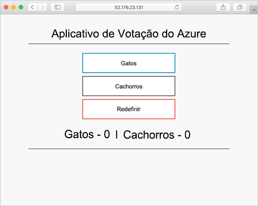

# <a name="create-container-images-toobe-used-with-azure-container-service"></a><span data-ttu-id="e13e7-104">Criar contêiner imagens toobe usado com o serviço de contêiner do Azure</span><span class="sxs-lookup"><span data-stu-id="e13e7-104">Create container images toobe used with Azure Container Service</span></span>

<span data-ttu-id="e13e7-105">Neste tutorial, parte um de sete, um aplicativo de vários contêineres é preparado para uso em Kubernetes.</span><span class="sxs-lookup"><span data-stu-id="e13e7-105">In this tutorial, part one of seven, a multi-container application is prepared for use in Kubernetes.</span></span> <span data-ttu-id="e13e7-106">As etapas concluídas incluem:</span><span class="sxs-lookup"><span data-stu-id="e13e7-106">Steps completed include:</span></span>  

> [!div class="checklist"]
> * <span data-ttu-id="e13e7-107">Clonando a fonte do aplicativo do GitHub</span><span class="sxs-lookup"><span data-stu-id="e13e7-107">Cloning application source from GitHub</span></span>  
> * <span data-ttu-id="e13e7-108">Criando uma imagem de contêiner de fonte de saudação do aplicativo</span><span class="sxs-lookup"><span data-stu-id="e13e7-108">Creating a container image from hello application source</span></span>
> * <span data-ttu-id="e13e7-109">Testando o aplicativo hello em um ambiente de Docker local</span><span class="sxs-lookup"><span data-stu-id="e13e7-109">Testing hello application in a local Docker environment</span></span>

<span data-ttu-id="e13e7-110">Depois de concluído, Olá aplicativo a seguir é acessível em seu ambiente de desenvolvimento local.</span><span class="sxs-lookup"><span data-stu-id="e13e7-110">Once completed, hello following application is accessible in your local development environment.</span></span>



<span data-ttu-id="e13e7-112">Em tutoriais subsequentes, imagem de contêiner de saudação é carregado tooan registro de contêiner do Azure e, em seguida, executar em um Azure hospedado Kubernetes cluster.</span><span class="sxs-lookup"><span data-stu-id="e13e7-112">In subsequent tutorials, hello container image is uploaded tooan Azure Container Registry, and then run in an Azure hosted Kubernetes cluster.</span></span>

## <a name="before-you-begin"></a><span data-ttu-id="e13e7-113">Antes de começar</span><span class="sxs-lookup"><span data-stu-id="e13e7-113">Before you begin</span></span>

<span data-ttu-id="e13e7-114">Este tutorial assume uma compreensão básica dos conceitos fundamentais do Docker como contêineres, imagens de contêiner e comandos básicos do docker.</span><span class="sxs-lookup"><span data-stu-id="e13e7-114">This tutorial assumes a basic understanding of core Docker concepts such as containers, container images, and basic docker commands.</span></span> <span data-ttu-id="e13e7-115">Se necessário, consulte [Get started with Docker]( https://docs.docker.com/get-started/) (Introdução ao Docker) para conhecer os conceitos básicos de contêiner.</span><span class="sxs-lookup"><span data-stu-id="e13e7-115">If needed, see [Get started with Docker]( https://docs.docker.com/get-started/) for a primer on container basics.</span></span> 

<span data-ttu-id="e13e7-116">toocomplete neste tutorial, você precisa de um ambiente de desenvolvimento do Docker.</span><span class="sxs-lookup"><span data-stu-id="e13e7-116">toocomplete this tutorial, you need a Docker development environment.</span></span> <span data-ttu-id="e13e7-117">O Docker fornece pacotes que configuram facilmente o Docker em qualquer sistema [Mac](https://docs.docker.com/docker-for-mac/), [Windows](https://docs.docker.com/docker-for-windows/) ou [Linux](https://docs.docker.com/engine/installation/#supported-platforms).</span><span class="sxs-lookup"><span data-stu-id="e13e7-117">Docker provides packages that easily configure Docker on any [Mac](https://docs.docker.com/docker-for-mac/), [Windows](https://docs.docker.com/docker-for-windows/), or [Linux](https://docs.docker.com/engine/installation/#supported-platforms) system.</span></span>

## <a name="get-application-code"></a><span data-ttu-id="e13e7-118">Obter o código de aplicativo</span><span class="sxs-lookup"><span data-stu-id="e13e7-118">Get application code</span></span>

<span data-ttu-id="e13e7-119">aplicativo de exemplo Hello usado neste tutorial é um aplicativo de votação básico.</span><span class="sxs-lookup"><span data-stu-id="e13e7-119">hello sample application used in this tutorial is a basic voting app.</span></span> <span data-ttu-id="e13e7-120">aplicativo Hello consiste em um componente web front-end e uma instância do Redis de back-end.</span><span class="sxs-lookup"><span data-stu-id="e13e7-120">hello application consists of a front-end web component and a back-end Redis instance.</span></span> <span data-ttu-id="e13e7-121">componente de web Hello é empacotado em uma imagem de contêiner personalizado.</span><span class="sxs-lookup"><span data-stu-id="e13e7-121">hello web component is packaged into a custom container image.</span></span> <span data-ttu-id="e13e7-122">instância do Redis Olá usa uma imagem sem modificações do Hub do Docker.</span><span class="sxs-lookup"><span data-stu-id="e13e7-122">hello Redis instance uses an unmodified image from Docker Hub.</span></span>  

<span data-ttu-id="e13e7-123">Use git toodownload uma cópia do ambiente de desenvolvimento de tooyour de aplicativo hello.</span><span class="sxs-lookup"><span data-stu-id="e13e7-123">Use git toodownload a copy of hello application tooyour development environment.</span></span>

```bash
git clone https://github.com/Azure-Samples/azure-voting-app-redis.git
```

<span data-ttu-id="e13e7-124">Interna Olá clonado diretório é o código-fonte aplicativo hello, um Docker pré-criados compõem o arquivo e um arquivo de manifesto Kubernetes.</span><span class="sxs-lookup"><span data-stu-id="e13e7-124">Inside hello cloned directory is hello application source code, a pre-created Docker compose file, and a Kubernetes manifest file.</span></span> <span data-ttu-id="e13e7-125">Esses arquivos são ativos toocreate usados em todo o conjunto de tutorial hello.</span><span class="sxs-lookup"><span data-stu-id="e13e7-125">These files are used toocreate assets throughout hello tutorial set.</span></span> 

## <a name="create-container-images"></a><span data-ttu-id="e13e7-126">Criar imagens de contêiner</span><span class="sxs-lookup"><span data-stu-id="e13e7-126">Create container images</span></span>

<span data-ttu-id="e13e7-127">[Composição de docker](https://docs.docker.com/compose/) pode ser usado tooautomate Olá compilação fora de imagens de contêiner e a implantação de saudação do contêiner de vários aplicativos.</span><span class="sxs-lookup"><span data-stu-id="e13e7-127">[Docker Compose](https://docs.docker.com/compose/) can be used tooautomate hello build out of container images and hello deployment of multi-container applications.</span></span>

<span data-ttu-id="e13e7-128">Executar a imagem de contêiner de Olá Olá docker compose.yml arquivo toocreate, download Olá Redis imagem e iniciar o aplicativo hello.</span><span class="sxs-lookup"><span data-stu-id="e13e7-128">Run hello docker-compose.yml file toocreate hello container image, download hello Redis image, and start hello application.</span></span>

```bash
docker-compose -f ./azure-voting-app-redis/docker-compose.yml up -d
```

<span data-ttu-id="e13e7-129">Quando concluído, use Olá [imagens do docker](https://docs.docker.com/engine/reference/commandline/images/) comando toosee imagens de saudação criada.</span><span class="sxs-lookup"><span data-stu-id="e13e7-129">When completed, use hello [docker images](https://docs.docker.com/engine/reference/commandline/images/) command toosee hello created images.</span></span>

```bash
docker images
```

<span data-ttu-id="e13e7-130">Observe que três imagens foram baixadas ou criadas.</span><span class="sxs-lookup"><span data-stu-id="e13e7-130">Notice that three images have been downloaded or created.</span></span> <span data-ttu-id="e13e7-131">Olá *front do azure-voto* imagem contém o aplicativo hello.</span><span class="sxs-lookup"><span data-stu-id="e13e7-131">hello *azure-vote-front* image contains hello application.</span></span> <span data-ttu-id="e13e7-132">Ela foi derivada de saudação *nginx bulbo* imagem.</span><span class="sxs-lookup"><span data-stu-id="e13e7-132">It was derived from hello *nginx-flask* image.</span></span> <span data-ttu-id="e13e7-133">imagem de Redis Olá foi baixada do Hub do Docker.</span><span class="sxs-lookup"><span data-stu-id="e13e7-133">hello Redis image was downloaded from Docker Hub.</span></span>

```bash
REPOSITORY                   TAG        IMAGE ID            CREATED             SIZE
azure-vote-front             latest     9cc914e25834        40 seconds ago      694MB
redis                        latest     a1b99da73d05        7 days ago          106MB
tiangolo/uwsgi-nginx-flask   flask      788ca94b2313        9 months ago        694MB
```

<span data-ttu-id="e13e7-134">Executar Olá [docker ps](https://docs.docker.com/engine/reference/commandline/ps/) saudação do comando toosee contêineres em execução.</span><span class="sxs-lookup"><span data-stu-id="e13e7-134">Run hello [docker ps](https://docs.docker.com/engine/reference/commandline/ps/) command toosee hello running containers.</span></span>

```bash
docker ps
```

<span data-ttu-id="e13e7-135">Saída:</span><span class="sxs-lookup"><span data-stu-id="e13e7-135">Output:</span></span>

```bash
CONTAINER ID        IMAGE             COMMAND                  CREATED             STATUS              PORTS                           NAMES
82411933e8f9        azure-vote-front  "/usr/bin/supervisord"   57 seconds ago      Up 30 seconds       443/tcp, 0.0.0.0:8080->80/tcp   azure-vote-front
b68fed4b66b6        redis             "docker-entrypoint..."   57 seconds ago      Up 30 seconds       0.0.0.0:6379->6379/tcp          azure-vote-back
```

## <a name="test-application-locally"></a><span data-ttu-id="e13e7-136">Testar o aplicativo localmente</span><span class="sxs-lookup"><span data-stu-id="e13e7-136">Test application locally</span></span>

<span data-ttu-id="e13e7-137">Procure toohttp://localhost:8080 toosee Olá executando o aplicativo.</span><span class="sxs-lookup"><span data-stu-id="e13e7-137">Browse toohttp://localhost:8080 toosee hello running application.</span></span>


## <a name="clean-up-resources"></a><span data-ttu-id="e13e7-139">Limpar recursos</span><span class="sxs-lookup"><span data-stu-id="e13e7-139">Clean up resources</span></span>

<span data-ttu-id="e13e7-140">Agora que a funcionalidade do aplicativo foi validada, Olá contêineres em execução pode ser interrompido e removido.</span><span class="sxs-lookup"><span data-stu-id="e13e7-140">Now that application functionality has been validated, hello running containers can be stopped and removed.</span></span> <span data-ttu-id="e13e7-141">Não exclua imagens de contêiner de saudação.</span><span class="sxs-lookup"><span data-stu-id="e13e7-141">Do not delete hello container images.</span></span> <span data-ttu-id="e13e7-142">Olá *front do azure-voto* imagem é instância de registro de contêiner do Azure carregados tooan tutorial Avançar hello.</span><span class="sxs-lookup"><span data-stu-id="e13e7-142">hello *azure-vote-front* image is uploaded tooan Azure Container Registry instance in hello next tutorial.</span></span>

<span data-ttu-id="e13e7-143">Execute Olá Olá toostop contêineres em execução a seguir.</span><span class="sxs-lookup"><span data-stu-id="e13e7-143">Run hello following toostop hello running containers.</span></span>

```bash
docker-compose -f ./azure-voting-app-redis/docker-compose.yml stop
```

<span data-ttu-id="e13e7-144">Exclua os contêineres de saudação interrompido com hello comando a seguir.</span><span class="sxs-lookup"><span data-stu-id="e13e7-144">Delete hello stopped containers with hello following command.</span></span>

```bash
docker-compose -f ./azure-voting-app-redis/docker-compose.yml rm
```

<span data-ttu-id="e13e7-145">Ao concluir, você tem uma imagem de contêiner que contém o aplicativo do Azure voto hello.</span><span class="sxs-lookup"><span data-stu-id="e13e7-145">At completion, you have a container image that contains hello Azure Vote application.</span></span>

## <a name="next-steps"></a><span data-ttu-id="e13e7-146">Próximas etapas</span><span class="sxs-lookup"><span data-stu-id="e13e7-146">Next steps</span></span>

<span data-ttu-id="e13e7-147">Neste tutorial, um aplicativo foi testado e imagens de contêiner é criado para o aplicativo hello.</span><span class="sxs-lookup"><span data-stu-id="e13e7-147">In this tutorial, an application was tested and container images created for hello application.</span></span> <span data-ttu-id="e13e7-148">Olá, as etapas a seguir foram concluída:</span><span class="sxs-lookup"><span data-stu-id="e13e7-148">hello following steps were completed:</span></span>

> [!div class="checklist"]
> * <span data-ttu-id="e13e7-149">Fonte do aplicativo hello clonagem do GitHub</span><span class="sxs-lookup"><span data-stu-id="e13e7-149">Cloning hello application source from GitHub</span></span>  
> * <span data-ttu-id="e13e7-150">Criando uma imagem de contêiner a partir da origem do aplicativo</span><span class="sxs-lookup"><span data-stu-id="e13e7-150">Created a container image from application source</span></span>
> * <span data-ttu-id="e13e7-151">Aplicativo hello testado em um ambiente de Docker local</span><span class="sxs-lookup"><span data-stu-id="e13e7-151">Tested hello application in a local Docker environment</span></span>

<span data-ttu-id="e13e7-152">Avançar toohello toolearn próximo de tutorial sobre como armazenar imagens de contêiner em um registro de contêiner do Azure.</span><span class="sxs-lookup"><span data-stu-id="e13e7-152">Advance toohello next tutorial toolearn about storing container images in an Azure Container Registry.</span></span>

> [!div class="nextstepaction"]
> [<span data-ttu-id="e13e7-153">Imagens de push tooAzure registro de contêiner</span><span class="sxs-lookup"><span data-stu-id="e13e7-153">Push images tooAzure Container Registry</span></span>](./container-service-tutorial-kubernetes-prepare-acr.md)
