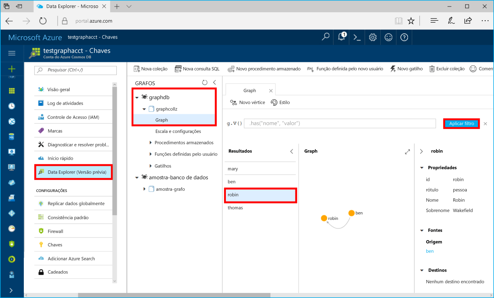

# <a name="azure-cosmos-db-build-a-net-application-using-hello-graph-api"></a><span data-ttu-id="84bcc-103">Cosmos do Azure DB: Criar um aplicativo .NET usando Olá API do Graph</span><span class="sxs-lookup"><span data-stu-id="84bcc-103">Azure Cosmos DB: Build a .NET application using hello Graph API</span></span>

<span data-ttu-id="84bcc-104">O BD Cosmos do Azure é o serviço multimodelo de banco de dados distribuído globalmente da Microsoft.</span><span class="sxs-lookup"><span data-stu-id="84bcc-104">Azure Cosmos DB is Microsoft’s globally distributed multi-model database service.</span></span> <span data-ttu-id="84bcc-105">Você pode criar e consultar documentos, chave/valor e bancos de dados do gráfico, que se beneficiar de distribuição global hello e recursos de escala horizontal no núcleo de saudação do banco de dados do Azure Cosmos rapidamente.</span><span class="sxs-lookup"><span data-stu-id="84bcc-105">You can quickly create and query document, key/value, and graph databases, all of which benefit from hello global distribution and horizontal scale capabilities at hello core of Azure Cosmos DB.</span></span> 

<span data-ttu-id="84bcc-106">Este guia rápido demonstra como toocreate uma conta de banco de dados do Azure Cosmos, o banco de dados e o uso de gráfico (contêiner) Olá portal do Azure.</span><span class="sxs-lookup"><span data-stu-id="84bcc-106">This quick start demonstrates how toocreate an Azure Cosmos DB account, database, and graph (container) using hello Azure portal.</span></span> <span data-ttu-id="84bcc-107">Você, em seguida, compilar e executar um aplicativo de console criado em Olá [API do Graph](graph-sdk-dotnet.md) (visualização).</span><span class="sxs-lookup"><span data-stu-id="84bcc-107">You then build and run a console app built on hello [Graph API](graph-sdk-dotnet.md) (preview).</span></span>  

## <a name="prerequisites"></a><span data-ttu-id="84bcc-108">Pré-requisitos</span><span class="sxs-lookup"><span data-stu-id="84bcc-108">Prerequisites</span></span>

<span data-ttu-id="84bcc-109">Se você ainda não tiver o Visual Studio de 2017 instalado, você pode baixar e usar o hello **livre** [Visual Studio 2017 Community Edition](https://www.visualstudio.com/downloads/).</span><span class="sxs-lookup"><span data-stu-id="84bcc-109">If you don’t already have Visual Studio 2017 installed, you can download and use hello **free** [Visual Studio 2017 Community Edition](https://www.visualstudio.com/downloads/).</span></span> <span data-ttu-id="84bcc-110">Certifique-se de que você habilite **desenvolvimento do Azure** durante a instalação do Visual Studio hello.</span><span class="sxs-lookup"><span data-stu-id="84bcc-110">Make sure that you enable **Azure development** during hello Visual Studio setup.</span></span>

[!INCLUDE [quickstarts-free-trial-note](../../includes/quickstarts-free-trial-note.md)]

## <a name="create-a-database-account"></a><span data-ttu-id="84bcc-111">Criar uma conta de banco de dados</span><span class="sxs-lookup"><span data-stu-id="84bcc-111">Create a database account</span></span>

[!INCLUDE [cosmos-db-create-dbaccount-graph](../../includes/cosmos-db-create-dbaccount-graph.md)]

## <a name="add-a-graph"></a><span data-ttu-id="84bcc-112">Adicionar um gráfico</span><span class="sxs-lookup"><span data-stu-id="84bcc-112">Add a graph</span></span>

[!INCLUDE [cosmos-db-create-graph](../../includes/cosmos-db-create-graph.md)]

## <a name="clone-hello-sample-application"></a><span data-ttu-id="84bcc-113">Clonar um aplicativo de exemplo hello</span><span class="sxs-lookup"><span data-stu-id="84bcc-113">Clone hello sample application</span></span>

<span data-ttu-id="84bcc-114">Agora vamos aplicativo clone uma API do Graph do github, defina a cadeia de caracteres de conexão hello e executá-lo.</span><span class="sxs-lookup"><span data-stu-id="84bcc-114">Now let's clone a Graph API app from github, set hello connection string, and run it.</span></span> <span data-ttu-id="84bcc-115">Você verá como é fácil toowork com dados programaticamente.</span><span class="sxs-lookup"><span data-stu-id="84bcc-115">You'll see how easy it is toowork with data programmatically.</span></span> 

1. <span data-ttu-id="84bcc-116">Abra uma janela de terminal de git, como git bash, e `cd` tooa diretório de trabalho.</span><span class="sxs-lookup"><span data-stu-id="84bcc-116">Open a git terminal window, such as git bash, and `cd` tooa working directory.</span></span>  

2. <span data-ttu-id="84bcc-117">Execute Olá repositório de exemplo do comando tooclone Olá a seguir.</span><span class="sxs-lookup"><span data-stu-id="84bcc-117">Run hello following command tooclone hello sample repository.</span></span> 

    ```bash
    git clone https://github.com/Azure-Samples/azure-cosmos-db-graph-dotnet-getting-started.git
    ```

3. <span data-ttu-id="84bcc-118">Abra o Visual Studio e o arquivo de solução Olá aberto.</span><span class="sxs-lookup"><span data-stu-id="84bcc-118">Then open Visual Studio and open hello solution file.</span></span> 

## <a name="review-hello-code"></a><span data-ttu-id="84bcc-119">Examine o código de saudação</span><span class="sxs-lookup"><span data-stu-id="84bcc-119">Review hello code</span></span>

<span data-ttu-id="84bcc-120">Vamos fazer uma rápida revisão do que está acontecendo no aplicativo hello.</span><span class="sxs-lookup"><span data-stu-id="84bcc-120">Let's make a quick review of what's happening in hello app.</span></span> <span data-ttu-id="84bcc-121">Arquivo Program.cs de saudação aberto e você descobrirá que essas linhas de código criam Olá recursos de banco de dados do Azure Cosmos.</span><span class="sxs-lookup"><span data-stu-id="84bcc-121">Open hello Program.cs file and you'll find that these lines of code create hello Azure Cosmos DB resources.</span></span> 

* <span data-ttu-id="84bcc-122">Olá DocumentClient é inicializado.</span><span class="sxs-lookup"><span data-stu-id="84bcc-122">hello DocumentClient is initialized.</span></span> <span data-ttu-id="84bcc-123">Na visualização de hello, adicionamos uma extensão de graph API no cliente de banco de dados do Azure Cosmos hello.</span><span class="sxs-lookup"><span data-stu-id="84bcc-123">In hello preview, we added a graph extension API on hello Azure Cosmos DB client.</span></span> <span data-ttu-id="84bcc-124">Estamos trabalhando em um cliente de gráfico autônomo separado do cliente de banco de dados do Azure Cosmos hello e recursos.</span><span class="sxs-lookup"><span data-stu-id="84bcc-124">We are working on a standalone graph client decoupled from hello Azure Cosmos DB client and resources.</span></span>

    ```csharp
    using (DocumentClient client = new DocumentClient(
        new Uri(endpoint),
        authKey,
        new ConnectionPolicy { ConnectionMode = ConnectionMode.Direct, ConnectionProtocol = Protocol.Tcp }))
    ```

* <span data-ttu-id="84bcc-125">Um novo banco de dados é criado.</span><span class="sxs-lookup"><span data-stu-id="84bcc-125">A new database is created.</span></span>

    ```csharp
    Database database = await client.CreateDatabaseIfNotExistsAsync(new Database { Id = "graphdb" });
    ```

* <span data-ttu-id="84bcc-126">Um novo gráfico é criado.</span><span class="sxs-lookup"><span data-stu-id="84bcc-126">A new graph is created.</span></span>

    ```csharp
    DocumentCollection graph = await client.CreateDocumentCollectionIfNotExistsAsync(
        UriFactory.CreateDatabaseUri("graphdb"),
        new DocumentCollection { Id = "graph" },
        new RequestOptions { OfferThroughput = 1000 });
    ```
* <span data-ttu-id="84bcc-127">Uma série de etapas de Gremlin são executadas usando Olá `CreateGremlinQuery` método.</span><span class="sxs-lookup"><span data-stu-id="84bcc-127">A series of Gremlin steps are executed using hello `CreateGremlinQuery` method.</span></span>

    ```csharp
    // hello CreateGremlinQuery method extensions allow you tooexecute Gremlin queries and iterate
    // results asychronously
    IDocumentQuery<dynamic> query = client.CreateGremlinQuery<dynamic>(graph, "g.V().count()");
    while (query.HasMoreResults)
    {
        foreach (dynamic result in await query.ExecuteNextAsync())
        {
            Console.WriteLine($"\t {JsonConvert.SerializeObject(result)}");
        }
    }

    ```

## <a name="update-your-connection-string"></a><span data-ttu-id="84bcc-128">Atualizar sua cadeia de conexão</span><span class="sxs-lookup"><span data-stu-id="84bcc-128">Update your connection string</span></span>

<span data-ttu-id="84bcc-129">Agora volte toohello tooget portal do Azure suas informações de cadeia de caracteres de conexão e copie-o em um aplicativo hello.</span><span class="sxs-lookup"><span data-stu-id="84bcc-129">Now go back toohello Azure portal tooget your connection string information and copy it into hello app.</span></span>

1. <span data-ttu-id="84bcc-130">No Visual Studio de 2017, abra o arquivo App. config de saudação.</span><span class="sxs-lookup"><span data-stu-id="84bcc-130">In Visual Studio 2017, open hello App.config file.</span></span> 

2. <span data-ttu-id="84bcc-131">No hello portal do Azure, na sua conta do banco de dados do Azure Cosmos, clique em **chaves** em Olá barra de navegação esquerda.</span><span class="sxs-lookup"><span data-stu-id="84bcc-131">In hello Azure portal, in your Azure Cosmos DB account, click **Keys** in hello left navigation.</span></span> 

    

3. <span data-ttu-id="84bcc-133">Copiar seu **URI** valor no portal de saudação e torná-lo Olá o valor da chave do ponto de extremidade de saudação no App. config. Você pode usar o botão de cópia de saudação conforme Olá precede o valor de saudação toocopy captura de tela.</span><span class="sxs-lookup"><span data-stu-id="84bcc-133">Copy your **URI** value from hello portal and make it hello value of hello Endpoint key in App.config. You can use hello copy button as shown in hello preceding screenshot toocopy hello value.</span></span>

    `<add key="Endpoint" value="https://FILLME.documents.azure.com:443" />`

4. <span data-ttu-id="84bcc-134">Copiar seu **chave primária** valor no portal de saudação e torná-lo Olá o valor da chave de AuthKey Olá no App. config e salve suas alterações.</span><span class="sxs-lookup"><span data-stu-id="84bcc-134">Copy your **PRIMARY KEY** value from hello portal, and make it hello value of hello AuthKey key in App.config, then save your changes.</span></span> 

    `<add key="AuthKey" value="FILLME" />`

<span data-ttu-id="84bcc-135">Agora que você atualizou seu aplicativo com todas as informações de saudação precisa toocommunicate com o banco de dados do Azure Cosmos.</span><span class="sxs-lookup"><span data-stu-id="84bcc-135">You've now updated your app with all hello info it needs toocommunicate with Azure Cosmos DB.</span></span> 

## <a name="run-hello-console-app"></a><span data-ttu-id="84bcc-136">Execute o aplicativo de console Olá</span><span class="sxs-lookup"><span data-stu-id="84bcc-136">Run hello console app</span></span>

1. <span data-ttu-id="84bcc-137">No Visual Studio, clique em Olá **GraphGetStarted** project no **Solution Explorer** e, em seguida, clique em **gerenciar pacotes NuGet**.</span><span class="sxs-lookup"><span data-stu-id="84bcc-137">In Visual Studio, right-click on hello **GraphGetStarted** project in **Solution Explorer** and then click **Manage NuGet Packages**.</span></span> 

2. <span data-ttu-id="84bcc-138">Em Olá NuGet **procurar** , digite *Microsoft.Azure.Graphs* e verifique Olá **inclui a versão de pré-lançamento** caixa.</span><span class="sxs-lookup"><span data-stu-id="84bcc-138">In hello NuGet **Browse** box, type *Microsoft.Azure.Graphs* and check hello **Includes prerelease** box.</span></span> 

3. <span data-ttu-id="84bcc-139">Resultados de hello, instalar Olá **Microsoft.Azure.Graphs** biblioteca.</span><span class="sxs-lookup"><span data-stu-id="84bcc-139">From hello results, install hello **Microsoft.Azure.Graphs** library.</span></span> <span data-ttu-id="84bcc-140">Isso instala o pacote de biblioteca de extensão do hello Azure Cosmos DB gráfico e todas as dependências.</span><span class="sxs-lookup"><span data-stu-id="84bcc-140">This installs hello Azure Cosmos DB graph extension library package and all dependencies.</span></span>

    <span data-ttu-id="84bcc-141">Se você receber uma mensagem sobre Analisando alterações toohello solução, clique em **Okey**.</span><span class="sxs-lookup"><span data-stu-id="84bcc-141">If you get a message about reviewing changes toohello solution, click **OK**.</span></span> <span data-ttu-id="84bcc-142">Se receber uma mensagem sobre a aceitação da licença, clique em **Aceito**.</span><span class="sxs-lookup"><span data-stu-id="84bcc-142">If you get a message about license acceptance, click **I accept**.</span></span>

4. <span data-ttu-id="84bcc-143">Clique em CTRL + F5 aplicativo hello de toorun.</span><span class="sxs-lookup"><span data-stu-id="84bcc-143">Click CTRL + F5 toorun hello application.</span></span>

   <span data-ttu-id="84bcc-144">janela de console Olá exibe vértices hello e bordas que está sendo adicionadas toohello gráfico.</span><span class="sxs-lookup"><span data-stu-id="84bcc-144">hello console window displays hello vertexes and edges being added toohello graph.</span></span> <span data-ttu-id="84bcc-145">Ao concluir script hello, pressione ENTER duas vezes tooclose janela do console de saudação.</span><span class="sxs-lookup"><span data-stu-id="84bcc-145">When hello script completes, press ENTER twice tooclose hello console window.</span></span> 

## <a name="browse-using-hello-data-explorer"></a><span data-ttu-id="84bcc-146">Procurar usando Olá Explorador de dados</span><span class="sxs-lookup"><span data-stu-id="84bcc-146">Browse using hello Data Explorer</span></span>

<span data-ttu-id="84bcc-147">Agora você pode voltar tooData Explorer no hello portal do Azure e procurar e consultar seus novos dados de gráfico.</span><span class="sxs-lookup"><span data-stu-id="84bcc-147">You can now go back tooData Explorer in hello Azure portal and browse and query your new graph data.</span></span>

1. <span data-ttu-id="84bcc-148">No Explorador de dados, o novo banco de dados de saudação aparece no painel de gráficos de hello.</span><span class="sxs-lookup"><span data-stu-id="84bcc-148">In Data Explorer, hello new database appears in hello Graphs pane.</span></span> <span data-ttu-id="84bcc-149">Expanda **graphdb**, **graphcollz** e, depois, clique em **Gráfico**.</span><span class="sxs-lookup"><span data-stu-id="84bcc-149">Expand **graphdb**, **graphcollz**, and then click **Graph**.</span></span>

2. <span data-ttu-id="84bcc-150">Clique em Olá **Aplicar filtro** padrão de saudação do botão toouse consultar tooview todos os verticies Olá no gráfico de saudação.</span><span class="sxs-lookup"><span data-stu-id="84bcc-150">Click hello **Apply Filter** button toouse hello default query tooview all hello verticies in hello graph.</span></span> <span data-ttu-id="84bcc-151">dados de Olá gerados pelo aplicativo de exemplo hello são exibidos no painel de gráficos hello.</span><span class="sxs-lookup"><span data-stu-id="84bcc-151">hello data generated by hello sample app is displayed in hello Graphs pane.</span></span>

    <span data-ttu-id="84bcc-152">Você pode aplicar zoom dentro e fora do gráfico hello, expanda o espaço de exibição de gráfico hello, adicionar verticies adicionais e mover a superfície de exibição verticies em hello.</span><span class="sxs-lookup"><span data-stu-id="84bcc-152">You can zoom in and out of hello graph, you can expand hello graph display space, add additional verticies, and move verticies on hello display surface.</span></span>

    

## <a name="review-slas-in-hello-azure-portal"></a><span data-ttu-id="84bcc-154">Examine os SLAs em Olá portal do Azure</span><span class="sxs-lookup"><span data-stu-id="84bcc-154">Review SLAs in hello Azure portal</span></span>

[!INCLUDE [cosmosdb-tutorial-review-slas](../../includes/cosmos-db-tutorial-review-slas.md)]

## <a name="clean-up-resources"></a><span data-ttu-id="84bcc-155">Limpar recursos</span><span class="sxs-lookup"><span data-stu-id="84bcc-155">Clean up resources</span></span>

<span data-ttu-id="84bcc-156">Se você não vai toocontinue toouse este aplicativo, exclua todos os recursos criados por este guia de início rápido Olá portal do Azure com hello etapas a seguir:</span><span class="sxs-lookup"><span data-stu-id="84bcc-156">If you're not going toocontinue toouse this app, delete all resources created by this quickstart in hello Azure portal with hello following steps:</span></span> 

1. <span data-ttu-id="84bcc-157">No menu esquerdo de saudação do hello portal do Azure, clique em **grupos de recursos** e clique em nome de saudação do recurso de saudação criado por você.</span><span class="sxs-lookup"><span data-stu-id="84bcc-157">From hello left-hand menu in hello Azure portal, click **Resource groups** and then click hello name of hello resource you created.</span></span> 
2. <span data-ttu-id="84bcc-158">Na sua página de grupo de recursos, clique em **excluir**, digite o nome de saudação do hello recurso toodelete na caixa de texto de saudação e, em seguida, clique em **excluir**.</span><span class="sxs-lookup"><span data-stu-id="84bcc-158">On your resource group page, click **Delete**, type hello name of hello resource toodelete in hello text box, and then click **Delete**.</span></span>

## <a name="next-steps"></a><span data-ttu-id="84bcc-159">Próximas etapas</span><span class="sxs-lookup"><span data-stu-id="84bcc-159">Next steps</span></span>

<span data-ttu-id="84bcc-160">Este guia de início rápido, você aprendeu como toocreate uma conta de banco de dados do Azure Cosmos, criar um gráfico usando Olá Explorador de dados e executar o aplicativo.</span><span class="sxs-lookup"><span data-stu-id="84bcc-160">In this quickstart, you've learned how toocreate an Azure Cosmos DB account, create a graph using hello Data Explorer, and run an app.</span></span> <span data-ttu-id="84bcc-161">Agora, você pode criar consultas mais complexas e implementar uma lógica de passagem de gráfico avançada usando o Gremlin.</span><span class="sxs-lookup"><span data-stu-id="84bcc-161">You can now build more complex queries and implement powerful graph traversal logic using Gremlin.</span></span> 

> [!div class="nextstepaction"]
> [<span data-ttu-id="84bcc-162">Consultar usando o Gremlin</span><span class="sxs-lookup"><span data-stu-id="84bcc-162">Query using Gremlin</span></span>](tutorial-query-graph.md)

