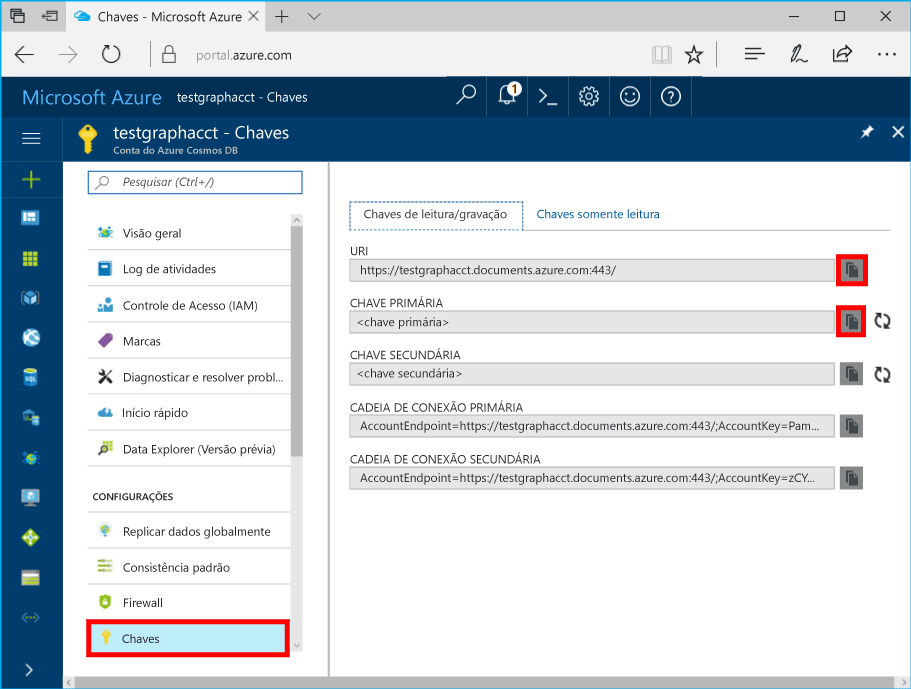

# <a name="azure-cosmos-db-create-query-and-traverse-a-graph-in-hello-gremlin-console"></a>Cosmos do Azure DB: Criar, consultar e percorrer um gráfico no console de Gremlin Olá

O BD Cosmos do Azure é o serviço multimodelo de banco de dados distribuído globalmente da Microsoft. Você pode criar e consultar documentos, chave/valor e bancos de dados do gráfico, que se beneficiar de distribuição global hello e recursos de escala horizontal no núcleo de saudação do banco de dados do Azure Cosmos rapidamente. 

Este guia rápido demonstra como toocreate uma conta de banco de dados do Azure Cosmos, o banco de dados e o uso de gráfico (contêiner) Olá portal do Azure e, em seguida, use Olá [Gremlin Console](https://tinkerpop.apache.org/docs/current/reference/#gremlin-console) de [TinkerPop Apache](http://tinkerpop.apache.org) toowork com Dados de API (visualização) do gráfico. Neste tutorial, você cria e consulta vértices e bordas, atualizando uma propriedade de vértice, vértices de consulta, percorra o gráfico de saudação e descartar um vértice.


console de Gremlin Olá é Groovy/Java com base e executa no Linux, Mac e Windows. Você pode baixá-lo do hello [TinkerPop Apache site](https://www.apache.org/dyn/closer.lua/tinkerpop/3.2.5/apache-tinkerpop-gremlin-console-3.2.5-bin.zip).

## <a name="prerequisites"></a>Pré-requisitos

Você precisa toohave toocreate uma assinatura do Azure uma conta de banco de dados do Azure Cosmos para este guia de início rápido.

[!INCLUDE [quickstarts-free-trial-note](../../includes/quickstarts-free-trial-note.md)]

Você também precisa tooinstall Olá [Gremlin Console](http://tinkerpop.apache.org/). Use a versão 3.2.5 ou posterior.

## <a name="create-a-database-account"></a>Criar uma conta de banco de dados

[!INCLUDE [cosmos-db-create-dbaccount-graph](../../includes/cosmos-db-create-dbaccount-graph.md)]

## <a name="add-a-graph"></a>Adicionar um gráfico

[!INCLUDE [cosmos-db-create-graph](../../includes/cosmos-db-create-graph.md)]

## <a id="ConnectAppService"></a>Conecte-se o serviço de aplicativo tooyour
1. Antes de iniciar Olá Gremlin Console, criar ou modificar Olá remoto secure.yaml arquivo no diretório de apache-tinkerpop-gremlin-console-3.2.5/conf Olá.
2. Preencha as configurações de *host*, *porta*, *nome de usuário*, *senha*, *connectionPool* e *serializador*:

    Configuração|Valor sugerido|Descrição
    ---|---|---
    hosts|[***.graphs.azure.com]|Confira a captura de tela abaixo. O valor de URI Gremlin Olá na página de visão geral de saudação do hello portal do Azure, entre colchetes, com hello à direita é: 443 / removido.<br><br>Esse valor também pode ser recuperado do guia de chaves hello, usando o valor URI Olá removendo https://, alterando toographs documentos e remoção de saudação à direita: 443 /.
    porta|443|Definir too443.
    Nome de Usuário|*Seu nome de usuário*|Olá recursos do formulário de saudação `/dbs/<db>/colls/<coll>` onde `<db>` é o nome do banco de dados e `<coll>` é o nome da coleção.
    Senha|*Sua chave primária*| Confira a segunda captura de tela abaixo. Isso é sua chave primária, você pode recuperar da página de chaves de saudação do hello portal do Azure, na caixa de chave primária de saudação. Use o botão de cópia de saudação no lado esquerdo de saudação do valor de Olá Olá caixa toocopy.
    connectionPool|{enableSsl: true}|Sua configuração do pool de conexão para SSL.
    serializador|{ className: org.apache.tinkerpop.gremlin.<br>driver.ser.GraphSONMessageSerializerV1d0,<br> config: { serializeResultToString: true }}|Defina o valor de toothis e excluir qualquer `\n` quebras de linha ao colar no valor de saudação.

    Valor de hosts hello, copie Olá **Gremlin URI** valor da saudação **visão geral** página: 

    Para o valor da senha hello, copie Olá **chave primária** de saudação **chaves** página: 


3. Em seu terminal, execute `bin/gremlin.bat` ou `bin/gremlin.sh` toostart Olá [Gremlin Console](http://tinkerpop.apache.org/docs/3.2.5/tutorials/getting-started/).
4. Em seu terminal, execute `:remote connect tinkerpop.server conf/remote-secure.yaml` tooconnect tooyour do serviço de aplicativo.

    > [!TIP]
    > Se você receber o erro Olá `No appenders could be found for logger` Certifique-se de que você atualizou o valor de serializador Olá no arquivo de secure.yaml remoto Olá conforme descrito na etapa 2. 

Ótimo! Concluída a instalação Olá, vamos começar a executar alguns comandos do console.

Vamos tentar um comando count() simples. Digite o seguinte de saudação em console Olá no prompt de saudação:
```
:> g.V().count()
```

> [!TIP]
> Saudação de aviso `:>` que precede Olá `g.V().count()` texto? 
>
> Isso faz parte do comando Olá que necessário tootype. É importante ao usar o console de Gremlin hello, com o banco de dados do Azure Cosmos.  
>
> Omitir isso `:>` prefixo instrui o comando de saudação do hello console tooexecute localmente, geralmente em relação a um gráfico de memória.
> Usando esse `:>` informa Olá console tooexecute um comando remoto, nesse caso contra Cosmos DB (o emulador de localhost hello, ou um > instância do Azure).


## <a name="create-vertices-and-edges"></a>Criar vértices e bordas

Vamos começar pela adição de quatro vértices pessoais para *Paulo*, *Maria Eduarda*, *Valentina*, *Pedro* e *Davi*.

Entrada (Thomas):

```
:> g.addV('person').property('firstName', 'Thomas').property('lastName', 'Andersen').property('age', 44).property('userid', 1)
```

Saída:

```
==>[id:796cdccc-2acd-4e58-a324-91d6f6f5ed6d,label:person,type:vertex,properties:[firstName:[[id:f02a749f-b67c-4016-850e-910242d68953,value:Thomas]],lastName:[[id:f5fa3126-8818-4fda-88b0-9bb55145ce5c,value:Andersen]],age:[[id:f6390f9c-e563-433e-acbf-25627628016e,value:44]],userid:[[id:796cdccc-2acd-4e58-a324-91d6f6f5ed6d|userid,value:1]]]]
```
Entrada (Mary Kay):

```
:> g.addV('person').property('firstName', 'Mary Kay').property('lastName', 'Andersen').property('age', 39).property('userid', 2)

```

Saída:

```
==>[id:0ac9be25-a476-4a30-8da8-e79f0119ea5e,label:person,type:vertex,properties:[firstName:[[id:ea0604f8-14ee-4513-a48a-1734a1f28dc0,value:Mary Kay]],lastName:[[id:86d3bba5-fd60-4856-9396-c195ef7d7f4b,value:Andersen]],age:[[id:bc81b78d-30c4-4e03-8f40-50f72eb5f6da,value:39]],userid:[[id:0ac9be25-a476-4a30-8da8-e79f0119ea5e|userid,value:2]]]]

```

Entrada (Robin):

```
:> g.addV('person').property('firstName', 'Robin').property('lastName', 'Wakefield').property('userid', 3)
```

Saída:

```
==>[id:8dc14d6a-8683-4a54-8d74-7eef1fb43a3e,label:person,type:vertex,properties:[firstName:[[id:ec65f078-7a43-4cbe-bc06-e50f2640dc4e,value:Robin]],lastName:[[id:a3937d07-0e88-45d3-a442-26fcdfb042ce,value:Wakefield]],userid:[[id:8dc14d6a-8683-4a54-8d74-7eef1fb43a3e|userid,value:3]]]]
```

Entrada (Ben):

```
:> g.addV('person').property('firstName', 'Ben').property('lastName', 'Miller').property('userid', 4)

```

Saída:

```
==>[id:ee86b670-4d24-4966-9a39-30529284b66f,label:person,type:vertex,properties:[firstName:[[id:a632469b-30fc-4157-840c-b80260871e9a,value:Ben]],lastName:[[id:4a08d307-0719-47c6-84ae-1b0b06630928,value:Miller]],userid:[[id:ee86b670-4d24-4966-9a39-30529284b66f|userid,value:4]]]]
```

Entrada (tomada):

```
:> g.addV('person').property('firstName', 'Jack').property('lastName', 'Connor').property('userid', 5)
```

Saída:

```
==>[id:4c835f2a-ea5b-43bb-9b6b-215488ad8469,label:person,type:vertex,properties:[firstName:[[id:4250824e-4b72-417f-af98-8034aa15559f,value:Jack]],lastName:[[id:44c1d5e1-a831-480a-bf94-5167d133549e,value:Connor]],userid:[[id:4c835f2a-ea5b-43bb-9b6b-215488ad8469|userid,value:5]]]]
```


Em seguida, vamos adicionar bordas para relações entre as pessoas.

Entrada (Thomas -> Mary Kay):

```
:> g.V().hasLabel('person').has('firstName', 'Thomas').addE('knows').to(g.V().hasLabel('person').has('firstName', 'Mary Kay'))
```

Saída:

```
==>[id:c12bf9fb-96a1-4cb7-a3f8-431e196e702f,label:knows,type:edge,inVLabel:person,outVLabel:person,inV:0d1fa428-780c-49a5-bd3a-a68d96391d5c,outV:1ce821c6-aa3d-4170-a0b7-d14d2a4d18c3]
```

Entrada (Thomas -> Robin):

```
:> g.V().hasLabel('person').has('firstName', 'Thomas').addE('knows').to(g.V().hasLabel('person').has('firstName', 'Robin'))
```

Saída:

```
==>[id:58319bdd-1d3e-4f17-a106-0ddf18719d15,label:knows,type:edge,inVLabel:person,outVLabel:person,inV:3e324073-ccfc-4ae1-8675-d450858ca116,outV:1ce821c6-aa3d-4170-a0b7-d14d2a4d18c3]
```

Entrada (Robin -> Ben):

```
:> g.V().hasLabel('person').has('firstName', 'Robin').addE('knows').to(g.V().hasLabel('person').has('firstName', 'Ben'))
```

Saída:

```
==>[id:889c4d3c-549e-4d35-bc21-a3d1bfa11e00,label:knows,type:edge,inVLabel:person,outVLabel:person,inV:40fd641d-546e-412a-abcc-58fe53891aab,outV:3e324073-ccfc-4ae1-8675-d450858ca116]
```

## <a name="update-a-vertex"></a>Atualizar um vértice

Vamos atualizar Olá *Thomas* vértice com uma nova era *45*.

Entrada:
```
:> g.V().hasLabel('person').has('firstName', 'Thomas').property('age', 45)
```
Saída:

```
==>[id:ae36f938-210e-445a-92df-519f2b64c8ec,label:person,type:vertex,properties:[firstName:[[id:872090b6-6a77-456a-9a55-a59141d4ebc2,value:Thomas]],lastName:[[id:7ee7a39a-a414-4127-89b4-870bc4ef99f3,value:Andersen]],age:[[id:a2a75d5a-ae70-4095-806d-a35abcbfe71d,value:45]]]]
```

## <a name="query-your-graph"></a>Consultar o gráfico

Agora, vamos executar uma variedade de consultas em relação ao gráfico.

Primeiro, vamos tentar uma consulta com uma filtro tooreturn somente as pessoas que mais de 40 anos de idade.

Entrada (consulta de filtro):

```
:> g.V().hasLabel('person').has('age', gt(40))
```

Saída:

```
==>[id:ae36f938-210e-445a-92df-519f2b64c8ec,label:person,type:vertex,properties:[firstName:[[id:872090b6-6a77-456a-9a55-a59141d4ebc2,value:Thomas]],lastName:[[id:7ee7a39a-a414-4127-89b4-870bc4ef99f3,value:Andersen]],age:[[id:a2a75d5a-ae70-4095-806d-a35abcbfe71d,value:45]]]]
```

Em seguida, vamos Olá primeiro nome de projeto para pessoas hello mais de 40 anos de idade.

Entrada (filtro + consulta de projeção):

```
:> g.V().hasLabel('person').has('age', gt(40)).values('firstName')
```

Saída:

```
==>Thomas
```

## <a name="traverse-your-graph"></a>Percorrer o gráfico

Vamos percorrer Olá gráfico tooreturn todos os amigos de Thomas.

Entrada (amigos de Thomas):

```
:> g.V().hasLabel('person').has('firstName', 'Thomas').outE('knows').inV().hasLabel('person')
```

Saída: 

```
==>[id:f04bc00b-cb56-46c4-a3bb-a5870c42f7ff,label:person,type:vertex,properties:[firstName:[[id:14feedec-b070-444e-b544-62be15c7167c,value:Mary Kay]],lastName:[[id:107ab421-7208-45d4-b969-bbc54481992a,value:Andersen]],age:[[id:4b08d6e4-58f5-45df-8e69-6b790b692e0a,value:39]]]]
==>[id:91605c63-4988-4b60-9a30-5144719ae326,label:person,type:vertex,properties:[firstName:[[id:f760e0e6-652a-481a-92b0-1767d9bf372e,value:Robin]],lastName:[[id:352a4caa-bad6-47e3-a7dc-90ff342cf870,value:Wakefield]]]]
```

Em seguida, vamos fazer com que a próxima camada Olá dos vértices. Percorra Olá gráfico tooreturn todos os amigos Olá de amigos de Thomas.

Entrada (amigos de amigos de Thomas):

```
:> g.V().hasLabel('person').has('firstName', 'Thomas').outE('knows').inV().hasLabel('person').outE('knows').inV().hasLabel('person')
```
Saída:

```
==>[id:a801a0cb-ee85-44ee-a502-271685ef212e,label:person,type:vertex,properties:[firstName:[[id:b9489902-d29a-4673-8c09-c2b3fe7f8b94,value:Ben]],lastName:[[id:e084f933-9a4b-4dbc-8273-f0171265cf1d,value:Miller]]]]
```

## <a name="drop-a-vertex"></a>Remover um vértice

Agora vamos excluir um vértice do banco de dados de gráfico de saudação.

Entrada (tirar conector da tomada):

```
:> g.V().hasLabel('person').has('firstName', 'Jack').drop()
```

## <a name="clear-your-graph"></a>Limpar o gráfico

Por fim, vamos limpar o banco de dados de saudação de todos os vértices e bordas.

Entrada:

```
:> g.E().drop()
:> g.V().drop()
```

Parabéns! Você concluiu este tutorial sobre BD Cosmos do Azure: API do Graph!

## <a name="review-slas-in-hello-azure-portal"></a>Examine os SLAs em Olá portal do Azure

[!INCLUDE [cosmosdb-tutorial-review-slas](../../includes/cosmos-db-tutorial-review-slas.md)]

## <a name="clean-up-resources"></a>Limpar recursos

Se você não vai toocontinue toouse este aplicativo, exclua todos os recursos criados por este guia de início rápido Olá portal do Azure com hello etapas a seguir:  

1. No menu esquerdo de saudação do hello portal do Azure, clique em **grupos de recursos** e clique em nome de saudação do recurso de saudação criado por você. 
2. Na sua página de grupo de recursos, clique em **excluir**, digite o nome de saudação do hello recurso toodelete na caixa de texto de saudação e, em seguida, clique em **excluir**.

## <a name="next-steps"></a>Próximas etapas

Este guia de início rápido, você aprendeu como toocreate uma conta de banco de dados do Azure Cosmos, criar um gráfico usando Olá Explorador de dados, criar vértices e bordas e percorrer o gráfico usando o console de Gremlin hello. Agora, você pode criar consultas mais complexas e implementar uma lógica de passagem de gráfico avançada usando o Gremlin. 

> [!div class="nextstepaction"]
> [Consultar usando o Gremlin](tutorial-query-graph.md)
