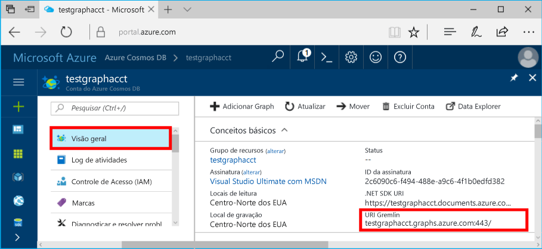
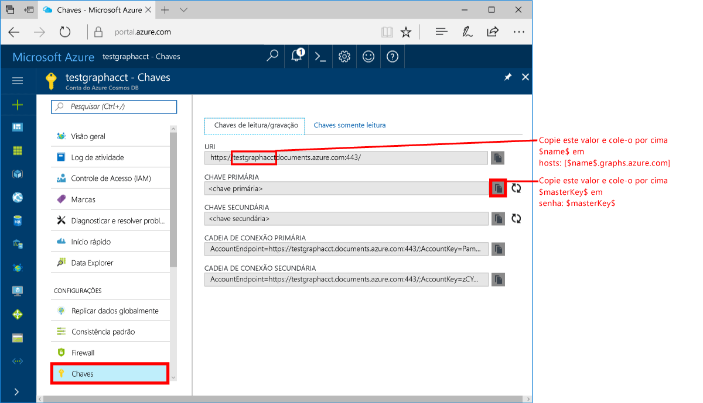
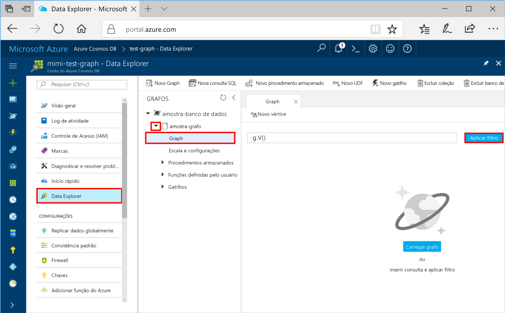
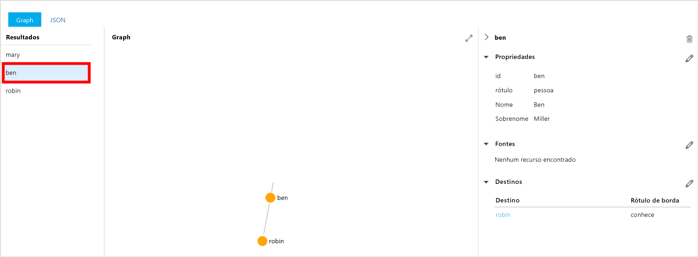
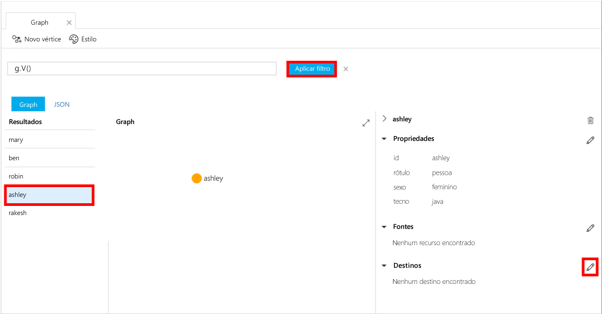
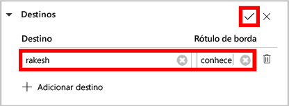
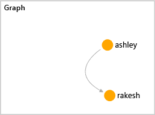

# <a name="azure-cosmos-db-create-a-graph-database-using-java-and-hello-azure-portal"></a>Banco de dados do Azure do Cosmos: Criar um banco de dados do gráfico usando Java e Olá portal do Azure

O BD Cosmos do Azure é o serviço multimodelo de banco de dados distribuído globalmente da Microsoft. Você pode criar e consultar documentos, chave/valor e bancos de dados do gráfico, que se beneficiar de distribuição global hello e recursos de escala horizontal no núcleo de saudação do banco de dados do Azure Cosmos rapidamente. 

Este guia de início rápido cria um gráfico de banco de dados usando Olá ferramentas portais do Azure para o banco de dados do Azure Cosmos. Este guia de início rápido também mostra como tooquickly criar um aplicativo de console de Java usando um banco de dados do gráfico usando Olá OSS [Gremlin Java](https://mvnrepository.com/artifact/org.apache.tinkerpop/gremlin-driver) driver. instruções Olá este guia de início rápido podem ser seguidas em qualquer sistema operacional que é capaz de executar Java. Este guia de início rápido familiariza você com a criação e modificação de recursos de gráfico em Olá da interface do usuário ou programaticamente, o que for sua preferência. 

## <a name="prerequisites"></a>Pré-requisitos

* [Java Development Kit (JDK) 1.7 +](http://www.oracle.com/technetwork/java/javase/downloads/jdk8-downloads-2133151.html)
    * No Ubuntu, execute `apt-get install default-jdk` tooinstall Olá JDK.
    * Ser toohello tooset se Olá JAVA_HOME ambiente variável toopoint pasta onde Olá JDK está instalado.
* [Baixar](http://maven.apache.org/download.cgi) e [instalar](http://maven.apache.org/install.html) um armazenamento binário [Maven](http://maven.apache.org/)
    * No Ubuntu, você pode executar `apt-get install maven` tooinstall Maven.
* [Git](https://www.git-scm.com/)
    * No Ubuntu, você pode executar `sudo apt-get install git` tooinstall Git.

[!INCLUDE [quickstarts-free-trial-note](../../includes/quickstarts-free-trial-note.md)]

## <a name="create-a-database-account"></a>Criar uma conta de banco de dados

Antes de criar um banco de dados do gráfico, você precisa toocreate uma conta de banco de dados Gremlin (gráfico) com o banco de dados do Azure Cosmos.

[!INCLUDE [cosmos-db-create-dbaccount-graph](../../includes/cosmos-db-create-dbaccount-graph.md)]

## <a name="add-a-graph"></a>Adicionar um gráfico

Agora você pode usar a ferramenta de Gerenciador de dados de saudação em Olá toocreate portal do Azure um banco de dados do gráfico. 

1. No hello portal do Azure, no menu de navegação à esquerda do hello, clique em **Gerenciador de dados (visualização)**. 
2. Em Olá **Gerenciador de dados (visualização)** folha, clique em **novo gráfico**, em seguida, preencha a página hello usando Olá informações a seguir:

    

    Configuração|Valor sugerido|Descrição
    ---|---|---
    ID do banco de dados|banco de dados de exemplo|ID de saudação do novo banco de dados. Os nomes de banco de dados devem ter entre um e 255 caracteres e não podem conter `/ \ # ?` nem espaços à direita.
    ID do Gráfico|gráfico de exemplo|ID de saudação para seu novo gráfico. Nomes de gráfico tem Olá mesmo caractere requisitos como ids de banco de dados.
    Capacidade de Armazenamento| 10 GB|Deixe o valor padrão de saudação. Isso é a capacidade de armazenamento de saudação do banco de dados de saudação.
    Taxa de transferência|400 RUs|Deixe o valor padrão de saudação. Você pode dimensionar a taxa de transferência hello mais tarde se você quiser tooreduce latência.
    Chave de partição|Deixar em branco|Para finalidade Olá este guia de início rápido, chave de partição Olá deixe em branco.

3. Depois de preencher o formulário Olá, clique em **Okey**.

## <a name="clone-hello-sample-application"></a>Clonar um aplicativo de exemplo hello

Agora vamos, clonar um aplicativo gráfico do github, defina a cadeia de caracteres de conexão hello e executá-lo. Você verá como é fácil toowork com dados programaticamente. 

1. Abra uma janela de terminal de git, como git bash, e `cd` tooa diretório de trabalho.  

2. Execute Olá repositório de exemplo do comando tooclone Olá a seguir. 

    ```bash
    git clone https://github.com/Azure-Samples/azure-cosmos-db-graph-java-getting-started.git
    ```

## <a name="review-hello-code"></a>Examine o código de saudação

Vamos fazer uma rápida revisão do que está acontecendo no aplicativo hello. Olá abrir `Program.java` arquivo da pasta de \src\GetStarted hello e encontrar essas linhas de código. 

* Olá Gremlin `Client` é inicializada de configuração de saudação no `src/remote.yaml`.

    ```java
    cluster = Cluster.build(new File("src/remote.yaml")).create();
    ...
    client = cluster.connect();
    ```

* Uma série de etapas de Gremlin são executadas usando Olá `client.submit` método.

    ```java
    ResultSet results = client.submit(gremlin);

    CompletableFuture<List<Result>> completableFutureResults = results.all();
    List<Result> resultList = completableFutureResults.get();

    for (Result result : resultList) {
        System.out.println(result.toString());
    }
    ```

## <a name="update-your-connection-string"></a>Atualizar sua cadeia de conexão

1. Arquivo de src/remote.yaml Olá aberto. 

3. Preencha o *hosts*, *username*, e *senha* valores no arquivo de src/remote.yaml hello. rest Olá das configurações de saudação não é necessário toobe alterado.

    Configuração|Valor sugerido|Descrição
    ---|---|---
    Hosts|[***.graphs.azure.com]|Consulte a captura de tela de saudação após esta tabela. Esse valor é Olá Gremlin URI na página de visão geral de saudação do hello portal do Azure, entre colchetes, com hello à direita: 443 / removido.<br><br>Esse valor também pode ser recuperado do guia de chaves hello, usando o valor URI Olá removendo https://, alterando toographs documentos e remoção de saudação à direita: 443 /.
    Nome de Usuário|/dbs/sample-database/colls/sample-graph|Olá recursos do formulário de saudação `/dbs/<db>/colls/<coll>` onde `<db>` é o nome do banco de dados existente e `<coll>` é o nome de coleção existente.
    Senha|*Sua chave mestra principal*|Consulte a captura de tela segundo Olá após esta tabela. Esse valor é a chave primária, o que você pode recuperar da página de chaves de saudação do hello portal do Azure, na caixa de chave primária de saudação. Copie o valor de saudação usando o botão de cópia de Olá Olá direita da caixa de saudação.

    Valor de Hosts hello, copie Olá **Gremlin URI** valor da saudação **visão geral** página. Se ela estiver vazia, consulte as instruções de saudação em linha Hosts Olá Olá anterior tabela sobre a criação de saudação Gremlin URI da folha de chaves de saudação.


    Olá valor da senha, copiar Olá **chave primária** de saudação **chaves** folha: 

## <a name="run-hello-console-app"></a>Execute o aplicativo de console Olá

1. Na janela do terminal Olá git, `cd` pasta azure-cosmos-db-graph-java-getting-started toohello.

2. Na janela do terminal Olá git, digite `mvn package` tooinstall Olá necessário pacotes Java.

3. Na janela do terminal Olá git, execute `mvn exec:java -D exec.mainClass=GetStarted.Program` no hello janela do terminal toostart seu aplicativo Java.

janela do terminal Olá exibe vértices hello está sendo adicionados toohello gráfico. Após a conclusão do programa hello, alterne back toohello portal do Azure no seu navegador da internet. 

<a id="add-sample-data"></a>
## <a name="review-and-add-sample-data"></a>Revisar e adicionar dados de exemplo

Agora você pode voltar tooData Explorer e consulte vértices Olá adicionado toohello gráfico e adicionar pontos de dados adicionais.

1. No Explorador de dados, expanda Olá **banco de dados de exemplo**/**exemplo de gráfico**, clique em **gráfico**e, em seguida, clique em **Aplicar filtro**. 

   

2. Em Olá **resultados** lista, observe a saudação novos usuários adicionados toohello gráfico. Selecione **ben** e observe que ele se conectou toorobin. Mover os vértices Olá no Gerenciador de gráficos hello, ampliar e reduzir e expandir Olá tamanho da superfície do hello graph explorer. 

   

3. Vamos adicionar alguns novo gráfico de usuários toohello usando Olá Explorador de dados. Clique em Olá **novo vértice** gráfico do botão tooadd dados tooyour.

   

4. Digite um rótulo de *pessoa* , em seguida, digite Olá seguir as chaves e valores toocreate Olá primeiro vértice no gráfico de saudação. Observe que você pode criar propriedades exclusivas para cada pessoa no gráfico. Chave de id de saudação só é necessária.

    chave|valor|Observações
    ----|----|----
    ID|ashley|Identificador exclusivo do Hello vértice hello. Se você não especificar uma ID, ela será gerada para você.
    gender|feminino| 
    técnico | java | 

    > [!NOTE]
    > Neste início rápido, criamos uma coleção não particionada. No entanto, se você criar uma coleção particionada com a especificação de uma chave de partição durante a criação de coleção de saudação, em seguida, você precisa tooinclude Olá partição chave como uma chave em cada novo vértice. 

5. Clique em **OK**. Talvez seja necessário tooexpand toosee sua tela **Okey** na parte inferior de saudação da tela hello.

6. Clique em **Novo Vértice** novamente e acrescente um novo usuário. Digite um rótulo de *pessoa* digite Olá seguinte chaves e valores:

    chave|valor|Observações
    ----|----|----
    ID|rakesh|Identificador exclusivo do Hello vértice hello. Se você não especificar uma ID, ela será gerada para você.
    gender|masculino| 
    escola|MIT| 

7. Clique em **OK**. 

8. Clique em **Aplicar filtro** com padrão de saudação `g.V()` filtro. Todos os usuários Olá mostram em Olá **resultados** lista. Conforme você adiciona mais dados, você pode usar filtros toolimit seus resultados. Por padrão, o Gerenciador de dados usa `g.V()` tooretrieve todos os vértices em um gráfico, mas você podem alterar esse tooa diferente [consulta graph](tutorial-query-graph.md), como `g.V().count()`, tooreturn uma contagem de todos os vértices de saudação no gráfico de saudação no formato JSON.

9. Agora, podemos conectar rakesh e ashley. Certifique-se de **Carlos** em selecionado na Olá **resultados** lista, clique botão de edição Olá Avançar muito**destinos** no lado inferior direito. Talvez seja necessário toowiden Olá de toosee sua janela **propriedades** área.

   

10. Em Olá **destino** caixa tipo *rakesh*e em Olá **rótulo de borda** caixa tipo *sabe*e, em seguida, clique em caixa de seleção de saudação.

   

11. Agora selecione **rakesh** na lista de resultados de saudação e veja se Carlos e rakesh estão conectados. 

   

    Você também pode usar procedimentos de toocreate armazenado no Explorador de dados, UDFs e lógica de negócios do lado do servidor de tooperform de gatilhos, bem como a taxa de transferência de escala. No Explorador de dados expõe todos acesso a dados através de programação interno Olá disponível no hello APIs, mas fornece acesso fácil tooyour dados em Olá portal do Azure.


## <a name="review-slas-in-hello-azure-portal"></a>Examine os SLAs em Olá portal do Azure

[!INCLUDE [cosmosdb-tutorial-review-slas](../../includes/cosmos-db-tutorial-review-slas.md)]

## <a name="clean-up-resources"></a>Limpar recursos

Se você não vai toocontinue toouse este aplicativo, exclua todos os recursos criados por este guia de início rápido Olá portal do Azure com hello etapas a seguir: 

1. No menu esquerdo de saudação do hello portal do Azure, clique em **grupos de recursos** e clique em nome de saudação do recurso de saudação criado por você. 
2. Na sua página de grupo de recursos, clique em **excluir**, digite o nome de saudação do hello recurso toodelete na caixa de texto de saudação e, em seguida, clique em **excluir**.

## <a name="next-steps"></a>Próximas etapas

Este guia de início rápido, você aprendeu como toocreate uma conta de banco de dados do Azure Cosmos, criar um gráfico usando Olá Explorador de dados e executar o aplicativo. Agora, você pode criar consultas mais complexas e implementar uma lógica de passagem de gráfico avançada usando o Gremlin. 

> [!div class="nextstepaction"]
> [Consultar usando o Gremlin](tutorial-query-graph.md)

