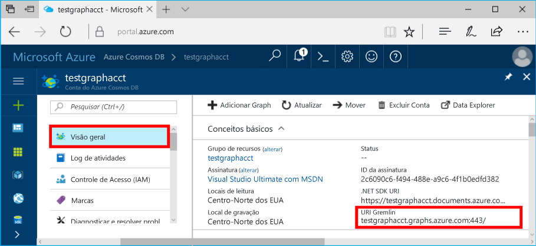

# <a name="azure-cosmos-db-build-a-nodejs-application-by-using-graph-api"></a><span data-ttu-id="ccc6b-103">Azure Cosmos DB: Compilar um aplicativo Node.js usando a API do Graph</span><span class="sxs-lookup"><span data-stu-id="ccc6b-103">Azure Cosmos DB: Build a Node.js application by using Graph API</span></span>

<span data-ttu-id="ccc6b-104">O Azure Cosmos DB é o serviço de banco de dados multimodelo da Microsoft e é distribuído globalmente.</span><span class="sxs-lookup"><span data-stu-id="ccc6b-104">Azure Cosmos DB is the globally distributed multi-model database service from Microsoft.</span></span> <span data-ttu-id="ccc6b-105">É possível criar e consultar rapidamente documentos, chave/valor e bancos de dados do gráfico. Todos se beneficiam de recursos de escala horizontal e distribuição global no núcleo do Azure Cosmos DB.</span><span class="sxs-lookup"><span data-stu-id="ccc6b-105">You can quickly create and query document, key/value, and graph databases, all of which benefit from the global distribution and horizontal scale capabilities at the core of Azure Cosmos DB.</span></span> 

<span data-ttu-id="ccc6b-106">Este artigo de início rápido demonstra como criar uma conta do Azure Cosmos DB para a API do Graph (versão prévia), um banco de dados e um gráfico usando o portal do Azure.</span><span class="sxs-lookup"><span data-stu-id="ccc6b-106">This quick-start article demonstrates how to create an Azure Cosmos DB account for Graph API (preview), database, and graph by using the Azure portal.</span></span> <span data-ttu-id="ccc6b-107">Em seguida, você compila e executa um aplicativo de console usando o driver [Gremlin Node.js](https://www.npmjs.com/package/gremlin-secure) de software livre.</span><span class="sxs-lookup"><span data-stu-id="ccc6b-107">You then build and run a console app by using the open-source [Gremlin Node.js](https://www.npmjs.com/package/gremlin-secure) driver.</span></span>  

> [!NOTE]
> <span data-ttu-id="ccc6b-108">O módulo npm `gremlin-secure` é uma versão modificada do `gremlin` módulo, com suporte para SSL e SASL necessários para se conectar com Azure Cosmos DB.</span><span class="sxs-lookup"><span data-stu-id="ccc6b-108">The npm module `gremlin-secure` is a modified version of `gremlin` module, with support for SSL and SASL required for connecting with Azure Cosmos DB.</span></span> <span data-ttu-id="ccc6b-109">O código-fonte está disponível no [GitHub](https://github.com/CosmosDB/gremlin-javascript).</span><span class="sxs-lookup"><span data-stu-id="ccc6b-109">Source code is available on [GitHub](https://github.com/CosmosDB/gremlin-javascript).</span></span>
>

## <a name="prerequisites"></a><span data-ttu-id="ccc6b-110">Pré-requisitos</span><span class="sxs-lookup"><span data-stu-id="ccc6b-110">Prerequisites</span></span>

<span data-ttu-id="ccc6b-111">Antes que possa executar esta amostra, você deverá ter os seguintes pré-requisitos:</span><span class="sxs-lookup"><span data-stu-id="ccc6b-111">Before you can run this sample, you must have the following prerequisites:</span></span>
* <span data-ttu-id="ccc6b-112">[Node.js](https://nodejs.org/en/) versão v0.10.29 ou posterior</span><span class="sxs-lookup"><span data-stu-id="ccc6b-112">[Node.js](https://nodejs.org/en/) version v0.10.29 or later</span></span>
* [<span data-ttu-id="ccc6b-113">Git</span><span class="sxs-lookup"><span data-stu-id="ccc6b-113">Git</span></span>](http://git-scm.com/)

[!INCLUDE [quickstarts-free-trial-note](../../includes/quickstarts-free-trial-note.md)]

## <a name="create-a-database-account"></a><span data-ttu-id="ccc6b-114">Crie uma conta de banco de dados</span><span class="sxs-lookup"><span data-stu-id="ccc6b-114">Create a database account</span></span>

[!INCLUDE [cosmos-db-create-dbaccount-graph](../../includes/cosmos-db-create-dbaccount-graph.md)]

## <a name="add-a-graph"></a><span data-ttu-id="ccc6b-115">Adicionar um gráfico</span><span class="sxs-lookup"><span data-stu-id="ccc6b-115">Add a graph</span></span>

[!INCLUDE [cosmos-db-create-graph](../../includes/cosmos-db-create-graph.md)]

## <a name="clone-the-sample-application"></a><span data-ttu-id="ccc6b-116">Clonar o aplicativo de exemplo</span><span class="sxs-lookup"><span data-stu-id="ccc6b-116">Clone the sample application</span></span>

<span data-ttu-id="ccc6b-117">Agora, clonaremos um aplicativo de API do Graph do GitHub, definiremos a cadeia de conexão e o executaremos.</span><span class="sxs-lookup"><span data-stu-id="ccc6b-117">Now let's clone a Graph API app from GitHub, set the connection string, and run it.</span></span> <span data-ttu-id="ccc6b-118">Você verá como é fácil trabalhar usando dados de forma programática.</span><span class="sxs-lookup"><span data-stu-id="ccc6b-118">You'll see how easy it is to work with data programmatically.</span></span> 

1. <span data-ttu-id="ccc6b-119">Abra uma janela de terminal do Git, tal como um Git Bash e altere (por meio do comando `cd`) para um diretório de trabalho.</span><span class="sxs-lookup"><span data-stu-id="ccc6b-119">Open a Git terminal window, such as Git Bash, and change (via `cd` command) to a working directory.</span></span>  

2. <span data-ttu-id="ccc6b-120">Execute o comando a seguir para clonar o repositório de exemplo.</span><span class="sxs-lookup"><span data-stu-id="ccc6b-120">Run the following command to clone the sample repository.</span></span> 

    ```bash
    git clone https://github.com/Azure-Samples/azure-cosmos-db-graph-nodejs-getting-started.git
    ```

3. <span data-ttu-id="ccc6b-121">Abra o arquivo da solução no Visual Studio.</span><span class="sxs-lookup"><span data-stu-id="ccc6b-121">Open the solution file in Visual Studio.</span></span> 

## <a name="review-the-code"></a><span data-ttu-id="ccc6b-122">Examine o código</span><span class="sxs-lookup"><span data-stu-id="ccc6b-122">Review the code</span></span>

<span data-ttu-id="ccc6b-123">Façamos uma rápida revisão do que está acontecendo no aplicativo.</span><span class="sxs-lookup"><span data-stu-id="ccc6b-123">Let's make a quick review of what's happening in the app.</span></span> <span data-ttu-id="ccc6b-124">Abra o arquivo `app.js` e você descobrirá que as linhas de código a seguir.</span><span class="sxs-lookup"><span data-stu-id="ccc6b-124">Open the `app.js` file, and you'll find the following lines of code.</span></span> 

* <span data-ttu-id="ccc6b-125">O cliente Gremlin é criado.</span><span class="sxs-lookup"><span data-stu-id="ccc6b-125">The Gremlin client is created.</span></span>

    ```nodejs
    const client = Gremlin.createClient(
        443, 
        config.endpoint, 
        { 
            "session": false, 
            "ssl": true, 
            "user": `/dbs/${config.database}/colls/${config.collection}`,
            "password": config.primaryKey
        });
    ```

  <span data-ttu-id="ccc6b-126">Todas as configurações estão em `config.js` e podem ser editadas na seção Editar a seguir.</span><span class="sxs-lookup"><span data-stu-id="ccc6b-126">The configurations are all in `config.js`, which we edit in the following section.</span></span>

* <span data-ttu-id="ccc6b-127">Uma série de etapas do Gremlin são executadas usando o método `client.execute`.</span><span class="sxs-lookup"><span data-stu-id="ccc6b-127">A series of Gremlin steps are executed with the `client.execute` method.</span></span>

    ```nodejs
    console.log('Running Count'); 
    client.execute("g.V().count()", { }, (err, results) => {
        if (err) return console.error(err);
        console.log(JSON.stringify(results));
        console.log();
    });
    ```

## <a name="update-your-connection-string"></a><span data-ttu-id="ccc6b-128">Atualizar sua cadeia de conexão</span><span class="sxs-lookup"><span data-stu-id="ccc6b-128">Update your connection string</span></span>

1. <span data-ttu-id="ccc6b-129">Abra o arquivo config.js.</span><span class="sxs-lookup"><span data-stu-id="ccc6b-129">Open the config.js file.</span></span> 

2. <span data-ttu-id="ccc6b-130">Em config.js, preencha a chave config.endpoint com o valor **Gremlin URI** na página do portal do Azure **Visão geral**.</span><span class="sxs-lookup"><span data-stu-id="ccc6b-130">In config.js, fill in the config.endpoint key with the **Gremlin URI** value from the **Overview** page of the Azure portal.</span></span> 

    `config.endpoint = "GRAPHENDPOINT";`

    

   <span data-ttu-id="ccc6b-132">Se o valor **Gremlin URI** estiver em branco, você pode gerar o valor da página **Chaves** no portal, usando o valor da **URI**, removendo https:// e alterando os documentos para gráficos.</span><span class="sxs-lookup"><span data-stu-id="ccc6b-132">If the **Gremlin URI** value is blank, you can generate the value from the **Keys** page in the portal, using the **URI** value, removing https://, and changing documents to graphs.</span></span>

   <span data-ttu-id="ccc6b-133">O ponto de extremidade do Gremlin deve ser apenas o nome de host sem número de porta do protocolo como `mygraphdb.graphs.azure.com` (não `https://mygraphdb.graphs.azure.com` ou `mygraphdb.graphs.azure.com:433`).</span><span class="sxs-lookup"><span data-stu-id="ccc6b-133">The Gremlin endpoint must be only the host name without the protocol/port number, like `mygraphdb.graphs.azure.com` (not `https://mygraphdb.graphs.azure.com` or `mygraphdb.graphs.azure.com:433`).</span></span>

3. <span data-ttu-id="ccc6b-134">Em config.js, preencha o valor config.primaryKey com o valor **Chave primária** na página do portal do Azure **Chaves**.</span><span class="sxs-lookup"><span data-stu-id="ccc6b-134">In config.js, fill in the config.primaryKey value in with the **Primary Key** value from the **Keys** page of the Azure portal.</span></span> 

    `config.primaryKey = "PRIMARYKEY";`

   

4. <span data-ttu-id="ccc6b-136">Insira o nome do banco de dados e o nome do gráfico (contêiner) para o valor de config.database e config.collection.</span><span class="sxs-lookup"><span data-stu-id="ccc6b-136">Enter the database name, and graph (container) name for the value of config.database and config.collection.</span></span> 

<span data-ttu-id="ccc6b-137">Aqui está um exemplo da aparência seu arquivo config.js concluído:</span><span class="sxs-lookup"><span data-stu-id="ccc6b-137">Here is an example of what your completed config.js file should look like:</span></span>

```nodejs
var config = {}

// Note that this must not have HTTPS or the port number
config.endpoint = "testgraphacct.graphs.azure.com";
config.primaryKey = "Pams6e7LEUS7LJ2Qk0fjZf3eGo65JdMWHmyn65i52w8ozPX2oxY3iP0yu05t9v1WymAHNcMwPIqNAEv3XDFsEg==";
config.database = "graphdb"
config.collection = "Persons"

module.exports = config;
```

## <a name="run-the-console-app"></a><span data-ttu-id="ccc6b-138">Execute o aplicativo de console</span><span class="sxs-lookup"><span data-stu-id="ccc6b-138">Run the console app</span></span>

1. <span data-ttu-id="ccc6b-139">Abra uma janela de terminal e mude (por meio do comando `cd`) para um diretório de instalação para o arquivo package.json incluído no projeto.</span><span class="sxs-lookup"><span data-stu-id="ccc6b-139">Open a terminal window and change (via `cd` command) to the installation directory for the package.json file that's included in the project.</span></span>  

2. <span data-ttu-id="ccc6b-140">Executar `npm install` para instalar os módulos npm necessários, incluindo `gremlin-secure`.</span><span class="sxs-lookup"><span data-stu-id="ccc6b-140">Run `npm install` to install the required npm modules, including `gremlin-secure`.</span></span>

3. <span data-ttu-id="ccc6b-141">Execute `node app.js` em um terminal para iniciar o aplicativo de nó.</span><span class="sxs-lookup"><span data-stu-id="ccc6b-141">Run `node app.js` in a terminal to start your node application.</span></span>

## <a name="browse-with-data-explorer"></a><span data-ttu-id="ccc6b-142">Procurar com o Data Explorer</span><span class="sxs-lookup"><span data-stu-id="ccc6b-142">Browse with Data Explorer</span></span>

<span data-ttu-id="ccc6b-143">Agora você pode voltar ao Data Explorer no Portal do Azure e exibir, consultar, modificar e trabalhar com seus novos dados gráficos.</span><span class="sxs-lookup"><span data-stu-id="ccc6b-143">You can now go back to Data Explorer in the Azure portal to view, query, modify, and work with your new graph data.</span></span>

<span data-ttu-id="ccc6b-144">No Data Explorer, o novo banco de dados aparece no painel **Gráficos**.</span><span class="sxs-lookup"><span data-stu-id="ccc6b-144">In Data Explorer, the new database appears in the **Graphs** pane.</span></span> <span data-ttu-id="ccc6b-145">Expanda o banco de dados, seguido pela coleção e clique em **Gráfico**.</span><span class="sxs-lookup"><span data-stu-id="ccc6b-145">Expand the database, followed by the collection, then click **Graph**.</span></span>

<span data-ttu-id="ccc6b-146">Os dados gerados pelo aplicativo de exemplo são exibidos no próximo painel dentro da guia **Gráfico** quando você clica em **Aplicar Filtro**.</span><span class="sxs-lookup"><span data-stu-id="ccc6b-146">The data generated by the sample app is displayed in the next pane within the **Graph** tab when you click **Apply Filter**.</span></span>

<span data-ttu-id="ccc6b-147">Tente preencher `g.V()` com `.has('firstName', 'Thomas')` para testar o filtro.</span><span class="sxs-lookup"><span data-stu-id="ccc6b-147">Try completing `g.V()` with `.has('firstName', 'Thomas')` to test the filter.</span></span> <span data-ttu-id="ccc6b-148">Observe que o valor diferencia maiúsculas de minúsculas.</span><span class="sxs-lookup"><span data-stu-id="ccc6b-148">Do note that the value is case sensitive.</span></span>

## <a name="review-slas-in-the-azure-portal"></a><span data-ttu-id="ccc6b-149">Examinar SLAs no Portal do Azure</span><span class="sxs-lookup"><span data-stu-id="ccc6b-149">Review SLAs in the Azure portal</span></span>

[!INCLUDE [cosmosdb-tutorial-review-slas](../../includes/cosmos-db-tutorial-review-slas.md)]

## <a name="clean-up-your-resources"></a><span data-ttu-id="ccc6b-150">Limpar seus recursos</span><span class="sxs-lookup"><span data-stu-id="ccc6b-150">Clean up your resources</span></span>

<span data-ttu-id="ccc6b-151">Se você não planeja continuar usando este aplicativo, exclua todos os recursos criados neste artigo fazendo o seguinte:</span><span class="sxs-lookup"><span data-stu-id="ccc6b-151">If you do not plan to continue using this app, delete all resources that you created in this article by doing the following:</span></span> 

1. <span data-ttu-id="ccc6b-152">No portal do Azure, no menu de navegação à esquerda, clique em **Grupos de recursos** e depois clique no nome do recurso criado.</span><span class="sxs-lookup"><span data-stu-id="ccc6b-152">In the Azure portal, on the left navigation menu, click **Resource groups**, and then click the name of the resource that you created.</span></span> 
2. <span data-ttu-id="ccc6b-153">Em sua página de grupo de recursos, clique em **Excluir**, digite o nome do recurso a ser excluído e depois clique em **Excluir**.</span><span class="sxs-lookup"><span data-stu-id="ccc6b-153">On your resource group page, click **Delete**, type the name of the resource to be deleted, and then click **Delete**.</span></span>

## <a name="next-steps"></a><span data-ttu-id="ccc6b-154">Próximas etapas</span><span class="sxs-lookup"><span data-stu-id="ccc6b-154">Next steps</span></span>

<span data-ttu-id="ccc6b-155">Neste artigo, você aprendeu como criar uma conta do Azure Cosmos DB, como criar um gráfico usando o Data Explorer e como executar um aplicativo.</span><span class="sxs-lookup"><span data-stu-id="ccc6b-155">In this article, you've learned how to create an Azure Cosmos DB account, create a graph by using Data Explorer, and run an app.</span></span> <span data-ttu-id="ccc6b-156">Agora, você pode criar consultas mais complexas e implementar uma lógica de passagem de gráfico avançada usando o Gremlin.</span><span class="sxs-lookup"><span data-stu-id="ccc6b-156">You can now build more complex queries and implement powerful graph traversal logic by using Gremlin.</span></span> 

> [!div class="nextstepaction"]
> [<span data-ttu-id="ccc6b-157">Consultar usando o Gremlin</span><span class="sxs-lookup"><span data-stu-id="ccc6b-157">Query using Gremlin</span></span>](tutorial-query-graph.md)
