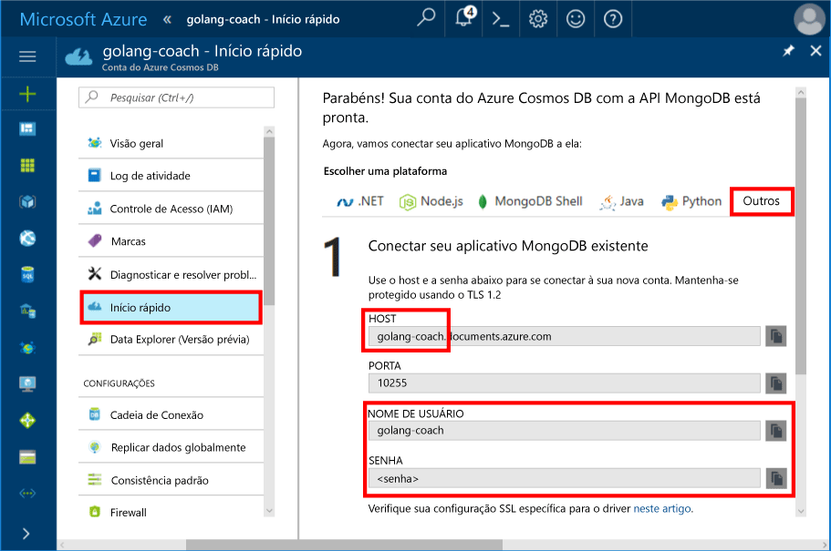
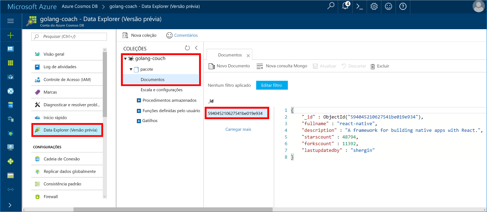

# <a name="azure-cosmos-db-build-a-mongodb-api-console-app-with-golang-and-hello-azure-portal"></a>Banco de dados do Azure do Cosmos: Criar um aplicativo de console do MongoDB API com Golang e Olá portal do Azure

O BD Cosmos do Azure é o serviço multimodelo de banco de dados distribuído globalmente da Microsoft. Você pode criar e consultar documentos, chave/valor e bancos de dados do gráfico, que se beneficiar de distribuição global hello e recursos de escala horizontal no núcleo de saudação do banco de dados do Azure Cosmos rapidamente.

Esse início rápido demonstra como toouse existente [MongoDB](https://docs.microsoft.com/en-us/azure/cosmos-db/mongodb-introduction) aplicativo escrito em [Golang](https://golang.org/) e conectá-lo tooyour Azure Cosmos banco de dados, que oferece suporte a conexões de cliente do MongoDB.

Em outras palavras, o aplicativo Golang só sabe que ele está se conectando tooa banco de dados usando APIs do MongoDB. Isso é transparente toohello aplicativo hello dados é armazenado no banco de dados do Azure Cosmos.

## <a name="prerequisites"></a>Pré-requisitos

- Uma assinatura do Azure. Se você não tiver uma assinatura do Azure, crie uma [conta gratuita](https://azure.microsoft.com/free) antes de começar.
- [Vá](https://golang.org/dl/) e um conhecimento básico de saudação [vá](https://golang.org/) idioma.
- Um IDE — [Gogland](https://www.jetbrains.com/go/) da Jetbrains, [Visual Studio Code](https://code.visualstudio.com/) ou [Atom](https://atom.io/). Neste tutorial, estou usando Goglang.

<a id="create-account"></a>
## <a name="create-a-database-account"></a>Criar uma conta de banco de dados

[!INCLUDE [cosmos-db-create-dbaccount](../../includes/cosmos-db-create-dbaccount-mongodb.md)]

## <a name="clone-hello-sample-application"></a>Clonar um aplicativo de exemplo hello

Clonar o aplicativo de exemplo hello e instalar pacotes de saudação necessário.

1. Crie uma pasta chamada CosmosDBSample Olá GOROOT\src pasta, que é C:\Go\ por padrão.
2. Execute hello usando uma janela do terminal de git, como o repositório do git bash tooclone Olá exemplo na pasta de CosmosDBSample de saudação do comando a seguir. 

    ```bash
    git clone https://github.com/Azure-Samples/azure-cosmos-db-mongodb-golang-getting-started.git
    ```
3.  Olá executar pacote do comando tooget Olá mgo a seguir. 

    ```
    go get gopkg.in/mgo.v2
    ```

Olá [mgo](http://labix.org/mgo) driver (pronunciado como *mango*) é um [MongoDB](http://www.mongodb.org/) driver para Olá [ir idioma](http://golang.org/) que implementa um conjunto avançado e bem testado seleção de recursos em uma API muito simple de linguagens de Go padrão a seguir.

<a id="connection-string"></a>

## <a name="update-your-connection-string"></a>Atualizar sua cadeia de conexão

Agora volte toohello tooget portal do Azure suas informações de cadeia de caracteres de conexão e copie-o em um aplicativo hello.

1. Clique em **início rápido** Olá menu de navegação à esquerda e, em seguida, clique em **outros** informações da cadeia de conexão Olá tooview exigidas pelo Olá aplicativo Go.

2. Em Goglang, abra o arquivo de main.go de saudação no diretório de GOROOT\CosmosDBSample hello e atualize Olá linhas seguintes do código usando informações da cadeia de conexão Olá da saudação portal do Azure, conforme mostrado no hello captura de tela a seguir. 

    nome do banco de dados de saudação é o prefixo de saudação do hello **Host** valor no painel de cadeia de caracteres de conexão de portal do Azure hello. Para a conta de Olá mostrada na imagem de saudação abaixo, o nome do banco de dados de saudação é treinador golang.

    ```go
    Database: "hello prefix of hello Host value in hello Azure portal",
    Username: "hello Username in hello Azure portal",
    Password: "hello Password in hello Azure portal",
    ```

    

3. Salve o arquivo de main.go hello.

## <a name="review-hello-code"></a>Examine o código de saudação

Vamos fazer uma rápida revisão do que está acontecendo no arquivo de main.go hello. 

### <a name="connecting-hello-go-app-tooazure-cosmos-db"></a>Conectando Olá Go aplicativo tooAzure Cosmos DB

Banco de dados do Azure Cosmos dá suporte a saudação MongoDB SSL habilitado. tooconnect tooan MongoDB habilitado para SSL, você precisa Olá toodefine **DialServer** funcionar em [mgo. DialInfo](http://gopkg.in/mgo.v2#DialInfo)e fazer uso de saudação [tls. *Discagem* ](http://golang.org/pkg/crypto/tls#Dial) tooperform conexão de saudação de função.

Olá Golang trecho de código a seguir se conecta a saudação Go aplicativo com a API do Azure Cosmos DB MongoDB. Olá *DialInfo* classe contém opções para estabelecer uma sessão com um cluster do MongoDB.

```go
// DialInfo holds options for establishing a session with a MongoDB cluster.
dialInfo := &mgo.DialInfo{
    Addrs:    []string{"golang-couch.documents.azure.com:10255"}, // Get HOST + PORT
    Timeout:  60 * time.Second,
    Database: "database", // It can be anything
    Username: "username", // Username
    Password: "Azure database connect password from Azure Portal", // PASSWORD
    DialServer: func(addr *mgo.ServerAddr) (net.Conn, error) {
        return tls.Dial("tcp", addr.String(), &tls.Config{})
    },
}

// Create a session which maintains a pool of socket connections
// tooour Azure Cosmos DB MongoDB database.
session, err := mgo.DialWithInfo(dialInfo)

if err != nil {
    fmt.Printf("Can't connect toomongo, go error %v\n", err)
    os.Exit(1)
}

defer session.Close()

// SetSafe changes hello session safety mode.
// If hello safe parameter is nil, hello session is put in unsafe mode, 
// and writes become fire-and-forget,
// without error checking. hello unsafe mode is faster since operations won't hold on waiting for a confirmation.
// 
session.SetSafe(&mgo.Safe{})
```

Olá **mgo. Dial()** método é usado quando não houver nenhuma conexão SSL. Para uma conexão SSL, Olá **mgo. DialWithInfo()** método é necessário.

Uma instância do hello **{DialWIthInfo}** é objeto de sessão Olá toocreate usado. Quando a sessão de saudação é estabelecida, você pode acessar a coleção de hello usando Olá trecho de código a seguir:

```go
collection := session.DB(“database”).C(“package”)
```

<a id="create-document"></a>

### <a name="create-a-document"></a>Criar um documento

```go
// Model
type Package struct {
    Id bson.ObjectId  `bson:"_id,omitempty"`
    FullName      string
    Description   string
    StarsCount    int
    ForksCount    int
    LastUpdatedBy string
}

// insert Document in collection
err = collection.Insert(&Package{
    FullName:"react",
    Description:"A framework for building native apps with React.",
    ForksCount: 11392,
    StarsCount:48794,
    LastUpdatedBy:"shergin",

})

if err != nil {
    log.Fatal("Problem inserting data: ", err)
    return
}
```

### <a name="query-or-read-a-document"></a>Consultar ou ler um documento

O Azure Cosmos DB dá suporte a consultas avançadas de documentos JSON armazenados em cada coleção. Olá código exemplo a seguir mostra uma consulta que você pode executar em documentos de saudação em sua coleção.

```go
// Get a Document from hello collection
result := Package{}
err = collection.Find(bson.M{"fullname": "react"}).One(&result)
if err != nil {
    log.Fatal("Error finding record: ", err)
    return
}

fmt.Println("Description:", result.Description)
```


### <a name="update-a-document"></a>Atualizar um documento

```go
// Update a document
updateQuery := bson.M{"_id": result.Id}
change := bson.M{"$set": bson.M{"fullname": "react-native"}}
err = collection.Update(updateQuery, change)
if err != nil {
    log.Fatal("Error updating record: ", err)
    return
}
```

### <a name="delete-a-document"></a>Excluir um documento

O Azure Cosmos DB dá suporte à exclusão de documentos JSON.

```go
// Delete a document
query := bson.M{"_id": result.Id}
err = collection.Remove(query)
if err != nil {
   log.Fatal("Error deleting record: ", err)
   return
}
```
    
## <a name="run-hello-app"></a>Executar o aplicativo hello

1. Em Goglang, certifique-se de que seu GOPATH (disponível em **arquivo**, **configurações**, **vá**, **GOPATH**) incluem local Olá no qual Olá gopkg foi instalado, que é USERPROFILE\go por padrão. 
2. Comentar as linhas de saudação excluir documento hello, linhas 91-96, para que você pode ver o documento hello após o aplicativo hello em execução.
3. No Goglang, clique em **Executar**e em **Run 'Build main.go and run'**.

    aplicativo Hello termina e exibe a descrição Olá Olá documento criado no [criar um documento](#create-document).
    
    ```
    Description: A framework for building native apps with React.
    
    Process finished with exit code 0
    ```

    
    
## <a name="review-your-document-in-data-explorer"></a>Revisar o documento no Data Explorer

Volte toohello toosee portal do Azure seu documento no Explorador de dados.

1. Clique em **Gerenciador de dados (visualização)** no menu de navegação à esquerda do hello, expanda **golang treinador**, **pacote**e, em seguida, clique em **documentos**. Em Olá **documentos** , clique em Olá \_documento de saudação toodisplay id no painel direito da saudação. 

    
    
2. Você pode trabalhar com hello documento embutido e clique em **atualização** toosave-lo. Você também pode excluir o documento de saudação ou criar novos documentos ou consultas.

## <a name="review-slas-in-hello-azure-portal"></a>Examine os SLAs em Olá portal do Azure

[!INCLUDE [cosmosdb-tutorial-review-slas](../../includes/cosmos-db-tutorial-review-slas.md)]

## <a name="clean-up-resources"></a>Limpar recursos

Se você não vai toocontinue toouse este aplicativo, exclua todos os recursos criados por este guia de início rápido Olá portal do Azure com hello etapas a seguir:

1. No menu esquerdo de saudação do hello portal do Azure, clique em **grupos de recursos** e clique em nome de saudação do recurso de saudação criado por você. 
2. Na sua página de grupo de recursos, clique em **excluir**, digite o nome de saudação do hello recurso toodelete na caixa de texto de saudação e, em seguida, clique em **excluir**.

## <a name="next-steps"></a>Próximas etapas

Este guia de início rápido, você aprendeu como toocreate uma conta de banco de dados do Azure Cosmos e executar um aplicativo Golang usando Olá API para o MongoDB. Agora você pode importar a conta de banco de dados do Cosmos tooyour dados adicionais. 

> [!div class="nextstepaction"]
> [Importe dados para o banco de dados do Azure Cosmos para Olá MongoDB API](mongodb-migrate.md)
