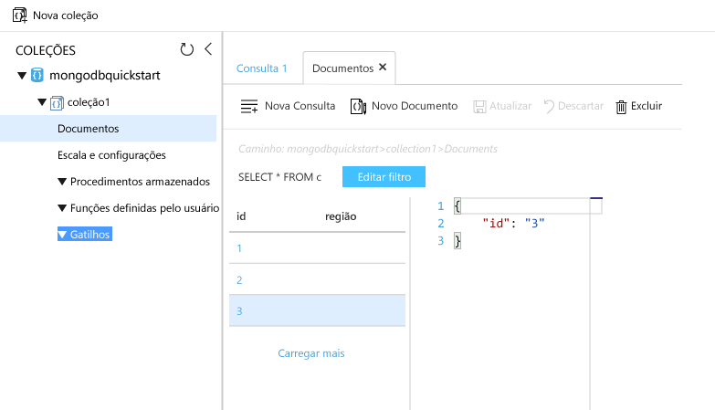

# <a name="azure-cosmos-db-migrate-an-existing-nodejs-mongodb-web-app"></a><span data-ttu-id="d6c8f-103">BD Cosmos do Azure: migrar um aplicativo Web MongoDB do Node.js existente</span><span class="sxs-lookup"><span data-stu-id="d6c8f-103">Azure Cosmos DB: Migrate an existing Node.js MongoDB web app</span></span> 

<span data-ttu-id="d6c8f-104">O BD Cosmos do Azure é o serviço multimodelo de banco de dados distribuído globalmente da Microsoft.</span><span class="sxs-lookup"><span data-stu-id="d6c8f-104">Azure Cosmos DB is Microsoft’s globally distributed multi-model database service.</span></span> <span data-ttu-id="d6c8f-105">Você pode criar e consultar documentos, chave/valor e bancos de dados do gráfico, que se beneficiar de distribuição global hello e recursos de escala horizontal no núcleo de saudação do banco de dados do Azure Cosmos rapidamente.</span><span class="sxs-lookup"><span data-stu-id="d6c8f-105">You can quickly create and query document, key/value, and graph databases, all of which benefit from hello global distribution and horizontal scale capabilities at hello core of Azure Cosmos DB.</span></span> 

<span data-ttu-id="d6c8f-106">Este guia de início rápido demonstra como toouse existente [MongoDB](mongodb-introduction.md) aplicativos escritos em Node. js e conectá-lo tooyour Azure Cosmos banco de dados, que oferece suporte a conexões de cliente do MongoDB.</span><span class="sxs-lookup"><span data-stu-id="d6c8f-106">This quickstart demonstrates how toouse an existing [MongoDB](mongodb-introduction.md) app written in Node.js and connect it tooyour Azure Cosmos DB database, which supports MongoDB client connections.</span></span> <span data-ttu-id="d6c8f-107">Em outras palavras, o aplicativo Node. js só sabe que ele está se conectando tooa banco de dados usando APIs do MongoDB.</span><span class="sxs-lookup"><span data-stu-id="d6c8f-107">In other words, your Node.js application only knows that it's connecting tooa database using MongoDB APIs.</span></span> <span data-ttu-id="d6c8f-108">Isso é transparente toohello aplicativo hello dados é armazenado no banco de dados do Azure Cosmos.</span><span class="sxs-lookup"><span data-stu-id="d6c8f-108">It is transparent toohello application that hello data is stored in Azure Cosmos DB.</span></span>

<span data-ttu-id="d6c8f-109">Quando terminar, você terá um aplicativo MEAN (MongoDB, Express, AngularJS e Node.js) executando no [BD Cosmos do Azure](https://azure.microsoft.com/services/cosmos-db/).</span><span class="sxs-lookup"><span data-stu-id="d6c8f-109">When you are done, you will have a MEAN application (MongoDB, Express, AngularJS, and Node.js) running on [Azure Cosmos DB](https://azure.microsoft.com/services/cosmos-db/).</span></span> 


[!INCLUDE [cloud-shell-try-it](../../includes/cloud-shell-try-it.md)]

<span data-ttu-id="d6c8f-111">Se você escolher tooinstall e usa o hello CLI localmente, este tópico requer que você está executando a versão do CLI do Azure Olá 2.0 ou posterior.</span><span class="sxs-lookup"><span data-stu-id="d6c8f-111">If you choose tooinstall and use hello CLI locally, this topic requires that you are running hello Azure CLI version 2.0 or later.</span></span> <span data-ttu-id="d6c8f-112">Executar `az --version` toofind versão de saudação.</span><span class="sxs-lookup"><span data-stu-id="d6c8f-112">Run `az --version` toofind hello version.</span></span> <span data-ttu-id="d6c8f-113">Se você precisar tooinstall ou atualização, consulte [instalar o Azure CLI 2.0]( /cli/azure/install-azure-cli).</span><span class="sxs-lookup"><span data-stu-id="d6c8f-113">If you need tooinstall or upgrade, see [Install Azure CLI 2.0]( /cli/azure/install-azure-cli).</span></span> 

## <a name="prerequisites"></a><span data-ttu-id="d6c8f-114">Pré-requisitos</span><span class="sxs-lookup"><span data-stu-id="d6c8f-114">Prerequisites</span></span> 
<span data-ttu-id="d6c8f-115">Além disso tooAzure CLI, você precisa [Node.js](https://nodejs.org/) e [Git](http://www.git-scm.com/downloads) instalado localmente toorun `npm` e `git` comandos.</span><span class="sxs-lookup"><span data-stu-id="d6c8f-115">In addition tooAzure CLI, you need [Node.js](https://nodejs.org/) and [Git](http://www.git-scm.com/downloads) installed locally toorun `npm` and `git` commands.</span></span>

<span data-ttu-id="d6c8f-116">Você deve ter conhecimento prático de Node.js.</span><span class="sxs-lookup"><span data-stu-id="d6c8f-116">You should have working knowledge of Node.js.</span></span> <span data-ttu-id="d6c8f-117">Este guia de início rápido não é pretendido toohelp você com o desenvolvimento de aplicativos do Node.js em geral.</span><span class="sxs-lookup"><span data-stu-id="d6c8f-117">This quickstart is not intended toohelp you with developing Node.js applications in general.</span></span>

## <a name="clone-hello-sample-application"></a><span data-ttu-id="d6c8f-118">Clonar um aplicativo de exemplo hello</span><span class="sxs-lookup"><span data-stu-id="d6c8f-118">Clone hello sample application</span></span>

<span data-ttu-id="d6c8f-119">Abra uma janela de terminal de git, como git bash, e `cd` tooa diretório de trabalho.</span><span class="sxs-lookup"><span data-stu-id="d6c8f-119">Open a git terminal window, such as git bash, and `cd` tooa working directory.</span></span>  

<span data-ttu-id="d6c8f-120">Execute Olá repositório de exemplo de saudação do tooclone comandos a seguir.</span><span class="sxs-lookup"><span data-stu-id="d6c8f-120">Run hello following commands tooclone hello sample repository.</span></span> <span data-ttu-id="d6c8f-121">Esse repositório de exemplo contém padrão de saudação [MEAN.js](http://meanjs.org/) aplicativo.</span><span class="sxs-lookup"><span data-stu-id="d6c8f-121">This sample repository contains hello default [MEAN.js](http://meanjs.org/) application.</span></span> 

```bash
git clone https://github.com/prashanthmadi/mean
```

## <a name="run-hello-application"></a><span data-ttu-id="d6c8f-122">Executar o aplicativo hello</span><span class="sxs-lookup"><span data-stu-id="d6c8f-122">Run hello application</span></span>

<span data-ttu-id="d6c8f-123">Instalar pacotes de saudação necessários e iniciar o aplicativo hello.</span><span class="sxs-lookup"><span data-stu-id="d6c8f-123">Install hello required packages and start hello application.</span></span>

```bash
cd mean
npm install
npm start
```

## <a name="log-in-tooazure"></a><span data-ttu-id="d6c8f-124">Faça logon no tooAzure</span><span class="sxs-lookup"><span data-stu-id="d6c8f-124">Log in tooAzure</span></span>

<span data-ttu-id="d6c8f-125">Se você estiver usando um CLI do Azure instalado, faça logon em tooyour assinatura do Azure com hello [logon az](/cli/azure/#login) de comando e siga o hello instruções na tela.</span><span class="sxs-lookup"><span data-stu-id="d6c8f-125">If you are using an installed Azure CLI, log in tooyour Azure subscription with hello [az login](/cli/azure/#login) command and follow hello on-screen directions.</span></span> <span data-ttu-id="d6c8f-126">Você pode ignorar esta etapa se você estiver usando Olá Shell de nuvem do Azure.</span><span class="sxs-lookup"><span data-stu-id="d6c8f-126">You can skip this step if you're using hello Azure Cloud Shell.</span></span>

```azurecli
az login 
``` 
   
## <a name="add-hello-azure-cosmos-db-module"></a><span data-ttu-id="d6c8f-127">Adicionar módulo de banco de dados do Azure Cosmos Olá</span><span class="sxs-lookup"><span data-stu-id="d6c8f-127">Add hello Azure Cosmos DB module</span></span>

<span data-ttu-id="d6c8f-128">Se você estiver usando um CLI do Azure instalado, verifique toosee se hello `cosmosdb` componente já está instalado executando Olá `az` comando.</span><span class="sxs-lookup"><span data-stu-id="d6c8f-128">If you are using an installed Azure CLI, check toosee if hello `cosmosdb` component is already installed by running hello `az` command.</span></span> <span data-ttu-id="d6c8f-129">Se `cosmosdb` é no Olá a lista de comandos de base, continuar toohello próximo comando.</span><span class="sxs-lookup"><span data-stu-id="d6c8f-129">If `cosmosdb` is in hello list of base commands, proceed toohello next command.</span></span> <span data-ttu-id="d6c8f-130">Você pode ignorar esta etapa se você estiver usando Olá Shell de nuvem do Azure.</span><span class="sxs-lookup"><span data-stu-id="d6c8f-130">You can skip this step if you're using hello Azure Cloud Shell.</span></span>

<span data-ttu-id="d6c8f-131">Se `cosmosdb` não está no Olá a lista de comandos de base, reinstale [Azure CLI 2.0]( /cli/azure/install-azure-cli).</span><span class="sxs-lookup"><span data-stu-id="d6c8f-131">If `cosmosdb` is not in hello list of base commands, reinstall [Azure CLI 2.0]( /cli/azure/install-azure-cli).</span></span>

## <a name="create-a-resource-group"></a><span data-ttu-id="d6c8f-132">Criar um grupo de recursos</span><span class="sxs-lookup"><span data-stu-id="d6c8f-132">Create a resource group</span></span>

<span data-ttu-id="d6c8f-133">Criar um [grupo de recursos](../azure-resource-manager/resource-group-overview.md) com hello [criar grupo az](/cli/azure/group#create).</span><span class="sxs-lookup"><span data-stu-id="d6c8f-133">Create a [resource group](../azure-resource-manager/resource-group-overview.md) with hello [az group create](/cli/azure/group#create).</span></span> <span data-ttu-id="d6c8f-134">Um grupo de recursos do Azure é um contêiner lógico no qual os recursos do Azure, como os aplicativos Web, bancos de dados e contas de armazenamento, são implantados e gerenciados.</span><span class="sxs-lookup"><span data-stu-id="d6c8f-134">An Azure resource group is a logical container into which Azure resources like web apps, databases and storage accounts are deployed and managed.</span></span> 

<span data-ttu-id="d6c8f-135">Olá exemplo a seguir cria um grupo de recursos na região Europa Ocidental de saudação.</span><span class="sxs-lookup"><span data-stu-id="d6c8f-135">hello following example creates a resource group in hello West Europe region.</span></span> <span data-ttu-id="d6c8f-136">Escolha um nome exclusivo para o grupo de recursos de saudação.</span><span class="sxs-lookup"><span data-stu-id="d6c8f-136">Choose a unique name for hello resource group.</span></span>

<span data-ttu-id="d6c8f-137">Se você estiver usando o Shell de nuvem do Azure, clique em **Experimente**, execute toologin de avisos na tela hello e copiar o comando Olá no prompt de comando hello.</span><span class="sxs-lookup"><span data-stu-id="d6c8f-137">If you are using Azure Cloud Shell, click **Try It**, follow hello onscreen prompts toologin, then copy hello command into hello command prompt.</span></span>

```azurecli-interactive
az group create --name myResourceGroup --location "West Europe"
```

## <a name="create-an-azure-cosmos-db-account"></a><span data-ttu-id="d6c8f-138">Criar uma conta do Azure Cosmos DB</span><span class="sxs-lookup"><span data-stu-id="d6c8f-138">Create an Azure Cosmos DB account</span></span>

<span data-ttu-id="d6c8f-139">Criar uma conta de banco de dados do Azure Cosmos com hello [cosmosdb az criar](/cli/azure/cosmosdb#create) comando.</span><span class="sxs-lookup"><span data-stu-id="d6c8f-139">Create an Azure Cosmos DB account with hello [az cosmosdb create](/cli/azure/cosmosdb#create) command.</span></span>

<span data-ttu-id="d6c8f-140">Olá comando, a seguir, substitua seu próprio nome de conta de banco de dados do Azure Cosmos exclusivo onde você pode ver Olá `<cosmosdb-name>` espaço reservado.</span><span class="sxs-lookup"><span data-stu-id="d6c8f-140">In hello following command, please substitute your own unique Azure Cosmos DB account name where you see hello `<cosmosdb-name>` placeholder.</span></span> <span data-ttu-id="d6c8f-141">Esse nome exclusivo será usado como parte de seu ponto de extremidade do banco de dados do Azure Cosmos (`https://<cosmosdb-name>.documents.azure.com/`), portanto, o nome do hello deve toobe exclusivo em todas as contas de banco de dados do Azure Cosmos no Azure.</span><span class="sxs-lookup"><span data-stu-id="d6c8f-141">This unique name will be used as part of your Azure Cosmos DB endpoint (`https://<cosmosdb-name>.documents.azure.com/`), so hello name needs toobe unique across all Azure Cosmos DB accounts in Azure.</span></span> 

```azurecli-interactive
az cosmosdb create --name <cosmosdb-name> --resource-group myResourceGroup --kind MongoDB
```

<span data-ttu-id="d6c8f-142">Olá `--kind MongoDB` parâmetro habilita conexões de cliente do MongoDB.</span><span class="sxs-lookup"><span data-stu-id="d6c8f-142">hello `--kind MongoDB` parameter enables MongoDB client connections.</span></span>

<span data-ttu-id="d6c8f-143">Quando hello Azure Cosmos DB conta é criada, Olá CLI do Azure mostra informações toohello semelhante exemplo a seguir.</span><span class="sxs-lookup"><span data-stu-id="d6c8f-143">When hello Azure Cosmos DB account is created, hello Azure CLI shows information similar toohello following example.</span></span> 

> [!NOTE]
> <span data-ttu-id="d6c8f-144">Este exemplo usa o JSON como formato de saída do hello CLI do Azure, que é o padrão de saudação.</span><span class="sxs-lookup"><span data-stu-id="d6c8f-144">This example uses JSON as hello Azure CLI output format, which is hello default.</span></span> <span data-ttu-id="d6c8f-145">toouse outra saída de formato, consulte [formatos para comandos do Azure 2.0 do CLI de saída](https://docs.microsoft.com/cli/azure/format-output-azure-cli).</span><span class="sxs-lookup"><span data-stu-id="d6c8f-145">toouse another output format, see [Output formats for Azure CLI 2.0 commands](https://docs.microsoft.com/cli/azure/format-output-azure-cli).</span></span>

```json
{
  "databaseAccountOfferType": "Standard",
  "documentEndpoint": "https://<cosmosdb-name>.documents.azure.com:443/",
  "id": "/subscriptions/00000000-0000-0000-0000-000000000000/resourceGroups/myResourceGroup/providers/Microsoft.Document
DB/databaseAccounts/<cosmosdb-name>",
  "kind": "MongoDB",
  "location": "West Europe",
  "name": "<cosmosdb-name>",
  "readLocations": [
    {
      "documentEndpoint": "https://<cosmosdb-name>-westeurope.documents.azure.com:443/",
      "failoverPriority": 0,
      "id": "<cosmosdb-name>-westeurope",
      "locationName": "West Europe",
      "provisioningState": "Succeeded"
    }
  ],
  "resourceGroup": "myResourceGroup",
  "type": "Microsoft.DocumentDB/databaseAccounts",
  "writeLocations": [
    {
      "documentEndpoint": "https://<cosmosdb-name>-westeurope.documents.azure.com:443/",
      "failoverPriority": 0,
      "id": "<cosmosdb-name>-westeurope",
      "locationName": "West Europe",
      "provisioningState": "Succeeded"
    }
  ]
} 
```

## <a name="connect-your-nodejs-application-toohello-database"></a><span data-ttu-id="d6c8f-146">Conecte-se o seu banco de dados de toohello de aplicativo Node. js</span><span class="sxs-lookup"><span data-stu-id="d6c8f-146">Connect your Node.js application toohello database</span></span>

<span data-ttu-id="d6c8f-147">Nesta etapa, você pode se conectar seu MEAN.js exemplo aplicativo tooan banco de dados do Azure Cosmos banco de dados recém-criado, usando uma cadeia de caracteres de conexão do MongoDB.</span><span class="sxs-lookup"><span data-stu-id="d6c8f-147">In this step, you connect your MEAN.js sample application tooan Azure Cosmos DB database you just created, using a MongoDB connection string.</span></span> 

<a name="devconfig"></a>
## <a name="configure-hello-connection-string-in-your-nodejs-application"></a><span data-ttu-id="d6c8f-148">Configurar a cadeia de caracteres de conexão de saudação em seu aplicativo Node. js</span><span class="sxs-lookup"><span data-stu-id="d6c8f-148">Configure hello connection string in your Node.js application</span></span>

<span data-ttu-id="d6c8f-149">No seu repositório MEAN.js abra `config/env/local-development.js`.</span><span class="sxs-lookup"><span data-stu-id="d6c8f-149">In your MEAN.js repository, open `config/env/local-development.js`.</span></span>

<span data-ttu-id="d6c8f-150">Substitua conteúdo desse arquivo hello Olá código a seguir.</span><span class="sxs-lookup"><span data-stu-id="d6c8f-150">Replace hello content of this file with hello following code.</span></span> <span data-ttu-id="d6c8f-151">Certifique-se de que tooalso substituir Olá dois `<cosmosdb-name>` espaços reservados com seu nome de conta do banco de dados do Azure Cosmos.</span><span class="sxs-lookup"><span data-stu-id="d6c8f-151">Be sure tooalso replace hello two `<cosmosdb-name>` placeholders with your Azure Cosmos DB account name.</span></span>

```javascript
'use strict';

module.exports = {
  db: {
    uri: 'mongodb://<cosmosdb-name>:<primary_master_key>@<cosmosdb-name>.documents.azure.com:10255/mean-dev?ssl=true&sslverifycertificate=false'
  }
};
```

## <a name="retrieve-hello-key"></a><span data-ttu-id="d6c8f-152">Recuperar a chave de saudação</span><span class="sxs-lookup"><span data-stu-id="d6c8f-152">Retrieve hello key</span></span>

<span data-ttu-id="d6c8f-153">Em ordem tooconnect tooan Azure Cosmos banco de dados, você precisa de chave de banco de dados de saudação.</span><span class="sxs-lookup"><span data-stu-id="d6c8f-153">In order tooconnect tooan Azure Cosmos DB database, you need hello database key.</span></span> <span data-ttu-id="d6c8f-154">Saudação de uso [chaves de lista az cosmosdb](/cli/azure/cosmosdb#list-keys) chave primária do comando tooretrieve hello.</span><span class="sxs-lookup"><span data-stu-id="d6c8f-154">Use hello [az cosmosdb list-keys](/cli/azure/cosmosdb#list-keys) command tooretrieve hello primary key.</span></span>

```azurecli-interactive
az cosmosdb list-keys --name <cosmosdb-name> --resource-group myResourceGroup --query "primaryMasterKey"
```

<span data-ttu-id="d6c8f-155">Olá CLI do Azure gera informações toohello semelhante exemplo a seguir.</span><span class="sxs-lookup"><span data-stu-id="d6c8f-155">hello Azure CLI outputs information similar toohello following example.</span></span> 

```json
"RUayjYjixJDWG5xTqIiXjC..."
```

<span data-ttu-id="d6c8f-156">Copie o valor de saudação do `primaryMasterKey`.</span><span class="sxs-lookup"><span data-stu-id="d6c8f-156">Copy hello value of `primaryMasterKey`.</span></span> <span data-ttu-id="d6c8f-157">Colar este Olá `<primary_master_key>` em `local-development.js`.</span><span class="sxs-lookup"><span data-stu-id="d6c8f-157">Paste this over hello  `<primary_master_key>` in `local-development.js`.</span></span>

<span data-ttu-id="d6c8f-158">Salve suas alterações.</span><span class="sxs-lookup"><span data-stu-id="d6c8f-158">Save your changes.</span></span>

### <a name="run-hello-application-again"></a><span data-ttu-id="d6c8f-159">Execute o aplicativo hello novamente.</span><span class="sxs-lookup"><span data-stu-id="d6c8f-159">Run hello application again.</span></span>

<span data-ttu-id="d6c8f-160">Execute `npm start` novamente.</span><span class="sxs-lookup"><span data-stu-id="d6c8f-160">Run `npm start` again.</span></span> 

```bash
npm start
```

<span data-ttu-id="d6c8f-161">Uma mensagem de console agora deve informar a que esse ambiente de desenvolvimento hello está em execução.</span><span class="sxs-lookup"><span data-stu-id="d6c8f-161">A console message should now tell you that hello development environment is up and running.</span></span> 

<span data-ttu-id="d6c8f-162">Navegue muito`http://localhost:3000` em um navegador.</span><span class="sxs-lookup"><span data-stu-id="d6c8f-162">Navigate too`http://localhost:3000` in a browser.</span></span> <span data-ttu-id="d6c8f-163">Clique em **inscrever-se** em toocreate superior de menu e tente Olá dois simular usuários.</span><span class="sxs-lookup"><span data-stu-id="d6c8f-163">Click **Sign Up** in hello top menu and try toocreate two dummy users.</span></span> 

<span data-ttu-id="d6c8f-164">Olá MEAN.js aplicativo de exemplo armazena dados de usuário no banco de dados de saudação.</span><span class="sxs-lookup"><span data-stu-id="d6c8f-164">hello MEAN.js sample application stores user data in hello database.</span></span> <span data-ttu-id="d6c8f-165">Se tiver êxito e MEAN.js automaticamente entra no hello criou o usuário, sua conexão de banco de dados do Azure Cosmos está funcionando.</span><span class="sxs-lookup"><span data-stu-id="d6c8f-165">If you are successful and MEAN.js automatically signs into hello created user, then your Azure Cosmos DB connection is working.</span></span> 


## <a name="view-data-in-data-explorer"></a><span data-ttu-id="d6c8f-167">Exibir dados no Data Explorer</span><span class="sxs-lookup"><span data-stu-id="d6c8f-167">View data in Data Explorer</span></span>

<span data-ttu-id="d6c8f-168">Dados armazenados por um banco de dados do Azure Cosmos estão disponível tooview, consulta e execução de lógica de negócios no hello portal do Azure.</span><span class="sxs-lookup"><span data-stu-id="d6c8f-168">Data stored by an Azure Cosmos DB is available tooview, query, and run business-logic on in hello Azure portal.</span></span>

<span data-ttu-id="d6c8f-169">tooview, consultar e trabalhar com dados de usuário Olá criados na etapa anterior de saudação, logon toohello [portal do Azure](https://portal.azure.com) no navegador da web.</span><span class="sxs-lookup"><span data-stu-id="d6c8f-169">tooview, query, and work with hello user data created in hello previous step, login toohello [Azure portal](https://portal.azure.com) in your web browser.</span></span>

<span data-ttu-id="d6c8f-170">Na caixa de pesquisa superior hello, digite o banco de dados do Azure Cosmos.</span><span class="sxs-lookup"><span data-stu-id="d6c8f-170">In hello top Search box, type Azure Cosmos DB.</span></span> <span data-ttu-id="d6c8f-171">Quando a folha de conta do BD Cosmos abrir, selecione sua conta do BD Cosmos.</span><span class="sxs-lookup"><span data-stu-id="d6c8f-171">When your Cosmos DB account blade opens, select your Cosmos DB account.</span></span> <span data-ttu-id="d6c8f-172">Olá barra de navegação esquerda, clique em Gerenciador de dados.</span><span class="sxs-lookup"><span data-stu-id="d6c8f-172">In hello left navigation, click Data Explorer.</span></span> <span data-ttu-id="d6c8f-173">Expanda a coleção no painel de coleções de saudação e, em seguida, você pode exibir documentos Olá Olá conjunto, consultar dados de Olá e até mesmo criar e executar procedimentos armazenados, gatilhos e UDFs.</span><span class="sxs-lookup"><span data-stu-id="d6c8f-173">Expand your collection in hello Collections pane, and then you can view hello documents in hello collection, query hello data, and even create and run stored procedures, triggers, and UDFs.</span></span> 




## <a name="deploy-hello-nodejs-application-tooazure"></a><span data-ttu-id="d6c8f-175">Implantar Olá Node. js aplicativo tooAzure</span><span class="sxs-lookup"><span data-stu-id="d6c8f-175">Deploy hello Node.js application tooAzure</span></span>

<span data-ttu-id="d6c8f-176">Nesta etapa, você deve implantar seu aplicativo de Node. js conectado MongoDB tooAzure Cosmos DB.</span><span class="sxs-lookup"><span data-stu-id="d6c8f-176">In this step, you deploy your MongoDB-connected Node.js application tooAzure Cosmos DB.</span></span>

<span data-ttu-id="d6c8f-177">Você pode ter observado é esse arquivo de configuração de saudação alterado anteriormente para o ambiente de desenvolvimento de saudação (`/config/env/local-development.js`).</span><span class="sxs-lookup"><span data-stu-id="d6c8f-177">You may have noticed that hello configuration file that you changed earlier is for hello development environment (`/config/env/local-development.js`).</span></span> <span data-ttu-id="d6c8f-178">Quando você implanta o serviço de tooApp do aplicativo, ele será executado no ambiente de produção de hello por padrão.</span><span class="sxs-lookup"><span data-stu-id="d6c8f-178">When you deploy your application tooApp Service, it will run in hello production environment by default.</span></span> <span data-ttu-id="d6c8f-179">Agora, você precisa toomake Olá mesmo alterar o arquivo de configuração do respectivos toohello.</span><span class="sxs-lookup"><span data-stu-id="d6c8f-179">So now, you need toomake hello same change toohello respective configuration file.</span></span>

<span data-ttu-id="d6c8f-180">No seu repositório MEAN.js abra `config/env/production.js`.</span><span class="sxs-lookup"><span data-stu-id="d6c8f-180">In your MEAN.js repository, open `config/env/production.js`.</span></span>

<span data-ttu-id="d6c8f-181">Em Olá `db` do objeto, substitua o valor de saudação do `uri` como mostrar em Olá exemplo a seguir.</span><span class="sxs-lookup"><span data-stu-id="d6c8f-181">In hello `db` object, replace hello value of `uri` as show in hello following example.</span></span> <span data-ttu-id="d6c8f-182">Se tooreplace Olá espaços reservados como antes de ser.</span><span class="sxs-lookup"><span data-stu-id="d6c8f-182">Be sure tooreplace hello placeholders as before.</span></span>

```javascript
'mongodb://<cosmosdb-name>:<primary_master_key>@<cosmosdb-name>.documents.azure.com:10255/mean?ssl=true&sslverifycertificate=false',
```

> [!NOTE] 
> <span data-ttu-id="d6c8f-183">Olá `ssl=true` opção é importante porque [SSL requer o banco de dados do Azure Cosmos](connect-mongodb-account.md#connection-string-requirements).</span><span class="sxs-lookup"><span data-stu-id="d6c8f-183">hello `ssl=true` option is important because [Azure Cosmos DB requires SSL](connect-mongodb-account.md#connection-string-requirements).</span></span> 
>
>

<span data-ttu-id="d6c8f-184">Em Olá terminal, confirme todas as alterações no Git.</span><span class="sxs-lookup"><span data-stu-id="d6c8f-184">In hello terminal, commit all your changes into Git.</span></span> <span data-ttu-id="d6c8f-185">Você pode copiar os dois comandos toorun-los juntos.</span><span class="sxs-lookup"><span data-stu-id="d6c8f-185">You can copy both commands toorun them together.</span></span>

```bash
git add .
git commit -m "configured MongoDB connection string"
```
## <a name="clean-up-resources"></a><span data-ttu-id="d6c8f-186">Limpar recursos</span><span class="sxs-lookup"><span data-stu-id="d6c8f-186">Clean up resources</span></span>

<span data-ttu-id="d6c8f-187">Se você não vai toocontinue toouse este aplicativo, exclua todos os recursos criados por este guia de início rápido Olá portal do Azure com hello etapas a seguir:</span><span class="sxs-lookup"><span data-stu-id="d6c8f-187">If you're not going toocontinue toouse this app, delete all resources created by this quickstart in hello Azure portal with hello following steps:</span></span>

1. <span data-ttu-id="d6c8f-188">No menu esquerdo de saudação do hello portal do Azure, clique em **grupos de recursos** e clique em nome de saudação do recurso de saudação criado por você.</span><span class="sxs-lookup"><span data-stu-id="d6c8f-188">From hello left-hand menu in hello Azure portal, click **Resource groups** and then click hello name of hello resource you created.</span></span> 
2. <span data-ttu-id="d6c8f-189">Na sua página de grupo de recursos, clique em **excluir**, digite o nome de saudação do hello recurso toodelete na caixa de texto de saudação e, em seguida, clique em **excluir**.</span><span class="sxs-lookup"><span data-stu-id="d6c8f-189">On your resource group page, click **Delete**, type hello name of hello resource toodelete in hello text box, and then click **Delete**.</span></span>

## <a name="next-steps"></a><span data-ttu-id="d6c8f-190">Próximas etapas</span><span class="sxs-lookup"><span data-stu-id="d6c8f-190">Next steps</span></span>

<span data-ttu-id="d6c8f-191">Este guia de início rápido, você aprendeu como toocreate um banco de dados do Azure Cosmos conta e crie uma coleção do MongoDB usando Olá Explorador de dados.</span><span class="sxs-lookup"><span data-stu-id="d6c8f-191">In this quickstart, you've learned how toocreate an Azure Cosmos DB account and create a MongoDB collection using hello Data Explorer.</span></span> <span data-ttu-id="d6c8f-192">Agora você pode migrar seu dados de MongoDB tooAzure Cosmos DB.</span><span class="sxs-lookup"><span data-stu-id="d6c8f-192">You can now migrate your MongoDB data tooAzure Cosmos DB.</span></span>  

> [!div class="nextstepaction"]
> [<span data-ttu-id="d6c8f-193">Importar dados do MongoDB no BD Cosmos do Azure</span><span class="sxs-lookup"><span data-stu-id="d6c8f-193">Import MongoDB data into Azure Cosmos DB</span></span>](mongodb-migrate.md)
