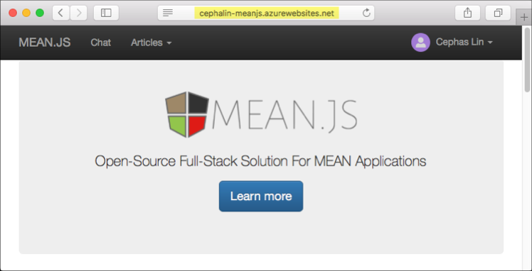

# <a name="azure-cosmos-db-migrate-an-existing-nodejs-mongodb-web-app"></a>BD Cosmos do Azure: migrar um aplicativo Web MongoDB do Node.js existente 

O BD Cosmos do Azure é o serviço multimodelo de banco de dados distribuído globalmente da Microsoft. Você pode criar e consultar documentos, chave/valor e bancos de dados do gráfico, que se beneficiar de distribuição global hello e recursos de escala horizontal no núcleo de saudação do banco de dados do Azure Cosmos rapidamente. 

Este guia de início rápido demonstra como toouse existente [MongoDB](mongodb-introduction.md) aplicativos escritos em Node. js e conectá-lo tooyour Azure Cosmos banco de dados, que oferece suporte a conexões de cliente do MongoDB. Em outras palavras, o aplicativo Node. js só sabe que ele está se conectando tooa banco de dados usando APIs do MongoDB. Isso é transparente toohello aplicativo hello dados é armazenado no banco de dados do Azure Cosmos.

Quando terminar, você terá um aplicativo MEAN (MongoDB, Express, AngularJS e Node.js) executando no [BD Cosmos do Azure](https://azure.microsoft.com/services/cosmos-db/). 




[!INCLUDE [cloud-shell-try-it](../../includes/cloud-shell-try-it.md)]

Se você escolher tooinstall e usa o hello CLI localmente, este tópico requer que você está executando a versão do CLI do Azure Olá 2.0 ou posterior. Executar `az --version` toofind versão de saudação. Se você precisar tooinstall ou atualização, consulte [instalar o Azure CLI 2.0]( /cli/azure/install-azure-cli). 

## <a name="prerequisites"></a>Pré-requisitos 
Além disso tooAzure CLI, você precisa [Node.js](https://nodejs.org/) e [Git](http://www.git-scm.com/downloads) instalado localmente toorun `npm` e `git` comandos.

Você deve ter conhecimento prático de Node.js. Este guia de início rápido não é pretendido toohelp você com o desenvolvimento de aplicativos do Node.js em geral.

## <a name="clone-hello-sample-application"></a>Clonar um aplicativo de exemplo hello

Abra uma janela de terminal de git, como git bash, e `cd` tooa diretório de trabalho.  

Execute Olá repositório de exemplo de saudação do tooclone comandos a seguir. Esse repositório de exemplo contém padrão de saudação [MEAN.js](http://meanjs.org/) aplicativo. 

```bash
git clone https://github.com/prashanthmadi/mean
```

## <a name="run-hello-application"></a>Executar o aplicativo hello

Instalar pacotes de saudação necessários e iniciar o aplicativo hello.

```bash
cd mean
npm install
npm start
```

## <a name="log-in-tooazure"></a>Faça logon no tooAzure

Se você estiver usando um CLI do Azure instalado, faça logon em tooyour assinatura do Azure com hello [logon az](/cli/azure/#login) de comando e siga o hello instruções na tela. Você pode ignorar esta etapa se você estiver usando Olá Shell de nuvem do Azure.

```azurecli
az login 
``` 
   
## <a name="add-hello-azure-cosmos-db-module"></a>Adicionar módulo de banco de dados do Azure Cosmos Olá

Se você estiver usando um CLI do Azure instalado, verifique toosee se hello `cosmosdb` componente já está instalado executando Olá `az` comando. Se `cosmosdb` é no Olá a lista de comandos de base, continuar toohello próximo comando. Você pode ignorar esta etapa se você estiver usando Olá Shell de nuvem do Azure.

Se `cosmosdb` não está no Olá a lista de comandos de base, reinstale [Azure CLI 2.0]( /cli/azure/install-azure-cli).

## <a name="create-a-resource-group"></a>Criar um grupo de recursos

Criar um [grupo de recursos](../azure-resource-manager/resource-group-overview.md) com hello [criar grupo az](/cli/azure/group#create). Um grupo de recursos do Azure é um contêiner lógico no qual os recursos do Azure, como os aplicativos Web, bancos de dados e contas de armazenamento, são implantados e gerenciados. 

Olá exemplo a seguir cria um grupo de recursos na região Europa Ocidental de saudação. Escolha um nome exclusivo para o grupo de recursos de saudação.

Se você estiver usando o Shell de nuvem do Azure, clique em **Experimente**, execute toologin de avisos na tela hello e copiar o comando Olá no prompt de comando hello.

```azurecli-interactive
az group create --name myResourceGroup --location "West Europe"
```

## <a name="create-an-azure-cosmos-db-account"></a>Criar uma conta do Azure Cosmos DB

Criar uma conta de banco de dados do Azure Cosmos com hello [cosmosdb az criar](/cli/azure/cosmosdb#create) comando.

Olá comando, a seguir, substitua seu próprio nome de conta de banco de dados do Azure Cosmos exclusivo onde você pode ver Olá `<cosmosdb-name>` espaço reservado. Esse nome exclusivo será usado como parte de seu ponto de extremidade do banco de dados do Azure Cosmos (`https://<cosmosdb-name>.documents.azure.com/`), portanto, o nome do hello deve toobe exclusivo em todas as contas de banco de dados do Azure Cosmos no Azure. 

```azurecli-interactive
az cosmosdb create --name <cosmosdb-name> --resource-group myResourceGroup --kind MongoDB
```

Olá `--kind MongoDB` parâmetro habilita conexões de cliente do MongoDB.

Quando hello Azure Cosmos DB conta é criada, Olá CLI do Azure mostra informações toohello semelhante exemplo a seguir. 

> [!NOTE]
> Este exemplo usa o JSON como formato de saída do hello CLI do Azure, que é o padrão de saudação. toouse outra saída de formato, consulte [formatos para comandos do Azure 2.0 do CLI de saída](https://docs.microsoft.com/cli/azure/format-output-azure-cli).

```json
{
  "databaseAccountOfferType": "Standard",
  "documentEndpoint": "https://<cosmosdb-name>.documents.azure.com:443/",
  "id": "/subscriptions/00000000-0000-0000-0000-000000000000/resourceGroups/myResourceGroup/providers/Microsoft.Document
DB/databaseAccounts/<cosmosdb-name>",
  "kind": "MongoDB",
  "location": "West Europe",
  "name": "<cosmosdb-name>",
  "readLocations": [
    {
      "documentEndpoint": "https://<cosmosdb-name>-westeurope.documents.azure.com:443/",
      "failoverPriority": 0,
      "id": "<cosmosdb-name>-westeurope",
      "locationName": "West Europe",
      "provisioningState": "Succeeded"
    }
  ],
  "resourceGroup": "myResourceGroup",
  "type": "Microsoft.DocumentDB/databaseAccounts",
  "writeLocations": [
    {
      "documentEndpoint": "https://<cosmosdb-name>-westeurope.documents.azure.com:443/",
      "failoverPriority": 0,
      "id": "<cosmosdb-name>-westeurope",
      "locationName": "West Europe",
      "provisioningState": "Succeeded"
    }
  ]
} 
```

## <a name="connect-your-nodejs-application-toohello-database"></a>Conecte-se o seu banco de dados de toohello de aplicativo Node. js

Nesta etapa, você pode se conectar seu MEAN.js exemplo aplicativo tooan banco de dados do Azure Cosmos banco de dados recém-criado, usando uma cadeia de caracteres de conexão do MongoDB. 

<a name="devconfig"></a>
## <a name="configure-hello-connection-string-in-your-nodejs-application"></a>Configurar a cadeia de caracteres de conexão de saudação em seu aplicativo Node. js

No seu repositório MEAN.js abra `config/env/local-development.js`.

Substitua conteúdo desse arquivo hello Olá código a seguir. Certifique-se de que tooalso substituir Olá dois `<cosmosdb-name>` espaços reservados com seu nome de conta do banco de dados do Azure Cosmos.

```javascript
'use strict';

module.exports = {
  db: {
    uri: 'mongodb://<cosmosdb-name>:<primary_master_key>@<cosmosdb-name>.documents.azure.com:10255/mean-dev?ssl=true&sslverifycertificate=false'
  }
};
```

## <a name="retrieve-hello-key"></a>Recuperar a chave de saudação

Em ordem tooconnect tooan Azure Cosmos banco de dados, você precisa de chave de banco de dados de saudação. Saudação de uso [chaves de lista az cosmosdb](/cli/azure/cosmosdb#list-keys) chave primária do comando tooretrieve hello.

```azurecli-interactive
az cosmosdb list-keys --name <cosmosdb-name> --resource-group myResourceGroup --query "primaryMasterKey"
```

Olá CLI do Azure gera informações toohello semelhante exemplo a seguir. 

```json
"RUayjYjixJDWG5xTqIiXjC..."
```

Copie o valor de saudação do `primaryMasterKey`. Colar este Olá `<primary_master_key>` em `local-development.js`.

Salve suas alterações.

### <a name="run-hello-application-again"></a>Execute o aplicativo hello novamente.

Execute `npm start` novamente. 

```bash
npm start
```

Uma mensagem de console agora deve informar a que esse ambiente de desenvolvimento hello está em execução. 

Navegue muito`http://localhost:3000` em um navegador. Clique em **inscrever-se** em toocreate superior de menu e tente Olá dois simular usuários. 

Olá MEAN.js aplicativo de exemplo armazena dados de usuário no banco de dados de saudação. Se tiver êxito e MEAN.js automaticamente entra no hello criou o usuário, sua conexão de banco de dados do Azure Cosmos está funcionando. 


## <a name="view-data-in-data-explorer"></a>Exibir dados no Data Explorer

Dados armazenados por um banco de dados do Azure Cosmos estão disponível tooview, consulta e execução de lógica de negócios no hello portal do Azure.

tooview, consultar e trabalhar com dados de usuário Olá criados na etapa anterior de saudação, logon toohello [portal do Azure](https://portal.azure.com) no navegador da web.

Na caixa de pesquisa superior hello, digite o banco de dados do Azure Cosmos. Quando a folha de conta do BD Cosmos abrir, selecione sua conta do BD Cosmos. Olá barra de navegação esquerda, clique em Gerenciador de dados. Expanda a coleção no painel de coleções de saudação e, em seguida, você pode exibir documentos Olá Olá conjunto, consultar dados de Olá e até mesmo criar e executar procedimentos armazenados, gatilhos e UDFs. 


## <a name="deploy-hello-nodejs-application-tooazure"></a>Implantar Olá Node. js aplicativo tooAzure

Nesta etapa, você deve implantar seu aplicativo de Node. js conectado MongoDB tooAzure Cosmos DB.

Você pode ter observado é esse arquivo de configuração de saudação alterado anteriormente para o ambiente de desenvolvimento de saudação (`/config/env/local-development.js`). Quando você implanta o serviço de tooApp do aplicativo, ele será executado no ambiente de produção de hello por padrão. Agora, você precisa toomake Olá mesmo alterar o arquivo de configuração do respectivos toohello.

No seu repositório MEAN.js abra `config/env/production.js`.

Em Olá `db` do objeto, substitua o valor de saudação do `uri` como mostrar em Olá exemplo a seguir. Se tooreplace Olá espaços reservados como antes de ser.

```javascript
'mongodb://<cosmosdb-name>:<primary_master_key>@<cosmosdb-name>.documents.azure.com:10255/mean?ssl=true&sslverifycertificate=false',
```

> [!NOTE] 
> Olá `ssl=true` opção é importante porque [SSL requer o banco de dados do Azure Cosmos](connect-mongodb-account.md#connection-string-requirements). 
>
>

Em Olá terminal, confirme todas as alterações no Git. Você pode copiar os dois comandos toorun-los juntos.

```bash
git add .
git commit -m "configured MongoDB connection string"
```
## <a name="clean-up-resources"></a>Limpar recursos

Se você não vai toocontinue toouse este aplicativo, exclua todos os recursos criados por este guia de início rápido Olá portal do Azure com hello etapas a seguir:

1. No menu esquerdo de saudação do hello portal do Azure, clique em **grupos de recursos** e clique em nome de saudação do recurso de saudação criado por você. 
2. Na sua página de grupo de recursos, clique em **excluir**, digite o nome de saudação do hello recurso toodelete na caixa de texto de saudação e, em seguida, clique em **excluir**.

## <a name="next-steps"></a>Próximas etapas

Este guia de início rápido, você aprendeu como toocreate um banco de dados do Azure Cosmos conta e crie uma coleção do MongoDB usando Olá Explorador de dados. Agora você pode migrar seu dados de MongoDB tooAzure Cosmos DB.  

> [!div class="nextstepaction"]
> [Importar dados do MongoDB no BD Cosmos do Azure](mongodb-migrate.md)
