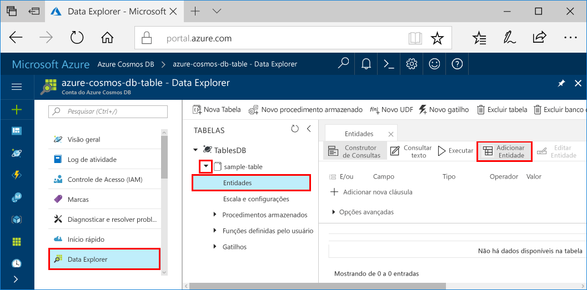

# <a name="azure-cosmos-db-build-a-net-application-using-hello-table-api"></a>Cosmos do Azure DB: Criar um aplicativo .NET usando Olá API de tabela

O BD Cosmos do Azure é o serviço multimodelo de banco de dados distribuído globalmente da Microsoft. Você pode criar e consultar documentos, chave/valor e bancos de dados do gráfico, que se beneficiar de distribuição global hello e recursos de escala horizontal no núcleo de saudação do banco de dados do Azure Cosmos rapidamente. 

Este guia rápido demonstra como toocreate um banco de dados do Azure Cosmos conta e criar uma tabela dentro dessa conta usando Olá portal do Azure. Você usará, em seguida, escrever código tooinsert, atualizar e excluir entidades e execute algumas consultas usando Olá novo [tabela Premium do Windows Azure Storage](https://aka.ms/premiumtablenuget) pacote (visualização) do NuGet. Esta biblioteca tem Olá mesmas classes e assinaturas de método como público Olá [SDK de armazenamento do Windows Azure](https://www.nuget.org/packages/WindowsAzure.Storage), mas também tem contas Olá capacidade tooconnect tooAzure Cosmos DB usando Olá [API tabela](table-introduction.md) (visualização). 

## <a name="prerequisites"></a>Pré-requisitos

Se você ainda não tiver o Visual Studio de 2017 instalado, você pode baixar e usar o hello **livre** [Visual Studio 2017 Community Edition](https://www.visualstudio.com/downloads/). Certifique-se de que você habilite **desenvolvimento do Azure** durante a instalação do Visual Studio hello.

[!INCLUDE [quickstarts-free-trial-note](../../includes/quickstarts-free-trial-note.md)]

## <a name="create-a-database-account"></a>Criar uma conta de banco de dados

[!INCLUDE [cosmos-db-create-dbaccount-table](../../includes/cosmos-db-create-dbaccount-table.md)]

## <a name="add-a-table"></a>Adicionar uma tabela

[!INCLUDE [cosmos-db-create-table](../../includes/cosmos-db-create-table.md)]

## <a name="add-sample-data"></a>Adicionar dados de exemplo

Agora você pode adicionar dados tooyour nova tabela usando o Gerenciador de dados (visualização).

1. No Data Explorer, expanda **sample-table**, clique em **Entidades** e clique em **Adicionar Entidade**.

   
2. Agora adicione caixas de valor do dados toohello PartitionKey e RowKey valor e clique em **Adicionar entidade**.

   
  
    Agora você pode adicionar mais tabela tooyour de entidades, editar suas entidades ou consultar seus dados no Explorador de dados. No Explorador de dados também é onde você pode dimensionar a taxa de transferência e adicionar procedimentos armazenados, funções definidas pelo usuário e tabela de tooyour gatilhos.

## <a name="clone-hello-sample-application"></a>Clonar um aplicativo de exemplo hello

Agora vamos, clonar um aplicativo de tabela do github, defina a cadeia de caracteres de conexão hello e executá-lo. Você verá como é fácil toowork com dados programaticamente. 

1. Abra uma janela de terminal de git, como git bash, e `cd` tooa diretório de trabalho.  

2. Execute Olá repositório de exemplo do comando tooclone Olá a seguir. 

    ```bash
    git clone https://github.com/Azure-Samples/azure-cosmos-db-table-dotnet-getting-started.git
    ```

3. Em seguida, abra o arquivo de solução de saudação no Visual Studio. 

## <a name="review-hello-code"></a>Examine o código de saudação

Vamos fazer uma rápida revisão do que está acontecendo no aplicativo hello. Arquivo Program.cs de saudação aberto e você descobrirá que essas linhas de código criam Olá recursos de banco de dados do Azure Cosmos. 

* Olá CloudTableClient é inicializado.

    ```csharp
    CloudStorageAccount storageAccount = CloudStorageAccount.Parse(connectionString); 
    CloudTableClient tableClient = storageAccount.CreateCloudTableClient();
    ```

* A nova tabela é criada se ainda não existir.

    ```csharp
    CloudTable table = tableClient.GetTableReference("people");
    table.CreateIfNotExists();
    ```

* Um novo contêiner de Tabela é criado. Você observará que essa tooregular muito semelhantes do código SDK de armazenamento de tabela do Azure. 

    ```csharp
    CustomerEntity item = new CustomerEntity()
                {
                    PartitionKey = Guid.NewGuid().ToString(),
                    RowKey = Guid.NewGuid().ToString(),
                    Email = $"{GetRandomString(6)}@contoso.com",
                    PhoneNumber = "425-555-0102",
                    Bio = GetRandomString(1000)
                };
    ```

## <a name="update-your-connection-string"></a>Atualizar sua cadeia de conexão

Agora vamos atualizar informações de cadeia de caracteres de conexão de saudação para que seu aplicativo pode se comunicar tooAzure Cosmos DB. 

1. No Visual Studio, abra o arquivo App. config de saudação. 

2. Em Olá [portal do Azure](http://portal.azure.com/)no hello Azure Cosmos DB esquerda menu de navegação, clique em **cadeia de caracteres de Conexão**. Em seguida, no painel de novo Olá botão Olá cópia para a cadeia de caracteres de conexão de saudação. 

    

3. Cole o valor de saudação no arquivo App. config de saudação como valor de saudação do hello PremiumStorageConnectionString. 

    `<add key="PremiumStorageConnectionString" 
        value="DefaultEndpointsProtocol=https;AccountName=MYSTORAGEACCOUNT;AccountKey=AUTHKEY;TableEndpoint=https://COSMOSDB.documents.azure.com" />`    

    Você pode deixar Olá StandardStorageConnectionString como está.

Agora que você atualizou seu aplicativo com todas as informações de saudação precisa toocommunicate com o banco de dados do Azure Cosmos. 

## <a name="run-hello-web-app"></a>Executar o aplicativo da web de saudação

1. No Visual Studio, clique em Olá **PremiumTableGetStarted** project no **Solution Explorer** e, em seguida, clique em **gerenciar pacotes NuGet**. 

2. Em Olá NuGet **procurar** , digite *windowsazure PremiumTable*.

3. Verificar Olá **incluir pré-lançamento** caixa. 

4. Resultados de hello, instalar Olá **windowsazure PremiumTable** biblioteca. Isso instala a visualização Olá pacote API de tabela de banco de dados do Azure Cosmos, bem como todas as dependências. Observe que se trata de um pacote do NuGet diferente Olá pacote do armazenamento do Windows Azure usado pelo armazenamento de tabela do Azure. 

5. Clique em CTRL + F5 aplicativo hello de toorun.

    janela de console Olá exibe dados de saudação sejam adicionados, recuperado, consultados, substituídos e excluídas da tabela de saudação. Quando Olá script for concluído, pressione qualquer janela de console Olá tooclose chave. 
    
    

6. Se você quiser toosee Olá novas entidades no Explorador de dados, basta comente linhas 188 208 em program.cs para que eles não são excluídos, execute exemplo hello novamente. 

    Você pode agora voltar tooData Explorer, clique em **atualizar**, expanda Olá **pessoas** de tabela e clique em **entidades**e, em seguida, trabalhar com esses novos dados. 

    

## <a name="review-slas-in-hello-azure-portal"></a>Examine os SLAs em Olá portal do Azure

[!INCLUDE [cosmosdb-tutorial-review-slas](../../includes/cosmos-db-tutorial-review-slas.md)]

## <a name="clean-up-resources"></a>Limpar recursos

Se você não vai toocontinue toouse este aplicativo, exclua todos os recursos criados por este guia de início rápido Olá portal do Azure com hello etapas a seguir: 

1. No menu esquerdo de saudação do hello portal do Azure, clique em **grupos de recursos** e clique em nome de saudação do recurso de saudação criado por você. 
2. Na sua página de grupo de recursos, clique em **excluir**, digite o nome de saudação do hello recurso toodelete na caixa de texto de saudação e, em seguida, clique em **excluir**.

## <a name="next-steps"></a>Próximas etapas

Este guia de início rápido, você aprendeu como toocreate uma conta de banco de dados do Azure Cosmos, criar uma tabela usando Olá Explorador de dados e executar o aplicativo.  Agora você pode consultar os dados usando Olá API de tabela.  

> [!div class="nextstepaction"]
> [Consulta usando Olá API de tabela](tutorial-query-table.md)

