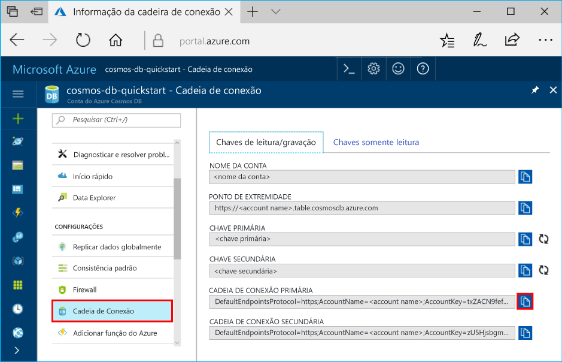

# <a name="quickstart-build-a-table-api-app-with-nodejs-and-azure-cosmos-db"></a>Início rápido: compilar um aplicativo de API de Tabela com Node.js e Azure Cosmos DB

Este guia de início rápido mostra como usar o Node.js e a [API de Tabela](table-introduction.md) do Azure Cosmos DB para compilar um aplicativo clonando um exemplo do GitHub. Este guia de início rápido também mostra como criar uma conta do Azure Cosmos DB e como usar o Data Explorer para criar tabelas e entidades no Portal do Azure baseado na Web.

O BD Cosmos do Azure é o serviço multimodelo de banco de dados distribuído globalmente da Microsoft. É possível criar e consultar rapidamente documentos, chave/valor, coluna larga e bancos de dados do gráfico. Todos se beneficiam de recursos de escala horizontal e distribuição global no núcleo do Azure Cosmos DB. 

## <a name="prerequisites"></a>Pré-requisitos

[!INCLUDE [quickstarts-free-trial-note](../../includes/quickstarts-free-trial-note.md)]
[!INCLUDE [cosmos-db-emulator-docdb-api](../../includes/cosmos-db-emulator-docdb-api.md)]

Além disso:

* [Node.js](https://nodejs.org/en/) versão v0.10.29 ou superior
* [Git](http://git-scm.com/)

## <a name="create-a-database-account"></a>Criar uma conta de banco de dados

> [!IMPORTANT] 
> Você precisa criar uma nova conta de API de tabela para trabalhar com os SDKs de API de tabela disponíveis. Não há suporte para contas de API de tabela criadas durante a versão prévia pelos SDKs disponíveis.
>

[!INCLUDE [cosmos-db-create-dbaccount-table](../../includes/cosmos-db-create-dbaccount-table.md)]

## <a name="add-a-table"></a>Adicionar uma tabela

[!INCLUDE [cosmos-db-create-table](../../includes/cosmos-db-create-table.md)]

## <a name="add-sample-data"></a>Adicionar dados de exemplo

Agora é possível adicionar dados à sua nova tabela usando o Data Explorer.

1. No Data Explorer, expanda **sample-table**, clique em **Entidades** e clique em **Adicionar Entidade**.

   
2. Agora adicione dados às caixas de valor PartitionKey e RowKey e clique em **Adicionar Entidade**.

   
  
    Agora, é possível adicionar mais entidades à tabela, editar as entidades ou consultar os dados no Data Explorer. Por meio do Data Explorer, também é possível dimensionar a taxa de transferência e adicionar procedimentos armazenados, funções definidas pelo usuário e gatilhos à tabela.

## <a name="clone-the-sample-application"></a>Clonar o aplicativo de exemplo

Agora, clonaremos um aplicativo de Tabela do github, definiremos a cadeia de conexão e o executaremos. Você verá como é fácil trabalhar usando dados de forma programática. 

1. Abra uma janela de terminal de git, como git bash, e use o comando `cd` para alterar para uma pasta para instalar o aplicativo de exemplo. 

    ```bash
    cd "C:\git-samples"
    ```

2. Execute o comando a seguir para clonar o repositório de exemplo. Este comando cria uma cópia do aplicativo de exemplo no seu computador. 

    ```bash
    git clone https://github.com/Azure-Samples/storage-table-node-getting-started.git
    ```

## <a name="update-your-connection-string"></a>Atualizar sua cadeia de conexão

Agora, volte ao portal do Azure para obter informações sobre a cadeia de conexão e copiá-las para o aplicativo. Isso permite que seu aplicativo se comunique com o banco de dados hospedado. 

1. No [Portal do Azure](http://portal.azure.com/), clique em **Cadeia de Conexão**. 

    

2. Copie a CADEIA DE CONEXÃO PRIMÁRIA usando o botão de cópia do lado direito.

3. Abra o arquivo app.config e cole o valor em connectionString na linha três. 

    > [!IMPORTANT]
    > Se o ponto de extremidade usa documents.azure.com, isso significa que você tem uma conta de versão prévia, e você precisa criar um [nova conta de API de tabela](#create-a-database-account) para trabalhar com o SDK de API de tabela geralmente disponível.
    >

3. Salve o arquivo app.config.

Agora, você atualizou o aplicativo com todas as informações necessárias para se comunicar com o Azure Cosmos DB. 

## <a name="run-the-app"></a>Execute o aplicativo

1. Na janela do terminal git, `cd` para a pasta storage-table-java-getting-started.

    ```
    cd "C:\git-samples\storage-table-node-getting-started"
    ```

2. Execute o seguinte comando para instalar os módulos azure, [node-uuid], [nconf] e [async] localmente, bem como para salvar uma entrada para eles no arquivo package.json

   ```
   npm install azure-storage node-uuid async nconf --save
   ```

2. Na janela do terminal git, execute os comandos a seguir para executar e iniciar o aplicativo de Nó.

    ```
    node ./tableSample.js 
    ```

    A janela de console exibe os dados da tabela sendo adicionados ao novo banco de dados de tabela no Azure Cosmos DB.

    Agora, é possível voltar ao Data Explorer e ver a consulta, modificar e trabalhar com esses novos dados. 

## <a name="review-slas-in-the-azure-portal"></a>Examinar SLAs no Portal do Azure

[!INCLUDE [cosmosdb-tutorial-review-slas](../../includes/cosmos-db-tutorial-review-slas.md)]

## <a name="clean-up-resources"></a>Limpar recursos

[!INCLUDE [cosmosdb-delete-resource-group](../../includes/cosmos-db-delete-resource-group.md)]

## <a name="next-steps"></a>Próximas etapas

Neste início rápido, você aprendeu como criar uma conta do BD Cosmos do Azure, como criar uma tabela usando o Data Explorer e como executar um aplicativo.  Agora, você pode consultar os dados usando a API de Tabela.  

> [!div class="nextstepaction"]
> [Importar dados de tabela para a API de Tabela](table-import.md)
