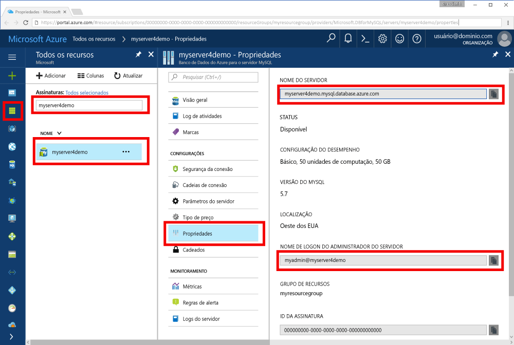

# <a name="azure-database-for-mysql-use-go-language-tooconnect-and-query-data"></a><span data-ttu-id="1ffd4-103">Banco de dados do Azure para MySQL: vá usar linguagem tooconnect e consultar dados</span><span class="sxs-lookup"><span data-stu-id="1ffd4-103">Azure Database for MySQL: Use Go language tooconnect and query data</span></span>
<span data-ttu-id="1ffd4-104">Este guia de início rápido demonstra como tooconnect tooan banco de dados do Azure para MySQL usando código escrito em hello [vá](https://golang.org/) idioma do Windows, Ubuntu Linux e Apple plataformas de macOS.</span><span class="sxs-lookup"><span data-stu-id="1ffd4-104">This quickstart demonstrates how tooconnect tooan Azure Database for MySQL using code written in hello [Go](https://golang.org/) language from Windows, Ubuntu Linux, and Apple macOS platforms.</span></span> <span data-ttu-id="1ffd4-105">Ele mostra como toouse tooquery de instruções SQL, inserir, atualizar e excluir dados no banco de dados de saudação.</span><span class="sxs-lookup"><span data-stu-id="1ffd4-105">It shows how toouse SQL statements tooquery, insert, update, and delete data in hello database.</span></span> <span data-ttu-id="1ffd4-106">Este artigo pressupõe que você esteja familiarizado com o desenvolvimento usando Go, mas que são novos tooworking com o banco de dados do Azure para MySQL.</span><span class="sxs-lookup"><span data-stu-id="1ffd4-106">This article assumes you are familiar with development using Go, but that you are new tooworking with Azure Database for MySQL.</span></span>

## <a name="prerequisites"></a><span data-ttu-id="1ffd4-107">Pré-requisitos</span><span class="sxs-lookup"><span data-stu-id="1ffd4-107">Prerequisites</span></span>
<span data-ttu-id="1ffd4-108">Este guia de início rápido usa recursos de saudação criados em qualquer um desses guias como um ponto de partida:</span><span class="sxs-lookup"><span data-stu-id="1ffd4-108">This quickstart uses hello resources created in either of these guides as a starting point:</span></span>
- [<span data-ttu-id="1ffd4-109">Criar um Banco de Dados do Azure para servidor MySQL usando o portal do Azure</span><span class="sxs-lookup"><span data-stu-id="1ffd4-109">Create an Azure Database for MySQL server using Azure portal</span></span>](./quickstart-create-mysql-server-database-using-azure-portal.md)
- [<span data-ttu-id="1ffd4-110">Criar um Banco de Dados do Azure para servidor MySQL usando a CLI do Azure</span><span class="sxs-lookup"><span data-stu-id="1ffd4-110">Create an Azure Database for MySQL server using Azure CLI</span></span>](./quickstart-create-mysql-server-database-using-azure-cli.md)

## <a name="install-go-and-mysql-connector"></a><span data-ttu-id="1ffd4-111">Instalar o conector MySQL e Go</span><span class="sxs-lookup"><span data-stu-id="1ffd4-111">Install Go and MySQL connector</span></span>
<span data-ttu-id="1ffd4-112">Instalar [vá](https://golang.org/doc/install) e hello [go--driver do sql para MySQL](https://github.com/go-sql-driver/mysql#installation) em seu próprio computador.</span><span class="sxs-lookup"><span data-stu-id="1ffd4-112">Install [Go](https://golang.org/doc/install) and hello [go-sql-driver for MySQL](https://github.com/go-sql-driver/mysql#installation) on your own machine.</span></span> <span data-ttu-id="1ffd4-113">Dependendo de sua plataforma, siga as etapas de saudação:</span><span class="sxs-lookup"><span data-stu-id="1ffd4-113">Depending on your platform, follow hello steps:</span></span>

### <a name="windows"></a><span data-ttu-id="1ffd4-114">Windows</span><span class="sxs-lookup"><span data-stu-id="1ffd4-114">Windows</span></span>
1. <span data-ttu-id="1ffd4-115">[Baixar](https://golang.org/dl/) e instale a ir para o Microsoft Windows de acordo com o toohello [instruções de instalação](https://golang.org/doc/install).</span><span class="sxs-lookup"><span data-stu-id="1ffd4-115">[Download](https://golang.org/dl/) and install Go for Microsoft Windows according toohello [installation instructions](https://golang.org/doc/install).</span></span>
2. <span data-ttu-id="1ffd4-116">Inicie o prompt de comando Olá Olá do menu de início.</span><span class="sxs-lookup"><span data-stu-id="1ffd4-116">Launch hello command prompt from hello start menu.</span></span>
3. <span data-ttu-id="1ffd4-117">Crie uma pasta para o seu projeto, como.</span><span class="sxs-lookup"><span data-stu-id="1ffd4-117">Make a folder for your project such.</span></span> <span data-ttu-id="1ffd4-118">`mkdir  %USERPROFILE%\go\src\mysqlgo`.</span><span class="sxs-lookup"><span data-stu-id="1ffd4-118">`mkdir  %USERPROFILE%\go\src\mysqlgo`.</span></span>
4. <span data-ttu-id="1ffd4-119">Altere o diretório na pasta de projeto hello, como `cd %USERPROFILE%\go\src\mysqlgo`.</span><span class="sxs-lookup"><span data-stu-id="1ffd4-119">Change directory into hello project folder, such as `cd %USERPROFILE%\go\src\mysqlgo`.</span></span>
5. <span data-ttu-id="1ffd4-120">Definir variável de ambiente Olá para o diretório de código de origem do GOPATH toopoint toohello.</span><span class="sxs-lookup"><span data-stu-id="1ffd4-120">Set hello environment variable for GOPATH toopoint toohello source code directory.</span></span> <span data-ttu-id="1ffd4-121">`set GOPATH=%USERPROFILE%\go`.</span><span class="sxs-lookup"><span data-stu-id="1ffd4-121">`set GOPATH=%USERPROFILE%\go`.</span></span>
6. <span data-ttu-id="1ffd4-122">Instalar Olá [go--driver do sql para mysql](https://github.com/go-sql-driver/mysql#installation) executando Olá `go get github.com/go-sql-driver/mysql` comando.</span><span class="sxs-lookup"><span data-stu-id="1ffd4-122">Install hello [go-sql-driver for mysql](https://github.com/go-sql-driver/mysql#installation) by running hello `go get github.com/go-sql-driver/mysql` command.</span></span>

   <span data-ttu-id="1ffd4-123">Em resumo, instalar Go, execute estes comandos no prompt de comando hello:</span><span class="sxs-lookup"><span data-stu-id="1ffd4-123">In summary, install Go, then run these commands in hello command prompt:</span></span>
   ```cmd
   mkdir  %USERPROFILE%\go\src\mysqlgo
   cd %USERPROFILE%\go\src\mysqlgo
   set GOPATH=%USERPROFILE%\go
   go get github.com/go-sql-driver/mysql
   ```

### <a name="linux-ubuntu"></a><span data-ttu-id="1ffd4-124">Linux (Ubuntu)</span><span class="sxs-lookup"><span data-stu-id="1ffd4-124">Linux (Ubuntu)</span></span>
1. <span data-ttu-id="1ffd4-125">Inicie o shell Bash hello.</span><span class="sxs-lookup"><span data-stu-id="1ffd4-125">Launch hello Bash shell.</span></span> 
2. <span data-ttu-id="1ffd4-126">Instale o Go executando `sudo apt-get install golang-go`.</span><span class="sxs-lookup"><span data-stu-id="1ffd4-126">Install Go by running `sudo apt-get install golang-go`.</span></span>
3. <span data-ttu-id="1ffd4-127">Crie uma pasta para o seu projeto em seu diretório inicial, como `mkdir -p ~/go/src/mysqlgo/`.</span><span class="sxs-lookup"><span data-stu-id="1ffd4-127">Make a folder for your project in your home directory, such as `mkdir -p ~/go/src/mysqlgo/`.</span></span>
4. <span data-ttu-id="1ffd4-128">Altere o diretório para pasta hello, como `cd ~/go/src/mysqlgo/`.</span><span class="sxs-lookup"><span data-stu-id="1ffd4-128">Change directory into hello folder, such as `cd ~/go/src/mysqlgo/`.</span></span>
5. <span data-ttu-id="1ffd4-129">Conjunto Olá GOPATH ambiente variável toopoint tooa válido diretório de origem, como a página inicial atual do diretório acesse a pasta.</span><span class="sxs-lookup"><span data-stu-id="1ffd4-129">Set hello GOPATH environment variable toopoint tooa valid source directory, such as your current home directory's go folder.</span></span> <span data-ttu-id="1ffd4-130">No shell bash de hello, execute `export GOPATH=~/go` tooadd Olá vá diretório como hello GOPATH para a sessão atual de shell hello.</span><span class="sxs-lookup"><span data-stu-id="1ffd4-130">At hello bash shell, run `export GOPATH=~/go` tooadd hello go directory as hello GOPATH for hello current shell session.</span></span>
6. <span data-ttu-id="1ffd4-131">Instalar Olá [go--driver do sql para mysql](https://github.com/go-sql-driver/mysql#installation) executando Olá `go get github.com/go-sql-driver/mysql` comando.</span><span class="sxs-lookup"><span data-stu-id="1ffd4-131">Install hello [go-sql-driver for mysql](https://github.com/go-sql-driver/mysql#installation) by running hello `go get github.com/go-sql-driver/mysql` command.</span></span>

   <span data-ttu-id="1ffd4-132">Em resumo, execute estes comandos bash:</span><span class="sxs-lookup"><span data-stu-id="1ffd4-132">In summary, run these bash commands:</span></span>
   ```bash
   sudo apt-get install golang-go
   mkdir -p ~/go/src/mysqlgo/
   cd ~/go/src/mysqlgo/
   export GOPATH=~/go/
   go get github.com/go-sql-driver/mysql
   ```

### <a name="apple-macos"></a><span data-ttu-id="1ffd4-133">Apple macOS</span><span class="sxs-lookup"><span data-stu-id="1ffd4-133">Apple macOS</span></span>
1. <span data-ttu-id="1ffd4-134">Baixe e instale ir de acordo com o toohello [instruções de instalação](https://golang.org/doc/install) sua plataforma de correspondência.</span><span class="sxs-lookup"><span data-stu-id="1ffd4-134">Download and install Go according toohello [installation instructions](https://golang.org/doc/install)  matching your platform.</span></span> 
2. <span data-ttu-id="1ffd4-135">Inicie o shell Bash hello.</span><span class="sxs-lookup"><span data-stu-id="1ffd4-135">Launch hello Bash shell.</span></span> 
3. <span data-ttu-id="1ffd4-136">Crie uma pasta para o seu projeto em seu diretório inicial, como `mkdir -p ~/go/src/mysqlgo/`.</span><span class="sxs-lookup"><span data-stu-id="1ffd4-136">Make a folder for your project in your home directory, such as `mkdir -p ~/go/src/mysqlgo/`.</span></span>
4. <span data-ttu-id="1ffd4-137">Altere o diretório para pasta hello, como `cd ~/go/src/mysqlgo/`.</span><span class="sxs-lookup"><span data-stu-id="1ffd4-137">Change directory into hello folder, such as `cd ~/go/src/mysqlgo/`.</span></span>
5. <span data-ttu-id="1ffd4-138">Conjunto Olá GOPATH ambiente variável toopoint tooa válido diretório de origem, como a página inicial atual do diretório acesse a pasta.</span><span class="sxs-lookup"><span data-stu-id="1ffd4-138">Set hello GOPATH environment variable toopoint tooa valid source directory, such as your current home directory's go folder.</span></span> <span data-ttu-id="1ffd4-139">No shell bash de hello, execute `export GOPATH=~/go` tooadd Olá vá diretório como hello GOPATH para a sessão atual de shell hello.</span><span class="sxs-lookup"><span data-stu-id="1ffd4-139">At hello bash shell, run `export GOPATH=~/go` tooadd hello go directory as hello GOPATH for hello current shell session.</span></span>
6. <span data-ttu-id="1ffd4-140">Instalar Olá [go--driver do sql para mysql](https://github.com/go-sql-driver/mysql#installation) executando Olá `go get github.com/go-sql-driver/mysql` comando.</span><span class="sxs-lookup"><span data-stu-id="1ffd4-140">Install hello [go-sql-driver for mysql](https://github.com/go-sql-driver/mysql#installation) by running hello `go get github.com/go-sql-driver/mysql` command.</span></span>

   <span data-ttu-id="1ffd4-141">Em resumo, instale o Go e, em seguida, execute esses comandos bash:</span><span class="sxs-lookup"><span data-stu-id="1ffd4-141">In summary, install Go, then run these bash commands:</span></span>
   ```bash
   mkdir -p ~/go/src/mysqlgo/
   cd ~/go/src/mysqlgo/
   export GOPATH=~/go/
   go get github.com/go-sql-driver/mysql
   ```

## <a name="get-connection-information"></a><span data-ttu-id="1ffd4-142">Obter informações de conexão</span><span class="sxs-lookup"><span data-stu-id="1ffd4-142">Get connection information</span></span>
<span data-ttu-id="1ffd4-143">Obter Olá conexão informações necessárias tooconnect toohello banco de dados MySQL.</span><span class="sxs-lookup"><span data-stu-id="1ffd4-143">Get hello connection information needed tooconnect toohello Azure Database for MySQL.</span></span> <span data-ttu-id="1ffd4-144">Você precisa Olá credenciais de logon e de nome totalmente qualificado do servidor.</span><span class="sxs-lookup"><span data-stu-id="1ffd4-144">You need hello fully qualified server name and login credentials.</span></span>

1. <span data-ttu-id="1ffd4-145">Faça logon no toohello [portal do Azure](https://portal.azure.com/).</span><span class="sxs-lookup"><span data-stu-id="1ffd4-145">Log in toohello [Azure portal](https://portal.azure.com/).</span></span>
2. <span data-ttu-id="1ffd4-146">No menu esquerdo de saudação no portal do Azure, clique em **todos os recursos** e procure o servidor de saudação você ter creased, como **myserver4demo**.</span><span class="sxs-lookup"><span data-stu-id="1ffd4-146">From hello left-hand menu in Azure portal, click **All resources** and search for hello server you have creased, such as **myserver4demo**.</span></span>
3. <span data-ttu-id="1ffd4-147">Clique em nome do servidor de saudação **myserver4demo**.</span><span class="sxs-lookup"><span data-stu-id="1ffd4-147">Click hello server name **myserver4demo**.</span></span>
4. <span data-ttu-id="1ffd4-148">Servidor de saudação selecione **propriedades** página.</span><span class="sxs-lookup"><span data-stu-id="1ffd4-148">Select hello server's **Properties** page.</span></span> <span data-ttu-id="1ffd4-149">Anote Olá **nome do servidor** e **nome de logon do administrador de servidor**.</span><span class="sxs-lookup"><span data-stu-id="1ffd4-149">Make a note of hello **Server name** and **Server admin login name**.</span></span>
 <span data-ttu-id="1ffd4-150"></span><span class="sxs-lookup"><span data-stu-id="1ffd4-150"></span></span>
5. <span data-ttu-id="1ffd4-151">Se você esquecer suas informações de logon de servidor, navegue toohello **visão geral** página nome de logon de administrador de servidor do tooview hello e, se necessário, Redefinir senha hello.</span><span class="sxs-lookup"><span data-stu-id="1ffd4-151">If you forget your server login information, navigate toohello **Overview** page tooview hello Server admin login name and, if necessary, reset hello password.</span></span>
   

## <a name="build-and-run-go-code"></a><span data-ttu-id="1ffd4-152">Compilar e executar o código Go</span><span class="sxs-lookup"><span data-stu-id="1ffd4-152">Build and run Go code</span></span> 
1. <span data-ttu-id="1ffd4-153">toowrite Golang código, você pode usar um editor de texto simples, como o bloco de notas no Microsoft Windows, [vi](http://manpages.ubuntu.com/manpages/xenial/man1/nvi.1.html#contenttoc5) ou [Nano](https://www.nano-editor.org/) no Ubuntu ou editor de texto no macOS.</span><span class="sxs-lookup"><span data-stu-id="1ffd4-153">toowrite Golang code, you can use a simple text editor, such as Notepad in Microsoft Windows, [vi](http://manpages.ubuntu.com/manpages/xenial/man1/nvi.1.html#contenttoc5) or [Nano](https://www.nano-editor.org/) in Ubuntu, or TextEdit in macOS.</span></span> <span data-ttu-id="1ffd4-154">Se você preferir IDE (Ambiente de Desenvolvimento Integrado) mais avançado, experimente o [Gogland](https://www.jetbrains.com/go/) da Jetbrains, o [Visual Studio Code](https://code.visualstudio.com/) da Microsoft ou o [Atom](https://atom.io/).</span><span class="sxs-lookup"><span data-stu-id="1ffd4-154">If you prefer a richer Interactive Development Environment (IDE) try [Gogland](https://www.jetbrains.com/go/) by Jetbrains, [Visual Studio Code](https://code.visualstudio.com/) by Microsoft, or [Atom](https://atom.io/).</span></span>
2. <span data-ttu-id="1ffd4-155">Colar Olá Go código das seções Olá abaixo em arquivos de texto e salve em sua pasta de projeto com a extensão de arquivo \*vá, como o caminho do Windows `%USERPROFILE%\go\src\mysqlgo\createtable.go` ou caminho do Linux `~/go/src/mysqlgo/createtable.go`.</span><span class="sxs-lookup"><span data-stu-id="1ffd4-155">Paste hello Go code from hello sections below into text files, and save into your project folder with file extension \*.go, such as Windows path `%USERPROFILE%\go\src\mysqlgo\createtable.go` or Linux path `~/go/src/mysqlgo/createtable.go`.</span></span>
3. <span data-ttu-id="1ffd4-156">Localizar Olá `HOST`, `DATABASE`, `USER`, e `PASSWORD` constantes em código hello e substituir valores de exemplo hello com seus próprios valores.</span><span class="sxs-lookup"><span data-stu-id="1ffd4-156">Locate hello `HOST`, `DATABASE`, `USER`, and `PASSWORD` constants in hello code, and replace hello example values with your own values.</span></span> 
4. <span data-ttu-id="1ffd4-157">Inicie o prompt de comando hello ou bash shell.</span><span class="sxs-lookup"><span data-stu-id="1ffd4-157">Launch hello command prompt or bash shell.</span></span> <span data-ttu-id="1ffd4-158">Altere o diretório na pasta do seu projeto.</span><span class="sxs-lookup"><span data-stu-id="1ffd4-158">Change directory into your project folder.</span></span> <span data-ttu-id="1ffd4-159">Por exemplo, no Windows `cd %USERPROFILE%\go\src\mysqlgo\`.</span><span class="sxs-lookup"><span data-stu-id="1ffd4-159">For example, on Windows `cd %USERPROFILE%\go\src\mysqlgo\`.</span></span> <span data-ttu-id="1ffd4-160">No Linux `cd ~/go/src/mysqlgo/`.</span><span class="sxs-lookup"><span data-stu-id="1ffd4-160">On Linux `cd ~/go/src/mysqlgo/`.</span></span>  <span data-ttu-id="1ffd4-161">Alguns editores de IDE Olá mencionados oferecem recursos de depuração e tempo de execução sem a necessidade de comandos do shell.</span><span class="sxs-lookup"><span data-stu-id="1ffd4-161">Some of hello IDE editors mentioned offer debug and runtime capabilities without requiring shell commands.</span></span>
5. <span data-ttu-id="1ffd4-162">Execute o código de saudação digitando o comando Olá `go run createtable.go` toocompile Olá aplicativo e executá-lo.</span><span class="sxs-lookup"><span data-stu-id="1ffd4-162">Run hello code by typing hello command `go run createtable.go` toocompile hello application and run it.</span></span> 
6. <span data-ttu-id="1ffd4-163">Como alternativa, o código de saudação toobuild em um aplicativo nativo, `go build createtable.go`, em seguida, inicie `createtable.exe` aplicativo hello de toorun.</span><span class="sxs-lookup"><span data-stu-id="1ffd4-163">Alternatively, toobuild hello code into a native application, `go build createtable.go`, then launch `createtable.exe` toorun hello application.</span></span>

## <a name="connect-create-table-and-insert-data"></a><span data-ttu-id="1ffd4-164">Conectar-se, criar tabela e inserir dados</span><span class="sxs-lookup"><span data-stu-id="1ffd4-164">Connect, create table, and insert data</span></span>
<span data-ttu-id="1ffd4-165">A seguir use Olá código tooconnect toohello servidor, criar uma tabela e carregar Olá dados usando um **inserir** instrução SQL.</span><span class="sxs-lookup"><span data-stu-id="1ffd4-165">Use hello following code tooconnect toohello server, create a table, and load hello data using an **INSERT** SQL statement.</span></span> 

<span data-ttu-id="1ffd4-166">código Olá importa três pacotes: Olá [pacote sql](https://golang.org/pkg/database/sql/), Olá [driver sql vá para mysql](https://github.com/go-sql-driver/mysql#installation) como toocommunicate um driver com hello banco de dados do Azure para MySQL e hello [fmt pacote](https://golang.org/pkg/fmt/)para impressa de entrada e saída na linha de comando hello.</span><span class="sxs-lookup"><span data-stu-id="1ffd4-166">hello code imports three packages: hello [sql package](https://golang.org/pkg/database/sql/), hello [go sql driver for mysql](https://github.com/go-sql-driver/mysql#installation) as a driver toocommunicate with hello Azure Database for MySQL, and hello [fmt package](https://golang.org/pkg/fmt/) for printed input and output on hello command line.</span></span>

<span data-ttu-id="1ffd4-167">Olá código chamar o método [sql. Open ()](http://go-database-sql.org/accessing.html) tooconnect tooAzure banco de dados MySQL e verificações de saudação conexão usando o método [banco de dados. Ping()](https://golang.org/pkg/database/sql/#DB.Ping).</span><span class="sxs-lookup"><span data-stu-id="1ffd4-167">hello code calls method [sql.Open()](http://go-database-sql.org/accessing.html) tooconnect tooAzure Database for MySQL, and checks hello connection using method [db.Ping()](https://golang.org/pkg/database/sql/#DB.Ping).</span></span> <span data-ttu-id="1ffd4-168">Um [identificador de banco de dados](https://golang.org/pkg/database/sql/#DB) é usado no todo, mantendo o pool de conexão Olá para o servidor de banco de dados de saudação.</span><span class="sxs-lookup"><span data-stu-id="1ffd4-168">A [database handle](https://golang.org/pkg/database/sql/#DB) is used throughout, holding hello connection pool for hello database server.</span></span> <span data-ttu-id="1ffd4-169">saudação de chamadas de código Olá [EXEC ()](https://golang.org/pkg/database/sql/#DB.Exec) método toorun várias vezes vários comandos DDL.</span><span class="sxs-lookup"><span data-stu-id="1ffd4-169">hello code calls hello [Exec()](https://golang.org/pkg/database/sql/#DB.Exec) method several times toorun several DDL commands.</span></span> <span data-ttu-id="1ffd4-170">código Olá também usa Olá [Prepare()](http://go-database-sql.org/prepared.html) e EXEC () toorun preparadas com parâmetros diferentes tooinsert três linhas.</span><span class="sxs-lookup"><span data-stu-id="1ffd4-170">hello code also uses hello [Prepare()](http://go-database-sql.org/prepared.html) and Exec() toorun prepared statements with different parameters tooinsert three rows.</span></span> <span data-ttu-id="1ffd4-171">Cada vez que um método personalizado checkError() é toocheck usado se ocorreu um erro e pane tooexit.</span><span class="sxs-lookup"><span data-stu-id="1ffd4-171">Each time a custom checkError() method is used toocheck if an error occurred and panic tooexit.</span></span>

<span data-ttu-id="1ffd4-172">Substituir saudação `host`, `database`, `user`, e `password` constantes com seus próprios valores.</span><span class="sxs-lookup"><span data-stu-id="1ffd4-172">Replace hello `host`, `database`, `user`, and `password` constants with your own values.</span></span> 

```Go
package main

import (
    "database/sql"
    "fmt"

    _ "github.com/go-sql-driver/mysql"
)

const (
    host     = "myserver4demo.mysql.database.azure.com"
    database = "quickstartdb"
    user     = "myadmin@myserver4demo"
    password = "yourpassword"
)

func checkError(err error) {
    if err != nil {
        panic(err)
    }
}

func main() {

    // Initialize connection string.
    var connectionString = fmt.Sprintf("%s:%s@tcp(%s:3306)/%s?allowNativePasswords=true", user, password, host, database)

    // Initialize connection object.
    db, err := sql.Open("mysql", connectionString)
    checkError(err)
    defer db.Close()

    err = db.Ping()
    checkError(err)
    fmt.Println("Successfully created connection toodatabase.")

    // Drop previous table of same name if one exists.
    _, err = db.Exec("DROP TABLE IF EXISTS inventory;")
    checkError(err)
    fmt.Println("Finished dropping table (if existed).")

    // Create table.
    _, err = db.Exec("CREATE TABLE inventory (id serial PRIMARY KEY, name VARCHAR(50), quantity INTEGER);")
    checkError(err)
    fmt.Println("Finished creating table.")

    // Insert some data into table.
    sqlStatement, err := db.Prepare("INSERT INTO inventory (name, quantity) VALUES (?, ?);")
    res, err := sqlStatement.Exec("banana", 150)
    checkError(err)
    rowCount, err := res.RowsAffected()
    fmt.Printf("Inserted %d row(s) of data.\n", rowCount)

    res, err = sqlStatement.Exec("orange", 154)
    checkError(err)
    rowCount, err = res.RowsAffected()
    fmt.Printf("Inserted %d row(s) of data.\n", rowCount)

    res, err = sqlStatement.Exec("apple", 100)
    checkError(err)
    rowCount, err = res.RowsAffected()
    fmt.Printf("Inserted %d row(s) of data.\n", rowCount)
    fmt.Println("Done.")
}

```

## <a name="read-data"></a><span data-ttu-id="1ffd4-173">Ler dados</span><span class="sxs-lookup"><span data-stu-id="1ffd4-173">Read data</span></span>
<span data-ttu-id="1ffd4-174">A seguir use Olá código tooconnect e ler Olá dados usando um **selecione** instrução SQL.</span><span class="sxs-lookup"><span data-stu-id="1ffd4-174">Use hello following code tooconnect and read hello data using a **SELECT** SQL statement.</span></span> 

<span data-ttu-id="1ffd4-175">código Olá importa três pacotes: Olá [pacote sql](https://golang.org/pkg/database/sql/), Olá [driver sql vá para mysql](https://github.com/go-sql-driver/mysql#installation) como toocommunicate um driver com hello banco de dados do Azure para MySQL e hello [fmt pacote](https://golang.org/pkg/fmt/)para impressa de entrada e saída na linha de comando hello.</span><span class="sxs-lookup"><span data-stu-id="1ffd4-175">hello code imports three packages: hello [sql package](https://golang.org/pkg/database/sql/), hello [go sql driver for mysql](https://github.com/go-sql-driver/mysql#installation) as a driver toocommunicate with hello Azure Database for MySQL, and hello [fmt package](https://golang.org/pkg/fmt/) for printed input and output on hello command line.</span></span>

<span data-ttu-id="1ffd4-176">Olá código chamar o método [sql. Open ()](http://go-database-sql.org/accessing.html) tooconnect tooAzure banco de dados MySQL e verificações de saudação conexão usando o método [banco de dados. Ping()](https://golang.org/pkg/database/sql/#DB.Ping).</span><span class="sxs-lookup"><span data-stu-id="1ffd4-176">hello code calls method [sql.Open()](http://go-database-sql.org/accessing.html) tooconnect tooAzure Database for MySQL, and checks hello connection using method [db.Ping()](https://golang.org/pkg/database/sql/#DB.Ping).</span></span> <span data-ttu-id="1ffd4-177">Um [identificador de banco de dados](https://golang.org/pkg/database/sql/#DB) é usado no todo, mantendo o pool de conexão Olá para o servidor de banco de dados de saudação.</span><span class="sxs-lookup"><span data-stu-id="1ffd4-177">A [database handle](https://golang.org/pkg/database/sql/#DB) is used throughout, holding hello connection pool for hello database server.</span></span> <span data-ttu-id="1ffd4-178">saudação de chamadas de código Olá [Query ()](https://golang.org/pkg/database/sql/#DB.Query) comando select do método toorun hello.</span><span class="sxs-lookup"><span data-stu-id="1ffd4-178">hello code calls hello [Query()](https://golang.org/pkg/database/sql/#DB.Query) method toorun hello select command.</span></span> <span data-ttu-id="1ffd4-179">Em seguida, ele é executado [Next ()](https://golang.org/pkg/database/sql/#Rows.Next) tooiterate por meio do conjunto de resultados de saudação e [Scan()](https://golang.org/pkg/database/sql/#Rows.Scan) valores de coluna Olá tooparse, salvar o valor de saudação em variáveis.</span><span class="sxs-lookup"><span data-stu-id="1ffd4-179">Then it runs [Next()](https://golang.org/pkg/database/sql/#Rows.Next) tooiterate through hello result set and [Scan()](https://golang.org/pkg/database/sql/#Rows.Scan) tooparse hello column values, saving hello value into variables.</span></span> <span data-ttu-id="1ffd4-180">Cada vez que um método personalizado checkError() é toocheck usado se ocorreu um erro e pane tooexit.</span><span class="sxs-lookup"><span data-stu-id="1ffd4-180">Each time a custom checkError() method is used toocheck if an error occurred and panic tooexit.</span></span>

<span data-ttu-id="1ffd4-181">Substituir saudação `host`, `database`, `user`, e `password` constantes com seus próprios valores.</span><span class="sxs-lookup"><span data-stu-id="1ffd4-181">Replace hello `host`, `database`, `user`, and `password` constants with your own values.</span></span> 

```Go
package main

import (
    "database/sql"
    "fmt"

    _ "github.com/go-sql-driver/mysql"
)

const (
    host     = "myserver4demo.mysql.database.azure.com"
    database = "quickstartdb"
    user     = "myadmin@myserver4demo"
    password = "yourpassword"
)

func checkError(err error) {
    if err != nil {
        panic(err)
    }
}

func main() {

    // Initialize connection string.
    var connectionString = fmt.Sprintf("%s:%s@tcp(%s:3306)/%s?allowNativePasswords=true", user, password, host, database)

    // Initialize connection object.
    db, err := sql.Open("mysql", connectionString)
    checkError(err)
    defer db.Close()

    err = db.Ping()
    checkError(err)
    fmt.Println("Successfully created connection toodatabase.")

    // Variables for printing column data when scanned.
    var (
        id       int
        name     string
        quantity int
    )

    // Read some data from hello table.
    rows, err := db.Query("SELECT id, name, quantity from inventory;")
    checkError(err)
    defer rows.Close()
    fmt.Println("Reading data:")
    for rows.Next() {
        err := rows.Scan(&id, &name, &quantity)
        checkError(err)
        fmt.Printf("Data row = (%d, %s, %d)\n", id, name, quantity)
    }
    err = rows.Err()
    checkError(err)
    fmt.Println("Done.")
}
```

## <a name="update-data"></a><span data-ttu-id="1ffd4-182">Atualizar dados</span><span class="sxs-lookup"><span data-stu-id="1ffd4-182">Update data</span></span>
<span data-ttu-id="1ffd4-183">A seguir use Olá tooconnect de código e atualizar Olá dados usando um **atualizar** instrução SQL.</span><span class="sxs-lookup"><span data-stu-id="1ffd4-183">Use hello following code tooconnect and update hello data using a **UPDATE** SQL statement.</span></span> 

<span data-ttu-id="1ffd4-184">código Olá importa três pacotes: Olá [pacote sql](https://golang.org/pkg/database/sql/), Olá [driver sql vá para mysql](https://github.com/go-sql-driver/mysql#installation) como toocommunicate um driver com hello banco de dados do Azure para MySQL e hello [fmt pacote](https://golang.org/pkg/fmt/)para impressa de entrada e saída na linha de comando hello.</span><span class="sxs-lookup"><span data-stu-id="1ffd4-184">hello code imports three packages: hello [sql package](https://golang.org/pkg/database/sql/), hello [go sql driver for mysql](https://github.com/go-sql-driver/mysql#installation) as a driver toocommunicate with hello Azure Database for MySQL, and hello [fmt package](https://golang.org/pkg/fmt/) for printed input and output on hello command line.</span></span>

<span data-ttu-id="1ffd4-185">Olá código chamar o método [sql. Open ()](http://go-database-sql.org/accessing.html) tooconnect tooAzure banco de dados MySQL e verificações de saudação conexão usando o método [banco de dados. Ping()](https://golang.org/pkg/database/sql/#DB.Ping).</span><span class="sxs-lookup"><span data-stu-id="1ffd4-185">hello code calls method [sql.Open()](http://go-database-sql.org/accessing.html) tooconnect tooAzure Database for MySQL, and checks hello connection using method [db.Ping()](https://golang.org/pkg/database/sql/#DB.Ping).</span></span> <span data-ttu-id="1ffd4-186">Um [identificador de banco de dados](https://golang.org/pkg/database/sql/#DB) é usado no todo, mantendo o pool de conexão Olá para o servidor de banco de dados de saudação.</span><span class="sxs-lookup"><span data-stu-id="1ffd4-186">A [database handle](https://golang.org/pkg/database/sql/#DB) is used throughout, holding hello connection pool for hello database server.</span></span> <span data-ttu-id="1ffd4-187">saudação de chamadas de código Olá [EXEC ()](https://golang.org/pkg/database/sql/#DB.Exec) comando de atualização de saudação do método toorun.</span><span class="sxs-lookup"><span data-stu-id="1ffd4-187">hello code calls hello [Exec()](https://golang.org/pkg/database/sql/#DB.Exec) method toorun hello update command.</span></span> <span data-ttu-id="1ffd4-188">Cada vez que um método personalizado checkError() é toocheck usado se ocorreu um erro e pane tooexit.</span><span class="sxs-lookup"><span data-stu-id="1ffd4-188">Each time a custom checkError() method is used toocheck if an error occurred and panic tooexit.</span></span>

<span data-ttu-id="1ffd4-189">Substituir saudação `host`, `database`, `user`, e `password` constantes com seus próprios valores.</span><span class="sxs-lookup"><span data-stu-id="1ffd4-189">Replace hello `host`, `database`, `user`, and `password` constants with your own values.</span></span> 

```Go
package main

import (
    "database/sql"
    "fmt"

    _ "github.com/go-sql-driver/mysql"
)

const (
    host     = "myserver4demo.mysql.database.azure.com"
    database = "quickstartdb"
    user     = "myadmin@myserver4demo"
    password = "yourpassword"
)

func checkError(err error) {
    if err != nil {
        panic(err)
    }
}

func main() {

    // Initialize connection string.
    var connectionString = fmt.Sprintf("%s:%s@tcp(%s:3306)/%s?allowNativePasswords=true", user, password, host, database)

    // Initialize connection object.
    db, err := sql.Open("mysql", connectionString)
    checkError(err)
    defer db.Close()

    err = db.Ping()
    checkError(err)
    fmt.Println("Successfully created connection toodatabase.")

    // Modify some data in table.
    rows, err := db.Exec("UPDATE inventory SET quantity = ? WHERE name = ?", 200, "banana")
    checkError(err)
    rowCount, err := rows.RowsAffected()
    fmt.Printf("Deleted %d row(s) of data.\n", rowCount)
    fmt.Println("Done.")
}
```

## <a name="delete-data"></a><span data-ttu-id="1ffd4-190">Excluir dados</span><span class="sxs-lookup"><span data-stu-id="1ffd4-190">Delete data</span></span>
<span data-ttu-id="1ffd4-191">A seguir use Olá código tooconnect e remover dados usando um **excluir** instrução SQL.</span><span class="sxs-lookup"><span data-stu-id="1ffd4-191">Use hello following code tooconnect and remove data using a **DELETE** SQL statement.</span></span> 

<span data-ttu-id="1ffd4-192">código Olá importa três pacotes: Olá [pacote sql](https://golang.org/pkg/database/sql/), Olá [driver sql vá para mysql](https://github.com/go-sql-driver/mysql#installation) como toocommunicate um driver com hello banco de dados do Azure para MySQL e hello [fmt pacote](https://golang.org/pkg/fmt/)para impressa de entrada e saída na linha de comando hello.</span><span class="sxs-lookup"><span data-stu-id="1ffd4-192">hello code imports three packages: hello [sql package](https://golang.org/pkg/database/sql/), hello [go sql driver for mysql](https://github.com/go-sql-driver/mysql#installation) as a driver toocommunicate with hello Azure Database for MySQL, and hello [fmt package](https://golang.org/pkg/fmt/) for printed input and output on hello command line.</span></span>

<span data-ttu-id="1ffd4-193">Olá código chamar o método [sql. Open ()](http://go-database-sql.org/accessing.html) tooconnect tooAzure banco de dados MySQL e verificações de saudação conexão usando o método [banco de dados. Ping()](https://golang.org/pkg/database/sql/#DB.Ping).</span><span class="sxs-lookup"><span data-stu-id="1ffd4-193">hello code calls method [sql.Open()](http://go-database-sql.org/accessing.html) tooconnect tooAzure Database for MySQL, and checks hello connection using method [db.Ping()](https://golang.org/pkg/database/sql/#DB.Ping).</span></span> <span data-ttu-id="1ffd4-194">Um [identificador de banco de dados](https://golang.org/pkg/database/sql/#DB) é usado no todo, mantendo o pool de conexão Olá para o servidor de banco de dados de saudação.</span><span class="sxs-lookup"><span data-stu-id="1ffd4-194">A [database handle](https://golang.org/pkg/database/sql/#DB) is used throughout, holding hello connection pool for hello database server.</span></span> <span data-ttu-id="1ffd4-195">saudação de chamadas de código Olá [EXEC ()](https://golang.org/pkg/database/sql/#DB.Exec) saudação do método toorun excluir comando.</span><span class="sxs-lookup"><span data-stu-id="1ffd4-195">hello code calls hello [Exec()](https://golang.org/pkg/database/sql/#DB.Exec) method toorun hello delete command.</span></span> <span data-ttu-id="1ffd4-196">Cada vez que um método personalizado checkError() é toocheck usado se ocorreu um erro e pane tooexit.</span><span class="sxs-lookup"><span data-stu-id="1ffd4-196">Each time a custom checkError() method is used toocheck if an error occurred and panic tooexit.</span></span>

<span data-ttu-id="1ffd4-197">Substituir saudação `host`, `database`, `user`, e `password` constantes com seus próprios valores.</span><span class="sxs-lookup"><span data-stu-id="1ffd4-197">Replace hello `host`, `database`, `user`, and `password` constants with your own values.</span></span> 

```Go
package main

import (
    "database/sql"
    "fmt"
    _ "github.com/go-sql-driver/mysql"
)

const (
    host     = "myserver4demo.mysql.database.azure.com"
    database = "quickstartdb"
    user     = "myadmin@myserver4demo"
    password = "yourpassword"
)

func checkError(err error) {
    if err != nil {
        panic(err)
    }
}

func main() {

    // Initialize connection string.
    var connectionString = fmt.Sprintf("%s:%s@tcp(%s:3306)/%s?allowNativePasswords=true", user, password, host, database)

    // Initialize connection object.
    db, err := sql.Open("mysql", connectionString)
    checkError(err)
    defer db.Close()

    err = db.Ping()
    checkError(err)
    fmt.Println("Successfully created connection toodatabase.")

    // Modify some data in table.
    rows, err := db.Exec("DELETE FROM inventory WHERE name = ?", "orange")
    checkError(err)
    rowCount, err := rows.RowsAffected()
    fmt.Printf("Deleted %d row(s) of data.\n", rowCount)
    fmt.Println("Done.")
}
```

## <a name="next-steps"></a><span data-ttu-id="1ffd4-198">Próximas etapas</span><span class="sxs-lookup"><span data-stu-id="1ffd4-198">Next steps</span></span>
> [!div class="nextstepaction"]
> [<span data-ttu-id="1ffd4-199">Migre seu banco de dados usando Exportar e Importar</span><span class="sxs-lookup"><span data-stu-id="1ffd4-199">Migrate your database using Export and Import</span></span>](./concepts-migrate-import-export.md)
