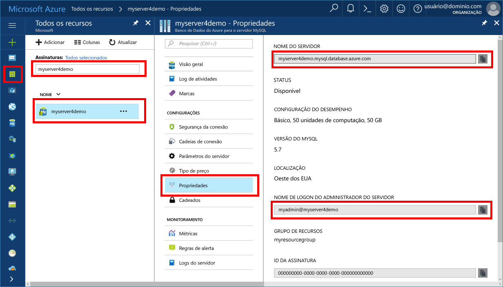

# <a name="azure-database-for-mysql-use-mysql-workbench-tooconnect-and-query-data"></a>Banco de dados do Azure para MySQL: Use MySQL Workbench tooconnect e consultar dados
Este guia de início rápido demonstra como tooconnect tooan banco de dados do Azure para MySQL usando Olá aplicativo Workbench do MySQL. 

## <a name="prerequisites"></a>Pré-requisitos
Este guia de início rápido usa recursos de saudação criados em qualquer um desses guias como um ponto de partida:
- [Criar um Banco de Dados do Azure para servidor MySQL usando o portal do Azure](./quickstart-create-mysql-server-database-using-azure-portal.md)
- [Criar um Banco de Dados do Azure para servidor MySQL usando a CLI do Azure](./quickstart-create-mysql-server-database-using-azure-cli.md)

## <a name="install-mysql-workbench"></a>Instalar o MySQL Workbench
Baixar e instalar o Workbench do MySQL no seu computador de [site do MySQL Olá](https://dev.mysql.com/downloads/workbench/).

## <a name="get-connection-information"></a>Obter informações de conexão
Obter Olá conexão informações necessárias tooconnect toohello banco de dados MySQL. Você precisa Olá credenciais de logon e de nome totalmente qualificado do servidor.

1. Faça logon no toohello [portal do Azure](https://portal.azure.com/).

2. No menu esquerdo de saudação no portal do Azure, clique em **todos os recursos** e pesquisa para o servidor de saudação que você criou, como **myserver4demo**.

3. Clique em nome do servidor de saudação.

4. Servidor de saudação selecione **propriedades** página. Anote Olá **nome do servidor** e **nome de logon do administrador de servidor**.

 
 
5. Se você esquecer suas informações de logon de servidor, navegue toohello **visão geral** página nome de logon de administrador de servidor do tooview hello e, se necessário, Redefinir senha hello.

## <a name="connect-toohello-server-using-mysql-workbench"></a>Conectar-se a servidor toohello usando o Workbench do MySQL 
tooconnect tooAzure MySQL server usando a ferramenta de saudação GUI MySQL Workbench:

1.  Inicie Olá aplicativo MySQL Workbench no seu computador. 

2.  Em **Conexão nova instalação** caixa de diálogo, digite Olá seguintes informações sobre Olá **parâmetros** guia:

    

    | **Configuração** | **Valor sugerido** | **Descrição do campo** |
    |---|---|---|
    |   Nome da Conexão | Conexão de demonstração | Especifique um rótulo para essa conexão. |
    | Método de Conexão | Padrão (TCP/IP) | Padrão (TCP/IP) é suficiente. |
    | Nome do host | *nome do servidor* | Especifique o valor de nome de servidor de saudação que foi usado quando você criou Olá banco de dados do Azure para MySQL anteriormente. Nosso servidor de exemplo mostrado é myserver4demo.mysql.database.azure.com. Use o nome de domínio totalmente qualificado hello (\*. mysql.database.azure.com) conforme mostrado no exemplo hello. Siga etapas Olá Olá seção tooget Olá conexão as informações anteriores se você não lembrar o nome do servidor.  |
    | Porta | 3306 | Sempre use a porta 3306 durante a conexão tooAzure banco de dados para MySQL. |
    | Nome de Usuário |  *nome de logon do administrador do servidor* | Digite hello servidor admin logon nome de usuário fornecido quando você criou Olá banco de dados do Azure para MySQL anteriormente. Nosso nome de usuário de exemplo é myadmin@myserver4demo. Siga etapas Olá Olá seção tooget Olá conexão as informações anteriores se não lembrar o nome de usuário de saudação. formato de saudação é  *username@servername* .
    | Senha | sua senha | Clique em **repositório no cofre...**  senha de saudação do botão toosave. |

3.   Clique em **Conexão de teste** tootest se todos os parâmetros estão configurados corretamente. 

4.   Clique em **Okey** toosave conexão de saudação. 

5.   Na listagem de saudação do **conexão MySQL**, clique em Olá bloco correspondente tooyour servidor e aguarde Olá toobe de conexão estabelecida.

6.   Uma nova guia do SQL é aberta, com um editor em branco no qual você pode digitar suas consultas.

    > [!NOTE]
    > Por padrão, a segurança da conexão SSL é exigida e imposta no seu Banco de Dados do Azure para o servidor MySQL. Normalmente, nenhuma configuração adicional com certificados SSL é necessária para MySQL Workbench tooconnect tooyour servidor. Para obter mais informações sobre o SSL, consulte [conectividade de configurar SSL em seu aplicativo toosecurely tooAzure banco de dados de conexão para MySQL](./howto-configure-ssl.md).  Se você precisar toodisable SSL, visite Olá portal do Azure e clique em Olá Conexão segurança página toodisable Olá impor SSL conexão botão de alternância.

## <a name="create-a-table-insert-data-read-data-update-data-delete-data"></a>Criar uma tabela, inserir dados, ler dados, atualizar dados, excluir dados
1. Copie e cole o código SQL de exemplo hello um tooillustrate de guia do SQL em branco alguns dados de exemplo.

    Esse código cria um banco de dados vazio chamado quickstartdb e, em seguida, cria uma tabela de exemplo chamada inventory. Insere linhas, em seguida, lê as linhas de saudação. Altera dados Olá com uma instrução update e leituras Olá linhas novamente. Por fim exclui uma linha e lê as linhas de saudação novamente.
    
    ```sql
    -- Create a database
    -- DROP DATABASE IF EXISTS quickstartdb;
    CREATE DATABASE quickstartdb;
    USE quickstartdb;
    
    -- Create a table and insert rows
    DROP TABLE IF EXISTS inventory;
    CREATE TABLE inventory (id serial PRIMARY KEY, name VARCHAR(50), quantity INTEGER);
    INSERT INTO inventory (name, quantity) VALUES ('banana', 150);
    INSERT INTO inventory (name, quantity) VALUES ('orange', 154);
    INSERT INTO inventory (name, quantity) VALUES ('apple', 100);
    
    -- Read
    SELECT * FROM inventory;
    
    -- Update
    UPDATE inventory SET quantity = 200 WHERE id = 1;
    SELECT * FROM inventory;
    
    -- Delete
    DELETE FROM inventory WHERE id = 2;
    SELECT * FROM inventory;
    ```

    saudação de captura de tela mostra um exemplo de hello código SQL na saída do SQL Workbench e hello depois que ele foi executado.
    
    

2. exemplo de hello toorun código SQL, clique em Olá luminosidade ícone de raio na barra de ferramentas de saudação do hello **arquivo SQL** guia.
3. Observe Olá três resultados com guias em Olá **grade de resultados** seção no meio de saudação da página de saudação. 
4. Saudação de aviso **saída** lista final Olá Olá página. saudação status de cada comando é mostrado. 

Agora, se conectou tooAzure banco de dados para MySQL usando MySQL Workbench e tiver consultado dados usando linguagem SQL hello.

## <a name="next-steps"></a>Próximas etapas
> [!div class="nextstepaction"]
> [Migre seu banco de dados usando Exportar e Importar](./concepts-migrate-import-export.md)
