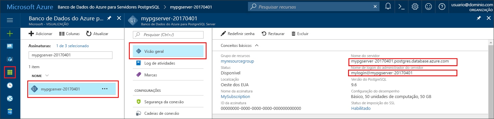

# <a name="azure-database-for-postgresql-use-java-tooconnect-and-query-data"></a><span data-ttu-id="b7772-103">Banco de dados do Azure para PostgreSQL: usar Java tooconnect e consultar dados</span><span class="sxs-lookup"><span data-stu-id="b7772-103">Azure Database for PostgreSQL: Use Java tooconnect and query data</span></span>
<span data-ttu-id="b7772-104">Este guia de início rápido demonstra como tooconnect tooan Azure banco de dados para PostgreSQL usando um aplicativo Java.</span><span class="sxs-lookup"><span data-stu-id="b7772-104">This quickstart demonstrates how tooconnect tooan Azure Database for PostgreSQL using a Java application.</span></span> <span data-ttu-id="b7772-105">Ele mostra como toouse tooquery de instruções SQL, inserir, atualizar e excluir dados no banco de dados de saudação.</span><span class="sxs-lookup"><span data-stu-id="b7772-105">It shows how toouse SQL statements tooquery, insert, update, and delete data in hello database.</span></span> <span data-ttu-id="b7772-106">Olá etapas neste artigo presumem que você esteja familiarizado com o desenvolvimento usando o Java, e que você é novo tooworking com o banco de dados do Azure para PostgreSQL.</span><span class="sxs-lookup"><span data-stu-id="b7772-106">hello steps in this article assume that you are familiar with developing using Java, and that you are new tooworking with Azure Database for PostgreSQL.</span></span>

## <a name="prerequisites"></a><span data-ttu-id="b7772-107">Pré-requisitos</span><span class="sxs-lookup"><span data-stu-id="b7772-107">Prerequisites</span></span>
<span data-ttu-id="b7772-108">Este guia de início rápido usa recursos de saudação criados em qualquer um desses guias como um ponto de partida:</span><span class="sxs-lookup"><span data-stu-id="b7772-108">This quickstart uses hello resources created in either of these guides as a starting point:</span></span>
- [<span data-ttu-id="b7772-109">Criar Banco de dados - Portal</span><span class="sxs-lookup"><span data-stu-id="b7772-109">Create DB - Portal</span></span>](quickstart-create-server-database-portal.md)
- [<span data-ttu-id="b7772-110">Criar Banco de dados - CLI do Azure</span><span class="sxs-lookup"><span data-stu-id="b7772-110">Create DB - Azure CLI</span></span>](quickstart-create-server-database-azure-cli.md)

<span data-ttu-id="b7772-111">Você também precisará:</span><span class="sxs-lookup"><span data-stu-id="b7772-111">You also need to:</span></span>
- <span data-ttu-id="b7772-112">Baixar Olá [PostgreSQL JDBC Driver](https://jdbc.postgresql.org/download.html) correspondente a sua versão do Java e hello Java Development Kit.</span><span class="sxs-lookup"><span data-stu-id="b7772-112">Download hello [PostgreSQL JDBC Driver](https://jdbc.postgresql.org/download.html) matching your version of Java and hello Java Development Kit.</span></span>
- <span data-ttu-id="b7772-113">Inclua Olá arquivo jar de PostgreSQL JDBC (por exemplo, postgresql-42.1.1.jar) no classpath seu aplicativo.</span><span class="sxs-lookup"><span data-stu-id="b7772-113">Include hello PostgreSQL JDBC jar file (for example postgresql-42.1.1.jar) in your application classpath.</span></span> <span data-ttu-id="b7772-114">Para saber mais, confira [detalhes de classpath](https://jdbc.postgresql.org/documentation/head/classpath.html).</span><span class="sxs-lookup"><span data-stu-id="b7772-114">For more information, see [classpath details](https://jdbc.postgresql.org/documentation/head/classpath.html).</span></span>

## <a name="get-connection-information"></a><span data-ttu-id="b7772-115">Obter informações de conexão</span><span class="sxs-lookup"><span data-stu-id="b7772-115">Get connection information</span></span>
<span data-ttu-id="b7772-116">Obter Olá conexão informações necessárias tooconnect toohello banco de dados PostgreSQL.</span><span class="sxs-lookup"><span data-stu-id="b7772-116">Get hello connection information needed tooconnect toohello Azure Database for PostgreSQL.</span></span> <span data-ttu-id="b7772-117">Você precisa Olá credenciais de logon e de nome totalmente qualificado do servidor.</span><span class="sxs-lookup"><span data-stu-id="b7772-117">You need hello fully qualified server name and login credentials.</span></span>

1. <span data-ttu-id="b7772-118">Faça logon no toohello [portal do Azure](https://portal.azure.com/).</span><span class="sxs-lookup"><span data-stu-id="b7772-118">Log in toohello [Azure portal](https://portal.azure.com/).</span></span>
2. <span data-ttu-id="b7772-119">No menu esquerdo de saudação no portal do Azure, clique em **todos os recursos** e pesquisa para o servidor de saudação que você criou, como **mypgserver 20170401**.</span><span class="sxs-lookup"><span data-stu-id="b7772-119">From hello left-hand menu in Azure portal, click **All resources** and search for hello server you have created, such as **mypgserver-20170401**.</span></span>
3. <span data-ttu-id="b7772-120">Clique em nome do servidor de saudação **mypgserver 20170401**.</span><span class="sxs-lookup"><span data-stu-id="b7772-120">Click hello server name **mypgserver-20170401**.</span></span>
4. <span data-ttu-id="b7772-121">Servidor de saudação selecione **visão geral** página.</span><span class="sxs-lookup"><span data-stu-id="b7772-121">Select hello server's **Overview** page.</span></span> <span data-ttu-id="b7772-122">Anote Olá **nome do servidor** e **nome de logon do administrador de servidor**.</span><span class="sxs-lookup"><span data-stu-id="b7772-122">Make a note of hello **Server name** and **Server admin login name**.</span></span>
 <span data-ttu-id="b7772-123"></span><span class="sxs-lookup"><span data-stu-id="b7772-123"></span></span>
5. <span data-ttu-id="b7772-124">Se você esquecer suas informações de logon de servidor, navegue toohello **visão geral** página nome de logon de administrador de servidor do tooview hello e, se necessário, Redefinir senha hello.</span><span class="sxs-lookup"><span data-stu-id="b7772-124">If you forget your server login information, navigate toohello **Overview** page tooview hello Server admin login name and, if necessary, reset hello password.</span></span>

## <a name="connect-create-table-and-insert-data"></a><span data-ttu-id="b7772-125">Conectar-se, criar tabela e inserir dados</span><span class="sxs-lookup"><span data-stu-id="b7772-125">Connect, create table, and insert data</span></span>
<span data-ttu-id="b7772-126">Saudação de uso seguintes código tooconnect e carga Olá dados usando a função hello com um **inserir** instrução SQL.</span><span class="sxs-lookup"><span data-stu-id="b7772-126">Use hello following code tooconnect and load hello data using hello function with an **INSERT** SQL statement.</span></span> <span data-ttu-id="b7772-127">Olá métodos [getConnection()](https://www.postgresql.org/docs/7.4/static/jdbc-use.html), [createStatement()](https://jdbc.postgresql.org/documentation/head/query.html), e [ExecuteQuery ()](https://jdbc.postgresql.org/documentation/head/query.html) são usado tooconnect, descarte e crie a tabela de saudação.</span><span class="sxs-lookup"><span data-stu-id="b7772-127">hello methods [getConnection()](https://www.postgresql.org/docs/7.4/static/jdbc-use.html), [createStatement()](https://jdbc.postgresql.org/documentation/head/query.html), and [executeQuery()](https://jdbc.postgresql.org/documentation/head/query.html) are used tooconnect, drop, and create hello table.</span></span> <span data-ttu-id="b7772-128">Olá [prepareStatement](https://jdbc.postgresql.org/documentation/head/query.html) objeto é usado toobuild Olá os comandos insert, com valores de parâmetro de saudação toobind setString() e setInt().</span><span class="sxs-lookup"><span data-stu-id="b7772-128">hello [prepareStatement](https://jdbc.postgresql.org/documentation/head/query.html) object is used toobuild hello insert commands, with setString() and setInt() toobind hello parameter values.</span></span> <span data-ttu-id="b7772-129">Método [executeUpdate()](https://jdbc.postgresql.org/documentation/head/update.html) Olá de execuções de comando para cada conjunto de parâmetros.</span><span class="sxs-lookup"><span data-stu-id="b7772-129">Method [executeUpdate()](https://jdbc.postgresql.org/documentation/head/update.html) runs hello command for each set of parameters.</span></span> 

<span data-ttu-id="b7772-130">Substitua os valores hello que você especificou quando criou seu próprio servidor e banco de dados host hello, banco de dados, usuário e parâmetros de senha.</span><span class="sxs-lookup"><span data-stu-id="b7772-130">Replace hello host, database, user, and password parameters with hello values that you specified when you created your own server and database.</span></span>

```java
import java.sql.*;
import java.util.Properties;

public class CreateTableInsertRows {

    public static void main (String[] args)  throws Exception
    {

        // Initialize connection variables.
        String host = "mypgserver-20170401.postgres.database.azure.com";
        String database = "mypgsqldb";
        String user = "mylogin@mypgserver-20170401";
        String password = "<server_admin_password>";

        // check that hello driver is installed
        try
        {
            Class.forName("org.postgresql.Driver");
        }
        catch (ClassNotFoundException e)
        {
            throw new ClassNotFoundException("PostgreSQL JDBC driver NOT detected in library path.", e);
        }

        System.out.println("PostgreSQL JDBC driver detected in library path.");

        Connection connection = null;

        // Initialize connection object
        try
        {
            String url = String.format("jdbc:postgresql://%s/%s", host, database);
            
            // set up hello connection properties
            Properties properties = new Properties();
            properties.setProperty("user", user);
            properties.setProperty("password", password);
            properties.setProperty("ssl", "true");

            // get connection
            connection = DriverManager.getConnection(url, properties);
        }
        catch (SQLException e)
        {
            throw new SQLException("Failed toocreate connection toodatabase.", e);
        }
        if (connection != null) 
        { 
            System.out.println("Successfully created connection toodatabase.");
        
            // Perform some SQL queries over hello connection.
            try
            {
                // Drop previous table of same name if one exists.
                Statement statement = connection.createStatement();
                statement.execute("DROP TABLE IF EXISTS inventory;");
                System.out.println("Finished dropping table (if existed).");
    
                // Create table.
                statement.execute("CREATE TABLE inventory (id serial PRIMARY KEY, name VARCHAR(50), quantity INTEGER);");
                System.out.println("Created table.");
    
                // Insert some data into table.
                int nRowsInserted = 0;
                PreparedStatement preparedStatement = connection.prepareStatement("INSERT INTO inventory (name, quantity) VALUES (?, ?);");
                preparedStatement.setString(1, "banana");
                preparedStatement.setInt(2, 150);
                nRowsInserted += preparedStatement.executeUpdate();

                preparedStatement.setString(1, "orange");
                preparedStatement.setInt(2, 154);
                nRowsInserted += preparedStatement.executeUpdate();

                preparedStatement.setString(1, "apple");
                preparedStatement.setInt(2, 100);
                nRowsInserted += preparedStatement.executeUpdate();
                System.out.println(String.format("Inserted %d row(s) of data.", nRowsInserted));
    
                // NOTE No need toocommit all changes toodatabase, as auto-commit is enabled by default.
    
            }
            catch (SQLException e)
            {
                throw new SQLException("Encountered an error when executing given sql statement.", e);
            }       
        }
        else {
            System.out.println("Failed toocreate connection toodatabase.");
        }
        System.out.println("Execution finished.");
    }
}
```

## <a name="read-data"></a><span data-ttu-id="b7772-131">Ler dados</span><span class="sxs-lookup"><span data-stu-id="b7772-131">Read data</span></span>
<span data-ttu-id="b7772-132">Dados de saudação tooread com código a seguir de saudação Use um **selecione** instrução SQL.</span><span class="sxs-lookup"><span data-stu-id="b7772-132">Use hello following code tooread hello data with a **SELECT** SQL statement.</span></span> <span data-ttu-id="b7772-133">Olá métodos [getConnection()](https://www.postgresql.org/docs/7.4/static/jdbc-use.html), [createStatement()](https://jdbc.postgresql.org/documentation/head/query.html), e [ExecuteQuery ()](https://jdbc.postgresql.org/documentation/head/query.html) são usado tooconnect, criar e executar a instrução select hello.</span><span class="sxs-lookup"><span data-stu-id="b7772-133">hello methods [getConnection()](https://www.postgresql.org/docs/7.4/static/jdbc-use.html), [createStatement()](https://jdbc.postgresql.org/documentation/head/query.html), and [executeQuery()](https://jdbc.postgresql.org/documentation/head/query.html) are used tooconnect, create, and run hello select statement.</span></span> <span data-ttu-id="b7772-134">resultados de saudação são processados usando um [ResultSet](https://www.postgresql.org/docs/7.4/static/jdbc-query.html) objeto.</span><span class="sxs-lookup"><span data-stu-id="b7772-134">hello results are processed using a [ResultSet](https://www.postgresql.org/docs/7.4/static/jdbc-query.html) object.</span></span> 

<span data-ttu-id="b7772-135">Substitua os valores hello que você especificou quando criou seu próprio servidor e banco de dados host hello, banco de dados, usuário e parâmetros de senha.</span><span class="sxs-lookup"><span data-stu-id="b7772-135">Replace hello host, database, user, and password parameters with hello values that you specified when you created your own server and database.</span></span>

```java
import java.sql.*;
import java.util.Properties;

public class ReadTable {

    public static void main (String[] args)  throws Exception
    {

        // Initialize connection variables.
        String host = "mypgserver-20170401.postgres.database.azure.com";
        String database = "mypgsqldb";
        String user = "mylogin@mypgserver-20170401";
        String password = "<server_admin_password>";

        // check that hello driver is installed
        try
        {
            Class.forName("org.postgresql.Driver");
        }
        catch (ClassNotFoundException e)
        {
            throw new ClassNotFoundException("PostgreSQL JDBC driver NOT detected in library path.", e);
        }

        System.out.println("PostgreSQL JDBC driver detected in library path.");

        Connection connection = null;

        // Initialize connection object
        try
        {
            String url = String.format("jdbc:postgresql://%s/%s", host, database);
            
            // set up hello connection properties
            Properties properties = new Properties();
            properties.setProperty("user", user);
            properties.setProperty("password", password);
            properties.setProperty("ssl", "true");

            // get connection
            connection = DriverManager.getConnection(url, properties);
        }
        catch (SQLException e)
        {
            throw new SQLException("Failed toocreate connection toodatabase.", e);
        }
        if (connection != null) 
        { 
            System.out.println("Successfully created connection toodatabase.");
        
            // Perform some SQL queries over hello connection.
            try
            {
    
                Statement statement = connection.createStatement();
                ResultSet results = statement.executeQuery("SELECT * from inventory;");
                while (results.next())
                {
                    String outputString = 
                        String.format(
                            "Data row = (%s, %s, %s)",
                            results.getString(1),
                            results.getString(2),
                            results.getString(3));
                    System.out.println(outputString);
                }
            }
            catch (SQLException e)
            {
                throw new SQLException("Encountered an error when executing given sql statement.", e);
            }       
        }
        else {
            System.out.println("Failed toocreate connection toodatabase.");
        }
        System.out.println("Execution finished.");
    }
}

```

## <a name="update-data"></a><span data-ttu-id="b7772-136">Atualizar dados</span><span class="sxs-lookup"><span data-stu-id="b7772-136">Update data</span></span>
<span data-ttu-id="b7772-137">Dados de saudação toochange com código a seguir de saudação Use um **atualização** instrução SQL.</span><span class="sxs-lookup"><span data-stu-id="b7772-137">Use hello following code toochange hello data with an **UPDATE** SQL statement.</span></span> <span data-ttu-id="b7772-138">Olá métodos [getConnection()](https://www.postgresql.org/docs/7.4/static/jdbc-use.html), [prepareStatement()](https://jdbc.postgresql.org/documentation/head/query.html), e [executeUpdate()](https://jdbc.postgresql.org/documentation/head/update.html) são usado tooconnect, preparar e executar a instrução de atualização de saudação.</span><span class="sxs-lookup"><span data-stu-id="b7772-138">hello methods [getConnection()](https://www.postgresql.org/docs/7.4/static/jdbc-use.html), [prepareStatement()](https://jdbc.postgresql.org/documentation/head/query.html), and [executeUpdate()](https://jdbc.postgresql.org/documentation/head/update.html) are used tooconnect, prepare, and run hello update statement.</span></span> 

<span data-ttu-id="b7772-139">Substitua os valores hello que você especificou quando criou seu próprio servidor e banco de dados host hello, banco de dados, usuário e parâmetros de senha.</span><span class="sxs-lookup"><span data-stu-id="b7772-139">Replace hello host, database, user, and password parameters with hello values that you specified when you created your own server and database.</span></span>

```java
import java.sql.*;
import java.util.Properties;

public class UpdateTable {
    public static void main (String[] args)  throws Exception
    {

        // Initialize connection variables.
        String host = "mypgserver-20170401.postgres.database.azure.com";
        String database = "mypgsqldb";
        String user = "mylogin@mypgserver-20170401";
        String password = "<server_admin_password>";

        // check that hello driver is installed
        try
        {
            Class.forName("org.postgresql.Driver");
        }
        catch (ClassNotFoundException e)
        {
            throw new ClassNotFoundException("PostgreSQL JDBC driver NOT detected in library path.", e);
        }

        System.out.println("PostgreSQL JDBC driver detected in library path.");

        Connection connection = null;

        // Initialize connection object
        try
        {
            String url = String.format("jdbc:postgresql://%s/%s", host, database);
            
            // set up hello connection properties
            Properties properties = new Properties();
            properties.setProperty("user", user);
            properties.setProperty("password", password);
            properties.setProperty("ssl", "true");

            // get connection
            connection = DriverManager.getConnection(url, properties);
        }
        catch (SQLException e)
        {
            throw new SQLException("Failed toocreate connection toodatabase.", e);
        }
        if (connection != null) 
        { 
            System.out.println("Successfully created connection toodatabase.");
        
            // Perform some SQL queries over hello connection.
            try
            {
                // Modify some data in table.
                int nRowsUpdated = 0;
                PreparedStatement preparedStatement = connection.prepareStatement("UPDATE inventory SET quantity = ? WHERE name = ?;");
                preparedStatement.setInt(1, 200);
                preparedStatement.setString(2, "banana");
                nRowsUpdated += preparedStatement.executeUpdate();
                System.out.println(String.format("Updated %d row(s) of data.", nRowsUpdated));
    
                // NOTE No need toocommit all changes toodatabase, as auto-commit is enabled by default.
            }
            catch (SQLException e)
            {
                throw new SQLException("Encountered an error when executing given sql statement.", e);
            }       
        }
        else {
            System.out.println("Failed toocreate connection toodatabase.");
        }
        System.out.println("Execution finished.");
    }
}
```
## <a name="delete-data"></a><span data-ttu-id="b7772-140">Excluir dados</span><span class="sxs-lookup"><span data-stu-id="b7772-140">Delete data</span></span>
<span data-ttu-id="b7772-141">Código a seguir de saudação de uso tooremove dados com um **excluir** instrução SQL.</span><span class="sxs-lookup"><span data-stu-id="b7772-141">Use hello following code tooremove data with a **DELETE** SQL statement.</span></span> <span data-ttu-id="b7772-142">Olá métodos [getConnection()](https://www.postgresql.org/docs/7.4/static/jdbc-use.html), [prepareStatement()](https://jdbc.postgresql.org/documentation/head/query.html), e [executeUpdate()](https://jdbc.postgresql.org/documentation/head/update.html) são usado tooconnect, preparar e executar a instrução de delete hello.</span><span class="sxs-lookup"><span data-stu-id="b7772-142">hello methods [getConnection()](https://www.postgresql.org/docs/7.4/static/jdbc-use.html), [prepareStatement()](https://jdbc.postgresql.org/documentation/head/query.html), and [executeUpdate()](https://jdbc.postgresql.org/documentation/head/update.html) are used tooconnect, prepare, and run hello delete statement.</span></span> 

<span data-ttu-id="b7772-143">Substitua os valores hello que você especificou quando criou seu próprio servidor e banco de dados host hello, banco de dados, usuário e parâmetros de senha.</span><span class="sxs-lookup"><span data-stu-id="b7772-143">Replace hello host, database, user, and password parameters with hello values that you specified when you created your own server and database.</span></span>

```java
import java.sql.*;
import java.util.Properties;

public class DeleteTable {
    public static void main (String[] args)  throws Exception
    {

        // Initialize connection variables.
        String host = "mypgserver-20170401.postgres.database.azure.com";
        String database = "mypgsqldb";
        String user = "mylogin@mypgserver-20170401";
        String password = "<server_admin_password>";

        // check that hello driver is installed
        try
        {
            Class.forName("org.postgresql.Driver");
        }
        catch (ClassNotFoundException e)
        {
            throw new ClassNotFoundException("PostgreSQL JDBC driver NOT detected in library path.", e);
        }

        System.out.println("PostgreSQL JDBC driver detected in library path.");

        Connection connection = null;

        // Initialize connection object
        try
        {
            String url = String.format("jdbc:postgresql://%s/%s", host, database);
            
            // set up hello connection properties
            Properties properties = new Properties();
            properties.setProperty("user", user);
            properties.setProperty("password", password);
            properties.setProperty("ssl", "true");

            // get connection
            connection = DriverManager.getConnection(url, properties);
        }
        catch (SQLException e)
        {
            throw new SQLException("Failed toocreate connection toodatabase.", e);
        }
        if (connection != null) 
        { 
            System.out.println("Successfully created connection toodatabase.");
        
            // Perform some SQL queries over hello connection.
            try
            {
                // Delete some data from table.
                int nRowsDeleted = 0;
                PreparedStatement preparedStatement = connection.prepareStatement("DELETE FROM inventory WHERE name = ?;");
                preparedStatement.setString(1, "orange");
                nRowsDeleted += preparedStatement.executeUpdate();
                System.out.println(String.format("Deleted %d row(s) of data.", nRowsDeleted));
    
                // NOTE No need toocommit all changes toodatabase, as auto-commit is enabled by default.
            }
            catch (SQLException e)
            {
                throw new SQLException("Encountered an error when executing given sql statement.", e);
            }       
        }
        else {
            System.out.println("Failed toocreate connection toodatabase.");
        }
        System.out.println("Execution finished.");
    }
}
```

## <a name="next-steps"></a><span data-ttu-id="b7772-144">Próximas etapas</span><span class="sxs-lookup"><span data-stu-id="b7772-144">Next steps</span></span>
> [!div class="nextstepaction"]
> [<span data-ttu-id="b7772-145">Migre seu banco de dados usando Exportar e Importar</span><span class="sxs-lookup"><span data-stu-id="b7772-145">Migrate your database using Export and Import</span></span>](./howto-migrate-using-export-and-import.md)
