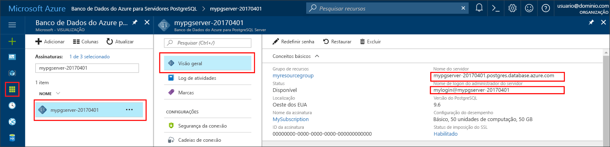

# <a name="azure-database-for-postgresql-use-nodejs-to-connect-and-query-data"></a><span data-ttu-id="a37ec-103">Banco de dados do Azure para PostgreSQL: usar Node.js para se conectar e consultar dados</span><span class="sxs-lookup"><span data-stu-id="a37ec-103">Azure Database for PostgreSQL: Use Node.js to connect and query data</span></span>
<span data-ttu-id="a37ec-104">Este guia de início rápido demonstra como se conectar a um Banco de Dados do Azure para PostgreSQL usando [Node.js](https://nodejs.org/).</span><span class="sxs-lookup"><span data-stu-id="a37ec-104">This quickstart demonstrates how to connect to an Azure Database for PostgreSQL using [Node.js](https://nodejs.org/).</span></span> <span data-ttu-id="a37ec-105">Ele mostra como usar instruções SQL para consultar, inserir, atualizar e excluir dados no banco de dados.</span><span class="sxs-lookup"><span data-stu-id="a37ec-105">It shows how to use SQL statements to query, insert, update, and delete data in the database.</span></span> <span data-ttu-id="a37ec-106">As etapas neste artigo pressupõem que você esteja familiarizado com o desenvolvimento usando o Node.js e que começou recentemente a trabalhar com o Banco de Dados do Azure para PostgreSQL.</span><span class="sxs-lookup"><span data-stu-id="a37ec-106">The steps in this article assume that you are familiar with developing using Node.js, and that you are new to working with Azure Database for PostgreSQL.</span></span>

## <a name="prerequisites"></a><span data-ttu-id="a37ec-107">Pré-requisitos</span><span class="sxs-lookup"><span data-stu-id="a37ec-107">Prerequisites</span></span>
<span data-ttu-id="a37ec-108">Este guia de início rápido usa os recursos criados em um destes guias como ponto de partida:</span><span class="sxs-lookup"><span data-stu-id="a37ec-108">This quickstart uses the resources created in either of these guides as a starting point:</span></span>
- [<span data-ttu-id="a37ec-109">Criar Banco de dados - Portal</span><span class="sxs-lookup"><span data-stu-id="a37ec-109">Create DB - Portal</span></span>](quickstart-create-server-database-portal.md)
- [<span data-ttu-id="a37ec-110">Criar Banco de dados - CLI</span><span class="sxs-lookup"><span data-stu-id="a37ec-110">Create DB - CLI</span></span>](quickstart-create-server-database-azure-cli.md)

<span data-ttu-id="a37ec-111">Você também precisará:</span><span class="sxs-lookup"><span data-stu-id="a37ec-111">You also need to:</span></span>
- <span data-ttu-id="a37ec-112">Instale o [Node.js](https://nodejs.org)</span><span class="sxs-lookup"><span data-stu-id="a37ec-112">Install [Node.js](https://nodejs.org)</span></span>

## <a name="install-pg-client"></a><span data-ttu-id="a37ec-113">Instalar o cliente pg</span><span class="sxs-lookup"><span data-stu-id="a37ec-113">Install pg client</span></span>
<span data-ttu-id="a37ec-114">Instalar [pg](https://www.npmjs.com/package/pg), que é um cliente PostgreSQL para Node.js.</span><span class="sxs-lookup"><span data-stu-id="a37ec-114">Install [pg](https://www.npmjs.com/package/pg), which is a PostgreSQL client for Node.js.</span></span>

<span data-ttu-id="a37ec-115">Para fazer isso, execute o npm (gerenciador de pacotes de nó) para JavaScript na linha de comando para instalar o cliente pg.</span><span class="sxs-lookup"><span data-stu-id="a37ec-115">To do so, run the node package manager (npm) for JavaScript from your command line to install the pg client.</span></span>
```bash
npm install pg
```

<span data-ttu-id="a37ec-116">Verifique a instalação listando os pacotes instalados.</span><span class="sxs-lookup"><span data-stu-id="a37ec-116">Verify the installation by listing the packages installed.</span></span>
```bash
npm list
```

## <a name="get-connection-information"></a><span data-ttu-id="a37ec-117">Obter informações de conexão</span><span class="sxs-lookup"><span data-stu-id="a37ec-117">Get connection information</span></span>
<span data-ttu-id="a37ec-118">Obtenha as informações de conexão necessárias para se conectar ao Banco de Dados do Azure para PostgreSQL.</span><span class="sxs-lookup"><span data-stu-id="a37ec-118">Get the connection information needed to connect to the Azure Database for PostgreSQL.</span></span> <span data-ttu-id="a37ec-119">Você precisa das credenciais de logon e do nome do servidor totalmente qualificado.</span><span class="sxs-lookup"><span data-stu-id="a37ec-119">You need the fully qualified server name and login credentials.</span></span>

1. <span data-ttu-id="a37ec-120">Faça logon no [Portal do Azure](https://portal.azure.com/).</span><span class="sxs-lookup"><span data-stu-id="a37ec-120">Log in to the [Azure portal](https://portal.azure.com/).</span></span>
2. <span data-ttu-id="a37ec-121">No menu à esquerda no Portal do Azure, clique em **Todos os recursos** e pesquise pelo servidor que você acabou de criar.</span><span class="sxs-lookup"><span data-stu-id="a37ec-121">From the left-hand menu in Azure portal, click **All resources** and search for the server you just created.</span></span>
3. <span data-ttu-id="a37ec-122">Clique no nome do servidor.</span><span class="sxs-lookup"><span data-stu-id="a37ec-122">Click the server name.</span></span>
4. <span data-ttu-id="a37ec-123">Selecione a página **Visão geral** do servidor.</span><span class="sxs-lookup"><span data-stu-id="a37ec-123">Select the server's **Overview** page.</span></span> <span data-ttu-id="a37ec-124">Anote o **Nome do servidor** e o **Nome de logon de administrador do servidor**.</span><span class="sxs-lookup"><span data-stu-id="a37ec-124">Make a note of the **Server name** and **Server admin login name**.</span></span>
 <span data-ttu-id="a37ec-125"></span><span class="sxs-lookup"><span data-stu-id="a37ec-125"></span></span>
5. <span data-ttu-id="a37ec-126">Se você se esquecer das informações de logon do servidor, navegue até a página **Visão Geral** para exibir o nome de logon do Administrador do servidor e, se necessário, redefinir a senha.</span><span class="sxs-lookup"><span data-stu-id="a37ec-126">If you forget your server login information, navigate to the **Overview** page to view the Server admin login name and, if necessary, reset the password.</span></span>

## <a name="running-the-javascript-code-in-nodejs"></a><span data-ttu-id="a37ec-127">Executar o código JavaScript no Node.js</span><span class="sxs-lookup"><span data-stu-id="a37ec-127">Running the JavaScript code in Node.js</span></span>
<span data-ttu-id="a37ec-128">Você pode iniciar o shell bash Node.js ou o prompt de comando do Windows digitando `node` e executar o exemplo de código JavaScript interativamente copiando-o e colando-o no prompt.</span><span class="sxs-lookup"><span data-stu-id="a37ec-128">You may launch Node.js from the bash shell or windows command prompt by typing `node`, then run the example JavaScript code interactively by copy and pasting it onto the prompt.</span></span> <span data-ttu-id="a37ec-129">Como alternativa, você pode salvar o código JavaScript em um arquivo de texto e iniciar `node filename.js` com o nome do arquivo como um parâmetro para executá-lo.</span><span class="sxs-lookup"><span data-stu-id="a37ec-129">Alternatively, you may save the JavaScript code into a text file and launch `node filename.js` with the file name as a parameter to run it.</span></span>

## <a name="connect-create-table-and-insert-data"></a><span data-ttu-id="a37ec-130">Conectar-se, criar tabela e inserir dados</span><span class="sxs-lookup"><span data-stu-id="a37ec-130">Connect, create table, and insert data</span></span>
<span data-ttu-id="a37ec-131">Use o código a seguir para se conectar e carregar os dados usando instruções SQL **CREATE TABLE** e **INSERT INTO**.</span><span class="sxs-lookup"><span data-stu-id="a37ec-131">Use the following code to connect and load the data using **CREATE TABLE** and  **INSERT INTO** SQL statements.</span></span>
<span data-ttu-id="a37ec-132">O objeto [pg. Client](https://github.com/brianc/node-postgres/wiki/Client) é usado para se comunicar com o servidor PostgreSQL.</span><span class="sxs-lookup"><span data-stu-id="a37ec-132">The [pg.Client](https://github.com/brianc/node-postgres/wiki/Client) object is used to interface with the PostgreSQL server.</span></span> <span data-ttu-id="a37ec-133">A função [pg. Client.Connect()](https://github.com/brianc/node-postgres/wiki/Client#method-connect) é usada para estabelecer conexão com o servidor.</span><span class="sxs-lookup"><span data-stu-id="a37ec-133">The [pg.Client.connect()](https://github.com/brianc/node-postgres/wiki/Client#method-connect) function is used to establish the connection to the server.</span></span> <span data-ttu-id="a37ec-134">A função [pg.Client.Query()](https://github.com/brianc/node-postgres/wiki/Query) é usada para executar a consulta SQL no banco de dados PostgreSQL.</span><span class="sxs-lookup"><span data-stu-id="a37ec-134">The [pg.Client.query()](https://github.com/brianc/node-postgres/wiki/Query) function is used to execute the SQL query against PostgreSQL database.</span></span> 

<span data-ttu-id="a37ec-135">Substitua os parâmetros host, dbname, user e password pelos valores que você especificou ao criar o servidor e o banco de dados.</span><span class="sxs-lookup"><span data-stu-id="a37ec-135">Replace the host, dbname, user, and password parameters with the values that you specified when you created the server and database.</span></span>

```javascript
const pg = require('pg');

const config = {
    host: '<your-db-server-name>.postgres.database.azure.com',
    // Do not hard code your username and password.
    // Consider using Node environment variables.
    user: '<your-db-username>',     
    password: '<your-password>',
    database: '<name-of-database>',
    port: 5432,
    ssl: true
};

const client = new pg.Client(config);

client.connect(err => {
    if (err) throw err;
    else {
        queryDatabase();
    }
});

function queryDatabase() {
    const query = `
        DROP TABLE IF EXISTS inventory;
        CREATE TABLE inventory (id serial PRIMARY KEY, name VARCHAR(50), quantity INTEGER);
        INSERT INTO inventory (name, quantity) VALUES ('banana', 150);
        INSERT INTO inventory (name, quantity) VALUES ('orange', 154);
        INSERT INTO inventory (name, quantity) VALUES ('apple', 100);
    `;

    client
        .query(query)
        .then(() => {
            console.log('Table created successfully!');
            client.end(console.log('Closed client connection'));
        })
        .catch(err => console.log(err))
        .then(() => {
            console.log('Finished execution, exiting now');
            process.exit();
        });
}
```

## <a name="read-data"></a><span data-ttu-id="a37ec-136">Ler dados</span><span class="sxs-lookup"><span data-stu-id="a37ec-136">Read data</span></span>
<span data-ttu-id="a37ec-137">Use o código a seguir para conectar-se e ler os dados usando uma instrução SQL **SELECT**.</span><span class="sxs-lookup"><span data-stu-id="a37ec-137">Use the following code to connect and read the data using a **SELECT** SQL statement.</span></span> <span data-ttu-id="a37ec-138">O objeto [pg. Client](https://github.com/brianc/node-postgres/wiki/Client) é usado para se comunicar com o servidor PostgreSQL.</span><span class="sxs-lookup"><span data-stu-id="a37ec-138">The [pg.Client](https://github.com/brianc/node-postgres/wiki/Client) object is used to interface with the PostgreSQL server.</span></span> <span data-ttu-id="a37ec-139">A função [pg. Client.Connect()](https://github.com/brianc/node-postgres/wiki/Client#method-connect) é usada para estabelecer conexão com o servidor.</span><span class="sxs-lookup"><span data-stu-id="a37ec-139">The [pg.Client.connect()](https://github.com/brianc/node-postgres/wiki/Client#method-connect) function is used to establish the connection to the server.</span></span> <span data-ttu-id="a37ec-140">A função [pg.Client.Query()](https://github.com/brianc/node-postgres/wiki/Query) é usada para executar a consulta SQL no banco de dados PostgreSQL.</span><span class="sxs-lookup"><span data-stu-id="a37ec-140">The [pg.Client.query()](https://github.com/brianc/node-postgres/wiki/Query) function is used to execute the SQL query against PostgreSQL database.</span></span> 

<span data-ttu-id="a37ec-141">Substitua os parâmetros host, dbname, user e password pelos valores que você especificou ao criar o servidor e o banco de dados.</span><span class="sxs-lookup"><span data-stu-id="a37ec-141">Replace the host, dbname, user, and password parameters with the values that you specified when you created the server and database.</span></span> 

```javascript
const pg = require('pg');

const config = {
    host: '<your-db-server-name>.postgres.database.azure.com',
    // Do not hard code your username and password.
    // Consider using Node environment variables.
    user: '<your-db-username>',     
    password: '<your-password>',
    database: '<name-of-database>',
    port: 5432,
    ssl: true
};

const client = new pg.Client(config);

client.connect(err => {
    if (err) throw err;
    else { queryDatabase(); }
});

function queryDatabase() {
  
    console.log(`Running query to PostgreSQL server: ${config.host}`);

    const query = 'SELECT * FROM inventory;';

    client.query(query)
        .then(res => {
            const rows = res.rows;

            rows.map(row => {
                console.log(`Read: ${JSON.stringify(row)}`);
            });

            process.exit();
        })
        .catch(err => {
            console.log(err);
        });
}
```

## <a name="update-data"></a><span data-ttu-id="a37ec-142">Atualizar dados</span><span class="sxs-lookup"><span data-stu-id="a37ec-142">Update data</span></span>
<span data-ttu-id="a37ec-143">Use o código a seguir para conectar-se e ler os dados usando uma instrução SQL **UPDATE**.</span><span class="sxs-lookup"><span data-stu-id="a37ec-143">Use the following code to connect and read the data using a **UPDATE** SQL statement.</span></span> <span data-ttu-id="a37ec-144">O objeto [pg. Client](https://github.com/brianc/node-postgres/wiki/Client) é usado para se comunicar com o servidor PostgreSQL.</span><span class="sxs-lookup"><span data-stu-id="a37ec-144">The [pg.Client](https://github.com/brianc/node-postgres/wiki/Client) object is used to interface with the PostgreSQL server.</span></span> <span data-ttu-id="a37ec-145">A função [pg. Client.Connect()](https://github.com/brianc/node-postgres/wiki/Client#method-connect) é usada para estabelecer conexão com o servidor.</span><span class="sxs-lookup"><span data-stu-id="a37ec-145">The [pg.Client.connect()](https://github.com/brianc/node-postgres/wiki/Client#method-connect) function is used to establish the connection to the server.</span></span> <span data-ttu-id="a37ec-146">A função [pg.Client.Query()](https://github.com/brianc/node-postgres/wiki/Query) é usada para executar a consulta SQL no banco de dados PostgreSQL.</span><span class="sxs-lookup"><span data-stu-id="a37ec-146">The [pg.Client.query()](https://github.com/brianc/node-postgres/wiki/Query) function is used to execute the SQL query against PostgreSQL database.</span></span> 

<span data-ttu-id="a37ec-147">Substitua os parâmetros host, dbname, user e password pelos valores que você especificou ao criar o servidor e o banco de dados.</span><span class="sxs-lookup"><span data-stu-id="a37ec-147">Replace the host, dbname, user, and password parameters with the values that you specified when you created the server and database.</span></span> 

```javascript
const pg = require('pg');

const config = {
    host: '<your-db-server-name>.postgres.database.azure.com',
    // Do not hard code your username and password.
    // Consider using Node environment variables.
    user: '<your-db-username>',     
    password: '<your-password>',
    database: '<name-of-database>',
    port: 5432,
    ssl: true
};

const client = new pg.Client(config);

client.connect(err => {
    if (err) throw err;
    else {
        queryDatabase();
    }
});

function queryDatabase() {
    const query = `
        UPDATE inventory 
        SET quantity= 1000 WHERE name='banana';
    `;

    client
        .query(query)
        .then(result => {
            console.log('Update completed');
            console.log(`Rows affected: ${result.rowCount}`);
        })
        .catch(err => {
            console.log(err);
            throw err;
        });
}
```

## <a name="delete-data"></a><span data-ttu-id="a37ec-148">Excluir dados</span><span class="sxs-lookup"><span data-stu-id="a37ec-148">Delete data</span></span>
<span data-ttu-id="a37ec-149">Use o código a seguir para conectar-se e ler os dados usando uma instrução SQL **DELETE**.</span><span class="sxs-lookup"><span data-stu-id="a37ec-149">Use the following code to connect and read the data using a **DELETE** SQL statement.</span></span> <span data-ttu-id="a37ec-150">O objeto [pg. Client](https://github.com/brianc/node-postgres/wiki/Client) é usado para se comunicar com o servidor PostgreSQL.</span><span class="sxs-lookup"><span data-stu-id="a37ec-150">The [pg.Client](https://github.com/brianc/node-postgres/wiki/Client) object is used to interface with the PostgreSQL server.</span></span> <span data-ttu-id="a37ec-151">A função [pg. Client.Connect()](https://github.com/brianc/node-postgres/wiki/Client#method-connect) é usada para estabelecer conexão com o servidor.</span><span class="sxs-lookup"><span data-stu-id="a37ec-151">The [pg.Client.connect()](https://github.com/brianc/node-postgres/wiki/Client#method-connect) function is used to establish the connection to the server.</span></span> <span data-ttu-id="a37ec-152">A função [pg.Client.Query()](https://github.com/brianc/node-postgres/wiki/Query) é usada para executar a consulta SQL no banco de dados PostgreSQL.</span><span class="sxs-lookup"><span data-stu-id="a37ec-152">The [pg.Client.query()](https://github.com/brianc/node-postgres/wiki/Query) function is used to execute the SQL query against PostgreSQL database.</span></span> 

<span data-ttu-id="a37ec-153">Substitua os parâmetros host, dbname, user e password pelos valores que você especificou ao criar o servidor e o banco de dados.</span><span class="sxs-lookup"><span data-stu-id="a37ec-153">Replace the host, dbname, user, and password parameters with the values that you specified when you created the server and database.</span></span> 

```javascript
const pg = require('pg');

const config = {
    host: '<your-db-server-name>.postgres.database.azure.com',
    // Do not hard code your username and password.
    // Consider using Node environment variables.
    user: '<your-db-username>',     
    password: '<your-password>',
    database: '<name-of-database>',
    port: 5432,
    ssl: true
};

const client = new pg.Client(config);

client.connect(err => {
    if (err) {
        throw err;
    } else {
        queryDatabase();
    }
});

function queryDatabase() {
    const query = `
        DELETE FROM inventory 
        WHERE name = 'apple';
    `;

    client
        .query(query)
        .then(result => {
            console.log('Delete completed');
            console.log(`Rows affected: ${result.rowCount}`);
        })
        .catch(err => {
            console.log(err);
            throw err;
        });
}
```

## <a name="next-steps"></a><span data-ttu-id="a37ec-154">Próximas etapas</span><span class="sxs-lookup"><span data-stu-id="a37ec-154">Next steps</span></span>
> [!div class="nextstepaction"]
> [<span data-ttu-id="a37ec-155">Migre seu banco de dados usando Exportar e Importar</span><span class="sxs-lookup"><span data-stu-id="a37ec-155">Migrate your database using Export and Import</span></span>](./howto-migrate-using-export-and-import.md)
