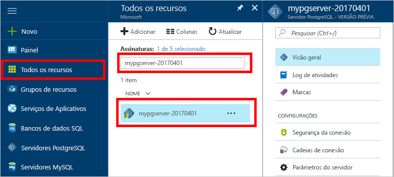

# Como tooBackup e restauração de um servidor no banco de dados do Azure para usar PostgreSQL Olá portal do AzureHow tooBackup and Restore a server in Azure Database for PostgreSQL using hello Azure portal

## O backup ocorre automaticamenteBackup happens Automatically
Ao usar o banco de dados do Azure para PostgreSQL, o serviço de banco de dados de saudação torna automaticamente um backup do serviço de saudação a cada 5 minutos.When using Azure Database for PostgreSQL, hello database service automatically makes a backup of hello service every 5 minutes. 

backups de saudação estão disponíveis para 7 dias, ao usar a camada básica e 35 dias ao usar a camada padrão.hello backups are available for 7 days when using Basic Tier, and 35 days when using Standard Tier. Para saber mais, confira [Camadas do Banco de Dados do Azure para PostgreSQL](concepts-service-tiers.md)For more information, see [Azure Database for PostgreSQL service tiers](concepts-service-tiers.md)

Usando esse recurso de backup automático poderá restaurar o servidor de saudação e todos os seus bancos de dados em um novo servidor tooan anteriormente point-in-time.Using this automatic backup feature you may restore hello server and all its databases into a new server tooan earlier point-in-time.

## Restaurar Olá portal do AzureRestore in hello Azure portal
Banco de dados do Azure para PostgreSQL permite que você toorestore Olá server tooa back ponto no tempo e em tooa nova cópia do servidor de saudação.Azure Database for PostgreSQL allows you toorestore hello server back tooa point in time and into tooa new copy of hello server. Você pode usar esse novo toorecover de servidor a seus dados.You can use this new server toorecover your data. 

Por exemplo, se uma tabela tiver sido acidentalmente descartada ao meio-dia de hoje, você pode restaurar toohello tempo antes de meio-dia e recuperar Olá ausente e os dados dessa nova cópia do servidor de saudação.For example, if a table was accidentally dropped at noon today, you could restore toohello time just before noon and retrieve hello missing table and data from that new copy of hello server.

Hello seguinte ponto de restauração Olá exemplo server tooa tempo:hello following steps restore hello sample server tooa point in time:
1. O logon no hello [portal do Azure](https://portal.azure.com/)Sign into hello [Azure portal](https://portal.azure.com/)
2. Localize seu servidor de Banco de Dados do Azure para PostgreSQL.Locate your Azure Database for PostgreSQL server. No portal do Azure de Olá, clique em **todos os recursos** do menu esquerdo hello e digite nome hello, como **mypgserver 20170401**, toosearch de seu servidor existente.In hello Azure portal, click **All Resources** from hello left-hand menu and type in hello name, such as **mypgserver-20170401**, toosearch for your existing server. Clique em nome do servidor de saudação listado no resultado da pesquisa hello.Click hello server name listed in hello search result. Olá **visão geral** página para o servidor é aberta e oferece opções de configuração adicional.hello **Overview** page for your server opens and provides options for further configuration.

   

3. Na parte superior de saudação da folha de visão geral do servidor de saudação, clique em **restaurar** na barra de ferramentas de saudação.On hello top of hello server overview blade, click **Restore** on hello toolbar. Abre a folha de restauração Hello.hello Restore blade opens.

   

4. Preencha o formulário de restauração de saudação com informações de saudação necessárias:Fill out hello Restore form with hello required information:

   
  - **Ponto de restauração**: selecione um point-in-time que ocorre antes que o servidor de saudação foi alterado**Restore point**: Select a point-in-time that occurs before hello server was changed
  - **Servidor de destino**: forneça um novo nome de servidor que você deseja toorestore para**Target server**: Provide a new server name you want toorestore to
  - **Local**: não é possível selecionar região hello, por padrão, ele é igual ao servidor de origem Olá**Location**: You cannot select hello region, by default it is same as hello source server
  - **Tipo de preço**: não é possível alterar esse valor ao restaurar um servidor.**Pricing tier**: You cannot change this value when restoring a server. É igual ao servidor de origem de saudação.It is same as hello source server. 

5. Clique em **Okey** toorestore Olá servidor toorestore tooa ponto no tempo.Click **OK** toorestore hello server toorestore tooa point in time. 

6. Quando termina de restauração Olá, localize o servidor de novo Olá criado Olá tooverify dados foi restaurados conforme o esperado.Once hello restore finishes, locate hello new server that is created tooverify hello data was restored as expected.

## Próximas etapasNext steps
- [Bibliotecas de conexão para o Banco de Dados do Azure para PostgreSQLConnection libraries for Azure Database for PostgreSQL](concepts-connection-libraries.md)
