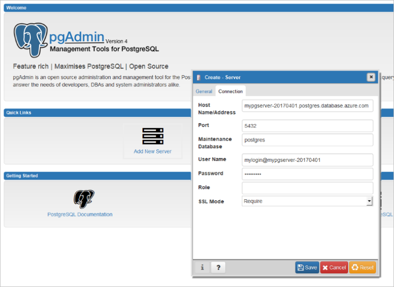

# <a name="create-an-azure-database-for-postgresql-using-hello-azure-cli"></a><span data-ttu-id="ad7bb-103">Criar um banco de dados do Azure para PostgreSQL usando Olá CLI do Azure</span><span class="sxs-lookup"><span data-stu-id="ad7bb-103">Create an Azure Database for PostgreSQL using hello Azure CLI</span></span>
<span data-ttu-id="ad7bb-104">Banco de dados do Azure para PostgreSQL é um serviço gerenciado que permite que você toorun, gerenciar e dimensionar os bancos de dados PostgreSQL altamente disponíveis na nuvem hello.</span><span class="sxs-lookup"><span data-stu-id="ad7bb-104">Azure Database for PostgreSQL is a managed service that enables you toorun, manage, and scale highly available PostgreSQL databases in hello cloud.</span></span> <span data-ttu-id="ad7bb-105">Olá CLI do Azure é usado toocreate e gerenciar recursos do Azure Olá linha de comando ou em scripts.</span><span class="sxs-lookup"><span data-stu-id="ad7bb-105">hello Azure CLI is used toocreate and manage Azure resources from hello command line or in scripts.</span></span> <span data-ttu-id="ad7bb-106">Este guia de início rápido mostra como toocreate um Azure banco de dados PostgreSQL servidor em um [grupo de recursos do Azure](https://docs.microsoft.com/azure/azure-resource-manager/resource-group-overview) usando Olá CLI do Azure.</span><span class="sxs-lookup"><span data-stu-id="ad7bb-106">This quickstart shows you how toocreate an Azure Database for PostgreSQL server in an [Azure resource group](https://docs.microsoft.com/azure/azure-resource-manager/resource-group-overview) using hello Azure CLI.</span></span>

<span data-ttu-id="ad7bb-107">Se você não tiver uma assinatura do Azure, crie uma conta [gratuita](https://azure.microsoft.com/free/) antes de começar.</span><span class="sxs-lookup"><span data-stu-id="ad7bb-107">If you don't have an Azure subscription, create a [free](https://azure.microsoft.com/free/) account before you begin.</span></span>

[!INCLUDE [cloud-shell-try-it](../../includes/cloud-shell-try-it.md)]

<span data-ttu-id="ad7bb-108">Se você escolher tooinstall e usa o hello CLI localmente, este tópico requer que você está executando a versão do CLI do Azure Olá 2.0 ou posterior.</span><span class="sxs-lookup"><span data-stu-id="ad7bb-108">If you choose tooinstall and use hello CLI locally, this topic requires that you are running hello Azure CLI version 2.0 or later.</span></span> <span data-ttu-id="ad7bb-109">Executar `az --version` toofind versão de saudação.</span><span class="sxs-lookup"><span data-stu-id="ad7bb-109">Run `az --version` toofind hello version.</span></span> <span data-ttu-id="ad7bb-110">Se você precisar tooinstall ou atualização, consulte [instalar o Azure CLI 2.0]( /cli/azure/install-azure-cli).</span><span class="sxs-lookup"><span data-stu-id="ad7bb-110">If you need tooinstall or upgrade, see [Install Azure CLI 2.0]( /cli/azure/install-azure-cli).</span></span> 

<span data-ttu-id="ad7bb-111">Se você tiver várias assinaturas, escolha assinatura apropriada hello, no qual o recurso de saudação será cobrado.</span><span class="sxs-lookup"><span data-stu-id="ad7bb-111">If you have multiple subscriptions, choose hello appropriate subscription in which hello resource will be billed.</span></span> <span data-ttu-id="ad7bb-112">Selecione uma ID da assinatura específica em sua conta usando o comando [az account set](/cli/azure/account#set).</span><span class="sxs-lookup"><span data-stu-id="ad7bb-112">Select a specific subscription ID under your account using [az account set](/cli/azure/account#set) command.</span></span>
```azurecli-interactive
az account set --subscription 00000000-0000-0000-0000-000000000000
```

## <a name="create-a-resource-group"></a><span data-ttu-id="ad7bb-113">Criar um grupo de recursos</span><span class="sxs-lookup"><span data-stu-id="ad7bb-113">Create a resource group</span></span>

<span data-ttu-id="ad7bb-114">Criar um [grupo de recursos do Azure](../azure-resource-manager/resource-group-overview.md) usando Olá [criar grupo az](/cli/azure/group#create) comando.</span><span class="sxs-lookup"><span data-stu-id="ad7bb-114">Create an [Azure resource group](../azure-resource-manager/resource-group-overview.md) using hello [az group create](/cli/azure/group#create) command.</span></span> <span data-ttu-id="ad7bb-115">Um grupo de recursos é um contêiner lógico no qual os recursos do Azure são implantados e gerenciados em grupo.</span><span class="sxs-lookup"><span data-stu-id="ad7bb-115">A resource group is a logical container into which Azure resources are deployed and managed as a group.</span></span> <span data-ttu-id="ad7bb-116">Olá, exemplo a seguir cria um grupo de recursos denominado `myresourcegroup` em Olá `westus` local.</span><span class="sxs-lookup"><span data-stu-id="ad7bb-116">hello following example creates a resource group named `myresourcegroup` in hello `westus` location.</span></span>
```azurecli-interactive
az group create --name myresourcegroup --location westus
```

## <a name="create-an-azure-database-for-postgresql-server"></a><span data-ttu-id="ad7bb-117">Criar um Banco de Dados do Azure para o servidor PostgreSQL</span><span class="sxs-lookup"><span data-stu-id="ad7bb-117">Create an Azure Database for PostgreSQL server</span></span>

<span data-ttu-id="ad7bb-118">Criar um [banco de dados do Azure para o servidor PostgreSQL](overview.md) usando Olá [az postgres server criar](/cli/azure/postgres/server#create) comando.</span><span class="sxs-lookup"><span data-stu-id="ad7bb-118">Create an [Azure Database for PostgreSQL server](overview.md) using hello [az postgres server create](/cli/azure/postgres/server#create) command.</span></span> <span data-ttu-id="ad7bb-119">Um servidor contém um grupo de bancos de dados gerenciados conjuntamente.</span><span class="sxs-lookup"><span data-stu-id="ad7bb-119">A server contains a group of databases managed as a group.</span></span> 

<span data-ttu-id="ad7bb-120">Olá, exemplo a seguir cria um servidor chamado `mypgserver-20170401` em seu grupo de recursos `myresourcegroup` com logon de administrador de servidor `mylogin`.</span><span class="sxs-lookup"><span data-stu-id="ad7bb-120">hello following example creates a server named `mypgserver-20170401` in your resource group `myresourcegroup` with server admin login `mylogin`.</span></span> <span data-ttu-id="ad7bb-121">nome de saudação de um servidor mapeia o nome tooDNS e, portanto, é necessário toobe globalmente exclusivo no Azure.</span><span class="sxs-lookup"><span data-stu-id="ad7bb-121">hello name of a server maps tooDNS name and is thus required toobe globally unique in Azure.</span></span> <span data-ttu-id="ad7bb-122">Olá substituto `<server_admin_password>` com seu próprio valor.</span><span class="sxs-lookup"><span data-stu-id="ad7bb-122">Substitute hello `<server_admin_password>` with your own value.</span></span>
```azurecli-interactive
az postgres server create --resource-group myresourcegroup --name mypgserver-20170401  --location westus --admin-user mylogin --admin-password <server_admin_password> --performance-tier Basic --compute-units 50 --version 9.6
```

> [!IMPORTANT]
> <span data-ttu-id="ad7bb-123">Olá administrador logon e senha que você especificar aqui são toolog necessária no servidor de toohello e seus bancos de dados mais tarde nesse início rápido.</span><span class="sxs-lookup"><span data-stu-id="ad7bb-123">hello server admin login and password that you specify here are required toolog in toohello server and its databases later in this quick start.</span></span> <span data-ttu-id="ad7bb-124">Lembre-se ou registre essas informações para o uso posterior.</span><span class="sxs-lookup"><span data-stu-id="ad7bb-124">Remember or record this information for later use.</span></span>

<span data-ttu-id="ad7bb-125">Por padrão, o banco de dados **postgres** é criado em seu servidor.</span><span class="sxs-lookup"><span data-stu-id="ad7bb-125">By default, **postgres** database gets created under your server.</span></span> <span data-ttu-id="ad7bb-126">Olá [postgres](https://www.postgresql.org/docs/9.6/static/app-initdb.html) banco de dados é um banco de dados padrão devem ser usados pelos usuários, utilitários e aplicativos de terceiros.</span><span class="sxs-lookup"><span data-stu-id="ad7bb-126">hello [postgres](https://www.postgresql.org/docs/9.6/static/app-initdb.html) database is a default database meant for use by users, utilities, and third-party applications.</span></span> 


## <a name="configure-a-server-level-firewall-rule"></a><span data-ttu-id="ad7bb-127">Configurar uma regra de firewall no nível de servidor</span><span class="sxs-lookup"><span data-stu-id="ad7bb-127">Configure a server-level firewall rule</span></span>

<span data-ttu-id="ad7bb-128">Criar uma regra de firewall de nível de servidor do Azure PostgreSQL com hello [criar regra de firewall de servidor de postgres de az](/cli/azure/postgres/server/firewall-rule#create) comando.</span><span class="sxs-lookup"><span data-stu-id="ad7bb-128">Create an Azure PostgreSQL server-level firewall rule with hello [az postgres server firewall-rule create](/cli/azure/postgres/server/firewall-rule#create) command.</span></span> <span data-ttu-id="ad7bb-129">Uma regra de firewall de nível de servidor permite que um aplicativo externo, como [psql](https://www.postgresql.org/docs/9.2/static/app-psql.html) ou [PgAdmin](https://www.pgadmin.org/) tooconnect tooyour server através do firewall de serviço do Azure PostgreSQL hello.</span><span class="sxs-lookup"><span data-stu-id="ad7bb-129">A server-level firewall rule allows an external application, such as [psql](https://www.postgresql.org/docs/9.2/static/app-psql.html) or [PgAdmin](https://www.pgadmin.org/) tooconnect tooyour server through hello Azure PostgreSQL service firewall.</span></span> 

<span data-ttu-id="ad7bb-130">Você pode definir uma regra de firewall que abrange um tooconnect IP intervalo toobe capaz de sua rede.</span><span class="sxs-lookup"><span data-stu-id="ad7bb-130">You can set a firewall rule that covers an IP range toobe able tooconnect from your network.</span></span> <span data-ttu-id="ad7bb-131">Olá exemplo a seguir usa [criar regra de firewall de servidor de postgres de az](/cli/azure/postgres/server/firewall-rule#create) toocreate uma regra de firewall `AllowAllIps` para um endereço IP, intervalo.</span><span class="sxs-lookup"><span data-stu-id="ad7bb-131">hello following example uses [az postgres server firewall-rule create](/cli/azure/postgres/server/firewall-rule#create) toocreate a firewall rule `AllowAllIps` for an IP address range.</span></span> <span data-ttu-id="ad7bb-132">tooopen todos os endereços IP, use 0.0.0.0 como Olá Iniciando endereço IP e 255.255.255.255 como Olá endereço final.</span><span class="sxs-lookup"><span data-stu-id="ad7bb-132">tooopen all IP addresses, use 0.0.0.0 as hello starting IP address and 255.255.255.255 as hello ending address.</span></span>
```azurecli-interactive
az postgres server firewall-rule create --resource-group myresourcegroup --server mypgserver-20170401 --name AllowAllIps --start-ip-address 0.0.0.0 --end-ip-address 255.255.255.255
```

> [!NOTE]
> <span data-ttu-id="ad7bb-133">O servidor PostgreSQL do Azure se comunica pela porta 5432.</span><span class="sxs-lookup"><span data-stu-id="ad7bb-133">Azure PostgreSQL server communicates over port 5432.</span></span> <span data-ttu-id="ad7bb-134">Ao se conectar de dentro de uma rede corporativa, o tráfego de saída pela porta 5432 talvez não seja permitido pelo firewall de sua rede.</span><span class="sxs-lookup"><span data-stu-id="ad7bb-134">When connecting from within a corporate network, outbound traffic over port 5432 may not be allowed by your network's firewall.</span></span> <span data-ttu-id="ad7bb-135">Ter seu departamento de TI abrir porta 5432 tooconnect tooyour banco de dados SQL server.</span><span class="sxs-lookup"><span data-stu-id="ad7bb-135">Have your IT department open port 5432 tooconnect tooyour Azure SQL Database server.</span></span>

## <a name="get-hello-connection-information"></a><span data-ttu-id="ad7bb-136">Obter informações de conexão Olá</span><span class="sxs-lookup"><span data-stu-id="ad7bb-136">Get hello connection information</span></span>

<span data-ttu-id="ad7bb-137">tooconnect tooyour server, você precisa ter credenciais de acesso e informações de host de tooprovide.</span><span class="sxs-lookup"><span data-stu-id="ad7bb-137">tooconnect tooyour server, you need tooprovide host information and access credentials.</span></span>
```azurecli-interactive
az postgres server show --resource-group myresourcegroup --name mypgserver-20170401
```

<span data-ttu-id="ad7bb-138">resultado de saudação está no formato JSON.</span><span class="sxs-lookup"><span data-stu-id="ad7bb-138">hello result is in JSON format.</span></span> <span data-ttu-id="ad7bb-139">Anote Olá **administratorLogin** e **fullyQualifiedDomainName**.</span><span class="sxs-lookup"><span data-stu-id="ad7bb-139">Make a note of hello **administratorLogin** and **fullyQualifiedDomainName**.</span></span>
```json
{
  "administratorLogin": "mylogin",
  "fullyQualifiedDomainName": "mypgserver-20170401.postgres.database.azure.com",
  "id": "/subscriptions/00000000-0000-0000-0000-000000000000/resourceGroups/myresourcegroup/providers/Microsoft.DBforPostgreSQL/servers/mypgserver-20170401",
  "location": "westus",
  "name": "mypgserver-20170401",
  "resourceGroup": "myresourcegroup",
  "sku": {
    "capacity": 50,
    "family": null,
    "name": "PGSQLS2M50",
    "size": null,
    "tier": "Basic"
  },
  "sslEnforcement": null,
  "storageMb": 51200,
  "tags": null,
  "type": "Microsoft.DBforPostgreSQL/servers",
  "userVisibleState": "Ready",
  "version": "9.6"
}
```

## <a name="connect-toopostgresql-database-using-psql"></a><span data-ttu-id="ad7bb-140">Conecte-se o banco de dados de tooPostgreSQL usando psql</span><span class="sxs-lookup"><span data-stu-id="ad7bb-140">Connect tooPostgreSQL database using psql</span></span>

<span data-ttu-id="ad7bb-141">Se o computador cliente tem PostgreSQL instalado, você pode usar uma instância local do [psql](https://www.postgresql.org/docs/9.6/static/app-psql.html) tooconnect tooan PostgreSQL Azure server.</span><span class="sxs-lookup"><span data-stu-id="ad7bb-141">If your client computer has PostgreSQL installed, you can use a local instance of [psql](https://www.postgresql.org/docs/9.6/static/app-psql.html) tooconnect tooan Azure PostgreSQL server.</span></span> <span data-ttu-id="ad7bb-142">Agora vamos usar servidor de Azure PostgreSQL Olá psql utilitário de linha de comando tooconnect toohello.</span><span class="sxs-lookup"><span data-stu-id="ad7bb-142">Let's now use hello psql command-line utility tooconnect toohello Azure PostgreSQL server.</span></span>

1. <span data-ttu-id="ad7bb-143">Executar Olá psql comando tooconnect tooan banco de dados PostgreSQL servidor a seguir</span><span class="sxs-lookup"><span data-stu-id="ad7bb-143">Run hello following psql command tooconnect tooan Azure Database for PostgreSQL server</span></span>
```azurecli-interactive
psql --host=<servername> --port=<port> --username=<user@servername> --dbname=<dbname>
```

  <span data-ttu-id="ad7bb-144">Por exemplo, Olá comando a seguir conecta o banco de dados padrão toohello chamado **postgres** no seu servidor PostgreSQL **mypgserver 20170401.postgres.database.azure.com** usando as credenciais de acesso.</span><span class="sxs-lookup"><span data-stu-id="ad7bb-144">For example, hello following command connects toohello default database called **postgres** on your PostgreSQL server **mypgserver-20170401.postgres.database.azure.com** using access credentials.</span></span> <span data-ttu-id="ad7bb-145">Digite hello `<server_admin_password>` você escolheu quando solicitado para a senha.</span><span class="sxs-lookup"><span data-stu-id="ad7bb-145">Enter hello `<server_admin_password>` you chose when prompted for password.</span></span>
  
  ```azurecli-interactive
psql --host=mypgserver-20170401.postgres.database.azure.com --port=5432 --username=mylogin@mypgserver-20170401 --dbname=postgres
```

2.  <span data-ttu-id="ad7bb-146">Quando estiver conectado toohello server, crie um banco de dados em branco no prompt de saudação.</span><span class="sxs-lookup"><span data-stu-id="ad7bb-146">Once you are connected toohello server, create a blank database at hello prompt.</span></span>
```sql
CREATE DATABASE mypgsqldb;
```

3.  <span data-ttu-id="ad7bb-147">No prompt de hello, execute Olá após o banco de dados do comando tooswitch conexão toohello recém-criado **mypgsqldb**:</span><span class="sxs-lookup"><span data-stu-id="ad7bb-147">At hello prompt, execute hello following command tooswitch connection toohello newly created database **mypgsqldb**:</span></span>
```sql
\c mypgsqldb
```

## <a name="connect-toopostgresql-database-using-pgadmin"></a><span data-ttu-id="ad7bb-148">Conecte-se o banco de dados de tooPostgreSQL usando pgAdmin</span><span class="sxs-lookup"><span data-stu-id="ad7bb-148">Connect tooPostgreSQL database using pgAdmin</span></span>

<span data-ttu-id="ad7bb-149">tooconnect tooAzure PostgreSQL server usando a ferramenta Olá GUI _pgAdmin_</span><span class="sxs-lookup"><span data-stu-id="ad7bb-149">tooconnect tooAzure PostgreSQL server using hello GUI tool _pgAdmin_</span></span>
1.  <span data-ttu-id="ad7bb-150">Iniciar Olá _pgAdmin_ aplicativo no computador cliente.</span><span class="sxs-lookup"><span data-stu-id="ad7bb-150">Launch hello _pgAdmin_ application on your client computer.</span></span> <span data-ttu-id="ad7bb-151">Você pode instalar o _pgAdmin_ de http://www.pgadmin.org/.</span><span class="sxs-lookup"><span data-stu-id="ad7bb-151">You can install _pgAdmin_ from http://www.pgadmin.org/.</span></span>
2.  <span data-ttu-id="ad7bb-152">Escolha **adicionar novo servidor** de saudação **Links rápidos** menu.</span><span class="sxs-lookup"><span data-stu-id="ad7bb-152">Choose **Add New Server** from hello **Quick Links** menu.</span></span>
3.  <span data-ttu-id="ad7bb-153">Em Olá **criar - servidor** caixa de diálogo **geral** , insira um nome amigável exclusivo para o servidor de saudação.</span><span class="sxs-lookup"><span data-stu-id="ad7bb-153">In hello **Create - Server** dialog box **General** tab, enter a unique friendly Name for hello server.</span></span> <span data-ttu-id="ad7bb-154">Por exemplo, **Servidor PostgreSQL do Azure**.</span><span class="sxs-lookup"><span data-stu-id="ad7bb-154">Say **Azure PostgreSQL Server**.</span></span>
 <span data-ttu-id="ad7bb-155"></span><span class="sxs-lookup"><span data-stu-id="ad7bb-155"></span></span>
4.  <span data-ttu-id="ad7bb-156">Em Olá **criar - servidor** caixa de diálogo, **Conexão** guia:</span><span class="sxs-lookup"><span data-stu-id="ad7bb-156">In hello **Create - Server** dialog box, **Connection** tab:</span></span>
    - <span data-ttu-id="ad7bb-157">Insira o nome totalmente qualificado do servidor de saudação (por exemplo, **mypgserver 20170401.postgres.database.azure.com**) no hello **nome de Host / endereço** caixa.</span><span class="sxs-lookup"><span data-stu-id="ad7bb-157">Enter hello fully qualified server name (for example, **mypgserver-20170401.postgres.database.azure.com**) in hello **Host Name/ Address** box.</span></span> 
    - <span data-ttu-id="ad7bb-158">Insira a porta 5432 em Olá **porta** caixa.</span><span class="sxs-lookup"><span data-stu-id="ad7bb-158">Enter port 5432 into hello **Port** box.</span></span> 
    - <span data-ttu-id="ad7bb-159">Digite hello **logon de administrador do servidor (user@mypgserver)** obtido anteriormente neste guia de início rápido e a senha fornecidos quando você criou o servidor de saudação em Olá **Username** e **senha** caixas, respectivamente.</span><span class="sxs-lookup"><span data-stu-id="ad7bb-159">Enter hello **Server admin login (user@mypgserver)** obtained earlier in this quickstart and password you entered when you created hello server into hello **Username** and **Password** boxes, respectively.</span></span>
    - <span data-ttu-id="ad7bb-160">Selecione **Modo SSL** como **Requerer**.</span><span class="sxs-lookup"><span data-stu-id="ad7bb-160">Select **SSL Mode** as **Require**.</span></span> <span data-ttu-id="ad7bb-161">Por padrão, todos os servidores PostgreSQL do Azure são criados com a imposição de SSL ligada.</span><span class="sxs-lookup"><span data-stu-id="ad7bb-161">By default, all Azure PostgreSQL servers are created with SSL enforcing turned ON.</span></span> <span data-ttu-id="ad7bb-162">tooturn desativar impondo SSL, consulte os detalhes em [impondo SSL](./concepts-ssl-connection-security.md).</span><span class="sxs-lookup"><span data-stu-id="ad7bb-162">tooturn OFF SSL enforcing, see details in [Enforcing SSL](./concepts-ssl-connection-security.md).</span></span>

    
5.  <span data-ttu-id="ad7bb-164">Clique em **Salvar**.</span><span class="sxs-lookup"><span data-stu-id="ad7bb-164">Click **Save**.</span></span>
6.  <span data-ttu-id="ad7bb-165">No painel esquerdo do navegador hello, expanda Olá **grupos de servidores**.</span><span class="sxs-lookup"><span data-stu-id="ad7bb-165">In hello Browser left pane, expand hello **Server Groups**.</span></span> <span data-ttu-id="ad7bb-166">Escolha o **Servidor PostgreSQL do Azure**.</span><span class="sxs-lookup"><span data-stu-id="ad7bb-166">Choose your server **Azure PostgreSQL Server**.</span></span>
7.  <span data-ttu-id="ad7bb-167">Escolha Olá **servidor** conectado a e, em seguida, escolha **bancos de dados** sob ele.</span><span class="sxs-lookup"><span data-stu-id="ad7bb-167">Choose hello **Server** you connected to, and then choose **Databases** under it.</span></span> 
8.  <span data-ttu-id="ad7bb-168">Clique duas vezes em **bancos de dados** tooCreate um banco de dados.</span><span class="sxs-lookup"><span data-stu-id="ad7bb-168">Right-click on **Databases** tooCreate a Database.</span></span>
9.  <span data-ttu-id="ad7bb-169">Escolha um nome de banco de dados **mypgsqldb** e proprietário Olá para ela como logon de administrador do servidor **mylogin**.</span><span class="sxs-lookup"><span data-stu-id="ad7bb-169">Choose a database name **mypgsqldb** and hello owner for it as server admin login **mylogin**.</span></span>
10. <span data-ttu-id="ad7bb-170">Clique em **salvar** toocreate um banco de dados em branco.</span><span class="sxs-lookup"><span data-stu-id="ad7bb-170">Click **Save** toocreate a blank database.</span></span>
11. <span data-ttu-id="ad7bb-171">Em Olá **navegador**, expanda Olá **servidores** grupo.</span><span class="sxs-lookup"><span data-stu-id="ad7bb-171">In hello **Browser**, expand hello **Servers** group.</span></span> <span data-ttu-id="ad7bb-172">Expanda servidor Olá que você criou e consulte banco de dados de saudação **mypgsqldb** sob ele.</span><span class="sxs-lookup"><span data-stu-id="ad7bb-172">Expand hello server you created, and see hello database **mypgsqldb** under it.</span></span>
 <span data-ttu-id="ad7bb-173"></span><span class="sxs-lookup"><span data-stu-id="ad7bb-173"></span></span>


## <a name="clean-up-resources"></a><span data-ttu-id="ad7bb-174">Limpar recursos</span><span class="sxs-lookup"><span data-stu-id="ad7bb-174">Clean up resources</span></span>

<span data-ttu-id="ad7bb-175">Limpar todos os recursos criados no guia de início rápido Olá excluindo Olá [grupo de recursos do Azure](../azure-resource-manager/resource-group-overview.md).</span><span class="sxs-lookup"><span data-stu-id="ad7bb-175">Clean up all resources you created in hello quickstart by deleting hello [Azure resource group](../azure-resource-manager/resource-group-overview.md).</span></span>

> [!TIP]
> <span data-ttu-id="ad7bb-176">Outros inícios rápidos nessa coleção aproveitam esse início rápido.</span><span class="sxs-lookup"><span data-stu-id="ad7bb-176">Other quickstarts in this collection build upon this quick start.</span></span> <span data-ttu-id="ad7bb-177">Se você planeja toocontinue toowork com subsequentes guias de início rápido, não a limpeza hello recursos criados neste guia de início rápido.</span><span class="sxs-lookup"><span data-stu-id="ad7bb-177">If you plan toocontinue on toowork with subsequent quickstarts, do not clean up hello resources created in this quickstart.</span></span> <span data-ttu-id="ad7bb-178">Se você não planeja toocontinue, use Olá toodelete as etapas a seguir todos os recursos criados por este guia de início rápido no hello CLI do Azure.</span><span class="sxs-lookup"><span data-stu-id="ad7bb-178">If you do not plan toocontinue, use hello following steps toodelete all resources created by this quickstart in hello Azure CLI.</span></span>

```azurecli-interactive
az group delete --name myresourcegroup
```

<span data-ttu-id="ad7bb-179">Se você apenas deseja toodelete Olá um recém-criado servidor, você pode executar [exclusão do servidor postgres az](/cli/azure/postgres/server#delete) comando.</span><span class="sxs-lookup"><span data-stu-id="ad7bb-179">If you just would like toodelete hello one newly created server, you can run [az postgres server delete](/cli/azure/postgres/server#delete) command.</span></span>
```azurecli-interactive
az postgres server delete --resource-group myresourcegroup --name mypgserver-20170401
```

## <a name="next-steps"></a><span data-ttu-id="ad7bb-180">Próximas etapas</span><span class="sxs-lookup"><span data-stu-id="ad7bb-180">Next steps</span></span>
> [!div class="nextstepaction"]
> [<span data-ttu-id="ad7bb-181">Migre seu banco de dados usando Exportar e Importar</span><span class="sxs-lookup"><span data-stu-id="ad7bb-181">Migrate your database using Export and Import</span></span>](./howto-migrate-using-export-and-import.md)
