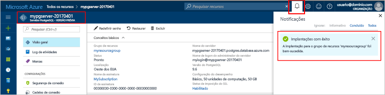

# <a name="create-an-azure-database-for-postgresql-in-the-azure-portal"></a><span data-ttu-id="9cd9b-103">Criar um Banco de Dados do Azure para PostgreSQL no Portal do Azure</span><span class="sxs-lookup"><span data-stu-id="9cd9b-103">Create an Azure Database for PostgreSQL in the Azure portal</span></span>

<span data-ttu-id="9cd9b-104">O Banco de Dados do Azure para PostgreSQL é um serviço gerenciado que permite executar, gerenciar e dimensionar os bancos de dados altamente disponíveis do PostgreSQL na nuvem.</span><span class="sxs-lookup"><span data-stu-id="9cd9b-104">Azure Database for PostgreSQL is a managed service that enables you to run, manage, and scale highly available PostgreSQL databases in the cloud.</span></span> <span data-ttu-id="9cd9b-105">Este guia de início rápido mostra como criar um Banco de Dados do Azure para o servidor PostgreSQL usando o Portal do Azure em aproximadamente cinco minutos.</span><span class="sxs-lookup"><span data-stu-id="9cd9b-105">This quickstart shows you how to create an Azure Database for PostgreSQL server using the Azure portal in about five minutes.</span></span>

<span data-ttu-id="9cd9b-106">Se você não tiver uma assinatura do Azure, crie uma conta [gratuita](https://azure.microsoft.com/free/) antes de começar.</span><span class="sxs-lookup"><span data-stu-id="9cd9b-106">If you don't have an Azure subscription, create a [free](https://azure.microsoft.com/free/) account before you begin.</span></span>

## <a name="log-in-to-the-azure-portal"></a><span data-ttu-id="9cd9b-107">Faça logon no Portal do Azure</span><span class="sxs-lookup"><span data-stu-id="9cd9b-107">Log in to the Azure portal</span></span>
<span data-ttu-id="9cd9b-108">Primeiro, abra seu navegador da Web e navegue até o [portal do Microsoft Azure](https://portal.azure.com/).</span><span class="sxs-lookup"><span data-stu-id="9cd9b-108">Open your web browser, and navigate to the [Microsoft Azure portal](https://portal.azure.com/).</span></span> <span data-ttu-id="9cd9b-109">Insira suas credenciais para entrar no portal.</span><span class="sxs-lookup"><span data-stu-id="9cd9b-109">Enter your credentials to sign in to the portal.</span></span> <span data-ttu-id="9cd9b-110">A exibição padrão é o painel de serviço.</span><span class="sxs-lookup"><span data-stu-id="9cd9b-110">The default view is your service dashboard.</span></span>

## <a name="create-an-azure-database-for-postgresql"></a><span data-ttu-id="9cd9b-111">Criar um Banco de Dados do Azure para o PostgreSQL</span><span class="sxs-lookup"><span data-stu-id="9cd9b-111">Create an Azure Database for PostgreSQL</span></span>

<span data-ttu-id="9cd9b-112">Um Banco de Dados do Azure para PostgreSQL é criado com um conjunto definido de [recursos de computação e armazenamento](./concepts-compute-unit-and-storage.md).</span><span class="sxs-lookup"><span data-stu-id="9cd9b-112">An Azure Database for PostgreSQL server is created with a defined set of [compute and storage resources](./concepts-compute-unit-and-storage.md).</span></span> <span data-ttu-id="9cd9b-113">O servidor é criado dentro de um [Grupo de recursos do Azure](../azure-resource-manager/resource-group-overview.md).</span><span class="sxs-lookup"><span data-stu-id="9cd9b-113">The server is created within an [Azure resource group](../azure-resource-manager/resource-group-overview.md).</span></span>

<span data-ttu-id="9cd9b-114">Siga estas etapas para criar um Banco de Dados do Azure para o servidor PostgreSQL:</span><span class="sxs-lookup"><span data-stu-id="9cd9b-114">Follow these steps to create an Azure Database for PostgreSQL server:</span></span>
1.  <span data-ttu-id="9cd9b-115">Clique no botão **Novo** (+) encontrado à esquerda superior do Portal do Azure.</span><span class="sxs-lookup"><span data-stu-id="9cd9b-115">Click the **New** button (+) found on the upper left-hand corner of the Azure portal.</span></span>
2.  <span data-ttu-id="9cd9b-116">Selecione **Bancos de Dados** na página **Novo** e selecione **Banco de Dados do Azure para PostgreSQL** na página **Bancos de Dados**.</span><span class="sxs-lookup"><span data-stu-id="9cd9b-116">Select **Databases** from the **New** page, and select **Azure Database for PostgreSQL** from the **Databases** page.</span></span>
 <span data-ttu-id="9cd9b-117"></span><span class="sxs-lookup"><span data-stu-id="9cd9b-117"></span></span>

3.  <span data-ttu-id="9cd9b-118">Preencha o formulário de detalhes do novo servidor com as informações abaixo, conforme mostrado na imagem anterior:</span><span class="sxs-lookup"><span data-stu-id="9cd9b-118">Fill out the new server details form with the following information, as shown on the preceding image:</span></span>

    <span data-ttu-id="9cd9b-119">Configuração</span><span class="sxs-lookup"><span data-stu-id="9cd9b-119">Setting</span></span>|<span data-ttu-id="9cd9b-120">Valor sugerido</span><span class="sxs-lookup"><span data-stu-id="9cd9b-120">Suggested value</span></span>|<span data-ttu-id="9cd9b-121">Descrição</span><span class="sxs-lookup"><span data-stu-id="9cd9b-121">Description</span></span>
    ---|---|---
    <span data-ttu-id="9cd9b-122">Nome do servidor</span><span class="sxs-lookup"><span data-stu-id="9cd9b-122">Server name</span></span> |<span data-ttu-id="9cd9b-123">*mypgserver-20170401*</span><span class="sxs-lookup"><span data-stu-id="9cd9b-123">*mypgserver-20170401*</span></span>|<span data-ttu-id="9cd9b-124">Escolha um nome exclusivo que identifica o Banco de Dados do Azure para o servidor PostgreSQL.</span><span class="sxs-lookup"><span data-stu-id="9cd9b-124">Choose a unique name that identifies your Azure Database for PostgreSQL server.</span></span> <span data-ttu-id="9cd9b-125">O nome de domínio *postgres.database.azure.com* é anexado ao nome do servidor fornecido para os aplicativos conectarem.</span><span class="sxs-lookup"><span data-stu-id="9cd9b-125">The domain name *postgres.database.azure.com* is appended to the server name you provide for applications to connect to.</span></span> <span data-ttu-id="9cd9b-126">O nome do servidor pode conter apenas letras minúsculas, números e hífen (-), e deve conter de 3 a 63 caracteres.</span><span class="sxs-lookup"><span data-stu-id="9cd9b-126">The server name can contain only lowercase letters, numbers, and the hyphen (-) character, and it must contain from 3 through 63 characters.</span></span>
    <span data-ttu-id="9cd9b-127">Assinatura</span><span class="sxs-lookup"><span data-stu-id="9cd9b-127">Subscription</span></span>|<span data-ttu-id="9cd9b-128">*Sua assinatura*</span><span class="sxs-lookup"><span data-stu-id="9cd9b-128">*Your subscription*</span></span>|<span data-ttu-id="9cd9b-129">A assinatura do Azure que você deseja usar para o servidor.</span><span class="sxs-lookup"><span data-stu-id="9cd9b-129">The Azure subscription that you want to use for your server.</span></span> <span data-ttu-id="9cd9b-130">Se você tiver várias assinaturas, escolha a que for adequada para a cobrança do recurso.</span><span class="sxs-lookup"><span data-stu-id="9cd9b-130">If you have multiple subscriptions, choose the appropriate subscription in which the resource is billed for.</span></span>
    <span data-ttu-id="9cd9b-131">Grupo de recursos</span><span class="sxs-lookup"><span data-stu-id="9cd9b-131">Resource Group</span></span>|<span data-ttu-id="9cd9b-132">*myresourcegroup*</span><span class="sxs-lookup"><span data-stu-id="9cd9b-132">*myresourcegroup*</span></span>| <span data-ttu-id="9cd9b-133">Você pode criar um novo nome do grupo de recursos ou usar um existente de sua assinatura.</span><span class="sxs-lookup"><span data-stu-id="9cd9b-133">You may make a new resource group name, or use an existing one from your subscription.</span></span>
    <span data-ttu-id="9cd9b-134">Logon de administrador do servidor</span><span class="sxs-lookup"><span data-stu-id="9cd9b-134">Server admin login</span></span> |<span data-ttu-id="9cd9b-135">*mylogin*</span><span class="sxs-lookup"><span data-stu-id="9cd9b-135">*mylogin*</span></span>| <span data-ttu-id="9cd9b-136">Crie sua própria conta de logon para uso ao se conectar com o servidor.</span><span class="sxs-lookup"><span data-stu-id="9cd9b-136">Make your own login account to use when connecting to the server.</span></span> <span data-ttu-id="9cd9b-137">O nome de logon do administrador não pode ser 'azure_superuser', 'azure_pg_admin', 'admin', 'administrator', 'root', 'guest' nem 'public', e não pode iniciar com 'pg_'.</span><span class="sxs-lookup"><span data-stu-id="9cd9b-137">The admin login name cannot be 'azure_superuser', 'azure_pg_admin', 'admin', 'administrator', 'root', 'guest', or 'public', and cannot start with 'pg_'.</span></span>
    <span data-ttu-id="9cd9b-138">Senha</span><span class="sxs-lookup"><span data-stu-id="9cd9b-138">Password</span></span> |<span data-ttu-id="9cd9b-139">*Sua escolha*</span><span class="sxs-lookup"><span data-stu-id="9cd9b-139">*Your choice*</span></span> | <span data-ttu-id="9cd9b-140">Crie uma nova senha para a conta do administrador do servidor.</span><span class="sxs-lookup"><span data-stu-id="9cd9b-140">Create a new password for the server admin account.</span></span> <span data-ttu-id="9cd9b-141">Deve conter de 8 a 128 caracteres.</span><span class="sxs-lookup"><span data-stu-id="9cd9b-141">Must contain from 8 to 128 characters.</span></span> <span data-ttu-id="9cd9b-142">A senha deve conter caracteres de três das categorias a seguir – letras maiúsculas, letras minúsculas, números (0-9) e caracteres não alfanuméricos (!, $, #, % etc.).</span><span class="sxs-lookup"><span data-stu-id="9cd9b-142">Your password must contain characters from three of the following categories – English uppercase letters, English lowercase letters, numbers (0-9), and non-alphanumeric characters (!, $, #, %, etc.).</span></span>
    <span data-ttu-id="9cd9b-143">Local</span><span class="sxs-lookup"><span data-stu-id="9cd9b-143">Location</span></span>|<span data-ttu-id="9cd9b-144">*A região mais próxima de seus usuários*</span><span class="sxs-lookup"><span data-stu-id="9cd9b-144">*The region closest to your users*</span></span>| <span data-ttu-id="9cd9b-145">Escolha o local mais próximo para seus usuários.</span><span class="sxs-lookup"><span data-stu-id="9cd9b-145">Choose the location that's closest to your users.</span></span>
    <span data-ttu-id="9cd9b-146">Versão do PostgreSQL</span><span class="sxs-lookup"><span data-stu-id="9cd9b-146">PostgreSQL Version</span></span>|<span data-ttu-id="9cd9b-147">*Escolha a versão mais recente*</span><span class="sxs-lookup"><span data-stu-id="9cd9b-147">*Choose the latest version*</span></span>| <span data-ttu-id="9cd9b-148">Escolha a versão mais recente, a menos que você tem requisitos específicos.</span><span class="sxs-lookup"><span data-stu-id="9cd9b-148">Choose the latest version unless you have specific requirements.</span></span>
    <span data-ttu-id="9cd9b-149">Camada de preços</span><span class="sxs-lookup"><span data-stu-id="9cd9b-149">Pricing Tier</span></span> | <span data-ttu-id="9cd9b-150">**Básico**, **50 Unidades de Computação** **50 GB**</span><span class="sxs-lookup"><span data-stu-id="9cd9b-150">**Basic**, **50 Compute Units** **50 GB**</span></span> | <span data-ttu-id="9cd9b-151">Clique em **Tipo de preço** para especificar o nível de desempenho e o tipo de serviço para o novo banco de dados.</span><span class="sxs-lookup"><span data-stu-id="9cd9b-151">Click **Pricing tier** to specify the service tier and performance level for your new database.</span></span> <span data-ttu-id="9cd9b-152">Escolha a camada Básico na guia na parte superior.</span><span class="sxs-lookup"><span data-stu-id="9cd9b-152">Choose Basic tier in the tab at the top.</span></span> <span data-ttu-id="9cd9b-153">Clique na extremidade esquerda do controle deslizante Unidades de Computação para ajustar o valor para a quantidade mínima disponível para este início rápido.</span><span class="sxs-lookup"><span data-stu-id="9cd9b-153">Click the left end of the Compute Units slider to adjust the value to the least amount available for this quickstart.</span></span> <span data-ttu-id="9cd9b-154">Clique em **OK** para salvar a seleção do tipo de preço.</span><span class="sxs-lookup"><span data-stu-id="9cd9b-154">Click **Ok** to save the pricing tier selection.</span></span> <span data-ttu-id="9cd9b-155">Consulte a seguinte captura de tela.</span><span class="sxs-lookup"><span data-stu-id="9cd9b-155">See the following screenshot.</span></span>
    | <span data-ttu-id="9cd9b-156">Fixar no painel</span><span class="sxs-lookup"><span data-stu-id="9cd9b-156">Pin to dashboard</span></span> | <span data-ttu-id="9cd9b-157">Verificação</span><span class="sxs-lookup"><span data-stu-id="9cd9b-157">Check</span></span> | <span data-ttu-id="9cd9b-158">Marque a opção **Fixar no painel** para permitir o controle fácil do seu servidor na página do painel frontal do portal do Azure.</span><span class="sxs-lookup"><span data-stu-id="9cd9b-158">Check the **Pin to dashboard** option to allow easy tracking of your server on the front dashboard page of your Azure portal.</span></span>

  > [!IMPORTANT]
  > <span data-ttu-id="9cd9b-159">O logon de administrador do servidor e a senha que você especificar aqui são necessárias para fazer logon no servidor e em seus bancos de dados mais tarde neste início rápido.</span><span class="sxs-lookup"><span data-stu-id="9cd9b-159">The server admin login and password that you specify here are required to log in to the server and its databases later in this quick start.</span></span> <span data-ttu-id="9cd9b-160">Lembre-se ou registre essas informações para o uso posterior.</span><span class="sxs-lookup"><span data-stu-id="9cd9b-160">Remember or record this information for later use.</span></span>

    

4.  <span data-ttu-id="9cd9b-162">Clique em **Criar** para provisionar o servidor.</span><span class="sxs-lookup"><span data-stu-id="9cd9b-162">Click **Create** to provision the server.</span></span> <span data-ttu-id="9cd9b-163">O provisionamento leva alguns minutos, até o máximo de 20 minutos.</span><span class="sxs-lookup"><span data-stu-id="9cd9b-163">Provisioning takes a few minutes, up to 20 minutes maximum.</span></span>

5.  <span data-ttu-id="9cd9b-164">Na barra de ferramentas, clique em **Notificações** para monitorar o processo de implantação.</span><span class="sxs-lookup"><span data-stu-id="9cd9b-164">On the toolbar, click **Notifications** to monitor the deployment process.</span></span>
 <span data-ttu-id="9cd9b-165"></span><span class="sxs-lookup"><span data-stu-id="9cd9b-165"></span></span>
   
  <span data-ttu-id="9cd9b-166">Por padrão, o banco de dados **postgres** é criado em seu servidor.</span><span class="sxs-lookup"><span data-stu-id="9cd9b-166">By default, **postgres** database gets created under your server.</span></span> <span data-ttu-id="9cd9b-167">O [postgres](https://www.postgresql.org/docs/9.6/static/app-initdb.html) é um banco de dados padrão destinado a uso por usuários, utilitários e aplicativos de terceiros.</span><span class="sxs-lookup"><span data-stu-id="9cd9b-167">The [postgres](https://www.postgresql.org/docs/9.6/static/app-initdb.html) database is a default database meant for use by users, utilities, and third-party applications.</span></span> 

## <a name="configure-a-server-level-firewall-rule"></a><span data-ttu-id="9cd9b-168">Configurar uma regra de firewall no nível de servidor</span><span class="sxs-lookup"><span data-stu-id="9cd9b-168">Configure a server-level firewall rule</span></span>

<span data-ttu-id="9cd9b-169">O serviço do Banco de Dados do Azure para PostgreSQL cria um firewall no nível do servidor.</span><span class="sxs-lookup"><span data-stu-id="9cd9b-169">The Azure Database for PostgreSQL service creates a firewall at the server-level.</span></span> <span data-ttu-id="9cd9b-170">Esse firewall impede que os aplicativos e ferramentas externos se conectem ao servidor e aos bancos de dados no servidor, a menos que uma regra de firewall seja criada para abrir o firewall para endereços IP específicos.</span><span class="sxs-lookup"><span data-stu-id="9cd9b-170">This firewall prevents external applications and tools from connecting to the server and any databases on the server, unless a firewall rule is created to open the firewall for specific IP addresses.</span></span> 

1.  <span data-ttu-id="9cd9b-171">Localize seu servidor após a conclusão da implantação.</span><span class="sxs-lookup"><span data-stu-id="9cd9b-171">Locate your server after the deployment completes.</span></span> <span data-ttu-id="9cd9b-172">Se necessário, você pode pesquisar.</span><span class="sxs-lookup"><span data-stu-id="9cd9b-172">If needed, you can search for it.</span></span> <span data-ttu-id="9cd9b-173">Por exemplo, clique em **Todos os Recursos** no menu à esquerda e digite o nome do servidor (como *mypgserver-20170401*) para procurar o servidor recém-criado.</span><span class="sxs-lookup"><span data-stu-id="9cd9b-173">For example, click **All Resources** from the left-hand menu and type in the server name (such as the example *mypgserver-20170401*) to search for your newly created server.</span></span> <span data-ttu-id="9cd9b-174">Clique no nome do servidor listado no resultado da pesquisa.</span><span class="sxs-lookup"><span data-stu-id="9cd9b-174">Click on your server name listed in the search result.</span></span> <span data-ttu-id="9cd9b-175">A página **Visão geral** do servidor é aberta e oferece outras opções de configuração.</span><span class="sxs-lookup"><span data-stu-id="9cd9b-175">The **Overview** page for your server opens and provides options for further configuration.</span></span>
 
    

2.  <span data-ttu-id="9cd9b-177">Na página do servidor, selecione **Segurança da conexão**.</span><span class="sxs-lookup"><span data-stu-id="9cd9b-177">On the server page, select **Connection security**.</span></span> 
    <span data-ttu-id="9cd9b-178"></span><span class="sxs-lookup"><span data-stu-id="9cd9b-178"></span></span>

3.  <span data-ttu-id="9cd9b-179">No cabeçalho **Regras de firewall**, clique na caixa de texto em branco na coluna **Nome da Regra** para começar a criar a regra de firewall.</span><span class="sxs-lookup"><span data-stu-id="9cd9b-179">Under the **Firewall rules** heading, click in the blank text box in the **Rule Name** column to begin creating the firewall rule.</span></span> 

    <span data-ttu-id="9cd9b-180">Para este início rápido, vamos permitir todos os endereços IP no servidor preenchendo a caixa de texto em cada coluna com os seguintes valores:</span><span class="sxs-lookup"><span data-stu-id="9cd9b-180">For this quick start, let's allow all IP addresses into the server by filling in the text box in each column with the following values:</span></span>

    <span data-ttu-id="9cd9b-181">Nome da Regra</span><span class="sxs-lookup"><span data-stu-id="9cd9b-181">Rule Name</span></span> | <span data-ttu-id="9cd9b-182">IP Inicial</span><span class="sxs-lookup"><span data-stu-id="9cd9b-182">Start IP</span></span> | <span data-ttu-id="9cd9b-183">IP Final</span><span class="sxs-lookup"><span data-stu-id="9cd9b-183">End IP</span></span> 
    ---|---|---
    <span data-ttu-id="9cd9b-184">AllowAllIps</span><span class="sxs-lookup"><span data-stu-id="9cd9b-184">AllowAllIps</span></span> |  <span data-ttu-id="9cd9b-185">0.0.0.0</span><span class="sxs-lookup"><span data-stu-id="9cd9b-185">0.0.0.0</span></span> | <span data-ttu-id="9cd9b-186">255.255.255.255</span><span class="sxs-lookup"><span data-stu-id="9cd9b-186">255.255.255.255</span></span>

4. <span data-ttu-id="9cd9b-187">Na barra de ferramentas superior da página Segurança da conexão, clique em **Salvar**.</span><span class="sxs-lookup"><span data-stu-id="9cd9b-187">On the upper toolbar of the Connection security page, click **Save**.</span></span> <span data-ttu-id="9cd9b-188">Aguarde alguns instantes e observe a notificação mostrando que a atualização de segurança de conexão foi concluída com êxito antes de continuar.</span><span class="sxs-lookup"><span data-stu-id="9cd9b-188">Wait for a few moments and notice the notification showing that updating connection security has finished successfully before continuing.</span></span>

    > [!NOTE]
    > <span data-ttu-id="9cd9b-189">As conexões ao Banco de Dados do Azure para servidor PostgreSQL se comunicam pela porta 5432.</span><span class="sxs-lookup"><span data-stu-id="9cd9b-189">Connections to your Azure Database for PostgreSQL server communicate over port 5432.</span></span> <span data-ttu-id="9cd9b-190">Se você estiver tentando se conectar de dentro de uma rede corporativa, o tráfego de saída pela porta 5432 talvez não seja permitido pelo firewall de sua rede.</span><span class="sxs-lookup"><span data-stu-id="9cd9b-190">If you are trying to connect from within a corporate network, outbound traffic over port 5432 may not be allowed by your network's firewall.</span></span> <span data-ttu-id="9cd9b-191">Se isso acontecer, você não conseguirá se conectar ao servidor do Azure MySQL, a menos que o departamento de TI abra a porta 5432.</span><span class="sxs-lookup"><span data-stu-id="9cd9b-191">If so, you will not be able to connect to your server unless your IT department opens port 5432.</span></span>
    >

## <a name="get-the-connection-information"></a><span data-ttu-id="9cd9b-192">Obter informações de conexão</span><span class="sxs-lookup"><span data-stu-id="9cd9b-192">Get the connection information</span></span>

<span data-ttu-id="9cd9b-193">Quando criamos nosso servidor Banco de Dados do Azure para PostgreSQL, um banco de dados padrão chamado **postgres** foi criado.</span><span class="sxs-lookup"><span data-stu-id="9cd9b-193">When we created our Azure Database for PostgreSQL server, a default database named **postgres** gets created.</span></span> <span data-ttu-id="9cd9b-194">Para se conectar ao servidor de banco de dados, você precisa se lembrar do nome do servidor completo e das credenciais de logon do administrador.</span><span class="sxs-lookup"><span data-stu-id="9cd9b-194">To connect to your database server, you need to remember the full server name and admin login credentials.</span></span> <span data-ttu-id="9cd9b-195">Você pode ter anotado esses valores anteriormente no artigo do início rápido.</span><span class="sxs-lookup"><span data-stu-id="9cd9b-195">You may have noted those values earlier in the quick start article.</span></span> <span data-ttu-id="9cd9b-196">Caso não tenha anotado, você pode encontrar facilmente o nome do servidor e as informações de logon na página Visão geral do servidor no portal do Azure.</span><span class="sxs-lookup"><span data-stu-id="9cd9b-196">In case you did not, you can easily find the server name and login information from the server Overview page in the Azure portal.</span></span>

1. <span data-ttu-id="9cd9b-197">Abra a página **Visão geral** do servidor.</span><span class="sxs-lookup"><span data-stu-id="9cd9b-197">Open your server's **Overview** page.</span></span> <span data-ttu-id="9cd9b-198">Anote o **Nome do servidor** e o **Nome de logon de administrador do servidor**.</span><span class="sxs-lookup"><span data-stu-id="9cd9b-198">Make a note of the **Server name** and **Server admin login name**.</span></span>
    <span data-ttu-id="9cd9b-199">Passe o cursor sobre cada campo e o ícone de cópia aparecerá à direita do texto.</span><span class="sxs-lookup"><span data-stu-id="9cd9b-199">Hover your cursor over each field, and the copy icon appears to the right of the text.</span></span> <span data-ttu-id="9cd9b-200">Clique no ícone de cópia conforme necessário para copiar os valores.</span><span class="sxs-lookup"><span data-stu-id="9cd9b-200">Click the copy icon as needed to copy the values.</span></span>

 

## <a name="connect-to-postgresql-database-using-psql-in-cloud-shell"></a><span data-ttu-id="9cd9b-202">Conectar-se ao banco de dados PostgreSQL usando psql no Cloud Shell</span><span class="sxs-lookup"><span data-stu-id="9cd9b-202">Connect to PostgreSQL database using psql in Cloud Shell</span></span>

<span data-ttu-id="9cd9b-203">Há vários aplicativos que você pode usar para conectar o servidor Banco de Dados do Azure para PostgreSQL.</span><span class="sxs-lookup"><span data-stu-id="9cd9b-203">There are a number of applications you can use to connect to your Azure Database for PostgreSQL server.</span></span> <span data-ttu-id="9cd9b-204">Primeiro, usaremos o utilitário da linha de comando psql para ilustrar como conectar o servidor.</span><span class="sxs-lookup"><span data-stu-id="9cd9b-204">Let's first use the psql command-line utility to illustrate how to connect to the server.</span></span>  <span data-ttu-id="9cd9b-205">Você pode usar um navegador da web e o Azure Cloud Shell conforme descrito aqui sem precisar instalar nenhum software adicional.</span><span class="sxs-lookup"><span data-stu-id="9cd9b-205">You can use a web browser and the Azure Cloud Shell as described here without the need to install any additional software.</span></span> <span data-ttu-id="9cd9b-206">Se você tiver o utilitário psql instalado localmente em seu próprio computador, poderá conectar também.</span><span class="sxs-lookup"><span data-stu-id="9cd9b-206">If you have the psql utility installed locally on your own machine, you can connect from there as well.</span></span>

1. <span data-ttu-id="9cd9b-207">Inicie o Azure Cloud Shell por meio do ícone do terminal no painel de navegação superior.</span><span class="sxs-lookup"><span data-stu-id="9cd9b-207">Launch the Azure Cloud Shell via the terminal icon on the top navigation pane.</span></span>

   

2. <span data-ttu-id="9cd9b-209">O Azure Cloud Shell será aberto no navegador, permitindo que você digite os comandos shell do bash.</span><span class="sxs-lookup"><span data-stu-id="9cd9b-209">The Azure Cloud Shell opens in your browser, enabling you to type bash shell commands.</span></span>

   

3. <span data-ttu-id="9cd9b-211">No prompt do Cloud Shell, conecte um banco de dados no servidor Banco de Dados do Azure para PostgreSQL digitando a linha de comando psql no prompt verde.</span><span class="sxs-lookup"><span data-stu-id="9cd9b-211">At the Cloud Shell prompt, connect to a database in your Azure Database for PostgreSQL server by typing the psql command line at the green prompt.</span></span>

    <span data-ttu-id="9cd9b-212">O formato a seguir é usado para conectar-se a um Banco de Dados do Azure para servidor PostgreSQL com o utilitário [psql](https://www.postgresql.org/docs/9.6/static/app-psql.html):</span><span class="sxs-lookup"><span data-stu-id="9cd9b-212">The following format is used to connect to an Azure Database for PostgreSQL server with the [psql](https://www.postgresql.org/docs/9.6/static/app-psql.html) utility:</span></span>
    ```bash
    psql --host=<yourserver> --port=<port> --username=<server admin login> --dbname=<database name>
    ```

    <span data-ttu-id="9cd9b-213">Por exemplo, o comando a seguir conecta um servidor de exemplo:</span><span class="sxs-lookup"><span data-stu-id="9cd9b-213">For example, the following command connects to an example server:</span></span>

    ```bash
    psql --host=mypgserver-20170401.postgres.database.azure.com --port=5432 --username=mylogin@mypgserver-20170401 --dbname=postgres
    ```

    <span data-ttu-id="9cd9b-214">parâmetro psql</span><span class="sxs-lookup"><span data-stu-id="9cd9b-214">psql parameter</span></span> |<span data-ttu-id="9cd9b-215">Valor sugerido</span><span class="sxs-lookup"><span data-stu-id="9cd9b-215">Suggested value</span></span>|<span data-ttu-id="9cd9b-216">Descrição</span><span class="sxs-lookup"><span data-stu-id="9cd9b-216">Description</span></span>
    ---|---|---
    <span data-ttu-id="9cd9b-217">--host</span><span class="sxs-lookup"><span data-stu-id="9cd9b-217">--host</span></span> | <span data-ttu-id="9cd9b-218">*nome do servidor*</span><span class="sxs-lookup"><span data-stu-id="9cd9b-218">*server name*</span></span> | <span data-ttu-id="9cd9b-219">Especifique o valor do nome do servidor que foi usado quando você criou o Banco de Dados do Azure para PostgreSQL anteriormente.</span><span class="sxs-lookup"><span data-stu-id="9cd9b-219">Specify the server name value that was used when you created the Azure Database for PostgreSQL earlier.</span></span> <span data-ttu-id="9cd9b-220">Nosso servidor de exemplo mostrado é mypgserver-20170401.postgres.database.azure.com. Use o nome de domínio totalmente qualificado (\*.postgres.database.azure.com) conforme mostrado no exemplo.</span><span class="sxs-lookup"><span data-stu-id="9cd9b-220">Our example server shown is mypgserver-20170401.postgres.database.azure.com. Use the fully qualified domain name (\*.postgres.database.azure.com) as shown in the example.</span></span> <span data-ttu-id="9cd9b-221">Siga as etapas na seção anterior para obter as informações da conexão, caso não se lembre do seu nome do servidor.</span><span class="sxs-lookup"><span data-stu-id="9cd9b-221">Follow the steps in the previous section to get the connection information if you do not remember your server name.</span></span> 
    <span data-ttu-id="9cd9b-222">--port</span><span class="sxs-lookup"><span data-stu-id="9cd9b-222">--port</span></span> | <span data-ttu-id="9cd9b-223">**5432**</span><span class="sxs-lookup"><span data-stu-id="9cd9b-223">**5432**</span></span> | <span data-ttu-id="9cd9b-224">Sempre use a porta 5432 ao conectar o Banco de Dados do Azure para PostgreSQL.</span><span class="sxs-lookup"><span data-stu-id="9cd9b-224">Always use port 5432 when connecting to Azure Database for PostgreSQL.</span></span> 
    <span data-ttu-id="9cd9b-225">--username</span><span class="sxs-lookup"><span data-stu-id="9cd9b-225">--username</span></span> | <span data-ttu-id="9cd9b-226">*nome de logon do administrador do servidor*</span><span class="sxs-lookup"><span data-stu-id="9cd9b-226">*server admin login name*</span></span> |<span data-ttu-id="9cd9b-227">Digite o nome de usuário de logon do administrador do servidor fornecido quando criou o Banco de Dados do Azure para PostgreSQL anteriormente.</span><span class="sxs-lookup"><span data-stu-id="9cd9b-227">Type in the  server admin login username supplied when you created the Azure Database for PostgreSQL earlier.</span></span> <span data-ttu-id="9cd9b-228">Siga as etapas na seção anterior para obter as informações da conexão, caso não se lembre do nome do usuário.</span><span class="sxs-lookup"><span data-stu-id="9cd9b-228">Follow the steps in the previous section to get the connection information if you do not remember the username.</span></span>  <span data-ttu-id="9cd9b-229">O formato é *username@servername*.</span><span class="sxs-lookup"><span data-stu-id="9cd9b-229">The format is *username@servername*.</span></span>
    <span data-ttu-id="9cd9b-230">--dbname</span><span class="sxs-lookup"><span data-stu-id="9cd9b-230">--dbname</span></span> | <span data-ttu-id="9cd9b-231">**postgres**</span><span class="sxs-lookup"><span data-stu-id="9cd9b-231">**postgres**</span></span> | <span data-ttu-id="9cd9b-232">Use o nome do banco de dados padrão gerado pelo sistema *postgres* para a primeira conexão.</span><span class="sxs-lookup"><span data-stu-id="9cd9b-232">Use the default system generated database name *postgres* for the first connection.</span></span> <span data-ttu-id="9cd9b-233">Depois, você criará seu próprio banco de dados.</span><span class="sxs-lookup"><span data-stu-id="9cd9b-233">Later you create your own database.</span></span>

    <span data-ttu-id="9cd9b-234">Depois de executar o comando psql, com seus próprios valores do parâmetro, você será solicitado a digitar a senha do administrador do servidor.</span><span class="sxs-lookup"><span data-stu-id="9cd9b-234">After running the psql command, with your own parameter values, you are prompted to type the server admin password.</span></span> <span data-ttu-id="9cd9b-235">A senha é a mesma fornecida quando você criou o servidor.</span><span class="sxs-lookup"><span data-stu-id="9cd9b-235">This password is the same that you provided when you created the server.</span></span> 

    <span data-ttu-id="9cd9b-236">parâmetro psql</span><span class="sxs-lookup"><span data-stu-id="9cd9b-236">psql parameter</span></span> |<span data-ttu-id="9cd9b-237">Valor sugerido</span><span class="sxs-lookup"><span data-stu-id="9cd9b-237">Suggested value</span></span>|<span data-ttu-id="9cd9b-238">Descrição</span><span class="sxs-lookup"><span data-stu-id="9cd9b-238">Description</span></span>
    ---|---|---
    <span data-ttu-id="9cd9b-239">Senha</span><span class="sxs-lookup"><span data-stu-id="9cd9b-239">password</span></span> | <span data-ttu-id="9cd9b-240">*sua senha do administrador*</span><span class="sxs-lookup"><span data-stu-id="9cd9b-240">*your admin password*</span></span> | <span data-ttu-id="9cd9b-241">Observe que os caracteres da senha digitados não são mostrados no prompt do bash.</span><span class="sxs-lookup"><span data-stu-id="9cd9b-241">Note, the typed password characters are not shown on the bash prompt.</span></span> <span data-ttu-id="9cd9b-242">Pressione enter após digitar todos os caracteres para autenticar e conectar.</span><span class="sxs-lookup"><span data-stu-id="9cd9b-242">Press enter after you have typed all the characters to authenticate and connect.</span></span>

    <span data-ttu-id="9cd9b-243">Uma vez conectado, o utilitário psql exibe um aviso de postgres onde você digita comandos sql.</span><span class="sxs-lookup"><span data-stu-id="9cd9b-243">Once connected, the psql utility displays a postgres prompt where you type sql commands.</span></span> <span data-ttu-id="9cd9b-244">Na saída de conexão inicial, um aviso pode ser exibido, já que o psql no Azure Cloud Shell pode ser uma versão diferente da versão do Banco de Dados do Azure para servidor PostgreSQL.</span><span class="sxs-lookup"><span data-stu-id="9cd9b-244">In the initial connection output, a warning may be displayed since the psql in the Azure Cloud Shell may be a different  version than the Azure Database for PostgreSQL server version.</span></span> 
    
    <span data-ttu-id="9cd9b-245">Exemplo de saída psql:</span><span class="sxs-lookup"><span data-stu-id="9cd9b-245">Example psql output:</span></span>
    ```bash
    psql (9.5.7, server 9.6.2)
    WARNING: psql major version 9.5, server major version 9.6.
        Some psql features might not work.
    SSL connection (protocol: TLSv1.2, cipher: ECDHE-RSA-AES256-SHA384, bits: 256, compression: off)
    Type "help" for help.
   
    postgres=> 
    ```

    > [!TIP]
    > <span data-ttu-id="9cd9b-246">Se o firewall não está configurado para permitir o endereço IP do Azure Cloud Shell, ocorre o seguinte erro:</span><span class="sxs-lookup"><span data-stu-id="9cd9b-246">If the firewall is not configured to allow the IP address of the Azure Cloud Shell, the following error occurs:</span></span>
    > 
    > <span data-ttu-id="9cd9b-247">"psql: FATAL:  no pg_hba.conf entry for host "138.91.195.82", user "mylogin", database "postgres", SSL on FATAL:  SSL connection is required.</span><span class="sxs-lookup"><span data-stu-id="9cd9b-247">"psql: FATAL:  no pg_hba.conf entry for host "138.91.195.82", user "mylogin", database "postgres", SSL on FATAL:  SSL connection is required.</span></span> <span data-ttu-id="9cd9b-248">Especifique as opções de SSL e tente novamente.</span><span class="sxs-lookup"><span data-stu-id="9cd9b-248">Please specify SSL options and retry.</span></span>
    > 
    > <span data-ttu-id="9cd9b-249">Para resolver o erro, verifique se a configuração do servidor corresponde às etapas na seção *Configurar uma regra de firewall de nível de servidor* do artigo.</span><span class="sxs-lookup"><span data-stu-id="9cd9b-249">To resolve the error, make sure the server configuration matches the steps in the *Configure a server-level firewall rule* section of the article.</span></span>

4.  <span data-ttu-id="9cd9b-250">Crie um banco de dados em branco no prompt digitando o seguinte comando:</span><span class="sxs-lookup"><span data-stu-id="9cd9b-250">Create a blank database at the prompt by typing the following command:</span></span>
    ```bash
    CREATE DATABASE mypgsqldb;
    ```
    <span data-ttu-id="9cd9b-251">O comando pode levar alguns minutos para ser concluído.</span><span class="sxs-lookup"><span data-stu-id="9cd9b-251">The command may take a few moments to complete.</span></span> 

5.  <span data-ttu-id="9cd9b-252">No prompt, execute o seguinte comando para mudar a conexão para o banco de dados **mypgsqldb** recém-criado.</span><span class="sxs-lookup"><span data-stu-id="9cd9b-252">At the prompt, execute the following command to switch connection to the newly created database **mypgsqldb**.</span></span>
    ```bash
    \c mypgsqldb
    ```

6.  <span data-ttu-id="9cd9b-253">Digite \q, em seguida, pressione ENTER para sair do psql.</span><span class="sxs-lookup"><span data-stu-id="9cd9b-253">Type \q and then press ENTER to quit psql.</span></span> <span data-ttu-id="9cd9b-254">Quando terminar, você poderá fechar o Azure Cloud Shell.</span><span class="sxs-lookup"><span data-stu-id="9cd9b-254">You can close the Azure Cloud Shell after you are done.</span></span>

<span data-ttu-id="9cd9b-255">Agora, você conectou o Banco de Dados do Azure para PostgreSQL e criou um banco de dados do usuário em branco.</span><span class="sxs-lookup"><span data-stu-id="9cd9b-255">Now you have connected to the Azure Database for PostgreSQL and created a blank user database.</span></span> <span data-ttu-id="9cd9b-256">Continue na próxima seção para conectar usando outra ferramenta comum, pgAdmin.</span><span class="sxs-lookup"><span data-stu-id="9cd9b-256">Continue to the next section to connect using another common tool, pgAdmin.</span></span>

## <a name="connect-to-postgresql-database-using-pgadmin"></a><span data-ttu-id="9cd9b-257">Conectar-se ao banco de dados PostgreSQL usando pgAdmin</span><span class="sxs-lookup"><span data-stu-id="9cd9b-257">Connect to PostgreSQL database using pgAdmin</span></span>

<span data-ttu-id="9cd9b-258">Para se conectar ao servidor PostgreSQL do Azure usando a ferramenta GUI _pgAdmin_</span><span class="sxs-lookup"><span data-stu-id="9cd9b-258">To connect to Azure PostgreSQL server using the GUI tool _pgAdmin_</span></span>
1.  <span data-ttu-id="9cd9b-259">Inicie o aplicativo _pgAdmin_ no computador cliente.</span><span class="sxs-lookup"><span data-stu-id="9cd9b-259">Launch the _pgAdmin_ application on your client computer.</span></span> <span data-ttu-id="9cd9b-260">Você pode instalar o _pgAdmin_ de http://www.pgadmin.org/.</span><span class="sxs-lookup"><span data-stu-id="9cd9b-260">You can install _pgAdmin_ from http://www.pgadmin.org/.</span></span>
2.  <span data-ttu-id="9cd9b-261">Clique no ícone **Adicionar Novo Servidor** da seção **Links Rápidos** no centro da página Painel.</span><span class="sxs-lookup"><span data-stu-id="9cd9b-261">Click the **Add New Server** icon from the **Quick Links** section in the center of the Dashboard page.</span></span>
3.  <span data-ttu-id="9cd9b-262">Na guia **Geral** da caixa de diálogo **Criar – Servidor**, insira um nome amigável exclusivo para o servidor, como **Servidor PostgreSQL do Azure**.</span><span class="sxs-lookup"><span data-stu-id="9cd9b-262">In the **Create - Server** dialog box **General** tab, enter a unique friendly Name for the server, such as **Azure PostgreSQL Server**.</span></span>
<span data-ttu-id="9cd9b-263"></span><span class="sxs-lookup"><span data-stu-id="9cd9b-263"></span></span>
4.  <span data-ttu-id="9cd9b-264">Na caixa de diálogo **Criar – Servidor**, na guia **Conexão**, use as configurações conforme especificado e clique em **Salvar**.</span><span class="sxs-lookup"><span data-stu-id="9cd9b-264">In the **Create - Server** dialog box, **Connection** tab, use the settings as specified and click **Save**.</span></span>
   <span data-ttu-id="9cd9b-265"></span><span class="sxs-lookup"><span data-stu-id="9cd9b-265"></span></span>

    <span data-ttu-id="9cd9b-266">parâmetro pgAdmin</span><span class="sxs-lookup"><span data-stu-id="9cd9b-266">pgAdmin parameter</span></span> |<span data-ttu-id="9cd9b-267">Valor sugerido</span><span class="sxs-lookup"><span data-stu-id="9cd9b-267">Suggested value</span></span>|<span data-ttu-id="9cd9b-268">Descrição</span><span class="sxs-lookup"><span data-stu-id="9cd9b-268">Description</span></span>
    ---|---|---
    <span data-ttu-id="9cd9b-269">Nome/endereço do host</span><span class="sxs-lookup"><span data-stu-id="9cd9b-269">Host Name/Address</span></span> | <span data-ttu-id="9cd9b-270">*nome do servidor*</span><span class="sxs-lookup"><span data-stu-id="9cd9b-270">*server name*</span></span> | <span data-ttu-id="9cd9b-271">Especifique o valor do nome do servidor que foi usado quando você criou o Banco de Dados do Azure para PostgreSQL anteriormente.</span><span class="sxs-lookup"><span data-stu-id="9cd9b-271">Specify the server name value that was used when you created the Azure Database for PostgreSQL earlier.</span></span> <span data-ttu-id="9cd9b-272">Nosso servidor de exemplo mostrado é mypgserver-20170401.postgres.database.azure.com. Use o nome de domínio totalmente qualificado (\*.postgres.database.azure.com) conforme mostrado no exemplo.</span><span class="sxs-lookup"><span data-stu-id="9cd9b-272">Our example server shown is mypgserver-20170401.postgres.database.azure.com. Use the fully qualified domain name (\*.postgres.database.azure.com) as shown in the example.</span></span> <span data-ttu-id="9cd9b-273">Siga as etapas na seção anterior para obter as informações da conexão, caso não se lembre do seu nome do servidor.</span><span class="sxs-lookup"><span data-stu-id="9cd9b-273">Follow the steps in the previous section to get the connection information if you do not remember your server name.</span></span> 
    <span data-ttu-id="9cd9b-274">Porta</span><span class="sxs-lookup"><span data-stu-id="9cd9b-274">Port</span></span> | <span data-ttu-id="9cd9b-275">**5432**</span><span class="sxs-lookup"><span data-stu-id="9cd9b-275">**5432**</span></span> | <span data-ttu-id="9cd9b-276">Sempre use a porta 5432 ao conectar o Banco de Dados do Azure para PostgreSQL.</span><span class="sxs-lookup"><span data-stu-id="9cd9b-276">Always use port 5432 when connecting to Azure Database for PostgreSQL.</span></span>  
    <span data-ttu-id="9cd9b-277">Manutenção do banco de dados</span><span class="sxs-lookup"><span data-stu-id="9cd9b-277">Maintenance Database</span></span> | <span data-ttu-id="9cd9b-278">**postgres**</span><span class="sxs-lookup"><span data-stu-id="9cd9b-278">**postgres**</span></span> | <span data-ttu-id="9cd9b-279">Use o nome de banco de dados padrão gerado pelo sistema *postgres*.</span><span class="sxs-lookup"><span data-stu-id="9cd9b-279">Use the default system generated database name *postgres*.</span></span>
    <span data-ttu-id="9cd9b-280">Nome de usuário</span><span class="sxs-lookup"><span data-stu-id="9cd9b-280">User Name</span></span> | <span data-ttu-id="9cd9b-281">*nome de logon do administrador do servidor*</span><span class="sxs-lookup"><span data-stu-id="9cd9b-281">*server admin login name*</span></span> | <span data-ttu-id="9cd9b-282">Digite o nome de usuário de logon do administrador do servidor fornecido quando criou o Banco de Dados do Azure para PostgreSQL anteriormente.</span><span class="sxs-lookup"><span data-stu-id="9cd9b-282">Type in the server admin login username supplied when you created the Azure Database for PostgreSQL earlier.</span></span> <span data-ttu-id="9cd9b-283">Siga as etapas na seção anterior para obter as informações da conexão, caso não se lembre do nome do usuário.</span><span class="sxs-lookup"><span data-stu-id="9cd9b-283">Follow the steps in the previous section to get the connection information if you do not remember the username.</span></span> <span data-ttu-id="9cd9b-284">O formato é *username@servername*.</span><span class="sxs-lookup"><span data-stu-id="9cd9b-284">The format is *username@servername*.</span></span>
    <span data-ttu-id="9cd9b-285">Senha</span><span class="sxs-lookup"><span data-stu-id="9cd9b-285">Password</span></span> | <span data-ttu-id="9cd9b-286">*sua senha do administrador*</span><span class="sxs-lookup"><span data-stu-id="9cd9b-286">*your admin password*</span></span> |  <span data-ttu-id="9cd9b-287">A senha que você escolheu ao criar o servidor anteriormente neste guia de início rápido.</span><span class="sxs-lookup"><span data-stu-id="9cd9b-287">The password you chose when you created the server earlier in this quickstart.</span></span>
    <span data-ttu-id="9cd9b-288">Função</span><span class="sxs-lookup"><span data-stu-id="9cd9b-288">Role</span></span> | <span data-ttu-id="9cd9b-289">*deixar em branco*</span><span class="sxs-lookup"><span data-stu-id="9cd9b-289">*leave blank*</span></span> | <span data-ttu-id="9cd9b-290">Não é necessário fornecer um nome de função neste momento.</span><span class="sxs-lookup"><span data-stu-id="9cd9b-290">No need to provide a role name at this point.</span></span> <span data-ttu-id="9cd9b-291">Deixe o campo em branco.</span><span class="sxs-lookup"><span data-stu-id="9cd9b-291">Leave the field blank.</span></span>
    <span data-ttu-id="9cd9b-292">Modo SSL</span><span class="sxs-lookup"><span data-stu-id="9cd9b-292">SSL Mode</span></span> | <span data-ttu-id="9cd9b-293">Exigência</span><span class="sxs-lookup"><span data-stu-id="9cd9b-293">Require</span></span> | <span data-ttu-id="9cd9b-294">Por padrão, todos os servidores PostgreSQL do Azure são criados com a imposição de SSL ligada.</span><span class="sxs-lookup"><span data-stu-id="9cd9b-294">By default, all Azure PostgreSQL servers are created with SSL enforcing turned ON.</span></span> <span data-ttu-id="9cd9b-295">Para DESLIGAR a imposição de SSL, consulte os detalhes em [Imposição de SSL](./concepts-ssl-connection-security.md).</span><span class="sxs-lookup"><span data-stu-id="9cd9b-295">To turn OFF SSL enforcing, see details in [Enforcing SSL](./concepts-ssl-connection-security.md).</span></span>
    
5.  <span data-ttu-id="9cd9b-296">Clique em **Salvar**.</span><span class="sxs-lookup"><span data-stu-id="9cd9b-296">Click **Save**.</span></span>
6.  <span data-ttu-id="9cd9b-297">No painel esquerdo do navegador, expanda o nó **Servidores**.</span><span class="sxs-lookup"><span data-stu-id="9cd9b-297">In the Browser left pane, expand the **Servers** node.</span></span> <span data-ttu-id="9cd9b-298">Escolha o servidor, por exemplo, **Azure PostgreSQL Server**, e clique para se conectar a ele.</span><span class="sxs-lookup"><span data-stu-id="9cd9b-298">Choose your server, for example **Azure PostgreSQL Server** and click to connect to it.</span></span>
7. <span data-ttu-id="9cd9b-299">Expanda o nó do servidor e expanda **Bancos de Dados** nele.</span><span class="sxs-lookup"><span data-stu-id="9cd9b-299">Expand the server node, and then expand **Databases** under it.</span></span> <span data-ttu-id="9cd9b-300">A lista deve conter seu banco de dados *postgres* existente e bancos de dados de usuário recém-criados, como *mypgsqldb*, que criamos na seção anterior.</span><span class="sxs-lookup"><span data-stu-id="9cd9b-300">The list should include your existing *postgres* database, and any newly created user database, such as *mypgsqldb*, that we created in the previous section.</span></span> <span data-ttu-id="9cd9b-301">Observe que você pode criar vários bancos de dados por servidor com o Banco de Dados do Azure para PostgreSQL.</span><span class="sxs-lookup"><span data-stu-id="9cd9b-301">Notice that you may create multiple databases per server with Azure Database for PostgreSQL.</span></span>
8. <span data-ttu-id="9cd9b-302">Clique duas vezes em **Bancos de Dados**, escolha o menu **Criar** e clique em **Banco de Dados**.</span><span class="sxs-lookup"><span data-stu-id="9cd9b-302">Right-click on **Databases**, choose the **Create** menu, and click **Database**.</span></span>
9.  <span data-ttu-id="9cd9b-303">Digite um nome de banco de dados de sua escolha no campo **Banco de Dados**, por exemplo, o *mypgsqldb* mostrado no exemplo.</span><span class="sxs-lookup"><span data-stu-id="9cd9b-303">Type a database name of your choice in the **Database** field, such as *mypgsqldb* shown in the example.</span></span> 
10. <span data-ttu-id="9cd9b-304">Selecione o **Proprietário** do banco de dados na caixa suspensa.</span><span class="sxs-lookup"><span data-stu-id="9cd9b-304">Select the **Owner** for the database from the drop-down box.</span></span> <span data-ttu-id="9cd9b-305">Escolha o nome de logon do administrador do servidor, como o nosso exemplo *mylogin*.</span><span class="sxs-lookup"><span data-stu-id="9cd9b-305">Choose your server admin login name, such as our example *mylogin*.</span></span>
10. <span data-ttu-id="9cd9b-306">Clique em **Salvar** para criar um novo banco de dados em branco.</span><span class="sxs-lookup"><span data-stu-id="9cd9b-306">Click **Save** to create a new blank database.</span></span>
11. <span data-ttu-id="9cd9b-307">No painel **Navegador**, confira o banco de dados que você criou na lista de bancos de dados no nome do seu servidor.</span><span class="sxs-lookup"><span data-stu-id="9cd9b-307">In the **Browser** pane, see the database you created in the list of Databases under your server name.</span></span>
 <span data-ttu-id="9cd9b-308"></span><span class="sxs-lookup"><span data-stu-id="9cd9b-308"></span></span>


## <a name="clean-up-resources"></a><span data-ttu-id="9cd9b-309">Limpar recursos</span><span class="sxs-lookup"><span data-stu-id="9cd9b-309">Clean up resources</span></span>
<span data-ttu-id="9cd9b-310">Limpe os recursos criados no início rápido excluindo o [grupo de recursos do Azure](../azure-resource-manager/resource-group-overview.md), que inclui todos os recursos no grupo de recursos, ou excluindo o recurso de servidor se quiser manter os outros recursos.</span><span class="sxs-lookup"><span data-stu-id="9cd9b-310">Clean up the resources you created in the quickstart either by deleting the [Azure resource group](../azure-resource-manager/resource-group-overview.md), which includes all the resources in the resource group, or by deleting the one server resource if you want to keep the other resources intact.</span></span>

> [!TIP]
> <span data-ttu-id="9cd9b-311">Outros inícios rápidos nessa coleção aproveitam esse início rápido.</span><span class="sxs-lookup"><span data-stu-id="9cd9b-311">Other quickstarts in this collection build upon this quick start.</span></span> <span data-ttu-id="9cd9b-312">Se você planeja continuar trabalhando com os inícios rápidos subsequentes, não limpe os recursos criados nesse início rápido.</span><span class="sxs-lookup"><span data-stu-id="9cd9b-312">If you plan to continue on to work with subsequent quickstarts, do not clean up the resources created in this quickstart.</span></span> <span data-ttu-id="9cd9b-313">Caso contrário, siga estas etapas para excluir os recursos criados por esse início rápido no portal do Azure.</span><span class="sxs-lookup"><span data-stu-id="9cd9b-313">If you do not plan to continue, use the following steps to delete resources created by this quickstart in the Azure portal.</span></span>

<span data-ttu-id="9cd9b-314">Para excluir o grupo de recursos inteiro, incluindo o servidor criado recentemente:</span><span class="sxs-lookup"><span data-stu-id="9cd9b-314">To delete the entire resource group including the newly created server:</span></span>
1.  <span data-ttu-id="9cd9b-315">Encontre o grupo de recursos no portal do Azure.</span><span class="sxs-lookup"><span data-stu-id="9cd9b-315">Locate your resource group in the Azure portal.</span></span> <span data-ttu-id="9cd9b-316">No menu à esquerda no Portal do Azure, clique em **Grupos de recursos** e depois clique no nome do recurso criado, como nosso exemplo **myresourcegroup**.</span><span class="sxs-lookup"><span data-stu-id="9cd9b-316">From the left-hand menu in the Azure portal, click **Resource groups** and then click the name of your resource group, such as our example **myresourcegroup**.</span></span>
2.  <span data-ttu-id="9cd9b-317">Na página do seu grupo de recursos, clique em **Excluir**.</span><span class="sxs-lookup"><span data-stu-id="9cd9b-317">On your resource group page, click **Delete**.</span></span> <span data-ttu-id="9cd9b-318">Em seguida, digite o nome do grupo de recursos, como o nosso exemplo **myresourcegroup**, na caixa de texto para confirmar a exclusão e clique em **Excluir**.</span><span class="sxs-lookup"><span data-stu-id="9cd9b-318">Then type the name of your resource group, such as our example **myresourcegroup**, in the text box to confirm deletion, and then click **Delete**.</span></span>

<span data-ttu-id="9cd9b-319">Ou, em vez disso, para excluir o servidor criado recentemente:</span><span class="sxs-lookup"><span data-stu-id="9cd9b-319">Or instead, to delete the newly created server:</span></span>
1.  <span data-ttu-id="9cd9b-320">Encontre seu servidor no portal do Azure, se não estiver com ele aberto.</span><span class="sxs-lookup"><span data-stu-id="9cd9b-320">Locate your server in the Azure portal, if you do not have it open.</span></span> <span data-ttu-id="9cd9b-321">No menu à esquerda no Portal do Azure, clique em **Todos os recursos** e pesquise pelo servidor que você criou.</span><span class="sxs-lookup"><span data-stu-id="9cd9b-321">From the left-hand menu in Azure portal, click **All resources**, and then search for the server you created.</span></span>
2.  <span data-ttu-id="9cd9b-322">Na página **Visão Geral**, clique no botão **Excluir** no painel superior.</span><span class="sxs-lookup"><span data-stu-id="9cd9b-322">On the **Overview** page, click the **Delete** button on the top pane.</span></span>
<span data-ttu-id="9cd9b-323"></span><span class="sxs-lookup"><span data-stu-id="9cd9b-323"></span></span>
3.  <span data-ttu-id="9cd9b-324">Confirme o nome do servidor que deseja excluir e exiba sob ele os bancos de dados que são afetados.</span><span class="sxs-lookup"><span data-stu-id="9cd9b-324">Confirm the server name you want to delete, and show the databases under it that are affected.</span></span> <span data-ttu-id="9cd9b-325">Digite o nome do servidor na caixa de texto, como o nosso exemplo **mypgserver-20170401** e clique em **Excluir**.</span><span class="sxs-lookup"><span data-stu-id="9cd9b-325">Type your server name in the text box, such as our example **mypgserver-20170401**, and then click **Delete**.</span></span>

## <a name="next-steps"></a><span data-ttu-id="9cd9b-326">Próximas etapas</span><span class="sxs-lookup"><span data-stu-id="9cd9b-326">Next steps</span></span>
> [!div class="nextstepaction"]
> [<span data-ttu-id="9cd9b-327">Migre seu banco de dados usando Exportar e Importar</span><span class="sxs-lookup"><span data-stu-id="9cd9b-327">Migrate your database using Export and Import</span></span>](./howto-migrate-using-export-and-import.md)
