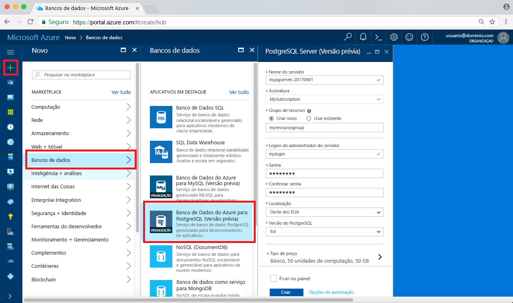

# <a name="create-an-azure-database-for-postgresql-in-hello-azure-portal"></a><span data-ttu-id="cc97e-103">Criar um banco de dados do Azure para PostgreSQL em Olá portal do Azure</span><span class="sxs-lookup"><span data-stu-id="cc97e-103">Create an Azure Database for PostgreSQL in hello Azure portal</span></span>

<span data-ttu-id="cc97e-104">Banco de dados do Azure para PostgreSQL é um serviço gerenciado que permite que você toorun, gerenciar e dimensionar os bancos de dados PostgreSQL altamente disponíveis na nuvem hello.</span><span class="sxs-lookup"><span data-stu-id="cc97e-104">Azure Database for PostgreSQL is a managed service that enables you toorun, manage, and scale highly available PostgreSQL databases in hello cloud.</span></span> <span data-ttu-id="cc97e-105">Este guia de início rápido mostra como toocreate um Azure banco de dados para o servidor de PostgreSQL usando Olá portal do Azure em cerca de cinco minutos.</span><span class="sxs-lookup"><span data-stu-id="cc97e-105">This quickstart shows you how toocreate an Azure Database for PostgreSQL server using hello Azure portal in about five minutes.</span></span>

<span data-ttu-id="cc97e-106">Se você não tiver uma assinatura do Azure, crie uma conta [gratuita](https://azure.microsoft.com/free/) antes de começar.</span><span class="sxs-lookup"><span data-stu-id="cc97e-106">If you don't have an Azure subscription, create a [free](https://azure.microsoft.com/free/) account before you begin.</span></span>

## <a name="log-in-toohello-azure-portal"></a><span data-ttu-id="cc97e-107">Faça logon no toohello portal do Azure</span><span class="sxs-lookup"><span data-stu-id="cc97e-107">Log in toohello Azure portal</span></span>
<span data-ttu-id="cc97e-108">Abra seu navegador da web e navegue toohello [portal do Microsoft Azure](https://portal.azure.com/).</span><span class="sxs-lookup"><span data-stu-id="cc97e-108">Open your web browser, and navigate toohello [Microsoft Azure portal](https://portal.azure.com/).</span></span> <span data-ttu-id="cc97e-109">Insira sua credenciais toosign no portal de toohello.</span><span class="sxs-lookup"><span data-stu-id="cc97e-109">Enter your credentials toosign in toohello portal.</span></span> <span data-ttu-id="cc97e-110">exibição padrão de saudação é seu painel de serviço.</span><span class="sxs-lookup"><span data-stu-id="cc97e-110">hello default view is your service dashboard.</span></span>

## <a name="create-an-azure-database-for-postgresql"></a><span data-ttu-id="cc97e-111">Criar um Banco de Dados do Azure para o PostgreSQL</span><span class="sxs-lookup"><span data-stu-id="cc97e-111">Create an Azure Database for PostgreSQL</span></span>

<span data-ttu-id="cc97e-112">Um Banco de Dados do Azure para PostgreSQL é criado com um conjunto definido de [recursos de computação e armazenamento](./concepts-compute-unit-and-storage.md).</span><span class="sxs-lookup"><span data-stu-id="cc97e-112">An Azure Database for PostgreSQL server is created with a defined set of [compute and storage resources](./concepts-compute-unit-and-storage.md).</span></span> <span data-ttu-id="cc97e-113">Olá servidor será criado dentro de um [grupo de recursos do Azure](../azure-resource-manager/resource-group-overview.md).</span><span class="sxs-lookup"><span data-stu-id="cc97e-113">hello server is created within an [Azure resource group](../azure-resource-manager/resource-group-overview.md).</span></span>

<span data-ttu-id="cc97e-114">Siga essas toocreate etapas um banco de dados do Azure para o servidor PostgreSQL:</span><span class="sxs-lookup"><span data-stu-id="cc97e-114">Follow these steps toocreate an Azure Database for PostgreSQL server:</span></span>
1.  <span data-ttu-id="cc97e-115">Clique em Olá **novo** botão (+) localizado no canto superior esquerdo de saudação do hello portal do Azure.</span><span class="sxs-lookup"><span data-stu-id="cc97e-115">Click hello **New** button (+) found on hello upper left-hand corner of hello Azure portal.</span></span>
2.  <span data-ttu-id="cc97e-116">Selecione **bancos de dados** de saudação **novo** página e selecione **banco de dados do Azure para PostgreSQL** de saudação **bancos de dados** página.</span><span class="sxs-lookup"><span data-stu-id="cc97e-116">Select **Databases** from hello **New** page, and select **Azure Database for PostgreSQL** from hello **Databases** page.</span></span>
 <span data-ttu-id="cc97e-117"></span><span class="sxs-lookup"><span data-stu-id="cc97e-117"></span></span>

3.  <span data-ttu-id="cc97e-118">Preencha novo formulário de detalhes de servidor Olá com hello seguintes informações, conforme mostrado na saudação anterior imagem:</span><span class="sxs-lookup"><span data-stu-id="cc97e-118">Fill out hello new server details form with hello following information, as shown on hello preceding image:</span></span>

    <span data-ttu-id="cc97e-119">Configuração</span><span class="sxs-lookup"><span data-stu-id="cc97e-119">Setting</span></span>|<span data-ttu-id="cc97e-120">Valor sugerido</span><span class="sxs-lookup"><span data-stu-id="cc97e-120">Suggested value</span></span>|<span data-ttu-id="cc97e-121">Descrição</span><span class="sxs-lookup"><span data-stu-id="cc97e-121">Description</span></span>
    ---|---|---
    <span data-ttu-id="cc97e-122">Nome do servidor</span><span class="sxs-lookup"><span data-stu-id="cc97e-122">Server name</span></span> |<span data-ttu-id="cc97e-123">*mypgserver-20170401*</span><span class="sxs-lookup"><span data-stu-id="cc97e-123">*mypgserver-20170401*</span></span>|<span data-ttu-id="cc97e-124">Escolha um nome exclusivo que identifica o Banco de Dados do Azure para o servidor PostgreSQL.</span><span class="sxs-lookup"><span data-stu-id="cc97e-124">Choose a unique name that identifies your Azure Database for PostgreSQL server.</span></span> <span data-ttu-id="cc97e-125">o nome de domínio Olá *postgres.database.azure.com* é fornecer para tooconnect de aplicativos para nome do servidor de toohello anexado.</span><span class="sxs-lookup"><span data-stu-id="cc97e-125">hello domain name *postgres.database.azure.com* is appended toohello server name you provide for applications tooconnect to.</span></span> <span data-ttu-id="cc97e-126">nome do servidor de saudação pode conter apenas letras minúsculas, números e caracteres de hífen (-) hello e ele deve conter de 3 a 63 caracteres.</span><span class="sxs-lookup"><span data-stu-id="cc97e-126">hello server name can contain only lowercase letters, numbers, and hello hyphen (-) character, and it must contain from 3 through 63 characters.</span></span>
    <span data-ttu-id="cc97e-127">Assinatura</span><span class="sxs-lookup"><span data-stu-id="cc97e-127">Subscription</span></span>|<span data-ttu-id="cc97e-128">*Sua assinatura*</span><span class="sxs-lookup"><span data-stu-id="cc97e-128">*Your subscription*</span></span>|<span data-ttu-id="cc97e-129">Olá assinatura do Azure que você deseja toouse para o servidor.</span><span class="sxs-lookup"><span data-stu-id="cc97e-129">hello Azure subscription that you want toouse for your server.</span></span> <span data-ttu-id="cc97e-130">Se você tiver várias assinaturas, escolha assinatura apropriada hello, no qual o recurso de saudação é cobrado para.</span><span class="sxs-lookup"><span data-stu-id="cc97e-130">If you have multiple subscriptions, choose hello appropriate subscription in which hello resource is billed for.</span></span>
    <span data-ttu-id="cc97e-131">Grupo de recursos</span><span class="sxs-lookup"><span data-stu-id="cc97e-131">Resource Group</span></span>|<span data-ttu-id="cc97e-132">*myresourcegroup*</span><span class="sxs-lookup"><span data-stu-id="cc97e-132">*myresourcegroup*</span></span>| <span data-ttu-id="cc97e-133">Você pode criar um novo nome do grupo de recursos ou usar um existente de sua assinatura.</span><span class="sxs-lookup"><span data-stu-id="cc97e-133">You may make a new resource group name, or use an existing one from your subscription.</span></span>
    <span data-ttu-id="cc97e-134">Logon de administrador do servidor</span><span class="sxs-lookup"><span data-stu-id="cc97e-134">Server admin login</span></span> |<span data-ttu-id="cc97e-135">*mylogin*</span><span class="sxs-lookup"><span data-stu-id="cc97e-135">*mylogin*</span></span>| <span data-ttu-id="cc97e-136">Verifique sua própria toouse de conta de logon ao conectar-se o servidor toohello.</span><span class="sxs-lookup"><span data-stu-id="cc97e-136">Make your own login account toouse when connecting toohello server.</span></span> <span data-ttu-id="cc97e-137">nome de logon de administrador Olá não pode ser 'azure_superuser', 'azure_pg_admin', 'admin', 'Administrador', 'root', 'Convidado' ou 'public' e não pode começar com 'pg_'.</span><span class="sxs-lookup"><span data-stu-id="cc97e-137">hello admin login name cannot be 'azure_superuser', 'azure_pg_admin', 'admin', 'administrator', 'root', 'guest', or 'public', and cannot start with 'pg_'.</span></span>
    <span data-ttu-id="cc97e-138">Senha</span><span class="sxs-lookup"><span data-stu-id="cc97e-138">Password</span></span> |<span data-ttu-id="cc97e-139">*Sua escolha*</span><span class="sxs-lookup"><span data-stu-id="cc97e-139">*Your choice*</span></span> | <span data-ttu-id="cc97e-140">Crie uma nova senha para a conta de administrador do servidor de saudação.</span><span class="sxs-lookup"><span data-stu-id="cc97e-140">Create a new password for hello server admin account.</span></span> <span data-ttu-id="cc97e-141">Deve conter de 8 caracteres too128.</span><span class="sxs-lookup"><span data-stu-id="cc97e-141">Must contain from 8 too128 characters.</span></span> <span data-ttu-id="cc97e-142">Sua senha deve conter caracteres de três categorias a seguir de saudação – maiusculas letras, letras minúsculas, números (0-9) e caracteres não alfanuméricos (!, $, #, %, etc.).</span><span class="sxs-lookup"><span data-stu-id="cc97e-142">Your password must contain characters from three of hello following categories – English uppercase letters, English lowercase letters, numbers (0-9), and non-alphanumeric characters (!, $, #, %, etc.).</span></span>
    <span data-ttu-id="cc97e-143">Local</span><span class="sxs-lookup"><span data-stu-id="cc97e-143">Location</span></span>|<span data-ttu-id="cc97e-144">*Olá região mais próxima tooyour os usuários*</span><span class="sxs-lookup"><span data-stu-id="cc97e-144">*hello region closest tooyour users*</span></span>| <span data-ttu-id="cc97e-145">Escolha local Olá usuários de tooyour mais próximos.</span><span class="sxs-lookup"><span data-stu-id="cc97e-145">Choose hello location that's closest tooyour users.</span></span>
    <span data-ttu-id="cc97e-146">Versão do PostgreSQL</span><span class="sxs-lookup"><span data-stu-id="cc97e-146">PostgreSQL Version</span></span>|<span data-ttu-id="cc97e-147">*Escolha a versão mais recente da saudação*</span><span class="sxs-lookup"><span data-stu-id="cc97e-147">*Choose hello latest version*</span></span>| <span data-ttu-id="cc97e-148">Escolha a versão mais recente do hello, a menos que você tem requisitos específicos.</span><span class="sxs-lookup"><span data-stu-id="cc97e-148">Choose hello latest version unless you have specific requirements.</span></span>
    <span data-ttu-id="cc97e-149">Camada de preços</span><span class="sxs-lookup"><span data-stu-id="cc97e-149">Pricing Tier</span></span> | <span data-ttu-id="cc97e-150">**Básico**, **50 Unidades de Computação** **50 GB**</span><span class="sxs-lookup"><span data-stu-id="cc97e-150">**Basic**, **50 Compute Units** **50 GB**</span></span> | <span data-ttu-id="cc97e-151">Clique em **preço** toospecify Olá desempenho e da camada de nível de serviço para o novo banco de dados.</span><span class="sxs-lookup"><span data-stu-id="cc97e-151">Click **Pricing tier** toospecify hello service tier and performance level for your new database.</span></span> <span data-ttu-id="cc97e-152">Escolha a camada básica na guia Olá na parte superior de saudação.</span><span class="sxs-lookup"><span data-stu-id="cc97e-152">Choose Basic tier in hello tab at hello top.</span></span> <span data-ttu-id="cc97e-153">Clique em extremidade esquerda Olá Olá unidades de computação controle deslizante tooadjust Olá valor toohello mínimo disponível para este guia de início rápido.</span><span class="sxs-lookup"><span data-stu-id="cc97e-153">Click hello left end of hello Compute Units slider tooadjust hello value toohello least amount available for this quickstart.</span></span> <span data-ttu-id="cc97e-154">Clique em **Okey** toosave Olá seleção da camada de preços.</span><span class="sxs-lookup"><span data-stu-id="cc97e-154">Click **Ok** toosave hello pricing tier selection.</span></span> <span data-ttu-id="cc97e-155">Consulte Olá captura de tela a seguir.</span><span class="sxs-lookup"><span data-stu-id="cc97e-155">See hello following screenshot.</span></span>
    | <span data-ttu-id="cc97e-156">PIN toodashboard</span><span class="sxs-lookup"><span data-stu-id="cc97e-156">Pin toodashboard</span></span> | <span data-ttu-id="cc97e-157">Verificação</span><span class="sxs-lookup"><span data-stu-id="cc97e-157">Check</span></span> | <span data-ttu-id="cc97e-158">Verificar Olá **toodashboard Pin** opção tooallow fácil rastreamento do servidor na página de painel frontal de saudação do seu portal do Azure.</span><span class="sxs-lookup"><span data-stu-id="cc97e-158">Check hello **Pin toodashboard** option tooallow easy tracking of your server on hello front dashboard page of your Azure portal.</span></span>

  > [!IMPORTANT]
  > <span data-ttu-id="cc97e-159">Olá administrador logon e senha que você especificar aqui são toolog necessária no servidor de toohello e seus bancos de dados mais tarde nesse início rápido.</span><span class="sxs-lookup"><span data-stu-id="cc97e-159">hello server admin login and password that you specify here are required toolog in toohello server and its databases later in this quick start.</span></span> <span data-ttu-id="cc97e-160">Lembre-se ou registre essas informações para o uso posterior.</span><span class="sxs-lookup"><span data-stu-id="cc97e-160">Remember or record this information for later use.</span></span>

    

4.  <span data-ttu-id="cc97e-162">Clique em **criar** tooprovision servidor de saudação.</span><span class="sxs-lookup"><span data-stu-id="cc97e-162">Click **Create** tooprovision hello server.</span></span> <span data-ttu-id="cc97e-163">Provisionamento leva alguns minutos, o too20 minutos máximo.</span><span class="sxs-lookup"><span data-stu-id="cc97e-163">Provisioning takes a few minutes, up too20 minutes maximum.</span></span>

5.  <span data-ttu-id="cc97e-164">Na barra de ferramentas hello, clique em **notificações** toomonitor processo de implantação de saudação.</span><span class="sxs-lookup"><span data-stu-id="cc97e-164">On hello toolbar, click **Notifications** toomonitor hello deployment process.</span></span>
 <span data-ttu-id="cc97e-165"></span><span class="sxs-lookup"><span data-stu-id="cc97e-165"></span></span>
   
  <span data-ttu-id="cc97e-166">Por padrão, o banco de dados **postgres** é criado em seu servidor.</span><span class="sxs-lookup"><span data-stu-id="cc97e-166">By default, **postgres** database gets created under your server.</span></span> <span data-ttu-id="cc97e-167">Olá [postgres](https://www.postgresql.org/docs/9.6/static/app-initdb.html) banco de dados é um banco de dados padrão devem ser usados pelos usuários, utilitários e aplicativos de terceiros.</span><span class="sxs-lookup"><span data-stu-id="cc97e-167">hello [postgres](https://www.postgresql.org/docs/9.6/static/app-initdb.html) database is a default database meant for use by users, utilities, and third-party applications.</span></span> 

## <a name="configure-a-server-level-firewall-rule"></a><span data-ttu-id="cc97e-168">Configurar uma regra de firewall no nível de servidor</span><span class="sxs-lookup"><span data-stu-id="cc97e-168">Configure a server-level firewall rule</span></span>

<span data-ttu-id="cc97e-169">saudação de banco de dados PostgreSQL serviço cria um firewall no nível de servidor de saudação.</span><span class="sxs-lookup"><span data-stu-id="cc97e-169">hello Azure Database for PostgreSQL service creates a firewall at hello server-level.</span></span> <span data-ttu-id="cc97e-170">Esse firewall impede que aplicativos externos e ferramentas conectando toohello server e bancos de dados no servidor de saudação, a menos que uma regra de firewall será criada tooopen firewall de saudação para endereços IP específicos.</span><span class="sxs-lookup"><span data-stu-id="cc97e-170">This firewall prevents external applications and tools from connecting toohello server and any databases on hello server, unless a firewall rule is created tooopen hello firewall for specific IP addresses.</span></span> 

1.  <span data-ttu-id="cc97e-171">Localize seu servidor após a conclusão da implantação de saudação.</span><span class="sxs-lookup"><span data-stu-id="cc97e-171">Locate your server after hello deployment completes.</span></span> <span data-ttu-id="cc97e-172">Se necessário, você pode pesquisar.</span><span class="sxs-lookup"><span data-stu-id="cc97e-172">If needed, you can search for it.</span></span> <span data-ttu-id="cc97e-173">Por exemplo, clique em **todos os recursos** do menu esquerdo hello e digite nome do servidor de saudação (como o exemplo hello *mypgserver 20170401*) toosearch para seu servidor recém-criado.</span><span class="sxs-lookup"><span data-stu-id="cc97e-173">For example, click **All Resources** from hello left-hand menu and type in hello server name (such as hello example *mypgserver-20170401*) toosearch for your newly created server.</span></span> <span data-ttu-id="cc97e-174">Clique no nome do seu servidor listado no resultado da pesquisa hello.</span><span class="sxs-lookup"><span data-stu-id="cc97e-174">Click on your server name listed in hello search result.</span></span> <span data-ttu-id="cc97e-175">Olá **visão geral** página para o servidor é aberta e oferece opções de configuração adicional.</span><span class="sxs-lookup"><span data-stu-id="cc97e-175">hello **Overview** page for your server opens and provides options for further configuration.</span></span>
 
    

2.  <span data-ttu-id="cc97e-177">Na página do servidor de saudação, selecione **segurança de Conexão**.</span><span class="sxs-lookup"><span data-stu-id="cc97e-177">On hello server page, select **Connection security**.</span></span> 
    <span data-ttu-id="cc97e-178"></span><span class="sxs-lookup"><span data-stu-id="cc97e-178"></span></span>

3.  <span data-ttu-id="cc97e-179">Em Olá **as regras de Firewall** título, clique na caixa de texto em branco Olá Olá **o nome da regra** toobegin coluna criar regra de firewall de saudação.</span><span class="sxs-lookup"><span data-stu-id="cc97e-179">Under hello **Firewall rules** heading, click in hello blank text box in hello **Rule Name** column toobegin creating hello firewall rule.</span></span> 

    <span data-ttu-id="cc97e-180">Para este início rápido, vamos permitir que todos os endereços IP no servidor de saudação preenchendo Olá valores a seguir na caixa de texto de saudação em cada coluna:</span><span class="sxs-lookup"><span data-stu-id="cc97e-180">For this quick start, let's allow all IP addresses into hello server by filling in hello text box in each column with hello following values:</span></span>

    <span data-ttu-id="cc97e-181">Nome da Regra</span><span class="sxs-lookup"><span data-stu-id="cc97e-181">Rule Name</span></span> | <span data-ttu-id="cc97e-182">IP Inicial</span><span class="sxs-lookup"><span data-stu-id="cc97e-182">Start IP</span></span> | <span data-ttu-id="cc97e-183">IP Final</span><span class="sxs-lookup"><span data-stu-id="cc97e-183">End IP</span></span> 
    ---|---|---
    <span data-ttu-id="cc97e-184">AllowAllIps</span><span class="sxs-lookup"><span data-stu-id="cc97e-184">AllowAllIps</span></span> |  <span data-ttu-id="cc97e-185">0.0.0.0</span><span class="sxs-lookup"><span data-stu-id="cc97e-185">0.0.0.0</span></span> | <span data-ttu-id="cc97e-186">255.255.255.255</span><span class="sxs-lookup"><span data-stu-id="cc97e-186">255.255.255.255</span></span>

4. <span data-ttu-id="cc97e-187">Olá superior barra de ferramentas da página de segurança de Conexão hello, clique em **salvar**.</span><span class="sxs-lookup"><span data-stu-id="cc97e-187">On hello upper toolbar of hello Connection security page, click **Save**.</span></span> <span data-ttu-id="cc97e-188">Aguarde alguns instantes e aviso Olá notificação mostrando que a atualização de segurança de conexão foi concluído com êxito antes de continuar.</span><span class="sxs-lookup"><span data-stu-id="cc97e-188">Wait for a few moments and notice hello notification showing that updating connection security has finished successfully before continuing.</span></span>

    > [!NOTE]
    > <span data-ttu-id="cc97e-189">Conexões tooyour banco de dados PostgreSQL servidor se comunicam pela porta 5432.</span><span class="sxs-lookup"><span data-stu-id="cc97e-189">Connections tooyour Azure Database for PostgreSQL server communicate over port 5432.</span></span> <span data-ttu-id="cc97e-190">Se você estiver tentando tooconnect de dentro de uma rede corporativa, o tráfego de saída pela porta 5432 talvez não consigam pelo firewall da rede.</span><span class="sxs-lookup"><span data-stu-id="cc97e-190">If you are trying tooconnect from within a corporate network, outbound traffic over port 5432 may not be allowed by your network's firewall.</span></span> <span data-ttu-id="cc97e-191">Nesse caso, não será capaz de tooconnect tooyour server, a menos que o departamento de TI abre a porta 5432.</span><span class="sxs-lookup"><span data-stu-id="cc97e-191">If so, you will not be able tooconnect tooyour server unless your IT department opens port 5432.</span></span>
    >

## <a name="get-hello-connection-information"></a><span data-ttu-id="cc97e-192">Obter informações de conexão Olá</span><span class="sxs-lookup"><span data-stu-id="cc97e-192">Get hello connection information</span></span>

<span data-ttu-id="cc97e-193">Quando criamos nosso servidor Banco de Dados do Azure para PostgreSQL, um banco de dados padrão chamado **postgres** foi criado.</span><span class="sxs-lookup"><span data-stu-id="cc97e-193">When we created our Azure Database for PostgreSQL server, a default database named **postgres** gets created.</span></span> <span data-ttu-id="cc97e-194">servidor de banco de dados de tooyour tooconnect, é necessário tooremember Olá servidor completo administrador e o nome de credenciais de logon.</span><span class="sxs-lookup"><span data-stu-id="cc97e-194">tooconnect tooyour database server, you need tooremember hello full server name and admin login credentials.</span></span> <span data-ttu-id="cc97e-195">Você pode observou esses valores anteriormente no artigo de início rápido de saudação.</span><span class="sxs-lookup"><span data-stu-id="cc97e-195">You may have noted those values earlier in hello quick start article.</span></span> <span data-ttu-id="cc97e-196">Caso contrário, você pode localizar facilmente informações de nome e logon de servidor de saudação da página de visão geral do servidor de saudação na Olá portal do Azure.</span><span class="sxs-lookup"><span data-stu-id="cc97e-196">In case you did not, you can easily find hello server name and login information from hello server Overview page in hello Azure portal.</span></span>

1. <span data-ttu-id="cc97e-197">Abra a página **Visão geral** do servidor.</span><span class="sxs-lookup"><span data-stu-id="cc97e-197">Open your server's **Overview** page.</span></span> <span data-ttu-id="cc97e-198">Anote Olá **nome do servidor** e **nome de logon do administrador de servidor**.</span><span class="sxs-lookup"><span data-stu-id="cc97e-198">Make a note of hello **Server name** and **Server admin login name**.</span></span>
    <span data-ttu-id="cc97e-199">Focalize o cursor sobre cada campo e ícone para copiar Olá aparece à direita de toohello do texto de saudação.</span><span class="sxs-lookup"><span data-stu-id="cc97e-199">Hover your cursor over each field, and hello copy icon appears toohello right of hello text.</span></span> <span data-ttu-id="cc97e-200">Clique o ícone para copiar hello como valores de saudação toocopy necessários.</span><span class="sxs-lookup"><span data-stu-id="cc97e-200">Click hello copy icon as needed toocopy hello values.</span></span>

 

## <a name="connect-toopostgresql-database-using-psql-in-cloud-shell"></a><span data-ttu-id="cc97e-202">Conecte-se o banco de dados de tooPostgreSQL usando psql no Shell de nuvem</span><span class="sxs-lookup"><span data-stu-id="cc97e-202">Connect tooPostgreSQL database using psql in Cloud Shell</span></span>

<span data-ttu-id="cc97e-203">Há uma série de aplicativos, você pode usar tooconnect tooyour banco de dados para o servidor PostgreSQL.</span><span class="sxs-lookup"><span data-stu-id="cc97e-203">There are a number of applications you can use tooconnect tooyour Azure Database for PostgreSQL server.</span></span> <span data-ttu-id="cc97e-204">Vamos primeiro usar Olá psql utilitário de linha de comando tooillustrate como tooconnect toohello server.</span><span class="sxs-lookup"><span data-stu-id="cc97e-204">Let's first use hello psql command-line utility tooillustrate how tooconnect toohello server.</span></span>  <span data-ttu-id="cc97e-205">Você pode usar um navegador da web e Olá Shell de nuvem do Azure conforme descrito aqui sem Olá necessário tooinstall qualquer software adicional.</span><span class="sxs-lookup"><span data-stu-id="cc97e-205">You can use a web browser and hello Azure Cloud Shell as described here without hello need tooinstall any additional software.</span></span> <span data-ttu-id="cc97e-206">Se você tiver um utilitário de psql Olá instalado localmente em seu próprio computador, você pode se conectar de lá também.</span><span class="sxs-lookup"><span data-stu-id="cc97e-206">If you have hello psql utility installed locally on your own machine, you can connect from there as well.</span></span>

1. <span data-ttu-id="cc97e-207">Inicie Olá Shell de nuvem do Azure através do ícone de terminal no painel de navegação superior Olá Olá.</span><span class="sxs-lookup"><span data-stu-id="cc97e-207">Launch hello Azure Cloud Shell via hello terminal icon on hello top navigation pane.</span></span>

   

2. <span data-ttu-id="cc97e-209">Olá Shell de nuvem do Azure é aberto no navegador, permitindo que você comandos do shell bash tootype.</span><span class="sxs-lookup"><span data-stu-id="cc97e-209">hello Azure Cloud Shell opens in your browser, enabling you tootype bash shell commands.</span></span>

   

3. <span data-ttu-id="cc97e-211">No prompt de Shell de nuvem hello, conecte o banco de dados de tooa no banco de dados do Azure para o servidor PostgreSQL, digitando a linha de comando psql Olá no prompt de saudação verde.</span><span class="sxs-lookup"><span data-stu-id="cc97e-211">At hello Cloud Shell prompt, connect tooa database in your Azure Database for PostgreSQL server by typing hello psql command line at hello green prompt.</span></span>

    <span data-ttu-id="cc97e-212">Olá, formato a seguir é usado tooconnect tooan banco de dados para o servidor PostgreSQL com hello [psql](https://www.postgresql.org/docs/9.6/static/app-psql.html) utilitário:</span><span class="sxs-lookup"><span data-stu-id="cc97e-212">hello following format is used tooconnect tooan Azure Database for PostgreSQL server with hello [psql](https://www.postgresql.org/docs/9.6/static/app-psql.html) utility:</span></span>
    ```bash
    psql --host=<yourserver> --port=<port> --username=<server admin login> --dbname=<database name>
    ```

    <span data-ttu-id="cc97e-213">Por exemplo, Olá comando a seguir conecta o servidor de exemplo tooan:</span><span class="sxs-lookup"><span data-stu-id="cc97e-213">For example, hello following command connects tooan example server:</span></span>

    ```bash
    psql --host=mypgserver-20170401.postgres.database.azure.com --port=5432 --username=mylogin@mypgserver-20170401 --dbname=postgres
    ```

    <span data-ttu-id="cc97e-214">parâmetro psql</span><span class="sxs-lookup"><span data-stu-id="cc97e-214">psql parameter</span></span> |<span data-ttu-id="cc97e-215">Valor sugerido</span><span class="sxs-lookup"><span data-stu-id="cc97e-215">Suggested value</span></span>|<span data-ttu-id="cc97e-216">Descrição</span><span class="sxs-lookup"><span data-stu-id="cc97e-216">Description</span></span>
    ---|---|---
    <span data-ttu-id="cc97e-217">--host</span><span class="sxs-lookup"><span data-stu-id="cc97e-217">--host</span></span> | <span data-ttu-id="cc97e-218">*nome do servidor*</span><span class="sxs-lookup"><span data-stu-id="cc97e-218">*server name*</span></span> | <span data-ttu-id="cc97e-219">Especifique o valor de nome de servidor de saudação que foi usado quando você criou Olá banco de dados do Azure para PostgreSQL anteriormente.</span><span class="sxs-lookup"><span data-stu-id="cc97e-219">Specify hello server name value that was used when you created hello Azure Database for PostgreSQL earlier.</span></span> <span data-ttu-id="cc97e-220">Nosso servidor de exemplo mostrado é mypgserver-20170401.postgres.database.azure.com. Use o nome de domínio totalmente qualificado hello (\*. postgres.database.azure.com) conforme mostrado no exemplo hello.</span><span class="sxs-lookup"><span data-stu-id="cc97e-220">Our example server shown is mypgserver-20170401.postgres.database.azure.com. Use hello fully qualified domain name (\*.postgres.database.azure.com) as shown in hello example.</span></span> <span data-ttu-id="cc97e-221">Siga etapas Olá Olá seção tooget Olá conexão as informações anteriores se você não lembrar o nome do servidor.</span><span class="sxs-lookup"><span data-stu-id="cc97e-221">Follow hello steps in hello previous section tooget hello connection information if you do not remember your server name.</span></span> 
    <span data-ttu-id="cc97e-222">--port</span><span class="sxs-lookup"><span data-stu-id="cc97e-222">--port</span></span> | <span data-ttu-id="cc97e-223">**5432**</span><span class="sxs-lookup"><span data-stu-id="cc97e-223">**5432**</span></span> | <span data-ttu-id="cc97e-224">Sempre use a porta 5432 durante a conexão de banco de dados de tooAzure para PostgreSQL.</span><span class="sxs-lookup"><span data-stu-id="cc97e-224">Always use port 5432 when connecting tooAzure Database for PostgreSQL.</span></span> 
    <span data-ttu-id="cc97e-225">--username</span><span class="sxs-lookup"><span data-stu-id="cc97e-225">--username</span></span> | <span data-ttu-id="cc97e-226">*nome de logon do administrador do servidor*</span><span class="sxs-lookup"><span data-stu-id="cc97e-226">*server admin login name*</span></span> |<span data-ttu-id="cc97e-227">Digite hello servidor admin logon nome de usuário fornecido quando você criou Olá banco de dados do Azure para PostgreSQL anteriormente.</span><span class="sxs-lookup"><span data-stu-id="cc97e-227">Type in hello  server admin login username supplied when you created hello Azure Database for PostgreSQL earlier.</span></span> <span data-ttu-id="cc97e-228">Siga etapas Olá Olá seção tooget Olá conexão as informações anteriores se não lembrar o nome de usuário de saudação.</span><span class="sxs-lookup"><span data-stu-id="cc97e-228">Follow hello steps in hello previous section tooget hello connection information if you do not remember hello username.</span></span>  <span data-ttu-id="cc97e-229">formato de saudação é  *username@servername* .</span><span class="sxs-lookup"><span data-stu-id="cc97e-229">hello format is *username@servername*.</span></span>
    <span data-ttu-id="cc97e-230">--dbname</span><span class="sxs-lookup"><span data-stu-id="cc97e-230">--dbname</span></span> | <span data-ttu-id="cc97e-231">**postgres**</span><span class="sxs-lookup"><span data-stu-id="cc97e-231">**postgres**</span></span> | <span data-ttu-id="cc97e-232">Nome de banco de dados use saudação padrão gerado pelo sistema *postgres* para conexão primeiro hello.</span><span class="sxs-lookup"><span data-stu-id="cc97e-232">Use hello default system generated database name *postgres* for hello first connection.</span></span> <span data-ttu-id="cc97e-233">Depois, você criará seu próprio banco de dados.</span><span class="sxs-lookup"><span data-stu-id="cc97e-233">Later you create your own database.</span></span>

    <span data-ttu-id="cc97e-234">Depois de executando o comando psql hello, com seus próprios valores de parâmetro, você estará senha do administrador do servidor Olá tootype solicitada.</span><span class="sxs-lookup"><span data-stu-id="cc97e-234">After running hello psql command, with your own parameter values, you are prompted tootype hello server admin password.</span></span> <span data-ttu-id="cc97e-235">Essa senha é Olá mesmo que você forneceu ao criar o servidor de saudação.</span><span class="sxs-lookup"><span data-stu-id="cc97e-235">This password is hello same that you provided when you created hello server.</span></span> 

    <span data-ttu-id="cc97e-236">parâmetro psql</span><span class="sxs-lookup"><span data-stu-id="cc97e-236">psql parameter</span></span> |<span data-ttu-id="cc97e-237">Valor sugerido</span><span class="sxs-lookup"><span data-stu-id="cc97e-237">Suggested value</span></span>|<span data-ttu-id="cc97e-238">Descrição</span><span class="sxs-lookup"><span data-stu-id="cc97e-238">Description</span></span>
    ---|---|---
    <span data-ttu-id="cc97e-239">Senha</span><span class="sxs-lookup"><span data-stu-id="cc97e-239">password</span></span> | <span data-ttu-id="cc97e-240">*sua senha do administrador*</span><span class="sxs-lookup"><span data-stu-id="cc97e-240">*your admin password*</span></span> | <span data-ttu-id="cc97e-241">Observe, Olá caracteres não são mostrados em bash Olá prompt de senha digitada.</span><span class="sxs-lookup"><span data-stu-id="cc97e-241">Note, hello typed password characters are not shown on hello bash prompt.</span></span> <span data-ttu-id="cc97e-242">Pressione enter depois que você digitou todas as tooauthenticate de caracteres hello e conecte-se.</span><span class="sxs-lookup"><span data-stu-id="cc97e-242">Press enter after you have typed all hello characters tooauthenticate and connect.</span></span>

    <span data-ttu-id="cc97e-243">Uma vez conectado, o utilitário de psql Olá exibe um aviso de postgres onde você digita comandos sql.</span><span class="sxs-lookup"><span data-stu-id="cc97e-243">Once connected, hello psql utility displays a postgres prompt where you type sql commands.</span></span> <span data-ttu-id="cc97e-244">Saudação inicial de conexão de saída, um aviso pode ser exibido como Olá psql em Olá Shell de nuvem do Azure pode ser uma versão diferente hello banco de dados do Azure para a versão do servidor PostgreSQL.</span><span class="sxs-lookup"><span data-stu-id="cc97e-244">In hello initial connection output, a warning may be displayed since hello psql in hello Azure Cloud Shell may be a different  version than hello Azure Database for PostgreSQL server version.</span></span> 
    
    <span data-ttu-id="cc97e-245">Exemplo de saída psql:</span><span class="sxs-lookup"><span data-stu-id="cc97e-245">Example psql output:</span></span>
    ```bash
    psql (9.5.7, server 9.6.2)
    WARNING: psql major version 9.5, server major version 9.6.
        Some psql features might not work.
    SSL connection (protocol: TLSv1.2, cipher: ECDHE-RSA-AES256-SHA384, bits: 256, compression: off)
    Type "help" for help.
   
    postgres=> 
    ```

    > [!TIP]
    > <span data-ttu-id="cc97e-246">Se o firewall Olá não está configurada tooallow Olá endereço IP hello Shell de nuvem do Azure, hello seguinte erro ocorrerá:</span><span class="sxs-lookup"><span data-stu-id="cc97e-246">If hello firewall is not configured tooallow hello IP address of hello Azure Cloud Shell, hello following error occurs:</span></span>
    > 
    > <span data-ttu-id="cc97e-247">"psql: FATAL:  no pg_hba.conf entry for host "138.91.195.82", user "mylogin", database "postgres", SSL on FATAL:  SSL connection is required.</span><span class="sxs-lookup"><span data-stu-id="cc97e-247">"psql: FATAL:  no pg_hba.conf entry for host "138.91.195.82", user "mylogin", database "postgres", SSL on FATAL:  SSL connection is required.</span></span> <span data-ttu-id="cc97e-248">Especifique as opções de SSL e tente novamente.</span><span class="sxs-lookup"><span data-stu-id="cc97e-248">Please specify SSL options and retry.</span></span>
    > 
    > <span data-ttu-id="cc97e-249">Erro de saudação tooresolve, certifique-se de que Olá servidor configuração correspondências etapas Olá Olá *configurar uma regra de firewall de nível de servidor* Olá artigo.</span><span class="sxs-lookup"><span data-stu-id="cc97e-249">tooresolve hello error, make sure hello server configuration matches hello steps in hello *Configure a server-level firewall rule* section of hello article.</span></span>

4.  <span data-ttu-id="cc97e-250">Crie um banco de dados em branco no hello prompt digitando Olá comando a seguir:</span><span class="sxs-lookup"><span data-stu-id="cc97e-250">Create a blank database at hello prompt by typing hello following command:</span></span>
    ```bash
    CREATE DATABASE mypgsqldb;
    ```
    <span data-ttu-id="cc97e-251">comando Olá pode levar toocomplete de alguns instantes.</span><span class="sxs-lookup"><span data-stu-id="cc97e-251">hello command may take a few moments toocomplete.</span></span> 

5.  <span data-ttu-id="cc97e-252">No prompt de hello, execute Olá após o banco de dados do comando tooswitch conexão toohello recém-criado **mypgsqldb**.</span><span class="sxs-lookup"><span data-stu-id="cc97e-252">At hello prompt, execute hello following command tooswitch connection toohello newly created database **mypgsqldb**.</span></span>
    ```bash
    \c mypgsqldb
    ```

6.  <span data-ttu-id="cc97e-253">Digite \q e, em seguida, pressione ENTER tooquit psql.</span><span class="sxs-lookup"><span data-stu-id="cc97e-253">Type \q and then press ENTER tooquit psql.</span></span> <span data-ttu-id="cc97e-254">Quando terminar, você poderá fechar Olá Shell de nuvem do Azure.</span><span class="sxs-lookup"><span data-stu-id="cc97e-254">You can close hello Azure Cloud Shell after you are done.</span></span>

<span data-ttu-id="cc97e-255">Agora você conectou toohello banco de dados do Azure para PostgreSQL e criou um banco de dados do usuário em branco.</span><span class="sxs-lookup"><span data-stu-id="cc97e-255">Now you have connected toohello Azure Database for PostgreSQL and created a blank user database.</span></span> <span data-ttu-id="cc97e-256">Continue toohello próxima seção tooconnect usar outra ferramenta comum, pgAdmin.</span><span class="sxs-lookup"><span data-stu-id="cc97e-256">Continue toohello next section tooconnect using another common tool, pgAdmin.</span></span>

## <a name="connect-toopostgresql-database-using-pgadmin"></a><span data-ttu-id="cc97e-257">Conecte-se o banco de dados de tooPostgreSQL usando pgAdmin</span><span class="sxs-lookup"><span data-stu-id="cc97e-257">Connect tooPostgreSQL database using pgAdmin</span></span>

<span data-ttu-id="cc97e-258">tooconnect tooAzure PostgreSQL server usando a ferramenta Olá GUI _pgAdmin_</span><span class="sxs-lookup"><span data-stu-id="cc97e-258">tooconnect tooAzure PostgreSQL server using hello GUI tool _pgAdmin_</span></span>
1.  <span data-ttu-id="cc97e-259">Iniciar Olá _pgAdmin_ aplicativo no computador cliente.</span><span class="sxs-lookup"><span data-stu-id="cc97e-259">Launch hello _pgAdmin_ application on your client computer.</span></span> <span data-ttu-id="cc97e-260">Você pode instalar o _pgAdmin_ de http://www.pgadmin.org/.</span><span class="sxs-lookup"><span data-stu-id="cc97e-260">You can install _pgAdmin_ from http://www.pgadmin.org/.</span></span>
2.  <span data-ttu-id="cc97e-261">Clique em Olá **adicionar novo servidor** ícone de saudação **Links rápidos** seção center Olá Olá da página de painel.</span><span class="sxs-lookup"><span data-stu-id="cc97e-261">Click hello **Add New Server** icon from hello **Quick Links** section in hello center of hello Dashboard page.</span></span>
3.  <span data-ttu-id="cc97e-262">Em Olá **criar - servidor** caixa de diálogo **geral** , insira um nome amigável exclusivo para o servidor de saudação, como **Azure PostgreSQL Server**.</span><span class="sxs-lookup"><span data-stu-id="cc97e-262">In hello **Create - Server** dialog box **General** tab, enter a unique friendly Name for hello server, such as **Azure PostgreSQL Server**.</span></span>
<span data-ttu-id="cc97e-263"></span><span class="sxs-lookup"><span data-stu-id="cc97e-263"></span></span>
4.  <span data-ttu-id="cc97e-264">Em Olá **criar - servidor** caixa de diálogo, **Conexão** guia, use as configurações de saudação conforme especificado e clique em **salvar**.</span><span class="sxs-lookup"><span data-stu-id="cc97e-264">In hello **Create - Server** dialog box, **Connection** tab, use hello settings as specified and click **Save**.</span></span>
   <span data-ttu-id="cc97e-265"></span><span class="sxs-lookup"><span data-stu-id="cc97e-265"></span></span>

    <span data-ttu-id="cc97e-266">parâmetro pgAdmin</span><span class="sxs-lookup"><span data-stu-id="cc97e-266">pgAdmin parameter</span></span> |<span data-ttu-id="cc97e-267">Valor sugerido</span><span class="sxs-lookup"><span data-stu-id="cc97e-267">Suggested value</span></span>|<span data-ttu-id="cc97e-268">Descrição</span><span class="sxs-lookup"><span data-stu-id="cc97e-268">Description</span></span>
    ---|---|---
    <span data-ttu-id="cc97e-269">Nome/endereço do host</span><span class="sxs-lookup"><span data-stu-id="cc97e-269">Host Name/Address</span></span> | <span data-ttu-id="cc97e-270">*nome do servidor*</span><span class="sxs-lookup"><span data-stu-id="cc97e-270">*server name*</span></span> | <span data-ttu-id="cc97e-271">Especifique o valor de nome de servidor de saudação que foi usado quando você criou Olá banco de dados do Azure para PostgreSQL anteriormente.</span><span class="sxs-lookup"><span data-stu-id="cc97e-271">Specify hello server name value that was used when you created hello Azure Database for PostgreSQL earlier.</span></span> <span data-ttu-id="cc97e-272">Nosso servidor de exemplo mostrado é mypgserver-20170401.postgres.database.azure.com. Use o nome de domínio totalmente qualificado hello (\*. postgres.database.azure.com) conforme mostrado no exemplo hello.</span><span class="sxs-lookup"><span data-stu-id="cc97e-272">Our example server shown is mypgserver-20170401.postgres.database.azure.com. Use hello fully qualified domain name (\*.postgres.database.azure.com) as shown in hello example.</span></span> <span data-ttu-id="cc97e-273">Siga etapas Olá Olá seção tooget Olá conexão as informações anteriores se você não lembrar o nome do servidor.</span><span class="sxs-lookup"><span data-stu-id="cc97e-273">Follow hello steps in hello previous section tooget hello connection information if you do not remember your server name.</span></span> 
    <span data-ttu-id="cc97e-274">Porta</span><span class="sxs-lookup"><span data-stu-id="cc97e-274">Port</span></span> | <span data-ttu-id="cc97e-275">**5432**</span><span class="sxs-lookup"><span data-stu-id="cc97e-275">**5432**</span></span> | <span data-ttu-id="cc97e-276">Sempre use a porta 5432 durante a conexão de banco de dados de tooAzure para PostgreSQL.</span><span class="sxs-lookup"><span data-stu-id="cc97e-276">Always use port 5432 when connecting tooAzure Database for PostgreSQL.</span></span>  
    <span data-ttu-id="cc97e-277">Manutenção do banco de dados</span><span class="sxs-lookup"><span data-stu-id="cc97e-277">Maintenance Database</span></span> | <span data-ttu-id="cc97e-278">**postgres**</span><span class="sxs-lookup"><span data-stu-id="cc97e-278">**postgres**</span></span> | <span data-ttu-id="cc97e-279">Nome de banco de dados use saudação padrão gerado pelo sistema *postgres*.</span><span class="sxs-lookup"><span data-stu-id="cc97e-279">Use hello default system generated database name *postgres*.</span></span>
    <span data-ttu-id="cc97e-280">Nome de usuário</span><span class="sxs-lookup"><span data-stu-id="cc97e-280">User Name</span></span> | <span data-ttu-id="cc97e-281">*nome de logon do administrador do servidor*</span><span class="sxs-lookup"><span data-stu-id="cc97e-281">*server admin login name*</span></span> | <span data-ttu-id="cc97e-282">Digite hello servidor admin logon nome de usuário fornecido quando você criou Olá banco de dados do Azure para PostgreSQL anteriormente.</span><span class="sxs-lookup"><span data-stu-id="cc97e-282">Type in hello server admin login username supplied when you created hello Azure Database for PostgreSQL earlier.</span></span> <span data-ttu-id="cc97e-283">Siga etapas Olá Olá seção tooget Olá conexão as informações anteriores se não lembrar o nome de usuário de saudação.</span><span class="sxs-lookup"><span data-stu-id="cc97e-283">Follow hello steps in hello previous section tooget hello connection information if you do not remember hello username.</span></span> <span data-ttu-id="cc97e-284">formato de saudação é  *username@servername* .</span><span class="sxs-lookup"><span data-stu-id="cc97e-284">hello format is *username@servername*.</span></span>
    <span data-ttu-id="cc97e-285">Senha</span><span class="sxs-lookup"><span data-stu-id="cc97e-285">Password</span></span> | <span data-ttu-id="cc97e-286">*sua senha do administrador*</span><span class="sxs-lookup"><span data-stu-id="cc97e-286">*your admin password*</span></span> |  <span data-ttu-id="cc97e-287">senha Olá escolhido quando você criou servidor Olá anteriormente neste guia de início rápido.</span><span class="sxs-lookup"><span data-stu-id="cc97e-287">hello password you chose when you created hello server earlier in this quickstart.</span></span>
    <span data-ttu-id="cc97e-288">Função</span><span class="sxs-lookup"><span data-stu-id="cc97e-288">Role</span></span> | <span data-ttu-id="cc97e-289">*deixar em branco*</span><span class="sxs-lookup"><span data-stu-id="cc97e-289">*leave blank*</span></span> | <span data-ttu-id="cc97e-290">Não precisa tooprovide uma função nome neste momento.</span><span class="sxs-lookup"><span data-stu-id="cc97e-290">No need tooprovide a role name at this point.</span></span> <span data-ttu-id="cc97e-291">Deixe o campo de saudação em branco.</span><span class="sxs-lookup"><span data-stu-id="cc97e-291">Leave hello field blank.</span></span>
    <span data-ttu-id="cc97e-292">Modo SSL</span><span class="sxs-lookup"><span data-stu-id="cc97e-292">SSL Mode</span></span> | <span data-ttu-id="cc97e-293">Exigência</span><span class="sxs-lookup"><span data-stu-id="cc97e-293">Require</span></span> | <span data-ttu-id="cc97e-294">Por padrão, todos os servidores PostgreSQL do Azure são criados com a imposição de SSL ligada.</span><span class="sxs-lookup"><span data-stu-id="cc97e-294">By default, all Azure PostgreSQL servers are created with SSL enforcing turned ON.</span></span> <span data-ttu-id="cc97e-295">tooturn desativar impondo SSL, consulte os detalhes em [impondo SSL](./concepts-ssl-connection-security.md).</span><span class="sxs-lookup"><span data-stu-id="cc97e-295">tooturn OFF SSL enforcing, see details in [Enforcing SSL](./concepts-ssl-connection-security.md).</span></span>
    
5.  <span data-ttu-id="cc97e-296">Clique em **Salvar**.</span><span class="sxs-lookup"><span data-stu-id="cc97e-296">Click **Save**.</span></span>
6.  <span data-ttu-id="cc97e-297">No painel esquerdo do navegador hello, expanda Olá **servidores** nó.</span><span class="sxs-lookup"><span data-stu-id="cc97e-297">In hello Browser left pane, expand hello **Servers** node.</span></span> <span data-ttu-id="cc97e-298">Escolha o servidor, por exemplo **Azure PostgreSQL Server** e clique em tooconnect tooit.</span><span class="sxs-lookup"><span data-stu-id="cc97e-298">Choose your server, for example **Azure PostgreSQL Server** and click tooconnect tooit.</span></span>
7. <span data-ttu-id="cc97e-299">Expanda o nó do servidor de saudação e, em seguida, expanda **bancos de dados** sob ele.</span><span class="sxs-lookup"><span data-stu-id="cc97e-299">Expand hello server node, and then expand **Databases** under it.</span></span> <span data-ttu-id="cc97e-300">Olá lista deve incluir existente *postgres* banco de dados e qualquer usuário recém-criado de banco de dados, como *mypgsqldb*, criada na seção anterior hello.</span><span class="sxs-lookup"><span data-stu-id="cc97e-300">hello list should include your existing *postgres* database, and any newly created user database, such as *mypgsqldb*, that we created in hello previous section.</span></span> <span data-ttu-id="cc97e-301">Observe que você pode criar vários bancos de dados por servidor com o Banco de Dados do Azure para PostgreSQL.</span><span class="sxs-lookup"><span data-stu-id="cc97e-301">Notice that you may create multiple databases per server with Azure Database for PostgreSQL.</span></span>
8. <span data-ttu-id="cc97e-302">Clique duas vezes em **bancos de dados**, escolha Olá **criar** menu e clique em **banco de dados**.</span><span class="sxs-lookup"><span data-stu-id="cc97e-302">Right-click on **Databases**, choose hello **Create** menu, and click **Database**.</span></span>
9.  <span data-ttu-id="cc97e-303">Digite um nome de banco de dados de sua escolha na Olá **banco de dados** campo, como *mypgsqldb* mostrado no exemplo hello.</span><span class="sxs-lookup"><span data-stu-id="cc97e-303">Type a database name of your choice in hello **Database** field, such as *mypgsqldb* shown in hello example.</span></span> 
10. <span data-ttu-id="cc97e-304">Selecione Olá **proprietário** banco de dados de saudação de caixa de lista suspensa de saudação.</span><span class="sxs-lookup"><span data-stu-id="cc97e-304">Select hello **Owner** for hello database from hello drop-down box.</span></span> <span data-ttu-id="cc97e-305">Escolha o nome de logon do administrador do servidor, como o nosso exemplo *mylogin*.</span><span class="sxs-lookup"><span data-stu-id="cc97e-305">Choose your server admin login name, such as our example *mylogin*.</span></span>
10. <span data-ttu-id="cc97e-306">Clique em **salvar** toocreate um novo banco de dados em branco.</span><span class="sxs-lookup"><span data-stu-id="cc97e-306">Click **Save** toocreate a new blank database.</span></span>
11. <span data-ttu-id="cc97e-307">Em Olá **navegador** painel, consulte Olá banco de dados criado na lista de saudação de bancos de dados em seu nome de servidor.</span><span class="sxs-lookup"><span data-stu-id="cc97e-307">In hello **Browser** pane, see hello database you created in hello list of Databases under your server name.</span></span>
 <span data-ttu-id="cc97e-308"></span><span class="sxs-lookup"><span data-stu-id="cc97e-308"></span></span>


## <a name="clean-up-resources"></a><span data-ttu-id="cc97e-309">Limpar recursos</span><span class="sxs-lookup"><span data-stu-id="cc97e-309">Clean up resources</span></span>
<span data-ttu-id="cc97e-310">Limpar recursos Olá criado no início rápido do hello, excluindo Olá [grupo de recursos do Azure](../azure-resource-manager/resource-group-overview.md), que inclui todos os recursos de saudação no grupo de recursos de saudação ou excluindo o recurso de um servidor de saudação se desejar tookeep Olá outros recursos intactos.</span><span class="sxs-lookup"><span data-stu-id="cc97e-310">Clean up hello resources you created in hello quickstart either by deleting hello [Azure resource group](../azure-resource-manager/resource-group-overview.md), which includes all hello resources in hello resource group, or by deleting hello one server resource if you want tookeep hello other resources intact.</span></span>

> [!TIP]
> <span data-ttu-id="cc97e-311">Outros inícios rápidos nessa coleção aproveitam esse início rápido.</span><span class="sxs-lookup"><span data-stu-id="cc97e-311">Other quickstarts in this collection build upon this quick start.</span></span> <span data-ttu-id="cc97e-312">Se você planeja toocontinue toowork com subsequentes guias de início rápido, não a limpeza hello recursos criados neste guia de início rápido.</span><span class="sxs-lookup"><span data-stu-id="cc97e-312">If you plan toocontinue on toowork with subsequent quickstarts, do not clean up hello resources created in this quickstart.</span></span> <span data-ttu-id="cc97e-313">Se você não planeja toocontinue, use Olá recursos de toodelete etapas criados por este guia de início rápido no portal do Azure de saudação a seguir.</span><span class="sxs-lookup"><span data-stu-id="cc97e-313">If you do not plan toocontinue, use hello following steps toodelete resources created by this quickstart in hello Azure portal.</span></span>

<span data-ttu-id="cc97e-314">grupo de recursos inteiro de saudação toodelete incluindo Olá recém-criado server:</span><span class="sxs-lookup"><span data-stu-id="cc97e-314">toodelete hello entire resource group including hello newly created server:</span></span>
1.  <span data-ttu-id="cc97e-315">Localize o grupo de recursos no hello portal do Azure.</span><span class="sxs-lookup"><span data-stu-id="cc97e-315">Locate your resource group in hello Azure portal.</span></span> <span data-ttu-id="cc97e-316">No menu esquerdo de saudação do hello portal do Azure, clique em **grupos de recursos** e clique em nome de saudação do grupo de recursos, como o nosso exemplo **myresourcegroup**.</span><span class="sxs-lookup"><span data-stu-id="cc97e-316">From hello left-hand menu in hello Azure portal, click **Resource groups** and then click hello name of your resource group, such as our example **myresourcegroup**.</span></span>
2.  <span data-ttu-id="cc97e-317">Na página do seu grupo de recursos, clique em **Excluir**.</span><span class="sxs-lookup"><span data-stu-id="cc97e-317">On your resource group page, click **Delete**.</span></span> <span data-ttu-id="cc97e-318">Tipo hello o nome de grupo de recursos, como o nosso exemplo **myresourcegroup**em Olá exclusão de tooconfirm de caixa de texto e, em seguida, clique em **excluir**.</span><span class="sxs-lookup"><span data-stu-id="cc97e-318">Then type hello name of your resource group, such as our example **myresourcegroup**, in hello text box tooconfirm deletion, and then click **Delete**.</span></span>

<span data-ttu-id="cc97e-319">Ou, em vez disso, Olá toodelete recém-criado server:</span><span class="sxs-lookup"><span data-stu-id="cc97e-319">Or instead, toodelete hello newly created server:</span></span>
1.  <span data-ttu-id="cc97e-320">Localize seu servidor de saudação portal do Azure, se você não estiver com ele aberto.</span><span class="sxs-lookup"><span data-stu-id="cc97e-320">Locate your server in hello Azure portal, if you do not have it open.</span></span> <span data-ttu-id="cc97e-321">No menu esquerdo de saudação no portal do Azure, clique em **todos os recursos**e procure o servidor de saudação que você criou.</span><span class="sxs-lookup"><span data-stu-id="cc97e-321">From hello left-hand menu in Azure portal, click **All resources**, and then search for hello server you created.</span></span>
2.  <span data-ttu-id="cc97e-322">Em Olá **visão geral** , clique em Olá **excluir** botão no painel superior hello.</span><span class="sxs-lookup"><span data-stu-id="cc97e-322">On hello **Overview** page, click hello **Delete** button on hello top pane.</span></span>
<span data-ttu-id="cc97e-323"></span><span class="sxs-lookup"><span data-stu-id="cc97e-323"></span></span>
3.  <span data-ttu-id="cc97e-324">Confirme o nome do servidor de saudação desejado toodelete e mostrar Olá bancos de dados sob ele que são afetados.</span><span class="sxs-lookup"><span data-stu-id="cc97e-324">Confirm hello server name you want toodelete, and show hello databases under it that are affected.</span></span> <span data-ttu-id="cc97e-325">Digite o nome do servidor na caixa de texto de saudação, como o nosso exemplo **mypgserver 20170401**e, em seguida, clique em **excluir**.</span><span class="sxs-lookup"><span data-stu-id="cc97e-325">Type your server name in hello text box, such as our example **mypgserver-20170401**, and then click **Delete**.</span></span>

## <a name="next-steps"></a><span data-ttu-id="cc97e-326">Próximas etapas</span><span class="sxs-lookup"><span data-stu-id="cc97e-326">Next steps</span></span>
> [!div class="nextstepaction"]
> [<span data-ttu-id="cc97e-327">Migre seu banco de dados usando Exportar e Importar</span><span class="sxs-lookup"><span data-stu-id="cc97e-327">Migrate your database using Export and Import</span></span>](./howto-migrate-using-export-and-import.md)
