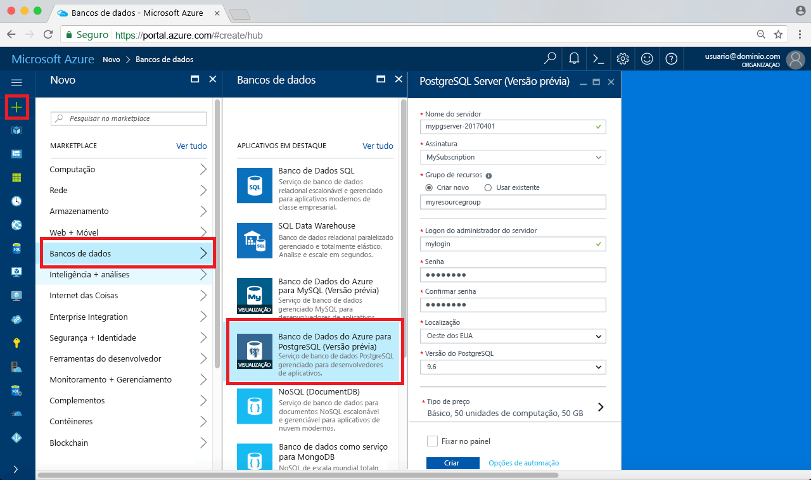
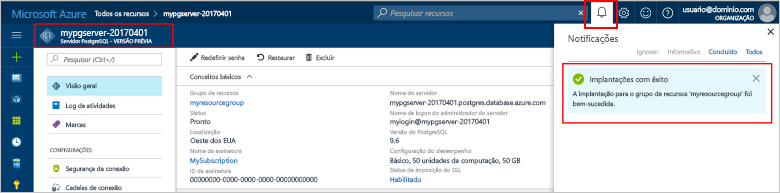
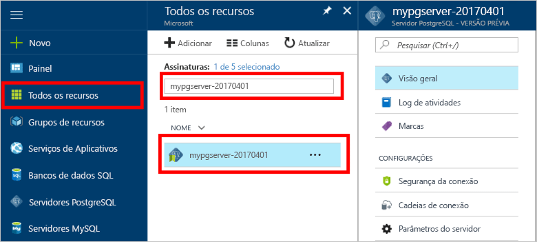
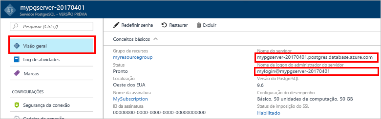

# <a name="design-your-first-azure-database-for-postgresql-using-the-azure-portal"></a><span data-ttu-id="18e02-103">Criar seu primeiro Banco de Dados do Azure para PostgreSQL usando o portal do Azure</span><span class="sxs-lookup"><span data-stu-id="18e02-103">Design your first Azure Database for PostgreSQL using the Azure portal</span></span>

<span data-ttu-id="18e02-104">O Banco de Dados do Azure para PostgreSQL é um serviço gerenciado que permite executar, gerenciar e dimensionar os bancos de dados altamente disponíveis do PostgreSQL na nuvem.</span><span class="sxs-lookup"><span data-stu-id="18e02-104">Azure Database for PostgreSQL is a managed service that enables you to run, manage, and scale highly available PostgreSQL databases in the cloud.</span></span> <span data-ttu-id="18e02-105">Usando o Portal do Azure, você pode gerenciar facilmente seu servidor e projetar um banco de dados.</span><span class="sxs-lookup"><span data-stu-id="18e02-105">Using the Azure portal, you can easily manage your server and design a database.</span></span>

<span data-ttu-id="18e02-106">Neste tutorial, você usará o Portal do Azure para aprender a:</span><span class="sxs-lookup"><span data-stu-id="18e02-106">In this tutorial, you use the Azure portal to learn how to:</span></span>
> [!div class="checklist"]
> * <span data-ttu-id="18e02-107">Criar um Banco de Dados do Azure para o PostgreSQL</span><span class="sxs-lookup"><span data-stu-id="18e02-107">Create an Azure Database for PostgreSQL</span></span>
> * <span data-ttu-id="18e02-108">Configurar o firewall do servidor</span><span class="sxs-lookup"><span data-stu-id="18e02-108">Configure the server firewall</span></span>
> * <span data-ttu-id="18e02-109">Useo utilitário [**psql**](https://www.postgresql.org/docs/9.6/static/app-psql.html) para criar um banco de dados</span><span class="sxs-lookup"><span data-stu-id="18e02-109">Use [**psql**](https://www.postgresql.org/docs/9.6/static/app-psql.html) utility to create a database</span></span>
> * <span data-ttu-id="18e02-110">Carregar dados de exemplo</span><span class="sxs-lookup"><span data-stu-id="18e02-110">Load sample data</span></span>
> * <span data-ttu-id="18e02-111">Consultar dados</span><span class="sxs-lookup"><span data-stu-id="18e02-111">Query data</span></span>
> * <span data-ttu-id="18e02-112">Atualizar dados</span><span class="sxs-lookup"><span data-stu-id="18e02-112">Update data</span></span>
> * <span data-ttu-id="18e02-113">Restaurar dados</span><span class="sxs-lookup"><span data-stu-id="18e02-113">Restore data</span></span>

## <a name="prerequisites"></a><span data-ttu-id="18e02-114">Pré-requisitos</span><span class="sxs-lookup"><span data-stu-id="18e02-114">Prerequisites</span></span>
<span data-ttu-id="18e02-115">Se você não tiver uma assinatura do Azure, crie uma conta [gratuita](https://azure.microsoft.com/free/) antes de começar.</span><span class="sxs-lookup"><span data-stu-id="18e02-115">If you don't have an Azure subscription, create a [free](https://azure.microsoft.com/free/) account before you begin.</span></span>

## <a name="log-in-to-the-azure-portal"></a><span data-ttu-id="18e02-116">Faça logon no Portal do Azure</span><span class="sxs-lookup"><span data-stu-id="18e02-116">Log in to the Azure portal</span></span>
<span data-ttu-id="18e02-117">Faça logon no [Portal do Azure](https://portal.azure.com).</span><span class="sxs-lookup"><span data-stu-id="18e02-117">Log in to the [Azure portal](https://portal.azure.com).</span></span>

## <a name="create-an-azure-database-for-postgresql"></a><span data-ttu-id="18e02-118">Criar um Banco de Dados do Azure para o PostgreSQL</span><span class="sxs-lookup"><span data-stu-id="18e02-118">Create an Azure Database for PostgreSQL</span></span>

<span data-ttu-id="18e02-119">Um Banco de Dados do Azure para PostgreSQL é criado com um conjunto definido de [recursos de computação e armazenamento](./concepts-compute-unit-and-storage.md).</span><span class="sxs-lookup"><span data-stu-id="18e02-119">An Azure Database for PostgreSQL server is created with a defined set of [compute and storage resources](./concepts-compute-unit-and-storage.md).</span></span> <span data-ttu-id="18e02-120">O servidor é criado dentro de um [Grupo de recursos do Azure](../azure-resource-manager/resource-group-overview.md).</span><span class="sxs-lookup"><span data-stu-id="18e02-120">The server is created within an [Azure resource group](../azure-resource-manager/resource-group-overview.md).</span></span>

<span data-ttu-id="18e02-121">Siga estas etapas para criar um Banco de Dados do Azure para o servidor PostgreSQL:</span><span class="sxs-lookup"><span data-stu-id="18e02-121">Follow these steps to create an Azure Database for PostgreSQL server:</span></span>
1.  <span data-ttu-id="18e02-122">Clique no botão **Novo** no canto superior esquerdo do Portal do Azure.</span><span class="sxs-lookup"><span data-stu-id="18e02-122">Click the **+ New**  button found on the upper left-hand corner of the Azure portal.</span></span>
2.  <span data-ttu-id="18e02-123">Selecione **Bancos de dados** na página **Novo** e selecione **Banco de Dados do Azure para PostgreSQL** na página **Bancos de dados**.</span><span class="sxs-lookup"><span data-stu-id="18e02-123">Select **Databases** from the **New** page, and select **Azure Database for PostgreSQL** from the **Databases** page.</span></span>
 <span data-ttu-id="18e02-124"></span><span class="sxs-lookup"><span data-stu-id="18e02-124"></span></span>

3.  <span data-ttu-id="18e02-125">Preencha o formulário de detalhes do novo servidor com as informações abaixo, conforme mostrado na imagem anterior:</span><span class="sxs-lookup"><span data-stu-id="18e02-125">Fill out the new server details form with the following information, as shown on the preceding image:</span></span>
    - <span data-ttu-id="18e02-126">Nome do servidor: **mypgserver-20170401** (o nome de um servidor é mapeado para o nome DNS e, portanto, deve ser globalmente exclusivo)</span><span class="sxs-lookup"><span data-stu-id="18e02-126">Server name: **mypgserver-20170401** (name of a server maps to DNS name and is thus required to be globally unique)</span></span> 
    - <span data-ttu-id="18e02-127">Assinatura: se você tiver várias assinaturas, escolha a que for adequada, na qual o recurso exista ou é cobrado.</span><span class="sxs-lookup"><span data-stu-id="18e02-127">Subscription: If you have multiple subscriptions, choose the appropriate subscription in which the resource exists or is billed for.</span></span>
    - <span data-ttu-id="18e02-128">Grupo de recursos: **myresourcegroup**</span><span class="sxs-lookup"><span data-stu-id="18e02-128">Resource group: **myresourcegroup**</span></span>
    - <span data-ttu-id="18e02-129">Logon e senha de administrador do servidor à sua escolha</span><span class="sxs-lookup"><span data-stu-id="18e02-129">Server admin login and password of your choice</span></span>
    - <span data-ttu-id="18e02-130">Local</span><span class="sxs-lookup"><span data-stu-id="18e02-130">Location</span></span>
    - <span data-ttu-id="18e02-131">Versão do PostgreSQL</span><span class="sxs-lookup"><span data-stu-id="18e02-131">PostgreSQL Version</span></span>

  > [!IMPORTANT]
  > <span data-ttu-id="18e02-132">O logon de administrador do servidor e a senha que você especificar aqui são necessárias para fazer logon no servidor e em seus bancos de dados mais tarde neste início rápido.</span><span class="sxs-lookup"><span data-stu-id="18e02-132">The server admin login and password that you specify here are required to log in to the server and its databases later in this quick start.</span></span> <span data-ttu-id="18e02-133">Lembre-se ou registre essas informações para o uso posterior.</span><span class="sxs-lookup"><span data-stu-id="18e02-133">Remember or record this information for later use.</span></span>

4.  <span data-ttu-id="18e02-134">Clique em **Tipo de preço** para especificar o nível de desempenho e o tipo de serviço para o novo banco de dados.</span><span class="sxs-lookup"><span data-stu-id="18e02-134">Click **Pricing tier** to specify the service tier and performance level for your new database.</span></span> <span data-ttu-id="18e02-135">Para esse início rápido, selecione a camada **Básica**, **50 Unidades de Computação** e **50 GB** de armazenamento incluído.</span><span class="sxs-lookup"><span data-stu-id="18e02-135">For this quick start, select **Basic** Tier, **50 Compute Units** and **50 GB** of included storage.</span></span>
 <span data-ttu-id="18e02-136"></span><span class="sxs-lookup"><span data-stu-id="18e02-136"></span></span>
5.  <span data-ttu-id="18e02-137">Clique em **OK**.</span><span class="sxs-lookup"><span data-stu-id="18e02-137">Click **Ok**.</span></span>
6.  <span data-ttu-id="18e02-138">Clique em **Criar** para provisionar o servidor.</span><span class="sxs-lookup"><span data-stu-id="18e02-138">Click **Create** to provision the server.</span></span> <span data-ttu-id="18e02-139">O provisionamento demora alguns minutos.</span><span class="sxs-lookup"><span data-stu-id="18e02-139">Provisioning takes a few minutes.</span></span>

  > [!TIP]
  > <span data-ttu-id="18e02-140">Marque a opção **Fixar no painel** para permitir o controle fácil de suas implantações.</span><span class="sxs-lookup"><span data-stu-id="18e02-140">Check the **Pin to dashboard** option to allow easy tracking of your deployments.</span></span>

7.  <span data-ttu-id="18e02-141">Na barra de ferramentas, clique em **Notificações** para monitorar o processo de implantação.</span><span class="sxs-lookup"><span data-stu-id="18e02-141">On the toolbar, click **Notifications** to monitor the deployment process.</span></span>
 <span data-ttu-id="18e02-142"></span><span class="sxs-lookup"><span data-stu-id="18e02-142"></span></span>
   
  <span data-ttu-id="18e02-143">Por padrão, o banco de dados **postgres** é criado em seu servidor.</span><span class="sxs-lookup"><span data-stu-id="18e02-143">By default, **postgres** database gets created under your server.</span></span> <span data-ttu-id="18e02-144">O [postgres](https://www.postgresql.org/docs/9.6/static/app-initdb.html) é um banco de dados padrão destinado a uso por usuários, utilitários e aplicativos de terceiros.</span><span class="sxs-lookup"><span data-stu-id="18e02-144">The [postgres](https://www.postgresql.org/docs/9.6/static/app-initdb.html) database is a default database meant for use by users, utilities, and third-party applications.</span></span> 

## <a name="configure-a-server-level-firewall-rule"></a><span data-ttu-id="18e02-145">Configurar uma regra de firewall no nível de servidor</span><span class="sxs-lookup"><span data-stu-id="18e02-145">Configure a server-level firewall rule</span></span>

<span data-ttu-id="18e02-146">O serviço do Banco de Dados do Azure para PostgreSQL cria um firewall no nível do servidor.</span><span class="sxs-lookup"><span data-stu-id="18e02-146">The Azure Database for PostgreSQL service creates a firewall at the server-level.</span></span> <span data-ttu-id="18e02-147">Esse firewall impede que os aplicativos e ferramentas externos se conectem ao servidor e aos bancos de dados no servidor, a menos que uma regra de firewall seja criada para abrir o firewall para endereços IP específicos.</span><span class="sxs-lookup"><span data-stu-id="18e02-147">This firewall prevents external applications and tools from connecting to the server and any databases on the server unless a firewall rule is created to open the firewall for specific IP addresses.</span></span> 

1.  <span data-ttu-id="18e02-148">Após a implantação ser concluída, clique em **Todos os Recursos** no menu esquerdo e digite o nome **mypgserver-20170401**, para pesquisar o servidor recém-criado.</span><span class="sxs-lookup"><span data-stu-id="18e02-148">After the deployment completes, click **All Resources** from the left-hand menu and type in the name **mypgserver-20170401** to search for your newly created server.</span></span> <span data-ttu-id="18e02-149">Clique no nome do servidor listado nos resultados da pesquisa.</span><span class="sxs-lookup"><span data-stu-id="18e02-149">Click the server name listed in the search result.</span></span> <span data-ttu-id="18e02-150">A página **Visão geral** do servidor é aberta e oferece outras opções de configuração.</span><span class="sxs-lookup"><span data-stu-id="18e02-150">The **Overview** page for your server opens and provides options for further configuration.</span></span>
 
 

2.  <span data-ttu-id="18e02-152">Na folha do servidor, selecione **Segurança de Conexão**.</span><span class="sxs-lookup"><span data-stu-id="18e02-152">In the server blade, select **Connection Security**.</span></span> 
3.  <span data-ttu-id="18e02-153">Clique na caixa de texto em **Nome da regra,** e adicione uma nova regra de firewall para a lista de permissões de intervalo de IP para conectividade.</span><span class="sxs-lookup"><span data-stu-id="18e02-153">Click in the text box under **Rule Name,** and add a new firewall rule to whitelist the IP range for connectivity.</span></span> <span data-ttu-id="18e02-154">Para este tutorial, vamos permitir todos os IPs digitando **Nome da regra = PermitirTodosIps**, **IP inicial = 0.0.0.0** e **IP final = 255.255.255.255** e, em seguida, clique em **Salvar**.</span><span class="sxs-lookup"><span data-stu-id="18e02-154">For this tutorial, let's allow all IPs by typing in **Rule Name = AllowAllIps**, **Start IP = 0.0.0.0** and **End IP = 255.255.255.255** and then click **Save**.</span></span> <span data-ttu-id="18e02-155">Você pode definir uma regra de firewall que abranja um intervalo de IP aos quais você possa se conectar de sua rede.</span><span class="sxs-lookup"><span data-stu-id="18e02-155">You can set a firewall rule that covers an IP range to be able to connect from your network.</span></span>
 
 

4.  <span data-ttu-id="18e02-157">Clique em **Salvar** e, em seguida, clique no **X** para fechar a página de **Segurança de Conexões**.</span><span class="sxs-lookup"><span data-stu-id="18e02-157">Click **Save** and then click the **X** to close the **Connections Security** page.</span></span>

  > [!NOTE]
  > <span data-ttu-id="18e02-158">O servidor PostgreSQL do Azure se comunica pela porta 5432.</span><span class="sxs-lookup"><span data-stu-id="18e02-158">Azure PostgreSQL server communicates over port 5432.</span></span> <span data-ttu-id="18e02-159">Se você estiver tentando se conectar de dentro de uma rede corporativa, o tráfego de saída pela porta 5432 talvez não seja permitido pelo firewall de sua rede.</span><span class="sxs-lookup"><span data-stu-id="18e02-159">If you are trying to connect from within a corporate network, outbound traffic over port 5432 may not be allowed by your network's firewall.</span></span> <span data-ttu-id="18e02-160">Se isto acontecer, você não conseguirá se conectar ao servidor de Banco de Dados SQL do Azure, a menos que o departamento de TI abra a porta 5432.</span><span class="sxs-lookup"><span data-stu-id="18e02-160">If so, you will not be able to connect to your Azure SQL Database server unless your IT department opens port 5432.</span></span>
  >


## <a name="get-the-connection-information"></a><span data-ttu-id="18e02-161">Obter informações de conexão</span><span class="sxs-lookup"><span data-stu-id="18e02-161">Get the connection information</span></span>

<span data-ttu-id="18e02-162">Quando criamos o nosso Banco de Dados do Azure para o servidor PostgreSQL, o banco de dados padrão **postgres** também foi criado.</span><span class="sxs-lookup"><span data-stu-id="18e02-162">When we created our Azure Database for PostgreSQL server, the default **postgres** database also gets created.</span></span> <span data-ttu-id="18e02-163">Para se conectar ao seu servidor de banco de dados, você precisa fornecer credenciais de acesso e informações de host.</span><span class="sxs-lookup"><span data-stu-id="18e02-163">To connect to your database server, you need to provide host information and access credentials.</span></span>

1. <span data-ttu-id="18e02-164">No menu à esquerda no Portal do Azure, clique em **Todos os recursos** e pesquise pelo servidor que você acabou de criar **mypgserver-20170401**.</span><span class="sxs-lookup"><span data-stu-id="18e02-164">From the left-hand menu in Azure portal, click **All resources** and search for the server you just created **mypgserver-20170401**.</span></span>

  

3. <span data-ttu-id="18e02-166">Clique no nome do servidor **mypgserver-20170401**.</span><span class="sxs-lookup"><span data-stu-id="18e02-166">Click the server name **mypgserver-20170401**.</span></span>
4. <span data-ttu-id="18e02-167">Selecione a página **Visão geral** do servidor.</span><span class="sxs-lookup"><span data-stu-id="18e02-167">Select the server's **Overview** page.</span></span> <span data-ttu-id="18e02-168">Anote o **Nome do servidor** e o **Nome de logon de administrador do servidor**.</span><span class="sxs-lookup"><span data-stu-id="18e02-168">Make a note of the **Server name** and **Server admin login name**.</span></span>

 


## <a name="connect-to-postgresql-database-using-psql-in-cloud-shell"></a><span data-ttu-id="18e02-170">Conectar-se ao banco de dados PostgreSQL usando psql no Cloud Shell</span><span class="sxs-lookup"><span data-stu-id="18e02-170">Connect to PostgreSQL database using psql in Cloud Shell</span></span>

<span data-ttu-id="18e02-171">Usaremos agora o utilitário de linha de comando psql para nos conectarmos ao Banco de Dados do Azure para o servidor PostgreSQL.</span><span class="sxs-lookup"><span data-stu-id="18e02-171">Let's now use the psql command-line utility to connect to the Azure Database for PostgreSQL server.</span></span> 
1. <span data-ttu-id="18e02-172">Inicie o Azure Cloud Shell por meio do ícone do terminal no painel de navegação superior.</span><span class="sxs-lookup"><span data-stu-id="18e02-172">Launch the Azure Cloud Shell via the terminal icon on the top navigation pane.</span></span>

   

2. <span data-ttu-id="18e02-174">O Azure Cloud Shell é aberto no seu navegador, permitindo que você digite comandos de bash.</span><span class="sxs-lookup"><span data-stu-id="18e02-174">The Azure Cloud Shell opens in your browser, enabling you to type bash commands.</span></span>

   

3. <span data-ttu-id="18e02-176">No prompt do Cloud Shell, conecte-se ao Banco de Dados do Azure para servidor PostgreSQL usando os comandos psql.</span><span class="sxs-lookup"><span data-stu-id="18e02-176">At the Cloud Shell prompt, connect to your Azure Database for PostgreSQL server using the psql commands.</span></span> <span data-ttu-id="18e02-177">O formato a seguir é usado para conectar-se a um Banco de Dados do Azure para servidor PostgreSQL com o utilitário [psql](https://www.postgresql.org/docs/9.6/static/app-psql.html):</span><span class="sxs-lookup"><span data-stu-id="18e02-177">The following format is used to connect to an Azure Database for PostgreSQL server with the [psql](https://www.postgresql.org/docs/9.6/static/app-psql.html) utility:</span></span>
   ```bash
   psql --host=<myserver> --port=<port> --username=<server admin login> --dbname=<database name>
   ```

   <span data-ttu-id="18e02-178">Por exemplo, o comando a seguir se conecta ao banco de dados padrão chamado **postgres** no seu servidor PostgreSQL **mypgserver-20170401.postgres.database.azure.com** usando as credenciais de acesso.</span><span class="sxs-lookup"><span data-stu-id="18e02-178">For example, the following command connects to the default database called **postgres** on your PostgreSQL server **mypgserver-20170401.postgres.database.azure.com** using access credentials.</span></span> <span data-ttu-id="18e02-179">Insira a senha de administrador do servidor quando solicitado.</span><span class="sxs-lookup"><span data-stu-id="18e02-179">Enter your server admin password when prompted.</span></span>

   ```bash
   psql --host=mypgserver-20170401.postgres.database.azure.com --port=5432 --username=mylogin@mypgserver-20170401 --dbname=postgres
   ```

## <a name="create-a-new-database"></a><span data-ttu-id="18e02-180">Criar um novo banco de dados</span><span class="sxs-lookup"><span data-stu-id="18e02-180">Create a New Database</span></span>
<span data-ttu-id="18e02-181">Quando já estiver conectado ao servidor, crie um banco de dados em branco no prompt.</span><span class="sxs-lookup"><span data-stu-id="18e02-181">Once you're connected to the server, create a blank database at the prompt.</span></span>
```bash
CREATE DATABASE mypgsqldb;
```

<span data-ttu-id="18e02-182">No prompt, execute o seguinte comando para mudar a conexão para o banco de dados **mypgsqldb** recém-criado.</span><span class="sxs-lookup"><span data-stu-id="18e02-182">At the prompt, execute the following command to switch connection to the newly created database **mypgsqldb**.</span></span>
```bash
\c mypgsqldb
```
## <a name="create-tables-in-the-database"></a><span data-ttu-id="18e02-183">Criar tabelas no banco de dados</span><span class="sxs-lookup"><span data-stu-id="18e02-183">Create tables in the database</span></span>
<span data-ttu-id="18e02-184">Agora que você sabe como se conectar ao Banco de Dados do Azure para o PostgreSQL, podemos falar sobre como concluir algumas tarefas básicas.</span><span class="sxs-lookup"><span data-stu-id="18e02-184">Now that you know how to connect to the Azure Database for PostgreSQL, we can go over how to complete some basic tasks.</span></span>

<span data-ttu-id="18e02-185">Primeiro, criamos uma tabela e a carregamos com alguns dados.</span><span class="sxs-lookup"><span data-stu-id="18e02-185">First, we can create a table and load it with some data.</span></span> <span data-ttu-id="18e02-186">Vamos criar uma tabela que rastreia informações de inventário.</span><span class="sxs-lookup"><span data-stu-id="18e02-186">Let's create a table that tracks inventory information.</span></span>
```sql
CREATE TABLE inventory (
    id serial PRIMARY KEY, 
    name VARCHAR(50), 
    quantity INTEGER
);
```

<span data-ttu-id="18e02-187">Você agora pode ver a tabela recém-criada na lista de tabelas digitando:</span><span class="sxs-lookup"><span data-stu-id="18e02-187">You can see the newly created table in the list of tabvles now by typing:</span></span>
```sql
\dt
```

## <a name="load-data-into-the-tables"></a><span data-ttu-id="18e02-188">Carregar dados nas tabelas</span><span class="sxs-lookup"><span data-stu-id="18e02-188">Load data into the tables</span></span>
<span data-ttu-id="18e02-189">Agora que temos uma tabela, podemos inserir alguns dados nela.</span><span class="sxs-lookup"><span data-stu-id="18e02-189">Now that we have a table, we can insert some data into it.</span></span> <span data-ttu-id="18e02-190">Na janela do prompt de comando aberta, execute a consulta a seguir para inserir algumas linhas de dados</span><span class="sxs-lookup"><span data-stu-id="18e02-190">At the open command prompt window, run the following query to insert some rows of data</span></span>
```sql
INSERT INTO inventory (id, name, quantity) VALUES (1, 'banana', 150); 
INSERT INTO inventory (id, name, quantity) VALUES (2, 'orange', 154);
```

<span data-ttu-id="18e02-191">Você tem agora duas linhas de dados de exemplo na tabela criada anteriormente.</span><span class="sxs-lookup"><span data-stu-id="18e02-191">You have now two rows of sample data into the table you created earlier.</span></span>

## <a name="query-and-update-the-data-in-the-tables"></a><span data-ttu-id="18e02-192">Consultar e atualizar os dados nas tabelas</span><span class="sxs-lookup"><span data-stu-id="18e02-192">Query and update the data in the tables</span></span>
<span data-ttu-id="18e02-193">Execute a seguinte consulta para recuperar as informações da tabela do banco de dados.</span><span class="sxs-lookup"><span data-stu-id="18e02-193">Execute the following query to retrieve information from the database table.</span></span> 
```sql
SELECT * FROM inventory;
```

<span data-ttu-id="18e02-194">Também é possível atualizar os dados nas tabelas</span><span class="sxs-lookup"><span data-stu-id="18e02-194">You can also update the data in the tables</span></span>
```sql
UPDATE inventory SET quantity = 200 WHERE name = 'banana';
```

<span data-ttu-id="18e02-195">A linha é atualizada à medida que você recupera os dados.</span><span class="sxs-lookup"><span data-stu-id="18e02-195">The row gets updated accordingly when you retrieve data.</span></span>
```sql
SELECT * FROM inventory;
```

## <a name="restore-data-to-a-previous-point-in-time"></a><span data-ttu-id="18e02-196">Restaurar dados para um ponto anterior no tempo</span><span class="sxs-lookup"><span data-stu-id="18e02-196">Restore data to a previous point in time</span></span>
<span data-ttu-id="18e02-197">Imagine que você excluiu acidentalmente essa tabela.</span><span class="sxs-lookup"><span data-stu-id="18e02-197">Imagine you have accidentally deleted this table.</span></span> <span data-ttu-id="18e02-198">Essa situação é algo do qual você não pode se recuperar facilmente.</span><span class="sxs-lookup"><span data-stu-id="18e02-198">This situation is something you cannot easily recover from.</span></span> <span data-ttu-id="18e02-199">O Banco de Dados do Azure para PostgreSQL permite que você volte até qualquer ponto no tempo (até os últimos 7 dias (Basic) e 35 dias (Standard)) e restaure esse ponto no tempo em um novo servidor.</span><span class="sxs-lookup"><span data-stu-id="18e02-199">Azure Database for PostgreSQL allows you to go back to any point-in-time (in the last up to 7 days (Basic) and 35 days (Standard)) and restore this point-in-time to a new server.</span></span> <span data-ttu-id="18e02-200">Use esse novo servidor para recuperar seus dados excluídos.</span><span class="sxs-lookup"><span data-stu-id="18e02-200">You can use this new server to recover your deleted data.</span></span> <span data-ttu-id="18e02-201">As etapas a seguir restauram o servidor de exemplo para um ponto anterior à adição da tabela.</span><span class="sxs-lookup"><span data-stu-id="18e02-201">The following steps restore the sample server to a point before the table was added.</span></span>

1.  <span data-ttu-id="18e02-202">Na página do Banco de Dados do Azure para PostgreSQL para o servidor, clique em **Restaurar** na barra de ferramentas.</span><span class="sxs-lookup"><span data-stu-id="18e02-202">On the Azure Database for PostgreSQL page for your server, click **Restore** on the toolbar.</span></span> <span data-ttu-id="18e02-203">A página **Restaurar** será aberta.</span><span class="sxs-lookup"><span data-stu-id="18e02-203">The **Restore** page opens.</span></span>
  <span data-ttu-id="18e02-204"></span><span class="sxs-lookup"><span data-stu-id="18e02-204"></span></span>
2.  <span data-ttu-id="18e02-205">Preencha o formulário **Restaurar** com as informações necessárias:</span><span class="sxs-lookup"><span data-stu-id="18e02-205">Fill out the **Restore** form with the required information:</span></span>

  
  - <span data-ttu-id="18e02-207">**Ponto de restauração**: selecione um ponto no tempo anterior à alteração do servidor</span><span class="sxs-lookup"><span data-stu-id="18e02-207">**Restore point**: Select a point-in-time that occurs before the server was changed</span></span>
  - <span data-ttu-id="18e02-208">**Servidor de destino**: forneça um novo nome de servidor no qual você deseja restaurar</span><span class="sxs-lookup"><span data-stu-id="18e02-208">**Target server**: Provide a new server name you want to restore to</span></span>
  - <span data-ttu-id="18e02-209">**Local**: não é possível selecionar a região; por padrão, ela é igual ao servidor de origem</span><span class="sxs-lookup"><span data-stu-id="18e02-209">**Location**: You cannot select the region, by default it is same as the source server</span></span>
  - <span data-ttu-id="18e02-210">**Tipo de preço**: não é possível alterar esse valor ao restaurar um servidor.</span><span class="sxs-lookup"><span data-stu-id="18e02-210">**Pricing tier**: You cannot change this value when restoring a server.</span></span> <span data-ttu-id="18e02-211">Ele é igual ao servidor de origem.</span><span class="sxs-lookup"><span data-stu-id="18e02-211">It is same as the source server.</span></span> 
3.  <span data-ttu-id="18e02-212">3- Clique em **OK** para restaurar o servidor [em um ponto no tempo](./howto-restore-server-portal.md) anterior à exclusão das tabelas.</span><span class="sxs-lookup"><span data-stu-id="18e02-212">Click **OK** to restore the server to [restore to a point-in-time](./howto-restore-server-portal.md) before the tables was deleted.</span></span> <span data-ttu-id="18e02-213">A restauração de um servidor para um ponto diferente no tempo cria um novo servidor duplicado como o servidor original a partir do ponto no tempo especificado por você, desde que esteja dentro do período de retenção de sua [camada de serviço](./concepts-service-tiers.md).</span><span class="sxs-lookup"><span data-stu-id="18e02-213">Restoring a server to a different point in time creates a duplicate new server as the original server as of the point in time you specify, provided that it is within the retention period for your [service tier](./concepts-service-tiers.md).</span></span>

## <a name="next-steps"></a><span data-ttu-id="18e02-214">Próximas etapas</span><span class="sxs-lookup"><span data-stu-id="18e02-214">Next Steps</span></span>
<span data-ttu-id="18e02-215">Neste tutorial, você aprendeu a usar o portal do Azure e outros utilitários para:</span><span class="sxs-lookup"><span data-stu-id="18e02-215">In this tutorial, you learned how to use the Azure portal and other utilities to:</span></span>
> [!div class="checklist"]
> * <span data-ttu-id="18e02-216">Criar um Banco de Dados do Azure para o PostgreSQL</span><span class="sxs-lookup"><span data-stu-id="18e02-216">Create an Azure Database for PostgreSQL</span></span>
> * <span data-ttu-id="18e02-217">Configurar o firewall do servidor</span><span class="sxs-lookup"><span data-stu-id="18e02-217">Configure the server firewall</span></span>
> * <span data-ttu-id="18e02-218">Useo utilitário [**psql**](https://www.postgresql.org/docs/9.6/static/app-psql.html) para criar um banco de dados</span><span class="sxs-lookup"><span data-stu-id="18e02-218">Use [**psql**](https://www.postgresql.org/docs/9.6/static/app-psql.html) utility to create a database</span></span>
> * <span data-ttu-id="18e02-219">Carregar dados de exemplo</span><span class="sxs-lookup"><span data-stu-id="18e02-219">Load sample data</span></span>
> * <span data-ttu-id="18e02-220">Consultar dados</span><span class="sxs-lookup"><span data-stu-id="18e02-220">Query data</span></span>
> * <span data-ttu-id="18e02-221">Atualizar dados</span><span class="sxs-lookup"><span data-stu-id="18e02-221">Update data</span></span>
> * <span data-ttu-id="18e02-222">Restaurar dados</span><span class="sxs-lookup"><span data-stu-id="18e02-222">Restore data</span></span>

<span data-ttu-id="18e02-223">Em seguida, aprenda como usar a CLI do Azure para executar tarefas semelhantes, consulte este tutorial: [Criar seu primeiro Banco de Dados do Azure para PostgreSQL usando a CLI do Azure](tutorial-design-database-using-azure-cli.md)</span><span class="sxs-lookup"><span data-stu-id="18e02-223">Next, learn how to use Azure CLI to do similar tasks, review this tutorial: [Design your first Azure Database for PostgreSQL using Azure CLI](tutorial-design-database-using-azure-cli.md)</span></span>
