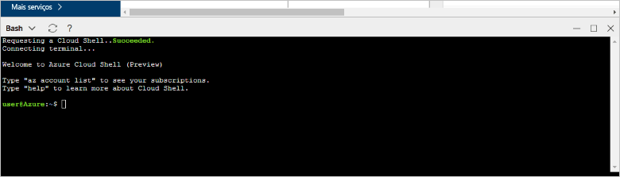

# <a name="design-your-first-azure-database-for-postgresql-using-hello-azure-portal"></a>Criar seu primeiro banco de dados do Azure para PostgreSQL usando Olá portal do Azure

Banco de dados do Azure para PostgreSQL é um serviço gerenciado que permite que você toorun, gerenciar e dimensionar os bancos de dados PostgreSQL altamente disponíveis na nuvem hello. Usando Olá portal do Azure, você pode facilmente gerenciar seu servidor e criar um banco de dados.

Neste tutorial, você usar Olá toolearn portal do Azure como para:
> [!div class="checklist"]
> * Criar um Banco de Dados do Azure para o PostgreSQL
> * Configurar o firewall do servidor de saudação
> * Use [ **psql** ](https://www.postgresql.org/docs/9.6/static/app-psql.html) toocreate utilitário um banco de dados
> * Carregar dados de exemplo
> * Consultar dados
> * Atualizar dados
> * Restaurar dados

## <a name="prerequisites"></a>Pré-requisitos
Se você não tiver uma assinatura do Azure, crie uma conta [gratuita](https://azure.microsoft.com/free/) antes de começar.

## <a name="log-in-toohello-azure-portal"></a>Faça logon no toohello portal do Azure
Faça logon no toohello [portal do Azure](https://portal.azure.com).

## <a name="create-an-azure-database-for-postgresql"></a>Criar um Banco de Dados do Azure para o PostgreSQL

Um Banco de Dados do Azure para PostgreSQL é criado com um conjunto definido de [recursos de computação e armazenamento](./concepts-compute-unit-and-storage.md). Olá servidor será criado dentro de um [grupo de recursos do Azure](../azure-resource-manager/resource-group-overview.md).

Siga essas toocreate etapas um banco de dados do Azure para o servidor PostgreSQL:
1.  Clique em Olá **+ novo** botão localizado no canto superior esquerdo de saudação do hello portal do Azure.
2.  Selecione **bancos de dados** de saudação **novo** página e selecione **banco de dados do Azure para PostgreSQL** de saudação **bancos de dados** página.
 

3.  Preencha novo formulário de detalhes de servidor Olá com hello seguintes informações, conforme mostrado na saudação anterior imagem:
    - Nome do servidor: **mypgserver 20170401** (o nome de um servidor mapeia o nome tooDNS e, portanto, é necessário toobe globalmente exclusivo) 
    - Assinatura: Se você tiver várias assinaturas, escolha assinatura de saudação apropriado no qual o recurso de saudação existe ou é cobrado por.
    - Grupo de recursos: **myresourcegroup**
    - Logon e senha de administrador do servidor à sua escolha
    - Local
    - Versão do PostgreSQL

  > [!IMPORTANT]
  > Olá administrador logon e senha que você especificar aqui são toolog necessária no servidor de toohello e seus bancos de dados mais tarde nesse início rápido. Lembre-se ou registre essas informações para o uso posterior.

4.  Clique em **preço** toospecify Olá desempenho e da camada de nível de serviço para o novo banco de dados. Para esse início rápido, selecione a camada **Básica**, **50 Unidades de Computação** e **50 GB** de armazenamento incluído.
 
5.  Clique em **OK**.
6.  Clique em **criar** tooprovision servidor de saudação. O provisionamento demora alguns minutos.

  > [!TIP]
  > Verificar Olá **toodashboard Pin** opção tooallow facilidade no rastreamento de suas implantações.

7.  Na barra de ferramentas hello, clique em **notificações** toomonitor processo de implantação de saudação.
 
   
  Por padrão, o banco de dados **postgres** é criado em seu servidor. Olá [postgres](https://www.postgresql.org/docs/9.6/static/app-initdb.html) banco de dados é um banco de dados padrão devem ser usados pelos usuários, utilitários e aplicativos de terceiros. 

## <a name="configure-a-server-level-firewall-rule"></a>Configurar uma regra de firewall no nível de servidor

saudação de banco de dados PostgreSQL serviço cria um firewall no nível de servidor de saudação. Esse firewall impede que aplicativos externos e ferramentas conectando toohello server e bancos de dados no servidor de saudação, a menos que uma regra de firewall será criada tooopen firewall de saudação para endereços IP específicos. 

1.  Após a conclusão da implantação hello, clique em **todos os recursos** do menu esquerdo hello e digite o nome de saudação **mypgserver 20170401** toosearch para seu servidor recém-criado. Clique em nome do servidor de saudação listado no resultado da pesquisa hello. Olá **visão geral** página para o servidor é aberta e oferece opções de configuração adicional.
 
 

2.  Na folha do servidor de saudação, selecione **segurança de Conexão**. 
3.  Clique na caixa de texto de saudação em **nome da regra,** e adicione um novo firewall regra toowhitelist Olá intervalo IP para conectividade. Para este tutorial, vamos permitir todos os IPs digitando **Nome da regra = PermitirTodosIps**, **IP inicial = 0.0.0.0** e **IP final = 255.255.255.255** e, em seguida, clique em **Salvar**. Você pode definir uma regra de firewall que abrange um tooconnect IP intervalo toobe capaz de sua rede.
 
 

4.  Clique em **salvar** e, em seguida, clique em Olá **X** tooclose Olá **conexões segurança** página.

  > [!NOTE]
  > O servidor PostgreSQL do Azure se comunica pela porta 5432. Se você estiver tentando tooconnect de dentro de uma rede corporativa, o tráfego de saída pela porta 5432 talvez não consigam pelo firewall da rede. Nesse caso, não será tooconnect capaz de servidor de banco de dados SQL de tooyour, a menos que o departamento de TI abre a porta 5432.
  >


## <a name="get-hello-connection-information"></a>Obter informações de conexão Olá

Quando criamos nosso banco de dados do Azure para o servidor PostgreSQL, Olá padrão **postgres** banco de dados também é criado. servidor de banco de dados de tooyour tooconnect, é necessário tooprovide credenciais de acesso e informações do host.

1. No menu esquerdo de saudação no portal do Azure, clique em **todos os recursos** e procure o servidor de saudação que você acabou de criar **mypgserver 20170401**.

  

3. Clique em nome do servidor de saudação **mypgserver 20170401**.
4. Servidor de saudação selecione **visão geral** página. Anote Olá **nome do servidor** e **nome de logon do administrador de servidor**.

 


## <a name="connect-toopostgresql-database-using-psql-in-cloud-shell"></a>Conecte-se o banco de dados de tooPostgreSQL usando psql no Shell de nuvem

Agora vamos usar Olá psql utilitário de linha de comando tooconnect toohello banco de dados para o servidor PostgreSQL. 
1. Inicie Olá Shell de nuvem do Azure através do ícone de terminal no painel de navegação superior Olá Olá.

   

2. Olá Shell de nuvem do Azure é aberto no navegador, permitindo que você tootype bash comandos.

   

3. No prompt de Shell de nuvem hello, conecte-se tooyour banco de dados para o servidor PostgreSQL usando Olá psql comandos. Olá, formato a seguir é usado tooconnect tooan banco de dados para o servidor PostgreSQL com hello [psql](https://www.postgresql.org/docs/9.6/static/app-psql.html) utilitário:
   ```bash
   psql --host=<myserver> --port=<port> --username=<server admin login> --dbname=<database name>
   ```

   Por exemplo, Olá comando a seguir conecta o banco de dados padrão toohello chamado **postgres** no seu servidor PostgreSQL **mypgserver 20170401.postgres.database.azure.com** usando as credenciais de acesso. Insira a senha de administrador do servidor quando solicitado.

   ```bash
   psql --host=mypgserver-20170401.postgres.database.azure.com --port=5432 --username=mylogin@mypgserver-20170401 --dbname=postgres
   ```

## <a name="create-a-new-database"></a>Criar um novo banco de dados
Quando estiver conectado toohello server, crie um banco de dados em branco no prompt de saudação.
```bash
CREATE DATABASE mypgsqldb;
```

No prompt de hello, execute Olá após o banco de dados do comando tooswitch conexão toohello recém-criado **mypgsqldb**.
```bash
\c mypgsqldb
```
## <a name="create-tables-in-hello-database"></a>Criar tabelas no banco de dados de saudação
Agora que você sabe como tooconnect toohello banco de dados do Azure para PostgreSQL, podemos ir como toocomplete algumas tarefas básicas.

Primeiro, criamos uma tabela e a carregamos com alguns dados. Vamos criar uma tabela que rastreia informações de inventário.
```sql
CREATE TABLE inventory (
    id serial PRIMARY KEY, 
    name VARCHAR(50), 
    quantity INTEGER
);
```

Você pode ver Olá recém-criado tabela na lista de saudação do tabvles agora digitando:
```sql
\dt
```

## <a name="load-data-into-hello-tables"></a>Carregar dados em tabelas de saudação
Agora que temos uma tabela, podemos inserir alguns dados nela. Na janela de prompt de comando aberta hello, executar Olá tooinsert de consulta a seguir algumas linhas de dados
```sql
INSERT INTO inventory (id, name, quantity) VALUES (1, 'banana', 150); 
INSERT INTO inventory (id, name, quantity) VALUES (2, 'orange', 154);
```

Você tem agora duas linhas de dados de exemplo na tabela de saudação criado anteriormente.

## <a name="query-and-update-hello-data-in-hello-tables"></a>Consultar e atualizar dados Olá nas tabelas de saudação
Execute Olá consultar tooretrieve informações a seguir da tabela de banco de dados de saudação. 
```sql
SELECT * FROM inventory;
```

Você também pode atualizar dados Olá nas tabelas de saudação
```sql
UPDATE inventory SET quantity = 200 WHERE name = 'banana';
```

linha de saudação obtém atualizada quando você recuperar dados.
```sql
SELECT * FROM inventory;
```

## <a name="restore-data-tooa-previous-point-in-time"></a>Restaurar ponto de tooa de dados anterior no tempo
Imagine que você excluiu acidentalmente essa tabela. Essa situação é algo do qual você não pode se recuperar facilmente. Banco de dados do Azure para PostgreSQL permite voltar tooany de toogo point-in-time (em Olá última too7 dias (Basic) e 35 dias (padrão)) e restaurar esse point-in-time tooa novo servidor. Você pode usar esse novo toorecover de servidor os dados excluídos. Olá etapas Olá exemplo server tooa ponto de restauração da seguir antes de saudação tabela foi adicionada.

1.  No banco de dados do Azure Olá PostgreSQL página para o servidor, clique em **restaurar** na barra de ferramentas de saudação. Olá **restaurar** página será aberta.
  
2.  Preencha Olá **restaurar** formulário com informações de saudação necessários:

  
  - **Ponto de restauração**: selecione um point-in-time que ocorre antes que o servidor de saudação foi alterado
  - **Servidor de destino**: forneça um novo nome de servidor que você deseja toorestore para
  - **Local**: não é possível selecionar região hello, por padrão, ele é igual ao servidor de origem Olá
  - **Tipo de preço**: não é possível alterar esse valor ao restaurar um servidor. É igual ao servidor de origem de saudação. 
3.  Clique em **Okey** toorestore Olá servidor muito[restauração point-in-time tooa](./howto-restore-server-portal.md) antes de tabelas de saudação foi excluído. Restaurar o servidor tooa outro ponto no tempo cria um duplicado novo servidor como servidor de saudação original como de saudação ponto no tempo especificado, desde que está dentro do período de retenção de saudação de seu [camada de serviço](./concepts-service-tiers.md).

## <a name="next-steps"></a>Próximas etapas
Neste tutorial, você aprendeu como toouse Olá portal do Azure e outros utilitários para:
> [!div class="checklist"]
> * Criar um Banco de Dados do Azure para o PostgreSQL
> * Configurar o firewall do servidor de saudação
> * Use [ **psql** ](https://www.postgresql.org/docs/9.6/static/app-psql.html) toocreate utilitário um banco de dados
> * Carregar dados de exemplo
> * Consultar dados
> * Atualizar dados
> * Restaurar dados

Em seguida, Aprenda como tarefas semelhantes do toouse CLI do Azure toodo, examine este tutorial: [criar seu primeiro banco de dados do Azure para PostgreSQL usando a CLI do Azure](tutorial-design-database-using-azure-cli.md)
