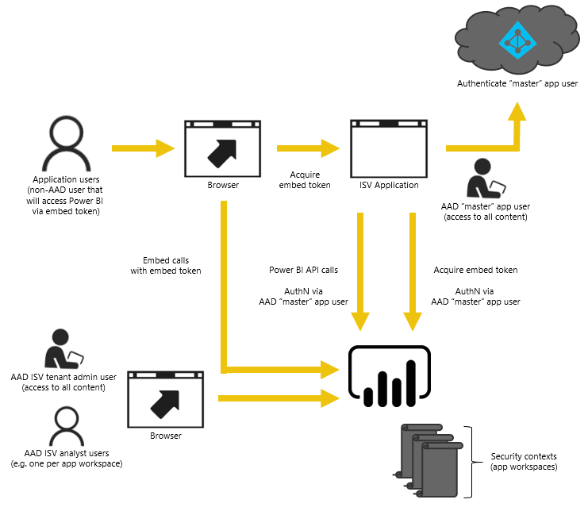

# Introdução ao Microsoft Power BI Embedded

O **Power BI Embedded** oferece a ISVs (fornecedores de software independentes) e desenvolvedores uma maneira de adicionar rapidamente objetos visuais, relatórios e painéis rapidamente a seus aplicativos usando um modelo medido em horas e baseado em capacidade.

O Power BI Embedded tem benefícios para um ISV, seus desenvolvedores e clientes. Por exemplo, o ISV pode começar a criar objetos visuais gratuitamente com o Power BI Desktop. Os ISVs podem chegar ao mercado mais rapidamente, minimizando os esforços de desenvolvimento analítico dos objetos visuais e se destacando da concorrência com experiências de dados diferentes. Os ISVs também podem optar por cobrar uma taxa extra pelo valor adicional criado com a análise incorporada.

Os desenvolvedores podem se concentrar na criação da principal competência do aplicativo em vez de gastar tempo desenvolvendo os objetos visuais ou com análises. Os desenvolvedores podem atender às demandas de relatório e painel de controle do cliente rapidamente e podem incorporar facilmente com APIs e SDKs totalmente documentadas. Por fim, ao habilitar a exploração de dados fácil de navegar em seus aplicativos, os ISVs permitem que seus clientes tomem decisões rápidas e baseadas nos dados, no contexto e com segurança, em qualquer dispositivo.

## Registrar um aplicativo no Azure Active Directory

Um aplicativo registrado no Azure AAD (Active Directory) é necessário para ser incorporado em um aplicativo personalizado. O aplicativo registrado requer que seu locatário seja um locatário do Power BI. Um locatário do Power BI significa que pelo menos um usuário na organização se inscreveu no Power BI. Ter um usuário inscrito no Power BI fará com que as APIs do Power BI sejam exibidas no aplicativo registrado.

Para saber mais sobre como registrar um aplicativo no AAD, confira [Registrar um aplicativo do Azure AD para incorporar o conteúdo do Power BI](https://powerbi.microsoft.com/documentation/powerbi-developer-register-app/).

## Incorporar o conteúdo em seu aplicativo

Depois registrá-lo no AAD, incorpore conteúdo do Power BI no seu aplicativo. Incorpore o conteúdo usando a API REST com as APIs do JavaScript.

Temos exemplos para ajudar você a começar. Para uma explicação passo a passo do exemplo, confira [Incorporar um painel, bloco ou relatório em seu aplicativo](https://powerbi.microsoft.com/documentation/powerbi-developer-embed-sample-app-owns-data/).

## Obter capacidade e passar à produção

Crie capacidade com o Power BI Embedded no Microsoft Azure para passar seu aplicativo à produção. Para saber mais sobre como criar capacidade, confira [Criar capacidade do Power BI Embedded no portal do Azure](create-capacity.md).

> [!IMPORTANT]
> Como os tokens inseridos se destinam somente a testes de desenvolvimento, o número de tokens inseridos que uma conta mestre do Power BI pode gerar é limitado. Uma [capacidade deve ser adquirida](https://docs.microsoft.com/power-bi/developer/embedded-faq#technical) para cenários de inserção de produção. Não há nenhum limite para inserir a geração de token quando uma capacidade é adquirida.

Gerencie sua capacidade no portal de administração do Power BI. Nomeie um atribuidor de espaços de trabalho para ajudá-lo com seus espaços de trabalho do aplicativo. Para saber mais, confira [Gerenciar capacidades no Power BI Premium e no Power BI Embedded](https://powerbi.microsoft.com/documentation/powerbi-admin-premium-manage/).

## Próximas etapas

Se você está pronto para criar capacidade do Power BI Embedded, confira [Criar capacidade do Power BI Embedded no portal do Azure](create-capacity.md).

Se você está procurando um passo a passo de exemplo, confira [Integrar um painel, bloco ou relatório em seu aplicativo](https://powerbi.microsoft.com/documentation/powerbi-developer-embed-sample-app-owns-data/).

Mais perguntas? [Experimentar a comunidade do Power BI](http://community.powerbi.com/)
