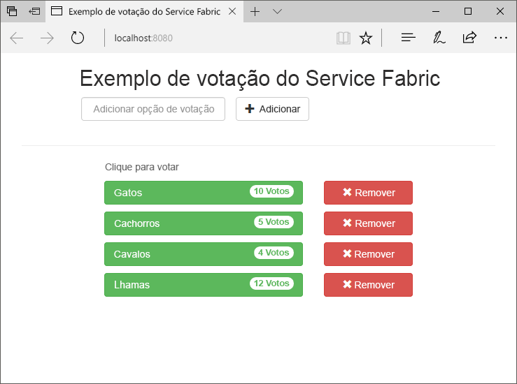
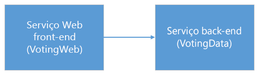
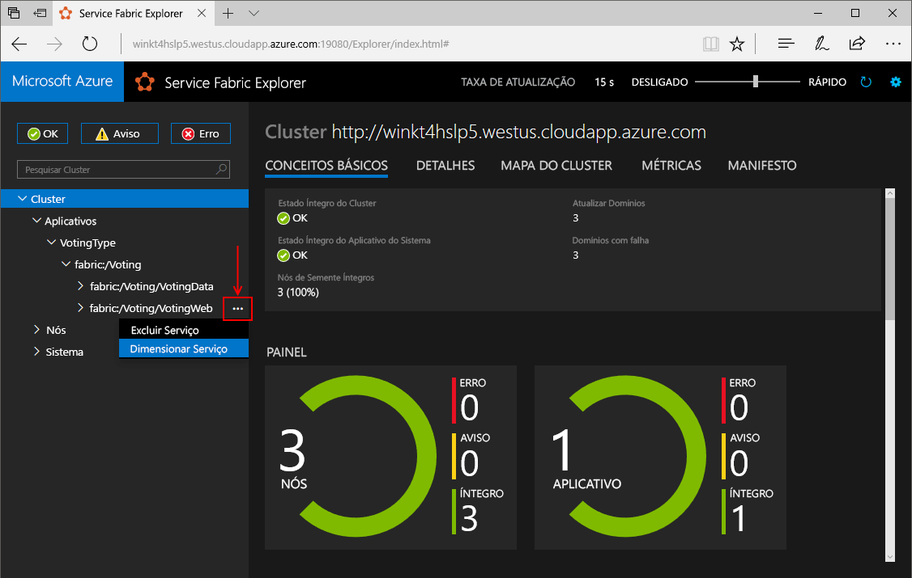
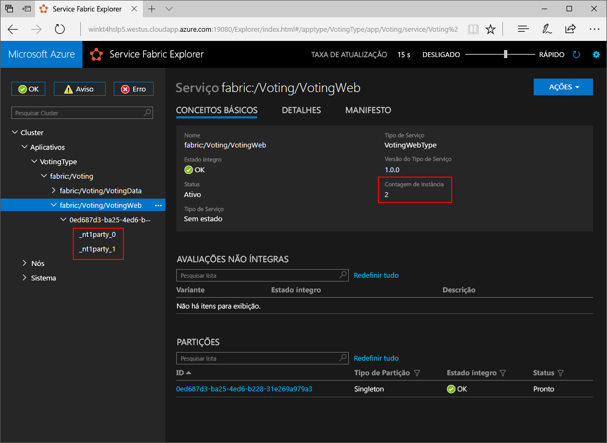
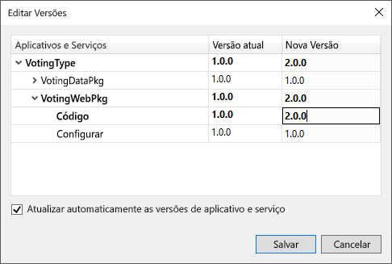
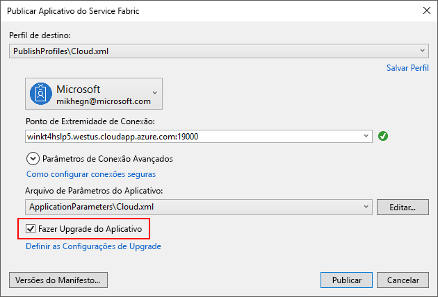
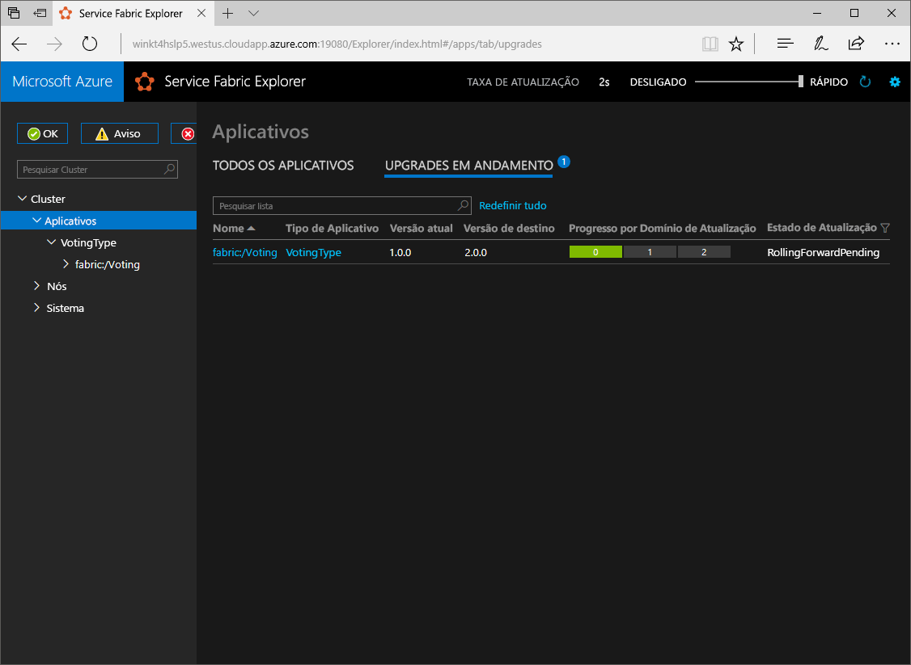

# <a name="create-a-net-service-fabric-application-in-azure"></a><span data-ttu-id="34108-103">Criar um aplicativo .NET do Service Fabric no Azure</span><span class="sxs-lookup"><span data-stu-id="34108-103">Create a .NET Service Fabric application in Azure</span></span>
<span data-ttu-id="34108-104">O Azure Service Fabric é uma plataforma de sistemas distribuídos para implantação e gerenciamento de contêineres e microsserviços escalonáveis e confiáveis.</span><span class="sxs-lookup"><span data-stu-id="34108-104">Azure Service Fabric is a distributed systems platform for deploying and managing scalable and reliable microservices and containers.</span></span> 

<span data-ttu-id="34108-105">Este guia de início rápido mostra como toodeploy seu primeiro tooService de aplicativo .NET malha.</span><span class="sxs-lookup"><span data-stu-id="34108-105">This quickstart shows how toodeploy your first .NET application tooService Fabric.</span></span> <span data-ttu-id="34108-106">Quando você terminar, você tiver um aplicativo votação com um front-end para que salva os resultados de votação em um serviço de back-end com monitoração de estado no cluster de saudação de web do ASP.NET Core.</span><span class="sxs-lookup"><span data-stu-id="34108-106">When you're finished, you have a voting application with an ASP.NET Core web front-end that saves voting results in a stateful back-end service in hello cluster.</span></span>



<span data-ttu-id="34108-108">Com esse aplicativo, você aprenderá a:</span><span class="sxs-lookup"><span data-stu-id="34108-108">Using this application you learn how to:</span></span>
> [!div class="checklist"]
> * <span data-ttu-id="34108-109">Criar um aplicativo usando o .NET e o Service Fabric</span><span class="sxs-lookup"><span data-stu-id="34108-109">Create an application using .NET and Service Fabric</span></span>
> * <span data-ttu-id="34108-110">Usar o ASP.NET Core como um front-end da Web</span><span class="sxs-lookup"><span data-stu-id="34108-110">Use ASP.NET core as a web front-end</span></span>
> * <span data-ttu-id="34108-111">Armazenar dados de aplicativo em um serviço com estado</span><span class="sxs-lookup"><span data-stu-id="34108-111">Store application data in a stateful service</span></span>
> * <span data-ttu-id="34108-112">Depurar o aplicativo localmente</span><span class="sxs-lookup"><span data-stu-id="34108-112">Debug your application locally</span></span>
> * <span data-ttu-id="34108-113">Implantar Olá aplicativo tooa cluster no Azure</span><span class="sxs-lookup"><span data-stu-id="34108-113">Deploy hello application tooa cluster in Azure</span></span>
> * <span data-ttu-id="34108-114">Aplicativo de expansão Olá em vários nós</span><span class="sxs-lookup"><span data-stu-id="34108-114">Scale-out hello application across multiple nodes</span></span>
> * <span data-ttu-id="34108-115">Executar um upgrade sem interrupção do aplicativo</span><span class="sxs-lookup"><span data-stu-id="34108-115">Perform a rolling application upgrade</span></span>

## <a name="prerequisites"></a><span data-ttu-id="34108-116">Pré-requisitos</span><span class="sxs-lookup"><span data-stu-id="34108-116">Prerequisites</span></span>
<span data-ttu-id="34108-117">toocomplete este guia de início rápido:</span><span class="sxs-lookup"><span data-stu-id="34108-117">toocomplete this quickstart:</span></span>
1. <span data-ttu-id="34108-118">[Instalar o Visual Studio de 2017](https://www.visualstudio.com/) com hello **desenvolvimento do Azure** e **desenvolvimento ASP.NET e web** cargas de trabalho.</span><span class="sxs-lookup"><span data-stu-id="34108-118">[Install Visual Studio 2017](https://www.visualstudio.com/) with hello **Azure development** and **ASP.NET and web development** workloads.</span></span>
2. [<span data-ttu-id="34108-119">Instalar o Git</span><span class="sxs-lookup"><span data-stu-id="34108-119">Install Git</span></span>](https://git-scm.com/)
3. [<span data-ttu-id="34108-120">Instalar Olá SDK do Microsoft Azure Service Fabric</span><span class="sxs-lookup"><span data-stu-id="34108-120">Install hello Microsoft Azure Service Fabric SDK</span></span>](http://www.microsoft.com/web/handlers/webpi.ashx?command=getinstallerredirect&appid=MicrosoftAzure-ServiceFabric-CoreSDK)
4. <span data-ttu-id="34108-121">Execute Olá comando tooenable Visual Studio toodeploy toohello Service Fabric cluster local a seguir:</span><span class="sxs-lookup"><span data-stu-id="34108-121">Run hello following command tooenable Visual Studio toodeploy toohello local Service Fabric cluster:</span></span>
    ```powershell
    Set-ExecutionPolicy -ExecutionPolicy Unrestricted -Force -Scope CurrentUser
    ```

## <a name="download-hello-sample"></a><span data-ttu-id="34108-122">Baixe o exemplo hello</span><span class="sxs-lookup"><span data-stu-id="34108-122">Download hello sample</span></span>
<span data-ttu-id="34108-123">Em uma janela de comando, execute Olá comando tooclone Olá aplicativo repositório tooyour local máquina de exemplo a seguir.</span><span class="sxs-lookup"><span data-stu-id="34108-123">In a command window, run hello following command tooclone hello sample app repository tooyour local machine.</span></span>
```
git clone https://github.com/Azure-Samples/service-fabric-dotnet-quickstart
```

## <a name="run-hello-application-locally"></a><span data-ttu-id="34108-124">Executar o aplicativo hello localmente</span><span class="sxs-lookup"><span data-stu-id="34108-124">Run hello application locally</span></span>
<span data-ttu-id="34108-125">Clique o ícone do Visual Studio Olá no Menu Iniciar do hello e escolha **executar como administrador**.</span><span class="sxs-lookup"><span data-stu-id="34108-125">Right-click hello Visual Studio icon in hello Start Menu and choose **Run as administrator**.</span></span> <span data-ttu-id="34108-126">Em ordem tooattach Olá depurador tooyour os serviços, você precisa toorun Visual Studio como administrador.</span><span class="sxs-lookup"><span data-stu-id="34108-126">In order tooattach hello debugger tooyour services, you need toorun Visual Studio as administrator.</span></span>

<span data-ttu-id="34108-127">Olá abrir **Voting.sln** solução do Visual Studio do repositório de saudação você clonado.</span><span class="sxs-lookup"><span data-stu-id="34108-127">Open hello **Voting.sln** Visual Studio solution from hello repository you cloned.</span></span>

<span data-ttu-id="34108-128">aplicativo de hello toodeploy, pressione **F5**.</span><span class="sxs-lookup"><span data-stu-id="34108-128">toodeploy hello application, press **F5**.</span></span>

> [!NOTE]
> <span data-ttu-id="34108-129">Olá a primeira vez que você executar e implanta o aplicativo hello, o Visual Studio cria um cluster local para depuração.</span><span class="sxs-lookup"><span data-stu-id="34108-129">hello first time you run and deploy hello application, Visual Studio creates a local cluster for debugging.</span></span> <span data-ttu-id="34108-130">Essa operação pode levar algum tempo.</span><span class="sxs-lookup"><span data-stu-id="34108-130">This operation may take some time.</span></span> <span data-ttu-id="34108-131">status de criação de cluster Olá é exibido na janela de saída do Visual Studio hello.</span><span class="sxs-lookup"><span data-stu-id="34108-131">hello cluster creation status is displayed in hello Visual Studio output window.</span></span>

<span data-ttu-id="34108-132">Quando a saudação implantação estiver concluída, iniciar um navegador e abrir essa página: `http://localhost:8080` -Olá web front-end do aplicativo hello.</span><span class="sxs-lookup"><span data-stu-id="34108-132">When hello deployment is complete, launch a browser and open this page: `http://localhost:8080` - hello web front-end of hello application.</span></span>


<span data-ttu-id="34108-134">Agora, você pode adicionar um conjunto de opções de votação e começar a votar.</span><span class="sxs-lookup"><span data-stu-id="34108-134">You can now add a set of voting options, and start taking votes.</span></span> <span data-ttu-id="34108-135">aplicativo Hello executa e armazena todos os dados no cluster do Service Fabric, sem necessidade de saudação de um banco de dados separado.</span><span class="sxs-lookup"><span data-stu-id="34108-135">hello application runs and stores all data in your Service Fabric cluster, without hello need for a separate database.</span></span>

## <a name="walk-through-hello-voting-sample-application"></a><span data-ttu-id="34108-136">Percorrer Olá votação de aplicativo de exemplo</span><span class="sxs-lookup"><span data-stu-id="34108-136">Walk through hello voting sample application</span></span>
<span data-ttu-id="34108-137">Olá votação aplicativo consiste em dois serviços:</span><span class="sxs-lookup"><span data-stu-id="34108-137">hello voting application consists of two services:</span></span>
- <span data-ttu-id="34108-138">(VotingWeb) de serviço front-end da Web – ASP.NET Core um serviço front-end, que serve a página da web de saudação e expõe web toocommunicate APIs com serviço de back-end de saudação.</span><span class="sxs-lookup"><span data-stu-id="34108-138">Web front-end service (VotingWeb)- An ASP.NET Core web front-end service, which serves hello web page and exposes web APIs toocommunicate with hello backend service.</span></span>
- <span data-ttu-id="34108-139">Serviço de back-end (VotingData)-um núcleo de ASP.NET web service, que expõe um voto de saudação do API toostore resulta em um dicionário confiável persistidos no disco.</span><span class="sxs-lookup"><span data-stu-id="34108-139">Back-end service (VotingData)- An ASP.NET Core web service, which exposes an API toostore hello vote results in a reliable dictionary persisted on disk.</span></span>



<span data-ttu-id="34108-141">Quando você vota em Olá Olá do aplicativo a seguir podem ocorrer eventos:</span><span class="sxs-lookup"><span data-stu-id="34108-141">When you vote in hello application hello following events occur:</span></span>
1. <span data-ttu-id="34108-142">Um JavaScript envia Olá voto solicitação toohello API da web no serviço de front-end de web hello como uma solicitação HTTP PUT.</span><span class="sxs-lookup"><span data-stu-id="34108-142">A JavaScript sends hello vote request toohello web API in hello web front-end service as an HTTP PUT request.</span></span>

2. <span data-ttu-id="34108-143">serviço de front-end de web Hello usa um proxy toolocate e encaminhar a um serviço de back-end de toohello de solicitação HTTP PUT.</span><span class="sxs-lookup"><span data-stu-id="34108-143">hello web front-end service uses a proxy toolocate and forward an HTTP PUT request toohello back-end service.</span></span>

3. <span data-ttu-id="34108-144">serviço de back-end Olá leva a solicitação de entrada hello e repositórios Olá atualizado resultam em um dicionário confiável, que obtém toomultiple replicado nós no cluster hello e mantidos em disco.</span><span class="sxs-lookup"><span data-stu-id="34108-144">hello back-end service takes hello incoming request, and stores hello updated result in a reliable dictionary, which gets replicated toomultiple nodes within hello cluster and persisted on disk.</span></span> <span data-ttu-id="34108-145">Dados do aplicativo hello todos os são armazenados no cluster hello, portanto, nenhum banco de dados é necessária.</span><span class="sxs-lookup"><span data-stu-id="34108-145">All hello application's data is stored in hello cluster, so no database is needed.</span></span>

## <a name="debug-in-visual-studio"></a><span data-ttu-id="34108-146">Depuração no Visual Studio</span><span class="sxs-lookup"><span data-stu-id="34108-146">Debug in Visual Studio</span></span>
<span data-ttu-id="34108-147">Ao depurar o aplicativo no Visual Studio, você usa um cluster de desenvolvimento local do Service Fabric.</span><span class="sxs-lookup"><span data-stu-id="34108-147">When debugging application in Visual Studio, you are using a local Service Fabric development cluster.</span></span> <span data-ttu-id="34108-148">Você tem Olá opção tooadjust seu cenário de tooyour experiência de depuração.</span><span class="sxs-lookup"><span data-stu-id="34108-148">You have hello option tooadjust your debugging experience tooyour scenario.</span></span> <span data-ttu-id="34108-149">Neste aplicativo, armazenamos dados em nosso serviço de back-end, usando um dicionário confiável.</span><span class="sxs-lookup"><span data-stu-id="34108-149">In this application, we store data in our back-end service, using a reliable dictionary.</span></span> <span data-ttu-id="34108-150">Visual Studio remove o aplicativo hello por padrão quando você interrompe o depurador hello.</span><span class="sxs-lookup"><span data-stu-id="34108-150">Visual Studio removes hello application per default when you stop hello debugger.</span></span> <span data-ttu-id="34108-151">Remover o aplicativo hello faz com que dados Olá Olá back-end tooalso serviço ser removido.</span><span class="sxs-lookup"><span data-stu-id="34108-151">Removing hello application causes hello data in hello back-end service tooalso be removed.</span></span> <span data-ttu-id="34108-152">dados de saudação toopersist entre as sessões de depuração, você pode alterar Olá **o modo de depuração de aplicativo** como uma propriedade no hello **votação** projeto no Visual Studio.</span><span class="sxs-lookup"><span data-stu-id="34108-152">toopersist hello data between debugging sessions, you can change hello **Application Debug Mode** as a property on hello **Voting** project in Visual Studio.</span></span>

<span data-ttu-id="34108-153">toolook o que acontece no código hello, Olá concluir as etapas a seguir:</span><span class="sxs-lookup"><span data-stu-id="34108-153">toolook at what happens in hello code, complete hello following steps:</span></span>
1. <span data-ttu-id="34108-154">Olá abrir **VotesController.cs** arquivo e defina um ponto de interrupção da API da web hello **colocar** método (linha 47 -), você pode procurar arquivo Olá Olá Gerenciador de soluções do Visual Studio.</span><span class="sxs-lookup"><span data-stu-id="34108-154">Open hello **VotesController.cs** file and set a breakpoint in hello web API's **Put** method (line 47) - You can search for hello file in hello Solution Explorer in Visual Studio.</span></span>

2. <span data-ttu-id="34108-155">Olá abrir **VoteDataController.cs** arquivo e defina um ponto de interrupção na API de web **colocar** método (linha 50).</span><span class="sxs-lookup"><span data-stu-id="34108-155">Open hello **VoteDataController.cs** file and set a breakpoint in this web API's **Put** method (line 50).</span></span>

3. <span data-ttu-id="34108-156">Voltar toohello navegador e clique em uma opção de votação ou adicionar uma nova opção de votação.</span><span class="sxs-lookup"><span data-stu-id="34108-156">Go back toohello browser and click a voting option or add a new voting option.</span></span> <span data-ttu-id="34108-157">Você atingiu o primeiro ponto de interrupção de saudação no controlador de api do Olá web front-end.</span><span class="sxs-lookup"><span data-stu-id="34108-157">You hit hello first breakpoint in hello web front-end's api controller.</span></span>
    - <span data-ttu-id="34108-158">Isso é onde Olá JavaScript no navegador Olá envia um controlador de API da web solicitação toohello no serviço de front-end de saudação.</span><span class="sxs-lookup"><span data-stu-id="34108-158">This is where hello JavaScript in hello browser sends a request toohello web API controller in hello front-end service.</span></span>
    
    

    - <span data-ttu-id="34108-160">Primeiro, construímos Olá URL toohello ReverseProxy para nosso serviço de back-end **(1)**.</span><span class="sxs-lookup"><span data-stu-id="34108-160">First we construct hello URL toohello ReverseProxy for our back-end service **(1)**.</span></span>
    - <span data-ttu-id="34108-161">Em seguida, podemos enviar Olá HTTP PUT solicitação toohello ReverseProxy **(2)**.</span><span class="sxs-lookup"><span data-stu-id="34108-161">Then we send hello HTTP PUT Request toohello ReverseProxy **(2)**.</span></span>
    - <span data-ttu-id="34108-162">Finalmente hello retornamos resposta de saudação do cliente do hello serviço back-end toohello **(3)**.</span><span class="sxs-lookup"><span data-stu-id="34108-162">Finally hello we return hello response from hello back-end service toohello client **(3)**.</span></span>

4. <span data-ttu-id="34108-163">Pressione **F5** toocontinue</span><span class="sxs-lookup"><span data-stu-id="34108-163">Press **F5** toocontinue</span></span>
    - <span data-ttu-id="34108-164">Agora você está no ponto de interrupção Olá no serviço de back-end de saudação.</span><span class="sxs-lookup"><span data-stu-id="34108-164">You are now at hello break point in hello back-end service.</span></span>
    
    

    - <span data-ttu-id="34108-166">Na primeira linha hello no método hello **(1)** estamos usando Olá `StateManager` tooget ou adicionar um dicionário confiável chamado `counts`.</span><span class="sxs-lookup"><span data-stu-id="34108-166">In hello first line in hello method **(1)** we are using hello `StateManager` tooget or add a reliable dictionary called `counts`.</span></span>
    - <span data-ttu-id="34108-167">Todas as interações com valores em um dicionário confiável exigem uma transação e, portanto, o uso da instrução **(2)** cria essa transação.</span><span class="sxs-lookup"><span data-stu-id="34108-167">All interactions with values in a reliable dictionary require a transaction, this using statement **(2)** creates that transaction.</span></span>
    - <span data-ttu-id="34108-168">Transação Olá, é, em seguida, atualizar o valor de saudação de chave relevantes Olá Olá votar na opção e confirmações Olá operação **(3)**.</span><span class="sxs-lookup"><span data-stu-id="34108-168">In hello transaction, we then update hello value of hello relevant key for hello voting option and commits hello operation **(3)**.</span></span> <span data-ttu-id="34108-169">Depois de confirmar Olá método retorna, Olá dados são atualizados no dicionário hello e replicados tooother nós no cluster de saudação.</span><span class="sxs-lookup"><span data-stu-id="34108-169">Once hello commit method returns, hello data is updated in hello dictionary and replicated tooother nodes in hello cluster.</span></span> <span data-ttu-id="34108-170">dados de saudação agora são armazenados com segurança no cluster hello e serviço de back-end de saudação pode falhar em nós de tooother, ainda com dados de saudação disponíveis.</span><span class="sxs-lookup"><span data-stu-id="34108-170">hello data is now safely stored in hello cluster, and hello back-end service can fail over tooother nodes, still having hello data available.</span></span>
5. <span data-ttu-id="34108-171">Pressione **F5** toocontinue</span><span class="sxs-lookup"><span data-stu-id="34108-171">Press **F5** toocontinue</span></span>

<span data-ttu-id="34108-172">Olá toostop depuração sessão, pressione **Shift + F5**.</span><span class="sxs-lookup"><span data-stu-id="34108-172">toostop hello debugging session, press **Shift+F5**.</span></span>

## <a name="deploy-hello-application-tooazure"></a><span data-ttu-id="34108-173">Implantar Olá aplicativo tooAzure</span><span class="sxs-lookup"><span data-stu-id="34108-173">Deploy hello application tooAzure</span></span>
<span data-ttu-id="34108-174">cluster de tooa toodeploy Olá aplicativo no Azure, você pode escolher toocreate seu próprio cluster ou use um Cluster de terceiros.</span><span class="sxs-lookup"><span data-stu-id="34108-174">toodeploy hello application tooa cluster in Azure, you can either choose toocreate your own cluster, or use a Party Cluster.</span></span>

<span data-ttu-id="34108-175">Clusters de terceiros são livres, tempo limitado clusters de malha do serviço hospedado no Azure e executar pela equipe do Service Fabric Olá em que qualquer pessoa pode implantar aplicativos e saiba mais sobre a plataforma de saudação.</span><span class="sxs-lookup"><span data-stu-id="34108-175">Party clusters are free, limited-time Service Fabric clusters hosted on Azure and run by hello Service Fabric team where anyone can deploy applications and learn about hello platform.</span></span> <span data-ttu-id="34108-176">acesso de tooget tooa de Cluster, [siga instruções Olá](http://aka.ms/tryservicefabric).</span><span class="sxs-lookup"><span data-stu-id="34108-176">tooget access tooa Party Cluster, [follow hello instructions](http://aka.ms/tryservicefabric).</span></span> 

<span data-ttu-id="34108-177">Para obter informações sobre como criar seu próprio cluster, consulte [Criar seu primeiro cluster do Service Fabric no Azure](service-fabric-get-started-azure-cluster.md).</span><span class="sxs-lookup"><span data-stu-id="34108-177">For information about creating your own cluster, see [Create your first Service Fabric cluster on Azure](service-fabric-get-started-azure-cluster.md).</span></span>

> [!Note]
> <span data-ttu-id="34108-178">serviço de front-end de web de saudação é toolisten configurado na porta 8080 para tráfego de entrada.</span><span class="sxs-lookup"><span data-stu-id="34108-178">hello web front-end service is configured toolisten on port 8080 for incoming traffic.</span></span> <span data-ttu-id="34108-179">Verifique se a porta está aberta no cluster.</span><span class="sxs-lookup"><span data-stu-id="34108-179">Make sure that port is open in your cluster.</span></span> <span data-ttu-id="34108-180">Se você estiver usando Olá Cluster de terceiros, essa porta está aberta.</span><span class="sxs-lookup"><span data-stu-id="34108-180">If you are using hello Party Cluster, this port is open.</span></span>
>

### <a name="deploy-hello-application-using-visual-studio"></a><span data-ttu-id="34108-181">Implantar o aplicativo hello usando o Visual Studio</span><span class="sxs-lookup"><span data-stu-id="34108-181">Deploy hello application using Visual Studio</span></span>
<span data-ttu-id="34108-182">Agora que o aplicativo hello estiver pronto, você pode implantar tooa cluster diretamente do Visual Studio.</span><span class="sxs-lookup"><span data-stu-id="34108-182">Now that hello application is ready, you can deploy it tooa cluster directly from Visual Studio.</span></span>

1. <span data-ttu-id="34108-183">Clique com botão direito **votação** em Olá Gerenciador de soluções e escolha **publicar**.</span><span class="sxs-lookup"><span data-stu-id="34108-183">Right-click **Voting** in hello Solution Explorer and choose **Publish**.</span></span> <span data-ttu-id="34108-184">caixa de diálogo de publicação de saudação é exibida.</span><span class="sxs-lookup"><span data-stu-id="34108-184">hello Publish dialog appears.</span></span>

    

2. <span data-ttu-id="34108-186">Digite hello ponto de extremidade de Conexão de cluster Olá Olá **ponto de extremidade de Conexão** campo e clique em **publicar**.</span><span class="sxs-lookup"><span data-stu-id="34108-186">Type in hello Connection Endpoint of hello cluster in hello **Connection Endpoint** field and click **Publish**.</span></span> <span data-ttu-id="34108-187">Ao se inscrever para Olá Cluster de terceiros, Olá ponto de extremidade de Conexão é fornecida no navegador de saudação.</span><span class="sxs-lookup"><span data-stu-id="34108-187">When signing up for hello Party Cluster, hello Connection Endpoint is provided in hello browser.</span></span> <span data-ttu-id="34108-188">– por exemplo, `winh1x87d1d.westus.cloudapp.azure.com:19000`.</span><span class="sxs-lookup"><span data-stu-id="34108-188">- for example, `winh1x87d1d.westus.cloudapp.azure.com:19000`.</span></span>

3. <span data-ttu-id="34108-189">Abra um navegador e digite no endereço de cluster Olá - por exemplo, `http://winh1x87d1d.westus.cloudapp.azure.com`.</span><span class="sxs-lookup"><span data-stu-id="34108-189">Open a browser and type in hello cluster address - for example, `http://winh1x87d1d.westus.cloudapp.azure.com`.</span></span> <span data-ttu-id="34108-190">Agora você verá o aplicativo hello em execução no cluster Olá no Azure.</span><span class="sxs-lookup"><span data-stu-id="34108-190">You should now see hello application running in hello cluster in Azure.</span></span>


## <a name="scale-applications-and-services-in-a-cluster"></a><span data-ttu-id="34108-192">Dimensionar aplicativos e serviços em um cluster</span><span class="sxs-lookup"><span data-stu-id="34108-192">Scale applications and services in a cluster</span></span>
<span data-ttu-id="34108-193">Serviços de malha do serviço podem ser facilmente dimensionados em tooaccommodate um cluster de uma alteração na carga Olá nos serviços de saudação.</span><span class="sxs-lookup"><span data-stu-id="34108-193">Service Fabric services can easily be scaled across a cluster tooaccommodate for a change in hello load on hello services.</span></span> <span data-ttu-id="34108-194">Dimensionar um serviço alterando Olá número de instâncias em execução no cluster de saudação.</span><span class="sxs-lookup"><span data-stu-id="34108-194">You scale a service by changing hello number of instances running in hello cluster.</span></span> <span data-ttu-id="34108-195">Você tem vários modos de dimensionar seus serviços usando scripts ou comandos do PowerShell ou a CLI do Service Fabric (sfctl).</span><span class="sxs-lookup"><span data-stu-id="34108-195">You have multiple ways of scaling your services, you can use scripts or commands from PowerShell or Service Fabric CLI (sfctl).</span></span> <span data-ttu-id="34108-196">Neste exemplo, estamos usando o Service Fabric Explorer.</span><span class="sxs-lookup"><span data-stu-id="34108-196">In this example, we are using Service Fabric Explorer.</span></span>

<span data-ttu-id="34108-197">Gerenciador do Service Fabric é executado em todos os clusters de malha do serviço e pode ser acessada em um navegador, navegando porta de gerenciamento de clusters HTTP toohello (19080), por exemplo, `http://winh1x87d1d.westus.cloudapp.azure.com:19080`.</span><span class="sxs-lookup"><span data-stu-id="34108-197">Service Fabric Explorer runs in all Service Fabric clusters and can be accessed from a browser, by browsing toohello clusters HTTP management port (19080), for example, `http://winh1x87d1d.westus.cloudapp.azure.com:19080`.</span></span>

<span data-ttu-id="34108-198">Olá tooscale serviço front-end da web, Olá seguintes etapas:</span><span class="sxs-lookup"><span data-stu-id="34108-198">tooscale hello web front-end service, do hello following steps:</span></span>

1. <span data-ttu-id="34108-199">Abra o Service Fabric Explorer no cluster – por exemplo, `http://winh1x87d1d.westus.cloudapp.azure.com:19080`.</span><span class="sxs-lookup"><span data-stu-id="34108-199">Open Service Fabric Explorer in your cluster - for example,`http://winh1x87d1d.westus.cloudapp.azure.com:19080`.</span></span>
2. <span data-ttu-id="34108-200">Clique em Olá reticências (três pontos) próximo toohello **malha: / votação/VotingWeb** nó no hello treeview e escolha **serviço escala**.</span><span class="sxs-lookup"><span data-stu-id="34108-200">Click on hello ellipsis (three dots) next toohello **fabric:/Voting/VotingWeb** node in hello treeview and choose **Scale Service**.</span></span>

    

    <span data-ttu-id="34108-202">Agora você pode escolher o número de saudação tooscale de instâncias do serviço de front-end de web hello.</span><span class="sxs-lookup"><span data-stu-id="34108-202">You can now choose tooscale hello number of instances of hello web front-end service.</span></span>

3. <span data-ttu-id="34108-203">Alterar o número de saudação muito**2** e clique em **serviço escala**.</span><span class="sxs-lookup"><span data-stu-id="34108-203">Change hello number too**2** and click **Scale Service**.</span></span>
4. <span data-ttu-id="34108-204">Clique em Olá **fabric: / votação/VotingWeb** nó no Olá a exibição de árvore e expanda o nó da partição hello (representado por um GUID).</span><span class="sxs-lookup"><span data-stu-id="34108-204">Click on hello **fabric:/Voting/VotingWeb** node in hello tree-view and expand hello partition node (represented by a GUID).</span></span>

    

    <span data-ttu-id="34108-206">Agora você pode ver que o serviço Olá tem duas instâncias e na exibição de árvore de saudação você ver quais nós Olá instâncias executadas em.</span><span class="sxs-lookup"><span data-stu-id="34108-206">You can now see that hello service has two instances, and in hello tree view you see which nodes hello instances run on.</span></span>

<span data-ttu-id="34108-207">Por esta tarefa de gerenciamento simples, nós o dobro recursos de saudação disponíveis para nossa carga de usuário do serviço front-end tooprocess.</span><span class="sxs-lookup"><span data-stu-id="34108-207">By this simple management task, we doubled hello resources available for our front-end service tooprocess user load.</span></span> <span data-ttu-id="34108-208">É importante toounderstand que você não precisa de várias instâncias de um toohave serviço executados de modo confiável.</span><span class="sxs-lookup"><span data-stu-id="34108-208">It's important toounderstand that you do not need multiple instances of a service toohave it run reliably.</span></span> <span data-ttu-id="34108-209">Se um serviço falhar, o Service Fabric certifica-se de que uma nova instância de serviço é executado no cluster hello.</span><span class="sxs-lookup"><span data-stu-id="34108-209">If a service fails, Service Fabric makes sure a new service instance runs in hello cluster.</span></span>

## <a name="perform-a-rolling-application-upgrade"></a><span data-ttu-id="34108-210">Executar um upgrade sem interrupção do aplicativo</span><span class="sxs-lookup"><span data-stu-id="34108-210">Perform a rolling application upgrade</span></span>
<span data-ttu-id="34108-211">Ao implantar o novo aplicativo de tooyour atualizações, Service Fabric lança Olá atualização de uma maneira segura.</span><span class="sxs-lookup"><span data-stu-id="34108-211">When deploying new updates tooyour application, Service Fabric rolls out hello update in a safe way.</span></span> <span data-ttu-id="34108-212">As atualizações sem interrupção fornecem tempo de inatividade zero durante a atualização, bem como a reversão automática no caso de erros.</span><span class="sxs-lookup"><span data-stu-id="34108-212">Rolling upgrades gives you no downtime while upgrading as well as automated rollback should errors occur.</span></span>

<span data-ttu-id="34108-213">tooupgrade Olá aplicativo, Olá a seguir:</span><span class="sxs-lookup"><span data-stu-id="34108-213">tooupgrade hello application, do hello following:</span></span>

1. <span data-ttu-id="34108-214">Olá abrir **cshtml** arquivo no Visual Studio - você pode procurar arquivo Olá Olá Gerenciador de soluções do Visual Studio.</span><span class="sxs-lookup"><span data-stu-id="34108-214">Open hello **Index.cshtml** file in Visual Studio - You can search for hello file in hello Solution Explorer in Visual Studio.</span></span>
2. <span data-ttu-id="34108-215">Alterar o título de saudação na página Olá adicionando algum texto - por exemplo.</span><span class="sxs-lookup"><span data-stu-id="34108-215">Change hello heading on hello page by adding some text - for example.</span></span>
    ```html
        <div class="col-xs-8 col-xs-offset-2 text-center">
            <h2>Service Fabric Voting Sample v2</h2>
        </div>
    ```
3. <span data-ttu-id="34108-216">Salve o arquivo hello.</span><span class="sxs-lookup"><span data-stu-id="34108-216">Save hello file.</span></span>
4. <span data-ttu-id="34108-217">Clique com botão direito **votação** em Olá Gerenciador de soluções e escolha **publicar**.</span><span class="sxs-lookup"><span data-stu-id="34108-217">Right-click **Voting** in hello Solution Explorer and choose **Publish**.</span></span> <span data-ttu-id="34108-218">caixa de diálogo de publicação de saudação é exibida.</span><span class="sxs-lookup"><span data-stu-id="34108-218">hello Publish dialog appears.</span></span>
5. <span data-ttu-id="34108-219">Clique em Olá **versão manifesto** botão toochange Olá versão Olá serviço e aplicativo.</span><span class="sxs-lookup"><span data-stu-id="34108-219">Click hello **Manifest Version** button toochange hello version of hello service and application.</span></span>
6. <span data-ttu-id="34108-220">Alterar a versão de saudação do hello **código** elemento sob **VotingWebPkg** muito "2.0.0", por exemplo e clique em **salvar**.</span><span class="sxs-lookup"><span data-stu-id="34108-220">Change hello version of hello **Code** element under **VotingWebPkg** too"2.0.0", for example, and click **Save**.</span></span>

    
7. <span data-ttu-id="34108-222">Em Olá **publicar aplicativo do Service Fabric** caixa de diálogo, caixa de seleção seleção Olá Olá atualização aplicativo e clique em **publicar**.</span><span class="sxs-lookup"><span data-stu-id="34108-222">In hello **Publish Service Fabric Application** dialog, check hello Upgrade hello Application checkbox, and click **Publish**.</span></span>

    
8. <span data-ttu-id="34108-224">Abra seu navegador e procurar o endereço de cluster toohello na porta 19080 - por exemplo, `http://winh1x87d1d.westus.cloudapp.azure.com:19080`.</span><span class="sxs-lookup"><span data-stu-id="34108-224">Open your browser and browse toohello cluster address on port 19080 - for example, `http://winh1x87d1d.westus.cloudapp.azure.com:19080`.</span></span>
9. <span data-ttu-id="34108-225">Clique em Olá **aplicativos** nó no modo de exibição de árvore Olá e, em seguida, **atualizações em andamento** no painel direito da saudação.</span><span class="sxs-lookup"><span data-stu-id="34108-225">Click on hello **Applications** node in hello tree view, and then **Upgrades in Progress** in hello right-hand pane.</span></span> <span data-ttu-id="34108-226">Você verá como a atualização de saudação acumula através de domínios de atualização de saudação em seu cluster, certificando-se de que cada domínio está íntegro antes de continuar toohello lado.</span><span class="sxs-lookup"><span data-stu-id="34108-226">You see how hello upgrade rolls through hello upgrade domains in your cluster, making sure each domain is healthy before proceeding toohello next.</span></span>
    <span data-ttu-id="34108-227"></span><span class="sxs-lookup"><span data-stu-id="34108-227"></span></span>

    <span data-ttu-id="34108-228">Service Fabric faz atualizações seguro esperando dois minutos após a atualização de serviço de saudação em cada nó no cluster hello.</span><span class="sxs-lookup"><span data-stu-id="34108-228">Service Fabric makes upgrades safe by waiting two minutes after upgrading hello service on each node in hello cluster.</span></span> <span data-ttu-id="34108-229">Espere Olá toda atualização tootake aproximadamente oito minutos.</span><span class="sxs-lookup"><span data-stu-id="34108-229">Expect hello entire update tootake approximately eight minutes.</span></span>

10. <span data-ttu-id="34108-230">Durante a execução de atualização hello, você ainda pode usar o aplicativo hello.</span><span class="sxs-lookup"><span data-stu-id="34108-230">While hello upgrade is running, you can still use hello application.</span></span> <span data-ttu-id="34108-231">Porque você tem duas instâncias do serviço de saudação em execução no cluster hello, algumas das suas solicitações podem obter uma versão atualizada do aplicativo hello, enquanto outros usuários ainda poderão obter a versão antiga do hello.</span><span class="sxs-lookup"><span data-stu-id="34108-231">Because you have two instances of hello service running in hello cluster, some of your requests may get an upgraded version of hello application, while others may still get hello old version.</span></span>

## <a name="next-steps"></a><span data-ttu-id="34108-232">Próximas etapas</span><span class="sxs-lookup"><span data-stu-id="34108-232">Next steps</span></span>
<span data-ttu-id="34108-233">Neste guia de início rápido, você aprendeu a:</span><span class="sxs-lookup"><span data-stu-id="34108-233">In this quickstart, you learned how to:</span></span>

> [!div class="checklist"]
> * <span data-ttu-id="34108-234">Criar um aplicativo usando o .NET e o Service Fabric</span><span class="sxs-lookup"><span data-stu-id="34108-234">Create an application using .NET and Service Fabric</span></span>
> * <span data-ttu-id="34108-235">Usar o ASP.NET Core como um front-end da Web</span><span class="sxs-lookup"><span data-stu-id="34108-235">Use ASP.NET core as a web front-end</span></span>
> * <span data-ttu-id="34108-236">Armazenar dados de aplicativo em um serviço com estado</span><span class="sxs-lookup"><span data-stu-id="34108-236">Store application data in a stateful service</span></span>
> * <span data-ttu-id="34108-237">Depurar o aplicativo localmente</span><span class="sxs-lookup"><span data-stu-id="34108-237">Debug your application locally</span></span>
> * <span data-ttu-id="34108-238">Implantar Olá aplicativo tooa cluster no Azure</span><span class="sxs-lookup"><span data-stu-id="34108-238">Deploy hello application tooa cluster in Azure</span></span>
> * <span data-ttu-id="34108-239">Aplicativo de expansão Olá em vários nós</span><span class="sxs-lookup"><span data-stu-id="34108-239">Scale-out hello application across multiple nodes</span></span>
> * <span data-ttu-id="34108-240">Executar um upgrade sem interrupção do aplicativo</span><span class="sxs-lookup"><span data-stu-id="34108-240">Perform a rolling application upgrade</span></span>

<span data-ttu-id="34108-241">toolearn mais sobre o serviço de malha e .NET, examine este tutorial:</span><span class="sxs-lookup"><span data-stu-id="34108-241">toolearn more about Service Fabric and .NET, take a look at this tutorial:</span></span>
> [!div class="nextstepaction"]
> [<span data-ttu-id="34108-242">Aplicativo .NET no Service Fabric</span><span class="sxs-lookup"><span data-stu-id="34108-242">.NET application on Service Fabric</span></span>](service-fabric-tutorial-create-dotnet-app.md)