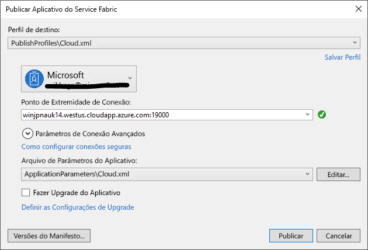

# <a name="deploy-an-application-tooa-party-cluster-in-azure"></a><span data-ttu-id="f6282-103">Implantar um aplicativo tooa de Cluster no Azure</span><span class="sxs-lookup"><span data-stu-id="f6282-103">Deploy an application tooa Party Cluster in Azure</span></span>
<span data-ttu-id="f6282-104">Este tutorial é a parte dois de uma série e mostra como toodeploy uma tooa de aplicativo do Azure Service Fabric Cluster de terceiros no Azure.</span><span class="sxs-lookup"><span data-stu-id="f6282-104">This tutorial is part two of a series and shows you how toodeploy an Azure Service Fabric application tooa Party Cluster in Azure.</span></span>

<span data-ttu-id="f6282-105">A parte dois da série de tutoriais hello, você aprenderá como:</span><span class="sxs-lookup"><span data-stu-id="f6282-105">In part two of hello tutorial series, you learn how to:</span></span>
> [!div class="checklist"]
> * <span data-ttu-id="f6282-106">Implantar um cluster remoto de tooa de aplicativo usando o Visual Studio</span><span class="sxs-lookup"><span data-stu-id="f6282-106">Deploy an application tooa remote cluster using Visual Studio</span></span>
> * <span data-ttu-id="f6282-107">Remover um aplicativo de um cluster usando o Service Fabric Explorer</span><span class="sxs-lookup"><span data-stu-id="f6282-107">Remove an application from a cluster using Service Fabric Explorer</span></span>

<span data-ttu-id="f6282-108">Nesta série de tutoriais, você aprenderá a:</span><span class="sxs-lookup"><span data-stu-id="f6282-108">In this tutorial series you learn how to:</span></span>
> [!div class="checklist"]
> * [<span data-ttu-id="f6282-109">Criar um aplicativo .NET do Service Fabric</span><span class="sxs-lookup"><span data-stu-id="f6282-109">Build a .NET Service Fabric application</span></span>](service-fabric-tutorial-create-dotnet-app.md)
> * <span data-ttu-id="f6282-110">Implantar aplicativos de saudação tooa cluster remoto</span><span class="sxs-lookup"><span data-stu-id="f6282-110">Deploy hello application tooa remote cluster</span></span>
> * [<span data-ttu-id="f6282-111">Configurar CI/CD usando o Visual Studio Team Services</span><span class="sxs-lookup"><span data-stu-id="f6282-111">Configure CI/CD using Visual Studio Team Services</span></span>](service-fabric-tutorial-deploy-app-with-cicd-vsts.md)

## <a name="prerequisites"></a><span data-ttu-id="f6282-112">Pré-requisitos</span><span class="sxs-lookup"><span data-stu-id="f6282-112">Prerequisites</span></span>
<span data-ttu-id="f6282-113">Antes de começar este tutorial:</span><span class="sxs-lookup"><span data-stu-id="f6282-113">Before you begin this tutorial:</span></span>
- <span data-ttu-id="f6282-114">Se você não tem uma assinatura do Azure, crie uma [conta gratuita](https://azure.microsoft.com/free/?WT.mc_id=A261C142F)</span><span class="sxs-lookup"><span data-stu-id="f6282-114">If you don't have an Azure subscription, create a [free account](https://azure.microsoft.com/free/?WT.mc_id=A261C142F)</span></span>
- <span data-ttu-id="f6282-115">[Instalar o Visual Studio de 2017](https://www.visualstudio.com/) e instalar Olá **desenvolvimento do Azure** e **desenvolvimento ASP.NET e web** cargas de trabalho.</span><span class="sxs-lookup"><span data-stu-id="f6282-115">[Install Visual Studio 2017](https://www.visualstudio.com/) and install hello **Azure development** and **ASP.NET and web development** workloads.</span></span>
- [<span data-ttu-id="f6282-116">Instalar Olá SDK do Service Fabric</span><span class="sxs-lookup"><span data-stu-id="f6282-116">Install hello Service Fabric SDK</span></span>](service-fabric-get-started.md)

## <a name="download-hello-voting-sample-application"></a><span data-ttu-id="f6282-117">Baixe o aplicativo de exemplo hello votação</span><span class="sxs-lookup"><span data-stu-id="f6282-117">Download hello Voting sample application</span></span>
<span data-ttu-id="f6282-118">Se você não criar aplicativo de exemplo hello voto [parte um esta série de tutoriais](service-fabric-tutorial-create-dotnet-app.md), você pode baixá-lo.</span><span class="sxs-lookup"><span data-stu-id="f6282-118">If you did not build hello Voting sample application in [part one of this tutorial series](service-fabric-tutorial-create-dotnet-app.md), you can download it.</span></span> <span data-ttu-id="f6282-119">Em uma janela de comando, execute Olá comando tooclone Olá aplicativo repositório tooyour local máquina de exemplo a seguir.</span><span class="sxs-lookup"><span data-stu-id="f6282-119">In a command window, run hello following command tooclone hello sample app repository tooyour local machine.</span></span>

```
git clone https://github.com/Azure-Samples/service-fabric-dotnet-quickstart
```

## <a name="set-up-a-party-cluster"></a><span data-ttu-id="f6282-120">Configurar um Cluster Party</span><span class="sxs-lookup"><span data-stu-id="f6282-120">Set up a Party Cluster</span></span>
<span data-ttu-id="f6282-121">Clusters de terceiros são livres, tempo limitado clusters de malha do serviço hospedado no Azure e executar pela equipe do Service Fabric Olá em que qualquer pessoa pode implantar aplicativos e saiba mais sobre a plataforma de saudação.</span><span class="sxs-lookup"><span data-stu-id="f6282-121">Party clusters are free, limited-time Service Fabric clusters hosted on Azure and run by hello Service Fabric team where anyone can deploy applications and learn about hello platform.</span></span> <span data-ttu-id="f6282-122">Gratuitamente!</span><span class="sxs-lookup"><span data-stu-id="f6282-122">For free!</span></span>

<span data-ttu-id="f6282-123">tooget acesso tooa Cluster de terceiros, visite o site de toothis: http://aka.ms/tryservicefabric e siga Olá instruções tooget tooa cluster de acesso.</span><span class="sxs-lookup"><span data-stu-id="f6282-123">tooget access tooa Party Cluster, browse toothis site: http://aka.ms/tryservicefabric and follow hello instructions tooget access tooa cluster.</span></span> <span data-ttu-id="f6282-124">É necessário um Facebook ou GitHub conta tooget acesso tooa de Cluster.</span><span class="sxs-lookup"><span data-stu-id="f6282-124">You need a Facebook or GitHub account tooget access tooa Party Cluster.</span></span>

> [!NOTE]
> <span data-ttu-id="f6282-125">Clusters de terceiros não estão protegidos, para que seus aplicativos e quaisquer dados-los podem ser tooothers visível.</span><span class="sxs-lookup"><span data-stu-id="f6282-125">Party clusters are not secured, so your applications and any data you put in them may be visible tooothers.</span></span> <span data-ttu-id="f6282-126">Não implantar qualquer coisa que você não quiser que outras pessoas toosee.</span><span class="sxs-lookup"><span data-stu-id="f6282-126">Don't deploy anything you don't want others toosee.</span></span> <span data-ttu-id="f6282-127">Ser tooread-se por meio de nossos termos de uso para todos os detalhes de saudação.</span><span class="sxs-lookup"><span data-stu-id="f6282-127">Be sure tooread over our Terms of Use for all hello details.</span></span>

## <a name="configure-hello-listening-port"></a><span data-ttu-id="f6282-128">Configurar a porta de escuta Olá</span><span class="sxs-lookup"><span data-stu-id="f6282-128">Configure hello listening port</span></span>
<span data-ttu-id="f6282-129">Quando Olá VotingWeb serviço de front-end é criada, o Visual Studio seleciona aleatoriamente uma porta para Olá serviço toolisten em.</span><span class="sxs-lookup"><span data-stu-id="f6282-129">When hello VotingWeb front-end service is created, Visual Studio randomly selects a port for hello service toolisten on.</span></span>  <span data-ttu-id="f6282-130">Olá VotingWeb serviço atua como Olá front-end para este aplicativo e aceita tráfego externo, então vamos associar esse tooa serviço fixada e saber também a porta.</span><span class="sxs-lookup"><span data-stu-id="f6282-130">hello VotingWeb service acts as hello front-end for this application and accepts external traffic, so let's bind that service tooa fixed and well-know port.</span></span> <span data-ttu-id="f6282-131">No Gerenciador de Soluções, abra *VotingWeb/PackageRoot/ServiceManifest.xml*.</span><span class="sxs-lookup"><span data-stu-id="f6282-131">In Solution Explorer, open  *VotingWeb/PackageRoot/ServiceManifest.xml*.</span></span>  <span data-ttu-id="f6282-132">Localize Olá **ponto de extremidade** recurso Olá **recursos** seção e alterar Olá **porta** too80 de valor.</span><span class="sxs-lookup"><span data-stu-id="f6282-132">Find hello **Endpoint** resource in hello **Resources** section and change hello **Port** value too80.</span></span>

```xml
<Resources>
    <Endpoints>
      <!-- This endpoint is used by hello communication listener tooobtain hello port on which too
           listen. Please note that if your service is partitioned, this port is shared with 
           replicas of different partitions that are placed in your code. -->
      <Endpoint Protocol="http" Name="ServiceEndpoint" Type="Input" Port="80" />
    </Endpoints>
  </Resources>
```

<span data-ttu-id="f6282-133">Também atualize o valor da propriedade URL do aplicativo hello no projeto de votação Olá para que um navegador da web abre a porta correta toohello quando você depurar usando 'F5'.</span><span class="sxs-lookup"><span data-stu-id="f6282-133">Also update hello Application URL property value in hello Voting project so a web browser opens toohello correct port when you debug using 'F5'.</span></span>  <span data-ttu-id="f6282-134">No Gerenciador de soluções, selecione Olá **votação** Olá projeto e atualize **URL do aplicativo** propriedade.</span><span class="sxs-lookup"><span data-stu-id="f6282-134">In Solution Explorer, select hello **Voting** project and update hello **Application URL** property.</span></span>


## <a name="deploy-hello-app-toohello-azure"></a><span data-ttu-id="f6282-136">Implantar Olá toohello de aplicativo do Azure</span><span class="sxs-lookup"><span data-stu-id="f6282-136">Deploy hello app toohello Azure</span></span>
<span data-ttu-id="f6282-137">Agora que o aplicativo hello estiver pronto, você pode implantar toohello parte Cluster direta do Visual Studio.</span><span class="sxs-lookup"><span data-stu-id="f6282-137">Now that hello application is ready, you can deploy it toohello Party Cluster direct from Visual Studio.</span></span>

1. <span data-ttu-id="f6282-138">Clique com botão direito **votação** em Olá Gerenciador de soluções e escolha **publicar**.</span><span class="sxs-lookup"><span data-stu-id="f6282-138">Right-click **Voting** in hello Solution Explorer and choose **Publish**.</span></span>

    

2. <span data-ttu-id="f6282-140">Digite hello ponto de extremidade de Conexão de saudação de Cluster em Olá **ponto de extremidade de Conexão** campo e clique em **publicar**.</span><span class="sxs-lookup"><span data-stu-id="f6282-140">Type in hello Connection Endpoint of hello Party Cluster in hello **Connection Endpoint** field and click **Publish**.</span></span>

    <span data-ttu-id="f6282-141">Depois de publicar Olá tiver terminado, você deve ser capaz de toosend um aplicativo de toohello de solicitação por meio de um navegador.</span><span class="sxs-lookup"><span data-stu-id="f6282-141">Once hello publish has finished, you should be able toosend a request toohello application via a browser.</span></span>

3. <span data-ttu-id="f6282-142">Abra preferencial navegador e digite o endereço de cluster de hello (Olá conexão ponto de extremidade sem informações de porta Olá - por exemplo, win1kw5649s.westus.cloudapp.azure.com).</span><span class="sxs-lookup"><span data-stu-id="f6282-142">Open you preferred browser and type in hello cluster address (hello connection endpoint without hello port information - for example, win1kw5649s.westus.cloudapp.azure.com).</span></span>

    <span data-ttu-id="f6282-143">Agora você deve ver Olá mesmo resultado que você viu ao executar o aplicativo hello localmente.</span><span class="sxs-lookup"><span data-stu-id="f6282-143">You should now see hello same result as you saw when running hello application locally.</span></span>

    

## <a name="remove-hello-application-from-a-cluster-using-service-fabric-explorer"></a><span data-ttu-id="f6282-145">Remover o aplicativo hello de um cluster usando o Gerenciador do Service Fabric</span><span class="sxs-lookup"><span data-stu-id="f6282-145">Remove hello application from a cluster using Service Fabric Explorer</span></span>
<span data-ttu-id="f6282-146">Gerenciador do Service Fabric é um tooexplore de interface gráfica do usuário e gerenciar aplicativos em um cluster do Service Fabric.</span><span class="sxs-lookup"><span data-stu-id="f6282-146">Service Fabric Explorer is a graphical user interface tooexplore and manage applications in a Service Fabric cluster.</span></span>

<span data-ttu-id="f6282-147">aplicativo de hello tooremove de saudação de Cluster:</span><span class="sxs-lookup"><span data-stu-id="f6282-147">tooremove hello application from hello Party Cluster:</span></span>

1. <span data-ttu-id="f6282-148">Procure toohello Service Fabric Explorer, usando o link Olá fornecido pela página de inscrição de participante Cluster hello.</span><span class="sxs-lookup"><span data-stu-id="f6282-148">Browse toohello Service Fabric Explorer, using hello link provided by hello Party Cluster sign-up page.</span></span> <span data-ttu-id="f6282-149">Por exemplo, http://win1kw5649s.westus.cloudapp.azure.com:19080/Explorer/index.html.</span><span class="sxs-lookup"><span data-stu-id="f6282-149">For example, http://win1kw5649s.westus.cloudapp.azure.com:19080/Explorer/index.html.</span></span>

2. <span data-ttu-id="f6282-150">No Gerenciador do Service Fabric, vá toohello **fabric://Voting** nó em treeview Olá no lado esquerdo da saudação.</span><span class="sxs-lookup"><span data-stu-id="f6282-150">In Service Fabric Explorer, navigate toohello **fabric://Voting** node in hello treeview on hello left-hand side.</span></span>

3. <span data-ttu-id="f6282-151">Clique em Olá **ação** botão no lado direito da saudação **Essentials** painel e escolha **excluir aplicativo**.</span><span class="sxs-lookup"><span data-stu-id="f6282-151">Click hello **Action** button in hello right-hand **Essentials** pane, and choose **Delete Application**.</span></span> <span data-ttu-id="f6282-152">Confirme excluir instância de aplicativo hello, que remove a instância de saudação do nosso aplicativo em execução no cluster de saudação.</span><span class="sxs-lookup"><span data-stu-id="f6282-152">Confirm deleting hello application instance, which removes hello instance of our application running in hello cluster.</span></span>


## <a name="remove-hello-application-type-from-a-cluster-using-service-fabric-explorer"></a><span data-ttu-id="f6282-154">Remover o tipo de aplicativo hello de um cluster usando o Gerenciador do Service Fabric</span><span class="sxs-lookup"><span data-stu-id="f6282-154">Remove hello application type from a cluster using Service Fabric Explorer</span></span>
<span data-ttu-id="f6282-155">Aplicativos são implantados como tipos de aplicativos em um cluster do Service Fabric, que permite que você toohave várias instâncias e versões do aplicativo hello em execução no cluster de saudação.</span><span class="sxs-lookup"><span data-stu-id="f6282-155">Applications are deployed as application types in a Service Fabric cluster, which enables you toohave multiple instances and versions of hello application running within hello cluster.</span></span> <span data-ttu-id="f6282-156">Depois de ter removido Olá executando a instância do nosso aplicativo, podemos também remover tipo hello, limpeza de saudação toocomplete de implantação de saudação.</span><span class="sxs-lookup"><span data-stu-id="f6282-156">After having removed hello running instance of our application, we can also remove hello type, toocomplete hello cleanup of hello deployment.</span></span>

<span data-ttu-id="f6282-157">Para obter mais informações sobre o modelo de aplicativo de saudação do Service Fabric, consulte [um aplicativo no serviço de malha de modelo](service-fabric-application-model.md).</span><span class="sxs-lookup"><span data-stu-id="f6282-157">For more information about hello application model in Service Fabric, see [Model an application in Service Fabric](service-fabric-application-model.md).</span></span>

1. <span data-ttu-id="f6282-158">Navegue toohello **VotingType** nó em treeview hello.</span><span class="sxs-lookup"><span data-stu-id="f6282-158">Navigate toohello **VotingType** node in hello treeview.</span></span>

2. <span data-ttu-id="f6282-159">Clique em Olá **ação** botão no lado direito da saudação **Essentials** painel e escolha **desconfiguração tipo**.</span><span class="sxs-lookup"><span data-stu-id="f6282-159">Click hello **Action** button in hello right-hand **Essentials** pane, and choose **Unprovision Type**.</span></span> <span data-ttu-id="f6282-160">Confirme o tipo de aplicativo hello desprovisionamento.</span><span class="sxs-lookup"><span data-stu-id="f6282-160">Confirm unprovisioning hello application type.</span></span>


<span data-ttu-id="f6282-162">Isso conclui o tutorial de saudação.</span><span class="sxs-lookup"><span data-stu-id="f6282-162">This concludes hello tutorial.</span></span>

## <a name="next-steps"></a><span data-ttu-id="f6282-163">Próximas etapas</span><span class="sxs-lookup"><span data-stu-id="f6282-163">Next steps</span></span>
<span data-ttu-id="f6282-164">Neste tutorial, você aprendeu como:</span><span class="sxs-lookup"><span data-stu-id="f6282-164">In this tutorial, you learned how to:</span></span>

> [!div class="checklist"]
> * <span data-ttu-id="f6282-165">Implantar um cluster remoto de tooa de aplicativo usando o Visual Studio</span><span class="sxs-lookup"><span data-stu-id="f6282-165">Deploy an application tooa remote cluster using Visual Studio</span></span>
> * <span data-ttu-id="f6282-166">Remover um aplicativo de um cluster usando o Service Fabric Explorer</span><span class="sxs-lookup"><span data-stu-id="f6282-166">Remove an application from a cluster using Service Fabric Explorer</span></span>

<span data-ttu-id="f6282-167">Tutorial de Avançar de toohello avançado:</span><span class="sxs-lookup"><span data-stu-id="f6282-167">Advance toohello next tutorial:</span></span>
> [!div class="nextstepaction"]
> [<span data-ttu-id="f6282-168">Configurar a integração contínua usando o Visual Studio Team Services</span><span class="sxs-lookup"><span data-stu-id="f6282-168">Set up continuous integration using Visual Studio Team Services</span></span>](service-fabric-tutorial-deploy-app-with-cicd-vsts.md)