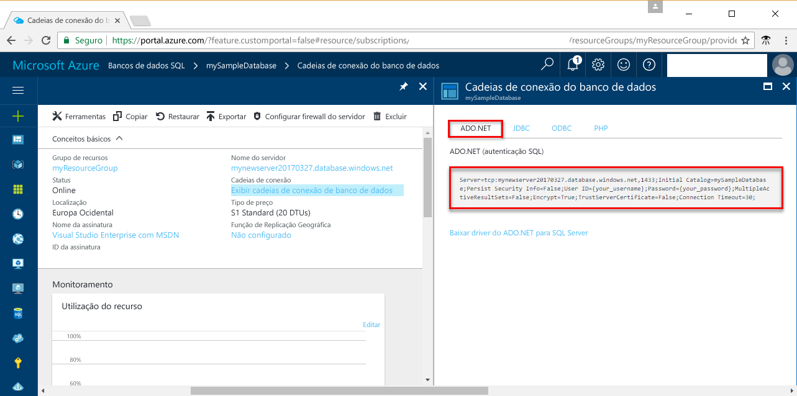

# <a name="use-net-core-c-tooquery-an-azure-sql-database"></a><span data-ttu-id="98140-103">Use o .NET Core (c#) tooquery um banco de dados do SQL Azure</span><span class="sxs-lookup"><span data-stu-id="98140-103">Use .NET Core (C#) tooquery an Azure SQL database</span></span>

<span data-ttu-id="98140-104">Este tutorial de início rápido demonstra como toouse [.NET Core](https://www.microsoft.com/net/) em Linux/Windows/macOS toocreate c# programa tooconnect tooan SQL Azure banco de dados e usar dados de tooquery de instruções Transact-SQL.</span><span class="sxs-lookup"><span data-stu-id="98140-104">This quick start tutorial demonstrates how toouse [.NET Core](https://www.microsoft.com/net/) on Windows/Linux/macOS toocreate a C# program tooconnect tooan Azure SQL database and use Transact-SQL statements tooquery data.</span></span>

## <a name="prerequisites"></a><span data-ttu-id="98140-105">Pré-requisitos</span><span class="sxs-lookup"><span data-stu-id="98140-105">Prerequisites</span></span>

<span data-ttu-id="98140-106">toocomplete rápido nesse tutorial de início, verifique se você tem o seguinte hello:</span><span class="sxs-lookup"><span data-stu-id="98140-106">toocomplete this quick start tutorial, make sure you have hello following:</span></span>

- <span data-ttu-id="98140-107">Um banco de dados SQL do Azure.</span><span class="sxs-lookup"><span data-stu-id="98140-107">An Azure SQL database.</span></span> <span data-ttu-id="98140-108">Esse início rápido usa recursos de saudação criados em um desses inícios rápidos:</span><span class="sxs-lookup"><span data-stu-id="98140-108">This quick start uses hello resources created in one of these quick starts:</span></span> 

   - [<span data-ttu-id="98140-109">Criar Banco de dados - Portal</span><span class="sxs-lookup"><span data-stu-id="98140-109">Create DB - Portal</span></span>](sql-database-get-started-portal.md)
   - [<span data-ttu-id="98140-110">Criar Banco de dados - CLI</span><span class="sxs-lookup"><span data-stu-id="98140-110">Create DB - CLI</span></span>](sql-database-get-started-cli.md)
   - [<span data-ttu-id="98140-111">Criar Banco de dados - PowerShell</span><span class="sxs-lookup"><span data-stu-id="98140-111">Create DB - PowerShell</span></span>](sql-database-get-started-powershell.md)

- <span data-ttu-id="98140-112">Um [regra de firewall de nível de servidor](sql-database-get-started-portal.md#create-a-server-level-firewall-rule) para o endereço IP público de saudação do computador Olá usar para este tutorial de início rápido.</span><span class="sxs-lookup"><span data-stu-id="98140-112">A [server-level firewall rule](sql-database-get-started-portal.md#create-a-server-level-firewall-rule) for hello public IP address of hello computer you use for this quick start tutorial.</span></span>
- <span data-ttu-id="98140-113">Você instalou [.NET Core para o sistema operacional](https://www.microsoft.com/net/core).</span><span class="sxs-lookup"><span data-stu-id="98140-113">You have installed [.NET Core for your operating system](https://www.microsoft.com/net/core).</span></span> 

## <a name="sql-server-connection-information"></a><span data-ttu-id="98140-114">Informações de conexão do servidor SQL</span><span class="sxs-lookup"><span data-stu-id="98140-114">SQL server connection information</span></span>

<span data-ttu-id="98140-115">Obter Olá conexão informações necessárias tooconnect toohello SQL Azure banco de dados.</span><span class="sxs-lookup"><span data-stu-id="98140-115">Get hello connection information needed tooconnect toohello Azure SQL database.</span></span> <span data-ttu-id="98140-116">Será necessário o nome totalmente qualificado do servidor de saudação, nome do banco de dados e informações de logon em procedimentos Avançar hello.</span><span class="sxs-lookup"><span data-stu-id="98140-116">You will need hello fully qualified server name, database name, and login information in hello next procedures.</span></span>

1. <span data-ttu-id="98140-117">Faça logon no toohello [portal do Azure](https://portal.azure.com/).</span><span class="sxs-lookup"><span data-stu-id="98140-117">Log in toohello [Azure portal](https://portal.azure.com/).</span></span>
2. <span data-ttu-id="98140-118">Selecione **bancos de dados SQL** no menu esquerdo do hello e clique em seu banco de dados em Olá **bancos de dados SQL** página.</span><span class="sxs-lookup"><span data-stu-id="98140-118">Select **SQL Databases** from hello left-hand menu, and click your database on hello **SQL databases** page.</span></span> 
3. <span data-ttu-id="98140-119">Em Olá **visão geral** página do banco de dados, examine Olá nome totalmente qualificado do servidor conforme Olá a imagem a seguir.</span><span class="sxs-lookup"><span data-stu-id="98140-119">On hello **Overview** page for your database, review hello fully qualified server name as shown in hello following image.</span></span> <span data-ttu-id="98140-120">Você pode focalizar Olá toobring de nome de servidor backup Olá **clique toocopy** opção.</span><span class="sxs-lookup"><span data-stu-id="98140-120">You can hover over hello server name toobring up hello **Click toocopy** option.</span></span> 

    

4. <span data-ttu-id="98140-122">Se você esquecer suas informações de logon do banco de dados SQL server, navegue toohello banco de dados do SQL server página tooview Olá administrador nome do servidor.</span><span class="sxs-lookup"><span data-stu-id="98140-122">If you forget your Azure SQL Database server login information, navigate toohello SQL Database server page tooview hello server admin name.</span></span> <span data-ttu-id="98140-123">Você pode redefinir a senha de saudação se necessário.</span><span class="sxs-lookup"><span data-stu-id="98140-123">You can reset hello password if necessary.</span></span>

5. <span data-ttu-id="98140-124">Clique em **Mostrar cadeias de conexão de banco de dados**.</span><span class="sxs-lookup"><span data-stu-id="98140-124">Click **Show database connection strings**.</span></span>

6. <span data-ttu-id="98140-125">Saudação de revisão completa **ADO.NET** cadeia de caracteres de conexão.</span><span class="sxs-lookup"><span data-stu-id="98140-125">Review hello complete **ADO.NET** connection string.</span></span>

    

> [!IMPORTANT]
> <span data-ttu-id="98140-127">Você deve ter uma regra de firewall em vigor para o endereço IP público de saudação do computador Olá em que você executa este tutorial.</span><span class="sxs-lookup"><span data-stu-id="98140-127">You must have a firewall rule in place for hello public IP address of hello computer on which you perform this tutorial.</span></span> <span data-ttu-id="98140-128">Se você estiver em um computador diferente ou ter um endereço IP público diferente, crie um [regra de firewall de nível de servidor usando Olá portal do Azure](sql-database-get-started-portal.md#create-a-server-level-firewall-rule).</span><span class="sxs-lookup"><span data-stu-id="98140-128">If you are on a different computer or have a different public IP address, create a [server-level firewall rule using hello Azure portal](sql-database-get-started-portal.md#create-a-server-level-firewall-rule).</span></span> 
>
  
## <a name="create-a-new-net-project"></a><span data-ttu-id="98140-129">Criar um novo projeto .NET</span><span class="sxs-lookup"><span data-stu-id="98140-129">Create a new .NET project</span></span>

1. <span data-ttu-id="98140-130">Abra um prompt de comando e crie uma pasta chamada *sqltest*.</span><span class="sxs-lookup"><span data-stu-id="98140-130">Open a command prompt and create a folder named *sqltest*.</span></span> <span data-ttu-id="98140-131">Navegue até a pasta toohello é criado e executado Olá comando a seguir:</span><span class="sxs-lookup"><span data-stu-id="98140-131">Navigate toohello folder you created and run hello following command:</span></span>

    ```
    dotnet new console
    ```

2. <span data-ttu-id="98140-132">Abra ***sqltest.csproj*** com seu editor de texto favorito e adicione SqlClient como uma dependência usando Olá código a seguir:</span><span class="sxs-lookup"><span data-stu-id="98140-132">Open ***sqltest.csproj*** with your favorite text editor and add System.Data.SqlClient as a dependency using hello following code:</span></span>

    ```xml
    <ItemGroup>
        <PackageReference Include="System.Data.SqlClient" Version="4.3.0" />
    </ItemGroup>
    ```

## <a name="insert-code-tooquery-sql-database"></a><span data-ttu-id="98140-133">Insira o banco de dados SQL do código tooquery</span><span class="sxs-lookup"><span data-stu-id="98140-133">Insert code tooquery SQL database</span></span>

1. <span data-ttu-id="98140-134">Em seu ambiente de desenvolvimento ou editor de texto favorito, abra **Program.cs**</span><span class="sxs-lookup"><span data-stu-id="98140-134">In your development environment or favorite text editor open **Program.cs**</span></span>

2. <span data-ttu-id="98140-135">Substitua o conteúdo de saudação com hello seguinte código e adicionar os valores apropriados para seu servidor, banco de dados, usuário e senha hello.</span><span class="sxs-lookup"><span data-stu-id="98140-135">Replace hello contents with hello following code and add hello appropriate values for your server, database, user, and password.</span></span>

```csharp
using System;
using System.Data.SqlClient;
using System.Text;

namespace sqltest
{
    class Program
    {
        static void Main(string[] args)
        {
            try 
            { 
                SqlConnectionStringBuilder builder = new SqlConnectionStringBuilder();
                builder.DataSource = "your_server.database.windows.net"; 
                builder.UserID = "your_user";            
                builder.Password = "your_password";     
                builder.InitialCatalog = "your_database";

                using (SqlConnection connection = new SqlConnection(builder.ConnectionString))
                {
                    Console.WriteLine("\nQuery data example:");
                    Console.WriteLine("=========================================\n");
                    
                    connection.Open();       
                    StringBuilder sb = new StringBuilder();
                    sb.Append("SELECT TOP 20 pc.Name as CategoryName, p.name as ProductName ");
                    sb.Append("FROM [SalesLT].[ProductCategory] pc ");
                    sb.Append("JOIN [SalesLT].[Product] p ");
                    sb.Append("ON pc.productcategoryid = p.productcategoryid;");
                    String sql = sb.ToString();

                    using (SqlCommand command = new SqlCommand(sql, connection))
                    {
                        using (SqlDataReader reader = command.ExecuteReader())
                        {
                            while (reader.Read())
                            {
                                Console.WriteLine("{0} {1}", reader.GetString(0), reader.GetString(1));
                            }
                        }
                    }                    
                }
            }
            catch (SqlException e)
            {
                Console.WriteLine(e.ToString());
            }
            Console.ReadLine();
        }
    }
}
```

## <a name="run-hello-code"></a><span data-ttu-id="98140-136">Executar o código de saudação</span><span class="sxs-lookup"><span data-stu-id="98140-136">Run hello code</span></span>

1. <span data-ttu-id="98140-137">No prompt de comando hello, execute Olá comandos a seguir:</span><span class="sxs-lookup"><span data-stu-id="98140-137">At hello command prompt, run hello following commands:</span></span>

   ```csharp
   dotnet restore
   dotnet run
   ```

2. <span data-ttu-id="98140-138">Verifique se que 20 linhas de saudação principais são retornadas e, em seguida, feche a janela do aplicativo hello.</span><span class="sxs-lookup"><span data-stu-id="98140-138">Verify that hello top 20 rows are returned and then close hello application window.</span></span>


## <a name="next-steps"></a><span data-ttu-id="98140-139">Próximas etapas</span><span class="sxs-lookup"><span data-stu-id="98140-139">Next steps</span></span>

- <span data-ttu-id="98140-140">[Introdução ao .NET Core no Windows/Linux/macOS usando a linha de comando Olá](/dotnet/core/tutorials/using-with-xplat-cli).</span><span class="sxs-lookup"><span data-stu-id="98140-140">[Getting started with .NET Core on Windows/Linux/macOS using hello command line](/dotnet/core/tutorials/using-with-xplat-cli).</span></span>
- <span data-ttu-id="98140-141">Saiba como muito[se conectar e consultar um banco de dados do SQL Azure usando Olá .NET framework e Visual Studio](sql-database-connect-query-dotnet-visual-studio.md).</span><span class="sxs-lookup"><span data-stu-id="98140-141">Learn how too[connect and query an Azure SQL database using hello .NET framework and Visual Studio](sql-database-connect-query-dotnet-visual-studio.md).</span></span>  
- <span data-ttu-id="98140-142">Saiba como muito[criar seu primeiro banco de dados SQL do Azure usando o SSMS](sql-database-design-first-database.md) ou [criar seu primeiro banco de dados SQL do Azure usando o .NET](sql-database-design-first-database-csharp.md).</span><span class="sxs-lookup"><span data-stu-id="98140-142">Learn how too[Design your first Azure SQL database using SSMS](sql-database-design-first-database.md) or [Design your first Azure SQL database using .NET](sql-database-design-first-database-csharp.md).</span></span>
- <span data-ttu-id="98140-143">Para saber mais sobre o .NET, veja a [documentação do .NET](https://docs.microsoft.com/dotnet/).</span><span class="sxs-lookup"><span data-stu-id="98140-143">For more information about .NET, see [.NET documentation](https://docs.microsoft.com/dotnet/).</span></span>
