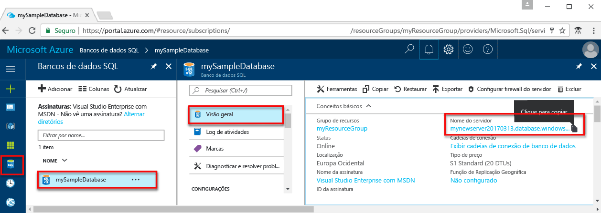

# <a name="use-java-tooquery-an-azure-sql-database"></a><span data-ttu-id="5fecf-103">Usar Java tooquery um banco de dados do SQL Azure</span><span class="sxs-lookup"><span data-stu-id="5fecf-103">Use Java tooquery an Azure SQL database</span></span>

<span data-ttu-id="5fecf-104">Este guia rápido demonstra como toouse [Java](https://docs.microsoft.com/sql/connect/jdbc/microsoft-jdbc-driver-for-sql-server) tooconnect tooan SQL do Azure do banco de dados e, em seguida, usar dados de tooquery de instruções Transact-SQL.</span><span class="sxs-lookup"><span data-stu-id="5fecf-104">This quick start demonstrates how toouse [Java](https://docs.microsoft.com/sql/connect/jdbc/microsoft-jdbc-driver-for-sql-server) tooconnect tooan Azure SQL database and then use Transact-SQL statements tooquery data.</span></span>

## <a name="prerequisites"></a><span data-ttu-id="5fecf-105">Pré-requisitos</span><span class="sxs-lookup"><span data-stu-id="5fecf-105">Prerequisites</span></span>

<span data-ttu-id="5fecf-106">toocomplete rápida nesse tutorial de início, certifique-se de ter Olá pré-requisitos a seguir:</span><span class="sxs-lookup"><span data-stu-id="5fecf-106">toocomplete this quick start tutorial, make sure you have hello following prerequisites:</span></span>

- <span data-ttu-id="5fecf-107">Um banco de dados SQL do Azure.</span><span class="sxs-lookup"><span data-stu-id="5fecf-107">An Azure SQL database.</span></span> <span data-ttu-id="5fecf-108">Esse início rápido usa recursos de saudação criados em um desses inícios rápidos:</span><span class="sxs-lookup"><span data-stu-id="5fecf-108">This quick start uses hello resources created in one of these quick starts:</span></span> 

   - [<span data-ttu-id="5fecf-109">Criar Banco de dados - Portal</span><span class="sxs-lookup"><span data-stu-id="5fecf-109">Create DB - Portal</span></span>](sql-database-get-started-portal.md)
   - [<span data-ttu-id="5fecf-110">Criar Banco de dados - CLI</span><span class="sxs-lookup"><span data-stu-id="5fecf-110">Create DB - CLI</span></span>](sql-database-get-started-cli.md)
   - [<span data-ttu-id="5fecf-111">Criar Banco de dados - PowerShell</span><span class="sxs-lookup"><span data-stu-id="5fecf-111">Create DB - PowerShell</span></span>](sql-database-get-started-powershell.md)

- <span data-ttu-id="5fecf-112">Um [regra de firewall de nível de servidor](sql-database-get-started-portal.md#create-a-server-level-firewall-rule) para o endereço IP público de saudação do computador Olá usar para este tutorial de início rápido.</span><span class="sxs-lookup"><span data-stu-id="5fecf-112">A [server-level firewall rule](sql-database-get-started-portal.md#create-a-server-level-firewall-rule) for hello public IP address of hello computer you use for this quick start tutorial.</span></span>

- <span data-ttu-id="5fecf-113">Você instalou o Java e o software relacionado para seu sistema operacional.</span><span class="sxs-lookup"><span data-stu-id="5fecf-113">You have installed Java and related software for your operating system.</span></span>

    - <span data-ttu-id="5fecf-114">**MacOS**: instale o Homebrew e o Java e, em seguida, instale o Maven.</span><span class="sxs-lookup"><span data-stu-id="5fecf-114">**MacOS**: Install Homebrew and Java, and then install Maven.</span></span> <span data-ttu-id="5fecf-115">Veja a [Etapa 1.2 e 1.3](https://www.microsoft.com/sql-server/developer-get-started/java/mac/).</span><span class="sxs-lookup"><span data-stu-id="5fecf-115">See [Step 1.2 and 1.3](https://www.microsoft.com/sql-server/developer-get-started/java/mac/).</span></span>
    - <span data-ttu-id="5fecf-116">**Ubuntu**: instalar Olá Java Development Kit e Maven.</span><span class="sxs-lookup"><span data-stu-id="5fecf-116">**Ubuntu**:  Install hello Java Development Kit, and install Maven.</span></span> <span data-ttu-id="5fecf-117">Confira as [etapas 1.2, 1.3 e 1.4](https://www.microsoft.com/sql-server/developer-get-started/java/ubuntu/).</span><span class="sxs-lookup"><span data-stu-id="5fecf-117">See [Step 1.2, 1.3, and 1.4](https://www.microsoft.com/sql-server/developer-get-started/java/ubuntu/).</span></span>
    - <span data-ttu-id="5fecf-118">**Windows**: instalar Olá Java Development Kit e Maven.</span><span class="sxs-lookup"><span data-stu-id="5fecf-118">**Windows**: Install hello Java Development Kit, and Maven.</span></span> <span data-ttu-id="5fecf-119">Veja a [Etapa 1.2 e 1.3](https://www.microsoft.com/sql-server/developer-get-started/java/windows/).</span><span class="sxs-lookup"><span data-stu-id="5fecf-119">See [Step 1.2 and 1.3](https://www.microsoft.com/sql-server/developer-get-started/java/windows/).</span></span>    

## <a name="sql-server-connection-information"></a><span data-ttu-id="5fecf-120">Informações de conexão do servidor SQL</span><span class="sxs-lookup"><span data-stu-id="5fecf-120">SQL server connection information</span></span>

<span data-ttu-id="5fecf-121">Obter Olá conexão informações necessárias tooconnect toohello SQL Azure banco de dados.</span><span class="sxs-lookup"><span data-stu-id="5fecf-121">Get hello connection information needed tooconnect toohello Azure SQL database.</span></span> <span data-ttu-id="5fecf-122">Será necessário o nome totalmente qualificado do servidor de saudação, nome do banco de dados e informações de logon em procedimentos Avançar hello.</span><span class="sxs-lookup"><span data-stu-id="5fecf-122">You will need hello fully qualified server name, database name, and login information in hello next procedures.</span></span>

1. <span data-ttu-id="5fecf-123">Faça logon no toohello [portal do Azure](https://portal.azure.com/).</span><span class="sxs-lookup"><span data-stu-id="5fecf-123">Log in toohello [Azure portal](https://portal.azure.com/).</span></span>
2. <span data-ttu-id="5fecf-124">Selecione **bancos de dados SQL** no menu esquerdo do hello e clique em seu banco de dados em Olá **bancos de dados SQL** página.</span><span class="sxs-lookup"><span data-stu-id="5fecf-124">Select **SQL Databases** from hello left-hand menu, and click your database on hello **SQL databases** page.</span></span> 
3. <span data-ttu-id="5fecf-125">Em Olá **visão geral** para seu banco de dados, examine o nome totalmente qualificado do servidor de saudação conforme Olá a imagem a seguir: você pode focalizar Olá toobring de nome de servidor backup Olá **clique toocopy** opção.</span><span class="sxs-lookup"><span data-stu-id="5fecf-125">On hello **Overview** page for your database, review hello fully qualified server name as shown in hello following image: You can hover over hello server name toobring up hello **Click toocopy** option.</span></span>  

    

4. <span data-ttu-id="5fecf-127">Se você esquecer suas informações de logon de servidor, navegue toohello banco de dados do SQL server página tooview Olá administrador nome do servidor.</span><span class="sxs-lookup"><span data-stu-id="5fecf-127">If you forget your server login information, navigate toohello SQL Database server page tooview hello server admin name.</span></span>  <span data-ttu-id="5fecf-128">Se necessário, Olá redefinição da senha.</span><span class="sxs-lookup"><span data-stu-id="5fecf-128">If necessary, reset hello password.</span></span>     

## <a name="create-maven-project-and-dependencies"></a><span data-ttu-id="5fecf-129">**Como criar dependências e projeto Maven**</span><span class="sxs-lookup"><span data-stu-id="5fecf-129">**Create Maven project and dependencies**</span></span>
1. <span data-ttu-id="5fecf-130">De Olá terminal, crie um novo projeto de Maven chamado **sqltest**.</span><span class="sxs-lookup"><span data-stu-id="5fecf-130">From hello terminal, create a new Maven project called **sqltest**.</span></span> 

   ```bash
   mvn archetype:generate "-DgroupId=com.sqldbsamples" "-DartifactId=sqltest" "-DarchetypeArtifactId=maven-archetype-quickstart" "-Dversion=1.0.0"
   ```

2. <span data-ttu-id="5fecf-131">Digite **Y** quando solicitado.</span><span class="sxs-lookup"><span data-stu-id="5fecf-131">Enter **Y** when prompted.</span></span>
3. <span data-ttu-id="5fecf-132">Altere o diretório muito**sqltest** e abra ***pom.xml*** com seu editor de texto favorito.</span><span class="sxs-lookup"><span data-stu-id="5fecf-132">Change directory too**sqltest** and open ***pom.xml*** with your favorite text editor.</span></span>  <span data-ttu-id="5fecf-133">Adicionar Olá **Microsoft JDBC Driver para SQL Server** Olá dependências do projeto tooyour usando o seguinte código:</span><span class="sxs-lookup"><span data-stu-id="5fecf-133">Add hello **Microsoft JDBC Driver for SQL Server** tooyour project's dependencies using hello following code:</span></span>

   ```xml
   <dependency>
       <groupId>com.microsoft.sqlserver</groupId>
       <artifactId>mssql-jdbc</artifactId>
       <version>6.2.1.jre8</version>
   </dependency>
   ```

4. <span data-ttu-id="5fecf-134">Também na ***pom.xml***, adicionar Olá projeto tooyour de propriedades a seguir.</span><span class="sxs-lookup"><span data-stu-id="5fecf-134">Also in ***pom.xml***, add hello following properties tooyour project.</span></span>  <span data-ttu-id="5fecf-135">Se você não tiver uma seção de propriedades, você pode adicioná-lo depois de dependências de saudação.</span><span class="sxs-lookup"><span data-stu-id="5fecf-135">If you don't have a properties section, you can add it after hello dependencies.</span></span>

   ```xml
   <properties>
       <maven.compiler.source>1.8</maven.compiler.source>
       <maven.compiler.target>1.8</maven.compiler.target>
   </properties>
   ```

5. <span data-ttu-id="5fecf-136">Salve e feche o ***pom.xml***.</span><span class="sxs-lookup"><span data-stu-id="5fecf-136">Save and close ***pom.xml***.</span></span>

## <a name="insert-code-tooquery-sql-database"></a><span data-ttu-id="5fecf-137">Insira o banco de dados SQL do código tooquery</span><span class="sxs-lookup"><span data-stu-id="5fecf-137">Insert code tooquery SQL database</span></span>

1. <span data-ttu-id="5fecf-138">Você já deve ter um arquivo chamado ***App.java*** no seu projeto Maven localizado em:  ..\sqltest\src\main\java\com\sqlsamples\App.java</span><span class="sxs-lookup"><span data-stu-id="5fecf-138">You should already have a file called ***App.java*** in your Maven project located at:  ..\sqltest\src\main\java\com\sqlsamples\App.java</span></span>

2. <span data-ttu-id="5fecf-139">Abra o arquivo hello e substituir seu conteúdo com os seguintes Olá código e adicione os valores apropriados para seu servidor, banco de dados, usuário e senha hello.</span><span class="sxs-lookup"><span data-stu-id="5fecf-139">Open hello file and replace its contents with hello following code and add hello appropriate values for your server, database, user, and password.</span></span>

   ```java
   package com.sqldbsamples;

   import java.sql.Connection;
   import java.sql.Statement;
   import java.sql.PreparedStatement;
   import java.sql.ResultSet;
   import java.sql.DriverManager;

   public class App {

    public static void main(String[] args) {
    
        // Connect toodatabase
           String hostName = "your_server.database.windows.net";
           String dbName = "your_database";
           String user = "your_username";
           String password = "your_password";
           String url = String.format("jdbc:sqlserver://%s:1433;database=%s;user=%s;password=%s;encrypt=true;hostNameInCertificate=*.database.windows.net;loginTimeout=30;", hostName, dbName, user, password);
           Connection connection = null;

           try {
                   connection = DriverManager.getConnection(url);
                   String schema = connection.getSchema();
                   System.out.println("Successful connection - Schema: " + schema);

                   System.out.println("Query data example:");
                   System.out.println("=========================================");

                   // Create and execute a SELECT SQL statement.
                   String selectSql = "SELECT TOP 20 pc.Name as CategoryName, p.name as ProductName " 
                       + "FROM [SalesLT].[ProductCategory] pc "  
                       + "JOIN [SalesLT].[Product] p ON pc.productcategoryid = p.productcategoryid";
                
                   try (Statement statement = connection.createStatement();
                       ResultSet resultSet = statement.executeQuery(selectSql)) {

                           // Print results from select statement
                           System.out.println("Top 20 categories:");
                           while (resultSet.next())
                           {
                               System.out.println(resultSet.getString(1) + " "
                                   + resultSet.getString(2));
                           }
                    connection.close();
                   }                   
           }
           catch (Exception e) {
                   e.printStackTrace();
           }
       }
   }
   ```

## <a name="run-hello-code"></a><span data-ttu-id="5fecf-140">Executar o código de saudação</span><span class="sxs-lookup"><span data-stu-id="5fecf-140">Run hello code</span></span>

1. <span data-ttu-id="5fecf-141">No prompt de comando hello, execute Olá comandos a seguir:</span><span class="sxs-lookup"><span data-stu-id="5fecf-141">At hello command prompt, run hello following commands:</span></span>

   ```bash
   mvn package
   mvn -q exec:java "-Dexec.mainClass=com.sqldbsamples.App"
   ```

2. <span data-ttu-id="5fecf-142">Verifique se que 20 linhas de saudação principais são retornadas e, em seguida, feche a janela do aplicativo hello.</span><span class="sxs-lookup"><span data-stu-id="5fecf-142">Verify that hello top 20 rows are returned and then close hello application window.</span></span>


## <a name="next-steps"></a><span data-ttu-id="5fecf-143">Próximas etapas</span><span class="sxs-lookup"><span data-stu-id="5fecf-143">Next steps</span></span>
- [<span data-ttu-id="5fecf-144">Projetar seu primeiro banco de dados SQL do Azure</span><span class="sxs-lookup"><span data-stu-id="5fecf-144">Design your first Azure SQL database</span></span>](sql-database-design-first-database.md)
- [<span data-ttu-id="5fecf-145">Microsoft JDBC Driver para SQL Server</span><span class="sxs-lookup"><span data-stu-id="5fecf-145">Microsoft JDBC Driver for SQL Server</span></span>](https://github.com/microsoft/mssql-jdbc)
- [<span data-ttu-id="5fecf-146">Relatar problemas/fazer perguntas</span><span class="sxs-lookup"><span data-stu-id="5fecf-146">Report issues/ask questions</span></span>](https://github.com/microsoft/mssql-jdbc/issues)

