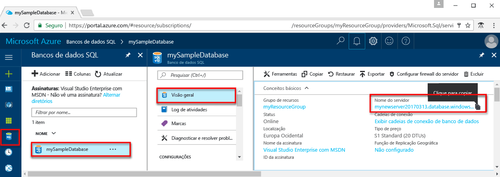

# <a name="use-php-to-query-an-azure-sql-database"></a><span data-ttu-id="32461-103">Usar PHP para consultar um banco de dados SQL do Azure</span><span class="sxs-lookup"><span data-stu-id="32461-103">Use PHP to query an Azure SQL database</span></span>

<span data-ttu-id="32461-104">Este tutorial de início rápido demonstra como usar o [PHP](http://php.net/manual/en/intro-whatis.php) para criar um programa para se conectar a um banco de dados SQL do Azure e usar instruções Transact-SQL para consultar dados.</span><span class="sxs-lookup"><span data-stu-id="32461-104">This quick start tutorial demonstrates how to use [PHP](http://php.net/manual/en/intro-whatis.php) to create a program to connect to an Azure SQL database and use Transact-SQL statements to query data.</span></span>

## <a name="prerequisites"></a><span data-ttu-id="32461-105">Pré-requisitos</span><span class="sxs-lookup"><span data-stu-id="32461-105">Prerequisites</span></span>

<span data-ttu-id="32461-106">Para concluir este tutorial de início rápido, tenha o seguinte:</span><span class="sxs-lookup"><span data-stu-id="32461-106">To complete this quick start tutorial, make sure you have the following:</span></span>

- <span data-ttu-id="32461-107">Um banco de dados SQL do Azure.</span><span class="sxs-lookup"><span data-stu-id="32461-107">An Azure SQL database.</span></span> <span data-ttu-id="32461-108">Este início rápido usa os recursos criados em um destes inícios rápidos:</span><span class="sxs-lookup"><span data-stu-id="32461-108">This quick start uses the resources created in one of these quick starts:</span></span> 

   - [<span data-ttu-id="32461-109">Criar Banco de dados - Portal</span><span class="sxs-lookup"><span data-stu-id="32461-109">Create DB - Portal</span></span>](sql-database-get-started-portal.md)
   - [<span data-ttu-id="32461-110">Criar Banco de dados - CLI</span><span class="sxs-lookup"><span data-stu-id="32461-110">Create DB - CLI</span></span>](sql-database-get-started-cli.md)
   - [<span data-ttu-id="32461-111">Criar Banco de dados - PowerShell</span><span class="sxs-lookup"><span data-stu-id="32461-111">Create DB - PowerShell</span></span>](sql-database-get-started-powershell.md)

- <span data-ttu-id="32461-112">Uma [regra de firewall no nível de servidor](sql-database-get-started-portal.md#create-a-server-level-firewall-rule) para o endereço IP público do computador usado neste tutorial de início rápido.</span><span class="sxs-lookup"><span data-stu-id="32461-112">A [server-level firewall rule](sql-database-get-started-portal.md#create-a-server-level-firewall-rule) for the public IP address of the computer you use for this quick start tutorial.</span></span>

- <span data-ttu-id="32461-113">Você instalou o PHP e o software relacionado para seu sistema operacional.</span><span class="sxs-lookup"><span data-stu-id="32461-113">You have installed PHP and related software for your operating system.</span></span>

    - <span data-ttu-id="32461-114">**MacOS**: instale o Homebrew e o PHP, instale o driver ODBC e o SQLCMD e, em seguida, instale o Driver PHP para SQL Server.</span><span class="sxs-lookup"><span data-stu-id="32461-114">**MacOS**: Install Homebrew and PHP, install the ODBC driver and SQLCMD, and then install the PHP Driver for SQL Server.</span></span> <span data-ttu-id="32461-115">Consulte [Etapas 1.2, 1.3 e 2.1](https://www.microsoft.com/en-us/sql-server/developer-get-started/php/mac/).</span><span class="sxs-lookup"><span data-stu-id="32461-115">See [Steps 1.2, 1.3, and 2.1](https://www.microsoft.com/en-us/sql-server/developer-get-started/php/mac/).</span></span>
    - <span data-ttu-id="32461-116">**Ubuntu**: instale o PHP e outros pacotes necessários e, em seguida, instale o Driver PHP para SQL Server.</span><span class="sxs-lookup"><span data-stu-id="32461-116">**Ubuntu**:  Install PHP and other required packages, and then install the PHP Driver for SQL Server.</span></span> <span data-ttu-id="32461-117">Consulte [Etapas 1.2 e 2.1](https://www.microsoft.com/sql-server/developer-get-started/php/ubuntu/).</span><span class="sxs-lookup"><span data-stu-id="32461-117">See [Steps 1.2 and 2.1](https://www.microsoft.com/sql-server/developer-get-started/php/ubuntu/).</span></span>
    - <span data-ttu-id="32461-118">**Windows**: instale a versão mais recente do PHP para IIS Express, a versão mais recente dos Drivers da Microsoft para SQL Server no IIS Express, Chocolatey, o driver ODBC e SQLCMD.</span><span class="sxs-lookup"><span data-stu-id="32461-118">**Windows**: Install the newest version of PHP for IIS Express, the newest version of Microsoft Drivers for SQL Server in IIS Express, Chocolatey, the ODBC driver, and SQLCMD.</span></span> <span data-ttu-id="32461-119">Consulte [Etapas 1.2 e 1.3](https://www.microsoft.com/sql-server/developer-get-started/php/windows/).</span><span class="sxs-lookup"><span data-stu-id="32461-119">See [Steps 1.2 and 1.3](https://www.microsoft.com/sql-server/developer-get-started/php/windows/).</span></span>    

## <a name="sql-server-connection-information"></a><span data-ttu-id="32461-120">Informações de conexão do servidor SQL</span><span class="sxs-lookup"><span data-stu-id="32461-120">SQL server connection information</span></span>

<span data-ttu-id="32461-121">Obtenha as informações de conexão necessárias para se conectar ao Banco de Dados SQL do Azure.</span><span class="sxs-lookup"><span data-stu-id="32461-121">Get the connection information needed to connect to the Azure SQL database.</span></span> <span data-ttu-id="32461-122">Você precisará do nome totalmente qualificado do servidor, nome do banco de dados e informações de logon nos próximos procedimentos.</span><span class="sxs-lookup"><span data-stu-id="32461-122">You will need the fully qualified server name, database name, and login information in the next procedures.</span></span>

1. <span data-ttu-id="32461-123">Faça logon no [Portal do Azure](https://portal.azure.com/).</span><span class="sxs-lookup"><span data-stu-id="32461-123">Log in to the [Azure portal](https://portal.azure.com/).</span></span>
2. <span data-ttu-id="32461-124">Selecione **Bancos de Dados SQL** no menu à esquerda e clique em seu banco de dados na página **Bancos de Dados SQL**.</span><span class="sxs-lookup"><span data-stu-id="32461-124">Select **SQL Databases** from the left-hand menu, and click your database on the **SQL databases** page.</span></span> 
3. <span data-ttu-id="32461-125">Na página **Visão geral** do banco de dados, examine o nome totalmente qualificado do servidor, como mostrado na imagem a seguir.</span><span class="sxs-lookup"><span data-stu-id="32461-125">On the **Overview** page for your database, review the fully qualified server name as shown in the following image.</span></span> <span data-ttu-id="32461-126">Você pode passar o mouse sobre o nome do servidor para abrir a opção **Clique para copiar**.</span><span class="sxs-lookup"><span data-stu-id="32461-126">You can hover over the server name to bring up the **Click to copy** option.</span></span>  

    

4. <span data-ttu-id="32461-128">Se você se esquecer das informações de logon do servidor, navegue até a página do servidor do Banco de Dados SQL para exibir o nome de administrador do servidor e, se necessário, redefinir a senha.</span><span class="sxs-lookup"><span data-stu-id="32461-128">If you forget your server login information, navigate to the SQL Database server page to view the server admin name and, if necessary, reset the password.</span></span>     
    
## <a name="insert-code-to-query-sql-database"></a><span data-ttu-id="32461-129">Inserir código para consultar o banco de dados SQL</span><span class="sxs-lookup"><span data-stu-id="32461-129">Insert code to query SQL database</span></span>

1. <span data-ttu-id="32461-130">Em seu editor de texto favorito, crie um novo arquivo, **sqltest.php**.</span><span class="sxs-lookup"><span data-stu-id="32461-130">In your favorite text editor, create a new file, **sqltest.php**.</span></span>  

2. <span data-ttu-id="32461-131">Substitua o conteúdo pelo código a seguir e adicione os valores apropriados para seu servidor, banco de dados, usuário e senha.</span><span class="sxs-lookup"><span data-stu-id="32461-131">Replace the contents with the following code and add the appropriate values for your server, database, user, and password.</span></span>

   ```PHP
   <?php
   $serverName = "your_server.database.windows.net";
   $connectionOptions = array(
       "Database" => "your_database",
       "Uid" => "your_username",
       "PWD" => "your_password"
   );
   //Establishes the connection
   $conn = sqlsrv_connect($serverName, $connectionOptions);
   $tsql= "SELECT TOP 20 pc.Name as CategoryName, p.name as ProductName
           FROM [SalesLT].[ProductCategory] pc
           JOIN [SalesLT].[Product] p
        ON pc.productcategoryid = p.productcategoryid";
   $getResults= sqlsrv_query($conn, $tsql);
   echo ("Reading data from table" . PHP_EOL);
   if ($getResults == FALSE)
       echo (sqlsrv_errors());
   while ($row = sqlsrv_fetch_array($getResults, SQLSRV_FETCH_ASSOC)) {
    echo ($row['CategoryName'] . " " . $row['ProductName'] . PHP_EOL);
   }
   sqlsrv_free_stmt($getResults);
   ?>
   ```

## <a name="run-the-code"></a><span data-ttu-id="32461-132">Executar o código</span><span class="sxs-lookup"><span data-stu-id="32461-132">Run the code</span></span>

1. <span data-ttu-id="32461-133">No prompt de comando, execute estes comandos:</span><span class="sxs-lookup"><span data-stu-id="32461-133">At the command prompt, run the following commands:</span></span>

   ```php
   php sqltest.php
   ```

2. <span data-ttu-id="32461-134">Verifique se as 20 linhas superiores são retornadas e, em seguida, feche a janela do aplicativo.</span><span class="sxs-lookup"><span data-stu-id="32461-134">Verify that the top 20 rows are returned and then close the application window.</span></span>

## <a name="next-steps"></a><span data-ttu-id="32461-135">Próximas etapas</span><span class="sxs-lookup"><span data-stu-id="32461-135">Next steps</span></span>
- [<span data-ttu-id="32461-136">Projetar seu primeiro banco de dados SQL do Azure</span><span class="sxs-lookup"><span data-stu-id="32461-136">Design your first Azure SQL database</span></span>](sql-database-design-first-database.md)
- [<span data-ttu-id="32461-137">Drivers PHP Microsoft para SQL Server</span><span class="sxs-lookup"><span data-stu-id="32461-137">Microsoft PHP Drivers for SQL Server</span></span>](https://github.com/Microsoft/msphpsql/)
- [<span data-ttu-id="32461-138">Relatar problemas ou fazer perguntas</span><span class="sxs-lookup"><span data-stu-id="32461-138">Report issues or ask questions</span></span>](https://github.com/Microsoft/msphpsql/issues)
