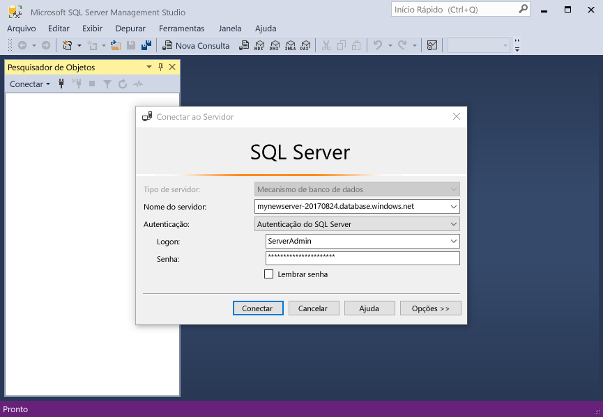
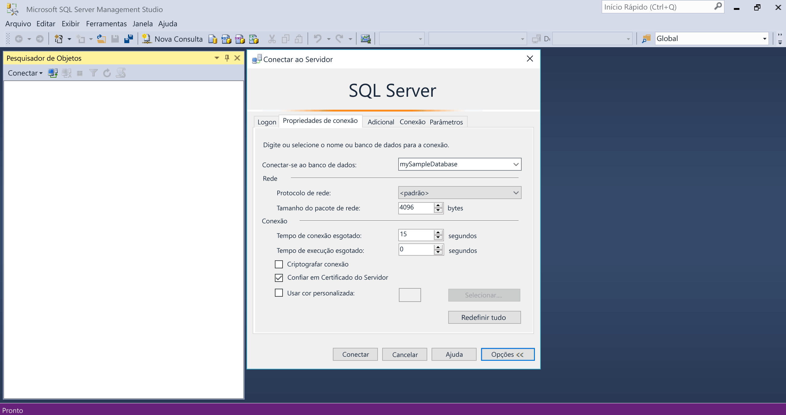
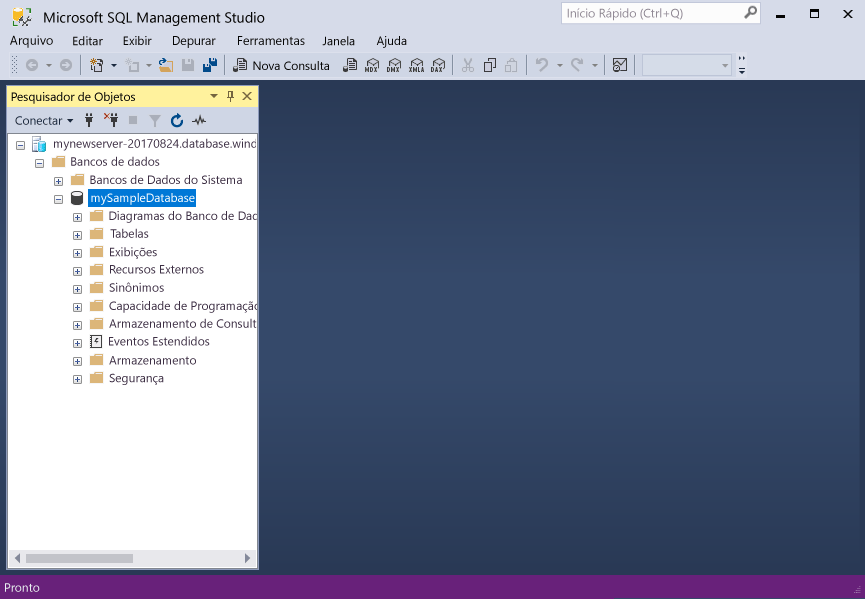
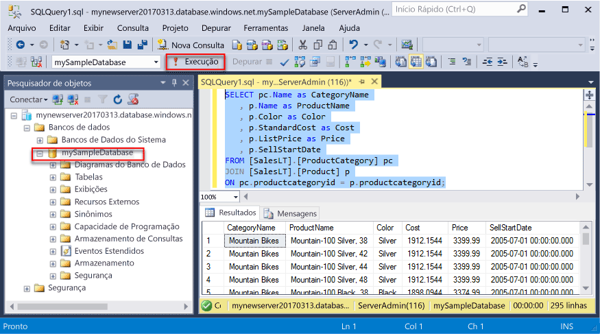
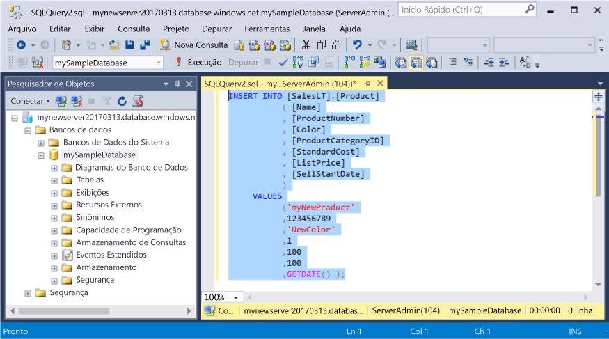
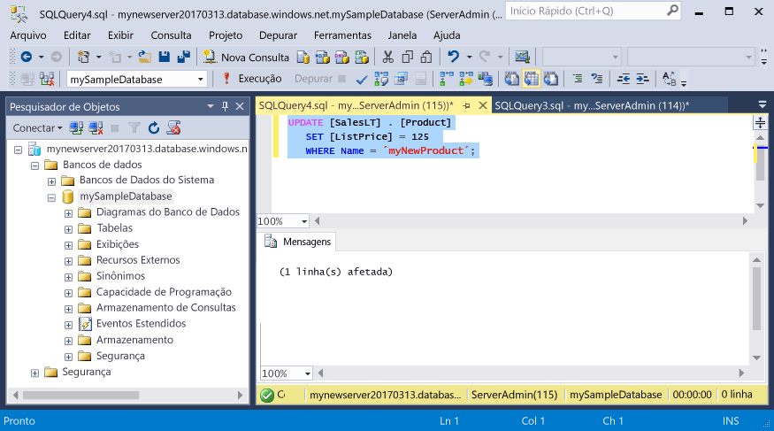
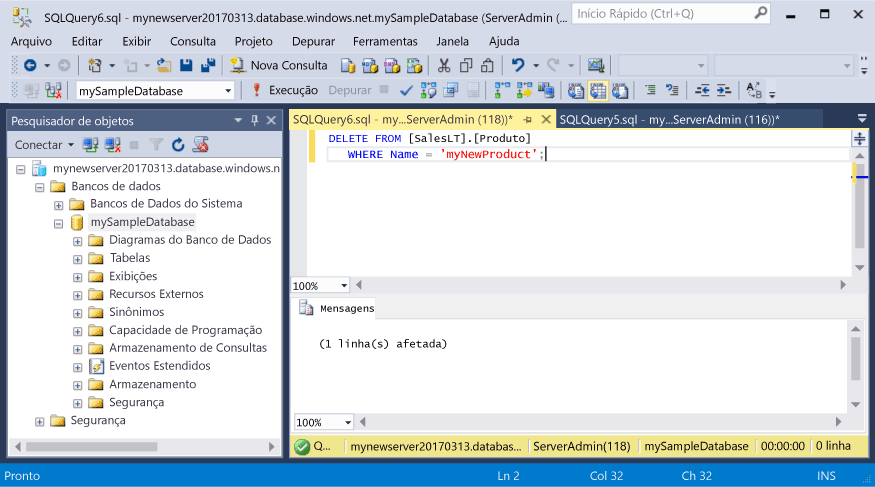

# <a name="azure-sql-database-use-sql-server-management-studio-tooconnect-and-query-data"></a><span data-ttu-id="375b1-105">Banco de dados SQL do Azure: Dados de tooconnect e consulta Use SQL Server Management Studio</span><span class="sxs-lookup"><span data-stu-id="375b1-105">Azure SQL Database: Use SQL Server Management Studio tooconnect and query data</span></span>

<span data-ttu-id="375b1-106">[SQL Server Management Studio](https://msdn.microsoft.com/library/ms174173.aspx) (SSMS) é um ambiente integrado para gerenciar qualquer infraestrutura SQL, do SQL Server tooSQL banco de dados para o Microsoft Windows.</span><span class="sxs-lookup"><span data-stu-id="375b1-106">[SQL Server Management Studio](https://msdn.microsoft.com/library/ms174173.aspx) (SSMS) is an integrated environment for managing any SQL infrastructure, from SQL Server tooSQL Database for Microsoft Windows.</span></span> <span data-ttu-id="375b1-107">Este guia rápido demonstra como o banco de dados do toouse SSMS tooconnect tooan SQL Azure e, em seguida, tooquery de instruções de uso de Transact-SQL, inserem, atualizar e excluir dados no banco de dados de saudação.</span><span class="sxs-lookup"><span data-stu-id="375b1-107">This quick start demonstrates how toouse SSMS tooconnect tooan Azure SQL database, and then use Transact-SQL statements tooquery, insert, update, and delete data in hello database.</span></span> 

## <a name="prerequisites"></a><span data-ttu-id="375b1-108">Pré-requisitos</span><span class="sxs-lookup"><span data-stu-id="375b1-108">Prerequisites</span></span>

<span data-ttu-id="375b1-109">Este guia rápido usa como seus recursos de saudação ponto inicial criados em um desses inícios rápidos:</span><span class="sxs-lookup"><span data-stu-id="375b1-109">This quick start uses as its starting point hello resources created in one of these quick starts:</span></span>

- [<span data-ttu-id="375b1-110">Criar Banco de dados - Portal</span><span class="sxs-lookup"><span data-stu-id="375b1-110">Create DB - Portal</span></span>](sql-database-get-started-portal.md)
- [<span data-ttu-id="375b1-111">Criar Banco de dados - CLI</span><span class="sxs-lookup"><span data-stu-id="375b1-111">Create DB - CLI</span></span>](sql-database-get-started-cli.md)
- [<span data-ttu-id="375b1-112">Criar Banco de dados - PowerShell</span><span class="sxs-lookup"><span data-stu-id="375b1-112">Create DB - PowerShell</span></span>](sql-database-get-started-powershell.md)

<span data-ttu-id="375b1-113">Antes de começar, verifique se você instalou a versão mais recente de saudação do [SSMS](https://msdn.microsoft.com/library/mt238290.aspx).</span><span class="sxs-lookup"><span data-stu-id="375b1-113">Before you start, make sure you have installed hello newest version of [SSMS](https://msdn.microsoft.com/library/mt238290.aspx).</span></span> 

## <a name="sql-server-connection-information"></a><span data-ttu-id="375b1-114">Informações de conexão do servidor SQL</span><span class="sxs-lookup"><span data-stu-id="375b1-114">SQL server connection information</span></span>

<span data-ttu-id="375b1-115">Obter Olá conexão informações necessárias tooconnect toohello SQL Azure banco de dados.</span><span class="sxs-lookup"><span data-stu-id="375b1-115">Get hello connection information needed tooconnect toohello Azure SQL database.</span></span> <span data-ttu-id="375b1-116">Será necessário o nome totalmente qualificado do servidor de saudação, nome do banco de dados e informações de logon em procedimentos Avançar hello.</span><span class="sxs-lookup"><span data-stu-id="375b1-116">You will need hello fully qualified server name, database name, and login information in hello next procedures.</span></span>

1. <span data-ttu-id="375b1-117">Faça logon no toohello [portal do Azure](https://portal.azure.com/).</span><span class="sxs-lookup"><span data-stu-id="375b1-117">Log in toohello [Azure portal](https://portal.azure.com/).</span></span>
2. <span data-ttu-id="375b1-118">Selecione **bancos de dados SQL** no menu esquerdo do hello e clique em seu banco de dados em Olá **bancos de dados SQL** página.</span><span class="sxs-lookup"><span data-stu-id="375b1-118">Select **SQL Databases** from hello left-hand menu, and click your database on hello **SQL databases** page.</span></span> 
3. <span data-ttu-id="375b1-119">Em Olá **visão geral** para seu banco de dados, examine o nome totalmente qualificado do servidor de saudação conforme mostrado na imagem de saudação abaixo.</span><span class="sxs-lookup"><span data-stu-id="375b1-119">On hello **Overview** page for your database, review hello fully qualified server name as shown in hello image below.</span></span> <span data-ttu-id="375b1-120">Você pode focalizar Olá toobring de nome de servidor backup Olá **clique toocopy** opção.</span><span class="sxs-lookup"><span data-stu-id="375b1-120">You can hover over hello server name toobring up hello **Click toocopy** option.</span></span>

    

4. <span data-ttu-id="375b1-122">Se você tiver esquecido a informações de logon Olá para o servidor de banco de dados de SQL do Azure, navegue toohello banco de dados do SQL server página tooview Olá administrador nome do servidor e, se necessário, Redefinir senha hello.</span><span class="sxs-lookup"><span data-stu-id="375b1-122">If you have forgotten hello login information for your Azure SQL Database server, navigate toohello SQL Database server page tooview hello server admin name and, if necessary, reset hello password.</span></span> 

## <a name="connect-tooyour-database"></a><span data-ttu-id="375b1-123">Conecte-se o banco de dados tooyour</span><span class="sxs-lookup"><span data-stu-id="375b1-123">Connect tooyour database</span></span>

<span data-ttu-id="375b1-124">Use o SQL Server Management Studio tooestablish um servidor de banco de dados SQL do tooyour de conexão.</span><span class="sxs-lookup"><span data-stu-id="375b1-124">Use SQL Server Management Studio tooestablish a connection tooyour Azure SQL Database server.</span></span> 

> [!IMPORTANT]
> <span data-ttu-id="375b1-125">Um servidor lógico do Banco de Dados SQL do Azure escuta na porta 1433.</span><span class="sxs-lookup"><span data-stu-id="375b1-125">An Azure SQL Database logical server listens on port 1433.</span></span> <span data-ttu-id="375b1-126">Se você estiver tentando tooconnect tooan banco de dados do Azure SQL servidor lógico de dentro de um firewall corporativo, essa porta deve estar aberta no firewall corporativo Olá para toosuccessfully você se conectar.</span><span class="sxs-lookup"><span data-stu-id="375b1-126">If you are attempting tooconnect tooan Azure SQL Database logical server from within a corporate firewall, this port must be open in hello corporate firewall for you toosuccessfully connect.</span></span>
>

1. <span data-ttu-id="375b1-127">Abra o SQL Server Management Studio.</span><span class="sxs-lookup"><span data-stu-id="375b1-127">Open SQL Server Management Studio.</span></span>

2. <span data-ttu-id="375b1-128">Em Olá **conectar tooServer** caixa de diálogo, digite Olá informações a seguir:</span><span class="sxs-lookup"><span data-stu-id="375b1-128">In hello **Connect tooServer** dialog box, enter hello following information:</span></span>

   | <span data-ttu-id="375b1-129">Configuração</span><span class="sxs-lookup"><span data-stu-id="375b1-129">Setting</span></span>       | <span data-ttu-id="375b1-130">Valor sugerido</span><span class="sxs-lookup"><span data-stu-id="375b1-130">Suggested value</span></span> | <span data-ttu-id="375b1-131">Descrição</span><span class="sxs-lookup"><span data-stu-id="375b1-131">Description</span></span> | 
   | ------------ | ------------------ | ------------------------------------------------- | 
   | <span data-ttu-id="375b1-132">**Tipo de servidor**</span><span class="sxs-lookup"><span data-stu-id="375b1-132">**Server type**</span></span> | <span data-ttu-id="375b1-133">Mecanismo de banco de dados</span><span class="sxs-lookup"><span data-stu-id="375b1-133">Database engine</span></span> | <span data-ttu-id="375b1-134">Esse valor é obrigatório.</span><span class="sxs-lookup"><span data-stu-id="375b1-134">This value is required.</span></span> |
   | <span data-ttu-id="375b1-135">**Nome do servidor**</span><span class="sxs-lookup"><span data-stu-id="375b1-135">**Server name**</span></span> | <span data-ttu-id="375b1-136">nome totalmente qualificado do servidor de saudação</span><span class="sxs-lookup"><span data-stu-id="375b1-136">hello fully qualified server name</span></span> | <span data-ttu-id="375b1-137">Olá nome deve ser semelhante a esta: **mynewserver20170313.database.windows.net**.</span><span class="sxs-lookup"><span data-stu-id="375b1-137">hello name should be something like this: **mynewserver20170313.database.windows.net**.</span></span> |
   | <span data-ttu-id="375b1-138">**Autenticação**</span><span class="sxs-lookup"><span data-stu-id="375b1-138">**Authentication**</span></span> | <span data-ttu-id="375b1-139">Autenticação do SQL Server</span><span class="sxs-lookup"><span data-stu-id="375b1-139">SQL Server Authentication</span></span> | <span data-ttu-id="375b1-140">Autenticação do SQL é o tipo de autenticação somente de saudação que configuramos neste tutorial.</span><span class="sxs-lookup"><span data-stu-id="375b1-140">SQL Authentication is hello only authentication type that we have configured in this tutorial.</span></span> |
   | <span data-ttu-id="375b1-141">**Logon**</span><span class="sxs-lookup"><span data-stu-id="375b1-141">**Login**</span></span> | <span data-ttu-id="375b1-142">conta de administrador do servidor de saudação</span><span class="sxs-lookup"><span data-stu-id="375b1-142">hello server admin account</span></span> | <span data-ttu-id="375b1-143">Essa é a conta de saudação que você especificou quando criou o servidor de saudação.</span><span class="sxs-lookup"><span data-stu-id="375b1-143">This is hello account that you specified when you created hello server.</span></span> |
   | <span data-ttu-id="375b1-144">**Senha**</span><span class="sxs-lookup"><span data-stu-id="375b1-144">**Password**</span></span> | <span data-ttu-id="375b1-145">senha de saudação para sua conta de administrador do servidor</span><span class="sxs-lookup"><span data-stu-id="375b1-145">hello password for your server admin account</span></span> | <span data-ttu-id="375b1-146">Essa é a senha de saudação que você especificou quando criou o servidor de saudação.</span><span class="sxs-lookup"><span data-stu-id="375b1-146">This is hello password that you specified when you created hello server.</span></span> |

     

3. <span data-ttu-id="375b1-148">Clique em **opções** em Olá **conectar tooserver** caixa de diálogo.</span><span class="sxs-lookup"><span data-stu-id="375b1-148">Click **Options** in hello **Connect tooserver** dialog box.</span></span> <span data-ttu-id="375b1-149">Em Olá **conectar toodatabase** seção, digite **mySampleDatabase** tooconnect toothis database.</span><span class="sxs-lookup"><span data-stu-id="375b1-149">In hello **Connect toodatabase** section, enter **mySampleDatabase** tooconnect toothis database.</span></span>

     

4. <span data-ttu-id="375b1-151">Clique em **Conectar**.</span><span class="sxs-lookup"><span data-stu-id="375b1-151">Click **Connect**.</span></span> <span data-ttu-id="375b1-152">janela do Pesquisador de objetos de saudação é aberta no SSMS.</span><span class="sxs-lookup"><span data-stu-id="375b1-152">hello Object Explorer window opens in SSMS.</span></span> 

     

5. <span data-ttu-id="375b1-154">No Pesquisador de objetos, expanda **bancos de dados** e, em seguida, expanda **mySampleDatabase** tooview objetos de saudação no banco de dados de exemplo hello.</span><span class="sxs-lookup"><span data-stu-id="375b1-154">In Object Explorer, expand **Databases** and then expand **mySampleDatabase** tooview hello objects in hello sample database.</span></span>

## <a name="query-data"></a><span data-ttu-id="375b1-155">Consultar dados</span><span class="sxs-lookup"><span data-stu-id="375b1-155">Query data</span></span>

<span data-ttu-id="375b1-156">Tooquery para Olá primeiros 20 produtos de código a seguir do uso Olá por categoria usando Olá [selecione](https://msdn.microsoft.com/library/ms189499.aspx) instrução Transact-SQL.</span><span class="sxs-lookup"><span data-stu-id="375b1-156">Use hello following code tooquery for hello top 20 products by category using hello [SELECT](https://msdn.microsoft.com/library/ms189499.aspx) Transact-SQL statement.</span></span>

1. <span data-ttu-id="375b1-157">No Pesquisador de Objetos, clique com o botão direito em **mySampleDatabase** e clique em **Nova Consulta**.</span><span class="sxs-lookup"><span data-stu-id="375b1-157">In Object Explorer, right-click **mySampleDatabase** and click **New Query**.</span></span> <span data-ttu-id="375b1-158">Uma janela de consulta em branco é aberto que é conectado tooyour banco de dados.</span><span class="sxs-lookup"><span data-stu-id="375b1-158">A blank query window opens that is connected tooyour database.</span></span>
2. <span data-ttu-id="375b1-159">Na janela de consulta hello, digite Olá consulta a seguir:</span><span class="sxs-lookup"><span data-stu-id="375b1-159">In hello query window, enter hello following query:</span></span>

   ```sql
   SELECT pc.Name as CategoryName, p.name as ProductName
   FROM [SalesLT].[ProductCategory] pc
   JOIN [SalesLT].[Product] p
   ON pc.productcategoryid = p.productcategoryid;
   ```

3. <span data-ttu-id="375b1-160">Na barra de ferramentas hello, clique em **Execute** tooretrieve dados de tabelas Product e ProductCategory de saudação.</span><span class="sxs-lookup"><span data-stu-id="375b1-160">On hello toolbar, click **Execute** tooretrieve data from hello Product and ProductCategory tables.</span></span>

    

## <a name="insert-data"></a><span data-ttu-id="375b1-162">Inserir dados</span><span class="sxs-lookup"><span data-stu-id="375b1-162">Insert data</span></span>

<span data-ttu-id="375b1-163">Use Olá de código a seguir tooinsert um novo produto na tabela de SalesLT.Product hello usando Olá [inserir](https://msdn.microsoft.com/library/ms174335.aspx) instrução Transact-SQL.</span><span class="sxs-lookup"><span data-stu-id="375b1-163">Use hello following code tooinsert a new product into hello SalesLT.Product table using hello [INSERT](https://msdn.microsoft.com/library/ms174335.aspx) Transact-SQL statement.</span></span>

1. <span data-ttu-id="375b1-164">Na janela de consulta hello, substitua consulta anterior Olá Olá consulta a seguir:</span><span class="sxs-lookup"><span data-stu-id="375b1-164">In hello query window, replace hello previous query with hello following query:</span></span>

   ```sql
   INSERT INTO [SalesLT].[Product]
           ( [Name]
           , [ProductNumber]
           , [Color]
           , [ProductCategoryID]
           , [StandardCost]
           , [ListPrice]
           , [SellStartDate]
           )
     VALUES
           ('myNewProduct'
           ,123456789
           ,'NewColor'
           ,1
           ,100
           ,100
           ,GETDATE() );
   ```

2. <span data-ttu-id="375b1-165">Na barra de ferramentas hello, clique em **Execute** tooinsert uma nova linha na tabela de produto hello.</span><span class="sxs-lookup"><span data-stu-id="375b1-165">On hello toolbar, click **Execute**  tooinsert a new row in hello Product table.</span></span>

    

## <a name="update-data"></a><span data-ttu-id="375b1-166">Atualizar dados</span><span class="sxs-lookup"><span data-stu-id="375b1-166">Update data</span></span>

<span data-ttu-id="375b1-167">Tooupdate Olá novo produto que você adicionou anteriormente usando Olá de código a seguir de saudação de uso [atualização](https://msdn.microsoft.com/library/ms177523.aspx) instrução Transact-SQL.</span><span class="sxs-lookup"><span data-stu-id="375b1-167">Use hello following code tooupdate hello new product that you previously added using hello [UPDATE](https://msdn.microsoft.com/library/ms177523.aspx) Transact-SQL statement.</span></span>

1. <span data-ttu-id="375b1-168">Na janela de consulta hello, substitua consulta anterior Olá Olá consulta a seguir:</span><span class="sxs-lookup"><span data-stu-id="375b1-168">In hello query window, replace hello previous query with hello following query:</span></span>

   ```sql
   UPDATE [SalesLT].[Product]
   SET [ListPrice] = 125
   WHERE Name = 'myNewProduct';
   ```

2. <span data-ttu-id="375b1-169">Na barra de ferramentas hello, clique em **Execute** tooupdate Olá especificado linha hello produto tabela.</span><span class="sxs-lookup"><span data-stu-id="375b1-169">On hello toolbar, click **Execute** tooupdate hello specified row in hello Product table.</span></span>

    

## <a name="delete-data"></a><span data-ttu-id="375b1-170">Excluir dados</span><span class="sxs-lookup"><span data-stu-id="375b1-170">Delete data</span></span>

<span data-ttu-id="375b1-171">Toodelete Olá novo produto que você adicionou anteriormente usando Olá de código a seguir de saudação de uso [excluir](https://msdn.microsoft.com/library/ms189835.aspx) instrução Transact-SQL.</span><span class="sxs-lookup"><span data-stu-id="375b1-171">Use hello following code toodelete hello new product that you previously added using hello [DELETE](https://msdn.microsoft.com/library/ms189835.aspx) Transact-SQL statement.</span></span>

1. <span data-ttu-id="375b1-172">Na janela de consulta hello, substitua consulta anterior Olá Olá consulta a seguir:</span><span class="sxs-lookup"><span data-stu-id="375b1-172">In hello query window, replace hello previous query with hello following query:</span></span>

   ```sql
   DELETE FROM [SalesLT].[Product]
   WHERE Name = 'myNewProduct';
   ```

2. <span data-ttu-id="375b1-173">Na barra de ferramentas hello, clique em **Execute** toodelete Olá especificado linha hello produto tabela.</span><span class="sxs-lookup"><span data-stu-id="375b1-173">On hello toolbar, click **Execute** toodelete hello specified row in hello Product table.</span></span>

    

## <a name="next-steps"></a><span data-ttu-id="375b1-174">Próximas etapas</span><span class="sxs-lookup"><span data-stu-id="375b1-174">Next steps</span></span>

- <span data-ttu-id="375b1-175">toolearn sobre como criar e gerenciar servidores e bancos de dados com o Transact-SQL, consulte [Saiba mais sobre bancos de dados e servidores de banco de dados do Azure SQL](sql-database-servers-databases.md).</span><span class="sxs-lookup"><span data-stu-id="375b1-175">toolearn about creating and managing servers and databases with Transact-SQL, see [Learn about Azure SQL Database servers and databases](sql-database-servers-databases.md).</span></span>
- <span data-ttu-id="375b1-176">Para saber mais sobre o SSMS, consulte [Usar o SQL Server Management Studio](https://msdn.microsoft.com/library/ms174173.aspx).</span><span class="sxs-lookup"><span data-stu-id="375b1-176">For information about SSMS, see [Use SQL Server Management Studio](https://msdn.microsoft.com/library/ms174173.aspx).</span></span>
- <span data-ttu-id="375b1-177">tooconnect e consulta usando código do Visual Studio, consulte [conectar e consultar com código do Visual Studio](sql-database-connect-query-vscode.md).</span><span class="sxs-lookup"><span data-stu-id="375b1-177">tooconnect and query using Visual Studio Code, see [Connect and query with Visual Studio Code](sql-database-connect-query-vscode.md).</span></span>
- <span data-ttu-id="375b1-178">tooconnect e consulta usando .NET, consulte [conectar e consultar com .NET](sql-database-connect-query-dotnet.md).</span><span class="sxs-lookup"><span data-stu-id="375b1-178">tooconnect and query using .NET, see [Connect and query with .NET](sql-database-connect-query-dotnet.md).</span></span>
- <span data-ttu-id="375b1-179">tooconnect e consulta usando o PHP, consulte [conectar e consultar com PHP](sql-database-connect-query-php.md).</span><span class="sxs-lookup"><span data-stu-id="375b1-179">tooconnect and query using PHP, see [Connect and query with PHP](sql-database-connect-query-php.md).</span></span>
- <span data-ttu-id="375b1-180">tooconnect e consulta usando Node. js, consulte [conectar e consultar com Node. js](sql-database-connect-query-nodejs.md).</span><span class="sxs-lookup"><span data-stu-id="375b1-180">tooconnect and query using Node.js, see [Connect and query with Node.js](sql-database-connect-query-nodejs.md).</span></span>
- <span data-ttu-id="375b1-181">tooconnect e consulta usando o Java, consulte [conectar e consultar com Java](sql-database-connect-query-java.md).</span><span class="sxs-lookup"><span data-stu-id="375b1-181">tooconnect and query using Java, see [Connect and query with Java](sql-database-connect-query-java.md).</span></span>
- <span data-ttu-id="375b1-182">tooconnect e consulta usando Python, consulte [conectar e consultar com Python](sql-database-connect-query-python.md).</span><span class="sxs-lookup"><span data-stu-id="375b1-182">tooconnect and query using Python, see [Connect and query with Python](sql-database-connect-query-python.md).</span></span>
- <span data-ttu-id="375b1-183">tooconnect e consulta usando o Ruby, consulte [conectar e consultar com Ruby](sql-database-connect-query-ruby.md).</span><span class="sxs-lookup"><span data-stu-id="375b1-183">tooconnect and query using Ruby, see [Connect and query with Ruby](sql-database-connect-query-ruby.md).</span></span>
