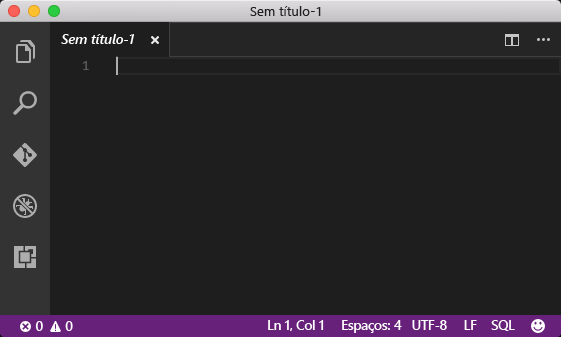
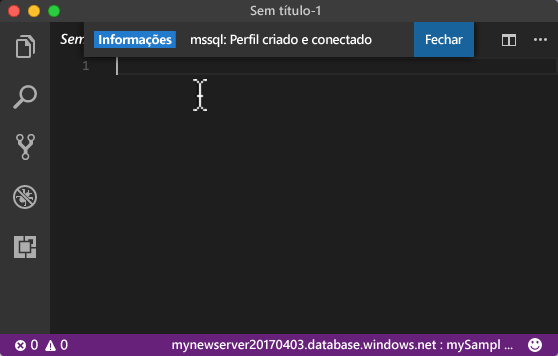
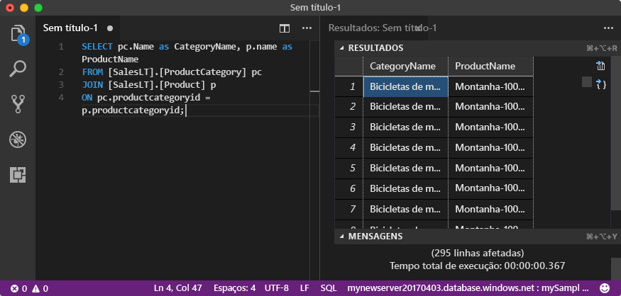

# <a name="azure-sql-database-use-visual-studio-code-tooconnect-and-query-data"></a><span data-ttu-id="4b016-105">Banco de dados SQL do Azure: O código do Visual Studio para usar tooconnect e consultar dados</span><span class="sxs-lookup"><span data-stu-id="4b016-105">Azure SQL Database: Use Visual Studio Code tooconnect and query data</span></span>

<span data-ttu-id="4b016-106">[Código do Visual Studio](https://code.visualstudio.com/docs) é um editor de código gráfica para Linux, macOS, e que oferece suporte a extensões, incluindo Windows hello [mssql extensão](https://aka.ms/mssql-marketplace) para consultar o Microsoft SQL Server, o banco de dados do SQL Azure e SQL Data Warehouse.</span><span class="sxs-lookup"><span data-stu-id="4b016-106">[Visual Studio Code](https://code.visualstudio.com/docs) is a graphical code editor for Linux, macOS, and Windows that supports extensions, including hello [mssql extension](https://aka.ms/mssql-marketplace) for querying Microsoft SQL Server, Azure SQL Database, and SQL Data Warehouse.</span></span> <span data-ttu-id="4b016-107">Este guia rápido demonstra como banco de dados do toouse código do Visual Studio tooconnect tooan SQL Azure e, em seguida, use Transact-SQL instruções tooquery, inserir, atualizar e excluir dados no banco de dados de saudação.</span><span class="sxs-lookup"><span data-stu-id="4b016-107">This quick start demonstrates how toouse Visual Studio Code tooconnect tooan Azure SQL database, and then use Transact-SQL statements tooquery, insert, update, and delete data in hello database.</span></span>

## <a name="prerequisites"></a><span data-ttu-id="4b016-108">Pré-requisitos</span><span class="sxs-lookup"><span data-stu-id="4b016-108">Prerequisites</span></span>

<span data-ttu-id="4b016-109">Este guia rápido usa como seus recursos de saudação ponto inicial criados em um desses inícios rápidos:</span><span class="sxs-lookup"><span data-stu-id="4b016-109">This quick start uses as its starting point hello resources created in one of these quick starts:</span></span>

- [<span data-ttu-id="4b016-110">Criar Banco de dados - Portal</span><span class="sxs-lookup"><span data-stu-id="4b016-110">Create DB - Portal</span></span>](sql-database-get-started-portal.md)
- [<span data-ttu-id="4b016-111">Criar Banco de dados - CLI</span><span class="sxs-lookup"><span data-stu-id="4b016-111">Create DB - CLI</span></span>](sql-database-get-started-cli.md)
- [<span data-ttu-id="4b016-112">Criar Banco de dados - PowerShell</span><span class="sxs-lookup"><span data-stu-id="4b016-112">Create DB - PowerShell</span></span>](sql-database-get-started-powershell.md)

<span data-ttu-id="4b016-113">Antes de começar, verifique se você instalou a versão mais recente de saudação do [código do Visual Studio](https://code.visualstudio.com/Download) e carregados hello [mssql extensão](https://aka.ms/mssql-marketplace).</span><span class="sxs-lookup"><span data-stu-id="4b016-113">Before you start, make sure you have installed hello newest version of [Visual Studio Code](https://code.visualstudio.com/Download) and loaded hello [mssql extension](https://aka.ms/mssql-marketplace).</span></span> <span data-ttu-id="4b016-114">Para instruções de instalação para a extensão do mssql hello, consulte [instalar VS código](https://docs.microsoft.com/sql/linux/sql-server-linux-develop-use-vscode#install-vs-code) e consulte [mssql para o código do Visual Studio](https://marketplace.visualstudio.com/items?itemName=ms-mssql.mssql).</span><span class="sxs-lookup"><span data-stu-id="4b016-114">For installation guidance for hello mssql extension, see [Install VS Code](https://docs.microsoft.com/sql/linux/sql-server-linux-develop-use-vscode#install-vs-code) and see [mssql for Visual Studio Code](https://marketplace.visualstudio.com/items?itemName=ms-mssql.mssql).</span></span> 

## <a name="configure-vs-code"></a><span data-ttu-id="4b016-115">Configurar o VS Code</span><span class="sxs-lookup"><span data-stu-id="4b016-115">Configure VS Code</span></span> 

### <a name="mac-os"></a><span data-ttu-id="4b016-116">**Mac OS**</span><span class="sxs-lookup"><span data-stu-id="4b016-116">**Mac OS**</span></span>
<span data-ttu-id="4b016-117">Para macOS, você precisa tooinstall OpenSSL que é um pré-requisito para DotNet Core essa extensão mssql usa.</span><span class="sxs-lookup"><span data-stu-id="4b016-117">For macOS, you need tooinstall OpenSSL which is a prerequiste for DotNet Core that mssql extention uses.</span></span> <span data-ttu-id="4b016-118">Abra seu terminal e insira Olá tooinstall comandos a seguir **brew** e **OpenSSL**.</span><span class="sxs-lookup"><span data-stu-id="4b016-118">Open your terminal and enter hello following commands tooinstall **brew** and **OpenSSL**.</span></span> 

```bash
ruby -e "$(curl -fsSL https://raw.githubusercontent.com/Homebrew/install/master/install)"
brew update
brew install openssl
mkdir -p /usr/local/lib
ln -s /usr/local/opt/openssl/lib/libcrypto.1.0.0.dylib /usr/local/lib/
ln -s /usr/local/opt/openssl/lib/libssl.1.0.0.dylib /usr/local/lib/
```

### <a name="linux-ubuntu"></a><span data-ttu-id="4b016-119">**Linux (Ubuntu)**</span><span class="sxs-lookup"><span data-stu-id="4b016-119">**Linux (Ubuntu)**</span></span>

<span data-ttu-id="4b016-120">Nenhuma configuração especial é necessária.</span><span class="sxs-lookup"><span data-stu-id="4b016-120">No special configuration needed.</span></span>

### <a name="windows"></a><span data-ttu-id="4b016-121">**Windows**</span><span class="sxs-lookup"><span data-stu-id="4b016-121">**Windows**</span></span>

<span data-ttu-id="4b016-122">Nenhuma configuração especial é necessária.</span><span class="sxs-lookup"><span data-stu-id="4b016-122">No special configuration needed.</span></span>

## <a name="sql-server-connection-information"></a><span data-ttu-id="4b016-123">Informações de conexão do servidor SQL</span><span class="sxs-lookup"><span data-stu-id="4b016-123">SQL server connection information</span></span>

<span data-ttu-id="4b016-124">Obter Olá conexão informações necessárias tooconnect toohello SQL Azure banco de dados.</span><span class="sxs-lookup"><span data-stu-id="4b016-124">Get hello connection information needed tooconnect toohello Azure SQL database.</span></span> <span data-ttu-id="4b016-125">Será necessário o nome totalmente qualificado do servidor de saudação, nome do banco de dados e informações de logon em procedimentos Avançar hello.</span><span class="sxs-lookup"><span data-stu-id="4b016-125">You will need hello fully qualified server name, database name, and login information in hello next procedures.</span></span>

1. <span data-ttu-id="4b016-126">Faça logon no toohello [portal do Azure](https://portal.azure.com/).</span><span class="sxs-lookup"><span data-stu-id="4b016-126">Log in toohello [Azure portal](https://portal.azure.com/).</span></span>
2. <span data-ttu-id="4b016-127">Selecione **bancos de dados SQL** no menu esquerdo do hello e clique em seu banco de dados em Olá **bancos de dados SQL** página.</span><span class="sxs-lookup"><span data-stu-id="4b016-127">Select **SQL Databases** from hello left-hand menu, and click your database on hello **SQL databases** page.</span></span> 
3. <span data-ttu-id="4b016-128">Em Olá **visão geral** página do banco de dados, examine Olá nome totalmente qualificado do servidor conforme Olá a imagem a seguir.</span><span class="sxs-lookup"><span data-stu-id="4b016-128">On hello **Overview** page for your database, review hello fully qualified server name as shown in hello following image.</span></span> <span data-ttu-id="4b016-129">Você pode focalizar Olá toobring de nome de servidor backup Olá **clique toocopy** opção.</span><span class="sxs-lookup"><span data-stu-id="4b016-129">You can hover over hello server name toobring up hello **Click toocopy** option.</span></span>

    

4. <span data-ttu-id="4b016-131">Se você tiver esquecido a informações de logon Olá para o servidor de banco de dados de SQL do Azure, navegue toohello banco de dados do SQL server página tooview Olá administrador nome do servidor e, se necessário, Redefinir senha hello.</span><span class="sxs-lookup"><span data-stu-id="4b016-131">If you have forgotten hello login information for your Azure SQL Database server, navigate toohello SQL Database server page tooview hello server admin name and, if necessary, reset hello password.</span></span> 

## <a name="set-language-mode-toosql"></a><span data-ttu-id="4b016-132">Set language modo tooSQL</span><span class="sxs-lookup"><span data-stu-id="4b016-132">Set language mode tooSQL</span></span>

<span data-ttu-id="4b016-133">Modo de linguagem de saudação do conjunto é definido muito**SQL** em comandos do Visual Studio Code tooenable mssql e T-SQL IntelliSense.</span><span class="sxs-lookup"><span data-stu-id="4b016-133">Set hello language mode is set too**SQL** in Visual Studio Code tooenable mssql commands and T-SQL IntelliSense.</span></span>

1. <span data-ttu-id="4b016-134">Abra uma nova janela do Visual Studio Code.</span><span class="sxs-lookup"><span data-stu-id="4b016-134">Open a new Visual Studio Code window.</span></span> 

2. <span data-ttu-id="4b016-135">Clique em **texto sem formatação** no canto inferior direito de Olá Olá da barra de status.</span><span class="sxs-lookup"><span data-stu-id="4b016-135">Click **Plain Text** in hello lower right-hand corner of hello status bar.</span></span>
3. <span data-ttu-id="4b016-136">Em Olá **modo Selecionar idioma** menu suspenso que se abre, digite **SQL**e, em seguida, pressione **ENTER** tooset Olá idioma modo tooSQL.</span><span class="sxs-lookup"><span data-stu-id="4b016-136">In hello **Select language mode** drop-down menu that opens, type **SQL**, and then press **ENTER** tooset hello language mode tooSQL.</span></span> 

   

## <a name="connect-tooyour-database"></a><span data-ttu-id="4b016-138">Conecte-se o banco de dados tooyour</span><span class="sxs-lookup"><span data-stu-id="4b016-138">Connect tooyour database</span></span>

<span data-ttu-id="4b016-139">Use o código do Visual Studio tooestablish um servidor de banco de dados SQL do tooyour de conexão.</span><span class="sxs-lookup"><span data-stu-id="4b016-139">Use Visual Studio Code tooestablish a connection tooyour Azure SQL Database server.</span></span>

> [!IMPORTANT]
> <span data-ttu-id="4b016-140">Antes de continuar, verifique se você tem seu servidor, banco de dados e informações de logon prontos.</span><span class="sxs-lookup"><span data-stu-id="4b016-140">Before continuing, make sure that you have your server, database, and login information ready.</span></span> <span data-ttu-id="4b016-141">Quando você começar a inserir informações de perfil de conexão hello, se você alterar o foco de código do Visual Studio, você tem toorestart criação de perfil de conexão de saudação.</span><span class="sxs-lookup"><span data-stu-id="4b016-141">Once you begin entering hello connection profile information, if you change your focus from Visual Studio Code, you have toorestart creating hello connection profile.</span></span>
>

1. <span data-ttu-id="4b016-142">No código VS, pressione **CTRL + SHIFT + P** (ou **F1**) tooopen Olá paleta de comando.</span><span class="sxs-lookup"><span data-stu-id="4b016-142">In VS Code, press **CTRL+SHIFT+P** (or **F1**) tooopen hello Command Palette.</span></span>

2. <span data-ttu-id="4b016-143">Digite **sqlcon** e pressione **ENTER**.</span><span class="sxs-lookup"><span data-stu-id="4b016-143">Type **sqlcon** and press **ENTER**.</span></span>

3. <span data-ttu-id="4b016-144">Pressione **ENTER** tooselect **criar perfil de Conexão**.</span><span class="sxs-lookup"><span data-stu-id="4b016-144">Press **ENTER** tooselect **Create Connection Profile**.</span></span> <span data-ttu-id="4b016-145">Isso cria um perfil de conexão para a instância do SQL Server.</span><span class="sxs-lookup"><span data-stu-id="4b016-145">This creates a connection profile for your SQL Server instance.</span></span>

4. <span data-ttu-id="4b016-146">Siga Olá prompts toospecify Olá conexão propriedades para o novo perfil de conexão hello.</span><span class="sxs-lookup"><span data-stu-id="4b016-146">Follow hello prompts toospecify hello connection properties for hello new connection profile.</span></span> <span data-ttu-id="4b016-147">Depois de especificar cada valor, pressione **ENTER** toocontinue.</span><span class="sxs-lookup"><span data-stu-id="4b016-147">After specifying each value, press **ENTER** toocontinue.</span></span> 

   | <span data-ttu-id="4b016-148">Configuração</span><span class="sxs-lookup"><span data-stu-id="4b016-148">Setting</span></span>       | <span data-ttu-id="4b016-149">Valor sugerido</span><span class="sxs-lookup"><span data-stu-id="4b016-149">Suggested value</span></span> | <span data-ttu-id="4b016-150">Descrição</span><span class="sxs-lookup"><span data-stu-id="4b016-150">Description</span></span> |
   | ------------ | ------------------ | ------------------------------------------------- | 
   | <span data-ttu-id="4b016-151">**Nome do servidor</span><span class="sxs-lookup"><span data-stu-id="4b016-151">**Server name</span></span> | <span data-ttu-id="4b016-152">nome totalmente qualificado do servidor de saudação</span><span class="sxs-lookup"><span data-stu-id="4b016-152">hello fully qualified server name</span></span> | <span data-ttu-id="4b016-153">Olá nome deve ser semelhante a esta: **mynewserver20170313.database.windows.net**.</span><span class="sxs-lookup"><span data-stu-id="4b016-153">hello name should be something like this: **mynewserver20170313.database.windows.net**.</span></span> |
   | <span data-ttu-id="4b016-154">**Nome do banco de dados**</span><span class="sxs-lookup"><span data-stu-id="4b016-154">**Database name**</span></span> | <span data-ttu-id="4b016-155">mySampleDatabase</span><span class="sxs-lookup"><span data-stu-id="4b016-155">mySampleDatabase</span></span> | <span data-ttu-id="4b016-156">nome de saudação do hello tooconnect de toowhich de banco de dados.</span><span class="sxs-lookup"><span data-stu-id="4b016-156">hello name of hello database toowhich tooconnect.</span></span> |
   | <span data-ttu-id="4b016-157">**Autenticação**</span><span class="sxs-lookup"><span data-stu-id="4b016-157">**Authentication**</span></span> | <span data-ttu-id="4b016-158">Logon do SQL</span><span class="sxs-lookup"><span data-stu-id="4b016-158">SQL Login</span></span>| <span data-ttu-id="4b016-159">Autenticação do SQL é o tipo de autenticação somente de saudação que configuramos neste tutorial.</span><span class="sxs-lookup"><span data-stu-id="4b016-159">SQL Authentication is hello only authentication type that we have configured in this tutorial.</span></span> |
   | <span data-ttu-id="4b016-160">**Nome de usuário**</span><span class="sxs-lookup"><span data-stu-id="4b016-160">**User name**</span></span> | <span data-ttu-id="4b016-161">conta de administrador do servidor de saudação</span><span class="sxs-lookup"><span data-stu-id="4b016-161">hello server admin account</span></span> | <span data-ttu-id="4b016-162">Essa é a conta de saudação que você especificou quando criou o servidor de saudação.</span><span class="sxs-lookup"><span data-stu-id="4b016-162">This is hello account that you specified when you created hello server.</span></span> |
   | <span data-ttu-id="4b016-163">**Senha (Logon do SQL)**</span><span class="sxs-lookup"><span data-stu-id="4b016-163">**Password (SQL Login)**</span></span> | <span data-ttu-id="4b016-164">senha de saudação para sua conta de administrador do servidor</span><span class="sxs-lookup"><span data-stu-id="4b016-164">hello password for your server admin account</span></span> | <span data-ttu-id="4b016-165">Essa é a senha de saudação que você especificou quando criou o servidor de saudação.</span><span class="sxs-lookup"><span data-stu-id="4b016-165">This is hello password that you specified when you created hello server.</span></span> |
   | <span data-ttu-id="4b016-166">**Salvar a Senha?**</span><span class="sxs-lookup"><span data-stu-id="4b016-166">**Save Password?**</span></span> | <span data-ttu-id="4b016-167">Sim ou não</span><span class="sxs-lookup"><span data-stu-id="4b016-167">Yes or No</span></span> | <span data-ttu-id="4b016-168">Selecione Sim se você não quiser senha de saudação tooenter cada vez.</span><span class="sxs-lookup"><span data-stu-id="4b016-168">Select Yes if you do not want tooenter hello password each time.</span></span> |
   | <span data-ttu-id="4b016-169">**Insira um nome para este perfil**</span><span class="sxs-lookup"><span data-stu-id="4b016-169">**Enter a name for this profile**</span></span> | <span data-ttu-id="4b016-170">Um nome do perfil, como **mySampleDatabase**</span><span class="sxs-lookup"><span data-stu-id="4b016-170">A profile name, such as **mySampleDatabase**</span></span> | <span data-ttu-id="4b016-171">Um nome do perfil salvo acelera sua conexão nos logons subsequentes.</span><span class="sxs-lookup"><span data-stu-id="4b016-171">A saved profile name speeds your connection on subsequent logins.</span></span> | 

5. <span data-ttu-id="4b016-172">Olá pressione **ESC** tooclose chave mensagem de informações de saudação que informa que o perfil de saudação é criado e conectado.</span><span class="sxs-lookup"><span data-stu-id="4b016-172">Press hello **ESC** key tooclose hello info message that informs you that hello profile is created and connected.</span></span>

6. <span data-ttu-id="4b016-173">Verifique se sua conexão na barra de status de saudação.</span><span class="sxs-lookup"><span data-stu-id="4b016-173">Verify your connection in hello status bar.</span></span>

   

## <a name="query-data"></a><span data-ttu-id="4b016-175">Consultar dados</span><span class="sxs-lookup"><span data-stu-id="4b016-175">Query data</span></span>

<span data-ttu-id="4b016-176">Tooquery para Olá primeiros 20 produtos de código a seguir do uso Olá por categoria usando Olá [selecione](https://msdn.microsoft.com/library/ms189499.aspx) instrução Transact-SQL.</span><span class="sxs-lookup"><span data-stu-id="4b016-176">Use hello following code tooquery for hello top 20 products by category using hello [SELECT](https://msdn.microsoft.com/library/ms189499.aspx) Transact-SQL statement.</span></span>

1. <span data-ttu-id="4b016-177">Em Olá **Editor** janela, digite Olá consulta na janela de consulta vazia Olá a seguir:</span><span class="sxs-lookup"><span data-stu-id="4b016-177">In hello **Editor** window, enter hello following query in hello empty query window:</span></span>

   ```sql
   SELECT pc.Name as CategoryName, p.name as ProductName
   FROM [SalesLT].[ProductCategory] pc
   JOIN [SalesLT].[Product] p
   ON pc.productcategoryid = p.productcategoryid;
   ```

2. <span data-ttu-id="4b016-178">Pressione **CTRL + SHIFT + E** tooretrieve dados de tabelas Product e ProductCategory de saudação.</span><span class="sxs-lookup"><span data-stu-id="4b016-178">Press **CTRL+SHIFT+E** tooretrieve data from hello Product and ProductCategory tables.</span></span>

    

## <a name="insert-data"></a><span data-ttu-id="4b016-180">Inserir dados</span><span class="sxs-lookup"><span data-stu-id="4b016-180">Insert data</span></span>

<span data-ttu-id="4b016-181">Use Olá de código a seguir tooinsert um novo produto na tabela de SalesLT.Product hello usando Olá [inserir](https://msdn.microsoft.com/library/ms174335.aspx) instrução Transact-SQL.</span><span class="sxs-lookup"><span data-stu-id="4b016-181">Use hello following code tooinsert a new product into hello SalesLT.Product table using hello [INSERT](https://msdn.microsoft.com/library/ms174335.aspx) Transact-SQL statement.</span></span>

1. <span data-ttu-id="4b016-182">Em Olá **Editor** janela, excluir a consulta anterior hello e digite Olá consulta a seguir:</span><span class="sxs-lookup"><span data-stu-id="4b016-182">In hello **Editor** window, delete hello previous query and enter hello following query:</span></span>

   ```sql
   INSERT INTO [SalesLT].[Product]
           ( [Name]
           , [ProductNumber]
           , [Color]
           , [ProductCategoryID]
           , [StandardCost]
           , [ListPrice]
           , [SellStartDate]
           )
     VALUES
           ('myNewProduct'
           ,123456789
           ,'NewColor'
           ,1
           ,100
           ,100
           ,GETDATE() );
   ```

2. <span data-ttu-id="4b016-183">Pressione **CTRL + SHIFT + E** tooinsert uma nova linha na tabela de produto hello.</span><span class="sxs-lookup"><span data-stu-id="4b016-183">Press **CTRL+SHIFT+E** tooinsert a new row in hello Product table.</span></span>

## <a name="update-data"></a><span data-ttu-id="4b016-184">Atualizar dados</span><span class="sxs-lookup"><span data-stu-id="4b016-184">Update data</span></span>

<span data-ttu-id="4b016-185">Tooupdate Olá novo produto que você adicionou anteriormente usando Olá de código a seguir de saudação de uso [atualização](https://msdn.microsoft.com/library/ms177523.aspx) instrução Transact-SQL.</span><span class="sxs-lookup"><span data-stu-id="4b016-185">Use hello following code tooupdate hello new product that you previously added using hello [UPDATE](https://msdn.microsoft.com/library/ms177523.aspx) Transact-SQL statement.</span></span>

1.  <span data-ttu-id="4b016-186">Em Olá **Editor** janela, excluir a consulta anterior hello e digite Olá consulta a seguir:</span><span class="sxs-lookup"><span data-stu-id="4b016-186">In hello **Editor** window, delete hello previous query and enter hello following query:</span></span>

   ```sql
   UPDATE [SalesLT].[Product]
   SET [ListPrice] = 125
   WHERE Name = 'myNewProduct';
   ```

2. <span data-ttu-id="4b016-187">Pressione **CTRL + SHIFT + E** tooupdate Olá especificado linha hello produto tabela.</span><span class="sxs-lookup"><span data-stu-id="4b016-187">Press **CTRL+SHIFT+E** tooupdate hello specified row in hello Product table.</span></span>

## <a name="delete-data"></a><span data-ttu-id="4b016-188">Excluir dados</span><span class="sxs-lookup"><span data-stu-id="4b016-188">Delete data</span></span>

<span data-ttu-id="4b016-189">Toodelete Olá novo produto que você adicionou anteriormente usando Olá de código a seguir de saudação de uso [excluir](https://msdn.microsoft.com/library/ms189835.aspx) instrução Transact-SQL.</span><span class="sxs-lookup"><span data-stu-id="4b016-189">Use hello following code toodelete hello new product that you previously added using hello [DELETE](https://msdn.microsoft.com/library/ms189835.aspx) Transact-SQL statement.</span></span>

1. <span data-ttu-id="4b016-190">Em Olá **Editor** janela, excluir a consulta anterior hello e digite Olá consulta a seguir:</span><span class="sxs-lookup"><span data-stu-id="4b016-190">In hello **Editor** window, delete hello previous query and enter hello following query:</span></span>

   ```sql
   DELETE FROM [SalesLT].[Product]
   WHERE Name = 'myNewProduct';
   ```

2. <span data-ttu-id="4b016-191">Pressione **CTRL + SHIFT + E** toodelete Olá especificado linha hello produto tabela.</span><span class="sxs-lookup"><span data-stu-id="4b016-191">Press **CTRL+SHIFT+E** toodelete hello specified row in hello Product table.</span></span>

## <a name="next-steps"></a><span data-ttu-id="4b016-192">Próximas etapas</span><span class="sxs-lookup"><span data-stu-id="4b016-192">Next steps</span></span>

- <span data-ttu-id="4b016-193">tooconnect e consulta usando o SQL Server Management Studio, consulte [conectar e consultar com SSMS](sql-database-connect-query-ssms.md).</span><span class="sxs-lookup"><span data-stu-id="4b016-193">tooconnect and query using SQL Server Management Studio, see [Connect and query with SSMS](sql-database-connect-query-ssms.md).</span></span>
- <span data-ttu-id="4b016-194">Para obter um artigo da MSDN magazine sobre como usar o Visual Studio Code, veja [Criar um banco de dados IDE com a postagem de blog de extensão MSSQL](https://msdn.microsoft.com/magazine/mt809115).</span><span class="sxs-lookup"><span data-stu-id="4b016-194">For an MSDN magazine article on using Visual Studio Code, see [Create a database IDE with MSSQL extension blog post](https://msdn.microsoft.com/magazine/mt809115).</span></span>
