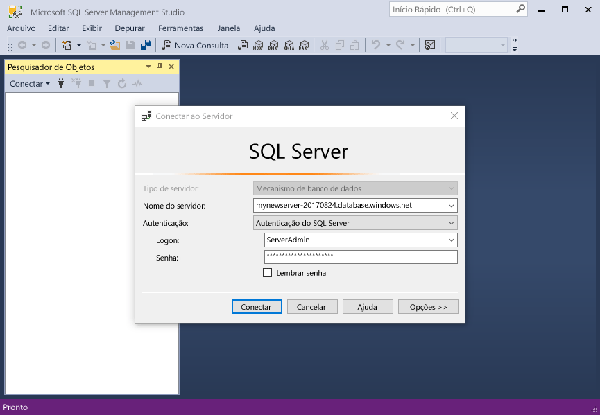

# <a name="design-your-first-azure-sql-database"></a><span data-ttu-id="5e97f-103">Criar seu primeiro banco de dados SQL do Azure</span><span class="sxs-lookup"><span data-stu-id="5e97f-103">Design your first Azure SQL database</span></span>

<span data-ttu-id="5e97f-104">Banco de dados do SQL Azure é um relacional banco de dados como um serviço (DBaaS) no hello Microsoft Cloud ("Azure").</span><span class="sxs-lookup"><span data-stu-id="5e97f-104">Azure SQL Database is a relational database-as-a service (DBaaS) in hello Microsoft Cloud ("Azure").</span></span> <span data-ttu-id="5e97f-105">Neste tutorial, você aprenderá como toouse Olá portal do Azure e [SQL Server Management Studio](https://msdn.microsoft.com/library/ms174173.aspx) (SSMS) para:</span><span class="sxs-lookup"><span data-stu-id="5e97f-105">In this tutorial, you learn how toouse hello Azure portal and [SQL Server Management Studio](https://msdn.microsoft.com/library/ms174173.aspx) (SSMS) to:</span></span> 

> [!div class="checklist"]
> * <span data-ttu-id="5e97f-106">Criar um banco de dados Olá portal do Azure</span><span class="sxs-lookup"><span data-stu-id="5e97f-106">Create a database in hello Azure portal</span></span>
> * <span data-ttu-id="5e97f-107">Configurar uma regra de firewall de nível de servidor em Olá portal do Azure</span><span class="sxs-lookup"><span data-stu-id="5e97f-107">Set up a server-level firewall rule in hello Azure portal</span></span>
> * <span data-ttu-id="5e97f-108">Conectar-se o banco de dados toohello com SSMS</span><span class="sxs-lookup"><span data-stu-id="5e97f-108">Connect toohello database with SSMS</span></span>
> * <span data-ttu-id="5e97f-109">Criar tabelas com SSMS</span><span class="sxs-lookup"><span data-stu-id="5e97f-109">Create tables with SSMS</span></span>
> * <span data-ttu-id="5e97f-110">Carregar dados em massa com o BCP</span><span class="sxs-lookup"><span data-stu-id="5e97f-110">Bulk load data with BCP</span></span>
> * <span data-ttu-id="5e97f-111">Consultar dados com o SSMS</span><span class="sxs-lookup"><span data-stu-id="5e97f-111">Query that data with SSMS</span></span>
> * <span data-ttu-id="5e97f-112">Restaurar Olá tooa de banco de dados anterior [restauração pontual](sql-database-recovery-using-backups.md#point-in-time-restore) em Olá portal do Azure</span><span class="sxs-lookup"><span data-stu-id="5e97f-112">Restore hello database tooa previous [point in time restore](sql-database-recovery-using-backups.md#point-in-time-restore) in hello Azure portal</span></span>

<span data-ttu-id="5e97f-113">Se você não tiver uma assinatura do Azure, [crie uma conta gratuita](https://azure.microsoft.com/free/) antes de começar.</span><span class="sxs-lookup"><span data-stu-id="5e97f-113">If you don't have an Azure subscription, [create a free account](https://azure.microsoft.com/free/) before you begin.</span></span>

## <a name="prerequisites"></a><span data-ttu-id="5e97f-114">Pré-requisitos</span><span class="sxs-lookup"><span data-stu-id="5e97f-114">Prerequisites</span></span>

<span data-ttu-id="5e97f-115">toocomplete este tutorial, verifique se você tiver instalado:</span><span class="sxs-lookup"><span data-stu-id="5e97f-115">toocomplete this tutorial, make sure you have installed:</span></span>
- <span data-ttu-id="5e97f-116">versão mais recente de saudação do [SQL Server Management Studio](https://msdn.microsoft.com/library/ms174173.aspx) (SSMS).</span><span class="sxs-lookup"><span data-stu-id="5e97f-116">hello newest version of [SQL Server Management Studio](https://msdn.microsoft.com/library/ms174173.aspx) (SSMS).</span></span>
- <span data-ttu-id="5e97f-117">versão mais recente de saudação do [BCP e o SQLCMD](https://www.microsoft.com/download/details.aspx?id=36433).</span><span class="sxs-lookup"><span data-stu-id="5e97f-117">hello newest version of [BCP and SQLCMD](https://www.microsoft.com/download/details.aspx?id=36433).</span></span>

## <a name="log-in-toohello-azure-portal"></a><span data-ttu-id="5e97f-118">Faça logon no toohello portal do Azure</span><span class="sxs-lookup"><span data-stu-id="5e97f-118">Log in toohello Azure portal</span></span>

<span data-ttu-id="5e97f-119">Faça logon no toohello [portal do Azure](https://portal.azure.com/).</span><span class="sxs-lookup"><span data-stu-id="5e97f-119">Log in toohello [Azure portal](https://portal.azure.com/).</span></span>

## <a name="create-a-blank-sql-database"></a><span data-ttu-id="5e97f-120">Criar um banco de dados SQL em branco</span><span class="sxs-lookup"><span data-stu-id="5e97f-120">Create a blank SQL database</span></span>

<span data-ttu-id="5e97f-121">Um banco de dados SQL do Azure é criado com um conjunto definido de [recursos de computação e armazenamento](sql-database-service-tiers.md).</span><span class="sxs-lookup"><span data-stu-id="5e97f-121">An Azure SQL database is created with a defined set of [compute and storage resources](sql-database-service-tiers.md).</span></span> <span data-ttu-id="5e97f-122">banco de dados de saudação é criado em um [grupo de recursos do Azure](../azure-resource-manager/resource-group-overview.md) e, em um [servidor lógico do banco de dados do Azure SQL](sql-database-features.md).</span><span class="sxs-lookup"><span data-stu-id="5e97f-122">hello database is created within an [Azure resource group](../azure-resource-manager/resource-group-overview.md) and in an [Azure SQL Database logical server](sql-database-features.md).</span></span> 

<span data-ttu-id="5e97f-123">Siga essas etapas toocreate um banco de dados SQL em branco.</span><span class="sxs-lookup"><span data-stu-id="5e97f-123">Follow these steps toocreate a blank SQL database.</span></span> 

1. <span data-ttu-id="5e97f-124">Clique em Olá **novo** botão localizado no canto superior esquerdo de saudação do hello portal do Azure.</span><span class="sxs-lookup"><span data-stu-id="5e97f-124">Click hello **New** button found on hello upper left-hand corner of hello Azure portal.</span></span>

2. <span data-ttu-id="5e97f-125">Selecione **bancos de dados** de saudação **novo** página e selecione **banco de dados SQL** de saudação **bancos de dados** página.</span><span class="sxs-lookup"><span data-stu-id="5e97f-125">Select **Databases** from hello **New** page, and select **SQL Database** from hello **Databases** page.</span></span> 

   

3. <span data-ttu-id="5e97f-127">Preencha formulário de banco de dados SQL Olá com hello seguintes informações, conforme mostrado na saudação anterior imagem:</span><span class="sxs-lookup"><span data-stu-id="5e97f-127">Fill out hello SQL Database form with hello following information, as shown on hello preceding image:</span></span>   

   | <span data-ttu-id="5e97f-128">Configuração</span><span class="sxs-lookup"><span data-stu-id="5e97f-128">Setting</span></span>       | <span data-ttu-id="5e97f-129">Valor sugerido</span><span class="sxs-lookup"><span data-stu-id="5e97f-129">Suggested value</span></span> | <span data-ttu-id="5e97f-130">Descrição</span><span class="sxs-lookup"><span data-stu-id="5e97f-130">Description</span></span> | 
   | ------------ | ------------------ | ------------------------------------------------- | 
   | <span data-ttu-id="5e97f-131">**Nome do banco de dados**</span><span class="sxs-lookup"><span data-stu-id="5e97f-131">**Database name**</span></span> | <span data-ttu-id="5e97f-132">mySampleDatabase</span><span class="sxs-lookup"><span data-stu-id="5e97f-132">mySampleDatabase</span></span> | <span data-ttu-id="5e97f-133">Para ver os nomes do banco de dados válidos, consulte [Identificadores do Banco de Dados](https://docs.microsoft.com/sql/relational-databases/databases/database-identifiers).</span><span class="sxs-lookup"><span data-stu-id="5e97f-133">For valid database names, see [Database Identifiers](https://docs.microsoft.com/sql/relational-databases/databases/database-identifiers).</span></span> | 
   | <span data-ttu-id="5e97f-134">**Assinatura**</span><span class="sxs-lookup"><span data-stu-id="5e97f-134">**Subscription**</span></span> | <span data-ttu-id="5e97f-135">Sua assinatura</span><span class="sxs-lookup"><span data-stu-id="5e97f-135">Your subscription</span></span>  | <span data-ttu-id="5e97f-136">Para obter detalhes sobre suas assinaturas, consulte [Assinaturas](https://account.windowsazure.com/Subscriptions).</span><span class="sxs-lookup"><span data-stu-id="5e97f-136">For details about your subscriptions, see [Subscriptions](https://account.windowsazure.com/Subscriptions).</span></span> |
   | <span data-ttu-id="5e97f-137">**Grupo de recursos**</span><span class="sxs-lookup"><span data-stu-id="5e97f-137">**Resource group**</span></span> | <span data-ttu-id="5e97f-138">myResourceGroup</span><span class="sxs-lookup"><span data-stu-id="5e97f-138">myResourceGroup</span></span> | <span data-ttu-id="5e97f-139">Para ver os nomes do grupo de recursos válidos, consulte [Regras e restrições de nomenclatura](https://docs.microsoft.com/azure/architecture/best-practices/naming-conventions).</span><span class="sxs-lookup"><span data-stu-id="5e97f-139">For valid resource group names, see [Naming rules and restrictions](https://docs.microsoft.com/azure/architecture/best-practices/naming-conventions).</span></span> |
   | <span data-ttu-id="5e97f-140">**Selecionar fonte**</span><span class="sxs-lookup"><span data-stu-id="5e97f-140">**Select source**</span></span> | <span data-ttu-id="5e97f-141">Banco de dados em branco</span><span class="sxs-lookup"><span data-stu-id="5e97f-141">Blank database</span></span> | <span data-ttu-id="5e97f-142">Especifica que um banco de dados em branco deve ser criado.</span><span class="sxs-lookup"><span data-stu-id="5e97f-142">Specifies that a blank database should be created.</span></span> |

4. <span data-ttu-id="5e97f-143">Clique em **Server** toocreate e configurar um novo servidor para o novo banco de dados.</span><span class="sxs-lookup"><span data-stu-id="5e97f-143">Click **Server** toocreate and configure a new server for your new database.</span></span> <span data-ttu-id="5e97f-144">Preencha Olá **novo formulário de servidor** com hello informações a seguir:</span><span class="sxs-lookup"><span data-stu-id="5e97f-144">Fill out hello **New server form** with hello following information:</span></span> 

   | <span data-ttu-id="5e97f-145">Configuração</span><span class="sxs-lookup"><span data-stu-id="5e97f-145">Setting</span></span>       | <span data-ttu-id="5e97f-146">Valor sugerido</span><span class="sxs-lookup"><span data-stu-id="5e97f-146">Suggested value</span></span> | <span data-ttu-id="5e97f-147">Descrição</span><span class="sxs-lookup"><span data-stu-id="5e97f-147">Description</span></span> | 
   | ------------ | ------------------ | ------------------------------------------------- | 
   | <span data-ttu-id="5e97f-148">**Nome do servidor**</span><span class="sxs-lookup"><span data-stu-id="5e97f-148">**Server name**</span></span> | <span data-ttu-id="5e97f-149">Qualquer nome exclusivo globalmente</span><span class="sxs-lookup"><span data-stu-id="5e97f-149">Any globally unique name</span></span> | <span data-ttu-id="5e97f-150">Para ver os nomes do servidor válidos, consulte [Regras e restrições de nomenclatura](https://docs.microsoft.com/azure/architecture/best-practices/naming-conventions).</span><span class="sxs-lookup"><span data-stu-id="5e97f-150">For valid server names, see [Naming rules and restrictions](https://docs.microsoft.com/azure/architecture/best-practices/naming-conventions).</span></span> | 
   | <span data-ttu-id="5e97f-151">**Logon de administrador do servidor**</span><span class="sxs-lookup"><span data-stu-id="5e97f-151">**Server admin login**</span></span> | <span data-ttu-id="5e97f-152">Qualquer nome válido</span><span class="sxs-lookup"><span data-stu-id="5e97f-152">Any valid name</span></span> | <span data-ttu-id="5e97f-153">Para ver os nomes de logon válidos, consulte [Identificadores do Banco de Dados](https://docs.microsoft.com/sql/relational-databases/databases/database-identifiers).</span><span class="sxs-lookup"><span data-stu-id="5e97f-153">For valid login names, see [Database Identifiers](https://docs.microsoft.com/sql/relational-databases/databases/database-identifiers).</span></span>|
   | <span data-ttu-id="5e97f-154">**Senha**</span><span class="sxs-lookup"><span data-stu-id="5e97f-154">**Password**</span></span> | <span data-ttu-id="5e97f-155">Qualquer senha válida</span><span class="sxs-lookup"><span data-stu-id="5e97f-155">Any valid password</span></span> | <span data-ttu-id="5e97f-156">Sua senha deve ter pelo menos 8 caracteres e deve conter caracteres de três das Olá categorias a seguir: caracteres em letras maiusculas, letras minúsculas, números e caracteres não alfanuméricos.</span><span class="sxs-lookup"><span data-stu-id="5e97f-156">Your password must have at least 8 characters and must contain characters from three of hello following categories: upper case characters, lower case characters, numbers, and non-alphanumeric characters.</span></span> |
   | <span data-ttu-id="5e97f-157">**Localidade**</span><span class="sxs-lookup"><span data-stu-id="5e97f-157">**Location**</span></span> | <span data-ttu-id="5e97f-158">Qualquer local válido</span><span class="sxs-lookup"><span data-stu-id="5e97f-158">Any valid location</span></span> | <span data-ttu-id="5e97f-159">Para obter mais informações sobre as regiões, consulte [Regiões do Azure](https://azure.microsoft.com/regions/).</span><span class="sxs-lookup"><span data-stu-id="5e97f-159">For information about regions, see [Azure Regions](https://azure.microsoft.com/regions/).</span></span> |

   

5. <span data-ttu-id="5e97f-161">Clique em **Selecionar**.</span><span class="sxs-lookup"><span data-stu-id="5e97f-161">Click **Select**.</span></span>

6. <span data-ttu-id="5e97f-162">Clique em **preço** toospecify Olá desempenho e da camada de nível de serviço para o novo banco de dados.</span><span class="sxs-lookup"><span data-stu-id="5e97f-162">Click **Pricing tier** toospecify hello service tier and performance level for your new database.</span></span> <span data-ttu-id="5e97f-163">Para este tutorial, selecione **20 DTUs** e **250** GB de armazenamento.</span><span class="sxs-lookup"><span data-stu-id="5e97f-163">For this tutorial, select **20 DTUs** and **250** GB of storage.</span></span>

   

7. <span data-ttu-id="5e97f-165">Clique em **Aplicar**.</span><span class="sxs-lookup"><span data-stu-id="5e97f-165">Click **Apply**.</span></span>  

8. <span data-ttu-id="5e97f-166">Selecione um **agrupamento** para banco de dados em branco (para este tutorial, usar o valor padrão Olá) hello.</span><span class="sxs-lookup"><span data-stu-id="5e97f-166">Select a **collation** for hello blank database (for this tutorial, use hello default value).</span></span> <span data-ttu-id="5e97f-167">Para obter mais informações sobre agrupamentos, consulte [Agrupamentos](https://docs.microsoft.com/sql/t-sql/statements/collations)</span><span class="sxs-lookup"><span data-stu-id="5e97f-167">For more information about collations, see [Collations](https://docs.microsoft.com/sql/t-sql/statements/collations)</span></span>

9. <span data-ttu-id="5e97f-168">Clique em **criar** banco de dados do tooprovision hello.</span><span class="sxs-lookup"><span data-stu-id="5e97f-168">Click **Create** tooprovision hello database.</span></span> <span data-ttu-id="5e97f-169">Provisionamento leva sobre toocomplete um minuto e meia.</span><span class="sxs-lookup"><span data-stu-id="5e97f-169">Provisioning takes about a minute and a half toocomplete.</span></span> 

10. <span data-ttu-id="5e97f-170">Na barra de ferramentas hello, clique em **notificações** toomonitor processo de implantação de saudação.</span><span class="sxs-lookup"><span data-stu-id="5e97f-170">On hello toolbar, click **Notifications** toomonitor hello deployment process.</span></span>

   

## <a name="create-a-server-level-firewall-rule"></a><span data-ttu-id="5e97f-172">Criar uma regra de firewall no nível de servidor</span><span class="sxs-lookup"><span data-stu-id="5e97f-172">Create a server-level firewall rule</span></span>

<span data-ttu-id="5e97f-173">Olá serviço de banco de dados SQL cria um firewall em Olá nível de servidor que impede que aplicativos externos e ferramentas de conexão de servidor toohello ou bancos de dados no servidor de saudação, a menos que uma regra de firewall é criada um firewall de saudação tooopen para endereços IP específicos.</span><span class="sxs-lookup"><span data-stu-id="5e97f-173">hello SQL Database service creates a firewall at hello server-level that prevents external applications and tools from connecting toohello server or any databases on hello server unless a firewall rule is created tooopen hello firewall for specific IP addresses.</span></span> <span data-ttu-id="5e97f-174">Siga estas etapas toocreate um [regra de firewall de nível de servidor de banco de dados SQL](sql-database-firewall-configure.md) para o endereço IP do cliente e habilitar a conectividade externa através do firewall do banco de dados SQL Olá para seu endereço de IP.</span><span class="sxs-lookup"><span data-stu-id="5e97f-174">Follow these steps toocreate a [SQL Database server-level firewall rule](sql-database-firewall-configure.md) for your client's IP address and enable external connectivity through hello SQL Database firewall for your IP address only.</span></span> 

> [!NOTE]
> <span data-ttu-id="5e97f-175">O Banco de Dados SQL se comunica pela porta 1433.</span><span class="sxs-lookup"><span data-stu-id="5e97f-175">SQL Database communicates over port 1433.</span></span> <span data-ttu-id="5e97f-176">Se você estiver tentando tooconnect de dentro de uma rede corporativa, o tráfego de saída pela porta 1433 talvez não consigam pelo firewall da rede.</span><span class="sxs-lookup"><span data-stu-id="5e97f-176">If you are trying tooconnect from within a corporate network, outbound traffic over port 1433 may not be allowed by your network's firewall.</span></span> <span data-ttu-id="5e97f-177">Nesse caso, você não pode conectar o servidor de banco de dados do Azure SQL tooyour, a menos que o departamento de TI abre a porta 1433.</span><span class="sxs-lookup"><span data-stu-id="5e97f-177">If so, you cannot connect tooyour Azure SQL Database server unless your IT department opens port 1433.</span></span>
>

1. <span data-ttu-id="5e97f-178">Após a conclusão da implantação hello, clique em **bancos de dados SQL** no menu esquerdo hello e clique **mySampleDatabase** em Olá **bancos de dados SQL** página.</span><span class="sxs-lookup"><span data-stu-id="5e97f-178">After hello deployment completes, click **SQL databases** from hello left-hand menu and then click **mySampleDatabase** on hello **SQL databases** page.</span></span> <span data-ttu-id="5e97f-179">Olá, página de visão geral para o banco de dados abre, mostrando a você Olá totalmente qualificado nome do servidor (como **mynewserver20170313.database.windows.net**) e fornece opções de configuração adicional.</span><span class="sxs-lookup"><span data-stu-id="5e97f-179">hello overview page for your database opens, showing you hello fully qualified server name (such as **mynewserver20170313.database.windows.net**) and provides options for further configuration.</span></span> <span data-ttu-id="5e97f-180">Copie esse nome totalmente qualificado do servidor para um uso posterior.</span><span class="sxs-lookup"><span data-stu-id="5e97f-180">Copy this fully qualified server name for use later.</span></span>

   > [!IMPORTANT]
   > <span data-ttu-id="5e97f-181">É necessário que este servidor de tooyour de tooconnect de nome totalmente qualificado do servidor e seus bancos de dados em início rápido subsequente.</span><span class="sxs-lookup"><span data-stu-id="5e97f-181">You need this fully qualified server name tooconnect tooyour server and its databases in subsequent quick starts.</span></span>
   > 

    

2. <span data-ttu-id="5e97f-183">Clique em **definir o firewall do servidor** na barra de ferramentas Olá conforme mostrado na imagem anterior hello.</span><span class="sxs-lookup"><span data-stu-id="5e97f-183">Click **Set server firewall** on hello toolbar as shown in hello previous image.</span></span> <span data-ttu-id="5e97f-184">Olá **configurações de Firewall** página para o servidor de banco de dados SQL Olá é aberta.</span><span class="sxs-lookup"><span data-stu-id="5e97f-184">hello **Firewall settings** page for hello SQL Database server opens.</span></span> 

    


3. <span data-ttu-id="5e97f-186">Clique em **Adicionar IP do cliente** em Olá barra de ferramentas tooadd seu atual endereço IP tooa nova regra de firewall.</span><span class="sxs-lookup"><span data-stu-id="5e97f-186">Click **Add client IP** on hello toolbar tooadd your current IP address tooa new firewall rule.</span></span> <span data-ttu-id="5e97f-187">Uma regra de firewall pode abrir a porta 1433 para um único endereço IP ou um intervalo de endereços IP.</span><span class="sxs-lookup"><span data-stu-id="5e97f-187">A firewall rule can open port 1433 for a single IP address or a range of IP addresses.</span></span>

4. <span data-ttu-id="5e97f-188">Clique em **Salvar**.</span><span class="sxs-lookup"><span data-stu-id="5e97f-188">Click **Save**.</span></span> <span data-ttu-id="5e97f-189">Uma regra de firewall de nível de servidor é criada para seu endereço IP atual, abrir a porta 1433 no servidor lógico hello.</span><span class="sxs-lookup"><span data-stu-id="5e97f-189">A server-level firewall rule is created for your current IP address opening port 1433 on hello logical server.</span></span>

    

4. <span data-ttu-id="5e97f-191">Clique em **Okey** e, em seguida, feche Olá **configurações de Firewall** página.</span><span class="sxs-lookup"><span data-stu-id="5e97f-191">Click **OK** and then close hello **Firewall settings** page.</span></span>

<span data-ttu-id="5e97f-192">Agora você pode conectar o servidor de banco de dados SQL toohello e seus bancos de dados usando o SQL Server Management Studio ou outra ferramenta de sua escolha usando esse endereço IP usando a conta de administrador de servidor de saudação criada anteriormente.</span><span class="sxs-lookup"><span data-stu-id="5e97f-192">You can now connect toohello SQL Database server and its databases using SQL Server Management Studio or another tool of your choice from this IP address using hello server admin account created previously.</span></span>

> [!IMPORTANT]
> <span data-ttu-id="5e97f-193">Por padrão, o acesso através do firewall do banco de dados SQL hello está habilitado para todos os serviços do Azure.</span><span class="sxs-lookup"><span data-stu-id="5e97f-193">By default, access through hello SQL Database firewall is enabled for all Azure services.</span></span> <span data-ttu-id="5e97f-194">Clique em **OFF** em toodisable essa página para todos os serviços do Azure.</span><span class="sxs-lookup"><span data-stu-id="5e97f-194">Click **OFF** on this page toodisable for all Azure services.</span></span>

## <a name="sql-server-connection-information"></a><span data-ttu-id="5e97f-195">Informações de conexão do servidor SQL</span><span class="sxs-lookup"><span data-stu-id="5e97f-195">SQL server connection information</span></span>

<span data-ttu-id="5e97f-196">Obter nome de totalmente qualificado do servidor de saudação de seu servidor de banco de dados do Azure SQL Olá portal do Azure.</span><span class="sxs-lookup"><span data-stu-id="5e97f-196">Get hello fully qualified server name for your Azure SQL Database server in hello Azure portal.</span></span> <span data-ttu-id="5e97f-197">Você usa Olá totalmente qualificado nome tooconnect tooyour server usando o SQL Server Management Studio.</span><span class="sxs-lookup"><span data-stu-id="5e97f-197">You use hello fully qualified server name tooconnect tooyour server using SQL Server Management Studio.</span></span>

1. <span data-ttu-id="5e97f-198">Faça logon no toohello [portal do Azure](https://portal.azure.com/).</span><span class="sxs-lookup"><span data-stu-id="5e97f-198">Log in toohello [Azure portal](https://portal.azure.com/).</span></span>
2. <span data-ttu-id="5e97f-199">Selecione **bancos de dados SQL** no menu esquerdo do hello e clique em seu banco de dados em Olá **bancos de dados SQL** página.</span><span class="sxs-lookup"><span data-stu-id="5e97f-199">Select **SQL Databases** from hello left-hand menu, and click your database on hello **SQL databases** page.</span></span> 
3. <span data-ttu-id="5e97f-200">Em Olá **Essentials** painel Olá página do portal do Azure para seu banco de dados, localize e copie Olá **nome do servidor**.</span><span class="sxs-lookup"><span data-stu-id="5e97f-200">In hello **Essentials** pane in hello Azure portal page for your database, locate and then copy hello **Server name**.</span></span>

   

## <a name="connect-toohello-database-with-ssms"></a><span data-ttu-id="5e97f-202">Conectar-se o banco de dados toohello com SSMS</span><span class="sxs-lookup"><span data-stu-id="5e97f-202">Connect toohello database with SSMS</span></span>

<span data-ttu-id="5e97f-203">Use [SQL Server Management Studio](https://docs.microsoft.com/sql/ssms/sql-server-management-studio-ssms) tooestablish um servidor de banco de dados SQL do tooyour de conexão.</span><span class="sxs-lookup"><span data-stu-id="5e97f-203">Use [SQL Server Management Studio](https://docs.microsoft.com/sql/ssms/sql-server-management-studio-ssms) tooestablish a connection tooyour Azure SQL Database server.</span></span>

1. <span data-ttu-id="5e97f-204">Abra o SQL Server Management Studio.</span><span class="sxs-lookup"><span data-stu-id="5e97f-204">Open SQL Server Management Studio.</span></span>

2. <span data-ttu-id="5e97f-205">Em Olá **conectar tooServer** caixa de diálogo, digite Olá informações a seguir:</span><span class="sxs-lookup"><span data-stu-id="5e97f-205">In hello **Connect tooServer** dialog box, enter hello following information:</span></span>

   | <span data-ttu-id="5e97f-206">Configuração</span><span class="sxs-lookup"><span data-stu-id="5e97f-206">Setting</span></span>       | <span data-ttu-id="5e97f-207">Valor sugerido</span><span class="sxs-lookup"><span data-stu-id="5e97f-207">Suggested value</span></span> | <span data-ttu-id="5e97f-208">Descrição</span><span class="sxs-lookup"><span data-stu-id="5e97f-208">Description</span></span> | 
   | ------------ | ------------------ | ------------------------------------------------- | 
   | <span data-ttu-id="5e97f-209">Tipo de servidor</span><span class="sxs-lookup"><span data-stu-id="5e97f-209">Server type</span></span> | <span data-ttu-id="5e97f-210">Mecanismo de banco de dados</span><span class="sxs-lookup"><span data-stu-id="5e97f-210">Database engine</span></span> | <span data-ttu-id="5e97f-211">Esse valor é obrigatório</span><span class="sxs-lookup"><span data-stu-id="5e97f-211">This value is required</span></span> |
   | <span data-ttu-id="5e97f-212">Nome do servidor</span><span class="sxs-lookup"><span data-stu-id="5e97f-212">Server name</span></span> | <span data-ttu-id="5e97f-213">nome totalmente qualificado do servidor de saudação</span><span class="sxs-lookup"><span data-stu-id="5e97f-213">hello fully qualified server name</span></span> | <span data-ttu-id="5e97f-214">Olá nome deve ser semelhante a esta: **mynewserver20170313.database.windows.net**.</span><span class="sxs-lookup"><span data-stu-id="5e97f-214">hello name should be something like this: **mynewserver20170313.database.windows.net**.</span></span> |
   | <span data-ttu-id="5e97f-215">Autenticação</span><span class="sxs-lookup"><span data-stu-id="5e97f-215">Authentication</span></span> | <span data-ttu-id="5e97f-216">Autenticação do SQL Server</span><span class="sxs-lookup"><span data-stu-id="5e97f-216">SQL Server Authentication</span></span> | <span data-ttu-id="5e97f-217">Autenticação do SQL é o tipo de autenticação somente de saudação que configuramos neste tutorial.</span><span class="sxs-lookup"><span data-stu-id="5e97f-217">SQL Authentication is hello only authentication type that we have configured in this tutorial.</span></span> |
   | <span data-ttu-id="5e97f-218">Logon</span><span class="sxs-lookup"><span data-stu-id="5e97f-218">Login</span></span> | <span data-ttu-id="5e97f-219">conta de administrador do servidor de saudação</span><span class="sxs-lookup"><span data-stu-id="5e97f-219">hello server admin account</span></span> | <span data-ttu-id="5e97f-220">Essa é a conta de saudação que você especificou quando criou o servidor de saudação.</span><span class="sxs-lookup"><span data-stu-id="5e97f-220">This is hello account that you specified when you created hello server.</span></span> |
   | <span data-ttu-id="5e97f-221">Senha</span><span class="sxs-lookup"><span data-stu-id="5e97f-221">Password</span></span> | <span data-ttu-id="5e97f-222">senha de saudação para sua conta de administrador do servidor</span><span class="sxs-lookup"><span data-stu-id="5e97f-222">hello password for your server admin account</span></span> | <span data-ttu-id="5e97f-223">Essa é a senha de saudação que você especificou quando criou o servidor de saudação.</span><span class="sxs-lookup"><span data-stu-id="5e97f-223">This is hello password that you specified when you created hello server.</span></span> |

   

3. <span data-ttu-id="5e97f-225">Clique em **opções** em Olá **conectar tooserver** caixa de diálogo.</span><span class="sxs-lookup"><span data-stu-id="5e97f-225">Click **Options** in hello **Connect tooserver** dialog box.</span></span> <span data-ttu-id="5e97f-226">Em Olá **conectar toodatabase** seção, digite **mySampleDatabase** tooconnect toothis database.</span><span class="sxs-lookup"><span data-stu-id="5e97f-226">In hello **Connect toodatabase** section, enter **mySampleDatabase** tooconnect toothis database.</span></span>

     

4. <span data-ttu-id="5e97f-228">Clique em **Conectar**.</span><span class="sxs-lookup"><span data-stu-id="5e97f-228">Click **Connect**.</span></span> <span data-ttu-id="5e97f-229">janela do Pesquisador de objetos de saudação é aberta no SSMS.</span><span class="sxs-lookup"><span data-stu-id="5e97f-229">hello Object Explorer window opens in SSMS.</span></span> 

5. <span data-ttu-id="5e97f-230">No Pesquisador de objetos, expanda **bancos de dados** e, em seguida, expanda **mySampleDatabase** tooview objetos de saudação no banco de dados de exemplo hello.</span><span class="sxs-lookup"><span data-stu-id="5e97f-230">In Object Explorer, expand **Databases** and then expand **mySampleDatabase** tooview hello objects in hello sample database.</span></span>

     

## <a name="create-tables-in-hello-database"></a><span data-ttu-id="5e97f-232">Criar tabelas no banco de dados de saudação</span><span class="sxs-lookup"><span data-stu-id="5e97f-232">Create tables in hello database</span></span> 

<span data-ttu-id="5e97f-233">Criar um esquema de banco de dados com quatro tabelas que modelam um sistema de gerenciamento de aluno para universidades, usando o [Transact-SQL](https://docs.microsoft.com/sql/t-sql/language-reference):</span><span class="sxs-lookup"><span data-stu-id="5e97f-233">Create a database schema with four tables that model a student management system for universities using [Transact-SQL](https://docs.microsoft.com/sql/t-sql/language-reference):</span></span>

- <span data-ttu-id="5e97f-234">Pessoa</span><span class="sxs-lookup"><span data-stu-id="5e97f-234">Person</span></span>
- <span data-ttu-id="5e97f-235">Curso</span><span class="sxs-lookup"><span data-stu-id="5e97f-235">Course</span></span>
- <span data-ttu-id="5e97f-236">Aluno</span><span class="sxs-lookup"><span data-stu-id="5e97f-236">Student</span></span>
- <span data-ttu-id="5e97f-237">Crédito que modela um sistema de gerenciamento de aluno para universidades</span><span class="sxs-lookup"><span data-stu-id="5e97f-237">Credit that model a student management system for universities</span></span>

<span data-ttu-id="5e97f-238">Olá diagrama a seguir mostra como essas tabelas são relacionada tooeach outros.</span><span class="sxs-lookup"><span data-stu-id="5e97f-238">hello following diagram shows how these tables are related tooeach other.</span></span> <span data-ttu-id="5e97f-239">Algumas dessas tabelas fazem referência a colunas em outras tabelas.</span><span class="sxs-lookup"><span data-stu-id="5e97f-239">Some of these tables reference columns in other tables.</span></span> <span data-ttu-id="5e97f-240">Por exemplo, a tabela de alunos Olá faz referência a saudação **PersonId** coluna da saudação **pessoa** tabela.</span><span class="sxs-lookup"><span data-stu-id="5e97f-240">For example, hello Student table references hello **PersonId** column of hello **Person** table.</span></span> <span data-ttu-id="5e97f-241">Estudo Olá diagrama toounderstand como Olá tabelas neste tutorial são relacionada tooone outro.</span><span class="sxs-lookup"><span data-stu-id="5e97f-241">Study hello diagram toounderstand how hello tables in this tutorial are related tooone another.</span></span> <span data-ttu-id="5e97f-242">Para uma Visão aprofundada de como tabelas de banco de dados eficiente toocreate, consulte [criar tabelas de banco de dados eficiente](https://msdn.microsoft.com/library/cc505842.aspx).</span><span class="sxs-lookup"><span data-stu-id="5e97f-242">For an in-depth look at how toocreate effective database tables, see [Create effective database tables](https://msdn.microsoft.com/library/cc505842.aspx).</span></span> <span data-ttu-id="5e97f-243">Para obter informações sobre como escolher tipos de dados, consulte [Tipos de dados](https://docs.microsoft.com/sql/t-sql/data-types/data-types-transact-sql).</span><span class="sxs-lookup"><span data-stu-id="5e97f-243">For information about choosing data types, see [Data types](https://docs.microsoft.com/sql/t-sql/data-types/data-types-transact-sql).</span></span>

> [!NOTE]
> <span data-ttu-id="5e97f-244">Você também pode usar o hello [designer de tabela no SQL Server Management Studio](https://msdn.microsoft.com/library/hh272695.aspx) toocreate e estruturar suas tabelas.</span><span class="sxs-lookup"><span data-stu-id="5e97f-244">You can also use hello [table designer in SQL Server Management Studio](https://msdn.microsoft.com/library/hh272695.aspx) toocreate and design your tables.</span></span> 


1. <span data-ttu-id="5e97f-246">No Pesquisador de Objetos, clique com o botão direito em **mySampleDatabase** e clique em **Nova Consulta**.</span><span class="sxs-lookup"><span data-stu-id="5e97f-246">In Object Explorer, right-click **mySampleDatabase** and click **New Query**.</span></span> <span data-ttu-id="5e97f-247">Uma janela de consulta em branco é aberto que é conectado tooyour banco de dados.</span><span class="sxs-lookup"><span data-stu-id="5e97f-247">A blank query window opens that is connected tooyour database.</span></span>

2. <span data-ttu-id="5e97f-248">Na janela de consulta hello, execute Olá consulta toocreate quatro tabelas no banco de dados a seguir:</span><span class="sxs-lookup"><span data-stu-id="5e97f-248">In hello query window, execute hello following query toocreate four tables in your database:</span></span> 

   ```sql 
   -- Create Person table

   CREATE TABLE Person
   (
   PersonId   INT IDENTITY PRIMARY KEY,
   FirstName   NVARCHAR(128) NOT NULL,
   MiddelInitial NVARCHAR(10),
   LastName   NVARCHAR(128) NOT NULL,
   DateOfBirth   DATE NOT NULL
   )
   
   -- Create Student table
 
   CREATE TABLE Student
   (
   StudentId INT IDENTITY PRIMARY KEY,
   PersonId  INT REFERENCES Person (PersonId),
   Email   NVARCHAR(256)
   )
   
   -- Create Course table
 
   CREATE TABLE Course
   (
   CourseId  INT IDENTITY PRIMARY KEY,
   Name   NVARCHAR(50) NOT NULL,
   Teacher   NVARCHAR(256) NOT NULL
   ) 

   -- Create Credit table
 
   CREATE TABLE Credit
   (
   StudentId   INT REFERENCES Student (StudentId),
   CourseId   INT REFERENCES Course (CourseId),
   Grade   DECIMAL(5,2) CHECK (Grade <= 100.00),
   Attempt   TINYINT,
   CONSTRAINT  [UQ_studentgrades] UNIQUE CLUSTERED
   (
   StudentId, CourseId, Grade, Attempt
   )
   )
   ```

   

3. <span data-ttu-id="5e97f-250">Expanda Olá 'tabelas' nas tabelas Olá SQL Server Management Studio Object explorer toosee Olá criado por você.</span><span class="sxs-lookup"><span data-stu-id="5e97f-250">Expand hello 'tables' node in hello SQL Server Management Studio Object explorer toosee hello tables you created.</span></span>

   

## <a name="load-data-into-hello-tables"></a><span data-ttu-id="5e97f-252">Carregar dados em tabelas de saudação</span><span class="sxs-lookup"><span data-stu-id="5e97f-252">Load data into hello tables</span></span>

1. <span data-ttu-id="5e97f-253">Crie uma pasta chamada **SampleTableData** em seus dados de exemplo de toostore da pasta de Downloads para seu banco de dados.</span><span class="sxs-lookup"><span data-stu-id="5e97f-253">Create a folder called **SampleTableData** in your Downloads folder toostore sample data for your database.</span></span> 

2. <span data-ttu-id="5e97f-254">A seguir com o botão direito Olá links e salvá-los em hello **SampleTableData** pasta.</span><span class="sxs-lookup"><span data-stu-id="5e97f-254">Right-click hello following links and save them into hello **SampleTableData** folder.</span></span> 

   - [<span data-ttu-id="5e97f-255">SampleCourseData</span><span class="sxs-lookup"><span data-stu-id="5e97f-255">SampleCourseData</span></span>](https://sqldbtutorial.blob.core.windows.net/tutorials/SampleCourseData)
   - [<span data-ttu-id="5e97f-256">SamplePersonData</span><span class="sxs-lookup"><span data-stu-id="5e97f-256">SamplePersonData</span></span>](https://sqldbtutorial.blob.core.windows.net/tutorials/SamplePersonData)
   - [<span data-ttu-id="5e97f-257">SampleStudentData</span><span class="sxs-lookup"><span data-stu-id="5e97f-257">SampleStudentData</span></span>](https://sqldbtutorial.blob.core.windows.net/tutorials/SampleStudentData)
   - [<span data-ttu-id="5e97f-258">SampleCreditData</span><span class="sxs-lookup"><span data-stu-id="5e97f-258">SampleCreditData</span></span>](https://sqldbtutorial.blob.core.windows.net/tutorials/SampleCreditData)

3. <span data-ttu-id="5e97f-259">Abra uma janela de prompt de comando e navegue toohello SampleTableData pasta.</span><span class="sxs-lookup"><span data-stu-id="5e97f-259">Open a command prompt window and navigate toohello SampleTableData folder.</span></span>

4. <span data-ttu-id="5e97f-260">Executar Olá dados de exemplo tooinsert comandos a seguir em tabelas de saudação substituindo valores hello para **ServerName**, **DatabaseName**, **nome de usuário**e **Senha** com valores de saudação para seu ambiente.</span><span class="sxs-lookup"><span data-stu-id="5e97f-260">Execute hello following commands tooinsert sample data into hello tables replacing hello values for **ServerName**, **DatabaseName**, **UserName**, and **Password** with hello values for your environment.</span></span>
  
   ```bcp
   bcp Course in SampleCourseData -S <ServerName>.database.windows.net -d <DatabaseName> -U <Username> -P <password> -q -c -t ","
   bcp Person in SamplePersonData -S <ServerName>.database.windows.net -d <DatabaseName> -U <Username> -P <password> -q -c -t ","
   bcp Student in SampleStudentData -S <ServerName>.database.windows.net -d <DatabaseName> -U <Username> -P <password> -q -c -t ","
   bcp Credit in SampleCreditData -S <ServerName>.database.windows.net -d <DatabaseName> -U <Username> -P <password> -q -c -t ","
   ```

<span data-ttu-id="5e97f-261">Agora você carregou dados de exemplo em tabelas de saudação criado anteriormente.</span><span class="sxs-lookup"><span data-stu-id="5e97f-261">You have now loaded sample data into hello tables you created earlier.</span></span>

## <a name="query-data"></a><span data-ttu-id="5e97f-262">Consultar dados</span><span class="sxs-lookup"><span data-stu-id="5e97f-262">Query data</span></span>

<span data-ttu-id="5e97f-263">Execute Olá segue as informações de tooretrieve de consultas de tabelas de banco de dados de saudação.</span><span class="sxs-lookup"><span data-stu-id="5e97f-263">Execute hello following queries tooretrieve information from hello database tables.</span></span> <span data-ttu-id="5e97f-264">Consulte [escrevendo consultas de SQL](https://technet.microsoft.com/library/bb264565.aspx) toolearn mais sobre como escrever consultas SQL.</span><span class="sxs-lookup"><span data-stu-id="5e97f-264">See [Writing SQL Queries](https://technet.microsoft.com/library/bb264565.aspx) toolearn more about writing SQL queries.</span></span> <span data-ttu-id="5e97f-265">consulta de primeira Olá une todos os quatro tabelas toofind todos eles Olá ministrados por ' Dominick Pope' que têm uma classificação superior a 75% em sua classe.</span><span class="sxs-lookup"><span data-stu-id="5e97f-265">hello first query joins all four tables toofind all hello students taught by 'Dominick Pope' who have a grade higher than 75% in his class.</span></span> <span data-ttu-id="5e97f-266">consulta segundo Olá une todos os quatro tabelas e localiza todos os cursos em que 'Noe Coleman' já tenha registrado.</span><span class="sxs-lookup"><span data-stu-id="5e97f-266">hello second query joins all four tables and finds all courses in which 'Noe Coleman' has ever enrolled.</span></span>

1. <span data-ttu-id="5e97f-267">Em uma janela de consulta do SQL Server Management Studio, execute Olá consulta a seguir:</span><span class="sxs-lookup"><span data-stu-id="5e97f-267">In a SQL Server Management Studio query window, execute hello following query:</span></span>

   ```sql 
   -- Find hello students taught by Dominick Pope who have a grade higher than 75%

   SELECT  person.FirstName,
   person.LastName,
   course.Name,
   credit.Grade
   FROM  Person AS person
   INNER JOIN Student AS student ON person.PersonId = student.PersonId
   INNER JOIN Credit AS credit ON student.StudentId = credit.StudentId
   INNER JOIN Course AS course ON credit.CourseId = course.courseId
   WHERE course.Teacher = 'Dominick Pope' 
   AND Grade > 75
   ```

2. <span data-ttu-id="5e97f-268">Em uma janela de consulta do SQL Server Management Studio, execute a seguinte consulta:</span><span class="sxs-lookup"><span data-stu-id="5e97f-268">In a SQL Server Management Studio query window, execute following query:</span></span>

   ```sql
   -- Find all hello courses in which Noe Coleman has ever enrolled

   SELECT  course.Name,
   course.Teacher,
   credit.Grade
   FROM  Course AS course
   INNER JOIN Credit AS credit ON credit.CourseId = course.CourseId
   INNER JOIN Student AS student ON student.StudentId = credit.StudentId
   INNER JOIN Person AS person ON person.PersonId = student.PersonId
   WHERE person.FirstName = 'Noe'
   AND person.LastName = 'Coleman'
   ```

## <a name="restore-a-database-tooa-previous-point-in-time"></a><span data-ttu-id="5e97f-269">Restaurar um ponto anterior do banco de dados tooa no tempo</span><span class="sxs-lookup"><span data-stu-id="5e97f-269">Restore a database tooa previous point in time</span></span>

<span data-ttu-id="5e97f-270">Imagine que você excluiu acidentalmente uma tabela.</span><span class="sxs-lookup"><span data-stu-id="5e97f-270">Imagine you have accidentally deleted a table.</span></span> <span data-ttu-id="5e97f-271">Isso é algo que você não pode se recuperar facilmente.</span><span class="sxs-lookup"><span data-stu-id="5e97f-271">This is something you cannot easily recover from.</span></span> <span data-ttu-id="5e97f-272">Banco de dados SQL do Azure permite que você toogo tooany back ponto no tempo no hello última até too35 dias e restaurar esse ponto no tempo tooa banco de dados.</span><span class="sxs-lookup"><span data-stu-id="5e97f-272">Azure SQL Database allows you toogo back tooany point in time in hello last up too35 days and restore this point in time tooa new database.</span></span> <span data-ttu-id="5e97f-273">Você pode toorecover esse banco de dados os dados excluídos.</span><span class="sxs-lookup"><span data-stu-id="5e97f-273">You can you this database toorecover your deleted data.</span></span> <span data-ttu-id="5e97f-274">Olá etapas a seguir restaura ponto de tooa de banco de dados de exemplo hello Olá tabelas foram adicionadas.</span><span class="sxs-lookup"><span data-stu-id="5e97f-274">hello following steps restore hello sample database tooa point before hello tables were added.</span></span>

1. <span data-ttu-id="5e97f-275">Na página de banco de dados SQL Olá para seu banco de dados, clique em **restaurar** na barra de ferramentas de saudação.</span><span class="sxs-lookup"><span data-stu-id="5e97f-275">On hello SQL Database page for your database, click **Restore** on hello toolbar.</span></span> <span data-ttu-id="5e97f-276">Olá **restaurar** página será aberta.</span><span class="sxs-lookup"><span data-stu-id="5e97f-276">hello **Restore** page opens.</span></span>

   

2. <span data-ttu-id="5e97f-278">Preencha Olá **restaurar** formulário com informações de saudação necessários:</span><span class="sxs-lookup"><span data-stu-id="5e97f-278">Fill out hello **Restore** form with hello required information:</span></span>
    * <span data-ttu-id="5e97f-279">Nome do Banco de Dados: fornece um nome de banco de dados</span><span class="sxs-lookup"><span data-stu-id="5e97f-279">Database name: Provide a database name</span></span> 
    * <span data-ttu-id="5e97f-280">Point-in-time: Olá selecione **Point-in-time** guia no formulário de restauração Olá</span><span class="sxs-lookup"><span data-stu-id="5e97f-280">Point-in-time: Select hello **Point-in-time** tab on hello Restore form</span></span> 
    * <span data-ttu-id="5e97f-281">Ponto de restauração: selecione uma hora que ocorre antes do banco de dados de saudação foi alterado</span><span class="sxs-lookup"><span data-stu-id="5e97f-281">Restore point: Select a time that occurs before hello database was changed</span></span>
    * <span data-ttu-id="5e97f-282">Servidor de destino: não é possível alterar esse valor ao restaurar um banco de dados</span><span class="sxs-lookup"><span data-stu-id="5e97f-282">Target server: You cannot change this value when restoring a database</span></span> 
    * <span data-ttu-id="5e97f-283">Pool de banco de dados elástico: selecione **Nenhum**</span><span class="sxs-lookup"><span data-stu-id="5e97f-283">Elastic database pool: Select **None**</span></span>  
    * <span data-ttu-id="5e97f-284">Tipo de preço: selecione **20 DTUs** e **250 GB** de armazenamento.</span><span class="sxs-lookup"><span data-stu-id="5e97f-284">Pricing tier: Select **20 DTUs** and **250 GB** of storage.</span></span>

   

3. <span data-ttu-id="5e97f-286">Clique em **Okey** toorestore Olá banco de dados muito[tooa ponto de restauração pontual](sql-database-recovery-using-backups.md#point-in-time-restore) antes Olá tabelas foram adicionadas.</span><span class="sxs-lookup"><span data-stu-id="5e97f-286">Click **OK** toorestore hello database too[restore tooa point in time](sql-database-recovery-using-backups.md#point-in-time-restore) before hello tables were added.</span></span> <span data-ttu-id="5e97f-287">Restauração do banco de dados tooa outro ponto no tempo cria um banco de dados duplicado no hello mesmo servidor como banco de dados original a partir de saudação pontual Olá você especificar, desde que ele esteja dentro do período de retenção de saudação de seu [camada de serviço](sql-database-service-tiers.md).</span><span class="sxs-lookup"><span data-stu-id="5e97f-287">Restoring a database tooa different point in time creates a duplicate database in hello same server as hello original database as of hello point in time you specify, as long as it is within hello retention period for your [service tier](sql-database-service-tiers.md).</span></span>

## <a name="next-steps"></a><span data-ttu-id="5e97f-288">Próximas etapas</span><span class="sxs-lookup"><span data-stu-id="5e97f-288">Next Steps</span></span> 
<span data-ttu-id="5e97f-289">Neste tutorial, você aprendeu a tarefas básicas de banco de dados, como criam um banco de dados e tabelas, carregar e consultar dados e Olá banco de dados tooa anterior ponto de restauração pontual.</span><span class="sxs-lookup"><span data-stu-id="5e97f-289">In this tutorial, you learned basic database tasks such as create a database and tables, load and query data, and restore hello database tooa previous point in time.</span></span> <span data-ttu-id="5e97f-290">Você aprendeu como:</span><span class="sxs-lookup"><span data-stu-id="5e97f-290">You learned how to:</span></span>
> [!div class="checklist"]
> * <span data-ttu-id="5e97f-291">Criar um banco de dados</span><span class="sxs-lookup"><span data-stu-id="5e97f-291">Create a database</span></span>
> * <span data-ttu-id="5e97f-292">Configurar uma regra de firewall</span><span class="sxs-lookup"><span data-stu-id="5e97f-292">Set up a firewall rule</span></span>
> * <span data-ttu-id="5e97f-293">Conecte-se o banco de dados toohello com [SQL Server Management Studio](https://msdn.microsoft.com/library/ms174173.aspx) (SSMS)</span><span class="sxs-lookup"><span data-stu-id="5e97f-293">Connect toohello database with [SQL Server Management Studio](https://msdn.microsoft.com/library/ms174173.aspx) (SSMS)</span></span>
> * <span data-ttu-id="5e97f-294">Criar tabelas</span><span class="sxs-lookup"><span data-stu-id="5e97f-294">Create tables</span></span>
> * <span data-ttu-id="5e97f-295">Carregar dados em massa</span><span class="sxs-lookup"><span data-stu-id="5e97f-295">Bulk load data</span></span>
> * <span data-ttu-id="5e97f-296">Consultar os dados</span><span class="sxs-lookup"><span data-stu-id="5e97f-296">Query that data</span></span>
> * <span data-ttu-id="5e97f-297">Olá banco de dados tooa anterior ponto de restauração usando o banco de dados SQL [restauração pontual](sql-database-recovery-using-backups.md#point-in-time-restore) recursos</span><span class="sxs-lookup"><span data-stu-id="5e97f-297">Restore hello database tooa previous point in time using SQL Database [point in time restore](sql-database-recovery-using-backups.md#point-in-time-restore) capabilities</span></span>

<span data-ttu-id="5e97f-298">Avançar toohello toolearn próximo de tutorial sobre como criar um banco de dados usando o Visual Studio e c#.</span><span class="sxs-lookup"><span data-stu-id="5e97f-298">Advance toohello next tutorial toolearn about designing a database using Visual Studio and C#.</span></span>

> [!div class="nextstepaction"]
>[<span data-ttu-id="5e97f-299">Criar um banco de dados SQL do Azure e conectar-se com C# e o ADO.NET</span><span class="sxs-lookup"><span data-stu-id="5e97f-299">Design an Azure SQL database and connect with C# and ADO.NET</span></span>](sql-database-design-first-database-csharp.md)
